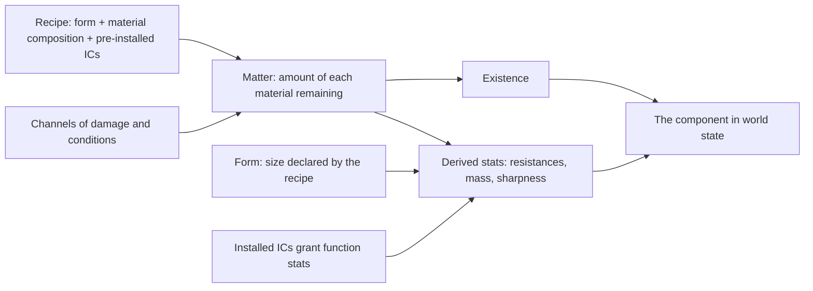

# 🧬 Basic Traits & Stats — Spec

> **Status:** agreed design, branch `basic-traits-&-stats`. This document records the **why** of the basic trait/stat set of the world.
> **Values** are data-driven and live in `data/*.json`. **Names** (groups, stats, flags, conditions, channels) live in [`shared/StatVocabulary.js`](shared/StatVocabulary.js:24), which remains the single source of truth for the shared vocabulary — the data files must match it, never the other way around.

---

## 1. Why a basic set now

The world grew three overlapping ways of giving meaning to a component: hand-tuned numbers in blueprints, material compositions that derive a few stats, and per-instance mutable stats for equipped items. That produced three failures:

- **Arbitrary stats.** Values such as a hand's strength exist in blueprints with no traceable cause. Adding iron to a wooden part changes nothing, so material composition feels decorative.
- **Split health.** `durability` plays the role of health for damage, while the materials (what the component is made of) sit inert. The break condition has nothing to do with what the component is made of.
- **Vocabulary drift.** The shared stat vocabulary covers only a subset of the stats that actually appear in data, and a synergy cap already references a stat that was never defined — the drift is real, not hypothetical.

The basic set fixes the foundation with one sentence: **a component is matter, shaped, and given function — and everything it is can be traced to those three sources.**

---

## 2. The model

A recipe declares structure (form, composition, pre-installed organs). Matter is the only thing that depletes. Stats are re-derived from matter, form, and organs; they are never stored as independent adjustable numbers. Conditions and channels act on matter, and everything downstream follows from that.

---

## 3. Design decisions

### D1 — The blueprint is a recipe, not a stat sheet

A blueprint (component or item) declares exactly three things: **form** (size/volume), a **composition** of a variable number of distinct materials, and **which ICs are pre-installed**. It no longer declares stat values. Positioning offsets move out of the trait contract into form data.

**Why.** Hand-tuned per-component values are an N×M tuning matrix (material × stat) that does not scale — the same problem the material system already solved for its own layer. More importantly, arbitrary values make composition feel decorative: two parts with identical recipes but different matter should be *different in the world*, and every number a player can see must have a cause they can investigate. This generalizes the existing merge pipeline: the "blueprint override" layer stops being a source of values and becomes a source of structure, which also retires the global-defaults mold (a global default would resurrect the "phantom stat" problem the key-set merge rule was introduced to prevent).

### D2 — Existence is life, and life is matter

Every component has **existence**, a ratio from 0 to 1 reflecting how much of its original matter remains. When existence reaches zero — all matter gone — the component **ceases to exist**: it is removed from its entity, and whatever matter still has shape drops as **salvage**.

**Why.** This is a scrap world: a component dying by losing what it is made of is the theme, and it makes damage legible — the composition visibly thins instead of an opaque health bar dropping. It also removes a known bug class: health and material were two stores describing the same thing, and the project has already paid for dual-state desynchronization (see BUG-017). With existence derived from matter there is exactly one store, so save/load and client/server sync stay trustworthy by construction.

### D3 — Damage has a channel, and matter decides what it costs

Damage arrives with a **channel**: cut, impact, wear, heat, electricity, corrosion. Consumption proceeds **one material at a time**, starting with the material least resistant to that channel; a highly resistant material absorbs the same damage with almost no loss (a cut is trivial on iron, fatal on a cable).

**Why.** Channels make material identity matter in combat and let the **composition evolve**: a component can lose its iron and keep its wood, so its derived stats change before it dies — identity drift is emergent, not scripted. The six existing material properties map one-to-one onto the six channels (three as resistance, three as susceptibility inverted at conversion), so no new material science is invented; the mapping table stays the single balance lever, per the material system's three-layer separation.

### D4 — Every stat has exactly one source: matter, form, or function

- **Matter** gives: the six channel resistances, mass (from density and size), and sharpness — a depletable quality of the edge material.
- **Form** (recipe) gives: volume/size.
- **Function** (ICs) gives: strength, move, fine_controls, think_level.

**Why.** One source per stat means there is never ambiguity about why a number has the value it has, and derivation stays a pure function: the same composition and organs always yield the same stats, which is what makes the state serializable and syncable without drift. A component with matter but no organs is **inert** — it resists, it weighs, it can be cut, but it does not punch, walk, grip, or think. Function requiring organs is what makes ICs the game's upgrade path.

### D5 — ICs are atomic organs defined in data

An IC is identified by a type whose full effect is declared in data: which function stats it grants, what it weighs, what it does over time. ICs do not carry their own material composition in the basic set.

**Why.** Atomic organs keep the basic set small and the derivation pipeline one level deep; recursion (organs made of matter) is a Phase-2 extension the same architecture already supports. Their values live in data, which honors "no arbitrary stats": the rule forbids hand-tuned numbers in blueprints and in code; the data file remains the balance lever, exactly as with materials. Existing organs already fit this shape (a strength-granting core, a repair sphere, a speed core) and the repair organ closes the world's loop: it converts salvage back into existence.

### D6 — Weight is felt, and carrying has a price

An equipped item is a **small component** — its own matter, organs, and existence — that is **never merged into the host**. Equipping is gated on the host being able to bear the mass; the total mass carried reduces the host's effective output of the function stats carrying costs most (move and fine_controls).

**Why.** This preserves the existing separation (using a knife degrades the knife, not the hand) while giving mass gameplay meaning beyond an inventory constraint: a droid stuffed with organs and gear gets slower and clumsier — the physical price of ambition. It also folds the current per-item holding-cost debuff list into the same mass-based logic, so a single lever (mass) explains the burden instead of a hand-tuned list.

### D7 — Named traits gate and mark; they do not patch numbers

The basic named traits are **flags** — `flammable` and `conductive`, derived whenever a material property crosses a declared threshold; `corrosive`, granted by a specific IC — plus transient **conditions** — `burning`, `wet`, `corroded` — stored per instance in world state. Flags decide *which* channels and interactions apply to a component; conditions apply damage over time (a burning component loses matter to the heat channel; a corroded one loses matter with no attacker at all).

**Why.** If a trait could add or multiply a stat value, stats would again have two sources and the derivation invariant would die. Gating channels keeps every number traceable to matter and organs while making the *interaction* between components rich: a flammable component in fire, a conductive one in a shock, a corrosive one touching iron. Flags are derived on read — they can never desync from the matter that causes them. Conditions are stored because they are *events that happened*, they must survive save/load, and they must be visible to the client and the LLM context.

### D8 — Synergy stays

The synergy engine (multipliers from multiple bound components cooperating on one action) is kept as-is; only the reference to the never-defined stat in the punch cap is corrected as part of the migration.

**Why.** Synergy is orthogonal to derivation: it shapes *action output* from *component cooperation*, not the components themselves. Rewriting it would add risk without new expressive power for the basic set; "same-material resonance" remains a candidate for a later phase.

### D9 — The entity is the aggregate of its components

No new entity-level stats are introduced. An entity's health and capability are what its components' existence and stats already express.

**Why.** The existing broken-component removal pipeline already gives the world its notion of injury and death. Adding a parallel entity-level health store would recreate the dual-store desynchronization class this spec exists to remove.

---

## 4. The basic set

**Stats** — name, source, meaning:

| Stat | Source | Meaning |
|------|--------|---------|
| `existence` (0–1) | matter | how much of the original matter remains; zero means the component is gone |
| six channel resistances (cut, impact, wear, heat, electricity, corrosion) | matter | how much damage of each channel the composition absorbs |
| `mass` | matter | heaviness; the currency of carrying |
| `sharpness` | matter | the edge the composition holds; depletes as edge matter is consumed |
| `volume` | form | size; what fits where |
| `strength` | IC | force: impact damage, what can be carried |
| `move` | IC | autonomy: how fast it moves, and initiative order |
| `fine_controls` | IC | precision: fine handling, crafting quality |
| `think_level` | IC | cognition: how much the NPC's AI can hold |

**Flags** (derived or organ-granted; gate channels, never patch numbers): `flammable`, `conductive`, `corrosive`.

**Conditions** (stored per instance, transient, visible to client and LLM): `burning`, `wet`, `corroded`.

**Channels** (damage types): cut, impact, wear, heat, electricity, corrosion.

**Scales.** The world already speaks two scales and the basic set keeps both: **0–100** for every material property and for every derived or organ-granted stat (the existing convention across data files), and **0–1** for existence, because existence is a *ratio of matter*, not a tuned quantity. These are carried over from the existing data, not newly invented; if a different range is wanted later, only data files change.

**Vocabulary.** Every name above — groups, stats, flags, conditions, channels — is declared in the shared vocabulary module, the only place those strings are defined; both layers import from it so a spelling can never drift. All values (what an organ grants, thresholds, weights) live in `data/*.json` and are loaded and validated through the existing data-loading standard.

---

## 5. What this deliberately does not include

- Crafting, turns, and LLM systems are untouched; their contracts change only where they read stats, through the same vocabulary.
- Entity-level health or initiative as first-class stats (see D9).
- Environment/room traits (wet rooms, fire zones) — Phase 2.
- Non-linear material interactions beyond what channels already express (wet wood, rusting pairs) — Phase 2.
- Recursive ICs (organs with their own matter) — Phase 2.

---

## 6. Impact on existing documentation and data (informational)

This design diverges from the current documentation. After implementation, the following must be updated, with this spec as the reference:

- [`wiki/subMDs/data/traits.md`](subMDs/data/traits.md:1) — the four-layer merge is replaced by the recipe → derivation model.
- [`wiki/subMDs/data/materials.md`](subMDs/data/materials.md:100) — its "Phase 2 (Deferred)" items (separate resistance stats, channel-based damage) become the core of this design.
- [`wiki/subMDs/data/holding_cost.md`](subMDs/data/holding_cost.md:1) — the debuff model is replaced by mass-based burden.
- [`wiki/map.md`](map.md:113) — the data-file table entries.

Data migration is a follow-up implementation task, not part of this spec: the global-mold file, the component and item definitions, the holding-cost, synergy, internal-component, and mapping files, and the shared vocabulary module all move to the new vocabulary. The contract tests encoding the old invariants (durability crossing zero → break) are the ones that change most.
