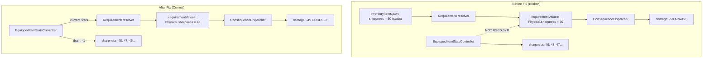

# BUG-099: Knife Cut Damage Always Uses Base Sharpness (50), Ignoring Sharpness Drain

- **Severity**: HIGH
- **Status**: ✅ Fixed
- **Fixed In**: `pending`
- **Related Files**: `src/controllers/actions/RequirementResolver.js`, `src/controllers/actions/actionController.js`, `src/controllers/WorldStateController.js`

## Symptoms

When the knife is equipped (sharpness = 50 from `inventoryItems.json`):
- **First cut**: Deals 50 damage ✓ (sharpness is 50)
- **Second cut**: Deals 50 damage ✗ (sharpness is actually 49, but still deals 50)
- **Subsequent cuts**: Always deal 50 damage ✗ (sharpness keeps draining to 48, 47, etc., but damage never changes)

The sharpness drain consequence (`-1` per cut) works correctly — the stats ARE updated in `EquippedItemStatsController`. However, the **damage calculation** always reads the base value (50) from `inventoryItems.json` instead of the current mutable value.

## Root Cause

When executing an action with an equipped item, the `RequirementResolver` built `requirementValues` from the **static** `inventoryItems.json` definition instead of the **mutable** `EquippedItemStatsController` store.

### Flow Breakdown

1. **Requirement check** (`RequirementResolver.checkComponentRequirements`):
   - Reads traits from `inventoryItems.json` → `Physical.sharpness = 50` (static base)
   - `requirementValues = { "Physical.sharpness": 50 }`
   - `fulfillingComponents = { "Physical.sharpness": "abc-knife" }` (itemId)
   - Requirement passes: 50 ≥ 20 ✓

2. **Consequence resolution** (`ConsequenceDispatcher._resolveParams`):
   - Merges `requirementValues` into resolution context: `{ "Physical.sharpness": 50 }`
   - Damage: `"-:Physical.sharpness"` → `-50` (always 50 damage!)
   - Sharpness drain: `value: -1` → sharpness becomes 49 in `EquippedItemStatsController` ✓

3. **Next cut**: Steps 1-2 repeat with the **same** base value (50) because `RequirementResolver` always reads from the static definition.

### Code-Level Root Cause

**`RequirementResolver.js`** (before fix), lines 65-89:
```javascript
// For equipped items: ALWAYS read from inventoryItems.json (static)
componentStats = equippedData.traits; // ← sharpness = 50 always
```

The mutable sharpness stored in `EquippedItemStatsController` was **never read** during requirement validation. The drain was applied there, but the value was never used for damage calculation.

## Fix

Three coordinated changes were made:

### 1. `src/controllers/WorldStateController.js`
Moved `EquippedItemStatsController` creation **before** `ActionController` instantiation, so it can be injected down the dependency chain. Removed the duplicate creation that was later in the constructor.

```javascript
// 6.5. Create EquippedItemStatsController BEFORE ActionController
const equippedItemStats = new EquippedItemStatsController({ worldStateController: this });
this.equippedItemStats = equippedItemStats;

// 7. Pass equippedItemStats to ActionController
const actionController = new ActionController(
    this, consequenceHandlers, actionRegistry,
    componentCapabilityController, synergyController,
    actionSelectController, equippedItemStats  // ← NEW 7th parameter
);
```

### 2. `src/controllers/actions/actionController.js`
Accept `equippedItemStats` as 7th parameter and pass it to `RequirementResolver`:

```javascript
constructor(worldStateController, consequenceHandlers, actionRegistry,
    componentCapabilityController, synergyController, actionSelectController, equippedItemStats) {
    this.requirementResolver = new RequirementResolver(worldStateController, equippedItemStats);
}
```

### 3. `src/controllers/actions/RequirementResolver.js`
Inject `equippedItemStats` in constructor and use it to read **current mutable stats** instead of static definition:

```javascript
constructor(worldStateController, equippedItemStats) {
    this.worldStateController = worldStateController;
    this.equippedItemStats = equippedItemStats || null;
}

// In checkComponentRequirements():
if (this.equippedItemStats?.hasStats(itemId)) {
    const currentStats = this.equippedItemStats.getStats(itemId);
    if (currentStats) {
        componentStats = currentStats; // ← Current sharpness: 49, 48, 47...
    } else {
        componentStats = equippedData.traits; // fallback to static
    }
}
```

## Prevention

When modifying how values flow from requirement checking to consequence resolution:
1. **Verify the data source**: Are you reading from the mutable stats store (`EquippedItemStatsController`) or the static definition (`inventoryItems.json`)?
2. **Trace placeholder resolution**: Ensure `requirementValues` reflects the same source as the actual mutable state.
3. **Test with drain effects**: After implementing or modifying a consequence that drains a stat, verify that repeated executions use the **current** value, not the base value.

## Mermaid Flow



## References
- Related wiki: `wiki/subMDs/controllers/requirement_resolver.md`
- Related controller: `RequirementResolver`, `EquippedItemStatsController`
- Related bug: [BUG-096](high/BUG-096-knife-sharpness-drain-not-working.md) — sharpness drain not applied at all
- Related bug: [BUG-097](high/BUG-097-cut-action-disappears-after-use.md) — capability cache staleness