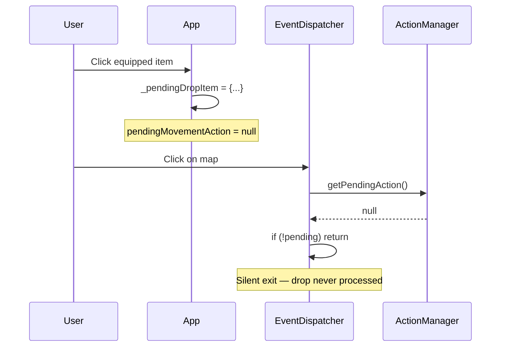

# BUG-077: Drop Item — Map Click Silent Failure (Pending Drop Action Never Dispatched)

- **Severity**: MEDIUM
- **Status**: ✅ Fixed
- **Fixed In**: `pending`
- **Related Files**: `public/js/EventDispatcher.js`, `public/js/App.js`

## Symptoms

When the user clicks on an equipped item (🔪 knife icon), a red dashed circle appears showing the drop range calculated as `3 + (max_strength × 2)`. However, clicking within the circle does nothing — the item is never dropped.

## Root Cause

The map click handler in `EventDispatcher.setupMapClickListener()` uses `getPendingAction()` to check if there's an active targeting action. For drop items, the pending state is stored in `App._pendingDropItem` (not in `ActionManager.pendingMovementAction`), so `getPendingAction()` returns `null` and the handler returns early at line 121 without ever processing the drop click.



## Fix

### 1. `public/js/EventDispatcher.js` — Added drop item state checking

Modified `setupMapClickListener()` to accept an optional `options` parameter with:
- `hasPendingDropAction()` — callback to check if a drop item action is pending
- `onDropItemClick(targetX, targetY)` — callback invoked when map is clicked during drop item pending state

The drop item check runs **before** the regular `getPendingAction()` check, ensuring drop item clicks are prioritized over regular spatial targeting.

```javascript
setupMapClickListener(mapElement, getPendingAction, options = {}) {
    const clickHandler = (event) => {
        // Check for pending drop item FIRST
        const hasPendingDrop = options.hasPendingDropAction?.();
        if (hasPendingDrop) {
            // Transform coordinates and call onDropItemClick
            const pt = mapElement.createSVGPoint();
            pt.x = event.clientX;
            pt.y = event.clientY;
            const svgP = pt.matrixTransform(mapElement.getScreenCTM().inverse());
            const targetX = svgP.x - this.config.VIEW.CENTER_X;
            const targetY = svgP.y - this.config.VIEW.CENTER_Y;
            if (options.onDropItemClick) {
                options.onDropItemClick(targetX, targetY);
            }
            return;
        }
        // ... rest unchanged
    };
}
```

### 2. `public/js/App.js` — Passed `hasPendingDropAction` callback

Added `hasPendingDropAction` callback to the `setupMapClickListener` options:

```javascript
this.dispatcher.setupMapClickListener(
    map,
    () => this.actions.getPendingAction(),
    {
        hasPendingDropAction: () => this._pendingDropItem !== null,
        onDropItemClick: (targetX, targetY) => {
            const pending = this._pendingDropItem;
            if (pending) {
                const droid = this.worldState.getActiveDroid();
                const state = this.worldState.getState();
                this.executor.executeDropItem(pending, targetX, targetY, droid, state);
                this._pendingDropItem = null;
                this.ui.renderRangeIndicator(droid, 0, 'red', 'drop');
            }
        }
    }
);
```

## Prevention

When adding new targeting modes that use separate pending state (outside of `ActionManager.pendingMovementAction`), the `setupMapClickListener` callback must be updated to check and route to those states before the default `getPendingAction()` check.

## References

- Related wiki: `wiki/subMDs/frontend/client_action_execution.md`
- Related controller: `ActionManager`, `EventDispatcher`
- Related feature: `ActionExecutor.executeDropItem()`