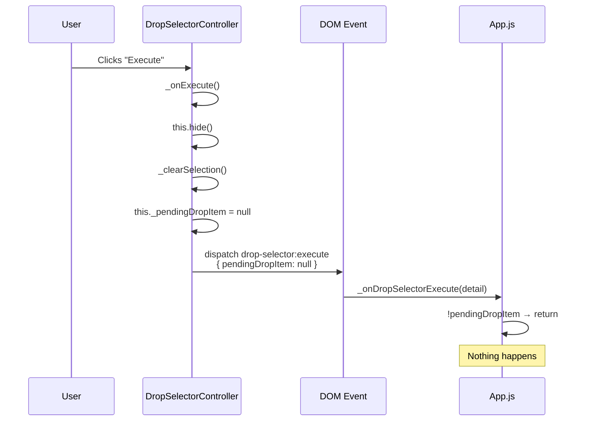

# BUG-080: Drop Selector Execute — Multiple Bugs in Drop Item Flow

- **Severity**: MEDIUM
- **Status**: ✅ Fixed
- **Fixed In**: `pending`
- **Related Files**: See below

## Symptoms

When the user clicks to drop an item from the inventory panel, selects components in the drop selector, and clicks "Execute", nothing happens. The item is not dropped.

## Related Bugs and Fixes

### 080-A: Execute Does Nothing — pendingDropItem Cleared Before Dispatch

- **Severity**: MEDIUM
- **File**: `public/js/DropSelectorController.js` (lines 243-261)

**Root Cause:** `hide()` → `_clearSelection()` nullifies `_pendingDropItem` before event dispatch.

**Fix:** Capture state in local variables before `hide()`.

### 080-B: Drop Out of Range — Coordinate System Mismatch

- **Severity**: MEDIUM
- **File**: `public/js/ActionExecutor.js` (lines 239-242)

**Root Cause:** `executeDropItem()` mixed screen-absolute droid position with world-relative target coordinates.

**Fix:** Use world-relative droid position (`droid.spatial.x`, `droid.spatial.y`).

### 080-C: Placeholder `:entityId` Never Resolved

- **Severity**: MEDIUM
- **File**: `src/controllers/consequences/ConsequenceDispatcher.js` (line 58), `src/utils/PlaceholderResolver.js`

**Root Cause:** `_resolveParams()` was called with raw `params` (no entityId) instead of `context.actionParams`. Additionally, `PlaceholderResolver` only matched `:Trait.stat` patterns (with dot), never simple `:variable` names.

**Fix:** Pass `context.actionParams` to resolver. Extended regex to `:[a-zA-Z0-9_.]+`.

### 080-D: DropItemHandler Only Checks Equipped Items

- **Severity**: MEDIUM
- **File**: `src/controllers/consequences/DropItemHandler.js` (lines 57-79)

**Root Cause:** Handler only checked `getEquippedItems()`, but items in inventory are not automatically equipped. Test items spawn in inventory without being equipped.

**Fix:** Check equipped items first, then fall back to `getEntityItems()` for inventory items. Unequip only if equipped.

```js
_onDropSelectorExecute(detail) {
    const { pendingDropItem, componentIds } = detail;
    if (!pendingDropItem) return;  // ← Early return, silently does nothing
```



## Fix

Capture `this._pendingDropItem` and `_selectedComponentIds` in local variables **before** calling `this.hide()`:

```js
_onExecute() {
    if (this._selectedComponentIds.size === 0) {
        console.warn('[DropSelectorController] No components selected.');
        return;
    }

    // Capture state BEFORE hiding — hide() calls _clearSelection() which nullifies _pendingDropItem
    const pendingDropItem = this._pendingDropItem;
    const componentIds = Array.from(this._selectedComponentIds);

    console.info(`[DropSelectorController] Execute clicked with ${componentIds.length} component(s).`);

    this.hide();

    document.dispatchEvent(new CustomEvent('drop-selector:execute', {
        detail: {
            pendingDropItem,
            componentIds
        }
    }));
}
```

## Prevention

- When a method clears internal state (e.g., `_clearSelection()`) and the result needs to be used after that call, capture values in local variables first.
- Document the side effects of methods like `hide()` that mutate internal state.

## References
- Related wiki: `wiki/subMDs/frontend/client_action_execution.md`
- Related controller: `DropSelectorController`