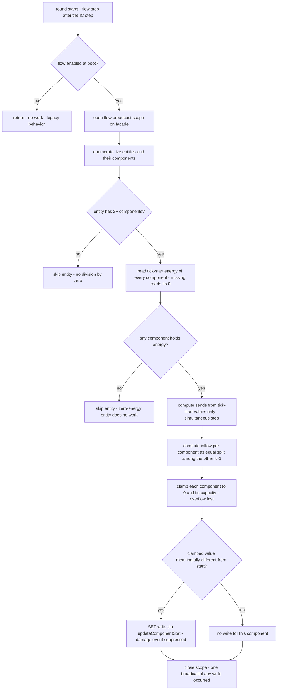

# Energy Flow — Design Specification

**Status:** Approved design — implementation-ready for the Code sub-task. **Superseded in part by [`wiki/turn_driven_ic_and_flow_spec.md`](turn_driven_ic_and_flow_spec.md):** the flow no longer runs as a registered `energy-flow` tick job (id/interval/order, decision row 2) but as a per-turn step invoked from the turn-start hook after the IC step. The flow math, the epsilon no-op guard, the capacity/overflow rules, and the one-broadcast-per-turn mitigation are unchanged; only the driving cadence moved from the tick loop to the round-start hook. Where a decision below is superseded, it is marked.

**Further superseded by a data change (post-implementation):** the energy mechanic was *removed from the shipped data* — the `energyFlow` rule no longer exists in `data/world_rules.json`, and the `coalGenerator` organ is inert (empty `overTime` and `grants`). The system is therefore off in every shipped world: the per-turn flow step no-ops, nothing is ever charged, and nothing is redistributed. The code path is intact and re-activatable by re-adding the rule to the data (pinned in `test/contract/energyFlow.contract.test.js`, scenario (e), together with the off state). Every energy / coal-generator reference below describes the pre-removal shipped state; the off-by-data state is pinned by `test/contract/coalGenerator.contract.test.js` and `test/contract/energyFlow.contract.test.js`.

**Scope:** Design only. No source code, data file, or test is written by this sub-task; the only deliverable is this file.
**Locked requirements (agreed upstream — restated here verbatim in §2):** energy is a component stat; all components of one entity form one fully-interconnected network; every tick each component sends a fixed data-driven percentage (working default 10%) of its current energy, divided equally among all OTHER components of that entity; each component absorbs only up to its remaining capacity, overflow is lost for that tick; scope is pure flow/redistribution — no gameplay effects.

The system is the "blood system" of the component world: energy charged in one place (today, the M1 body's coal generator) circulates through the whole body and gradually equalizes toward a uniform distribution, with capacity-limited absorption and per-tick overflow loss. It is a cross-component coordination mechanic, not an organ effect.

---

## 1. Verified mechanisms (evidence from the current codebase)

| # | Mechanism | Where verified | Fact the design relies on |
|---|-----------|----------------|---------------------------|
| 1 | Per-component dynamic stat store | [ComponentStatsController.js:9](src/controllers/core/ComponentStatsController.js#L9) | `componentStats` is `{ [componentId]: { [traitGroup]: { [stat]: value } } }`, deep-merged on write, deep-copied on read. Any stat stored here — including `Physical.energy` — survives `serialize()`/`restore()` with **no schema change** (snapshot field `components` at [WorldStateController.js:1003](src/controllers/WorldStateController.js#L1003)). |
| 2 | Stat mutation surface | [ComponentController.js:164](src/controllers/core/componentController.js#L164), [:193](src/controllers/core/componentController.js#L193), [:227](src/controllers/core/componentController.js#L227) | `updateComponentStat` is a semantic SET (creates a missing trait group, returns true); `updateComponentStatDelta` **silently no-ops when the stat does not already exist as a number** — components never seeded with `energy` would ignore deltas; only SET reaches them. |
| 3 | Damage side-effect of SET | [ComponentController.js:178](src/controllers/core/componentController.js#L178) | Every strict decrease via SET fires the damage-listener list. The facade routes that list to the `onDamage` world-event rule (probabilistic material chunk drop on *any* weakening, source-agnostic). A per-tick energy drain would be misread as damage — flow writes must opt out (see §5.3). |
| 4 | Stat-change broadcast coupling | [WorldStateController.js:205](src/controllers/WorldStateController.js#L205), [:248](src/controllers/WorldStateController.js#L248) | Each component stat write fires the facade's stat-change listener, which re-evaluates capabilities and calls `broadcastService.broadcast()` — unless a suppression counter is active. The counter precedent (`_cascadeReentrancyCount`, incremented at [:2802](src/controllers/WorldStateController.js#L2802), gated at [:248](src/controllers/WorldStateController.js#L248)) already suppresses intermediate broadcasts for a single final one. |
| 5 | Broadcast service has NO coalescing | [WorldStateBroadcastService.js:28](src/services/WorldStateBroadcastService.js#L28) | `broadcast()` performs a full `getAll()` snapshot + typed-ID transform + `io.emit` + info log **per call**. Up to one full-state emit per written stat — a 23-component flow tick could emit 23 full states. One explicit mitigation is required (§6). |
| 6 | Fixed-timestep tick jobs | [UniversalTickSystem.js:33](src/utils/UniversalTickSystem.js#L33) | Jobs are `{ id, callback, interval, order }`, due when `currentTick % interval === 0`, sorted by `order`, each executed in its own try/catch (job failure is logged and isolated — the tick and all other jobs continue). Started at [server.js:95](src/server.js#L95). |
| 7 | Existing job orders | [InternalComponentController.js:58](src/controllers/core/InternalComponentController.js#L58), [TurnSystemController.js:214](src/controllers/core/TurnSystemController.js#L214) | `'internal-components'` runs every tick at **order 0** (organ stat effects, incl. coal-generator charging); `'turn-system'` at **order 1**. Both register their job in an `initialize()` called from the facade constructor ([WorldStateController.js:265](src/controllers/WorldStateController.js#L265), [:271](src/controllers/WorldStateController.js#L271)). |
| 8 | Component → entity mapping | [WorldStateController.js:2515](src/controllers/WorldStateController.js#L2515) | Components carry no back-reference; the entity record owns `components` (each entry has `type` and `id`). All live entities are enumerable from the entity store per tick; the entity record is the authority on which components exist. |
| 9 | Wire vocabulary | [StatVocabulary.js:93](shared/StatVocabulary.js#L93) | `STAT_NAMES.ENERGY = 'energy'` already exists (trait group `Physical`); scale convention 0–100. No vocabulary change needed. The flow references the shared constants, never string literals. |
| 10 | Energy today is charge-only | [data/internalComponents.json:83](data/internalComponents.json#L83), [data/components.json:93](data/components.json#L93) | `coalGenerator` seeds `Physical.energy` at 0, burns 1 coal per 5 ticks for +10, clamped at its own `energyCapacity: 100` (organ-owned lever). Installed on `m1CentralBody` only. **No flow/redistribution logic exists anywhere** — clean slate. |
| 11 | World-rules layer contract | [WorldRulesController.js:104](src/controllers/worldRules/WorldRulesController.js#L104), [:154](src/controllers/worldRules/WorldRulesController.js#L154), [:299](src/controllers/worldRules/WorldRulesController.js#L299) | Missing/malformed file → all rules off, warn, never crash. Unknown key → ignored with warn. Known key → per-key validation; the current `_validateRuleConfig` is `damageTornMaterial`-specific (requires `percent`), so a new key with a different field shape needs its own validation branch in the per-key dispatch. Inspection is via `getRule(key)` / `isRuleActive(key)` — no I/O, defensive copies. |
| 12 | Recipe model | [data/components.json:2](data/components.json#L2) | Recipes declare FORM, material COMPOSITION, and pre-installed organs — and **no stat values**: stat values have exactly one source (matter/form/organs) so derivation stays single-sourced. A capacity *bound* is not a stat value (it is a ceiling, not an initial value) — the organ's own `energyCapacity` is the precedent for a bound living in data. |
| 13 | Contract-test template | [coalGenerator.contract.test.js:36](test/contract/coalGenerator.contract.test.js#L36), [:47](test/contract/coalGenerator.contract.test.js#L47) | `buildWorldState(new UniversalTickSystem(MAX))` (not started) → spawn blueprint in `start_room` → drive a job by id at an absolute tick (`tick.currentTick = N; job.callback()`), pinning data-file numbers as the contract. Stats read via `world.getComponentStats(compId)`. |
| 14 | Degradation test pattern | [worldRulesOnDamage.contract.test.js:30](test/contract/worldRulesOnDamage.contract.test.js#L30) | "File really missing" is tested by rename-based file swap (the suite runs test files serially), then asserting the world builds and behavior is bit-identical to legacy. |

---

## 2. The flow mechanic (locked semantics)

### 2.1 The network

Every entity is exactly one flow network: **all of its components are fully interconnected** (body-like — any component can send to and receive from any other component of the same entity). There is no per-component adjacency graph, no spatial coupling, no cross-entity flow. Rationale: the locked requirement defines connectivity at entity granularity, the component model has no component-to-component links to derive a graph from, and an entity-wide uniform distribution is the "blood" behavior being modeled. An entity with fewer than two components is a network that cannot circulate — it is a no-op (no division by zero, no reads beyond enumeration, no writes).

### 2.2 The simultaneous step

Flow is a **read-all, compute, then write-all** step. Within one tick the controller first reads every component's tick-start energy, computes every send and every inflow from those tick-start values only, and only then applies the results. No component's write feeds another component's send in the same tick. Rationale: simultaneity makes the step order-independent and commutative (no artifact of which component is processed first), matches the physical "circulation" model, and keeps the per-tick math a single closed-form pass rather than an iterative simulation.

### 2.3 Send, absorb, clamp, loss

For each component `c` of an entity with `N ≥ 2` components, where `start(c)` is the tick-start energy (a missing or non-numeric stat reads as 0), `cap(c)` is its capacity (§4), and `share` is the per-tick pump percentage from data (§4):

- `send(c) = share × start(c)`.
- The send is divided **equally among the other N−1 components**: each other component `o` receives `send(c) / (N−1)`.
- `inflow(o) = Σ send(c) / (N−1)` over all `c ≠ o`.
- `raw(o) = start(o) + inflow(o) − send(o)`.
- `new(o) = clamp(raw(o), 0, cap(o))` — bounded below at 0 (defensive; energy is never negative in this dynamic) and above at the component's capacity.

Overflow above capacity is **lost for that tick and not re-routed** (locked). The lower bound and the upper bound are the only losses: with no clamping, the step conserves the entity's total energy exactly (the sends and inflows cancel), so total energy in an entity never increases and decreases only when a clamp discards it. Rationale for non-re-routing: re-routing turns one closed-form pass into an iterative solver and makes per-tick behavior order-dependent; loss is the honest physical reading of "the receiver was already full."

### 2.4 The no-op write rule

A component is written **only if its clamped new value meaningfully differs from its tick-start value**. "Meaningfully" = the absolute difference exceeds a named file-level constant `FLOW_NOOP_EPSILON` (1e-9, defined once at the top of the flow controller, scale-relative: 1e-9 on a 0–100 scale is below any visible change but far above accumulated floating-point error). A component whose tick-start stat is absent and whose computed value is 0 is not written (0 is the read-equivalent of absent). Rationale: (a) steady-state and zero-energy entities must perform zero stat writes — every write fans out to capability re-evaluation and (without §6's batching) a full-state broadcast; (b) without the epsilon, an entity already equilibrated at the uniform point would still emit a write every tick, because the per-pair share `send/(N−1)` does not round-trip exactly and the recomputed value differs at the last ulp — the epsilon is what makes "already equal" mean zero work.

### 2.5 Invariants (derived, tested as properties)

- Total entity energy is **non-increasing** every tick (loss only at clamps).
- The distribution is **contractive toward the uniform interior point** bounded by capacities: it never oscillates, and with no capacity hits and no external charging it converges to exactly the mean. (The step is the graph-Laplacian dynamics of a complete graph; capacities only pin components at the boundary.) With uniform capacities the upper clamp is a guard, not a driver — it discards energy only when a component sits at its cap while others push above it (heterogeneous-capacity configurations, future tuning).
- No component ever reads, holds, or is written a value outside `[0, cap(c)]` after a tick.

---

## 3. Placement, wiring, and the tick job

### 3.1 A new logic controller, not an extension

New file: `src/controllers/core/EnergyFlowController.js` — a **logic controller** (computation/coordination; owns no persistent world data; never appears in the broadcast `subControllers` map, same exclusion rule as `WorldRulesController` and the on-damage listener).

Why not extend `InternalComponentController`: flow is not an organ effect. The IC controller is a state owner for organ *instances* keyed to host components; flow owns no instances, iterates whole entities, and would need no IC state at all. Merging them would re-couple two SRPs the internal-components system already documents as separate, and would make "organs" carry a cross-cutting world law. Why not `WorldStateController`: the facade is the composition root and orchestrator — adding a per-tick mechanic there is exactly the god-class growth the FASE split is eliminating. Why not the entity or component controller: they are pure state stores; flow performs entity-wide coordination reads plus writes.

### 3.2 Dependency shape (constructor-based root, one-way flow, public API only)

The controller is constructed by the composition root (`src/composition/WorldComposition.js`, which already holds every dependency in scope) with three named constructor dependencies, in this order:

1. `tickSystem` — the global `UniversalTickSystem` (for job registration, mirroring the IC and turn controllers).
2. `componentRegistry` — the already-loaded `data/components.json` object (one load, N readers; used only to resolve the optional per-recipe `energyCapacity` bound — never for stat values, which the recipe model forbids).
3. `worldRulesController` — the layer-0 rules owner (read via `getRule('energyFlow')`; the flow reads the rule, never the file).

The facade reference is injected after construction via a `setWorldStateController(worldStateController)` setter, called from the composition root's post-construction wiring step (the same step that injects the facade into the IC and turn controllers). This ordering is load-bearing: the facade constructor runs before the composition root's wiring step, so any job callback (which runs only after the tick system starts, i.e. after wiring) resolves the facade lazily and never dereferences it at construction time — the identical pattern both peer controllers already use.

Through the facade the flow uses only public surfaces: the entity store's live-entity enumeration (public field, as the IC controller already does), the facade's `getComponentStats(componentId)` reader, and `componentController.updateComponentStat(...)` for SET writes. It never touches another controller's private state, and never reads the IC controller's organ-owned `energyCapacity` (that field is the generator's *charge* clamp — a different lever; consulting it would give the stat two capacity sources).

### 3.3 The tick job

| Attribute | Value | Rationale |
|---|---|---|
| id | `energy-flow` | Stable, discoverable by id in tests (the contract template finds jobs by id). |
| interval | `1` (every tick) | Locked: flow runs every tick. |
| order | `2` | Strictly after `internal-components` (0) so coal-generator charging lands in the tick-start read before flow redistributes it; strictly after `turn-system` (1) so round-start, turn-driven stat effects (including any future energy-maintaining organ effects) settle before flow acts. Order 2 is the lowest integer after both — flow never interleaves with action resolution (which executes inside the order-1 turn job) and no job is ever reordered by an unmodeled tie. |
| registration | `initialize()` on the controller, called from the facade constructor immediately after the turn system's `initialize()` call ([WorldStateController.js:271](src/controllers/WorldStateController.js#L271)) | Identical lifecycle to both peers: side-effect-free until the tick system starts; null-tolerant in hand-built test facades. |

`initialize()` does three things at boot, in order: (1) resolves the `energyFlow` rule config once (rules are static per world — the data files are only ever loaded at boot — so a boot-time read is both sufficient and cheaper than a per-tick read); (2) fail-soft-validates the optional per-recipe `energyCapacity` fields in the injected registry (present-but-malformed → warn once per recipe and ignore the field, falling back to the rule default — never a boot failure, matching the world-rules degradation discipline); (3) logs **one** `Logger.info()` line (enabled: the share, the default capacity, the recipe-override count; or disabled: the reason, "legacy behavior — no flow"). **SUPERSEDED as written** — the flow registers no tick job; its per-turn step is `processFlowTurn(round)`, invoked from the turn system's round-start hook.

**Failure isolation needs no new code:** the tick system already executes each due job in its own try/catch ([UniversalTickSystem.js:89](src/utils/UniversalTickSystem.js#L89)), so an unexpected throw inside a flow step is logged and the tick — and the IC and turn jobs — continue. The flow additionally wraps its step in `begin → work → finally close` so the broadcast scope (§6) always closes, even on an internal exception; a partially-written step then broadcasts exactly once with the partial state, which is the correct representation of what actually happened.

---

## 4. Data levers

| Lever | Home | Shipped value | Fallback | Validated where |
|---|---|---|---|---|
| `sharePerTick` — the per-tick pump percentage | `data/world_rules.json`, new rule key `energyFlow` | `0.10` | none — if the rule is absent the flow is fully off (not "off with a default") | `WorldRulesController._validateWorldRules()` — new per-key branch |
| `defaultEnergyCapacity` — the capacity bound when a recipe declares none | same rule key | `100` | same as above | same |
| `energyCapacity` — per-component capacity bound (optional) | `data/components.json`, recipe field | no recipe sets it at launch | the rule's `defaultEnergyCapacity` | fail-soft at flow `initialize()` (warn + ignore field) |
| `enabled` — optional master switch on the rule | same rule key | absent (defaults true) | — | same |

**Why the world-rules layer for the pump rate.** The pump percentage is a *world law* — "how energy circulates in this world" — not a property of any one component, which is precisely the placement rationale the layer's header documents for `damageTornMaterial` and holding cost. The layer already ships the exact degradation contract the flow needs (missing/malformed → off, warn, never crash — a flow that can't read its config must behave as if it does not exist), it already exposes the inspection API (`getRule`/`isRuleActive`) the flow needs, and registering the key in its known-keys set is the documented extension path. The alternative — a dedicated data file or an env var — would invent a second configuration channel with no reuse of that contract.

**Why per-recipe capacity, and why a bound is not a stat value.** The recipe model's "no stat values" rule protects *derivation*: a stat value has exactly one source (matter/form/organs). A capacity is a *bound on* a stat — a ceiling, not an initial value — so it enters no derivation and creates no second source; the organ-owned `energyCapacity` on `coalGenerator` is the standing precedent for bounds living in data. The home is the **recipe** rather than a `shared/Defaults.js`-style constant because capacity is a form-level physical property (the size of the component's buffer) and the main balance axis is *per-component* tuning (a core holds more than a toe); a constant-only alternative offers no per-recipe override, is no less code than an optional field plus fallback, and forecloses that axis. The optional-field-plus-default design also keeps the launch footprint minimal: **no recipe changes are required at launch** — every M1 component simply inherits the rule default of 100, identical to the generator's charge clamp, so charging and flow agree without any data edit.

**Resolution chain, stated unambiguously:** `cap(c) = recipe(c.type).energyCapacity` when that field is present and validated, else `defaultEnergyCapacity` from the active rule. An explicit recipe value of `0` is a *valid* capacity meaning "this component holds no energy" (§7), not a fallback trigger — only *absence* falls back.

**Degradation contract (never crash, never spam):**

| Condition at boot | Behavior | Log |
|---|---|---|
| `world_rules.json` missing / empty / top-level malformed | all rules off (existing controller contract) → flow fully off | existing single warn + info summary |
| `energyFlow` key absent from an otherwise valid file | flow fully off; every other rule untouched | info summary only (no warn — absence is a legitimate configuration) |
| `energyFlow` present but malformed (non-object config; `sharePerTick` missing / non-finite / outside [0,1]; `defaultEnergyCapacity` missing / non-finite / negative; non-boolean `enabled`) | flow off; every other rule untouched | one warn naming the field (existing per-key discipline) |
| `sharePerTick: 0` or `enabled: false` | flow off **by design** — valid values | no warn (mirrors `percent: 0`) |
| rule active, a recipe's `energyCapacity` present but malformed | that recipe's field ignored, its components use the default | one warn per affected recipe at flow init |

Runtime behavior when off: `processFlowTurn` returns immediately on each round start — no stat work, no entity enumeration, no log line per turn. (**SUPERSEDED as written** — there is no tick job.)

---

## 5. Stat write semantics

### 5.1 SET, not delta

Flow writes with `updateComponentStat` (semantic SET). The delta variant silently no-ops when the stat is absent as a number — and the majority of a droid's components (arms, legs, toes, fingers) are *never seeded* with `energy`, because no organ grants them one. SET is the only mutation surface that both updates an existing value and creates the stat on first absorption.

### 5.2 Who may hold energy

**Every component of an entity may absorb and hold energy, unconditionally** — there is no eligibility filter by type, organ, or recipe field. Stated unambiguously: a component is energy-capable iff it exists on an entity with at least one other component. Rationale: the locked network is all components of the entity, and absorption is "up to remaining capacity" for *each component* — implying every member can hold. Today there is no data signal distinguishing "energy-capable" components (the optional recipe bound is a *capacity*, not an *eligibility* flag), and gating absorption would quietly exclude most of an M1's 23 components from the very equalization the mechanic exists to perform. A component that has never absorbed holds no `energy` key; the flow reads that as 0 and creates the key only when it first absorbs a non-zero amount.

### 5.3 A flow drain is not damage

The SET path fires the damage-listener list on any strict decrease, and the facade routes that list to the `onDamage` world-event rule — which, with the shipped 5% roll, would drop a material chunk of the drained component on every drained tick. A droid whose energy merely *circulates* would shed iron and coal chunks for the rest of its life: a gameplay effect the locked scope explicitly excludes, and a balance violation (the material would be lost while the world state shows no damage anywhere).

The decision: **flow writes suppress the damage event.** Mechanism: `updateComponentStat` gains one optional trailing parameter, `skipDamageEvent`, defaulting to false — every existing call site is bit-identical (backward compatible, additive public API). Flow passes true on every write. The suppression is about the *write's intent* (physiological transfer, not harmful weakening), which is what the damage listener's contract actually describes; the current code infers "damage" purely from the shape of the change (strict decrease), and this parameter restores source-intent without touching any existing consumer. Capability re-evaluation and the (suppressed-then-batched) broadcast are unaffected — the stat-change listener still fires; only the damage-listener branch is skipped.

### 5.4 No-op suppression

Per §2.4: write only when `|new − start| > FLOW_NOOP_EPSILON`; absent start with computed 0 is a no-write. This is what keeps zero-energy and fully-equilibrated worlds at **zero stat writes and zero broadcasts per tick**.

---

## 6. Broadcast and performance

### 6.1 The finding

The broadcast service is **not** coalesced or throttled: every call performs a full `getAll()` snapshot, a typed-ID transform, an `io.emit`, and an info log ([WorldStateBroadcastService.js:28](src/services/WorldStateBroadcastService.js#L28)). The facade's stat-change listener calls it on every component stat write ([WorldStateController.js:248](src/controllers/WorldStateController.js#L248)). Left unmitigated, one flow tick on a 23-component entity emits up to 23 full world-state packets — 23 full snapshots per tick, every tick, from a mechanic whose visible change is a gentle drift.

### 6.2 The mitigation: a flow batch scope (one broadcast per flow tick, and only if something changed)

The facade gains a small public broadcast-scope API scoped to the flow step, modeled directly on the documented `_cascadeReentrancyCount` single-broadcast discipline (§3.5.3 of the broken-component cascade, [WorldStateController.js:2802](src/controllers/WorldStateController.js#L2802)):

- `beginEnergyFlowTurn()` — increments a private flow-scope counter (initialized 0, mirroring the cascade counter field).
- `endEnergyFlowTurn(shouldBroadcast)` — decrements; when the counter returns to 0, the facade performs **exactly one** full-state broadcast via the wired broadcast service, but only when `shouldBroadcast` is true *and* a broadcast service is wired (unwired → silent no-op, as in hand-built test worlds).
- The component stat-change listener's existing broadcast gate gains one conjunct: the flow-scope counter must be 0 (the gate at [WorldStateController.js:248](src/controllers/WorldStateController.js#L248) is the only gate the flow can trigger — flow writes component stats only, so the equipped-item callback path is untouched).

The flow's tick callback opens the scope before any reads, performs the whole step, and closes it in a `finally` with `shouldBroadcast` = "at least one stat write occurred this tick." Result: **one full-state broadcast per flow tick, and none at all** for zero-energy, disabled, or fully-equilibrated worlds.

Why this is the least-invasive option: it reuses the exact suppression mechanism the facade already documents and ships for cascades (one private counter + one conjunct in an existing guard + two tiny public methods on the class that already owns the listener), changes no behavior for any other caller, and keeps the decision "did anything change" where the writer knows it. Rejected: (a) doing nothing — up to N full-state packets per tick, plus N info-log lines, from a steady-state mechanic; (b) adding a time-based throttle inside the broadcast service — a global behavior change affecting every existing caller (initial broadcast, action results, spawns, restores) for the sake of one consumer, and a throttle still emits a packet even when nothing changed; (c) batching inside `ComponentController` — the wrong layer: write coalescing is a broadcast concern, and the controller is a pure state store that must stay unaware of clients.

Per-tick cost after mitigation: one `getAll()` + transform + emit worst case, once per tick, only when energy actually moved.

---

## 7. Edge cases

| Case | Behavior | Log level |
|---|---|---|
| Single-component entity (N=1) | No-op before any read/write/division — no division by zero possible | silent (a configuration, not a fault) |
| Zero-energy entity (sum of tick-start energies is 0, including all-stats-absent) | Skipped entirely after enumeration — no per-component reads beyond the sum, no writes, no log | silent |
| All components at capacity (uniform) | All outflow is absorbed back equally; the epsilon no-op rule means **zero writes and zero broadcasts** — the steady state must be silent | silent (this is the expected attractor, not a fault; logging it would spam every tick) |
| Non-uniform with components at capacity | Affected components clamp; overflow lost for the tick (the only loss channel with equal capacities is a boundary push; see §2.5) | silent (mechanic, not a fault) |
| Recipe with explicit `energyCapacity: 0` | The component holds no energy: it absorbs nothing, and any energy it currently holds is clamped to 0 on the first flow tick (lost) — the consistent consequence of the locked formula, not a special case | silent at runtime; the field itself was warn-checked at boot if malformed, but 0 is *valid* |
| Entity despawned/descheduled mid-tick | The tick is synchronous and jobs do not interleave: enumeration reads the live entity store at step start, so an entity despawned during an earlier job (e.g. elimination inside turn resolution, order 1) is simply absent when flow (order 2) enumerates; within the flow's own step no other code runs, so nothing can despawn mid-step. A component removed by a break cascade is gone from the entity record before flow enumerates — flow never writes a removed component. No cleanup of flow state is needed because flow holds none (it is stateless across ticks) | silent |
| Component stat absent (never seeded) | Reads as 0; the stat is created only on first non-zero absorption (§5.1–5.2) | silent |
| Flow disabled at boot (rule missing/malformed/off-by-design) | `processFlowTurn` (the round-start step) returns immediately — no enumeration, no writes, no per-turn log | one boot-time line per the §4 table |
| Broadcast service unwired (test worlds) | `endEnergyFlowTurn` no-ops the broadcast silently; the flow step itself is unaffected | silent |

---

## 8. Validation and logging

- **Centralized logging only** — `Logger` throughout; `console.*` is a project-rule violation and appears nowhere in this system.
- **Rule key** — `energyFlow` is registered in the rules controller's known-keys set and gains its own validation branch in `_validateWorldRules()` (the existing `_validateRuleConfig` is `damageTornMaterial`-specific and must not be stretched over a different field shape — the per-key dispatch already establishes the branch pattern via the event-table keys). Field contract: `sharePerTick` required, finite, in [0,1] (0 = off by design); `defaultEnergyCapacity` required, finite, ≥ 0; `enabled` optional boolean, default true; unknown extra fields ignored (forward compatibility). The boot-time info summary already reports active-vs-known rule counts, so the new key is counted automatically once registered.
- **Recipe field** — validated fail-soft at flow `initialize()` (§3.3): present-but-malformed → warn + ignore field per recipe; absence everywhere → no log beyond the init line.
- **Init counts** — the flow logs exactly one `Logger.info()` line at job registration (§3.3), the house standard for initialization visibility.
- **Zero per-tick noise** — no log line per tick in any normal state (flowing, stalled, full, empty). The only recurring log the mechanic may ever produce is a tick-system-level error if the step itself throws — an isolated, logged, non-fatal failure.

---

## 9. Implementation file list (all files the Code sub-task touches)

| File | Change |
|---|---|
| `src/controllers/core/EnergyFlowController.js` | **New** — the logic controller: constructor DI (tick system, component registry, rules controller), facade setter, `initialize()` (rule resolution, fail-soft recipe validation, job registration, init log), `processFlowTick()` (the §2 step with the no-op epsilon), `FLOW_NOOP_EPSILON` constant. |
| `src/controllers/WorldStateController.js` | Constructor: accept and store the energy-flow controller (field, **not** in the broadcast `subControllers` map — no owned state); call its `initialize()` right after the turn system's. Add the flow-scope counter field + `beginEnergyFlowTurn()` / `endEnergyFlowTurn(shouldBroadcast)`; extend the component stat-change broadcast gate with the flow-scope conjunct. |
| `src/composition/WorldComposition.js` | Construct `EnergyFlowController(tickSystem, componentRegistry, worldRulesController)`; pass it into the facade constructor; inject the facade via the setter in the post-construction wiring step. |
| `src/controllers/core/componentController.js` | `updateComponentStat` gains the optional trailing `skipDamageEvent` parameter (default false — all existing call sites unchanged). |
| `src/controllers/worldRules/WorldRulesController.js` | Register the `energyFlow` key in the known-keys set; add its per-key validation branch in `_validateWorldRules()` per §4. No new reader needed — the flow uses the existing `getRule('energyFlow')`. |
| `data/world_rules.json` | Add rule key `energyFlow` with the shipped working defaults: share `0.10`, default capacity `100` (plus the file's `_comment` gains a line naming the key, house convention). |
| `data/components.json` | **No recipe changes at launch.** Only the file's `_comment` gains a sentence: recipes may declare an optional `energyCapacity` bound (a bound on `Physical.energy`, not a stat value) falling back to the world-rules default. |
| `test/contract/energyFlow.contract.test.js` | **New** — §10.1. |
| `test/unit/energyFlowController.test.js` | **New** — §10.2. |
| `test/unit/WorldRulesController.test.js` | **Extend** — the `energyFlow` validation matrix (§10.3). |

---

## 10. Test plan

### 10.1 Contract — `test/contract/energyFlow.contract.test.js`

Template: the coal-generator contract ([coalGenerator.contract.test.js](test/contract/coalGenerator.contract.test.js)) — `buildWorldState(new UniversalTickSystem(MAX_TICKS_PER_SECOND))` (tick not started), spawn `m1Droid` in `start_room`, a `driveFlow(tick, N)` helper that finds the job by id `energy-flow`, sets `tick.currentTick = N`, and invokes the callback directly — the same code path the running loop uses. Balance numbers are pinned from the data files (`sharePerTick` and `defaultEnergyCapacity` read from `data/world_rules.json`; the generator's burn numbers from `data/internalComponents.json`). Scenario list:

- **(a) Basic equal split among 3+ components.** Seed the body at 100, all other 22 components at 0 (direct SET, the coal test's own seeding idiom). Drive one flow tick. Assert the body lands exactly at `100 − share×100` and every other component lands exactly at `share×100 / 22` — equal split among all others, tick-start reads only.
- **(b) Capacity clamp + overflow loss — macro invariant.** Seed a skewed distribution, drive many ticks; assert on every tick that no component ever exceeds its capacity and the entity total is non-increasing (the clamp's observable contract at shipped scale; the hard-clamp exact-loss case is pinned at unit level with heterogeneous capacities, §10.2, because the contractive 23-component network at share 0.1 never overshoots a uniform cap).
- **(c) Multi-tick convergence.** Seed body 100, all others 0 (the M1's real post-spawn state); drive the flow job only, ~30 ticks. Assert convergence toward the uniform mean: the max pairwise spread strictly shrinks and lands within tolerance of `100/23` on every component, with the total conserved (no clamp engages below capacity).
- **(d) Coexistence with the coal generator — charge then flow.** **SUPERSEDED:** both jobs are retired — drive the real round starts; the round-start hook runs the IC step then the flow step (charge-then-flow), pinned by `test/contract/energyFlow.contract.test.js` scenario (d).
- **(e) Serialize/restore round-trip.** After several flow ticks (values are now fractional and distinct per component), `serialize()` → `restore(snapshot)` → assert every component's `Physical.energy` is bit-identical and the snapshot's schema version is unchanged (v3 — proof that no schema change was needed).
- **(f) Graceful degradation.** Rename-based file swap (the established pattern, §1.14): move `data/world_rules.json` aside → world builds, a skewed M1 driven through flow ticks changes nothing (zero stat writes, zero crash), restore the file in `afterAll`. Second variant: swap in a copy of the file lacking the `energyFlow` key (all other rules intact) → same no-flow guarantee, and the torn-material rule still active (no cross-rule bleed). Malformed-key variant: copy with `sharePerTick: "ten"` → one boot warn, flow off, world runs.
- **(g) Single-component entity no-op.** Pinned at unit level (§10.2) — no shipped blueprint has one component, and the contract suite exercises only shipped blueprints.
- **(h) No energy anywhere → zero stat writes.** Freshly spawned M1 (organ grant has seeded the body's energy to 0; nothing else holds it): drive a flow tick; a spy on `componentController.updateComponentStat` records zero calls — the zero-energy skip is total.
- **(i) Steady state is silent (the epsilon guard).** Set all 23 components to exactly 100: drive a flow tick; zero stat writes (without the epsilon, ulp noise would write every tick) and therefore zero broadcasts.
- **(j) Flow drain is not damage.** Pin the on-damage Bernoulli seam to always-succeed (`world.onDamageDropListener._randomFn = () => 0`, the seam the on-damage contract suite itself uses), seed a skewed distribution so ~22 components drain every tick, drive several flow ticks: assert **zero** dropped items — if any flow write leaked into the damage pipeline, the forced-succeeding 5% roll would have shed chunks.

### 10.2 Unit — `test/unit/energyFlowController.test.js`

The controller under pure DI: a stub facade exposing only the surfaces the flow uses (live-entity enumeration, `getComponentStats`, `componentController.updateComponentStat` call recording, begin/end scope), a stub rules controller, a stub registry; `Logger` mocked (house unit pattern). Scenarios:

- **N=1 no-op** — a stub entity with one energy-bearing component: a tick performs no reads beyond enumeration, no writes, no division error.
- **Exact hard clamp + exact loss (heterogeneous capacities)** — a stub 2-component network, capacities [10, 1], tick-start [10, 1], share 0.1: the small component's raw value overshoots its cap; assert it is written exactly at cap, the large component at its exact clamped-free value, and the total drops by exactly the discarded amount.
- **`energyCapacity: 0`** — 2-component network, capacities [100, 0]: a zero-capacity component absorbs nothing; when it starts holding energy (data-edit scenario), its value is clamped to 0 on the first tick and the loss is exact.
- **Skip-damage flag** — the recorded `updateComponentStat` calls carry the suppression flag on every flow write.
- **No-op suppression** — an equilibrated stub entity produces zero recorded writes (the epsilon at unit scale).
- **Disabled at boot** — stub rules controller returns null: the tick callback touches the facade not at all.
- **Zero-energy skip** — all stats absent: zero recorded writes, no scope broadcast requested.

### 10.3 Rules-validator extension — `test/unit/WorldRulesController.test.js`

Extend the existing pure-data-owner suite with the `energyFlow` matrix: key absent (other rules untouched, no warn); malformed config shapes (non-object; `sharePerTick` missing/non-finite/out-of-range — 0 valid as off-by-design; `defaultEnergyCapacity` missing/non-finite/negative; non-boolean `enabled`); `enabled: false`; valid config round-trips through `getRule('energyFlow')` as a defensive copy and counts in the boot summary.

---

## 11. Out of scope (explicit)

- **Gameplay effects** — no stat scaling, no existence decay, no capability or damage interaction from energy levels. Flow redistributes `Physical.energy` and nothing else; nothing reads the stat back for any gameplay purpose this iteration (the "Consumers: none yet" note on the coal generator stands).
- **UI** — the client already renders `Physical.energy` stat bars dynamically (per the M1 droid spec); flow is fully observable through the existing per-tick world-state broadcast with zero UI code. No new client surface, panel, or indicator.
- **Client-side flow logic** — flow is server-authoritative; the client only ever receives broadcast state.
- **Consumers** — no drain mechanic, no ability to spend energy, no cross-entity transfer, no re-routing of overflow, no energy persistence beyond the existing stat store.
- **Data** — no schema change (energy persists as an ordinary component stat, v3 snapshot), no new recipe at launch, no changes to the coal generator or any organ, no changes to `shared/StatVocabulary.js` (`energy` already exists).
- **Performance tooling** — no new metrics or observability surface; the one-broadcast-per-tick guarantee is the entire performance contract.

---

## 12. Decisions and rationale (all resolved — no open design calls remain)

| # | Decision | Choice | Rejected alternative(s) and why |
|---|---|---|---|
| 1 | Placement | New logic controller `EnergyFlowController`, DI'd, facade via setter, `initialize()` from the facade constructor | Extending the IC controller (wrong SRP — flow is not an organ effect and owns no instances); the facade itself (god-class growth the FASE split eliminates); the entity/component stores (they are pure state owners). |
| 2 | ~~Tick job~~ **Per-turn step** | **Superseded by [`wiki/turn_driven_ic_and_flow_spec.md`](turn_driven_ic_and_flow_spec.md).** The flow now runs as `processFlowTurn(round)` from the turn-start hook (after the IC step), not as a registered job. Historical choice: id `energy-flow`, interval 1, order 2, registered in `initialize()`; the rejected alternatives (order 1 tying the turn system; a sub-tick cadence) are moot once the job is retired. |
| 3 | Flow math | Simultaneous read-all/compute/write-all; equal split among the other N−1; overflow lost, not re-routed; lower clamp at 0 | Iterative/simulated circulation (order-dependent, no closed form, no per-tick cost bound); re-routing overflow (turns a closed-form pass into a solver). |
| 4 | Pump rate + default capacity home | New `energyFlow` rule key in `data/world_rules.json`, read via the existing inspection API | A dedicated data file or env var (a second configuration channel with no degradation contract); hardcoding (violates the data-driven lock); a code constant (no runtime-less degradation, no per-world tuning). |
| 5 | Per-component capacity home | Optional `energyCapacity` in `data/components.json` recipes, falling back to the rule default | A `shared/Defaults.js`-style constant only (no per-recipe axis — the main tuning lever — and no less code); the organ's `energyCapacity` (organ-owned charge clamp — consulting it would give the stat two capacity sources). |
| 6 | Write semantics | SET via `updateComponentStat` so unseeded components absorb and are created on first absorption | Delta (silently no-ops on absent stats — the critical trap); relative (same trap, plus a meaningless base). |
| 7 | Eligibility to hold energy | All components, unconditionally | Gating by organ/recipe flag — no data signal exists, and gating would exclude most of an M1 from the equalization the mechanic exists to perform. |
| 8 | Damage side-effect | New optional `skipDamageEvent` (default false) on `updateComponentStat`; flow passes true | Filtering `energy` out in the on-damage listener (changes the rule for *all* damage sources and bakes a stat-specific exception into a source-agnostic law); accepting the chunk drops (a locked-scope violation — the droid would shed material while circulating). |
| 9 | Broadcast mitigation | Facade flow batch scope (counter + one conjunct in the existing gate + begin/end pair, now `beginEnergyFlowTurn`/`endEnergyFlowTurn`) → exactly one full-state broadcast per flow turn, and only if a write occurred | Nothing (up to N full-state packets per turn); a throttle inside the broadcast service (global behavior change for all callers, still emits when nothing changed); batching inside the component controller (wrong layer — a state store must not know about clients). |
| 10 | No-op suppression | Named file-level epsilon constant (1e-9) comparing clamped new vs tick-start | Exact `!==` comparison (ulp noise at the uniform point writes — and broadcasts — every tick forever); rounding stored values (distorts the stat the client renders). |
| 11 | Rule-resolution timing | Once, at `initialize()` (boot) | Per-tick `getRule` (an allocation and a re-validation-free read of a value that cannot change — the data files are loaded only at boot). |
| 12 | Degradation posture | Missing/malformed → flow fully off, the round-start step is a no-op (**SUPERSEDED** — the tick job never existed in this shape), warn once at boot, never per-turn log | Throwing at boot (a balance file becoming a crash vector — the rules layer's explicit rejection of that); per-tick "rule missing" warns (log spam from a legitimate configuration). |
| 13 | Test split | Contract file pins shipped-data behavior (scenarios a, b-invariant, c, d, e, f, h, i, j); unit file pins shapes no shipped data can express (N=1, heterogeneous-capacity clamp, zero-capacity, flags, disabled, zero-energy) | Everything in one file (the contract suite exercises shipped blueprints only — it cannot express a 1-component entity or a 2-capacity world without fabricating data); everything unit (loses the data-pin contract the house style demands). |

---

## 13. Documentation deliverables for the Code phase

The Code sub-task writes (this design sub-task does not):

- **`wiki/subMDs/systems/energy_flow.md`** — new WHY-focused sub-DOC (systems category, alongside the crafting and movement systems): why the entity is the network, why flow is simultaneous and order-2 (after organ charge, after round-start effects), why the pump lives in the world-rules layer with an off-never-crash contract, why a capacity is a bound rather than a stat value, why flow writes are not damage, and the one-broadcast-per-tick discipline.
- **`wiki/map.md`** — dependency graph: add the `EnergyFlowController` node with its edges (facade constructor injection; reads the `energyFlow` rule from the rules controller; SETs `Physical.energy` through the component controller via the facade) and add the `energy-flow` job to the tick-order listing; Data Files table: the `data/components.json` row gains the optional `energyCapacity` bound (with the "not a stat value" note) and the `data/world_rules.json` row gains `energyFlow` among the shipped rules.
- **`wiki/subMDs/architecture/system_map.md`** — responsibility-matrix row for the new controller and its tick job (id, interval, order, failure isolation).
- **`wiki/CORE.md`** — sub-DOC index entry under Systems & Mechanics pointing at the new sub-DOC, in the existing one-line WHY format.
