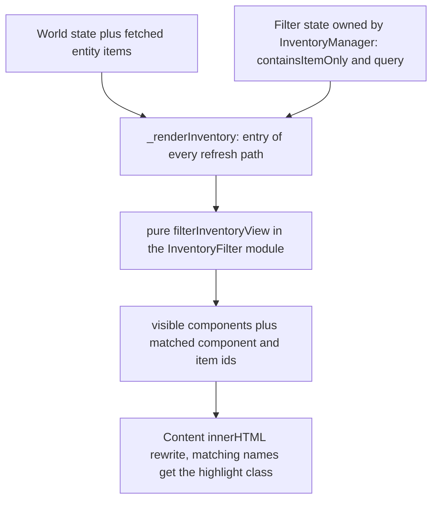

# Inventory Filter — Technical Specification

**Status:** Approved design — implementation-ready for the Code subtask. **Scope:** client-only; specifies the exact JS + HTML + CSS + tests + wiki changes. **No changes to `src/` (server), `shared/`, or `data/`.** This is a **spec**, not a wiki subdoc — like [`knowledge_viewer_spec.md`](knowledge_viewer_spec.md) it deliberately carries the data contract (field names, types, nullability) because those are contracts, not implementation prose.
**Language:** all visible UI text is **English** — enforced repo-wide by [`scripts/check-pt.mjs`](scripts/check-pt.mjs) and [`test/unit/ptLanguageRegression.test.js`](test/unit/ptLanguageRegression.test.js) (both scan this file too); every string and sentence in this document is scanner-safe English.

The **inventory filter** adds two view filters to the inventory overlay panel ([`public/js/InventoryManager.js`](public/js/InventoryManager.js)): (1) **Contains item** — a checkbox; when ON, only components that contain at least one item are shown; (2) **Search** — a text input, case-insensitive substring filter over component names **and** item names. Both change only what the panel renders — they never mutate, persist, or push state; the server stays the sole source of truth.

---

## 1. Decisions (complete list — the implementer makes no others)

| # | Decision | Choice |
|---|----------|--------|
| D1 | "Contains item" containment semantics | **Direct**: the component's bucket `itemsByHost[compId]` is non-empty. Provably equivalent to transitive for this model (§3) — the question is resolved, not left open. |
| D2 | Search semantics | Trimmed query; **case-insensitive substring** over *display names* (the component's formatted type name; each item's `name \|\| type`). A component passes if **its own name matches OR any item in its subtree (any depth) matches**. |
| D3 | Item display on item-match | A shown component renders its **whole existing subtree** — non-matching siblings are **not** pruned; matching names are highlighted (§6). |
| D4 | Combined filters | **AND** — a component renders only if it passes both; an OFF toggle / empty query deactivates that filter. |
| D5 | Logic location | **New** dependency-free pure module [`public/utils/InventoryFilter.js`](public/utils/InventoryFilter.js) — not `ItemTree.js`, not `shared/` (§5). |
| D6 | Filter state | UI-local to the panel instance: `this._filters = { containsItemOnly: false, query: '' }`; never persisted, never pushed upward, **not reset on `hide()`** (survives panel re-open within a session). |
| D7 | Filter bar placement | **Static** markup **between `.overlay-header` and `#inventory-content`** — outside the rewritten content root, so the bar and input focus survive every re-render. |
| D8 | CSS | Additions to the existing [`public/css/inventory.css`](public/css/inventory.css) only (it owns the `inventory-*` domain); no new CSS file, no new `:root` variables, no selector in any other file (BUG-105). |
| D9 | Wiring surface | Only [`public/js/InventoryManager.js`](public/js/InventoryManager.js) is edited. No changes to `App.js`, `Config.js`, `WorldStateManager.js`, `EventDispatcher.js`, or `ComponentViewer.js`. |

---

## 2. Verified mechanisms (evidence from the current codebase)

| # | Fact the design relies on | Verified in |
|---|---------------------------|-------------|
| 1 | `GET /inventory/:entityId` returns `{ items }` — a map of **host id → array of item instances** keyed by each item's raw `hostComponentId` (component id = top-level item, container **item** id = nested item, orphans = `'__unassigned__'`); the client stores that map in `this._currentItems` and rebuilds the display tree on every render via the pure `directChildrenOf` primitive. | [`src/utils/InventoryManager.js:329`](src/utils/InventoryManager.js:329); [`public/js/InventoryManager.js:378`](public/js/InventoryManager.js:378) |
| 2 | The panel derives its component list per render: `state.entities[entityId].components` × `state.components.instances`, kept only when `Physical.volume > 0`. A component has **no display name of its own** — the searchable "component name" is the formatted *type* (`_formatTypeName(comp.type)`). | [`public/js/InventoryManager.js:281`](public/js/InventoryManager.js:281) |
| 3 | **Every** refresh path converges on `_renderInventory()` — open (`show()`), post-action reloads (equip/unequip/move/container-drop), and the `_onWorldStateChange` hook (defined, currently unwired) — so filtering belongs inside that method to be unlosable. | [`public/js/InventoryManager.js:109`](public/js/InventoryManager.js:109), [:1350](public/js/InventoryManager.js:1350) |
| 4 | The overlay is static markup: `#inventory-overlay > .overlay-header` + `#inventory-content.inventory-root`; the content root is fully rewritten per render, so nothing inside it survives (hence D7). | [`public/index.html:88`](public/index.html:88) |
| 5 | `shared/` holds cross-layer wire contracts only; the server resolves containment independently in `src/utils/InventoryManager.js`, so client-only pure utils live in `public/utils/` — the documented placement of `ItemTree.js`/`MapGeometry.js`. | [`wiki/map.md`](map.md) (Shared Modules) |
| 6 | Test harness: vitest `environment: 'node'` (no DOM); client modules imported by **relative path** (`../../public/js/…`); pure functions and prototype methods exercised on bare instances; `fetch` stubbed via `vi.stubGlobal`. | [`vitest.config.js:19`](vitest.config.js:19); [`test/unit/InventoryManager.client.test.js:52`](test/unit/InventoryManager.client.test.js:52) |

---

## 3. Filter semantics and edge cases

**Contains item = direct containment.** A component *contains items* iff at least one item has `hostComponentId === compId` — i.e. its bucket in `this._currentItems` is a non-empty array. **Direct was chosen over transitive** because the two are provably identical for this data model: containment is a forest rooted at components (the server rejects moving a container into its own descendant), and any item nested at any depth has a topmost ancestor that is directly held by the root component — so "has any descendant" ⇔ "has at least one direct child." Direct containment is also exactly what a component card renders as its top-level content, so the toggle maps 1:1 to visible content with no traversal.

**Search.** The raw query is trimmed; an empty-after-trim query deactivates the search filter (everything the other filter allows is shown). Otherwise it is matched as a **case-insensitive substring** against the *displayed* names — the same strings the user sees: the component's formatted type name and each item's `name || type`. A component passes when **its own name matches, or any item in its subtree (any depth) matches** — subtree matching (not direct-only) is required because a match at depth N is only visible if its whole ancestor chain (component → container → …) is rendered, so its top-level host must stay visible.

**Item display on item-match (D3).** A shown component renders **all** of its items — pruning non-matching siblings was rejected because it would remove container drop targets that visible items could legally move into (breaking the drag-and-drop contract) and hide the carried context needed to locate the match. The search therefore filters *which components are shown*, never *which items a shown component displays*; matching item names — and a component's own name when it matched — receive a highlight class so hits are findable. **Both filters combine as AND (D4).**

**Edge cases:**

| Case | Behavior |
|------|----------|
| Filters hide everything (pre-filter list non-empty) | Dedicated empty state: *"No components match the current filter"* — checked **after** the existing no-volume empty state, which stays a pre-filter data condition. |
| Orphan items (server `'__unassigned__'` bucket) | Never a child of any component, so they can never satisfy either filter for a real component — no special code. |
| Malformed `itemsByHost` value (non-array) | Treated as `[]` (defensive reading, same normalization as `_loadEntityItems`). |
| Subtree traversal | Carries a visited-set **cycle guard** (the server guarantees a forest; the guard is graceful-degradation insurance, never a behavior change). |
| Purity | The filter is a pure derivation — it never mutates items, state, or the world; the one-way flow is untouched. |

---

## 4. Data flow



- Filtering is a **pure derived computation in the render path**: world state → `_renderInventory()` → `filterInventoryView()` → DOM. No new persistent state, no new fetch/endpoint/socket event, no state pushed upward (project rules §2 one-way flow).
- **Never lost:** because the filter is applied inside `_renderInventory()` and *every* refresh path ends there (evidence #3), an active filter re-applies automatically on each refresh — including the currently unwired `_onWorldStateChange` hook, which will work with no extra wiring if it is ever connected.
- **Lifecycle:** the state is created in the constructor and mutated only by the two filter controls; `hide()` does **not** clear it, so the user's active view preference survives panel re-opens within the session (clearing it is always one click/keystroke away).

---

## 5. Where the filter logic lives: new `public/utils/InventoryFilter.js`

**Decision (D5):** a new small, **dependency-free, pure** module in `public/utils/` — *not* an extension of [`public/utils/ItemTree.js`](public/utils/ItemTree.js), and *not* in [`shared/`](shared).
- **Not `ItemTree.js`:** ItemTree owns the *grouping* primitive (children of a host) and is shared by `InventoryManager` **and** the out-of-scope `ComponentViewer`; adding *selection/visibility* semantics there would give it a second reason to change (SRP) and pull a panel-exclusive feature into a module another surface depends on.
- **Not `shared/`:** per the shared-modules contract in [`wiki/map.md`](map.md), `shared/` holds cross-layer wire contracts only; the server resolves containment independently in `src/utils/InventoryManager.js`, so a client-only filter must stay in `public/utils/` — the exact reason `ItemTree.js`/`MapGeometry.js` are documented there as deliberately not shared.

**Public API** (all pure: no DOM, no fetch, no mutation; full JSDoc on every export):

| Export | Signature | Contract |
|--------|-----------|----------|
| `SEARCH_MATCH_OPTIONS` | `const { caseSensitive: false, wholeWord: false }` | Named constant for the match policy — call sites never carry inline magic flags. |
| `matchesQuery` | `(name, rawQuery, options = SEARCH_MATCH_OPTIONS) → boolean` | Trims `rawQuery`; returns `false` when the trimmed query is empty (an inactive query is *no match*; the deactivation short-circuit lives in `filterInventoryView`). Returns `false` for `null`/`undefined`/non-string names. Otherwise case-insensitive substring containment. |
| `hasDirectItems` | `(itemsByHost, hostId) → boolean` | `true` iff `itemsByHost[hostId]` is an array with length > 0 (D1). Missing key or non-array value → `false`. |
| `collectSubtreeItemIds` | `(itemsByHost, rootId) → string[]` | All item ids in the subtree under `rootId` (component id **or** container item id): BFS from the direct children, descending through item ids that are themselves map keys; visited-set cycle guard; input never mutated. Missing root → `[]`. |
| `filterInventoryView` | `({ components, itemsByHost, containsItemOnly = false, query = '' }) → { components, matchedComponentIds, matchedItemIds }` | `components`: input array of `{ id, name, … }` where `name` is the **already-resolved display name** (the panel supplies it from `_formatTypeName`, so the module never depends on the panel; the item-name rule `item.name || item.type` is internal to the module — it is data, not presentation). Returns the visible subset **in input order** (D4 = AND; D2 subtree search). `matchedComponentIds`: `Set` of visible components whose own name matched. `matchedItemIds`: `Set` of item ids, at any depth, whose display name matched **and** that lie in the subtree of a visible component (items under hidden components are excluded — they render nowhere). Both sets are empty when the query is inactive. |

---

## 6. UI design

**Placement (D7):** a static filter bar **between `.overlay-header` and `#inventory-content`** inside `#inventory-overlay` — outside the content root on purpose, because `_renderInventory()` rewrites that root on every refresh and an input recreated per keystroke would lose focus and be unusable.

Add to [`public/index.html`](public/index.html) (inside `#inventory-overlay`, after the `.overlay-header` block, before `#inventory-content`):

```html
<div class="inventory-filter-bar">
    <label class="inventory-filter-toggle" for="inventory-filter-contains-item" title="Show only components that contain at least one item">
        <input type="checkbox" id="inventory-filter-contains-item" class="inventory-filter-contains-item">
        Contains item
    </label>
    <input type="text" id="inventory-filter-search" class="inventory-filter-search"
           placeholder="Search components and items" title="Filter by component or item name" autocomplete="off">
</div>
```

**Wiring** (all in `InventoryManager.init()`, bound once, with the existing missing-element guard style):
- checkbox `change` → `this._filters.containsItemOnly = el.checked` → `_renderIfVisible()`
- search `input` → `this._filters.query = el.value` → `_renderIfVisible()`
- `_renderIfVisible()` (new private): calls `_renderInventory()` only while the overlay is displayed — the same visibility guard `_onWorldStateChange` already uses.

**CSS (D8) — additions to [`public/css/inventory.css`](public/css/inventory.css) only**, all new `inventory-*` selectors, colors exclusively from `:root` custom properties:
- `inventory-filter-bar` (flex row, wrap, gap, between header and list) and `inventory-filter-contains-item` (checkbox accent from the existing palette)
- `inventory-filter-search` (growing text input, terminal styling from existing palette variables) and `inventory-name-match` (the highlight for a matched name, applied to **both** item name spans and the component name span — one class, two contexts)

**Label contract** (exact strings the §8 test pins; all English, scanner-verified):

| Location | Exact string |
|----------|--------------|
| Checkbox label | `Contains item` |
| Checkbox `title` | `Show only components that contain at least one item` |
| Search `placeholder` | `Search components and items` |
| Search `title` | `Filter by component or item name` |
| Filter empty state | `No components match the current filter` |

---

## 7. `InventoryManager` changes (complete edit list)

1. Import `filterInventoryView` from `/utils/InventoryFilter.js` (the module's only needed export — the renderer consumes its outputs and never re-implements matching).
2. Constructor: `this._filters = { containsItemOnly: false, query: '' }`, plus `this._matchedComponentIds = null` / `this._matchedItemIds = null` (null = no highlighting; existing direct calls to `_renderTreeItems` see null and render unchanged).
3. `init()`: bind the two controls per §6.
4. `_renderInventory()`: after `volumeComponents` is built (unchanged) and **before** the existing no-volume empty state: resolve display names (`volumeComponents.map(c => ({ ...c, name: this._formatTypeName(c.type) }))`); call `filterInventoryView({ components, itemsByHost: this._currentItems, containsItemOnly: this._filters.containsItemOnly, query: this._filters.query })` and store its matched sets; if the pre-filter list is non-empty but the result is empty, render the §6 filter empty state (show overlay, return); otherwise render the loop over the visible subset (instead of all `volumeComponents`) — the rest of the method is untouched.
   - In `_renderComponentSlot`: add `inventory-name-match` to the component name span when the comp id is in `matchedComponentIds`.
   - In `_renderTreeItems` (item name span **and** container header name span): add `inventory-name-match` when the item id is in `matchedItemIds`.
5. **No changes to** drag-and-drop handlers, volume math, equip/unequip/drop flows, or `hide()` (filters persist — §4). Hidden slots simply have no DOM, so they cannot be drag targets while hidden; the server remains authoritative on fit.

---

## 8. Test plan

One new file: `test/unit/InventoryFilter.test.js` — vitest `environment: 'node'` per [`vitest.config.js`](vitest.config.js); relative imports `../../public/utils/InventoryFilter.js` (and `../../public/js/InventoryManager.js` for case 14) — the exact harness pattern of [`test/unit/InventoryManager.client.test.js`](test/unit/InventoryManager.client.test.js): bare instances, pure functions, no DOM, no unstubbed fetch.
Fixture: `itemsByHost` with components `comp-a`, `comp-b`, `comp-c` and a container item `item-box`; items are `{ id, name, hostComponentId }`.

| # | Case |
|---|------|
| 1 | Empty query + toggle OFF → all components returned, input order preserved (feature inert) |
| 2 | Partial substring match on a component name (mid-name fragment) |
| 3 | Case-insensitive match (query casing differs from the stored name) |
| 4 | Component-name match keeps the component (even with zero items, toggle OFF) |
| 5 | Direct item-name match keeps its host component visible |
| 6 | **Nested-item edge case:** a grandchild match (item inside `item-box` inside `comp-b`) keeps top-level `comp-b` visible |
| 7 | Toggle ON: components with no direct items hidden; components with ≥ 1 direct item kept |
| 8 | Toggle ON + a component whose only content is an **empty** container → kept (the container is itself a direct item) |
| 9 | **Both active (AND):** no direct items but a deep matching item → hidden; direct items but no name match → hidden; direct items and a matching item → kept |
| 10 | Zero matches → `components: []` |
| 11 | Predicate contracts — `hasDirectItems`: missing key / non-array value / `[]` → false, non-empty → true; `matchesQuery`: empty or whitespace-only query → false, `null`/`undefined` name → false, trimmed and case-insensitive match under the default options |
| 12 | `collectSubtreeItemIds`: two-level chain returns every id; a crafted cycle (A inside B, B inside A) **terminates** (visited guard); missing root → `[]` |
| 13 | Matched-id scoping: `matchedItemIds`/`matchedComponentIds` contain only ids inside **visible** subtrees (a matching item under a hidden component is excluded; both sets empty when the query is inactive) |
| 14 | **Panel integration (stubbed DOM):** `InventoryManager` instance with `_content = { innerHTML: '', querySelectorAll: () => [] }`, a fixture `getState()` entity/components, `_currentItems`, and `_filters` set → `_renderInventory()` → captured innerHTML contains the matching component slot, omits the hidden slot, and the matched item name span carries `inventory-name-match` |

**Gate:** the full existing suite (unit + contract, including unmodified `ptLanguageRegression`) passes — no signature changed (`_renderTreeItems` keeps its 3-arg form).

---

## 9. Wiki updates (AFTER implementation, same PR)

Per project rules §7 (map maintenance) and §8 (why-over-how — no code, no schemas, no how-steps in wiki):

| # | File | Change |
|---|------|--------|
| 1 | [`wiki/subMDs/data/inventory_system.md`](subMDs/data/inventory_system.md) | New short section **Client-Side Filtering** (same treatment as its existing "Drop Selector Feature"/"Item Stats Feature" sections): why the filters are client-local view state; why direct containment was chosen and why it is equivalent to transitive for tree-shaped containment; why search is component-scoped but subtree-matched; why the filter bar is static outside the rewritten content root. |
| 2 | [`wiki/subMDs/frontend/client_architecture.md`](subMDs/frontend/client_architecture.md) | Module table: the Inventory Manager row notes the client-local filter state (toggle + search) applied as a pure derivation inside the render path. |
| 3 | [`wiki/map.md`](map.md) | **Shared Modules** section: one sentence documenting `public/utils/InventoryFilter.js` as a client-only pure module used only by `InventoryManager` (the same "deliberately not part of `shared/`" wording as the ItemTree/MapGeometry paragraphs). **The dependency graph is NOT changed** (no new controller/node) and **the Data Files table is NOT changed** (no new data files) — stated explicitly. |

**Explicitly NOT updated:** `wiki/CORE.md` (no new subdoc — the feature's "why" lands in §9.1; no new controller to index), `shared/*`, `src/*`, `data/*`.

---

## 10. Constraints and verification gates

- **JavaScript only**, no new dependencies; **no changes** to `src/`, `shared/`, `data/`, `App.js`, `Config.js`, `WorldStateManager.js`, `EventDispatcher.js`, or `ComponentViewer.js` (out of scope per the confirmed interpretation).
- **Logging:** none is required (filter changes are user intent, not anomalies); if any diagnostic is added, it goes through [`public/utils/ClientLogger.js`](public/utils/ClientLogger.js) — never `console.*` (BUG-123).
- **Naming/typing:** semantic names; JSDoc on every export of the new module and every changed method; no magic numbers — the match policy is the named `SEARCH_MATCH_OPTIONS` constant, and the empty-query rule is `trim()` plus documented semantics, not a hidden flag.
- **English-only CI gate (both must hold after the feature lands):** `node scripts/check-pt.mjs` exits 0, and the unmodified `test/unit/ptLanguageRegression.test.js` still passes with zero matches (it scans this spec file too).

---

## 11. Out of scope (non-goals)

- `ComponentViewer`'s read-only carried-items list — no filter there (confirmed scope).
- No server endpoints, no socket events, no world-state fields, no persistence of filters across page reloads/sessions.
- No pruning of items inside a shown component (D3), no in-name match highlighting (whole-name class only), no changes to volume bars, drag-and-drop behavior, equip/unequip, or the crafting/knowledge panels.

---

## 12. Implementation checklist (execution order)

1. `public/utils/InventoryFilter.js` (new — §5 API)
2. `public/index.html` (§6 filter-bar block)
3. `public/js/InventoryManager.js` (§7 edits 1–5)
4. `public/css/inventory.css` (§6 classes)
5. `test/unit/InventoryFilter.test.js` (§8 cases 1–14, one file)
6. Verification: full `npx vitest run` green + `node scripts/check-pt.mjs` exit 0
7. Wiki updates §9, in the same PR
