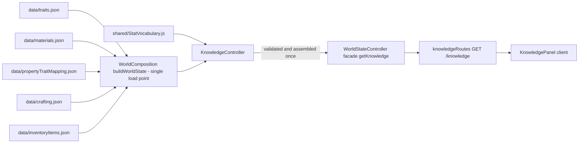
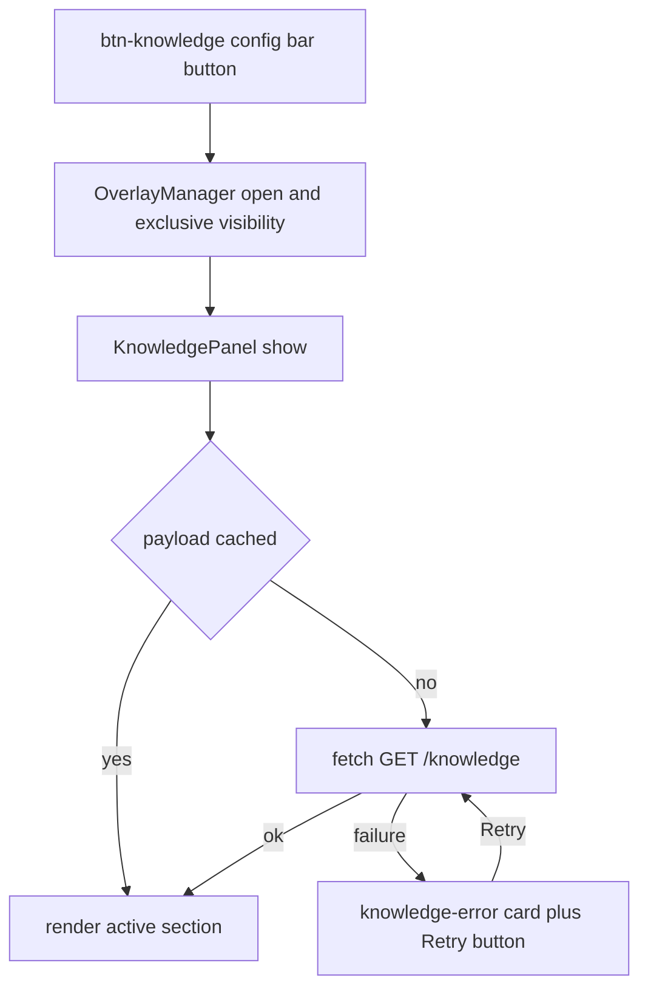

# Knowledge Viewer — Technical Specification

**Status:** Approved design — implementation-ready for the Code subtask.
**Scope:** Design only. This document specifies exactly what changes (code + tests + wiki). It is a **spec**, not a wiki subdoc: unlike [`project_rules.md`](project_rules.md) §8 subdocs, it deliberately carries the **data contract** (field names, types, nullability) and endpoint definitions, because those are contracts, not implementation prose. The post-implementation "why" document goes to [`subMDs/frontend/knowledge_viewer.md`](subMDs/frontend/knowledge_viewer.md) and must follow §8 strictly (no code, no schemas, no endpoint tables).
**Language:** All visible UI text is **English**. The repository enforces this with a hard CI guard: [`scripts/check-pt.mjs`](scripts/check-pt.mjs) fails the build on any accented character or unambiguous Portuguese word anywhere in the tree, and [`test/unit/ptLanguageRegression.test.js`](test/unit/ptLanguageRegression.test.js) asserts zero matches repo-wide (including this file). Every user-facing string in §6 was verified scanner-safe.

The **Knowledge Viewer** is a new read-only tab ("Knowledge") in the main UI: a **full static reference codex** of the game's data files. It has three sections — **Traits & Stats** (the material property → trait → stat derivation chain), **Crafting & Items** (every recipe with display names resolved), and **Items** (every item type with its fields). It is **not** filtered by player, entity, or world state, and it changes only when the data files change (i.e., never at runtime — registries are validated once at boot and immutable after, same as the crafting registry).

---

## 1. Overview and goals

| # | Goal |
|---|------|
| G1 | Give players a one-stop, always-true reference of static game data: trait/stat vocabulary, the property→stat derivation chain, every recipe, every item type. |
| G2 | Be **read-only**: no world mutation, no turn cost, no entity requirement — the exact mirror image of the crafting panel (which reads the same registries and then mutates). |
| G3 | Be **static**: the payload is assembled once at boot from the `data/*.json` registries; no player/world-state filtering, no runtime recomputation. |
| G4 | Follow the existing panel pattern end-to-end (overlay + config-bar button + one CSS module + one route module + one facade method), so it ages like every other panel. |
| G5 | Degrade gracefully: a failed fetch or malformed payload renders a readable error state inside the panel and never breaks the rest of the client. |

**Naming note (supersedes an earlier draft):** the tab was briefly named "Conhecimento"; the final decision is **full English**, so the tab is **"Knowledge"** with the knowledge emoji (📚, config-bar button) and the brain emoji (🧠, overlay panel header).

**Derivation-chain scope decision (why the viewer does not compute):** the property→trait→stat chain is shown as **reference data** — the mapping table (which property or formula feeds which stat), the per-material property values, and the global trait molds. The viewer deliberately does **not** compute blended stats per blueprint: blending depends on a composition (per-blueprint fractions and volume), which is an instance-level fact owned by [`src/controllers/materials/MaterialController.js`](src/controllers/materials/MaterialController.js) (`derive()`). A codex that computed per-item values would drift from runtime merge behavior (4-layer merge, see [`subMDs/data/traits.md`](subMDs/data/traits.md) §4) and would need to be re-derived on every data edit. Reference-only keeps the payload a pure function of the data files.

---

## 2. Verified mechanisms (evidence from the current codebase)

| # | Mechanism | Where verified | Fact the design relies on |
|---|-----------|----------------|---------------------------|
| 1 | Route module shape | [`src/routes/craftingRoutes.js`](src/routes/craftingRoutes.js:63), [`src/routes/index.js`](src/routes/index.js:38) | Every route module exports `register(router, { deps })` and is HTTP plumbing only: validation + status mapping; all business logic lives in the facade. All routers mount behind the shared auth gate in one place (`app.use('/', authMiddleware, router)`). `src/server.js` calls only `registerRoutes(...)` — it never imports individual route modules, so **adding a route never touches `src/server.js`**. |
| 2 | State controller pattern | [`src/controllers/crafting/CraftingController.js`](src/controllers/crafting/CraftingController.js:25) | A state controller holds raw registry data, has **no cross-controller dependencies**, validates at construction via `_validate*()` (throws `TypeError`), logs an init count via `Logger.info`, returns **defensive deep copies** (`structuredClone`) from getters, and deliberately has **no `getAll()`** so it is excluded from the world-state broadcast aggregation. |
| 3 | Composition root | [`src/composition/WorldComposition.js`](src/composition/WorldComposition.js:122) | **All five data files this feature needs are already loaded** in `buildWorldState()`: `data/traits.json` (line 124), `data/materials.json` + `data/propertyTraitMapping.json` (lines 140-143, inline in the `MaterialController` call), `data/inventoryItems.json` (line 150), `data/crafting.json` (line 165, inline in the `CraftingController` call). No new file I/O is required for the Knowledge Viewer. |
| 4 | Facade injection | [`src/controllers/WorldStateController.js`](src/controllers/WorldStateController.js:67) (constructor `deps`), [:117] (craftingController stored as `deps.craftingController ?? null`), [:1993] (`getCraftingRecipes()` passthrough with null-warn) | Sub-controllers reach clients only through thin facade passthroughs; the route sees only the facade (Public API Only, project rules §2-3). `getItemRegistry()` (line 1608) already exposes the item registry via `inventoryManager.getItemDefinitions()`. |
| 5 | Client panel pattern | [`public/js/App.js`](public/js/App.js:89) (construction), [:669-684] (overlay registrations) | Panels are constructed in `ClientApp`, then registered: `overlayManager.register(panelId, controller, buttonId, shortcutKey, showData?)`. Only shortcuts '1'-'4' exist; crafting/room-chat/events are registered with `null` (no numeric shortcut) — the Knowledge Viewer follows that. The controller implements `init()/show(data)/hide()/toggle()`. The crafting panel fetches its own data inside `show()` rather than via `showData`. |
| 6 | Client fetch pattern | [`public/js/CraftingPanel.js`](public/js/CraftingPanel.js:685) | Plain `fetch('/...')` (no auth header — the middleware is a pass-through in local dev), non-`ok` → error path, then `unwrapEnvelope(body, key, fallback)` (line 510) because **every endpoint returns a keyed envelope, never a bare payload** (`{ recipes }`, `{ registry }`, `{ items }`). Errors go through `ClientLogger` only (BUG-123: no `console.*` on the client). |
| 7 | Overlay + HTML pattern | [`public/index.html`](public/index.html:97) (crafting overlay), [:45] (`config-bar-inventory` group), [`public/js/OverlayManager.js`](public/js/OverlayManager.js:45) | Each overlay panel is a `#…-overlay.overlay-panel` div (`display:none` in markup) with an `.overlay-header` (title + `.overlay-close-btn`) and a content root; the config-bar button lives in a `config-bar-*` group; the `<head>` links one CSS file per panel. The OverlayManager owns button listeners, exclusive visibility, backdrop dismissal, and z-index. |
| 8 | CSS module rule | [`public/css/crafting.css`](public/css/crafting.css:1), [`subMDs/frontend/css_architecture.md`](subMDs/frontend/css_architecture.md) | One file per visual domain; the file owns **only** its own selector prefix (all `crafting-…`); colors via `:root` custom properties only; **no selector may be duplicated in another file** (BUG-105). |
| 9 | Data shapes | [`data/traits.json`](data/traits.json:1), [`data/propertyTraitMapping.json`](data/propertyTraitMapping.json:1), [`data/materials.json`](data/materials.json:1), [`data/crafting.json`](data/crafting.json:1), [`data/inventoryItems.json`](data/inventoryItems.json:1) | `traits.json`: `{ group: { stat: number } }` (5 groups: Physical, Mind, Spatial, Movement, Manipulation). `propertyTraitMapping.json`: flat `Group.stat` keys; each entry has **either** `formula: "densityVolume"` **or** `sources: { property: weight }` (validated by [`MaterialController._validateMappingRegistry`](src/controllers/materials/MaterialController.js:62), key pattern `/^[A-Za-z]+\.[A-Za-z_]+$/`). `materials.json`: `{ id: { name, density, properties: {…} } }`. `crafting.json`: keyed by recipe id; each entry `{ id, name, description, inputs: [{type, quantity}], outputs: [{type, quantity}] }`. `inventoryItems.json`: `{ type: { name, description, volume, [externalVolume], [materials: [{material, fraction, role}]], traits: {group: {stat: number}} } }` — `externalVolume` and `materials` are **optional** (only `t1` and the knife/box/crate entries carry them today). |
| 10 | Cross-layer vocabulary | [`shared/StatVocabulary.js`](shared/StatVocabulary.js:24) | `TRAIT_GROUPS` (Physical, Movement, Manipulation), `STAT_NAMES` (durability, strength, sharpness, volume), `flatKey()`, and the **two distinct durability semantics**: `DURABILITY_BROKEN_AT = 0` (component-broke pipeline fires crossing `old > 0 → new <= 0`) vs `DURABILITY_USABLE_MIN = 1` (targeting still accepts `0 < dur < 1`). The vocabulary is a **pinned subset** of `traits.json` (e.g. `Mind`/`Spatial` groups and `mass`/`temperature`/`flammability`/`fine_controls` are not in it) — the viewer must present it as such. |
| 11 | Safe fallbacks | [`shared/Defaults.js`](shared/Defaults.js:37) | `DEFAULT_ITEM_VOLUME = 0` is the sanctioned fallback for a missing item `volume` (the safe direction: it can never block capacity). The Knowledge Viewer reuses it in the items section. |
| 12 | Test harnesses | [`test/unit/craftingRoutes.test.js`](test/unit/craftingRoutes.test.js:33), [`test/unit/CraftingPanel.test.js`](test/unit/CraftingPanel.test.js:1), [`vitest.config.js`](vitest.config.js:19) | Route tests: `express + Router + register() + app.listen(0) + fetch` with a **stubbed facade** (the only dep the route takes). Panel tests: **pure exported functions only**, no DOM (vitest `environment: 'node'`; client imports resolve via the `/utils` alias). Client modules must keep their logic testable that way. |

---

## 3. Data contract

### 3.1 Endpoint and envelope

```
GET /knowledge
200 → { "knowledge": { "traitStats": {...}, "recipes": [...], "items": [...] } }
500 → { "error": "Internal Server Error", "details": "<message>" }
```

- **One endpoint, one payload.** Rationale: the panel always renders all three sections, so three endpoints would only multiply round-trips and failure modes with zero benefit; a single composite envelope matches the existing keyed-envelope convention (`{ recipes }`, `{ registry }`). Rejected alternative: per-section endpoints (`/knowledge/traits`, …) — more REST-like, but the client would merge three fetches and handle three partial-failure states for data that is always needed together.
- **No Socket.IO event.** The data is immutable at runtime; pull-on-open is the established pattern for static registries (crafting/inventory). Socket events are reserved for state that changes.
- **Auth:** mounted on the same router, so it sits behind the shared `authMiddleware` like every other API route (pass-through in local dev; Bearer token when `REQUIRE_AUTH === 'true'`). The client's plain `fetch` needs no change.

### 3.2 `traitStats` section — traits ↔ stats

| Field | Type | Source file | Notes |
|-------|------|-------------|-------|
| `groups` | `Object<string, Object<string, number>>` | `data/traits.json` | The **global trait molds**, deep-copied verbatim (group → stat → default value). This is the "stat" end of the chain. |
| `mappings` | `Array<MappingRow>` | `data/propertyTraitMapping.json` | The property→stat mapping table, as an **array** (object registries become sorted arrays for stable rendering). One row per flat `Group.stat` key. |
| `materials` | `Array<MaterialRow>` | `data/materials.json` | The property values per material, as a sorted array — the "material property" end of the chain, so a reader can trace property value → mapping → stat end to end. |
| `vocabulary` | `Vocabulary` | `shared/StatVocabulary.js` | The cross-layer pinned names (see below). Sourced from the shared module, **not** from a data file — it is the drift-sensitive contract, and the codex is the one place both layers' names meet. |

**`MappingRow`** (derived from one `propertyTraitMapping.json` entry):

| Field | Type | Derivation |
|-------|------|------------|
| `statKey` | `string` | The original flat key, e.g. `"Physical.durability"` (the `trait.stat` form used by range expressions and stat lookups). |
| `trait` | `string` | First segment of the key (`"Physical"`). |
| `stat` | `string` | Second segment of the key (`"durability"`). |
| `formula` | `string \| null` | The entry's `formula` (e.g. `"densityVolume"`) — exactly one of `formula` / `sources` populated; the absent side is `null`. The knowledge controller enforces this on the wire at assembly time (`_buildMappings()`): a data entry that defines both is emitted as a formula row (`sources: []`, formula wins) — the same priority the materials pipeline's `MaterialController._deriveTraits()` applies to a `densityVolume` formula. The boot-time validator enforces only 'at least one of the two' — the same lax validation as `MaterialController._validateMappingRegistry()`, which serves the derivation pipeline and is deliberately unchanged. |
| `sources` | `Array<{ property: string, weight: number }>` | The entry's `sources` object expanded to a **property-sorted** array; `[]` when the entry is formula-based. |

**`MaterialRow`:**

| Field | Type | Derivation |
|-------|------|------------|
| `type` | `string` | The registry key (e.g. `"wood"`). |
| `name` | `string` | The entry's `name` (e.g. `"Wood"`). |
| `density` | `number` | The entry's `density` (feeds the `densityVolume` formula: mass = density × volume). |
| `properties` | `Object<string, number>` | The entry's `properties`, deep-copied verbatim (flammability, electricalConduction, …). |

**`Vocabulary`** (from [`shared/StatVocabulary.js`](shared/StatVocabulary.js)):

| Field | Type | Value source |
|-------|------|--------------|
| `traitGroups` | `string[]` | `TRAIT_GROUPS` values, as defined in the module (order: Physical, Movement, Manipulation). |
| `stats` | `string[]` | `STAT_NAMES` values (durability, strength, sharpness, volume). |
| `durability` | `{ brokenAt: number, usableMin: number }` | `DURABILITY_BROKEN_AT` (0) and `DURABILITY_USABLE_MIN` (1) — the two distinct durability semantics, surfaced side by side so their deliberate gap is visible (a component at `0 < dur < 1` is already broken yet still "usable" by targeting filters). |

**Presentation rule (why):** `vocabulary` is a **pinned subset** of `groups` (see evidence #10). The viewer renders it as a distinct block ("Shared vocabulary — pinned names") and never claims it is exhaustive; group/stat names present in `groups` but absent from `vocabulary` are simply not highlighted. This makes the codex the live documentation of which names the shared module freezes.

**Ordering (deterministic):** `mappings` sorted by `statKey`; `sources` within a row sorted by `property`; `materials` sorted by `type`; `groups` keeps the data file's group order. Sorting in the server (not the client) makes the wire contract independent of JSON key order.

### 3.3 `recipes` section — craft ↔ items

`Array<RecipeRow>`, one per entry in `data/crafting.json`, sorted by `id`:

| Field | Type | Source | Notes |
|-------|------|--------|-------|
| `id` | `string` | `data/crafting.json` | Recipe registry key (equals the entry's `id`). |
| `name` | `string` | `data/crafting.json` | Display name. |
| `description` | `string \| null` | `data/crafting.json` | `null` when the entry has none. |
| `inputs` | `Array<RecipeItemRef>` | `data/crafting.json` entries, names resolved via `data/inventoryItems.json` | Order as in the data file. |
| `outputs` | `Array<RecipeItemRef>` | same | same. |

**`RecipeItemRef`:**

| Field | Type | Derivation |
|-------|------|------------|
| `type` | `string` | The entry's `type` (item registry key). |
| `quantity` | `number` | The entry's `quantity` (integer ≥ 1, guaranteed by the CraftingController's boot validation). |
| `name` | `string` | **Resolved display name**: `inventoryItems[type].name`. Resolution is total (every recipe type is cross-validated against the item registry at boot — [`CraftingController`](src/controllers/crafting/CraftingController.js:98)); the defensive fallback for an unresolvable type is the raw `type` string, never a raw ID-shaped label. |

### 3.4 `items` section — item types

`Array<ItemRow>`, one per entry in `data/inventoryItems.json`, sorted by `type`:

| Field | Type | Source | Nullability / fallback |
|-------|------|--------|------------------------|
| `type` | `string` | registry key | required |
| `name` | `string` | entry `name` | required (validated at boot by inventory validation) |
| `description` | `string \| null` | entry `description` | `null` when missing |
| `volume` | `number` | entry `volume` | falls back to `DEFAULT_ITEM_VOLUME` (0, [`shared/Defaults.js`](shared/Defaults.js:37)) when missing — same safe direction as every runtime consumer |
| `externalVolume` | `number \| null` | entry `externalVolume` | `null` when missing (only `t1` defines one today; it is the host-footprint override, `externalVolume ?? volume`) |
| `materials` | `Array<{ material: string, fraction: number, role: string \| null }> \| null` | entry `materials` | `null` when missing (items without a composition have no derived layer); `role` is `null` when the entry omits it. Present so the reader can trace item → material composition → property values (§3.2) → stats. |
| `traits` | `Object<string, Object<string, number>>` | entry `traits` | deep copy; `{}` when missing |

**Scope note (why):** `traits` shows the **declared (blueprint-override) values** from the data file — the layer that always wins in the 4-layer merge ([`subMDs/data/traits.md`](subMDs/data/traits.md) §4) — not merged runtime values and not per-instance durability. The codex documents what the data says; runtime merge/derivation is the job of `TraitsController`/`MaterialController` and stays out of the payload on purpose (see §1 scope decision).

### 3.5 Invariants

1. **Shape is total:** every field in §3.2-§3.4 is always present (arrays may be empty, nullable fields may be `null`). The client never branches on missing keys — only on empty/null. This holds even when a data file is absent at boot: `DataLoader.loadJsonSafe` supplies the fallback, validation tolerates empty registries, and the payload stays well-shaped (degraded but renderable — each section shows its empty state).
2. **Defensive copies:** the payload is a deep copy of the registries (`structuredClone`); callers (routes, clients) can never mutate controller state through it — the project's defensive-copying rule, same as `getRecipes()`.
3. **Read-only at runtime:** no endpoint writes to these registries; the only mutation paths in the project (crafting, inventory) are untouched.
4. **English-only:** no user-facing string in the payload or UI may contain accented characters or scanner-listed Portuguese words (see §6); the data files themselves are English today, and any future non-English data content is a data-editing concern, not a viewer concern.

---

## 4. Server-side design

### 4.1 Decision: state controller + facade passthrough (not route-local loading)

**Decision:** the knowledge data is owned by a **new state controller** (`KnowledgeController`), constructed by the composition root, exposed through **one new facade passthrough** (`WorldStateController.getKnowledge()`), and served by a **new route module** that is HTTP plumbing only.

**Why not load the data inside the route module (the rejected alternative):**

1. **Public API Only (project rules §2-3).** Every route module takes exactly `{ worldStateController }` as its dependency and reaches data exclusively through facade methods (verified: all 15 route modules, evidence #1). A route calling `DataLoader` directly would give the HTTP layer direct filesystem access to sub-controller-owned data — the exact side-channel class that BUG-069 eliminated.
2. **Validation lifecycle (project rules §5-6).** State controllers are where `_validate*()` runs (fail-fast at boot, `TypeError` on corruption, logged init count). Route-local loading has no validation home: it would either re-read and re-validate on every request (wasteful, and a mid-game data change would be silently picked up) or cache ad-hoc in the request-scope world (stateless side-channel, BUG-069 pattern).
3. **No new I/O.** The composition root already loads all five files (evidence #3). A route-module load would be a **second** read of the same files with a second lifecycle — two sources of truth for the same data.
4. **Precedent.** This is exactly the read-only twin of the existing pair: `CraftingController` (registry owner) + `getCraftingRecipes()` (facade) + `GET /crafting/recipes` (plumbing). The inventory registry and holding-cost registry follow the same shape. Mirroring the pattern means the new code is predictable to anyone who has read one existing panel.
5. **Facade stays thin.** The alternative of assembling the payload inside `WorldStateController` from existing sub-controller getters was considered and rejected: (a) `MaterialController` exposes no getter for the mapping registry, (b) assembly logic in the facade re-bloats the very god class the FASE 5 split dismantled, (c) the facade would gain a composite responsibility (assembling three registries) that belongs to one owner. A dedicated controller gives the facade a **one-line passthrough**, the smallest possible surface.

### 4.2 `src/controllers/knowledge/KnowledgeController.js` (new file)

- **Class:** `KnowledgeController` (default export), a state controller per [`subMDs/controllers/controller_patterns.md`](subMDs/controllers/controller_patterns.md) §4: raw data in, no cross-controller dependencies, no facade reference, **no `getAll()`** (static registry stays out of the world-state broadcast — same deliberate exclusion as `CraftingController`/`RoomChatController`; shipping a codex in every full-state update would bloat all clients for zero benefit).
- **Constructor:** `constructor({ traits, materials, propertyTraitMapping, recipes, items })` — receives the **already-loaded** registry objects (see §4.5); stores them; runs validation; logs the init summary via `Logger.info` (counts: groups, mappings, materials, recipes, items) — project rule §5.2 rule 4.
- **Shared vocabulary:** imported directly from [`shared/StatVocabulary.js`](shared/StatVocabulary.js) inside the module (shared modules are dependency-free ES modules importable by the Node server — established: the composition root imports `shared/SocketProtocol.js`). It is *not* a constructor argument, because it is code, not a data file.
- **Validation:** a single `_validateKnowledgeRegistries()` (name specific to the controller's data type, project rule §5.2 rule 5), throwing `TypeError` on:
  - a registry that is not a plain object (arrays/null rejected — the `loadJsonSafe` fallback `{}` **is** valid: empty registries pass, so a missing file degrades to empty sections instead of a boot failure, matching the CraftingController fallback behavior);
  - a mapping key that does not match the flat `Group.stat` pattern (same pattern the MaterialController validator uses, so the two controllers cannot disagree about what a key is);
  - a mapping entry with neither a non-empty `formula` nor a non-empty `sources` object. (An entry with both fields is *accepted* at boot and normalized to a formula row at assembly — see §3.2.)
  - a recipe entry failing the same structural rules `CraftingController._validateRecipeDefinitions` enforces, **including** the cross-check that every input/output `type` exists in the item registry (a broken reference fails boot, never mid-game — fail-fast, evidence #2);
  - a material entry missing `name`/`density`/`properties` (same rules as [`MaterialController._validateMaterialsRegistry`](src/controllers/materials/MaterialController.js:37));
  - an item entry with a non-numeric `volume` or a non-object `traits`.
  Validation runs **before** initialization proceeds (project rule §6).
- **Getter:** `getKnowledge()` → returns the assembled payload of §3 as a **fresh deep copy on every call** (`structuredClone` of the assembled structure). Assembly itself (object→sorted-array conversion, name resolution, null normalization, vocabulary block) is computed once at construction and cached; the getter only clones. Assembly is pure and idempotent, so caching it costs nothing and keeps the getter O(clone) — never O(re-assembly) on a hot path.
- **Logging:** `Logger` only; never `console.*` (centralized logging rule).

### 4.3 Facade — `src/controllers/WorldStateController.js` (edit)

- Store `this.knowledgeController = deps.knowledgeController ?? null;` in the constructor (same pattern as `craftingController`, line 117).
- Add `getKnowledge()`: thin passthrough to `knowledgeController.getKnowledge()`; when the controller is unwired (`null`), log a `Logger.warn` pointing at the composition root and return an **empty-shape** payload (all three sections present, empty) — mirroring `getCraftingRecipes()`'s null-warn, but the knowledge viewer additionally never hard-fails a client on a wiring miss, since an empty codex is a coherent degraded state.

### 4.4 `src/routes/knowledgeRoutes.js` (new file) + registration

- Named export `register(router, { worldStateController })` — identical shape to [`craftingRoutes.js`](src/routes/craftingRoutes.js:63); HTTP plumbing only.
- **Single static route:** `GET /knowledge` → `res.json({ knowledge: worldStateController.getKnowledge() })`; any throw → `Logger.error` + `500 { error: 'Internal Server Error', details }` (identical status mapping to every other registry endpoint). No parameterized routes, no typed-ID validation (no IDs appear in the payload).
- **Registration:** one import + one call in [`src/routes/index.js`](src/routes/index.js:17) (`registerKnowledgeRoutes(router, { worldStateController })`, appended after the crafting registration). **`src/server.js` is not modified** — it only calls `registerRoutes` (evidence #1).

### 4.5 `src/composition/WorldComposition.js` (edit)

- Hoist the two currently inline loads into named consts alongside the others (behavior-preserving refactor):
  - `data/materials.json` and `data/propertyTraitMapping.json` are currently loaded inline inside the `MaterialController` call (lines 140-143) → become `const materialsRegistry = DataLoader.loadJsonSafe('data/materials.json', {})` and `const propertyTraitMappingRegistry = DataLoader.loadJsonSafe('data/propertyTraitMapping.json', {})`, passed to both `MaterialController` and `KnowledgeController`.
  - `data/crafting.json` is currently inline in the `CraftingController` call (lines 164-167) → becomes `const craftingRegistry = DataLoader.loadJsonSafe('data/crafting.json', {})`, passed to both `CraftingController` and `KnowledgeController`.
- Construct `const knowledgeController = new KnowledgeController({ traits: traitsRegistry, materials: materialsRegistry, propertyTraitMapping: propertyTraitMappingRegistry, recipes: craftingRegistry, items: inventoryItemRegistry });` in the Layer-0 (data stores) section, **before** the facade is constructed (topological order: it has no controller deps, so it builds alongside `CraftingController`).
- Pass `knowledgeController` in the facade construction `deps` object (same object that already carries `craftingController`), and add it to the `subControllers` map returned by `buildWorldState()` (for tests/inspection, same as every other sub-controller).
- **Why sharing the loaded objects is safe:** the registries are read-only after construction for every consumer (state controllers return defensive copies; the composition root's startup validation only reads). One load, N readers, zero divergence — and it keeps the project's "one consistent, defensive way to bootstrap data" rule (project rule §5.1) intact: the single load point per file stays in the composition root.

### 4.6 Data flow



No new data files. No world-state changes. No broadcast changes (`KnowledgeController` has no `getAll()` by design).

---

## 5. Client-side design

### 5.1 New files

| File | Responsibility (one each, per CSS/JS single-responsibility rules) |
|------|-------------------------------------------------------------------|
| `public/js/KnowledgePanel.js` | The panel module: pure exported helpers (envelope unwrapping, HTML escaping, per-section shaping, label constants) + the `KnowledgePanel` class owning all DOM wiring (same split as [`CraftingPanel.js`](public/js/CraftingPanel.js:39-45): pure logic unit-testable without a DOM, class = wiring). |
| `public/css/knowledge.css` | **Only** `knowledge-…` selectors (BUG-105: none of them may appear in any other CSS file). Theme values via `:root` custom properties from `styles.css` plus neutral literals only (precedent: `crafting.css`). |

### 5.2 `public/index.html` (edit — three additions)

1. `<head>`: `<link rel="stylesheet" href="css/knowledge.css">` — appended after `css/crafting.css` (one link per panel module).
2. **Config-bar button** in the existing `config-bar-inventory` group (the static-reference sibling of Inventory/Crafting — UI placement mirrors the server relationship, exactly as crafting is inventory's UI sibling per [`subMDs/systems/crafting_system.md`](subMDs/systems/crafting_system.md) §5):
   `<button id="btn-knowledge" class="config-btn" title="Knowledge">📚</button>`
3. **Overlay** (after the crafting overlay block, same skeleton):
   `<div id="knowledge-overlay" class="overlay-panel" style="display:none;">` with `.overlay-header` containing `<h3>🧠 Knowledge</h3>` + `<button class="overlay-close-btn">✕</button>`, and a content root `<div id="knowledge-content" class="knowledge-root">` (populated by the panel; `display:none` in markup — the state-derived-HUD rule: never visible before the server has spoken).

**Emoji assignment:** 📚 (knowledge) on the config-bar button, 🧠 (brain) in the panel header — both requested glyphs, one each, no duplication.

### 5.3 `public/js/App.js` (edit — two additions, mirroring crafting)

- Construction with the panels (next to `this.crafting`, ~line 89): `this.knowledge = new KnowledgePanel();` — the panel takes **no dependencies** (it needs no world state: the payload is fetched, not state-derived).
- Registration (with the other config-bar panels, ~line 679): `this.overlayManager.register('knowledge', this.knowledge, 'btn-knowledge', null);` — **no numeric shortcut** (only '1'-'4' are wired; crafting/room-chat/events share this treatment, comment precedent at App.js:677).
- The panel fetches inside `show()` (the crafting precedent) rather than via the `showData` hook, because its fetch has a **session cache** (below) and its own error UI; the `showData` hook's failure path (`show(null)`) is therefore not used.

### 5.4 Panel behavior — fetch, cache, degrade

- **Fetch once, cache for the session.** `show()` calls `_ensureLoaded()`: if the payload is cached, render; otherwise `fetch('/knowledge')` → `ok?` → `res.json()` → `unwrapKnowledgeEnvelope(body, {…emptyShape})`. On success: cache the payload, render the active section. The data is immutable at runtime (§3.5), so a per-open refetch (the crafting pattern) is pure waste here; a failed first fetch is retried on the **next** open automatically.
- **Graceful degradation (code quality §3.1, never `console.*`):** every failure class — network error, non-2xx status, JSON parse error, malformed envelope — is caught in the panel, logged via `ClientLogger.error('KnowledgePanel', …)` (BUG-123), and rendered as the panel's **error state**: a `knowledge-error` card with the message *"Could not load the knowledge reference"* and a **Retry** button that re-runs `_ensureLoaded()` while keeping the panel open. The rest of the client is never affected (the panel is an isolated overlay; no global error handler is involved).
- **Defensive reading:** server-fetched structures are guarded before iteration (`Array.isArray` checks, per the CraftingPanel standing rule); every server-sourced string is rendered only through `escapeHtml` (local helper, same as CraftingPanel's — helpers are local per module, no cross-panel imports); lookups by attribute use `dataset` comparison, never selector interpolation.
- **Tab state:** `_activeSection` (one of the three section ids), default `traitStats`; tab buttons set it and re-render the content area. No persistence across opens (reference content, no user investment).

### 5.5 UI layout — **recommendation: sub-tabs** (decision)

**Chosen: three sub-tabs** ("Traits & Stats" / "Crafting & Items" / "Items") with one content area, inside the existing overlay-panel frame.

**Why sub-tabs over the alternatives:**

- **vs accordion:** an accordion offers the same one-section-at-a-time visibility with worse ergonomics — switching costs a click on a buried header instead of a top button, the closed sections still occupy scroll space, and the state (which section is open) is more fragile across re-renders. A codex is consulted *by intent* ("show me the recipes"), and sub-tabs give direct intent access.
- **vs one long page with collapsible lists:** a single scroll of all three sections (hundreds of rows) destroys the lookup ergonomics the codex exists for, and "collapsible list" is a *within-section* mechanism, not a section-organization answer — it solves row density, not section access. (Collapsible per-trait groups remain a legitimate *second-level* enhancement inside the Traits & Stats section, mirroring the Component Viewer's click-to-collapse pattern, but are out of scope for v1: the trait tables are short today.)
- **Fit:** sub-tabs are the cheapest state model (one string) and the only option that keeps every section at full panel width — important because the mappings table has the widest rows.
- The overlay's fixed size (exclusive floating window, draggable/resizable by the OverlayManager) already bounds the content; sub-tabs fit that frame with no new layout machinery.

### 5.6 Section rendering (what each sub-tab shows)

**Traits & Stats** (four blocks, in this order):
1. **Global trait molds** — one table per trait group (group name as header; rows `stat → default value` from `groups`).
2. **Property to stat mappings** — one row per `MappingRow`: the flat `statKey`, then either a `densityVolume` formula badge (annotated: mass = density × volume) or the weighted-source list (`property × weight` per source, in the row's sorted order).
3. **Materials** — one row/card per material: `name`, `density`, and each `properties` value — the concrete property values a reader needs to trace the chain numerically.
4. **Shared vocabulary** — the pinned `traitGroups`, the pinned `stats`, and the two durability boundaries (`broken at 0` / `usable minimum 1`) with a one-line note that this is the pinned subset frozen by the shared module (not an exhaustive list of the data).

**Crafting & Items** — one card per recipe (grid, like the crafting panel's recipe cards): `name`, `description`, inputs line (`quantity × name`), an arrow, outputs line (`quantity × name`). Display names come from the payload (server-resolved) — the client never re-resolves them.

**Items** — one card per item: `name`, `description`, `volume` (with the `external volume` value shown beside it when `externalVolume` is present and differs), trait badges grouped by trait group (static badges, Component-Viewer-style grouping — **without** the hover-to-hide interaction: that interaction exists for inspecting live components, a codex has nothing live to hide), and the material composition list when present (`material fraction role`).

**Empty states** (per section, when the section array is empty): a centered `knowledge-empty` note — *"No trait mappings defined"* / *"No recipes defined"* / *"No items defined"* — so an empty data file is distinguishable from a load failure (which shows the error card instead).

### 5.7 CSS (`public/css/knowledge.css`)

Owns exclusively: `knowledge-root` (scroll container, mirrors `crafting-root`), `knowledge-tabs` / `knowledge-tab` / `knowledge-tab--active`, `knowledge-section`, the per-section components (`knowledge-mold-table`, `knowledge-mapping-row`, `knowledge-formula-badge`, `knowledge-source-list`, `knowledge-material-card`, `knowledge-vocab-block`, `knowledge-recipe-card`, `knowledge-item-card`, `knowledge-trait-group`, `knowledge-stat-badge`, `knowledge-composition`), and the two full-section states `knowledge-empty` / `knowledge-error` (with the Retry button style). Only `:root` custom properties (`--text-main`, `--text-dim`, `--panel-bg`, `--neon-green`, `--bg-black`, …) plus neutral literals — no new theme variables, no colors outside the existing palette.

### 5.8 Client data flow



---

## 6. Language policy and label contract

All visible text is **English** (the repository is English-only by hard CI guard — §header). This spec's earlier draft proposed Portuguese labels; that is **superseded**: the tab is "Knowledge", not "Conhecimento", and no Portuguese appears anywhere in the feature (code, HTML, CSS, tests, or wiki).

**The exact label contract** (these strings are what the panel test asserts in §7; all are verified against [`scripts/check-pt.mjs`](scripts/check-pt.mjs) — none matches the scanner's accent regex or its Portuguese word list. Several English words this feature uses — "Durability", "Items", "Error" — have near-identical Portuguese relatives that *are* on the scanner's list, which is exactly why each string below was checked word-by-word against that list before being written here):

| Location | Exact string |
|----------|--------------|
| Config-bar button `title` attribute | `Knowledge` |
| Config-bar button glyph | `📚` |
| Overlay panel header | `🧠 Knowledge` |
| Tab 1 | `Traits & Stats` |
| Tab 2 | `Crafting & Items` |
| Tab 3 | `Items` |
| Error state message | `Could not load the knowledge reference` |
| Error state button | `Retry` |
| Empty state, traits section | `No trait mappings defined` |
| Empty state, recipes section | `No recipes defined` |
| Empty state, items section | `No items defined` |
| Unresolvable item type fallback (defensive) | the raw `type` string (never an ID) |

**CI gate for the implementation:** `node scripts/check-pt.mjs` must exit 0 after the feature lands, and the existing [`test/unit/ptLanguageRegression.test.js`](test/unit/ptLanguageRegression.test.js) integration test (which scans the whole repo, including the new files and this spec) must keep passing with zero matches. **No changes to the scanner or to that test are part of this feature** — the feature conforms to them instead.

---

## 7. Tests (exact list)

Three new unit test files, each mirroring the closest existing harness (evidence #12). No new test infrastructure.

### 7.1 `test/unit/KnowledgeController.test.js` (new) — mirrors `test/unit/CraftingController`-style constructor validation tests

*Validation (constructor throws `TypeError`):*
1. non-object registry (array, `null`) rejected for any of the five inputs
2. mapping key not matching the flat `Group.stat` pattern rejected
3. mapping entry with neither a non-empty `formula` nor a non-empty `sources` rejected
4. recipe entry referencing an item type absent from the item registry rejected (the cross-check)
5. recipe entry with a non-integer/`< 1` quantity rejected
6. material entry missing `name` / `density` / `properties` rejected
7. item entry with non-numeric `volume` rejected

*Degradation (must NOT throw):*
8. all-empty fallback registries (five `{}`) construct fine, and `getKnowledge()` returns the full envelope shape with all three sections present and empty (`groups: {}`, `mappings: []`, `materials: []`, `recipes: []`, `items: []`, `vocabulary` populated from the shared module)

*`getKnowledge()` contract:*
9. mappings are sorted by `statKey`; formula rows have `sources === []`; source rows have `formula === null`; `sources` arrays sorted by `property`
10. recipe input/output `name` equals the item registry's `name` for that type; an unresolvable type falls back to the raw type string (defensive)
11. item rows: missing `externalVolume` → `null`; missing `description` → `null`; missing `materials` → `null`; missing `volume` → the shared `DEFAULT_ITEM_VOLUME` (0); `traits` is a deep copy
12. **defensive-copy invariant:** mutating a nested value of one returned payload does not change a second call's result

### 7.2 `test/unit/knowledgeRoutes.test.js` (new) — mirrors `test/unit/craftingRoutes.test.js` (express + Router + `register()` + `app.listen(0)` + `fetch`, stubbed facade)

13. `GET /knowledge` → **200** with body `{ knowledge: { traitStats, recipes, items } }` where all three keys are present (envelope shape, not a bare object); the stubbed `getKnowledge` is called exactly once
14. facade `getKnowledge` throws → **500** `{ error: 'Internal Server Error', details }` containing the thrown message
15. the route module takes **only** `{ worldStateController }` (stub with a minimal object; any other dep would be `undefined` and would surface here) — the Public-API-Only guard

### 7.3 `test/unit/KnowledgePanel.test.js` (new) — mirrors `test/unit/CraftingPanel.test.js` (**pure exported functions only**, no DOM; node environment)

16. `unwrapKnowledgeEnvelope`: `{ knowledge: {…} }` → the payload; bare object without the key / non-object body / null → the provided empty-shape fallback
17. `escapeHtml`: the five HTML special characters are escaped in every server-sourced string that is interpolated
18. section shapers (`shapeMappings`, `shapeRecipes`, `shapeItems` or equivalent exported pure functions): nullability rules (§3), deterministic output for a shuffled-equivalent input (sorted order), and that malformed rows (non-object entry, non-array list) are skipped rather than throwing (defensive standing rule)
19. **label contract:** the exported label constants equal **exactly** the strings in the §6 table (this is the EN-only analogue of a label-check test: it pins the visible language contract so a future re-word — including an accidental switch to another language — fails the test)
20. default active section is the traits section (the first tab)

### 7.4 Regression / language (no new tests — explicit)

21. the existing **ptLanguageRegression** integration test continues to pass unmodified (it scans `'.'` and therefore covers all new files, including this spec);
22. the existing suite (contract + unit) passes unchanged — the composition-root refactor (§4.5) is behavior-preserving and covered by the existing boot-path tests; the new endpoint is additive, so no existing client or broadcast shape changes.

---

## 8. Wiki updates (AFTER implementation, in the same PR)

Per project rules §7 (map maintenance) and §8 (why-over-how), these are the only wiki edits:

| # | File | Change |
|---|------|--------|
| 1 | **new** `wiki/subMDs/frontend/knowledge_viewer.md` | The "why" subdoc (strict §8 compliance — no code, no schemas, no endpoint tables, no method lists): why a read-only codex exists; why the data is assembled by a state controller instead of loaded per-request; why one composite endpoint instead of per-section endpoints; why the payload is reference-only (no computed blends); why sub-tabs over accordion; why the payload is excluded from the broadcast; why the durability semantics are surfaced side by side. |
| 2 | `wiki/map.md` | Dependency graph: add the `KnowledgeController` node and the `WSC --> KC` edge (a state controller owned by the facade; **no** edges to other sub-controllers — like `CraftingController`). The Data Files table needs no change (no new data files). |
| 3 | `wiki/CORE.md` | Sub-document index, "Frontend & UI" section: add the `Knowledge Viewer` entry linking `subMDs/frontend/knowledge_viewer.md`. |
| 4 | `wiki/subMDs/frontend/client_architecture.md` | Module table: add `Knowledge Panel` (reference codex overlay, static registries, fetch-once session cache, no world-state dependency). |
| 5 | `wiki/subMDs/architecture/system_map.md` (the "deep" map referenced by CORE.md) | Add the KnowledgeController to the sub-controller inventory if that map enumerates controllers (verify current contents at implementation time; skip if it does not). |

**Explicitly NOT updated:** `subMDs/networking/communication.md` (no Socket.IO protocol change — the feature is pull-only HTTP), `subMDs/systems/crafting_system.md` and `subMDs/data/traits.md` (no behavior change to crafting or the trait merge — the viewer is a read-only lens over their data; a one-line pointer in `traits.md` to the codex is optional and only if it reads as intent, not as documentation of mechanics).

---

## 9. Out of scope (non-goals)

- No per-item or per-component **computed** stat values (blending/merge is runtime, instance-scoped — §1 scope decision).
- No dynamic filtering/search inside the viewer (the requirement is a full static reference; a text filter is a plausible later enhancement, not v1).
- No per-trait-group collapse in the traits section (enhancement candidate, §5.5).
- No keyboard shortcut beyond the existing 1-4 set (§5.3).
- No changes to `data/*.json`, to any existing controller's behavior, to the broadcast payload, or to `src/server.js`.
- No localization infrastructure (the repo is English-only by CI guard; a future multi-language effort is a separate, project-wide decision).

---

## 10. Risks and open items

| # | Risk | Mitigation |
|---|------|------------|
| R1 | **Vocabulary/data drift:** `shared/StatVocabulary.js` is a subset of `data/traits.json` (Mind/Spatial groups and several stats are unpinned). If a shared name drifts from the data file, the viewer will *show* the mismatch — that is its job, but it means the vocabulary block must never be styled as "the complete list". | The §3.2 presentation rule labels it a pinned subset; the subdoc explains why the subset exists (drift-safety, `map.md` shared-modules section). |
| R2 | **Composition-root refactor:** hoisting the two inline loads (§4.5) touches working `MaterialController`/`CraftingController` construction lines. | Behavior-preserving (same calls, same arguments, new variable names only); covered by the existing boot-path and contract test suites (test #22). |
| R3 | **Key-pattern coupling (RESOLVED — the key form is the shared `TRAIT_STAT_KEY_PATTERN` definition):** the mapping-key form is defined once in the shared vocabulary module and imported by both validators; if the form ever needs to change, it changes in one place. | The spec fixes the pattern as the shared definition; the subdoc names the coupling. Canonical definition: the `TRAIT_STAT_KEY_PATTERN` export in `shared/StatVocabulary.js`, imported by both `KnowledgeController` and `MaterialController`; the pattern text in this spec is the reference form. (The pattern already accepts underscores in the stat segment — `[A-Za-z_]+` — so only group names with underscores would be the problem, and none exist.) |
| R4 | **Auth-gated fetch:** with `REQUIRE_AUTH === 'true'`, a plain `fetch('/knowledge')` depends on the same pass-through/cookie behavior as the existing panels. | Identical to the crafting/inventory fetches — no new failure class; the error state (§5.4) covers any 401/403 exactly like today's panels do. |
| R5 | **Data files growing:** as `inventoryItems.json`/`materials.json` grow, the single payload grows with them. | Payloads are small text JSON; at current scale (~10 items, 2 materials) this is negligible. A per-section endpoint split is the pre-declared escape hatch (§3.1) if the payload ever becomes large enough to matter. |
| R6 | **Open item — emoji placement (RESOLVED as shipped):** 📚 on the config-bar button, 🧠 in the panel header, per the §5.2 split. Swapping them is cosmetic. | Documented here so the choice is visible. |

---

## 11. Implementation checklist (execution order)

1. **Data contract first (server):**
   - [ ] `src/controllers/knowledge/KnowledgeController.js` (constructor + `_validateKnowledgeRegistries` + cached assembly + `getKnowledge()` deep copy)
   - [ ] `src/composition/WorldComposition.js`: hoist the two inline loads; construct `knowledgeController` in Layer 0; add to facade `deps` and to the returned `subControllers` map
   - [ ] `src/controllers/WorldStateController.js`: store `deps.knowledgeController ?? null`; add `getKnowledge()` passthrough (null-warn + empty-shape fallback)
   - [ ] `src/routes/knowledgeRoutes.js` (`GET /knowledge` plumbing) + import/register in `src/routes/index.js` (`src/server.js` untouched)
2. **Client:**
   - [ ] `public/js/KnowledgePanel.js` (pure helpers + class; fetch-once cache; sub-tabs; error/empty states; `ClientLogger` only)
   - [ ] `public/css/knowledge.css` (only `knowledge-…` selectors, `:root` vars only)
   - [ ] `public/index.html`: CSS link, `#btn-knowledge` in `config-bar-inventory`, `#knowledge-overlay` block
   - [ ] `public/js/App.js`: construct + `overlayManager.register('knowledge', …, 'btn-knowledge', null)`
3. **Tests:** `test/unit/KnowledgeController.test.js`, `test/unit/knowledgeRoutes.test.js`, `test/unit/KnowledgePanel.test.js` (§7, items 1-22)
4. **Verification gates:** full `vitest` suite green (incl. unmodified ptLanguageRegression); `node scripts/check-pt.mjs` exits 0
5. **Wiki (same PR):** new `subMDs/frontend/knowledge_viewer.md`; update `map.md`, `CORE.md` subdoc index, `client_architecture.md`, and `system_map.md` if it enumerates controllers (§8)
