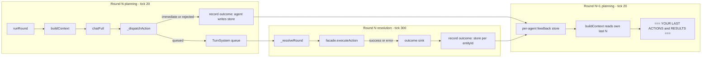

# LLM Agent — Action-Result Feedback: Investigation & Implementation Plan

> **Status:** Architect deliverable (analysis + design only — no source changes in this doc).
> **Scope:** Make the outcome of each NPC agent action (success **or** failure with a
> specific reason) visible to **that agent** in the context of its **next turn**.
> **Root symptom:** an agent queues a `droid punch` with a component that lacks the
> required `Physical.strength`; the punch fails at resolution; the failure never reaches
> the LLM; the agent repeats the identical failing punch forever.

This plan is self-contained: it lists every file/line an implementer needs, the exact data
structure, the exact capture and injection points, the edge cases, and the full test plan.

---

## 1. Investigation findings (verified against source)

### 1.1 End-to-end flow of one agent turn

The world is tick-driven (`UniversalTickSystem`, 60 ticks/s). `TurnSystemController`
owns the round cadence; the LLM agent is a fire-and-forget hook. One round = 360 ticks:
PLANNING `[0,300)`, AGENT tick at local `20`, RESOLUTION at local `300`, SETTLE `[300,360)`.

```
Tick 20 (planning)                         Tick 300 (resolution)
─────────────────────                       ─────────────────────
TurnSystemController._npcAgentPhase()       TurnSystemController._resolveRound()
  → agentFn(npc.id, round)  [DI hook]        → for each queued entry (initiative order):
  = LLMAgentController.runRound(id, round)       facade.executeAction(actionName,
        (fire-and-forget, async)                     entityId, params)   ← REAL pipeline
LLMAgentController.runRound:
  1. guard: entity exists + isNPC
  2. context = LlmContextController.buildContext(id)   ← prompt
  3. messages = [..._transcriptFor(id), {user: context}]
  4. full = LLMController.chatFull(messages, tools)
  5. for each execute_action:
        _prevalidateAction()   ← unknown action / bad id / capability gate
        _dispatchAction()      ← queueAction(...) during planning → returns {queued:true, success:true}
  6. at most ONE retry on a same-round dispatch/prevalidate failure
  7. _storeTranscript(...) → RETURN
     (runRound is DONE. It never learns the resolution outcome.)
```

Key file:line anchors:

- Agent hook fires at tick 20: [`TurnSystemController.js`](../src/controllers/core/TurnSystemController.js) `_npcAgentPhase` (L465–493); wired in [`server.js`](../src/server.js) L58–70 via `setNpcAgent((id, round) => llmAgentController.runRound(id, round))`.
- The round body: [`LLMAgentController.js`](../src/controllers/networking/LLMAgentController.js) `runRound` (L117–395). Context build L146; conversation assembly L156–159; LLM call L189; dispatch loop L218–245; retry L361–366; transcript store L369–382.
- Queueing (NOT execution): [`LLMAgentController.js`](../src/controllers/networking/LLMAgentController.js) `_dispatchAction` (L786–827) → `turnSystemController.queueAction(npcEntityId, actionName, params, 'npc')` (L794) returns `{ queued:true, success:true }` (L796). **Success here means "queued", not "executed".**
- Real execution: [`TurnSystemController.js`](../src/controllers/core/TurnSystemController.js) `_resolveRound` (L504–598) → `facade.executeAction(entry.actionName, actor.entityId, {...entry.params})` (L568).
- The action pipeline: [`actionController.js`](../src/controllers/actions/actionController.js) `executeAction` (L246–509): range (L281–286) → selection → **requirements** (L326–349) → source resolution → synergy → consequences.

### 1.2 Where the result is produced

`ActionController.executeAction` returns a structured result in every branch:

- Range fail: `{ success:false, error: rangeCheck.error }` — [`actionController.js`](../src/controllers/actions/actionController.js) L283–286 (range text from [`RangeValidator.js`](../src/controllers/actions/RangeValidator.js) `checkGrabRange` L48–85).
- Requirement fail: `{ success:false, error: 'Requirement failed: ' + message }` — [`actionController.js`](../src/controllers/actions/actionController.js) L335 / L345. The message for a component lacking a stat is `No component possesses the required {trait}.{stat} (>= {minValue})` from `ERROR_REGISTRY.MISSING_TRAIT_STAT` (L34) via `_resolveError` (L521–542), produced by [`RequirementResolver.js`](../src/controllers/actions/RequirementResolver.js) `checkComponentRequirements` (L70–148) → [`RequirementChecker.js`](../src/utils/RequirementChecker.js) `checkRequirementsForComponent` (L100–130, `MISSING_TRAIT_STAT`).
- Consequence / runtime errors: L376–381, L414–435, L438–458, L498–503.
- Success: `{ success:true, action, entityId, synergy, ...consequenceResult }` (L491–497). `consequenceResult` carries `executedConsequences` and a per-consequence `results[]` (see [`ConsequenceDispatcher.js`](../src/controllers/consequences/ConsequenceDispatcher.js) `execute` L55–88) — this is the "partial success" signal (top-level `success:true` while individual consequences may have `success:false`).

### 1.3 Where the result is currently dropped (the 3 gaps)

**Gap A — the resolution-time outcome is never routed to the acting agent.**
In [`TurnSystemController.js`](../src/controllers/core/TurnSystemController.js) `_resolveRound` (L565–585), the `result` from `facade.executeAction` (L568) is used for **two things only**:
- success → `Logger.info` + `this._recordEvent(...)` (L576–578)
- failure → `Logger.warn` + `this._recordEvent(...)` (L580–583)

`_recordEvent` (L656–671) writes to the **shared, per-world** `worldEventLogController` ring (capacity 50) → surfaced in the `=== RECENT EVENTS ===` section for **everyone**. It is **never** written to any per-agent memory. By the time resolution runs (tick 300), the acting NPC's `runRound` already returned (at tick 20) — so the agent has no channel to receive this outcome. This is the core bug.

**Gap B — the only per-agent cross-round memory is disabled.**
`LLMAgentController` already has a per-agent transcript: `_transcripts` Map (L74), `_storeTranscript` (L553–557), `_transcriptFor` replay (L509–547), replayed into `messages` at L157. **But** `TRANSCRIPT_ROUNDS = 0` (L34), so `_storeTranscript` does `rounds.slice(-0)` → `[]` (L556) — every stored transcript is immediately emptied and `_transcriptFor` always returns `[]`. The same-round tool-role feedback exists in code (L369–382) but is dead. (Same-round dispatch/prevalidate failures DO still trigger the single in-round retry via `_buildFeedbackMessages` L859–915 — that part works — but nothing survives to the *next* round.)

**Gap C — the context renderer has no per-agent action-outcome section.**
[`LlmContextController.js`](../src/controllers/networking/LlmContextController.js) `buildContext` (L61–129) renders exactly six sections (L349–426): `YOUR STATE`, `NEARBY ENTITIES`, `YOUR ACTIONS (executable now)`, `HINTS`, `RECENT EVENTS`, `ROOM CHAT`. There is **no** "your recent actions and their results" section. The only place an outcome can surface is `RECENT EVENTS` — which is shared, unattributed-by-you, capped at `maxEvents: 20` (L30), and is the **first** thing truncated under the 4000-char budget (L98–101). In a busy multi-agent world the specific "your punch failed because X" line is buried and can be evicted before the next turn.

### 1.4 Why the punch loop specifically happens (the trigger)

`_prevalidateAction` (L715–770) has a **capability gate** (L752–756): it only checks
`getActionsForEntity(npcId)[actionName].canExecute.length > 0` — i.e. "is *some* component
capable?" It does **not** validate the specific `componentId` the model chose. So a punch with
`componentId = comp-X` (no strength) passes the gate when *another* hand has strength, and only
fails later at resolution in `checkComponentRequirements` (the "Requirement failed: … strength >= 15"
branch). That failure is Gap A: produced at tick 300, logged to console + shared event log, never
delivered to the agent. Next round the LLM context is unchanged (Gap B/C) → it re-issues the same
bad punch → same failure → forever.

### 1.5 Existing per-agent history/observation memory?

Yes — the `_transcripts` Map (Gap B) — but it is (a) capped at 0 (disabled) and (b) only ever
populated with same-round dispatch results, never the resolution outcome. There is **no** store
that holds "action taken + components used + success + failure reason" keyed per agent. We add one.

---

## 2. Design overview

Add a small per-agent **action-feedback store** (a ring of outcomes keyed by `entityId`),
**capture** the real outcome at the two places it becomes known (resolution + immediate/
pre-validation), and **inject** the last N outcomes as a dedicated section of the rendered LLM
context so the next turn's prompt says, concretely, what the agent did and what happened.



The design reuses the project's existing dependency-inversion pattern (the agent is already
injected *into* the turn system as a callback via `setNpcAgent`; we add a sibling `setActionOutcomeSink`).
It reuses the existing state-owner-on-the-facade pattern (like `roomChatController` and
`worldEventLogController`: built in the composition root, stored on the facade, read via a
facade public method, **no `getAll()`** so it is excluded from the full-state broadcast).

---

## 3. Data structure & where it lives

### 3.1 New state-owner: `LlmAgentFeedbackController`

**New file:** `src/controllers/networking/LlmAgentFeedbackController.js` (PascalCase, per
project rules §1.2; placed in `networking/` next to the other LLM controllers because it is
purely agent-flow memory, not general world state).

Purpose: a **per-entity ring buffer** of recent action outcomes — the agent's own "what did I
do and what happened" short-term memory. It is a state owner (per the controller-pattern rule
that state lives in a sub-controller) but deliberately **not** broadcast (no `getAll()`), exactly
like `WorldEventLogController` and `RoomChatController`.

Public surface (mirror of `WorldEventLogController`):

```
class LlmAgentFeedbackController {
    constructor(capacityPerAgent = 5)          // keep last N outcomes PER entity
    record(entityId, outcome): void            // push onto that entity's ring, evict oldest beyond capacity
    getRecent(entityId, limit = 5): Array      // oldest → newest, defensive copies, ONLY that entity
    clear(entityId): void                      // optional, for tests
    serialize(): Object                         // { [entityId]: Array }  (only if we persist — see 3.4)
    restore(store): void
    // NO getAll()  → excluded from world-state-update broadcast (keeps payloads lean)
}
```

**Outcome entry shape** (plain, JSON-safe, defensive-copied on read):

```
{
  round: number,            // the round the action belongs to (for "r12" labels)
  actionName: string,       // e.g. "droid punch"
  componentId: string|null, // the source component the agent used (the thing that may be invalid)
  targetEntityId: string|null,
  queued: boolean,          // true = went through the turn queue; false = immediate/pre-validation
  success: boolean,
  detail: string,           // failure: the specific reason; success: short outcome (e.g. "dealt 25 damage")
  atTick: number            // when it was recorded (resolution tick, or the dispatch tick)
}
```

`detail` is the most important field — for a requirement failure it must carry the exact
`Requirement failed: No component possesses the required Physical.strength (>= 15)` text so the
model can see *why*. For a range failure, the range text. For a queue rejection, the rejection
reason (`planning window closed`, `queue full`, etc.).

### 3.2 Construction & wiring

- **Composition root** [`WorldComposition.js`](../src/composition/WorldComposition.js): build
  `const llmAgentFeedbackController = new LlmAgentFeedbackController(5)` in the early layer
  (it needs nothing at construction), add `llmAgentFeedbackController` to the facade `deps` and
  to the returned `subControllers` map.
- **Facade** [`WorldStateController.js`](../src/controllers/WorldStateController.js): store
  `this.llmAgentFeedbackController = deps.llmAgentFeedbackController ?? null` alongside the other
  sub-controllers (L81–90 region). Add a **public wrapper** (matches the `getRecentEvents` /
  `getRoomChatMessages` pattern, L991 / L1017) so callers follow the "public API only" rule:
  `getAgentActionFeedback(entityId, limit = 5) { return this.llmAgentFeedbackController ? this.llmAgentFeedbackController.getRecent(entityId, limit) : []; }`
- **Renderer** reads it via the facade public wrapper (see §5).
- **Server** [`server.js`](../src/server.js): wire the outcome sink (see §4.2) right next to the
  existing `setNpcAgent` wiring (L65–69).

### 3.3 Keying & no-leak guarantee

The store is a `Map<entityId, ring>`. `record` and `getRecent` are always scoped to a single
`entityId`. The renderer is always called for one `entityId` and reads only that key. The sink
writes only to the **acting** entity's key (the actor is always the server-injected `entityId`,
never model-sourced). ⇒ One agent's feedback can never appear in another agent's context.

### 3.4 Persistence decision (recommend: DO NOT persist)

Recommend **not** adding a schema-v2 section for this store: it is ephemeral tactical memory
("what happened in the last few rounds"), a server restart resetting it is acceptable, and it
avoids a persistence contract change (`test/contract/persistence.contract.test.js`). If the team
wants restart-survival, add a `agentFeedback: this.llmAgentFeedbackController.serialize()` section
and bump/extend the schema + update the persistence contract test — treat this as optional, not required.

---

## 4. Capture points (exact functions)

There are exactly two places an outcome becomes known. Record at both, with a strict
**no-double-record** rule.

### 4.1 Capture point A — resolution-time outcome (the real one; fixes the bug)

**Where:** [`TurnSystemController.js`](../src/controllers/core/TurnSystemController.js)
`_resolveRound` (L565–585), immediately after `result = facade.executeAction(...)` (L568).

**How (dependency inversion — do not import the LLM layer here):** add a new injected sink,
mirroring the existing `setNpcAgent` (L125–130) / `setBroadcaster` (L115–117) pattern:

- Add `/** @private {Function|null} */ this._actionOutcomeSink = null;` to the constructor
  bookkeeping (L83–95 region).
- Add `setActionOutcomeSink(sinkFn)`: validate `typeof sinkFn === 'function' || sinkFn === null`
  (throw `TypeError` otherwise, same as `setNpcAgent`), then `this._actionOutcomeSink = sinkFn`.
  Signature: `(entityId, outcome) => void` where `outcome` is the §3.1 entry **without** `atTick`
  (the sink stamps `atTick` from `this._currentTick()`).
- In `_resolveRound`, after L568 and the existing success/failure logging (L575–584), add a
  single call (best-effort, wrapped so it can never break the round — same posture as
  `_recordEvent`):
  ```
  this._emitActionOutcome(actor.entityId, {
      round,
      actionName: entry.actionName,
      componentId: entry.params?.componentId ?? entry.params?.attackerComponentId ?? null,
      targetEntityId: entry.params?.targetEntityId ?? null,
      queued: true,
      success: Boolean(result?.success),
      detail: result?.success
          ? (result?.executedConsequences !== undefined
              ? `succeeded (${result.executedConsequences} consequence(s) applied)`
              : 'succeeded')
          : (result?.error || 'unknown failure'),
  });
  ```
  where `_emitActionOutcome(entityId, outcome)` is a tiny private helper that no-ops if the sink
  is unset and otherwise calls `this._actionOutcomeSink(entityId, { ...outcome, atTick: this._currentTick() })` inside a try/catch (log + swallow, like `_recordEvent` L668–670).

**Wire it** in [`server.js`](../src/server.js) next to the existing `setNpcAgent` block (L65–69):
```
worldStateController.turnSystemController.setActionOutcomeSink(
    (entityId, outcome) => worldStateController.llmAgentFeedbackController?.record(entityId, outcome)
);
```
The turn system never imports the LLM/feedback layer — it just invokes an injected callback, so
the "turn system owns timing/ordering only, does not import the LLM layer" contract (spec §5.3/§5.8)
is preserved.

**Scope note:** recording for every resolution actor (player *and* NPC) is acceptable and cheap
(each entity's ring is capped at 5). If you prefer NPC-only, guard the sink body with
`if (entry.source === 'npc')` before emitting. Both are correct; recommend recording all so the
`GET /llm/context` debug endpoint works for any entity.

### 4.2 Capture point B — immediate / pre-validation / queue-rejected outcomes (agent side)

These outcomes never reach `_resolveRound`, so the agent records them itself, in
[`LLMAgentController.js`](../src/controllers/networking/LLMAgentController.js) `runRound`,
after the dispatch loop (i.e. at the point where `result.actions` is finalized — around L245,
and again after the json-fallback dispatch at L304–349, or — simpler and DRY — in one place
right before each `return result` where actions exist).

Add a private helper `_recordImmediateOutcomes(npcEntityId, round, result)` and call it before
the terminal returns that have `result.actions` populated. The helper iterates `result.actions`
and records **only** the entries that did NOT go through the queue:

- **Record** when `!a.queued` (covers: pre-validation failures at L227–231, immediate
  executions at the non-turn fallback in `_dispatchAction` L818–826, queue rejections
  `PLANNING_CLOSED`/`QUEUE_FULL`/etc. L802, and the "planning window closed" late-response
  case L814). Use `success: a.success`, `detail: a.detail || (a.success ? 'succeeded' : 'execution failed')`,
  `componentId`/`targetEntityId` from the matching tool-call args (recover from `parsed.actions`
  by `actionName`, as `_buildFeedbackMessages` already does at L881–893), `queued:false`.
- **Do NOT record** when `a.queued === true` — that outcome is owned by Capture point A
  (resolution). This is the no-double-record rule.

Record via the facade public path (the agent already holds `worldStateController`):
`this.worldStateController?.llmAgentFeedbackController?.record(npcEntityId, { round, ... })`
(wrap in the same defensive style as the agent's other optional-layer reads, e.g. the
`hintController` try/catch in the renderer L292–301).

> **Why both points:** the bug's failing punch is a *queued* action, so Capture point A is what
> fixes it. Capture point B is required so that (a) non-turn / immediate-execution worlds get
> feedback, and (b) pre-validation failures (unknown action, bad ID, capability gate, queue
> rejection) — which the same-round retry already sees — also persist into the next round's
> context instead of vanishing when the round ends.

### 4.3 Complementary: re-enable the tool-role transcript (low-risk, recommended)

Set `TRANSCRIPT_ROUNDS` (L34) from `0` to `2` (matches the spec's "last ≤2 rounds" intent and the
`_transcriptFor` doc at L499). This makes the existing same-round tool-result replay (L369–382,
L509–547) actually replay the *raw tool-result JSON* (`{success, error}`) for the last 2 rounds,
giving the model the exact per-tool-call result in addition to the human-readable context section.
This is independent of, and additive to, the new feedback store. It is the fix for Gap B.

> Keep `TRANSCRIPT_ROUNDS` small (2) to protect the token budget; the durable, attributed
> channel is the new context section (§5), and the transcript is a secondary same/last-round aid.

---

## 5. Injection point (rendered LLM context)

### 5.1 New section in `LlmContextController`

**Where:** [`LlmContextController.js`](../src/controllers/networking/LlmContextController.js).
Add a section builder `_buildActionFeedbackData(entityId)` (alongside `_buildSelfData` etc.,
L142–339) and a section in `_render` (L349–426).

- In `buildContext` (L61–129): after `const hintsData = this._buildHintsData(entityId);` (L80)
  add `const feedbackData = this._buildActionFeedbackData(entityId);` and thread it into the
  `_render(...)` call (L96, L100, L105, L111) and into the `data` mirror (L117–127) as
  `data.lastActions = feedbackData`.
- `_buildActionFeedbackData(entityId)` reads via the **facade public wrapper** (public-API rule):
  `const facade = this.worldStateController; const entries = facade.getAgentActionFeedback ? facade.getAgentActionFeedback(entityId, 5) : [];`
  and returns them (already defensive copies). Defensive: if the wrapper/controller is absent
  (older composition / tests), return `[]` — the section renders `(none)`, never throws (same
  posture as `_buildHintsData` L291–302).

### 5.2 Exact header, position, and wording

Insert the section **after `=== YOUR STATE ===` and before `=== NEARBY ENTITIES ===`** (the model
reads its own recent outcomes while it still "is" its state, right before it sees what it can do).
Header (stable for prompt engineering, matching the existing `=== ... ===` style):

```
=== YOUR LAST ACTIONS & RESULTS ===
[r12] droid punch (comp-…hand) → FAILED: Requirement failed: No component possesses the required Physical.strength (>= 15)
[r12] droid punch (comp-…arm) → SUCCESS: dealt 25 damage
```

Line format (oldest → newest, so the most recent is last and closest to the choice):
`[r{round}] {actionName} ({componentId || 'self'}) → {SUCCESS|FAILED}: {detail}`
- Success line: `→ SUCCESS: {detail}` (detail e.g. `succeeded (2 consequence(s) applied)` or, for
  damage, a short `dealt N damage` if you surface it — keep ≤ 1 line).
- Failure line: `→ FAILED: {detail}` (detail is the verbatim pipeline reason — this is what breaks the loop).
- Truncate each `detail` to ~160 chars (reuse the `BUDGET.perMessageChars` idea, L32) so one
  pathological error cannot blow the budget.
- Empty → print the header + `(none)` (stable structure, matching every other section, L381–393).

Add the header to `BUDGET`-awareness: this section is small (≤5 short lines ≈ ≤1200 chars worst
case) and is counted in `stats.chars`.

### 5.3 Budget / expiry behavior

- **Expiry:** the ring itself caps at 5 per entity (constructor). The renderer shows the last 5.
  Under the 4000-char budget, follow the existing truncation ladder (L98–114): when over budget,
  after halving events, reduce this section to the **last 3**, then (if still over) **last 1**
  (newest only — the most recent outcome is the most decision-relevant). Add a
  `stats.truncated.actionFeedback` flag mirroring the existing flags.
- **Do not** let this section push out `YOUR STATE` or `YOUR ACTIONS` (the decision inputs);
  it is the most expendable of the "new" content, so it truncates before chat is dropped.

### 5.4 Endpoint effect

`GET /llm/context` ([`llmRoutes.js`](../src/routes/llmRoutes.js) L39–85) needs **no change** —
it already returns `buildContext`'s `text`/`data`/`stats`, so the new section + `data.lastActions`
flow through automatically. (Good for manual debugging of the loop.)

---

## 6. Edge cases (explicit handling)

| Case | Handling |
|---|---|
| **Multiple agents acting in parallel** | Store is keyed by `entityId`; each agent's `runRound`/`buildContext` reads only its own key. The resolution sink writes only to the acting entity. No cross-agent leak. (§3.3) |
| **Action partially succeeds** | `executeAction` returns top-level `success:true` with `consequenceResult.executedConsequences` possibly < total. Record `success:true` and a `detail` noting the count (e.g. `succeeded (1/2 consequences applied)`). The LLM sees "mostly worked" rather than a false failure. (Capture A, §4.1) |
| **Agent turn interrupted** (LLM timeout, `NPC_GONE`, degeneration) | The round records no *new* outcome, but the ring is **not cleared** at round start — it is only evicted by capacity. So the next successful round still sees the prior failures. No stale "pending" entry is created (we record only real outcomes, never placeholders at queue time). (§4.2) |
| **Queued action whose round is never resolved** (restart before tick 300) | No outcome recorded (we intentionally do not record at queue time). The agent simply has no feedback for it and re-decides fresh next round. Acceptable; avoids stale data. (§4.1/4.2) |
| **Context size / token budget** | Section capped at 5 lines, each detail truncated to ~160 chars; participates in the 4000-char budget and truncates (5→3→1) before chat is dropped. `TRANSCRIPT_ROUNDS=2` keeps the secondary channel small. (§5.3, §4.3) |
| **Non-turn / immediate-execution worlds & tests** (`tickSystem=null`) | `_dispatchAction` takes the immediate fallback (L818–826); Capture point B records the synchronous `success`/`detail`. Works with no turn system. (§4.2) |
| **Late LLM response ("planning window closed", audit bug 4)** | `_dispatchAction` returns `{success:false, detail:'planning window closed'}` (L814); Capture point B records it so the next round knows the action was dropped. (§4.2) |
| **Older composition without the feedback controller** | `_buildActionFeedbackData` and the sink both no-op gracefully (absent wrapper/controller → `[]` / no record); the section renders `(none)`. No new hard dependency. (§3.2, §5.1) |
| **`runRound` must never throw** | All new capture paths are best-effort (try/catch + swallow, matching `_recordEvent` L668–670 and the agent's existing guards), so a feedback-store bug can never break the turn loop. (§4.1, §4.2) |

---

## 7. Files to create / modify

**Create**
- `src/controllers/networking/LlmAgentFeedbackController.js` — the per-agent ring (state owner, no `getAll()`).

**Modify (source)**
- `src/composition/WorldComposition.js` — build `LlmAgentFeedbackController(5)`, add to facade `deps` + returned `subControllers`.
- `src/controllers/WorldStateController.js` — store `this.llmAgentFeedbackController`; add public `getAgentActionFeedback(entityId, limit)`.
- `src/controllers/core/TurnSystemController.js` — add `_actionOutcomeSink` + `setActionOutcomeSink()`; emit the outcome in `_resolveRound` after `facade.executeAction` (private `_emitActionOutcome` helper).
- `src/controllers/networking/LLMAgentController.js` — `TRANSCRIPT_ROUNDS` 0→2; add `_recordImmediateOutcomes(...)` and call it before terminal returns that carry `result.actions`; record via the facade.
- `src/controllers/networking/LlmContextController.js` — `_buildActionFeedbackData(entityId)`; new `=== YOUR LAST ACTIONS & RESULTS ===` section in `_render` (after YOUR STATE); thread into `buildContext` + `data.lastActions` + `stats.truncated.actionFeedback`.
- `src/server.js` — wire `turnSystemController.setActionOutcomeSink((id, o) => worldStateController.llmAgentFeedbackController?.record(id, o))` next to `setNpcAgent`.

**Modify (tests) — see §8.**

**Deliberately unchanged:** `actionController.js`, `RequirementResolver.js`, `RangeValidator.js`,
`ConsequenceDispatcher.js` (the pipeline already returns the right `success`/`error`; we only
*consume* it), `llmRoutes.js` / `turnRoutes.js` (the new section flows through `/llm/context` for free).

---

## 8. Testing plan

Run with the project's vitest (`test/**/*.test.js`).

### 8.1 `test/unit/LLMAgentController.test.js` (existing — extend)

The hand-mocked world (`makeWorld`, L53–75) must gain an optional `llmAgentFeedbackController`
stub (a `record(entityId, outcome)` recorder + `getRecent`). New tests:

1. **Pre-validation failure is recorded for the next round.** Stub LLM returns `execute_action`
   `actionName:'fly'` (unknown). Assert `world.executeCalls` empty, `turns.queued` empty, AND
   `feedback.records` has one entry `{ actionName:'fly', queued:false, success:false, detail:'unknown action "fly"' }` for `NPC_ID`.
2. **Successful queue is NOT double-recorded by the agent.** Stub LLM queues `selfHeal`. Assert
   `turns.queued` length 1 AND `feedback.records` is empty (resolution sink owns it).
3. **Immediate (non-turn) execution is recorded.** Use `makeTurns({ phase: undefined })` (no tick
   clock → `TURNS_DISABLED` → immediate fallback). Stub `world.executeResult = { success:false, error:'Requirement failed: ...' }`. Assert `feedback.records` has `{ success:false, queued:false, detail:'Requirement failed: ...' }`.
4. **Transcript now replays (TRANSCRIPT_ROUNDS=2).** Run two rounds; assert the second round's
   `chatFull` `messages` include the first round's assistant tool-call + tool-role result (this
   test currently cannot pass — it is the Gap B regression lock).

### 8.2 `test/unit/LlmContextRenderer.test.js` (existing — extend)

The mocked facade (`makeWorld`, L54–149) must gain `getAgentActionFeedback(entityId, limit)`.
New tests:

1. **Section present & ordered.** `buildContext('ent-self')` text contains
   `=== YOUR LAST ACTIONS & RESULTS ===` between `=== YOUR STATE ===` and `=== NEARBY ENTITIES ===`.
2. **Formatted lines.** Stub returns two outcomes (one FAILED with the exact
   `No component possesses the required Physical.strength (>= 15)` detail, one SUCCESS). Assert the
   rendered lines match `[r12] droid punch (comp-hand) → FAILED: …` and `→ SUCCESS: …`, oldest→newest.
3. **`(none)` when empty.** `getAgentActionFeedback → []` ⇒ `=== YOUR LAST ACTIONS & RESULTS ===\n(none)`.
4. **Data mirror.** `data.lastActions` equals the returned entries.
5. **Budget.** Flood the section (long details) so total > 4000; assert `stats.chars ≤ 4000`,
   `stats.truncated.actionFeedback === true`, and the section collapses to ≤ the newest 1–3 lines.
6. **Absent controller degrades.** `makeWorld` without `getAgentActionFeedback` ⇒ section is
   `(none)`, no throw (mirrors the hintController-absent test, L366–373).
7. **No cross-entity leak.** `getAgentActionFeedback` is always called with the queried `entityId`
   (assert the argument) — and a second entity's buildContext does not contain the first's lines.

### 8.3 `test/contract/LLMAgent.integration.contract.test.js` (existing — the end-to-end lock)

Uses the REAL world + REAL agent (only `fetch` stubbed). Add:

1. **THE bug regression — failing punch is visible next round.** Round 0: stub `fetch` to make
   LLM Killer propose `droid punch` with a `componentId` that will fail at resolution (e.g. a
   component without `Physical.strength >= 15` while the action still passes the capability gate).
   Step to tick 20 → await the agent promise (queued). Step to tick 300 → resolution fails it.
   Assert `world.llmAgentFeedbackController.getRecent(bolt.id, 5)` now contains
   `{ success:false, queued:true, detail: expect.stringContaining('Requirement failed') }`.
   Then step to round 1 (tick 360, then 380) and **capture the context the LLM actually receives**
   (have the round-1 `fetch` stub record the `messages[?]` user content) and assert it contains
   `=== YOUR LAST ACTIONS & RESULTS ===` and the `→ FAILED: Requirement failed…` line. This proves
   the full loop: fail at resolution → stored → injected into the *next* prompt.
2. **Success path.** LLM Killer `selfHeal` (as in scenario (a)) → after tick 300, the feedback
   ring has a `success:true` entry; next-round context shows `→ SUCCESS`.
3. **No cross-agent leak.** If a second NPC is present, assert NPC B's round-1 context does NOT
   contain NPC A's feedback line.

### 8.4 `test/contract/TurnSystem.contract.test.js` (existing — extend)

Add: `_resolveRound` invokes the injected outcome sink. Inject
`setActionOutcomeSink(spy)`, queue one action that succeeds and one that fails (out-of-range
punch, per existing spec §5.12 style), step to tick 300, assert `spy` was called once per resolved
entry with the correct `(entityId, { actionName, success, detail, queued:true, round })`. Also
assert that with **no** sink set (default) the round still completes unchanged (backward compat).

### 8.5 New unit test (optional but recommended)

`test/unit/LlmAgentFeedbackController.test.js` — capacity/eviction per entity, `getRecent` ordering
+ defensive copies (mutating a returned entry does not mutate the store), per-entity isolation
(record for A does not appear in B's `getRecent`), `clear`, and (if persisted) `serialize`/`restore`.

### 8.6 No changes needed
- `test/contract/persistence.contract.test.js` — only if we choose to persist (§3.4 recommends no).
- `test/unit/RangeValidator.test.js`, `LLMController.chatFull.test.js` — unaffected.

---

## 9. Conventions followed (per `wiki/project_rules.md`)

- **Public API only / one-way flow:** the renderer reads the store via the facade public wrapper
  `getAgentActionFeedback`; the turn system talks to the agent layer only through an injected
  sink callback (no upward state push, no LLM import in the turn system).
- **State owner in a sub-controller:** the feedback store is its own controller (state lives in a
  sub-controller), built in the composition root, stored on the facade — same shape as
  `worldEventLogController` / `roomChatController`.
- **No broadcast bloat:** no `getAll()` on the new controller ⇒ it is excluded from
  `world-state-update` (keeps every full-state payload lean, spec §4.1/§4.7).
- **Centralized logging:** all new log lines use `Logger`, never `console.*`.
- **Defensive copying:** `getRecent` returns defensive copies (the ring util already does this).
- **Data-driven, no new error taxonomy:** we reuse the pipeline's existing `success`/`error`
  strings verbatim; no new codes.
- **PascalCase** for the new controller (new-class convention).
- **runRound never throws / turn loop bulletproof:** every new capture path is best-effort
  try/catch, matching `_recordEvent` and the agent's existing guards.

---

## 10. Acceptance criteria (definition of done)

- [ ] A queued NPC action that fails at resolution produces a per-agent feedback entry with the
      verbatim pipeline reason (e.g. `Requirement failed: No component possesses the required
      Physical.strength (>= 15)`), keyed to that NPC.
- [ ] On the NPC's **next** round, the rendered context contains a
      `=== YOUR LAST ACTIONS & RESULTS ===` section showing that failure — verified by capturing
      the actual `chatFull` `messages` in the integration contract test.
- [ ] The failing-punch-repeat loop is broken: after one failed punch, the next round's prompt
      tells the model *why* it failed so it can pick a valid component or another action.
- [ ] No agent's feedback appears in another agent's context (isolation asserted).
- [ ] Partial success is reported as success (with a count), not as a false failure.
- [ ] The 4000-char budget holds with the new section present; `stats.truncated.actionFeedback`
      flags truncation.
- [ ] `world-state-update` payload size is unchanged (no `agentFeedback` key in the broadcast).
- [ ] `runRound` still never throws; the turn round still never aborts when the sink/store misbehaves.
- [ ] All existing tests in §8.1–8.4 still pass (no regressions).
