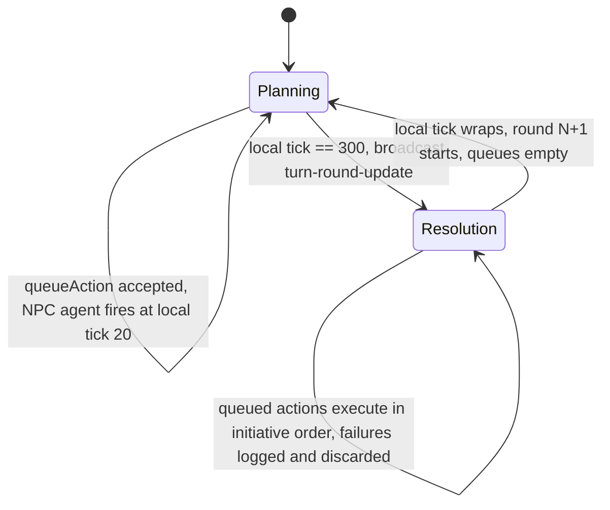
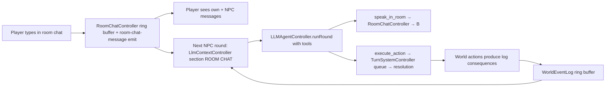
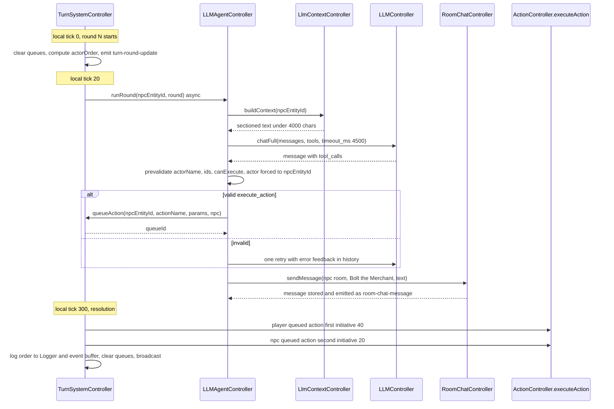

# LLM, Turn System & NPC — Technical Specification

> **Status:** Approved-for-implementation specification (architect deliverable)
> **Scope:** 4 features — (B) state→text translation layer, (A) simultaneous-planning turn system, (C) text-based actions via LLM tool calling, (D) NPC + per-room chat — plus a step-0 bug sanitation pass.
> **Audience:** Implementers. Each section lists exact files, signatures, data shapes, example request/response, and testable acceptance criteria.
> **Companion updates:** status changes in [`wiki/bugfixWiki/README.md`](bugfixWiki/README.md) for BUG-069 / BUG-124.

---

## 1. Why this spec exists (background)

The world is server-authoritative and **real-time**: actions are REST event-driven, state is broadcast whole via `world-state-update` (see [`WorldStateBroadcastService.js`](../src/services/WorldStateBroadcastService.js)), and a 60-ticks/sec deterministic loop ([`UniversalTickSystem.js`](../src/utils/UniversalTickSystem.js)) currently drives exactly one job (`internal-components`, interval 5). The LLM integration ([`LLMController.js`](../src/controllers/networking/LLMController.js)) is a **stateless echo box**: `POST /chat` forwards `messages` with no system prompt, no world context, and no way to act on the world — and it cannot even parse a tool-calling response (see §6.1 for the bug).

We want **droids that think**. Three capabilities are needed, in dependency order:

1. The LLM must be able to *read* the world → **Feature B** (a token-budgeted, LLM-readable context renderer + event ring buffer + natural-language action descriptions).
2. The world must be able to *pace* who acts when, so an LLM agent (which is slow by nature) and a human player can interleave fairly → **Feature A** (simultaneous planning + stat-based initiative).
3. The LLM must be able to *act* on the world safely → **Feature C** (tool calling, one generic action tool, pre-execution validation, one retry).
4. The world needs a *personality* to talk to → **Feature D** (a merchant NPC, a per-room chat channel the NPC and the player share).

### 1.1 Chosen semantics for turns (decided by product owner — binding)

> **Simultaneous planning + initiative by stats.** All participants (players and NPCs) may plan/queue actions at the *same time* within a per-round planning window. When the window closes, queued actions execute in initiative order, where each entity's **stats** decide who acts first.

Everything in Feature A follows from this sentence.

### 1.2 Cross-cutting decisions (apply to all features)

| Decision | Choice | Why |
|---|---|---|
| New class naming | **PascalCase** (`TurnSystemController`, `LLMAgentController`, …) | Wiki recommends PascalCase for new classes; `src/controllers` has a mixed legacy convention, new code should not perpetuate the older camelCase pattern (see BUG-052 guidance). |
| Construction | **Composition root** ([`WorldComposition.js`](../src/composition/WorldComposition.js)) for anything that is *world state*; **server.js** for *services* that depend on the LLM layer or the broadcast service | Mirrors the FASE 5 pattern: world-state sub-controllers are built topologically and receive the facade via `setWorldStateController()`; services created in [`server.js`](../src/server.js) (broadcast service, socket lifecycle) wire things that only exist at boot. |
| Data | **`data/*.json` via `DataLoader.loadJsonSafe()`** with `_validate*()` + `Logger.info` count | Project rule §5/§6 — data-driven is a core constraint (BUG-018). |
| Errors | Structured `{ success:false, code, error }` / HTTP errors `{ error, details }`; rule-level failures at execution time return **200 + `{result:{success:false, code}}`** | Matches the existing `execute-action` contract exactly; no new error taxonomy. |
| IDs | New IDs go through [`idGenerator.js`](../src/utils/idGenerator.js) (`q-` queue IDs); all IDs in requests validated with [`IdResolver.js`](../src/utils/IdResolver.js) | Typed-ID system (BUG-106/107) — no synthetic timestamp IDs (the `dropped-…` antipattern is one of the step-0 bugs). |
| Broadcasting | Full-state keeps `world-state-update`; **new** events `turn-round-update` and `room-chat-message` are added as thin methods on `WorldStateBroadcastService` (single broadcast choke point), not new Socket.IO channels | Lowest friction with the existing service; clients already handle one global-emit pattern. |
| Logging | `Logger` only; no `console.*` | Project rule §2 (BUG-123 precedent). |
| Client | No build step, vanilla JS modules; one new CSS file per feature area in `public/css/`, one controller class per feature in `public/js/`, wiring in `App.js` | Matches the existing client architecture (BUG-053 layout, controller-per-concern pattern). |

---

## 2. Consolidated context (verified against source)

Facts the implementer must not re-derive (all line numbers verified at spec time):

- **Tick loop:** [`UniversalTickSystem.js`](../src/utils/UniversalTickSystem.js) — `setInterval` at `MAX_TICKS_PER_SECOND` (60/s), absolute `currentTick`, job due when `currentTick % interval === 0`, jobs sorted by `order` (lower first). One job today: `internal-components` (interval 5, order 0), registered in [`InternalComponentController.js`](../src/controllers/core/InternalComponentController.js#L46) `initialize()`. **Jobs must be synchronous**; `currentTick` is already persisted as `serializedAtTick`.
- **Action pipeline:** `POST /execute-action` ([`actionRoutes.js`](../src/routes/actionRoutes.js#L83)) → `worldStateController.executeAction()` ([`WorldStateController.js`](../src/controllers/WorldStateController.js#L849)) → `ActionController.executeAction()` ([`actionController.js`](../src/controllers/actions/actionController.js#L246)) → range → component list → selection validation (skipped when no lock — backward compatible) → requirements → source-component resolution → synergy → `ConsequenceDispatcher` (8 handlers). The endpoint is already a **programmatic executor**: no prior selections required; selection locks are auto-released in `finally` ([`actionController.js`](../src/controllers/actions/actionController.js#L504)). **The turn system reuses this exact function — no bypass, no parallel executor.**
- **Capabilities:** `GET /actions?entityId=` → `{ actions: { <name>: { targetingType, range, requirements, consequences, canExecute[], cannotExecute[] } } }` via `getActionsForEntity()` ([`WorldStateController.js`](../src/controllers/WorldStateController.js#L828)) → `ComponentCapabilityController`.
- **Actions registry:** [`data/actions.json`](../data/actions.json) — 8 actions: `move` (spatial), `dash` (spatial), `selfHeal` (self_target), `droid punch` (component, range 100), `cut` (component, range 50), `dropItem` (spatial, range 100), `pickUpItem` (component, range 50), `shootT1` (component, range 100). **No natural-language description field exists** — only `log` consequence text with placeholders.
- **Traits:** [`data/traits.json`](../data/traits.json) — `Physical{durability,mass,volume,temperature,strength,sharpness}`, `Mind{think_level}`, `Spatial{x,y}`, `Movement{move}`, `Manipulation{fine_controls}`.
- **Components:** [`data/components.json`](../data/components.json) — the player droid (`smallBallDroid`) has `Movement.move` only on `droidRollingBall` (20 × 2 = **40 total**); `Mind.think_level` only on `droidHead` (5); `Manipulation.fine_controls` on hands/fingers (50/30); `Physical.strength` on `droidHand` (25).
- **Persistence:** `serialize()`/`restore()` ([`WorldStateController.js`](../src/controllers/WorldStateController.js#L446)) — `PERSISTENCE_SCHEMA_VERSION = 1`; `restore()` **rejects** any other version with `SCHEMA_VERSION_MISMATCH`; 10 required `state` sections; round-trip test in [`persistence.contract.test.js`](../test/contract/persistence.contract.test.js).
- **LLM:** `chat(messages, options)` returns `Promise<string>`; `options.system` / `options.tools` / `options.tool_choice` already passthrough ([`LLMController.js`](../src/controllers/networking/LLMController.js#L112)); **bug** in `_validateAndExtractContent` ([`LLMController.js`](../src/controllers/networking/LLMController.js#L221)) — tool-call responses (content `null`) throw `LLM_PARSE_ERROR`; `_validateMessages` ([`LLMController.js`](../src/controllers/networking/LLMController.js#L198)) forbids `role: 'tool'` and `content: null` assistant messages (both needed for a retry loop).
- **Logs:** `LogConsequenceHandler._handleLog` ([`LogConsequenceHandler.js`](../src/controllers/consequences/LogConsequenceHandler.js#L26)) writes `[Action:<targetId>] <message>` to the server `Logger` **only** — no in-memory event sink, no event broadcast, no log endpoint. It is constructed with **no arguments** in [`consequenceHandlers.js`](../src/controllers/consequences/consequenceHandlers.js#L48), which *does* receive the facade via `setWorldStateController()`.
- **Boot order:** [`server.js`](../src/server.js) — bootstrap → tickSystem → llmController → `buildWorldState(tickSystem)` → broadcastService → socketLifecycle → `registerRoutes(app, llmController, worldStateController, broadcastService)` → `setBroadcastService` → initial broadcast → `tickSystem.start()`.
- **Routes registration:** [`routes/index.js`](../src/routes/index.js#L34) — every route module is `register(router, {deps})` **except** `internalComponentRoutes` (standalone router reading `req.app.locals.worldStateController` — BUG-069, nobody ever sets it → 4 of 5 endpoints 503).
- **Entities:** `spawnEntity(blueprintName, roomId)` ([`stateEntityController.js`](../src/controllers/core/stateEntityController.js#L72)) merges `{id, blueprint, components, internalComponents:{}, location, spatial:{x:0,y:0}, status:'active'}`; spawn observers run for *every* spawn (applies `data/world.json` initialSpawns). `initializeWorld()` ([`WorldStateController.js`](../src/controllers/WorldStateController.js#L153)) spawns the client droid in `start_room` and a vault droid in `far_right_room`.
- **Rooms:** [`data/rooms.json`](../data/rooms.json) — logical ids `start_room` → `right_room` → `far_right_room`; facade exposes `getRoomUidByLogicalId()`.
- **Chat today:** only `POST /chat` ([`chatRoutes.js`](../src/routes/chatRoutes.js#L20)) with per-IP limiter 20/60s from [`rateLimiter.js`](../src/utils/rateLimiter.js); LLM-echo only. No per-room chat, no store.
- **Client:** `ClientApp` ([`App.js`](../public/js/App.js)) orchestrates; `WorldStateManager` holds the last broadcast state (so **any** sub-controller implementing `getAll()` automatically appears in `state.<key>` of every `world-state-update`); socket handlers in [`EventDispatcher.js`](../public/js/EventDispatcher.js#L61); current room = `droid.location` (a room **UID**); the config bar's `#config-bar-center` div is **empty** (free HUD slot); overlays are registered through `OverlayManager.register(panelId, controller, buttonId, shortcutKey, showData)` ([`OverlayManager.js`](../public/js/OverlayManager.js#L44)).
- **No Socket.IO server rooms** are used anywhere (no `socket.join` on server or client) — see Feature D decision.

---

## 3. Step 0 — Bug sanitation (do this first)

**Why first:** Feature A/B/C build directly on the internal-component routes (which 503), the client inventory flow (BUG-124), and the dropped-item ID family. Shipping features on a broken base makes every later test ambiguous.

| # | Bug | Decision | Files |
|---|---|---|---|
| 0.1 | **BUG-069** — `req.app.locals.worldStateController` never set → 4/5 internal-component endpoints 503 | **Fix via DI** (not `app.locals`): convert the module to the standard `register(router, { deps })` shape used by every other route module. `app.locals` is an undocumented side channel that already bit us once. | [`internalComponentRoutes.js`](../src/routes/internalComponentRoutes.js), [`routes/index.js`](../src/routes/index.js) |
| 0.2 | **Dead broken endpoint** — `DELETE /inventory/dropped/:droppedItemId` ([`inventoryRoutes.js`](../src/routes/inventoryRoutes.js#L854)) validates with `validateItemId` (requires `item-` prefix) but generated IDs are `dropped-<ts>-…` ([`DropItemHandler.js`](../src/controllers/consequences/DropItemHandler.js#L102)); **zero clients call it** | **Remove the route** (not repair it). Reasons: (a) no caller exists in `public/`; (b) picking up a dropped item already removes it via `POST /pick-up-item` → `executePickUpItem()` → `PickUpItemHandler` → `removeDroppedItem()`; (c) "fixing" it means minting a new `drop-` typed-ID family that the map renderer, pick-up overlay and persistence all ignore — new surface, no user. The underlying `worldStateController.removeDroppedItem()` **stays** (it is the pick-up path). | [`inventoryRoutes.js`](../src/routes/inventoryRoutes.js) |
| 0.3 | **BUG-124** — client `_checkItemFitInContainer` reads `containerSlot.dataset.containerCapacity` which is **never written** ([`public/js/InventoryManager.js`](../public/js/InventoryManager.js#L1432)) → dropping into a container is always rejected client-side | **Write the attribute at render time.** The item card render already sets `data-item-volume`, `data-item-type`, `data-is-container` ([`public/js/InventoryManager.js`](../public/js/InventoryManager.js#L548)); add `data-container-capacity` there, set to the container's own `volume` (internal capacity) when `isContainer` is true. | [`public/js/InventoryManager.js`](../public/js/InventoryManager.js) |

### 3.1 Exact changes

**0.1** — `internalComponentRoutes.js`:
- Remove the module-level `const router = express.Router()` and the 4× `req.app.locals.worldStateController` reads.
- New export:
  ```js
  export function register(router, { worldStateController }) {
      // same 5 handlers as today, using the injected worldStateController.
      // Each handler keeps its current try/catch + status codes,
      // minus the 503 app.locals guard.
  }
  ```
- `routes/index.js`:
  ```js
  import { register as registerInternalComponentRoutes } from './internalComponentRoutes.js';
  // inside registerRoutes(), alongside the other registers:
  registerInternalComponentRoutes(router, { worldStateController });
  ```
  and delete the standalone `app.use('/', authMiddleware, internalComponentRoutes, router)` mount — the internal-component paths (`/internal-components/…`) ride the main router, behind the same single auth gate (they already define their own full paths, so no prefix change).

**0.2** — delete the `DELETE /inventory/dropped/:droppedItemId` route block (lines ~850–881 of [`inventoryRoutes.js`](../src/routes/inventoryRoutes.js#L850)). Keep `GET /inventory/dropped`.

**0.3** — in the card render of [`public/js/InventoryManager.js`](../public/js/InventoryManager.js#L548), where `data-is-container` is set, also set:
```js
card.dataset.containerCapacity = isContainer ? String(itemDef.volume ?? 0) : '';
```
(`itemDef` is the `data/inventoryItems.json` definition already in scope at render time; if the render site only has the live item object, read the volume from the item's definition via the manager's existing item-definitions access.)

### 3.2 Acceptance criteria (step 0)

- [ ] `GET /internal-components/:entityId` and the other 4 internal-component endpoints return real data (no 503) with a live world; `grep -r "app.locals" src/` returns nothing.
- [ ] `DELETE /inventory/dropped/x` returns 404 (route gone); `POST /pick-up-item` still removes the dropped item (regression check).
- [ ] Client: dragging an item onto a container card with enough capacity succeeds (previously always rejected); insufficient capacity is still rejected.
- [ ] `wiki/bugfixWiki/README.md` index: BUG-069 and BUG-124 status updated (this spec's companion edit); the dead-endpoint removal is recorded there as a note under BUG-076's row or a new bug entry per [`template.md`](bugfixWiki/template.md) (implementer's call, low effort).

---

## 4. Feature B — State→text translation layer (for the LLM)

**Why this shape:** a local LLM (LM Studio, 8k–32k context) can only reason about the world through text. We therefore need (a) a **single endpoint** that composes a bounded, sectioned narrative, (b) an **event ring buffer** so the LLM has a short-term memory of what just happened (the action pipeline today only writes to the server `Logger`), and (c) **natural-language action descriptions** in `data/actions.json` because the LLM cannot read `damageComponent` consequences. The renderer is a *logic controller* (pure composition of injected state), not a state owner — the only new *state* is the event ring buffer.

### 4.1 Event ring buffer

**New file:** `src/utils/EventRingBuffer.js` — generic, stateless-config ring (why a util: it is reusable, trivially testable, and not world-specific).

```js
export class EventRingBuffer {
    constructor(capacity = 50)            // hard cap per buffer
    push(entry: Object): void             // evicts oldest beyond capacity; entries are stored by reference, snapshot via structuredClone on read
    getAll(): Array                       // oldest → newest, defensive copies
    getRecent(limit: number): Array       // last `limit`, oldest → newest
    clear(): void
    serialize(): Array
    restore(entries: Array): void
}
```

**New file:** `src/controllers/core/WorldEventLogController.js` (PascalCase; it is the *state owner* of the buffer, per the controller-pattern rule that state lives in a sub-controller):

```js
class WorldEventLogController {
    constructor(capacity = 50)            // wraps EventRingBuffer
    record(event: {
        tick: number|null,                // stamped by the caller
        action: string,                   // e.g. 'droid punch', 'turn', 'dropItem'
        targetId: string|null,
        message: string,
        level: 'info'|'warn'
    }): void                              // stamps ts: Date.now()
    getRecent(limit = 20): Array
    serialize(): Array                    // for persistence
    restore(entries: Array): void
    // NOTE: intentionally NO getAll() — so it is excluded from the
    // world-state broadcast aggregation (keeps every full-state payload lean).
}
```

Event format for LLM consumption (renderer, not storage): `[${tick ?? '----'}] [${action}] ${message}`.

**Feed point (why here):** `LogConsequenceHandler` — every successful and every failed action has a `log` consequence, so this is the *single* choke point where "something happened in the world" already produces a human sentence. We do not also feed from `ConsequenceDispatcher` (would double-log). Turn-system synthetic lines (Feature A) are recorded directly by `TurnSystemController` via `record()`.

**Modify [`LogConsequenceHandler.js`](../src/controllers/consequences/LogConsequenceHandler.js):**
```js
class LogConsequenceHandler {
    constructor(eventSink = null) { this._eventSink = eventSink; }
    _handleLog(targetId, params, context) {
        // ...existing Logger write unchanged...
        if (typeof this._eventSink === 'function') {
            this._eventSink({
                action: context?.actionName ?? 'action',
                targetId,
                message,                  // the resolved message text
                level
                // tick is stamped by the sink wrapper (below)
            });
        }
        return { success: true, message: `Logged: ${message}`, data: { level, targetId } };
    }
}
```

**Modify [`consequenceHandlers.js`](../src/controllers/consequences/consequenceHandlers.js):** constructor becomes `constructor({ equippedItemStats = null, worldEventLog = null } = {})` and builds
```js
const sink = worldEventLog
    ? (event) => worldEventLog.record({
          ...event,
          tick: this.worldStateController?.tickSystem?.currentTick ?? null
      })
    : null;
this.logHandler = new LogConsequenceHandler(sink);
```
(The closure reads `this.worldStateController` lazily — the facade is injected post-construction, exactly like the existing handlers.)

**Composition + facade wiring:**
- [`WorldComposition.js`](../src/composition/WorldComposition.js): construct `const worldEventLog = new WorldEventLogController(50)` in Layer 0; pass into `new ConsequenceHandlers({ equippedItemStats, worldEventLog })`; add `worldEventLogController` to the facade deps and to the returned `subControllers` map.
- [`WorldStateController.js`](../src/controllers/WorldStateController.js): store `this.worldEventLogController = deps.worldEventLogController`; public wrapper `getRecentEvents(limit = 20)`; **persistence** — add section (see §4.5).

### 4.2 Natural-language action descriptions (data)

**Modify [`data/actions.json`](../data/actions.json)** — add a `description` field (English; this is the LLM's language and the project's wiki language) to every action. Exact text to write:

| Action | `description` |
|---|---|
| `move` | "Advance your droid toward a target point in the current room using your rolling wheels." |
| `dash` | "Sprint: move twice as fast toward the target point, but wear your chassis down by 5 durability." |
| `selfHeal` | "Run a self-repair cycle that restores 10 durability to your core." |
| `droid punch` | "Throw a punch with your arm, dealing damage equal to your Physical.strength. Close-range melee attack." |
| `cut` | "Slice the target with an equipped knife, dealing damage equal to the knife's sharpness. The knife loses 1 sharpness with every cut." |
| `dropItem` | "Drop an item from your inventory onto the map near you, where others can pick it up." |
| `pickUpItem` | "Pick up an item that is lying on the map nearby, or take an item from another entity's hand." |
| `shootT1` | "Fire your T1 weapon. Consumes one stored projectile and deals damage equal to the projectile's volume." |

No `aiDescription` field — one description is enough for both UI tooltips (optional, later) and the LLM; do not fork the data.

### 4.3 Context renderer

**New file:** `src/controllers/networking/LlmContextController.js` (why `networking/`: it exists to feed the LLM flow, mirroring where [`LLMController.js`](../src/controllers/networking/LLMController.js) lives; it is a *reader/composer*, receives the facade via `setWorldStateController()`).

```js
class LlmContextController {
    static BUDGET = {
        maxChars: 4000,          // hard cap on the rendered text (~1k–1.3k tokens)
        maxEntities: 8,          // same-room entities listed
        otherRoomEntities: 2,    // entities from other rooms (room-named)
        maxEvents: 20,
        maxChat: 10,
        perMessageChars: 200     // per chat/event line truncation
    };

    constructor({ actionRegistry })   // data/actions.json (already loaded by composition root)
    setWorldStateController(facade)

    buildContext(entityId: string, options = {}): {
        text: string,     // the sectioned narrative (this is what the LLM receives)
        data: Object,     // structured mirror (for debugging / tests)
        stats: { chars: number, budgetChars: number,
                 truncated: { entities: boolean, events: boolean, chat: boolean } }
    }
    // options may override maxEntities / maxEvents / maxChat (clamped to BUDGET maxes)

    // private, one per section — each returns an array of lines:
    _sectionSelf(entityId)      // name, room name+description, durability (component with
                                // lowest ratio first, max 2), key stats (strength, sharpness,
                                // move total, think_level), equipped (itemType + live stats),
                                // inventory grouped by host component (type xN)
    _sectionEntities(entityId)  // same room: name, distance (Euclidean on spatial), durability,
                                // top-2 stats; then up to 2 other-room entities, room-named
    _sectionActions(entityId)   // from facade.getActionsForEntity(entityId):
                                //   one line per action with canExecute.length > 0:
                                //     "- <name>: <description> | range <range|self> | needs <Trait.stat> >= <min> | use <first canExecute id>"
                                //   plus a single summary line: "<N> actions not executable right now: <names>"
    _sectionEvents(limit)       // facade.getRecentEvents(limit) → "[tick] [action] message"
    _sectionChat(roomId, limit) // roomChatController.getMessages(roomId, limit) → "Speaker: text"
}
```

**Rendered text format (exact section headers — stable for prompt engineering):**

```
=== YOUR STATE ===
Name: Bolt the Merchant
Room: The Entrance Hall - A dimly lit hall. To your right, there is an open corridor.
Durability: merchantCore 80/100
Key stats: strength=12 sharpness=- move=20 think=8
Equipped: (none)
Inventory: powerCell x2 (merchantArm-left), dataCrystal x1 (merchantArm-right)

=== NEARBY ENTITIES ===
1. Player Droid (34 away) - durability 78/100, strength=25, move=40
2. Droid (120 away, in The Eastern Corridor) - durability 80/100

=== YOUR ACTIONS (executable now) ===
- droid punch: Throw a punch with your arm... | range 100 | needs Physical.strength >= 15 | use comp-9f2...
- selfHeal: Run a self-repair cycle... | range self | needs Movement.move >= 1, Physical.durability >= 1
2 actions not executable right now: cut, shootT1

=== RECENT EVENTS ===
[3520] [droid punch] Droid performed a punch dealing 25 damage!
[3505] [dropItem] Item 'knife' dropped at (120, 40)

=== ROOM CHAT ===
Player: Do you have spare parts?
Bolt the Merchant: Fresh power cells, best in the vault.
```

Rules: no section may be omitted when empty — print `<section header>` + `(none)` (stable structure helps weak local models). Truncation order when `maxChars` is exceeded: events first, then entities (same-room first), then chat (drop to 5). `stats.truncated` records what was cut.

### 4.4 Endpoint

**New file:** `src/routes/llmRoutes.js`; **register** in [`routes/index.js`](../src/routes/index.js) (`registerLlmRoutes(router, { worldStateController, llmContextController })` — both already in the function signature's deps object pattern; `llmContextController` is exposed on the facade so the route only needs `worldStateController` — pass `{ worldStateController }` and read `worldStateController.llmContextController`, consistent with the "public API only" rule).

```
GET /llm/context?entityId=ent-...[&maxEntities=8&maxEvents=20&maxChat=10]
```

- Validation: `entityId` required + `IdResolver.isEntityId`; unknown entity → `404 { error: 'ENTITY_NOT_FOUND' }`.
- Options are integers clamped to `LlmContextController.BUDGET` (non-numeric → 400).
- **Response 200:**
```json
{
  "entityId": "ent-6ba7b811",
  "room": { "id": "room-uid", "name": "The Entrance Hall" },
  "text": "=== YOUR STATE ===\n...",
  "data": {
    "self": { "name": "Bolt the Merchant", "isNPC": true, "durability": { "current": 80, "max": 100, "component": "merchantCore" },
              "stats": { "Physical.strength": 12, "Movement.move": 20, "Mind.think_level": 8 },
              "equipped": [], "inventory": [ { "type": "powerCell", "count": 2, "hostComponent": "comp-..." } ] },
    "entities": [ { "id": "ent-...", "name": "Player Droid", "distance": 34, "room": "same" } ],
    "actions": [ { "name": "droid punch", "description": "...", "range": 100,
                   "canExecute": [ "comp-..." ], "requirement": "Physical.strength >= 15" } ],
    "recentEvents": [ "[3520] [droid punch] Droid performed a punch dealing 25 damage!" ],
    "roomChat": [ "Player: Do you have spare parts?" ]
  },
  "stats": { "chars": 3812, "budgetChars": 4000, "truncated": { "entities": false, "events": false, "chat": false } }
}
```
- No rate limit needed (in-memory reads; the LLM-facing path is server-internal) — it sits behind the same optional auth gate as everything else.

### 4.5 Persistence (schema bump — part of Feature B, applied once)

**Modify [`WorldStateController.js`](../src/controllers/WorldStateController.js#L402):**
- `PERSISTENCE_SCHEMA_VERSION` → **2**.
- `serialize()` `state` section gains: `events: this.worldEventLogController.serialize()`.
- `restore()`: required-sections list gains `'events'`; restore step: `this.worldEventLogController.restore(structuredClone(s.events))`.
- Consequence: **v1 snapshots are rejected** (`SCHEMA_VERSION_MISMATCH`) — this is the documented, tested contract (strict versions, [`persistence.contract.test.js`](../test/contract/persistence.contract.test.js)); saves are operator tooling, not user data.

> Feature A adds the `turns` section and Feature D adds `roomChat` to the *same* v2 schema — bump once here, extend the section list in the later features (no further version bump; v2 is "pre-release" until D ships).

### 4.6 Files summary — Feature B

| Action | Path |
|---|---|
| Create | `src/utils/EventRingBuffer.js` |
| Create | `src/controllers/core/WorldEventLogController.js` |
| Create | `src/controllers/networking/LlmContextController.js` |
| Create | `src/routes/llmRoutes.js` |
| Modify | [`data/actions.json`](../data/actions.json) (8 `description` fields) |
| Modify | [`src/controllers/consequences/LogConsequenceHandler.js`](../src/controllers/consequences/LogConsequenceHandler.js) (optional sink) |
| Modify | [`src/controllers/consequences/consequenceHandlers.js`](../src/controllers/consequences/consequenceHandlers.js) (constructor dep + sink wiring) |
| Modify | [`src/composition/WorldComposition.js`](../src/composition/WorldComposition.js) (build/wire `WorldEventLogController`, `LlmContextController`) |
| Modify | [`src/controllers/WorldStateController.js`](../src/controllers/WorldStateController.js) (deps, `getRecentEvents`, schema v2 `events`) |
| Modify | [`src/routes/index.js`](../src/routes/index.js) (register `llmRoutes`) |

### 4.7 Acceptance criteria — Feature B

- [ ] Execute `droid punch` → `getRecentEvents()` returns an entry with the resolved message (`Droid performed a punch dealing 25 damage!`) and a numeric `tick`.
- [ ] More than 50 recorded events → buffer holds exactly the newest 50 (oldest evicted).
- [ ] `GET /llm/context?entityId=<npc>` returns 200 with all five section headers present, every listed action carrying `description`, `range`, requirement and a valid `comp-` id from `canExecute`; `stats.chars ≤ 4000`.
- [ ] `GET /llm/context` without `entityId` → 400; bad prefix → 400; unknown `ent-…` → 404.
- [ ] Serialize → mutate world → restore on fresh instance → `events` section identical (round-trip contract test).
- [ ] `world-state-update` payload size does **not** grow (no `events` key in the broadcast — `WorldEventLogController` has no `getAll()`).

---

## 5. Feature A — Turn system (simultaneous planning + initiative by stats)

**Why this design:** LLM agents need seconds to "think"; human reflexes need milliseconds. A shared, *deterministic* cadence is the only way both can act fairly on one server-authoritative loop. We therefore give the world a **round**: a planning window during which *everyone* may enqueue, followed by a single synchronous resolution that replays the queue in **initiative order** derived from stats. Crucially, the resolution calls the *existing* `ActionController.executeAction()` — the turn system owns **timing and ordering only**, never validation or consequences.

### 5.1 Round structure (decided — implement exactly)

Ticks are 60/s ([`Constants.js`](../src/utils/Constants.js) `MAX_TICKS_PER_SECOND`).

| Constant | Value | Meaning |
|---|---|---|
| `TURN_ROUND_TICKS` | **360** (6 s) | one full round |
| `TURN_PLANNING_TICKS` | **300** (5 s) | planning window = local ticks `[0, 300)` |
| `TURN_NPC_AGENT_TICK` | **20** | local tick where NPC agent calls are fired |
| `TURN_MAX_QUEUED_PER_ROUND` | **3** | per-entity queue cap |

- Round number `R = floor(currentTick / TURN_ROUND_TICKS)`; local tick `L = currentTick % TURN_ROUND_TICKS`.
- **Phase** is derived, never stored blindly: `L < TURN_PLANNING_TICKS ? 'planning' : 'resolution'`. Resolution executes exactly at `L === TURN_PLANNING_TICKS`; local ticks `[300, 360)` are a *settle* window (results already applied, clients catching up on broadcasts) before the next round starts at `L === 0`.
- **Late submissions:** queueing is accepted **any time during planning**, up to the tick before resolution. A submission that lands after the resolution tick sees `phase === 'resolution'` and is rejected (`PLANNING_CLOSED`). (The resolution tick handler runs before any REST queue call processed on the same tick can win — the tick job and the HTTP handler are both on the event loop; document this as "accepted until the window closes".)
- **Why 6 s:** an NPC's LLM call (4.5 s budget, §6.5) plus planning slack must fit inside the window; 5 s planning is the tight fit, 1 s settle keeps the UI responsive.

Constants go in [`src/utils/Constants.js`](../src/utils/Constants.js) (project convention) as `TURN_*`.

### 5.2 Initiative (decided — with justification)

**`initiative(entity) = sum of `Movement.move` across all of the entity's components`** (read live via `facade.getComponentStats(comp.id)`), i.e. the same aggregation the client already does for movement range (`App.js` `_getEntityMovementRange`).

- *Why `Movement.move`:* it is the only stat with "quickness" semantics, it is per-component (so builds/data can differentiate droids), and it is the stat the movement system already treats as speed. `Mind.think_level` (5) and `Manipulation.fine_controls` (50) exist but mean cognition/dexterity — using them for initiative would conflate roles. Adding a brand-new `reaction` trait would touch `traits.json` + every component definition for zero gameplay difference today.
- **Tiebreaker (deterministic):** ascending typed `entityId` (lexicographic UUID string compare). Stateless, survives persistence, no spawn-order bookkeeping. Today: player droid 2×20=**40**, vault droid **40** (tie → id order), merchant droid 2×10=**20** (acts last — deliberate: the merchant is a trader, not a fighter).

### 5.3 `TurnSystemController`

**New file:** `src/controllers/core/TurnSystemController.js`.

```js
class TurnSystemController {
    constructor({ tickSystem = null, config = {} })
    // config: { roundTicks, planningTicks, npcAgentTick, maxQueuedPerRound } — TURN_* defaults

    setWorldStateController(facade)      // reads entities/stats; calls facade.executeAction
    setBroadcaster(broadcastService)     // WorldStateBroadcastService (or test stub)
    setNpcAgent(agentFn)                 // (npcEntityId: string, round: number) => Promise<*>
                                         // dependency inversion: the turn system does NOT import the LLM layer
    initialize()                         // registers the tick job; no-op + warn if no tickSystem (test mode)

    // ── tick-driven (all deterministic; onTick is PUBLIC — tests drive it directly) ──
    onTick()                             // reads facade.tickSystem.currentTick; see state machine §5.6
    getRoundState() → {
        roundNumber, phase, currentTick, planningDeadlineTick,
        actorOrder: [ { entityId, name, initiative, queuedCount } ],
        queues: { [entityId]: [ { queueId, actionName, params, queuedAtTick, source } ] }
    }
    getAll() → this.getRoundState()      // → appears as state.turns in every world-state-update

    // ── queue API (players via REST, NPCs internally) ──
    queueAction(entityId, actionName, params = {}, source = 'player')
        → { success: true, queueId, queue } 
        | { success: false, code: 'TURNS_DISABLED'|'PLANNING_CLOSED'|'QUEUE_FULL'|
                                   'ENTITY_NOT_FOUND'|'ACTION_NOT_FOUND', error }
    cancelAction(entityId, queueId) → { success: boolean, removed?: boolean }
    getQueuedActions(entityId) → Array

    // ── internals ──
    _roundStart(round)                   // clear queues, compute+cache actorOrder, broadcast transition
    _npcAgentPhase(round)                // fire agentFn per isNPC entity, fire-and-forget w/ .catch log
    _resolveRound(round)                 // synchronous execution in initiative order (§5.5)
    _computeInitiative(entity) → number
    serialize() → { roundNumber, phase, queues, resolvedRound, lastRound }
    restore(snapshot)
}
```

**Wiring:**
- [`WorldComposition.js`](../src/composition/WorldComposition.js): `const turnSystemController = new TurnSystemController({ tickSystem })` (Layer 2 — needs only tickSystem at construction); pass to facade deps; after facade build: `turnSystemController.setWorldStateController(worldStateController)`; add `turns: turnSystemController` to the facade's `subControllers` map (→ automatic `state.turns` broadcast) and to the returned map.
- [`WorldStateController.js`](../src/controllers/WorldStateController.js): constructor calls `this.turnSystemController?.initialize()` **exactly like** `internalComponentController.initialize()` (line 125) — the job registration is side-effect-free until `tickSystem.start()`.
- [`server.js`](../src/server.js): after `setBroadcastService(broadcastService)`:
  ```js
  worldStateController.turnSystemController.setBroadcaster(broadcastService);
  worldStateController.turnSystemController.setNpcAgent(
      (npcEntityId, round) => llmAgentController.runRound(npcEntityId, round)
  );
  ```
  (Feature C provides `llmAgentController`; until then `setNpcAgent` simply stays unset — the turn system must run fine with zero NPCs.)
- **Tick job:** `new TickJob('turn-system', () => this.onTick(), 1, 1)` — interval 1 (phase math is trivial at 60/s), order 1 (after `internal-components` order 0, so stat effects from this tick are visible before initiative math).

### 5.4 Queuing gate (players + programmatic callers)

**Modify [`actionRoutes.js`](../src/routes/actionRoutes.js#L83) `POST /execute-action`:** accept optional body flag `queueForRound: true`.

- `queueForRound` absent/false → **today's exact behavior** (immediate execution). This is the backward-compatibility guarantee for the current UI.
- `queueForRound: true` → same typed-ID validation as today, then `worldStateController.turnSystemController.queueAction(entityId, actionName, params, 'player')`:
  ```js
  const q = worldStateController.turnSystemController.queueAction(entityId, actionName, params, 'player');
  res.status(q.success ? 200 : 200).json({ result: q.success
      ? { success: true, queued: true, queueId: q.queueId, queue: q.queue }
      : { success: false, code: q.code, error: q.error } });
  ```
  (Rule-level rejections — closed window, full queue — follow the project's existing "rule failure = 200 `{result:{success:false, code}}`" contract; only *malformed* input is 400.)
- `queueAction()` validates: entity exists, action exists in the registry, phase `planning`, cap `< 3`, params is an object. It stores `{ queueId: generateQueueId(), actionName, params, queuedAtTick, source }`. **No deep validation of targets at queue time** (range may be true at queue time and false at resolution — that is the point of resolution-time validation; see §5.5).
- **New file:** `src/utils/idGenerator.js` — add `generateQueueId()` → `q-${crypto.randomUUID()}` (typed-ID family extension, BUG-107 consistency).

**New file:** `src/routes/turnRoutes.js` (registered in [`routes/index.js`](../src/routes/index.js)):

```
GET /turns/state
  → 200 { turns: <getRoundState() output> }

GET /turns/queue/:entityId            (entityId must be ent-*)
  → 200 { entityId, phase, queue: [ { queueId, actionName, params, queuedAtTick, source } ] }

DELETE /turns/queue/:entityId/:queueId
  → 200 { success: true, removed: true }   (only the owner entity's own queue entries; queueId not found → success:false)
```

### 5.5 Resolution (determinism contract)

At `L === TURN_PLANNING_TICKS`, `_resolveRound(round)` runs **synchronously** (all consequence handlers are synchronous — verified in the pipeline):

1. `order = computeActorOrder()` — all entities **with ≥1 queued action**, sorted by `(initiative desc, entityId asc)`; the order is computed **once** and logged.
2. For each actor in `order`, for each queue entry in FIFO order:
   - entity gone (despawned/disconnected mid-round) → discard, log `[TurnSystem] Round N: <name> removed before acting — entry discarded`.
   - `result = facade.executeAction(entry.actionName, entityId, entry.params)` — the real pipeline (range, requirements, synergy, consequences, selection release).
   - `result.success` → log `[TurnSystem] Round N: <name> executed <actionName> (init <initiative>, order <i+1>)`.
   - failure → **discard with log, round continues** (never throw out of the resolution loop): `[TurnSystem] Round N: <name>'s <actionName> discarded: <result.error>`.
   - Each line goes to `Logger.info` **and** `worldEventLog.record({ action: 'turn', message: <line without prefix>, ... })` — this is the "who acted in what order" log the LLM context (Feature B) will surface.
3. Clear all queues; one `broadcaster.broadcast()` (full state) so every client sees the settled world.

### 5.6 State machine



`onTick()` mechanics: derive `round`/`phase`; if `round !== _lastRound` → `_roundStart`; else if `L === TURN_NPC_AGENT_TICK` and not yet fired this round → `_npcAgentPhase`; else if `L === TURN_PLANNING_TICKS` and `_resolvedRound !== round` → phase flip, broadcast, `_resolveRound`, `_resolvedRound = round`. All bookkeeping fields persist via `serialize()`, so a restore mid-round resumes consistently (a restore during `planning` keeps the pending queues; during `resolution`/settle the queue is already empty).

### 5.7 Broadcasting (lowest-friction choice, decided)

Both, deliberately:
1. **`state.turns` inside the existing full-state broadcast** — free via the `getAll()` aggregation loop; the client HUD always has fresh data with zero new handlers.
2. **New dedicated event `turn-round-update`** for the two transition moments (planning start, resolution start), emitted by a new method on [`WorldStateBroadcastService.js`](../src/services/WorldStateBroadcastService.js):
   ```js
   broadcastTurnUpdate(payload) { this._io.emit('turn-round-update', payload); }
   ```
   payload = `{ roundNumber, phase, currentTick, planningDeadlineTick, actorOrder }` (no queues — those are in the full state; keeps the transition packet small).

*Why a dedicated event at all:* the phase flip must reach clients the same tick it happens, even when no action (hence no full-state broadcast) occurs; the countdown HUD ticks off `planningDeadlineTick - currentTick`.

### 5.8 NPC participation in the loop (hook contract — Feature C implements it)

- An entity is an NPC when its record has `isNPC: true` (Feature D marks it at spawn).
- At `TURN_NPC_AGENT_TICK` each round, the turn system calls `agentFn(npcEntityId, round)` **fire-and-forget** (`.catch(err => Logger.warn(...))`). The agent (async, seconds) may:
  1. `queueAction(npcEntityId, actionName, params, 'npc')` — accepted while planning (cap 3); if its LLM call returns *after* the window closed, the queue call is rejected and the NPC simply did nothing this round (graceful silence, logged).
  2. send room chat (Feature D) — chat is real-time and **not** turn-gated.
- No player permission is involved — the agent acts on the NPC's own `entityId`, which the agent layer injects (never sourced from the model; §6.5).

### 5.9 Persistence

`serialize()` section `turns` (v2, alongside `events` from B and `roomChat` from D):
```json
{ "roundNumber": 12, "phase": "planning", "queues": { "ent-…": [ { "queueId": "q-…", "actionName": "selfHeal", "params": {}, "queuedAtTick": 7125, "source": "player" } ] }, "resolvedRound": 11, "lastRound": 12 }
```
`restore()` replaces the controller's bookkeeping; the next `onTick()` re-derives phase from the tick clock.

### 5.10 Client: turn HUD + queue UX

**New file:** `public/js/TurnController.js` (one controller per feature, `App.js` wiring):
- Owns the HUD in the **empty** `#config-bar-center`: `Round 12 · ⏳ planning 3.4s · you: #1 (40)` — deadline rendered from `planningDeadlineTick - currentTick` at 60 Hz state updates (cheap: integer ticks).
- Owns the player's queue list (from `state.turns.queues[myEntityId]`): each entry shows action name + ✕ cancel button (`DELETE /turns/queue/:entityId/:queueId`).
- Exposes `isPlanning()` and `getMode()`; `App.js` passes it to `ActionExecutor`.
- Listens to `turn-round-update` (via `EventDispatcher` — add the socket handler + an `onTurnUpdate` callback in [`EventDispatcher.js`](../public/js/EventDispatcher.js#L61) and the handlers bag in [`App.js`](../public/js/App.js)) to flash the phase change.

**Modify [`public/js/ActionExecutor.js`](../public/js/ActionExecutor.js):** `executeAction(actionName, entityId, componentId, componentIdentifier, options = {})` gains `options.queue`; when true the POST body adds `queueForRound: true`; on `result.queued === true` → toast `Action queued for round N` + refresh `TurnController`.

**UX rule (backward compatible):** a small mode toggle in the actions panel header — `🕒 Turn` (default) / `⚡ Immediate`. `Turn` mode during planning queues; `Turn` mode during resolution/settle falls back to immediate with a hint; `Immediate` is always the legacy path. Nothing in the existing flow changes when the user leaves the default and the world has no turn state (e.g., a test world with `tickSystem = null` → `TURNS_DISABLED` → the toggle is hidden).

### 5.11 Files summary — Feature A

| Action | Path |
|---|---|
| Create | `src/controllers/core/TurnSystemController.js` |
| Create | `src/routes/turnRoutes.js` |
| Create | `public/js/TurnController.js` |
| Modify | [`src/utils/Constants.js`](../src/utils/Constants.js) (`TURN_*`) |
| Modify | [`src/utils/idGenerator.js`](../src/utils/idGenerator.js) (`generateQueueId`) |
| Modify | [`src/composition/WorldComposition.js`](../src/composition/WorldComposition.js) (build + setter) |
| Modify | [`src/controllers/WorldStateController.js`](../src/controllers/WorldStateController.js) (`initialize()` call, `subControllers.turns`, `turns` persistence) |
| Modify | [`src/routes/actionRoutes.js`](../src/routes/actionRoutes.js) (`queueForRound`) |
| Modify | [`src/routes/index.js`](../src/routes/index.js) (register `turnRoutes`) |
| Modify | [`src/services/WorldStateBroadcastService.js`](../src/services/WorldStateBroadcastService.js) (`broadcastTurnUpdate`) |
| Modify | [`src/server.js`](../src/server.js) (broadcaster + npcAgent wiring) |
| Modify | [`public/js/App.js`](../public/js/App.js), [`public/js/ActionExecutor.js`](../public/js/ActionExecutor.js), [`public/js/EventDispatcher.js`](../public/js/EventDispatcher.js) |

### 5.12 Acceptance criteria — Feature A

Driven without starting the loop: create the world via `buildWorldState(tickSystem)` (tick not started), set `tickSystem.currentTick = N`, call `turnSystem.onTick()`.

- [ ] At tick 0: `getRoundState().phase === 'planning'`, `roundNumber === 0`, `actorOrder` lists both droids with initiative 40, tie ordered by ascending `entityId`; `state.turns` present in `facade.getAll()`.
- [ ] `queueAction(playerId, 'selfHeal', {}, 'player')` at tick 10 → `success:true` with `q-` id; a 4th queue entry → `code:'QUEUE_FULL'`.
- [ ] Set tick 300, `onTick()` → `phase === 'resolution'`; the selfHeal ran (target durability +10 via normal pipeline); `worldEventLog.getRecent(5)` contains a `[turn]` line naming the actor and order; queue is empty; `getRoundState().roundNumber` unchanged (resolution is mid-round).
- [ ] Queue an out-of-range `droid punch` (target in another room) → at resolution it is **discarded with a failure log**, no exception, other entries still execute.
- [ ] `queueAction` at tick 350 → `code:'PLANNING_CLOSED'`.
- [ ] `setNpcAgent(stub)`: at tick 20 the stub is called exactly once per NPC entity with `(npcEntityId, 0)`; if the stub queues after tick 300 → rejected, no crash, round completed.
- [ ] `POST /execute-action` with `queueForRound:true` → 200 `{result:{success:true, queued:true, queueId}}`; without the flag → immediate (legacy regression).
- [ ] `GET /turns/queue/:entityId` lists the entry; `DELETE /turns/queue/:entityId/:queueId` removes it.
- [ ] Serialize at tick 100 (with a pending queue) → restore on fresh instance → `getRoundState().queues` identical; round-trip contract test passes at schema v2.
- [ ] Client: HUD shows round/phase/countdown; queued action appears in the list; cancel removes it; phase flip flashes on `turn-round-update`.

---

## 6. Feature C — Text actions (the LLM "types" actions; the server validates and executes)

**Why this shape:** the model proposes, the world disposes. The agent layer never trusts the model with *who* acts (the NPC `entityId` is injected server-side), pre-validates every proposed action against the *live* capability cache, and caps the loop (iterations, calls, round silence on LLM failure). Tool strategy is **one generic `execute_action` + one `speak_in_room`** — not one tool per action — because small local models are far more reliable with a 2-tool schema whose `actionName` is an enum generated from `data/actions.json` (which now carries descriptions from Feature B), and because the generic tool maps 1:1 onto the existing `execute-action` payload, so no second executor exists.

### 6.1 `LLMController` fix — full-message return contract

**Modify [`src/controllers/networking/LLMController.js`](../src/controllers/networking/LLMController.js):**

1. **New public method** (the bug fix is additive; `/chat` keeps its exact string contract):
   ```js
   async chatFull(messages, options = {}): Promise<{
       content: string | null,
       toolCalls: Array<{ id: string, type: 'function', function: { name: string, arguments: string } }>,
       finishReason: string | null,
       message: Object        // raw choices[0].message, for tool-role replay
   }>
   ```
   `options` gains **`timeout_ms`** (positive number) — per-call override of `REQUEST_TIMEOUT_MS` for the `AbortController` (the NPC agent needs a 4.5 s budget, §6.4; `/chat` keeps the env default 30 s).

2. **`chat(messages, options)`** → implemented as `chatFull` projection: if `typeof content === 'string'` return it; else if `toolCalls.length > 0` throw `LLMError(…,'LLM_PARSE_ERROR')` (a plain `/chat` call sends no tools, so tool-only responses are genuinely malformed there — **today's behavior preserved**); else throw as today.

3. **Replace `_validateAndExtractContent` with `_extractResponse(data)`** (the actual fix at [`LLMController.js`](../src/controllers/networking/LLMController.js#L221)):
   valid ⇔ `data.choices?.[0]?.message` exists **and** (`typeof message.content === 'string'` **or** `Array.isArray(message.tool_calls) && message.tool_calls.length > 0`). Returns the full message object; anything else → `LLM_PARSE_ERROR` (same code, same log).

4. **Relax `_validateMessages`** ([`LLMController.js`](../src/controllers/networking/LLMController.js#L198)) for agent multi-turn:
   - allowed roles: `system, user, assistant, tool`;
   - `assistant` message: `content` may be `null`/absent **iff** `tool_calls` is a non-empty array;
   - `tool` message: `content` required non-empty string **and** `tool_call_id` required string.

### 6.2 Tool schemas (generated at runtime)

Built by `LLMAgentController.buildTools()` from `data/actions.json` (names + descriptions) — **never hardcoded** (BUG-018: actions are data):

```json
{
  "type": "function",
  "function": {
    "name": "execute_action",
    "description": "Execute one world action with your own body. Only use action names marked executable in your context.",
    "parameters": {
      "type": "object",
      "properties": {
        "actionName": { "type": "string", "enum": ["move","dash","selfHeal","droid punch","cut","dropItem","pickUpItem","shootT1"], "description": "The action to perform (see YOUR ACTIONS in the context for descriptions)." },
        "targetComponentId": { "type": "string", "description": "comp-… target component (attacks, cuts, pickup target)." },
        "componentId": { "type": "string", "description": "comp-… your own source component (e.g. the arm/hand using the tool)." },
        "targetEntityId": { "type": "string", "description": "ent-… entity being affected (range-checked)." },
        "itemId": { "type": "string", "description": "item-… item to drop." },
        "targetX": { "type": "number", "description": "Target x in room coordinates (move/dash/drop)." },
        "targetY": { "type": "number", "description": "Target y in room coordinates (move/dash/drop)." },
        "targetRoomId": { "type": "string", "description": "Room to move to through a door." }
      },
      "required": ["actionName"]
    }
  }
}
```
```json
{
  "type": "function",
  "function": {
    "name": "speak_in_room",
    "description": "Say something in the chat of the room you are currently in.",
    "parameters": {
      "type": "object",
      "properties": { "message": { "type": "string", "maxLength": 200, "description": "The line to say (max 200 characters)." } },
      "required": ["message"]
    }
  }
}
```
`tool_choice: 'auto'`. `roomId` is **not** a parameter of `speak_in_room` — the agent forces the NPC's current room (model cannot choose to talk in a room it isn't in).

### 6.3 `LLMAgentController`

**New file:** `src/controllers/networking/LLMAgentController.js` (why here: it is LLM-orchestration — the same "LLM interaction flow" layer as `LLMController`; it is *not* world state, so it is constructed in `server.js`, not in the composition root — same tier as `WorldStateBroadcastService`).

```js
class LLMAgentController {
    constructor({ llmController, worldStateController, llmContextController,
                  roomChatController, turnSystemController })
    // npc registry loaded in constructor: DataLoader.loadJsonSafe('data/npcs.json', {}) + _validateNpcRegistry()
    setBroadcaster(broadcastService)   // not strictly needed (roomChat broadcasts itself) — omitted; do NOT add

    getNpcs(): Array<{ entityId, config }>     // entities with isNPC:true joined with npcs.json config (by blueprint)
    runRound(npcEntityId: string, round: number): Promise<{
        entityId, round, iterations,
        chat:  { sent: boolean, text?: string, reason?: string },
        actions: [ { actionName, queued?: boolean, queueId?, success: boolean, detail?: string } ],
        error: null | 'LLM_TIMEOUT' | 'LLM_HTTP_ERROR' | 'LLM_PARSE_ERROR' | 'LLM_REQUEST_ERROR' | string
    }>

    // private
    _buildSystemPrompt(npc, roomName)      // §6.4 template
    _buildTools(npcEntityId)               // §6.2, enum from actionRegistry keys
    _transcriptFor(npcEntityId)            // last 2 rounds of history (this._transcripts: Map, capped)
    _parseToolCalls(message)               // { speaks: [args...], actions: [args...], prose: string|null }
    _prevalidateAction(npcEntityId, args)  // → { ok: true, params } | { ok: false, error }
    _dispatchAction(npcEntityId, params)   // queue via turn system during planning, else immediate
    _dispatchSpeak(npcEntityId, text)      // roomChatController.sendMessage (room forced to entity.location)
}
```

`runRound` flow (max **2 iterations** = initial + one retry):
1. Guard: entity exists and `isNPC`; if not → `Logger.warn`, return `error:'NPC_GONE'` (graceful).
2. `context = llmContextController.buildContext(npcEntityId)` (Feature B).
3. messages = `[{role:'user', content: context.text}]` prepended with the last ≤2 round transcripts (assistant tool-call lines + `tool` results, replayed per the relaxed `_validateMessages` contract in §6.1 so the model sees what it already did).
4. `message = await llmController.chatFull(messages, { system: _buildSystemPrompt(npc, roomName), tools: _buildTools(npcEntityId), tool_choice: 'auto', timeout_ms: 4500, max_tokens: 512 })`.
5. Parse `message.tool_calls` (JSON.parse each `arguments` — on parse failure treat that call as invalid with error `malformed tool arguments`):
   - `speak_in_room` → text must be non-empty string ≤200 → `_dispatchSpeak` (counts against `maxChatMessagesPerRound`, default 1).
   - `execute_action` → `_prevalidateAction`:
     - `actionName` in `actionRegistry` (else `unknown action "<name>"`);
     - **actor forced:** `entityId = npcEntityId` — whatever the model emitted is ignored;
     - ID hygiene: any `comp-`/`ent-`/`item-` argument must pass `IdResolver` prefix checks (else `invalid id format`);
     - **capability gate:** `facade.getActionsForEntity(npcEntityId)[actionName].canExecute.length > 0`, else `action not executable right now: <actionName>`;
     - → `_dispatchAction`: if `turnSystemController` is active and `phase === 'planning'` → `turnSystemController.queueAction(npcEntityId, actionName, params, 'npc')` (respect the cap; `QUEUE_FULL` → detail); else `facade.executeAction(...)` immediate (fallback for non-turn worlds/tests).
   - Prose-only response (no tool calls) → record as `chat.sent:false, reason:'prose-only'`; if `tool_choice:'auto'` the model "chose" silence — accept, do **not** burn the retry on it.
6. **Retry (at most one):** if exactly one `execute_action` failed with a *pre-validation* or *execution* error (not prose-only, not LLM error) and `iterations < 2`: append to messages the assistant `message` (with `tool_calls`, `content:null`) plus one `tool`-role result per call (`content: JSON.stringify({success, error|detail})`), and one `user` line `Your last action failed: <error>. Adjust parameters or pick a different action; you may also just talk.` — call `chatFull` again (same options).
7. **LLM failure:** `LLMError` (any code) → `Logger.warn('[LLMAgent] round missed for <name>: <code>')`, transcript stores `{ error: code }`, **NPC is silent this round — never throws out of the tick-driven hook**. No retry on LLM errors (timeout means the window is gone anyway).
8. Store transcript (capped at 2 rounds per NPC); return the §6.3 result object (used by tests + future debug endpoint).

### 6.4 System prompt (template — fill from `data/npcs.json`)

```
You are {displayName}, an NPC droid in the room "{roomName}".
Personality: {personality}

World rules:
- You can only act through the provided tools: execute_action (world action with your own body) and speak_in_room (chat in this room).
- You are the only actor: you never choose another entity's ID as the acting entity.
- Execute at most {maxWorldActionsPerRound} world action(s) and send at most {maxChatMessagesPerRound} chat message(s) per round.
- Only use actions listed under "executable now" in the context. If none fit your goals, talk briefly or stay silent.
- Keep chat messages under 25 words, in character, no fourth-wall breaks.
- Respond ONLY with tool calls. Do not narrate actions in plain text.
```

### 6.5 Limits & security (decided)

| Limit | Value | Why |
|---|---|---|
| LLM timeout per round call | **4500 ms** (`timeout_ms`) | NPC agent tick is local 20; 4500 ms = 270 ticks → earliest possible queue landing ≈ tick 290 < 300 deadline (§5.1). |
| Iterations per round | 2 (initial + 1 retry) | Bounded cost; weak models rarely recover from 2. |
| World actions queued per round | ≤ `maxWorldActionsPerRound` (default 2), hard-capped by turn system at 3 | One LLM call can emit several tool calls; both layers cap. |
| Chat per round | ≤ `maxChatMessagesPerRound` (default 1) | Stops chatty loops. |
| `max_tokens` | 512 | Tool-call rounds are short; caps worst-case latency. |
| Acting identity | **server-injected** `entityId` | The model can describe targets but never the actor. `speak_in_room` room likewise forced. |
| HTTP exposure | none — `runRound` is server-internal only | No new endpoint, no rate limiting needed beyond one call per NPC per round. |

### 6.6 Wiring

**Modify [`server.js`](../src/server.js):**
```js
const llmAgentController = new LLMAgentController({
    llmController,
    worldStateController,
    llmContextController: worldStateController.llmContextController,
    roomChatController: worldStateController.roomChatController,
    turnSystemController: worldStateController.turnSystemController
});
worldStateController.turnSystemController.setNpcAgent(
    (npcEntityId, round) => llmAgentController.runRound(npcEntityId, round)
);
```
(Feature D must be implemented before this line resolves `roomChatController` — see §9 order.)

### 6.7 Files summary — Feature C

| Action | Path |
|---|---|
| Create | `src/controllers/networking/LLMAgentController.js` |
| Modify | [`src/controllers/networking/LLMController.js`](../src/controllers/networking/LLMController.js) (`chatFull`, `_extractResponse`, `_validateMessages`, `timeout_ms`) |
| Modify | [`src/server.js`](../src/server.js) (construct agent, wire `setNpcAgent`) |

### 6.8 Acceptance criteria — Feature C

- [ ] `LLMController.chatFull` against a stubbed `fetch` returning `{choices:[{message:{content:null, tool_calls:[…]}, finish_reason:'tool_calls'}]}` → resolves with `content:null` and the tool calls parsed (pre-fix this threw `LLM_PARSE_ERROR`).
- [ ] `chat()` with a plain content response → identical string as before; `/chat` endpoint regression passes.
- [ ] `_validateMessages` accepts `[{role:'assistant', content:null, tool_calls:[…]}, {role:'tool', tool_call_id:'c1', content:'ok'}]`; still rejects `role:'tool'` without `content`.
- [ ] `runRound` with a stubbed LLM returning an `execute_action` call → action is **queued on the turn system** with the NPC's `entityId` (asserted via `getQueuedActions`), not the model's claimed actor.
- [ ] Stub LLM returns `actionName:'fly'` → one retry is made with the error `unknown action "fly"` in history; transcript shows 2 iterations; no world mutation.
- [ ] Stub LLM times out (`fetch` rejects with AbortError after `timeout_ms`) → `runRound` resolves with `error:'LLM_TIMEOUT'`, no throw, no queue entries, NPC silent.
- [ ] Stub LLM returns prose only → `chat.sent:false, reason:'prose-only'`, 0 iterations burned.
- [ ] Capability gate: NPC with no equipped knife proposing `cut` (canExecute empty) → rejected with `action not executable right now: cut`.

---

## 7. Feature D — NPC entity + per-room chat

**Why a new blueprint (not reuse):** the merchant must be *legible* — distinct name, distinct stats (its initiative 20 < player's 40 by design), and a flag the turn system and UI both read. Reusing `smallBallDroid` would make the NPC statistically identical to the player's droid and indistinguishable on the map; three small new component types cost ~15 lines of JSON and keep `data/` as the single source of truth (BUG-018).

### 7.1 Data

**Modify [`data/blueprints.json`](../data/blueprints.json):**
```json
"merchantDroid": ["merchantCore"],
"merchantCore": ["merchantHead", ["merchantArm", "left"], ["merchantArm", "right"], ["merchantRollingBall", "left"], ["merchantRollingBall", "right"]]
```
(structural mirror of `smallBallDroid`; same expansion semantics in [`entityController.js`](../src/controllers/core/entityController.js#L29) — no code change needed.)

**Modify [`data/components.json`](../data/components.json):**
```json
"merchantCore":        { "traits": { "Physical": { "mass": 30, "durability": 80, "volume": 12 }, "Spatial": { "x": 0, "y": 0 } } },
"merchantHead":        { "traits": { "Physical": { "durability": 40, "volume": 6 }, "Mind": { "think_level": 8 }, "Manipulation": { "fine_controls": 20 }, "Spatial": { "x": 0, "y": -15 } } },
"merchantArm":         { "traits": { "Physical": { "durability": 40, "volume": 8, "strength": 12 }, "Manipulation": { "fine_controls": 15 }, "Spatial": { "x": 18, "y": 10 } } },
"merchantRollingBall": { "traits": { "Physical": { "durability": 60, "volume": 10 }, "Movement": { "move": 10 }, "Spatial": { "x": 0, "y": 20 } } }
```
(Initiative: 2×10 = 20 → the merchant acts *after* the player's 40; `strength 12` makes `droid punch` available to him, `think_level 8` is flavor for the LLM.)

**New file:** `data/npcs.json` (key = blueprint name; the registry the agent validates in its constructor):
```json
{
  "merchantDroid": {
    "displayName": "Bolt the Merchant",
    "room": "start_room",
    "personality": "Bolt is a friendly, slightly gossipy merchant droid who keeps the Entrance Hall. He trades in power cells and spare parts. He is polite to visitors, grumbles that the Deep Vault is freezing, and will not fight unless clearly provoked. Keep replies short and in character.",
    "initialItems": [ { "item": "powerCell", "count": 2 }, { "item": "dataCrystal", "count": 1 } ],
    "maxWorldActionsPerRound": 2,
    "maxChatMessagesPerRound": 1
  }
}
```

### 7.2 NPC spawn (server)

**Modify [`WorldStateController.js`](../src/controllers/WorldStateController.js) `initializeWorld()`:** after the two existing spawns, call a new `_spawnNpcs()`:
- `const npcs = DataLoader.loadJsonSafe('data/npcs.json', {})` (+ `Logger.info` count; validate shape in the method — entries need `displayName` (string), `room` (key of `data/rooms.json`), `personality` (string)).
- Per entry: `roomUid = roomsController.getUidByLogicalId(entry.room)`; `entityId = stateEntityController.spawnEntity(blueprintKey, roomUid, extra)` where
- **Modify [`stateEntityController.js`](../src/controllers/core/stateEntityController.js#L72):** `spawnEntity(blueprintName, roomId, extra = {})` → merge `...extra` into the entity record (default `{}` keeps every existing caller unchanged).
- `extra = { isNPC: true, name: entry.displayName, npcConfig: { personality, maxWorldActionsPerRound, maxChatMessagesPerRound }, _skipInitialSpawns: true }`.
- **Modify [`WorldStateController.js`](../src/controllers/WorldStateController.js#L210) `_applyInitialSpawns`:** early-return when `this.stateEntityController.getEntity(entityId)?._skipInitialSpawns` — the declarative `world.json` spawns target player-droid component types and would otherwise spam 6 warn-logs per NPC (and the merchant gets *his* goods from `initialItems` instead).
- Position at room center: `stateEntityController.updateEntitySpatial(entityId, { x: room.width/2, y: room.height/2 })`.
- Apply `initialItems`: for each, find a `merchantArm` component and `addItemToEntity(entityId, item, armComponentId)` ×count (existing public API, same as the client-only knife at line 170).
- `entity.name` is the display name shown by map labels and chat; player entities keep `name: undefined` → UI falls back to `Player`/`Droid`.

### 7.3 Room chat backend

**New file:** `src/controllers/core/RoomChatController.js` (state owner; per-room ring buffer).

```js
class RoomChatController {
    constructor(capacityPerRoom = 50, maxMessageChars = 200)
    setWorldStateController(facade)      // room existence check
    setBroadcaster(broadcastService)     // emits room-chat-message

    sendMessage({ roomId, speakerName, speakerEntityId = null, text }):
        { success: true, message } | { success: false, code, error }
    // codes: ROOM_NOT_FOUND | EMPTY_MESSAGE | MESSAGE_TOO_LONG (trimmed? NO — reject with 400 upstream)
    // message: { id: 'chat-<uuid>', roomId, speakerName, speakerEntityId, text, tick, ts }
    // side effect: push to ring (capacity 50/room) + broadcaster.broadcastRoomChatMessage(message)

    getMessages(roomId, limit = 50): Array   // oldest → newest, defensive copies
    serialize(): { [roomId]: Array }
    restore(store)
    // NO getAll() — excluded from full-state broadcast (clients use the dedicated event + GET)
}
```

**Modify [`WorldStateBroadcastService.js`](../src/services/WorldStateBroadcastService.js):**
```js
broadcastRoomChatMessage(message) { this._io.emit('room-chat-message', message); }
```

**Delivery decision (global emit, not Socket.IO rooms):** the codebase has zero `socket.join` usage server- or client-side; introducing server rooms means a join/leave protocol on room focus, socket↔room bookkeeping, and re-join on reconnect — for one player + one NPC that is pure friction. We emit `room-chat-message` globally with `roomId` in the payload; the client filters by its focused room (it already knows its room: `droid.location`). *Documented re-evaluation trigger:* if the world ever hosts many rooms × many players, revisit with real Socket.IO rooms.

**Keying:** by room **UID** (what `droid.location` and `entity.location` hold on both sides — no extra id mapping in the hot path).

**New file:** `src/routes/roomChatRoutes.js`:
```
POST /rooms/:roomId/chat
  body: { message: string (required), speakerName?: string }
  → 200 { success: true, message: {…} }
  → 400 { error }                     // missing/empty/too long (>200 chars, reject — LLM and player share the cap)
  → 404 { error: 'Room not found' }
  → 429                              // per-IP limiter, same shape as /chat
  (rate limit: createRateLimiter({ windowMs: 60_000, max: 20, name: 'room-chat-route' }) — reuses the /chat policy, per-IP)

GET /rooms/:roomId/chat?limit=50
  → 200 { roomId, messages: [ …oldest → newest… ] }   // history on room focus / page load
```
`speakerName` is optional, default `'Player'` (the client sends `Config.PLAYER_NAME`). REST has no socket identity by design (local dev tool, same trust level as the rest of the API behind the shared auth gate).

**Wiring:** composition root builds `RoomChatController` (Layer 0) → facade deps + `subControllers` map entry **only if it had `getAll()`** (it doesn't — so no broadcast impact) → `roomChatController.setWorldStateController(facade)` in step 3; `server.js`: `roomChatController.setBroadcaster(broadcastService)`; facade wrappers `sendRoomChat(args)` / `getRoomChatMessages(roomId, limit)` (public-API rule for the routes).

### 7.4 Room chat client

**New file:** `public/js/RoomChatController.js`:
- `constructor(worldState, ui, socket)` — current room = `worldState.getState()?.entities[myEntityId]?.location` (room UID).
- On focus/refresh: `GET /rooms/<uid>/chat` → render history.
- Socket `room-chat-message` (via new `onRoomChatMessage` callback in [`EventDispatcher.js`](../public/js/EventDispatcher.js#L61) handlers bag): if `message.roomId === currentRoom` → append + scroll; else increment **unread badge** on the chat button.
- Input: text field (max 200, `Config.CHAT_MAX_LENGTH`) + Enter/send → `POST /rooms/<uid>/chat` with `{ message, speakerName: Config.PLAYER_NAME }` → append optimistic message on success; error toast on 4xx.
- Message rows: `<speakerName>: <text>` — NPC lines rendered with a distinct speaker class (`npc`), player lines `player`.
- Overlay registration in [`App.js`](../public/js/App.js): `overlayManager.register('room-chat', roomChatController, 'btn-room-chat', 'c', null)`.

**New file:** `public/css/chat.css` (split per the existing `public/css/` structure — BUG-030): panel, message list (scroll), speaker colors (player = theme accent, NPC = distinct hue), input row, unread badge.

**Modify [`public/index.html`](../public/index.html):**
- `<link rel="stylesheet" href="css/chat.css">` in `<head>`.
- Config bar: `<button id="btn-room-chat" class="config-btn" title="Room Chat">💬</button>` (next to 🎒).
- New overlay div (same pattern as `#inventory-overlay`):
  ```html
  <div id="room-chat-overlay" class="overlay-panel" style="display:none;">
      <div class="overlay-header">
          <h3 style="margin: 0;">💬 Room Chat</h3>
          <button class="overlay-close-btn">✕</button>
      </div>
      <div id="room-chat-content"><!-- populated by JS --></div>
  </div>
  ```

**Modify [`public/js/Config.js`](../public/js/Config.js):** `AppConfig` gains `PLAYER_NAME: 'Player'`, `CHAT_MAX_LENGTH: 200`.

**Modify [`public/js/WorldMapView.js`](../public/js/WorldMapView.js):** entity label uses `entity.name || 'Droid'` (so "Bolt the Merchant" is readable on the map — the single UI change that makes the NPC legible).

### 7.5 NPC ↔ chat integration (the loop closing)



- The NPC *hears* the player: Feature B's `=== ROOM CHAT ===` section carries the last 10 messages of the NPC's room, so a player line this round can be answered in the NPC's *next* round (≤ 6 s latency — acceptable for chat).
- The NPC *comments on the world*: `=== RECENT EVENTS ===` includes turn-resolution lines (`Round 12: Player Droid executed droid punch`), so Bolt can react to being punched.
- The player *sees* the NPC: chat panel (live event) + map name label + the full state (entity, items, durability).

### 7.6 Files summary — Feature D

| Action | Path |
|---|---|
| Create | `data/npcs.json` |
| Create | `src/controllers/core/RoomChatController.js` |
| Create | `src/routes/roomChatRoutes.js` |
| Create | `public/js/RoomChatController.js` |
| Create | `public/css/chat.css` |
| Modify | [`data/blueprints.json`](../data/blueprints.json), [`data/components.json`](../data/components.json) |
| Modify | [`src/controllers/WorldStateController.js`](../src/controllers/WorldStateController.js) (`_spawnNpcs`, `_applyInitialSpawns` guard, wrappers, `roomChat` persistence section) |
| Modify | [`src/controllers/core/stateEntityController.js`](../src/controllers/core/stateEntityController.js) (`spawnEntity` extra param) |
| Modify | [`src/composition/WorldComposition.js`](../src/composition/WorldComposition.js), [`src/routes/index.js`](../src/routes/index.js), [`src/server.js`](../src/server.js) (wiring) |
| Modify | [`src/services/WorldStateBroadcastService.js`](../src/services/WorldStateBroadcastService.js) (`broadcastRoomChatMessage`) |
| Modify | [`public/index.html`](../public/index.html), [`public/js/App.js`](../public/js/App.js), [`public/js/Config.js`](../public/js/Config.js), [`public/js/EventDispatcher.js`](../public/js/EventDispatcher.js), [`public/js/WorldMapView.js`](../public/js/WorldMapView.js) |

### 7.7 Acceptance criteria — Feature D

- [ ] Boot: a third entity exists in `start_room` at room center, `isNPC === true`, `name === 'Bolt the Merchant'`, 2× `powerCell` + 1× `dataCrystal` in a merchantArm; the spawn log shows **zero** `initial spawn … failed` lines for the NPC.
- [ ] Map: the NPC renders with the label "Bolt the Merchant".
- [ ] `POST /rooms/<startRoomUid>/chat {message:'hello'}` → 200; a second client sees `room-chat-message`; `GET /rooms/<uid>/chat` returns it; 201st message in 60 s → 429.
- [ ] Empty/201-char message → 400; unknown room → 404.
- [ ] 51st message in a room → ring keeps the newest 50.
- [ ] `GET /llm/context?entityId=<bolt>` includes the player's chat line under `=== ROOM CHAT ===`.
- [ ] With a stubbed LLM returning `speak_in_room`, Bolt's line appears in the player's chat panel with his name (no REST call from the client involved).
- [ ] Serialize/restore round-trip preserves `roomChat` (v2).
- [ ] Turn order: in `actorOrder`, Bolt (20) sorts after both player droids (40).

---

## 8. Implementation order & rationale

```
0 (bug sanitation) → B (context layer) → A (turns) → C (text actions) → D (NPC + chat)
```

| Step | Depends on | Why here |
|---|---|---|
| **0** | — | Feature A's tests and the client work on top of internal-component routes and the inventory drag flow; a broken base makes every later test ambiguous. Also removes the `dropped-…` ID antipattern before we formalize `q-` IDs. |
| **B** | 0 | **C's hard prerequisite:** the agent's context, the action descriptions, and the tool enum all come from B. A's event lines (`[turn] …`) also land in B's buffer, so B must exist before A's resolution loop is written (A calls `worldEventLog.record` directly). B ships independently valueful (the `/llm/context` endpoint works against today's real-time world). |
| **A** | B | **Defines when C is invoked:** the NPC agent is fired by the turn system's planning tick and its actions queue through A's gate. A ships playable without C (players queue, no NPCs — `setNpcAgent` unset is a legal state). |
| **C** | A, B | The agent needs A's `queueAction` + `TURN_NPC_AGENT_TICK` hook and B's `buildContext`/descriptions. Until D exists, C is testable with a stub NPC entity (`isNPC:true` injected in a test) — no product gap. |
| **D** | A, B, C | The NPC is the *consumer* of everything: spawn (world data), planning (A), acting/speaking (C), and being read (B). Chat backend is independent and could be pulled forward, but its only producer besides the player is the NPC, so it ships with the NPC. |

Each step ends green: tests added per step (§10), existing suite untouched except the persistence contract (schema v2 sections land incrementally — B adds `events`, A adds `turns`, D adds `roomChat`; the section list is asserted only in D's final state, B/A update the test with their own section).

---

## 9. Test plan (vitest — [`vitest.config.js`](../vitest.config.js), `test/**/*.test.js`)

| New file | Type | Covers |
|---|---|---|
| `test/unit/EventRingBuffer.test.js` | unit | capacity/eviction, `getRecent` ordering, `serialize`/`restore` |
| `test/unit/LlmContextRenderer.test.js` | unit | section presence & order; action line format (name/description/range/requirement/canExecute id); budget truncation order (events→entities→chat) and `stats.truncated`; `(none)` for empty sections; other-room entity labeling |
| `test/unit/ToolCallParser.test.js` | unit | `LLMAgentController._parseToolCalls`: valid multi-call, malformed JSON arguments, unknown tool name, prose-only, empty `arguments` |
| `test/contract/LLMController.contract.test.js` | contract | **stubbed global `fetch`**: (a) content-only → `chatFull.content` string + `chat()` string; (b) `content:null` + `tool_calls` → resolves (the pre-fix bug); (c) neither → `LLM_PARSE_ERROR`; (d) `AbortError` after `timeout_ms` → `LLM_TIMEOUT`; (e) `_validateMessages` accepts assistant+tool replay, rejects tool w/o content |
| `test/contract/TurnSystem.contract.test.js` | contract | the full §5.12 checklist — drive via `tickSystem.currentTick = N; turnSystem.onTick()` (no timers, deterministic); initiative ordering + tiebreak; queue cap; `PLANNING_CLOSED`; resolution executes via the real pipeline (durability delta asserted); failed entry discarded without aborting the round; NPC hook fired once at tick 20 and late-queue rejected; `turn-round-update` + `state.turns` emitted (stub broadcaster); serialize/restore round-trip |
| `test/contract/RoomChat.contract.test.js` | contract | send/get, 50-per-room eviction, 200-char cap rejection, unknown room 404 path (controller level), `room-chat-message` broadcast via stub, serialize/restore |
| `test/contract/LLMAgent.contract.test.js` | contract | **stubbed `LLMController`** (+ real world via `buildWorldState(null)` + stubbed NPC entity): tool-call → queued on turn system with injected `entityId`; unknown action → exactly one retry with error feedback; timeout → graceful `LLM_TIMEOUT`, silence; prose-only → no retry burn; capability gate blocks `cut` without knife; transcript history capped at 2 rounds |

**Existing tests to update:**
- `test/contract/persistence.contract.test.js` — expected `schemaVersion` → 2; required-section list → `+ events` (after B), `+ turns` (after A), `+ roomChat` (after D); round-trip assertions extended per feature.
- `test/contract/worldStateController.contract.test.js` — public-method snapshot grows by `getRecentEvents`, `sendRoomChat`, `getRoomChatMessages` (and the turn/chat sub-controller presence); the "64 methods" comment updates with the feature.

---

## 10. Risks & open decisions (only what needs a human)

Everything else in this spec is decided. Three items genuinely need sign-off:

1. **Turn-gating of player combat — always-on vs opt-in.** *Spec decision:* turns are always active; the UI defaults to `🕒 Turn` mode but `⚡ Immediate` remains always available (legacy behavior preserved). *Open question:* do we want player *core* actions (punch/cut/move) eventually **forced** through the queue (true turn-based combat), with only utility actions immediate? This is a gameplay-direction call — this spec is built to flip that later (it would be a one-line UI policy change + hiding the Immediate toggle).
2. **Strict v2 persistence — old saves rejected.** *Spec decision:* `restore()` rejects v1 snapshots (the documented, tested contract). *Open question:* acceptable for operator saves, or do we need a one-shot v1→v2 migration (default `events: []`, `turns: {…idle}`, `roomChat: {}`)? Recommend strict; migration is trivial to add if a save actually exists.
3. **No JSON-in-text fallback for tool calling.** *Spec decision:* v1 relies **only** on the model's native `tool_calls`; a prose-only response is interpreted as "NPC chose silence" (never parsed as pseudo-JSON). *Open question:* if the chosen local model proves unreliable at tool calling in practice, should we add a strict-JSON text protocol as fallback (more prompt complexity, weaker guarantees)? Recommend staying tools-only and picking a stronger local model if needed.

---

## Appendix A — Data shapes quick reference

**`state.turns` (broadcast):**
```json
{
  "roundNumber": 12, "phase": "planning", "currentTick": 7125, "planningDeadlineTick": 7320,
  "actorOrder": [
    { "entityId": "ent-a1…", "name": "Player Droid", "initiative": 40, "queuedCount": 1 },
    { "entityId": "ent-b2…", "name": "Bolt the Merchant", "initiative": 20, "queuedCount": 0 }
  ],
  "queues": { "ent-a1…": [ { "queueId": "q-77…", "actionName": "droid punch", "params": { "targetComponentId": "comp-9…" }, "queuedAtTick": 7125, "source": "player" } ] }
}
```

**`turn-round-update` (Socket.IO):** `{ roundNumber, phase, currentTick, planningDeadlineTick, actorOrder }`

**`room-chat-message` (Socket.IO):** `{ id: "chat-…", roomId: "<uid>", speakerName: "Bolt the Merchant", speakerEntityId: "ent-b2…", text: "Fresh power cells, best in the vault.", tick: 7204, ts: 1730000000000 }`

**Snapshot v2 envelope:** `{ schemaVersion: 2, serializedAtTick, serializedAt, state: { entities, components, inventory, equipped, preEquipStats, equippedItemStats, internalComponents, rooms, droppedItems, selections, events, turns, roomChat } }`

## Appendix B — Sequence: one full round with an NPC



*End of specification.*
