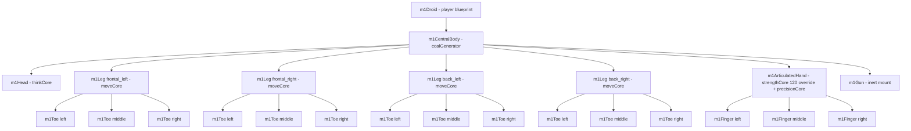
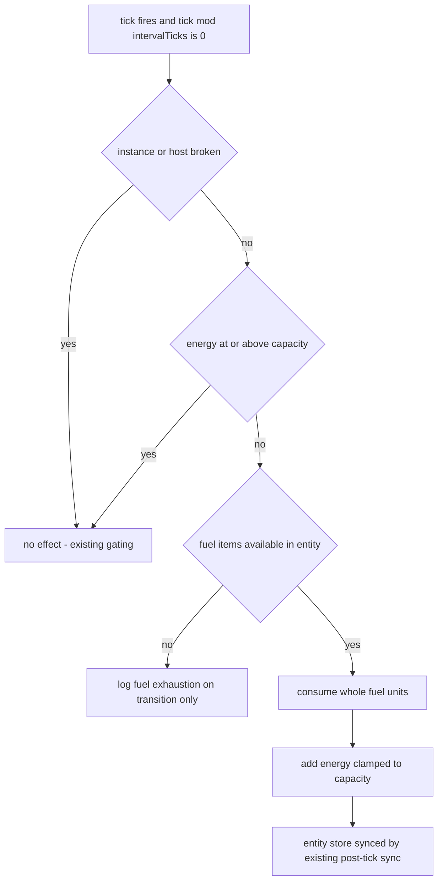

# M1 Droid — Design Specification

**Status:** Approved design — implementation-ready for the Code subtask.
**Scope:** Design only. This document specifies exactly what changes (data + minimal code); every M1-specific value is a named data entry in `data/*.json` or `shared/` — no magic numbers in source.
**Deliverable of this subtask:** this file only. No source or data files are modified here.

The **M1** is the new **player droid** — the entity spawned and controlled by the client when it connects. It replaces `smallBallDroid` as the default player blueprint. It is a legged, articulated droid with a **central body, a head, four legs (three toes each), a top articulated hand (three fingers), and a top gun mount**. Its defining system is an **internal coal generator**: it burns `coal` items stored inside the droid to charge a new resource stat, `Physical.energy` — the droid's power, fed by fuel it carries.

---

## 1. Verified mechanisms (evidence from the current codebase)

| # | Mechanism | Where verified | Fact the design relies on |
|---|-----------|----------------|---------------------------|
| 1 | Player spawn path | [`src/controllers/networking/SocketLifecycleController.js`](src/controllers/networking/SocketLifecycleController.js:46) (`_incarnatePlayer`), [`shared/Defaults.js`](shared/Defaults.js:24) | On socket connect the server calls `spawnEntity(DEFAULT_PLAYER_BLUEPRINT, startRoomId)`. `DEFAULT_PLAYER_BLUEPRINT` is `'smallBallDroid'` — the **single value** that decides what the client spawns. The spawn call carries **no loadout**. |
| 2 | Player loadout channel | [`src/controllers/WorldStateController.js`](src/controllers/WorldStateController.js:650) (`_applyInitialSpawns`) | The player droid's starting kit comes from `data/world.json` `initialSpawns`, applied to every spawned **non-NPC** entity (NPCs opt out via `isNPC === true`, line 657). Entry fields: `item`, `slot`, optional `fallback`, optional `children` (each with `count`), optional `ammo` (loads that many `knife` projectiles into the item's container, line 714). Top-level entries currently add **one** item each — there is no top-level `count` (this spec adds one, §9). |
| 3 | Slot-resolution grammar | [`src/controllers/WorldStateController.js`](src/controllers/WorldStateController.js:749) (`_resolveInitialSpawnSlot`) | Slot forms: `"<type>"` = first component of that type; `firstFit:<t1,t2>` in order; `bestAvailable[:<pref>...]` = substring match on the lowercased component type (so `"hand"` matches `m1ArticulatedHand`), else highest available volume. Every candidate is gated on `getAvailableVolume >= hostFootprint`, where footprint = `externalVolume ?? volume`. |
| 4 | Blueprint expansion | [`src/controllers/core/entityController.js`](src/controllers/core/entityController.js:39) (`expandBlueprint`) | Blueprints are recursive arrays: entry `"type"` → instance identifier `default`; entry `["type", "identifier"]` → named identifier; nested child identifiers are suffixed with the parent's; `dependsOn` = parent instance id. **Fingers-as-children precedent:** `droidHand` declares 3 × `humanoidDroidFinger` ([`data/blueprints.json`](data/blueprints.json:11)) — the exact model for M1 toes/fingers. |
| 5 | Component recipe model | [`data/components.json`](data/components.json:2) (`_comment`) | A recipe declares exactly three things — FORM (volume + position offset), COMPOSITION (material fractions summing to 1.0), and pre-installed ICs — and **no stat values**. Existence, the six channel resistances, mass and sharpness derive from matter; volume from form; `strength`/`move`/`fine_controls`/`think_level` from organs. An organ entry is either a type string (type-default grants) or an object `{ type, grants? }` whose grants override the defaults for that recipe's instances — precedent: `droidRollingBall`'s `strengthCore` override of 120 ([`data/components.json`](data/components.json:40)). |
| 6 | IC organ registry + install filter | [`data/internalComponents.json`](data/internalComponents.json:1), [`src/controllers/core/InternalComponentController.js`](src/controllers/core/InternalComponentController.js:276) (`autoInstallOnEntitySpawn`) | Organs define `name`, `description`, `volume`, `weight`, `grants`, `overTime`, `excludedComponentTypes`, `autoInstallOnSpawn`, `targetBlueprintTypes`. **Critical:** the `targetBlueprintTypes` filter is applied to **declared (recipe-installed) organs too** — a new entity blueprint type must be listed there or its organs silently fail to install. Grants are applied as an absolute SET at install ([`_applyGrants`](src/controllers/core/InternalComponentController.js:528)). Per-IC (not cumulative) volume check against host `form.volume`. |
| 7 | IC unified tick system | [`src/controllers/core/InternalComponentController.js`](src/controllers/core/InternalComponentController.js:702) (`_processTick`) | One 1-second tick job is the single channel for all `overTime` effects; each effect fires when the absolute tick is a positive multiple of its `intervalTicks`; a broken instance or broken host stops its effects; the entity store is synced after any change. Effects dispatch in [`_applyOverTimeEffect`](src/controllers/core/InternalComponentController.js:754) — today exactly two types, `restoreExistence` and `emitChannelDamage`, and the registry **fail-fast validates** the effect vocabulary at boot (unknown type → `TypeError`). The controller holds a `WorldStateController` facade set via [`setWorldStateController`](src/controllers/core/InternalComponentController.js:962), through which it reads stats (`getComponentStats`), mutates them (`componentController.updateComponentStatDelta`) and reaches the entity store. |
| 8 | Stat vocabulary | [`shared/StatVocabulary.js`](shared/StatVocabulary.js:75) (`STAT_NAMES`) | Exactly one source per stat: MATTER (existence, six resistances, mass, sharpness), FORM (volume), FUNCTION (organ grants: strength, move, fine_controls, think_level). **No `energy` stat exists anywhere** (verified across `data/`, `src/`, `shared/`, `public/`). Scale convention: 0–100 for all stats except `existence` (0–1). `shared/` is the only import path available to both layers — a new stat name belongs here, defined once. |
| 9 | Coal does not exist | [`data/materials.json`](data/materials.json:1), [`data/inventoryItems.json`](data/inventoryItems.json:1), [`data/materialDropRates.json`](data/materialDropRates.json:1) | Materials are only `wood` and `iron`; there is no `coal` item (nearest: `powerCell`, `fuelCell`); there is no coal drop entry. Coal must be introduced as a material + item + drop-rate entry. |
| 10 | Entity-level stat aggregation | [`wiki/subMDs/controllers/requirement_resolver.md`](wiki/subMDs/controllers/requirement_resolver.md:40) (`resolveEntityRequirementValues`) | Action requirements see an entity-level `"trait.stat"` aggregate built across the entity's whole component set — M1's action capabilities are the combination of its components' grants. |
| 11 | Client rendering is dynamic | [`public/js/StatBarsManager.js`](public/js/StatBarsManager.js:392) (`getAvailableTraitsAndStats`), [`public/js/UIManager.js`](public/js/UIManager.js:384) (`_renderDroidComponents`) | Stat bars are user-configured per trait/stat and rendered from whatever the state carries — `Physical` is already in the default color map, so a new `Physical.energy` stat renders with **zero UI code change**. Map markers come from instance `form.position`; sibling instances (e.g. the two `droidRollingBall`s) share one nominal position and are disambiguated by title — the existing convention M1's four legs/toes follow. |
| 12 | Public inventory API | [`src/controllers/WorldStateController.js`](src/controllers/WorldStateController.js:1649) (`getEntityItems`), [`src/controllers/WorldStateController.js`](src/controllers/WorldStateController.js:1691) (`removeItemFromEntity`) | The generator's fuel consumption uses existing public APIs through the facade the IC controller already holds — no direct state mutation, no new dependency. |

---

## 2. M1 blueprint (`data/blueprints.json`)

Add **four** keys. The entity key is `m1Droid` — the same string `shared/Defaults.js` will point to.

| Key | Children, in order |
|---|---|
| `m1Droid` | `m1CentralBody` |
| `m1CentralBody` | `m1Head` (bare → identifier `default`); `["m1Leg", "frontal_left"]`; `["m1Leg", "frontal_right"]`; `["m1Leg", "back_left"]`; `["m1Leg", "back_right"]`; `["m1ArticulatedHand", "top_hand"]`; `["m1Gun", "top_gun"]` |
| `m1Leg` | `["m1Toe", "left"]`; `["m1Toe", "middle"]`; `["m1Toe", "right"]` |
| `m1ArticulatedHand` | `["m1Finger", "left"]`; `["m1Finger", "middle"]`; `["m1Finger", "right"]` |

**Instance count: 23** — 1 body, 1 head, 4 legs, 12 toes, 1 hand, 3 fingers, 1 gun.

Design decisions:

- **Toes and fingers are child components, not stat tricks.** This copies the sanctioned `droidHand` → 3 × `humanoidDroidFinger` precedent: small structural children that give the appendage physical form (volume, material, position) while declaring **no organs** — matter without organs is inert, exactly the role a toe or finger should play. The count (3 per leg, 3 per hand) lives in the blueprint data, not in code.
- **Explicit slot identifiers** (`frontal_left`, `frontal_right`, `back_left`, `back_right`, `top_hand`, `top_gun`) instead of bare entries: bare entries all resolve to identifier `default`, which would collide for the hand and gun (both are "top" appendages) and leave the four legs indistinguishable. Named identifiers make the map-marker titles meaningful and keep `dependsOn` chains unambiguous.
- **Sibling instances share one nominal recipe position** (all legs at the leg offset, all toes at the toe offset, …) — the same convention as the two `droidRollingBall` instances at `{0, 20}`; the client disambiguates markers by title (verified §1.11).
- `m1Gun` is a **leaf component with no children and no organs** — an inert structural mount (see §4).

---

## 3. Component recipes (`data/components.json`)

Add **seven** recipes. Each declares only FORM, COMPOSITION and pre-installed ICs — never stat values — per the recipe model (verified §1.5).

| Recipe | Name | Form (volume, position) | Composition | Pre-installed ICs |
|---|---|---|---|---|
| `m1CentralBody` | M1 Central Body | 12, `{0, 0}` | iron 0.8 / coal 0.2 | `coalGenerator` (type string) |
| `m1Head` | M1 Head | 6, `{0, -16}` | iron 0.6 / wood 0.4 | `thinkCore` |
| `m1Leg` | M1 Leg | 8, `{0, 16}` | iron 0.8 / wood 0.2 | `moveCore` |
| `m1Toe` | M1 Toe | 1, `{0, 26}` | wood 1.0 | none |
| `m1ArticulatedHand` | M1 Articulated Hand | 6, `{14, -4}` | iron 0.7 / wood 0.3 | `{ type: "strengthCore", grants: { "Physical.strength": 120 } }`, `precisionCore` |
| `m1Finger` | M1 Finger | 1, `{20, -6}` | wood 1.0 | none |
| `m1Gun` | M1 Gun | 6, `{12, -8}` | iron 1.0 | none |

Rationale per decision:

- **Body is the fuel bay and the battery.** `m1CentralBody` is the only component declaring `coalGenerator`; its 0.2 coal fraction makes the droid's fuel source part of its own matter (derived properties: weighted flammability 23 → below the 60 threshold, so the body is **not** the `flammable` flag; weighted conduction 78 → above 60, so it carries the `conductive` flag — **inert today** because no heat/electricity damage channel exists in [`data/materialDamageTypes.json`](data/materialDamageTypes.json:1)). Volume 12 matches `centralBall`/`merchantCore` and is the capacity anchor for the coal loadout (§9).
- **Hand strengthCore override = 120** (the `{ type, grants }` object form). This is not arbitrary: the heaviest equippable item, `t1`, needs **117 strength** (1.5 × 78, per the holding-cost gate documented in [`data/components.json`](data/components.json:2)); the current droid satisfies it only via the `droidRollingBall` 120-override. M1 carries no wheels, so its load-bearing manipulator — the articulated hand — gets the same recipe-level tuning. With 120 the hand clears the gate (120 ≥ 117) and the `t1` initial-spawn entry in §9 is legally hostable.
- **Legs each carry `moveCore`** (type default, grants `Movement.move` 20). Four legs → entity-level move aggregate of 80, well above the `move` action requirement (≥ 5) — M1 is the fastest droid in the roster, consistent with a legged player platform.
- **Toes/fingers are inert matter** (wood, volume 1, no organs): form and mass only, per §2.
- **`m1Gun` is inert on purpose.** M1's weapon is the `t1` item, which lives in the hand via the existing T1/equip system and `shootT1` action; the gun mount is structural mass and future-proofing for a later weapon system. No new actions, no new consequence handlers (see §12).
- **Positions** follow the existing offset convention (negative y = toward the head side, positive y = toward the locomotion side, x = lateral): head above the body at `{0, -16}` (vs `droidHead` `{0, -20}`), legs below at `{0, 16}`, toes further out at `{0, 26}`, hand top-side at `{14, -4}` with fingers extending to `{20, -6}`, gun top-front at `{12, -8}`. All nominal; siblings share them.

Derived stats at boot (computed, never declared — one source per stat):

| Component | Volume (form) | Mass (density × volume, approximate) | Function stats from organs | Flags from composition |
|---|---|---|---|---|
| `m1CentralBody` | 12 | ≈ 78.2 (density 6.52) | `Physical.energy` = 0 (seeded by generator grant, §5) | conductive (78 ≥ 60), not flammable (23 < 60) |
| `m1Head` | 6 | ≈ 29.5 (4.92) | `Mind.think_level` = 10 | — |
| `m1Leg` ×4 | 8 each | ≈ 50.9 each (6.36) | `Movement.move` = 20 each → entity aggregate 80 | conductive (73 ≥ 60), inert |
| `m1Toe` ×12 | 1 each | 0.6 each | none (inert) | flammable (wood 80 ≥ 60) |
| `m1ArticulatedHand` | 6 | ≈ 33.8 (5.64) | `Physical.strength` = 120, `Manipulation.fine_controls` = 50 | conductive (64.5 ≥ 60), inert |
| `m1Finger` ×3 | 1 each | 0.6 each | none (inert) | flammable |
| `m1Gun` | 6 | 46.8 (7.8) | none (inert) | conductive (90), not flammable |

Entity totals for reference: form volume 77, mass ≈ 401, existence/resistances derive per component from composition. The `Mind.think_level` 10 is inert for the player droid (client-controlled, no deterministic brain) and exists only for parity with the other heads.

---

## 4. Coal — material, item, drops

### 4.1 `data/materials.json` — add material `coal`

| Field | Value | Why |
|---|---|---|
| `name` | `Coal` | Display name, convention. |
| `density` | 1.4 | Lighter than iron (7.8), denser than wood (0.6) — coal is a heavy fuel but a light structure. |
| `properties.flammability` | 95 | Coal burns: the high value is what makes it a *fuel* material and what the generator organ conceptually converts. |
| `properties.electricalConduction` | 30 | Mid-range; keeps coal bodies conductive when mixed with iron without making pure coal a conductor. |
| `properties.moistureRetention` | 0 | Coal does not hold water — same as iron. |
| `properties.cutResistance` | 35 | Brittle: cut matters into coal easily. |
| `properties.impactResistance` | 25 | Brittle: impact shatters it. |
| `properties.wearResistance` | 15 | Brittle: wears fast — the lowest of any material, on purpose (fuel, not armor). |
| `properties.heatConduction` | 55 | Between wood (15) and iron (85) — a mid-conductor. |

All values are named balance data in `data/materials.json`; nothing in source references coal by number. (Consequences: a coal-bearing body is brittle and conductive but not flammable — the 0.8/0.2 mix keeps weighted flammability at 23, §3.)

### 4.2 `data/inventoryItems.json` — add item `coal`

| Field | Value | Why |
|---|---|---|
| `name` | `Coal` | Display name. |
| `description` | a short one-liner: solid fuel chunk the M1's generator burns | Items carry descriptions for the client. |
| `form.volume` | 1 | One discrete fuel unit = one volume. Ten units fit the body's 12-volume capacity with headroom (§9), and the "1 coal = 10 energy" balance lever stays integer-exact. |
| `materials` | coal 1.0 | Pure coal — the item **is** the fuel. |
| `internalComponents` | none | An item with matter but no organs is inert, exactly like `knife` — it is fuel, not a machine. |

### 4.3 `data/materialDropRates.json` — add drop entry `coal`

| Field | Value | Why |
|---|---|---|
| `dropRate` | 0.5 | Coal components shed a chunk on half of successful punches — rarer than iron (1.0), commoner than wood (0.25): fuel is findable but not trivial. |
| `chunkFraction` | 0.4 | 40% of lost coal matter stays recoverable as a chunk, between iron (0.3) and wood (0.5). |

**Chunks are salvage tokens, not fuel.** A dropped coal chunk feeds the existing salvage → existence repair loop (same role iron/wood chunks play today). Burning fuel is the *item*, carried in the inventory and consumed by the generator. Converting a chunk back into a `coal` item would be a crafting recipe — deliberately out of scope (§12), and when it is wanted it is a data-only addition to `data/crafting.json`.

---

## 5. The coal generator (`data/internalComponents.json`)

Add one organ type, `coalGenerator`, pre-installed by the `m1CentralBody` recipe.

| Field | Value | Why |
|---|---|---|
| `name` | `Coal Generator` | Display name. |
| `description` | one sentence: burns stored coal to charge the droid's power stat — closes the fuel → energy loop | Convention: every organ documents its function. |
| `volume` | 2 | Organ footprint, checked per-IC against the host's 12-volume form (2 ≤ 12 ✓). Small but real — a generator is not free space. |
| `weight` | 4 | Between `moveCore` (3) and `repairSphere` (5): a powered organ has mass. |
| `grants` | `{ "Physical.energy": 0 }` | Seeding the battery. Grants are applied as an absolute SET at install (verified §1.6), so the organ is the **single source** of `Physical.energy` and initializes it to 0 — an empty battery. 0 is a named data value, not a magic number; the charge values all live in `overTime` below. |
| `overTime` | one effect, `consumeFuelGenerateStat`, fields below | The only behavior: burn fuel, gain power. |
| `excludedComponentTypes` | `["m1Toe", "m1Finger"]` | Defensive parity with `moveCore`'s `humanoidDroidFinger` exclusion — a generator never belongs in a toe or finger. |
| `autoInstallOnSpawn` | false | All organs in the basic set are declared by recipes, never auto-installed — M1 follows the same pattern. |
| `targetBlueprintTypes` | `["m1Droid"]` | The filter the spawn path applies (verified §1.6); the generator may install only on M1. |

### 5.1 The overTime effect — one new effect type, `consumeFuelGenerateStat`

Effect definition (all values named data in the `overTime` entry — **this is where every balance number lives**):

| Field | Value | Meaning |
|---|---|---|
| `type` | `consumeFuelGenerateStat` | New vocabulary entry (see §5.3 for the code-side change). |
| `intervalTicks` | 5 | Burns once every 5 ticks (same cadence as `repairSphere`). |
| `fuelItem` | `coal` | The exact registry item type consumed. Fuel is a discrete item, not raw composition: item instances do not carry raw material composition, and matching dynamic chunk types would require extra machinery — the item is the fuel unit. |
| `fuelConsumedPerInterval` | 1 | Whole units per burn. |
| `targetStat` | `Physical.energy` | Flat `"Group.stat"` wire form, identical to the `grants` key form. |
| `energyGainPerInterval` | 10 | Energy per burned coal. |
| `energyCapacity` | 100 | Battery ceiling, on the standard 0–100 scale. |

**Charge math (derived from the data above):** one coal = 10 energy; a full tank is 10 coal = 50 ticks (50 seconds at the 1-second cadence); empty → full takes exactly the droid's starting loadout.

### 5.2 Effect behavior, in priority order (evaluated each interval)

1. **Full battery — skip.** Read the host's current `Physical.energy` (the stat the organ seeded, §1.7 facade read). If it is ≥ `energyCapacity`, do nothing: coal is never burned for a full battery. This is the same "skip when already whole" discipline as `restoreExistence` at existence 1.
2. **No fuel — graceful degradation.** Search the entity's items for `fuelItem` via the facade's public inventory API ([`getEntityItems`](src/controllers/WorldStateController.js:1649)). If fewer than `fuelConsumedPerInterval` are available: consume **nothing**, charge **nothing**, and log a fuel-exhaustion entry **on the transition only** (the effect tracks whether it was already dry, so a droid sitting at zero coal logs once, not every 5 ticks). The droid keeps every other stat and continues playing — energy simply stops being produced. No error, no broken state.
3. **Burn.** Consume exactly `fuelConsumedPerInterval` fuel items through the public removal API ([`removeItemFromEntity`](src/controllers/WorldStateController.js:1691)), then apply a **clamped** delta to `targetStat` on the host component via the same stat-delta path `restoreExistence` uses (`componentController.updateComponentStatDelta`): gain = min(`energyGainPerInterval`, `energyCapacity` − current). Clamping at the margin (e.g. 95 → 100, not 105) means the last burn can waste up to `energyGainPerInterval` − 1 energy — accepted as the simpler rule versus refusing near-full burns, which would stall the last tick of every charge.

**Why whole units only (no partial burns):** energy remains an exact multiple of 10 per coal for the entire life of the droid, so the balance lever "1 coal = 10 energy" is always true and testable; a partial burn would make the stat depend on fractional consumption and blur that lever.

### 5.3 Code-side change this implies (one vocabulary case — not an architecture change)

The effect system validates its vocabulary fail-fast at boot and dispatches on `effect.type` (verified §1.7). Adding the effect therefore requires exactly three small additions to [`src/controllers/core/InternalComponentController.js`](src/controllers/core/InternalComponentController.js:754):

1. admit `consumeFuelGenerateStat` in the registry validation's allowed effect-type list (plus field validation for the six fields above, same fail-fast style);
2. one `case` in the `_applyOverTimeEffect` dispatch;
3. one handler method implementing §5.2 using only APIs the controller already holds: the facade for entity/item access, `getComponentStats` for the capacity read, `updateComponentStatDelta` for the charge — the same three the two existing effects use.

The unified tick channel, cadence arithmetic, broken-host gating, and post-tick entity-store sync are **untouched**. This is an extension of the overTime **vocabulary**, deliberately categorized as such (and only) against the "no IC tick architecture changes" constraint: the two existing effect types cannot express item consumption at all, and a second channel or a new controller would be a far larger violation of the same constraint.

---

## 6. The `energy` stat (`shared/StatVocabulary.js`)

Add one entry to `STAT_NAMES`: `ENERGY: 'energy'`, in the Physical group's neighborhood (the object is a flat map; grouping is by the `Group.stat` key form used everywhere else).

- **Single source, honored:** `Physical.energy` is a FUNCTION-sourced stat — granted (seeded at 0) and charged only by the `coalGenerator` organ. It gets **no** entry in `data/propertyTraitMapping.json` (no material property is its source — inventing one would give the stat a second source) and **no** entry in `data/traits.json` (it is a resource stat, not a flag or condition).
- **Scale 0–100**, the universal convention for non-existence stats; the generator's `energyCapacity` (100) is the ceiling, data-driven.
- **Client: zero UI change.** Stat bars are configured per trait/stat and rendered dynamically from state; `Physical` is already color-mapped, so `Physical.energy` on `m1CentralBody` is bar-eligible the moment the stat exists (verified §1.11).
- **Consumers: none yet.** Today nothing drains `energy`; it charges from the spawn loadout and then holds. Future actions can gate on or spend it through the existing data-driven requirement/consequence expressions, exactly like any other stat — no code path is reserved or hardcoded for it.

---

## 7. IC registry adjustments for M1 (`data/internalComponents.json`)

Data-only edits to **existing** organs so M1's declared organs pass the install filter (verified §1.6 — the `targetBlueprintTypes` filter applies to recipe-declared organs too, so omitting these would make M1's legs and hand silently inert):

| Organ | Change | Why |
|---|---|---|
| `moveCore` | `targetBlueprintTypes` → add `"m1Droid"` (becomes `["smallBallDroid", "crafterDrone", "m1Droid"]`) | M1's four legs declare `moveCore`; the filter must admit M1 or `Movement.move` never lands. |
| `moveCore` | `excludedComponentTypes` → add `"m1Toe"`, `"m1Finger"` | Defensive parity with the existing `humanoidDroidFinger` exclusion: drive organs never belong in toe/finger components. |
| `strengthCore` | `targetBlueprintTypes` → add `"m1Droid"` | M1's hand declares `strengthCore` (with the 120 override, §3). |
| `thinkCore`, `precisionCore` | none | They have no `targetBlueprintTypes` restriction (unrestricted today, verified §1.6) and install freely. |

`hostComponentType`/`hostSlot` on `strengthCore` (`droidHand`/`left`) are **inert for M1**: those fields steer auto-installation, and `autoInstallOnSpawn` is false for every organ — M1's organs are all recipe-declared. No change needed; documented so the implementer does not "fix" them.

---

## 8. Initial coal loadout (`data/world.json`)

The player droid's loadout channel is `data/world.json` `initialSpawns` (verified §1.2) — M1 is a player, not an NPC, so **no `data/npcs.json` entry** is added or needed.

Replace the current `initialSpawns` array with the M1 kit (entries applied in order, each through the existing slot-resolution and volume gating):

| # | Entry fields | Resolves to | Why |
|---|---|---|---|
| 1 | `item: "coal"`, `slot: "m1CentralBody"`, `count: 10` | the body (first of type, always exists) | **The coal loadout: 10.** Exactly one full charge (10 × 10 energy = 100 = `energyCapacity`), so the droid boots, burns its loadout over 50 ticks, and arrives at a full battery. 10 × volume 1 = 10 also fits the body's 12-volume form even if the generator's 2-volume footprint is subtracted from available volume — robust under either accounting. |
| 2 | `item: "t1"`, `slot: "bestAvailable:hand"`, `ammo: 1` | `m1ArticulatedHand` (substring `"hand"` matches `m1articulatedhand`, verified §1.3) | Unchanged from today's entry — a proven pattern. `ammo: 1` loads one knife projectile into the T1 (the hardcoded-ammo path, line 714). The hand's 120 strength (override, §3) legally hosts the T1's 117 gate. |
| 3 | `item: "knife"`, `slot: "m1Leg"`, `count: 5` | `frontal_left` leg (first of type) | Five spare knives, matching today's five knives-in-the-box — the crafting/reload stock (2 knives → 1 T1). Leg capacity: 5 × footprint 1 ≤ 8 volume ✓. |

**Retired entries:** the `metalBox` (with its 5 knives), `testItem`, `testItem2`, and loose `knife` entries. They are fixtures of the old `smallBallDroid` kit (two are literally named test items); M1's kit above supersedes them one-for-one (box → leg, spares preserved, test items dropped).

### 8.1 The one code extension this requires

Top-level `initialSpawns` entries currently add exactly one item; the multiplicity field `count` exists only on `children` entries (read at [`src/controllers/WorldStateController.js`](src/controllers/WorldStateController.js:701)). The coal entry needs 10 of one item, so `_applyInitialSpawns` gains an **optional top-level `count` (default 1)**: when present and > 1, the item is added that many times — mirroring the existing child-loop pattern one level up. Backward-compatible by construction: every current entry without `count` behaves identically. This is the only loadout-related code change in the whole spec.

---

## 9. Implementation file list (every file the Code subtask touches)

| File | Change | One-line purpose |
|---|---|---|
| [`data/blueprints.json`](data/blueprints.json:1) | add `m1Droid`, `m1CentralBody`, `m1Leg`, `m1ArticulatedHand` | M1's entity key and full component hierarchy (§2). |
| [`data/components.json`](data/components.json:1) | add 7 recipes | M1's form/composition/organ declarations (§3). |
| [`data/internalComponents.json`](data/internalComponents.json:1) | add `coalGenerator`; extend `moveCore`/`strengthCore` `targetBlueprintTypes`; extend `moveCore` exclusions | The generator organ and the install-filter admission (§5, §7). |
| [`data/materials.json`](data/materials.json:1) | add `coal` material | Coal's physical properties (§4.1). |
| [`data/inventoryItems.json`](data/inventoryItems.json:1) | add `coal` item | The discrete fuel unit (§4.2). |
| [`data/materialDropRates.json`](data/materialDropRates.json:1) | add `coal` drop entry | Coal chunks as salvage in the existing drop loop (§4.3). |
| [`data/world.json`](data/world.json:1) | replace `initialSpawns` with the M1 kit | The player's starting coal, weapon and knife stock (§8). |
| [`shared/Defaults.js`](shared/Defaults.js:24) | `DEFAULT_PLAYER_BLUEPRINT` → `'m1Droid'` | **The** change that makes the client spawn M1. |
| [`shared/StatVocabulary.js`](shared/StatVocabulary.js:75) | add `ENERGY: 'energy'` to `STAT_NAMES` | New wire stat, single definition for both layers (§6). |
| [`src/controllers/WorldStateController.js`](src/controllers/WorldStateController.js:650) | optional top-level `count` in `_applyInitialSpawns` | Multiplicity for the coal loadout (§8.1). |
| [`src/controllers/core/InternalComponentController.js`](src/controllers/core/InternalComponentController.js:754) | `consumeFuelGenerateStat`: validation entry + dispatch case + handler | The generator's burn-and-charge behavior (§5.3). |

**Eleven files: nine data/shared + two source. No new controllers, no routes, no UI files, no `npcs.json`.**

---

## 10. Test plan

Every new feature ships a unit test (project rule). Tests live with the existing suites; the IC controller's tick-driven tests already have a tick-driver pattern to reuse.

1. **Blueprint expansion** — `m1Droid` expands to exactly 23 instances: correct types, identifiers (`frontal_left` … `top_gun`; toe/finger `left/middle/right` with parent-suffixed identifiers per the expansion rule), and `dependsOn` chains.
2. **Recipe derivation** — each recipe instance bootstraps with derived stats only: existence 1, six channel resistances, mass, volume; organ grants land on the right hosts (body: `Physical.energy` = 0; each leg: `Movement.move` 20; hand: `Physical.strength` 120 + `Manipulation.fine_controls` 50; head: `Mind.think_level` 10). Entity-level aggregate (move 80) is visible through the requirement-resolution path.
3. **Install-filter regression** — M1's legs receive `moveCore` and the hand receives `strengthCore` despite the filter (this is the silent-failure trap of §1.6; a test exists precisely so it cannot regress silently).
4. **Generator burn** — with ≥1 coal aboard, an interval tick consumes 1 coal and adds exactly 10 `Physical.energy` on the body; state is synced to the entity store (client-visible).
5. **Generator runout** — with 0 coal: energy unchanged, no items removed, exhaustion logged **once** (assert log/transition state, not per-tick spam), subsequent dry ticks stay quiet.
6. **Generator full-battery skip** — at energy 100, ticks pass without consuming coal.
7. **Generator clamp** — at 95 with 1 coal: energy lands at exactly 100 (5 wasted, per §5.2 rule 3), coal consumed once.
8. **`initialSpawns` count** — an M1-shaped entity receives 10 coal in the body, the T1 (with 1 knife ammo) in the hand, 5 knives in `frontal_left`; and an entry **without** `count` still adds exactly one item (backward-compat regression).
9. **Shared vocabulary** — `'energy'` is in `STAT_NAMES` (Physical), importable from both layers.
10. **Regression** — `smallBallDroid`, `merchantDroid`, `crafterDrone`, `killerLlmDrone` spawn with unchanged components/stats/loadout; `repairSphere` and `corrosiveGland` effects unchanged; coal chunks drop from coal-bearing components per the new drop entry and are salvageable.

---

## 11. Out of scope (explicit)

- **No new controllers.** The generator lives inside the existing IC controller as one overTime effect.
- **No IC tick-architecture change.** The unified 1-second channel, interval arithmetic, broken-instance/host gating, and post-tick entity-store sync are untouched; only the effect *vocabulary* gains one case (§5.3), which is the minimal extension the requirement implies.
- **No UI redesign.** Bars, component views and map markers render dynamically from state; nothing in `public/` changes.
- **No new actions.** `m1Gun` is an inert mount; the weapon remains the `t1` item through the existing equip/`shootT1` system.
- **No chunk → coal reforge crafting.** Coal chunks are salvage; a reforge recipe, when wanted, is a data-only `data/crafting.json` addition.
- **No energy consumers.** `Physical.energy` is charge-only for now; future actions gate on or spend it through the existing data-driven expressions.
- **No persistence schema change.** Entities, components, items and IC instances serialize exactly as today.
- **No movement-system change.** Legs grant `move`; the `move` action's delta-spatial behavior is unchanged.
- **No new damage channels.** The `conductive` flag M1 components derive is inert — no heat/electricity damage exists today.

**Known consequence (by design, flagged for reviewers):** with no consumer yet, a freshly spawned M1 burns its 10 coal over 50 ticks, lands at 100 energy, and holds it. Its fuel economy (refueling, consumers) is the explicit future work this spec paves.

---

## 12. Open decisions (for reviewer sign-off before implementation)

| # | Decision | Chosen value | Notes / alternatives |
|---|---|---|---|
| 1 | Default coal quantity | **10** | One full charge; fits the body under either volume accounting. Any other value must keep "n coal = n×10 energy ≤ 100" integer-exact. |
| 2 | Charge math | 1 coal → 10 energy, every 5 ticks, capacity 100 | All in the `overTime` data entry; tune together to keep the ratio. |
| 3 | Coal material properties | density 1.4; flammability 95; conduction 30; moisture 0; cut/impact/wear 35/25/15; heat 55 | Balance data, tunable in one file; the brittle + fuel profile is the intent. |
| 4 | Body composition | iron 0.8 / coal 0.2 | Gives the conductive (inert) / non-flammable flag profile and the ≈6.5 density; any other mix re-derives flags in §3. |
| 5 | Knife stock | 5 on `frontal_left` | Parity with today's boxed five; today's seventh knife (loose, hand) is absorbed by the T1's ammo slot. |
| 6 | `m1Gun` | inert iron mount, 6 volume | Future weapon system; no actions now. |
| 7 | Slot identifiers | `frontal_left/frontal_right/back_left/back_right`, `top_hand`, `top_gun` | Any distinct identifiers work; these make marker titles readable. |
| 8 | Retiring the test-item loadout entries | removed with the old kit | `testItem`/`testItem2` remain defined in `data/inventoryItems.json` (other suites may reference them); only their `world.json` entries go. |
