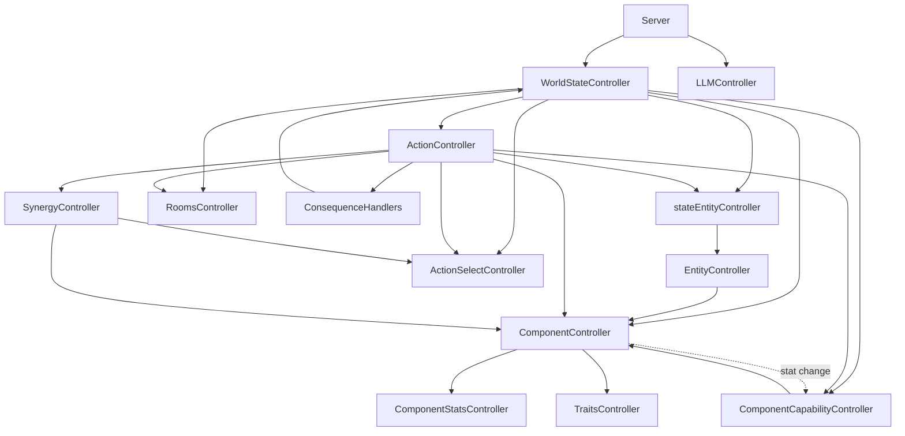

# 🗺️ Controller Relationship Map

This document serves as a high-level architectural map of the `slopSimulacrum` controller ecosystem. It is designed to help AI agents quickly understand the dependency chain and the flow of data and commands.

**Note:** For a more detailed, technical breakdown of the architecture, refer to the [System Architecture Map](subMDs/system_map.md), which serves as the "deep version" of this map.

## 📐 Architectural Overview

The system follows a **hierarchical dependency injection** pattern. The `WorldStateController` acts as the root injector, ensuring that all sub-controllers share the same state instances to prevent desynchronization.

### 1. Dependency Graph (Mermaid)



---

## ⛓️ Detailed Dependency Chain

### 🟢 The World State Hierarchy (Bottom-Up)
To understand how a piece of data is retrieved, follow this chain:

0.  **JSON Data Files (Configuration)**:
    - `data/actions.json`: Action definitions with requirements and consequences.
    - `data/components.json`: Component type definitions with trait templates.
    - `data/blueprints.json`: Entity blueprint definitions (component hierarchies).
    - `data/traits.json`: Global trait molds.
    - `data/synergy.json`: Synergy configurations.
1.  **Data Layer (Bottom)**:
    - `ComponentStatsController`: Manages raw numeric values with **deep trait-level merge** (updating one stat preserves others in the same trait). See `wiki/subMDs/traits.md` Section 5.
    - `TraitsController`: Manages entity traits and their properties.
2.  **Logic Layer (Middle)**:
    - `ComponentController` → depends on `ComponentStatsController` & `TraitsController` & `componentRegistry`.
    - `EntityController` → depends on `ComponentController` & `blueprintRegistry` (loaded from `data/blueprints.json`).
3.  **Instance Layer (Top)**:
    - `stateEntityController` → depends on `EntityController`.
    - `RoomsController`: Manages spatial layout and room connectivity.
4.  **Coordination Layer (Root)**:
    - `WorldStateController`: The master controller that instantiates and holds references to all the above.

### 🔵 The Action Execution Flow
When an action is executed:
```
Server → WorldStateController
    ├── ActionSelectController.expireStaleSelections()
    ├── ActionController.executeAction()
    │   ├── resolveSourceComponent()
    │   ├── Track spatial components for release (spatial actions only)
    │   ├── validateSelection (skip for spatial actions)
    │   ├── validateComponentBinding (skip role mismatch for spatial/none)
    │   ├── _checkRequirements / _checkRequirementsForComponent
    │   ├── SynergyController.computeSynergy() (excludes locked components)
    │   └── ConsequenceHandlers (with synergy-applied values)
    └── ActionSelectController.releaseSelections([all tracked components]) (finally block)
```

**Component Selection Validation:**
- **Spatial actions** (`move`, `dash`): Skip pre-locking validation because they auto-resolve components via `_resolveSourceComponent()`
- **Non-spatial actions**: Validate component selection via `ActionSelectController.validateSelection()`

**Component Lock Tracking & Release:**
All actions track their component locks in `componentsToRelease` array, released in the `finally` block:
- **Non-spatial actions**: Components tracked during validation
- **Spatial actions**: Components explicitly tracked after `resolveSourceComponent()` (lines 301-317 in `actionController.js`):
  - Multi-component spatial: Each component from `componentList` is added
  - Single-component spatial: The resolved `resolvedSourceComponentId` is added
- **Self-targeting actions** (`selfHeal`): Components from `targetComponentId` tracked during validation

**⚠️ Critical Fix**: Previously, spatial actions skipped the validation block entirely, causing their locks to never be released. This broke subsequent actions (e.g., `selfHeal` failed because `droidRollingBall` was still locked to "move"). The fix adds explicit spatial component tracking after component resolution.

**Role Mismatch Skip:**
Role validation is skipped for `spatial`, `none`, and `self_target` targetingType actions because client/server role resolution differs:
- Spatial: Client sends `'spatial'`, server resolves to `'source'`
- None: Client sends `'source'`, server resolves to `'self_target'`
- Self-Target: Client sends `'self_target'`, server resolves to `'self_target'` (selfHeal executes instantly on component selection)

**Self-Targeting Action Flow (selfHeal):**
For `targetingType: 'self_target'` actions:
1. User clicks a component row in the action list → component selected, action executes instantly
2. Client sends `POST /execute-action` with `targetComponentId` and `componentIdentifier`
3. `ActionController.executeAction()` resolves via Priority 2 (explicit targetComponentId)
4. `ConsequenceHandlers.updateComponentStatDelta()` applies heal to the selected component
5. `WorldStateController` broadcasts updated state

**updateComponentStatDelta Handler**: Component resolution priority:
1. **Explicit `targetComponentId`** from `actionParams` (targeted actions like damage)
2. **Fulfilling component** from `context.fulfillingComponents` (self-targeting actions)
3. **Fallback to entity-wide update** via `_handleUpdateStat`

**⚠️ Note:** The old "first component with the trait" fallback has been removed to prevent unpredictable behavior.

**Stat Persistence**: When consequences update component stats (e.g., `updateComponentStatDelta` for durability loss), the `ComponentStatsController.setStats()` method performs a **deep trait-level merge**, ensuring that updating one stat (e.g., `Physical.durability`) does not erase other stats in the same trait (e.g., `Physical.mass`, `Physical.strength`). See `wiki/subMDs/traits.md` Section 5 for details.

**Attack Action Flow (e.g., droid punch):**
For attack actions with both attacker and target components:
1. Client sends `POST /execute-action` with `attackerComponentId` and `targetComponentId`
2. `ActionController.executeAction()` uses `attackerComponentId` for **requirement value resolution** (e.g., damage = `:Physical.strength` from attacker)
3. `ConsequenceHandlers.damageComponent()` applies damage to `targetComponentId`
4. `WorldStateController` broadcasts updated state

**Data Flow Diagram:**
```
Client → Server → ActionController.executeAction()
    ├── attackerComponentId → _checkRequirementsForComponent() → requirementValues
    ├── _resolvePlaceholders("-:Physical.strength") → -25 (from attacker's droidHand)
    └── ConsequenceHandlers.damageComponent(targetComponentId) → reduce target durability
```

**Spatial Action Component Resolution (e.g., move, dash with multi-component entities):**
For spatial actions on entities with multiple components of the same type (e.g., left and right `droidRollingBall`):
1. User selects a component in the UI → `componentId` stored in pending action
2. Client sends `POST /execute-action` with `targetX`, `targetY`, `targetComponentId`, `componentIdentifier`
3. `ActionController.executeAction()` uses `targetComponentId` for **requirement value resolution**
4. `ActionController._executeConsequences()` resolves target ID by consequence type:
   - Spatial consequences (`updateSpatial`, `deltaSpatial`) → always use `entityId`
   - Component consequences (`updateComponentStatDelta`, `damageComponent`) → use `targetComponentId`
5. `WorldStateController` broadcasts updated state

**Data Flow Diagram (Spatial):**
```
Client → Server → ActionController.executeAction()
    ├── targetComponentId → _checkRequirementsForComponent() → requirementValues
    ├── _executeConsequences()
    │   ├── deltaSpatial → entityId (entity moves)
    │   └── updateComponentStatDelta → targetComponentId (component durability updated)
```

**Stat Change Notification Flow:**
When component stats change, the `ComponentCapabilityController` automatically re-evaluates capabilities:
`ComponentController` → `ComponentCapabilityController.onStatChange()` → `reEvaluateActionForComponent()` → `_notifySubscribers(actionName, entryOrRemovalMarker)`

**Removal Markers**: When capability entries are removed, subscribers receive a `RemovalMarker` object (`{ _type: 'REMOVAL', componentId, entityId }`) instead of `null`.

### 🔵 Synergy Execution Flow

When synergy-enabled actions execute, synergy is computed before consequences:
```
Client → Server → ActionController.executeAction()
    ├── _checkRequirements() → requirementValues
    ├── SynergyController.computeSynergy() → SynergyResult
    ├── _executeConsequences() → apply synergy multiplier to values
    └── WorldStateController.broadcast() → updated state
```

**Data Decoupling**: Synergy configs are in `data/synergy.json` (standalone), not embedded in `data/actions.json`.

### 🔵 Equipment/Inventory Flow

The equipment system manages item grabbing, backpack storage, and dropping:

**Hand Grab Flow:**
```
Client → Server → ActionController.executeAction("grab")
    ├── _checkGrabRange() → validate proximity
    ├── _checkRequirementsForComponent() → Physical.strength ≥ 1
    ├── ConsequenceHandlers.grabItem()
    │   └── EquipmentController.grabItem()
    │       ├── initializeComponent() from item blueprint
    │       ├── addComponentToEntity() — item becomes entity component
    │       └── despawnEntity() — original item entity removed
    ├── Apply debuff to hand (strength -5)
    └── ComponentCapabilityController.reEvaluateEntityCapabilities()
```

**Backpack Grab Flow:**
```
Client → Server → ActionController.executeAction("grabToBackpack")
    ├── _checkGrabRange() → validate proximity
    ├── _checkRequirementsForComponent() → Physical.volume ≥ 1
    ├── ConsequenceHandlers.grabToBackpack()
    │   └── EquipmentController.grabToBackpack()
    │       ├── Check backpack capacity (usedVolume + itemVolume ≤ backpackVolume)
    │       ├── initializeComponent() from item blueprint
    │       ├── addComponentToEntity() — item becomes entity component
    │       └── Store backpack entry in _backpackRegistry
    └── ComponentCapabilityController.reEvaluateEntityCapabilities()
```

**Drop All Flow:**
```
Client → Server → ActionController.executeAction("dropAll")
    ├── ConsequenceHandlers.dropAll()
    │   └── EquipmentController.dropAll()
    │       ├── Release all hand grabs → respawn items in world
    │       ├── Release all backpack items → respawn items in world
    │       ├── Restore all hand strengths
    │       └── Clear _grabRegistry and _backpackRegistry entries
    └── ComponentCapabilityController.reEvaluateEntityCapabilities()
```

**EquipmentController Key Methods:**
| Method | Description |
|--------|-------------|
| `grabItem(entityId, handComponentId, itemEntity)` | Add item as component to entity (hand grab) |
| `grabToBackpack(entityId, backpackComponentId, itemEntity)` | Add item to backpack (volume-checked) |
| `releaseItem(componentId)` | Remove item from entity, respawn in world |
| `dropAll(entityId)` | Release ALL items (hand + backpack) |
| `getBackpackItems(entityId)` | Get backpack items array |
| `getBackpackVolume(entityId, backpackComponentId)` | Get {total, used, remaining} volume info |

### 🔵 Multi-Component Selection Flow (Client-Side)

The client uses a **click-to-toggle** model for multi-component selection:
```
User clicks component row → App._handleComponentToggle()
    ├── Toggle component in/out of selectedComponentIds
    ├── Switch active action if clicking different action
    ├── Set pending action (for spatial/component targeting)
    ├── Build crossMap (active selections + cross-action selections)
    ├── Re-render action list (selected=green, grayed=locked)
    └── If 1+ selected: POST /synergy/preview-data → renderSynergyPreview()
        - 1 component: action data preview
        - 2+ components: synergy with modified values

User clicks map → _setupMapClickListener()
    ├── If 2+ components selected: _executeMultiComponentSpatial()
    │   ├── POST /select-components (batch lock)
    │   └── POST /execute-action with componentIds
    └── Clear selections, refresh UI
```

### 🔵 The Action Execution Flow

**Available Public Methods:**

| Method | Parameters | Returns |
|--------|-----------|---------|
| `spawnEntity(blueprintName, roomId)` | `string`, `string` | `string` (entityId) |
| `despawnEntity(entityId)` | `string` | `boolean` |
| `moveEntity(entityId, targetRoomId)` | `string`, `string` | `boolean` |
| `getRoomUidByLogicalId(logicalId)` | `string` | `string\|null` |

#### `ActionController.previewActionData(actionName, entityId, context)`

Returns complete preview data including action definition, resolved values, and synergy.

**Returns:** `{ actionData: { _name, ...actionDef }, resolvedValues, synergyResult }`

- `_name`: The action name string (added for UI display)
- `resolvedValues`: Consequence values with placeholders resolved
  - For `deltaSpatial`: `{ speed: number }`
  - For other consequences: `{ value: number }`
- `synergyResult`: Computed synergy with deduplicated `contributingComponents` (each component appears at most once)

---

## 🛠️ Agent Quick-Reference

| If you need to... | Use this Controller | Dependency Note |
| :--- | :--- | :--- |
| Modify raw stats | `ComponentStatsController` | Lowest level |
| Change entity traits | `TraitsController` | Lowest level |
| Calculate component logic | `ComponentController` | Uses Stats & Traits |
| Manage entity existence | `EntityController` | Uses Components + Blueprint Registry |
| Spawn/Move entities | `stateEntityController` | Uses EntityController |
| Modify room layout | `RoomsController` | Spatial state |
| Execute a game action | `ActionController` | Executes actions, validates requirements, runs consequences |
| Query component capabilities | `ComponentCapabilityController` | Manages capability cache, scoring, re-evaluation |
| Compute synergy multipliers | `SynergyController` | Multi-entity/component synergy computation |
| Lock/release component selections | `ActionSelectController` | Enforces "one component, one action" rule |
| Send a prompt to LLM | `LLMController` | Independent API wrapper (uses Logger) |

## 📁 Data Files

| File | Purpose |
|------|---------|
| `data/actions.json` | Action definitions (requirements, consequences) |
| `data/components.json` | Component type definitions with trait templates |
| `data/blueprints.json` | Entity blueprint definitions (component hierarchies) |
| `data/traits.json` | Global trait molds |
| `data/synergy.json` | Synergy configurations |

## ⚠️ Critical Rule for Agents
**Never instantiate a controller manually** inside another controller. Always use the instances provided by `WorldStateController` or injected via the constructor. This prevents the "Dual State" bug where two controllers think the world is in different states.

**Server API Access**: The server (`src/server.js`) must use `WorldStateController` public API methods (`spawnEntity`, `despawnEntity`, `moveEntity`, `getRoomUidByLogicalId`) instead of directly accessing sub-controllers. See `subMDs/controller_patterns.md` Section 5.1.

**Logging Standard**: All controllers must use the centralized `Logger` utility (`src/utils/Logger.js`) for structured logging with severity levels (`INFO`, `WARN`, `ERROR`, `CRITICAL`).

## 📋 Recent Changes Log

| Date | Change | Files |
|------|--------|-------|
| 2026-05-09 | **Refactor:** Organized `src/controllers/` into subdirectories by subsystem per SRP. Created barrel export (`index.js`). Updated all import paths across codebase. | `src/controllers/WorldStateController.js`, `src/controllers/index.js`, `src/controllers/core/*`, `src/controllers/traits/*`, `src/controllers/actions/*`, `src/controllers/capabilities/*`, `src/controllers/synergy/*`, `src/controllers/equipment/*`, `src/controllers/consequences/*`, `src/controllers/networking/*`, `src/server.js`, `test/*.test.js` |
| 2026-05-05 | **Refactor:** Split `ConsequenceHandlers` into 6 single-focused modules per SRP | `consequenceHandlers.js`, `SpatialConsequenceHandler.js`, `StatConsequenceHandler.js`, `DamageConsequenceHandler.js`, `LogConsequenceHandler.js`, `EventConsequenceHandler.js`, `EquipmentConsequenceHandler.js`, `wiki/subMDs/consequence_handler_architecture.md` |
