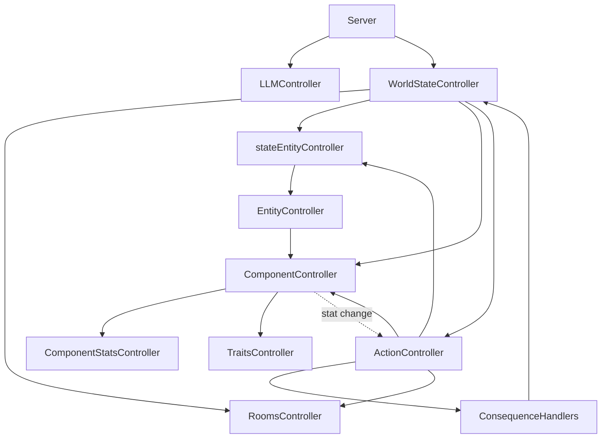

# 🗺️ Controller Relationship Map

This document serves as a high-level architectural map of the `slopSimulacrum` controller ecosystem. It is designed to help AI agents quickly understand the dependency chain and the flow of data and commands.

**Note:** For a more detailed, technical breakdown of the architecture, refer to the [System Architecture Map](subMDs/system_map.md), which serves as the "deep version" of this map.

## 📐 Architectural Overview

The system follows a **hierarchical dependency injection** pattern. The `WorldStateController` acts as the root injector, ensuring that all sub-controllers share the same state instances to prevent desynchronization.

### 1. Dependency Graph (Mermaid)



---

## ⛓️ Detailed Dependency Chain

### 🟢 The World State Hierarchy (Bottom-Up)
To understand how a piece of data is retrieved, follow this chain:

1.  **Data Layer (Bottom)**:
    - `ComponentStatsController`: Manages raw numeric values with **deep trait-level merge** (updating one stat preserves others in the same trait). See `wiki/subMDs/traits.md` Section 5.
    - `TraitsController`: Manages entity traits and their properties.
2.  **Logic Layer (Middle)**:
    - `ComponentController` → depends on `ComponentStatsController` & `TraitsController`.
    - `EntityController` → depends on `ComponentController`.
3.  **Instance Layer (Top)**:
    - `stateEntityController` → depends on `EntityController`.
    - `RoomsController`: Manages spatial layout and room connectivity.
4.  **Coordination Layer (Root)**:
    - `WorldStateController`: The master controller that instantiates and holds references to all the above.

### 🔵 The Action Execution Flow
When an action is executed:
`Server` → `WorldStateController` → `ActionController` → `ConsequenceHandlers` → `WorldStateController` (to update sub-controllers).

**updateComponentStatDelta Handler**: Component resolution priority:
1. **Explicit `targetComponentId`** from `actionParams` (targeted actions like damage)
2. **Fulfilling component** from `context.fulfillingComponents` (self-targeting actions)
3. **Fallback to entity-wide update** via `_handleUpdateStat`

**⚠️ Note:** The old "first component with the trait" fallback has been removed to prevent unpredictable behavior.

**Stat Persistence**: When consequences update component stats (e.g., `updateComponentStatDelta` for durability loss), the `ComponentStatsController.setStats()` method performs a **deep trait-level merge**, ensuring that updating one stat (e.g., `Physical.durability`) does not erase other stats in the same trait (e.g., `Physical.mass`, `Physical.strength`). See `wiki/subMDs/traits.md` Section 5 for details.

**Attack Action Flow (e.g., droid punch):**
For attack actions with both attacker and target components:
1. Client sends `POST /execute-action` with `attackerComponentId` and `targetComponentId`
2. `ActionController.executeAction()` uses `attackerComponentId` for **requirement value resolution** (e.g., damage = `:Physical.strength` from attacker)
3. `ConsequenceHandlers.damageComponent()` applies damage to `targetComponentId`
4. `WorldStateController` broadcasts updated state

**Data Flow Diagram:**
```
Client → Server → ActionController.executeAction()
    ├── attackerComponentId → _checkRequirementsForComponent() → requirementValues
    ├── _resolvePlaceholders("-:Physical.strength") → -25 (from attacker's droidHand)
    └── ConsequenceHandlers.damageComponent(targetComponentId) → reduce target durability
```

**Spatial Action Component Resolution (e.g., move, dash with multi-component entities):**
For spatial actions on entities with multiple components of the same type (e.g., left and right `droidRollingBall`):
1. User selects a component in the UI → `componentId` stored in pending action
2. Client sends `POST /execute-action` with `targetX`, `targetY`, `targetComponentId`, `componentIdentifier`
3. `ActionController.executeAction()` uses `targetComponentId` for **requirement value resolution**
4. `ActionController._executeConsequences()` resolves target ID by consequence type:
   - Spatial consequences (`updateSpatial`, `deltaSpatial`) → always use `entityId`
   - Component consequences (`updateComponentStatDelta`, `damageComponent`) → use `targetComponentId`
5. `WorldStateController` broadcasts updated state

**Data Flow Diagram (Spatial):**
```
Client → Server → ActionController.executeAction()
    ├── targetComponentId → _checkRequirementsForComponent() → requirementValues
    ├── _executeConsequences()
    │   ├── deltaSpatial → entityId (entity moves)
    │   └── updateComponentStatDelta → targetComponentId (component durability updated)
```

**Stat Change Notification Flow:**
When component stats change, the `ActionController` automatically re-evaluates capabilities:
`ComponentController` → `ActionController.onStatChange()` → `reEvaluateActionForComponent()` → `_notifySubscribers(actionName, entryOrRemovalMarker)`

**Removal Markers**: When capability entries are removed, subscribers receive a `RemovalMarker` object (`{ _type: 'REMOVAL', componentId, entityId }`) instead of `null`.

### 🟡 The LLM Interaction Flow
The LLM flow is decoupled from the World State hierarchy:
`Client` → `Server` → `LLMController` → `LLM Backend`.

**Logging Standard**: The `LLMController` uses the centralized `Logger` utility (`src/utils/Logger.js`) for structured logging with severity levels (`INFO`, `WARN`, `ERROR`, `CRITICAL`).

### 🟣 WorldStateController Public API Flow
The server (`src/server.js`) uses public API wrappers instead of direct sub-controller access:

```
Server Request → WorldStateController.spawnEntity() / despawnEntity() / moveEntity() / getRoomUidByLogicalId()
    → Delegates to: stateEntityController / roomsController
```

**Available Public Methods:**

| Method | Parameters | Returns |
|--------|-----------|---------|
| `spawnEntity(blueprintName, roomId)` | `string`, `string` | `string` (entityId) |
| `despawnEntity(entityId)` | `string` | `boolean` |
| `moveEntity(entityId, targetRoomId)` | `string`, `string` | `boolean` |
| `getRoomUidByLogicalId(logicalId)` | `string` | `string|null` |

---

## 🛠️ Agent Quick-Reference

| If you need to... | Use this Controller | Dependency Note |
| :--- | :--- | :--- |
| Modify raw stats | `ComponentStatsController` | Lowest level |
| Change entity traits | `TraitsController` | Lowest level |
| Calculate component logic | `ComponentController` | Uses Stats & Traits |
| Manage entity existence | `EntityController` | Uses Components |
| Spawn/Move entities | `stateEntityController` | Uses EntityController |
| Modify room layout | `RoomsController` | Spatial state |
| Execute a game action | `ActionController` | Coordinates multiple controllers; maintains capability cache |
| Send a prompt to LLM | `LLMController` | Independent API wrapper (uses Logger) |

## ⚠️ Critical Rule for Agents
**Never instantiate a controller manually** inside another controller. Always use the instances provided by `WorldStateController` or injected via the constructor. This prevents the "Dual State" bug where two controllers think the world is in different states.

**Server API Access**: The server (`src/server.js`) must use `WorldStateController` public API methods (`spawnEntity`, `despawnEntity`, `moveEntity`, `getRoomUidByLogicalId`) instead of directly accessing sub-controllers. See `subMDs/controller_patterns.md` Section 5.1.

**Logging Standard**: All controllers must use the centralized `Logger` utility (`src/utils/Logger.js`) for structured logging with severity levels (`INFO`, `WARN`, `ERROR`, `CRITICAL`).
