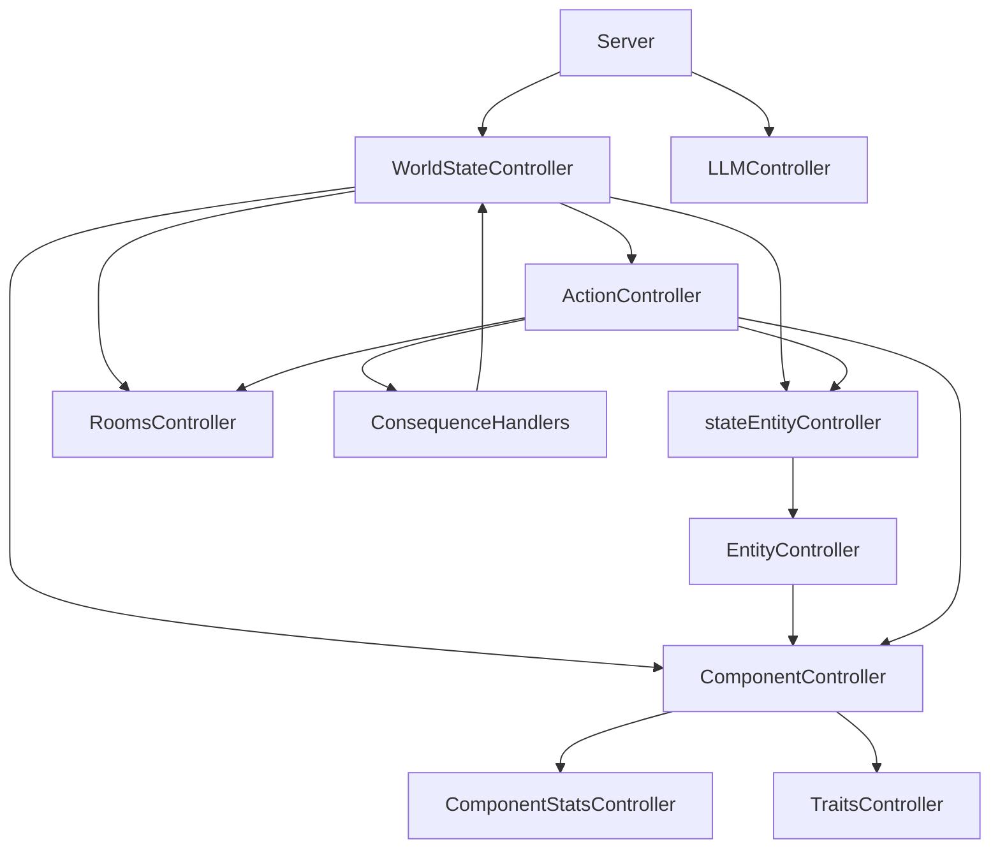

# 🗺️ Controller Relationship Map

This document serves as a high-level architectural map of the `slopSimulacrum` controller ecosystem. It is designed to help AI agents quickly understand the dependency chain and the flow of data and commands.

**Note:** For a more detailed, technical breakdown of the architecture, refer to the [System Architecture Map](subMDs/system_map.md), which serves as the "deep version" of this map.

## 📐 Architectural Overview

The system follows a **hierarchical dependency injection** pattern. The `WorldStateController` acts as the root injector, ensuring that all sub-controllers share the same state instances to prevent desynchronization.

### 1. Dependency Graph (Mermaid)

---

## ⛓️ Detailed Dependency Chain

### 🟢 The World State Hierarchy (Bottom-Up)
To understand how a piece of data is retrieved, follow this chain:

1.  **Data Layer (Bottom)**:
    - `ComponentStatsController`: Manages raw numeric values of components.
    - `TraitsController`: Manages entity traits and their properties.
2.  **Logic Layer (Middle)**:
    - `ComponentController` $\rightarrow$ depends on `ComponentStatsController` & `TraitsController`.
    - `EntityController` $\rightarrow$ depends on `ComponentController`.
3.  **Instance Layer (Top)**:
    - `stateEntityController` $\rightarrow$ depends on `EntityController`.
    - `RoomsController`: Manages spatial layout and room connectivity.
4.  **Coordination Layer (Root)**:
    - `WorldStateController`: The master controller that instantiates and holds references to all the above.

### 🔵 The Action Execution Flow
When an action is executed:
`Server` $\rightarrow$ `WorldStateController` $\rightarrow$ `ActionController` $\rightarrow$ `ConsequenceHandlers` $\rightarrow$ `WorldStateController` (to update sub-controllers).

### 🟡 The LLM Interaction Flow
The LLM flow is decoupled from the World State hierarchy:
`Client` $\rightarrow$ `Server` $\rightarrow$ `LLMController` $\rightarrow$ `LLM Backend`.

---

## 🛠️ Agent Quick-Reference

| If you need to... | Use this Controller | Dependency Note |
| :--- | :--- | :--- |
| Modify raw stats | `ComponentStatsController` | Lowest level |
| Change entity traits | `TraitsController` | Lowest level |
| Calculate component logic | `ComponentController` | Uses Stats & Traits |
| Manage entity existence | `EntityController` | Uses Components |
| Spawn/Move entities | `stateEntityController` | Uses EntityController |
| Modify room layout | `RoomsController` | Spatial state |
| Execute a game action | `ActionController` | Coordinates multiple controllers |
| Send a prompt to LLM | `LLMController` | Independent API wrapper |

## ⚠️ Critical Rule for Agents
**Never instantiate a controller manually** inside another controller. Always use the instances provided by `WorldStateController` or injected via the constructor. This prevents the "Dual State" bug where two controllers think the world is in different states.
