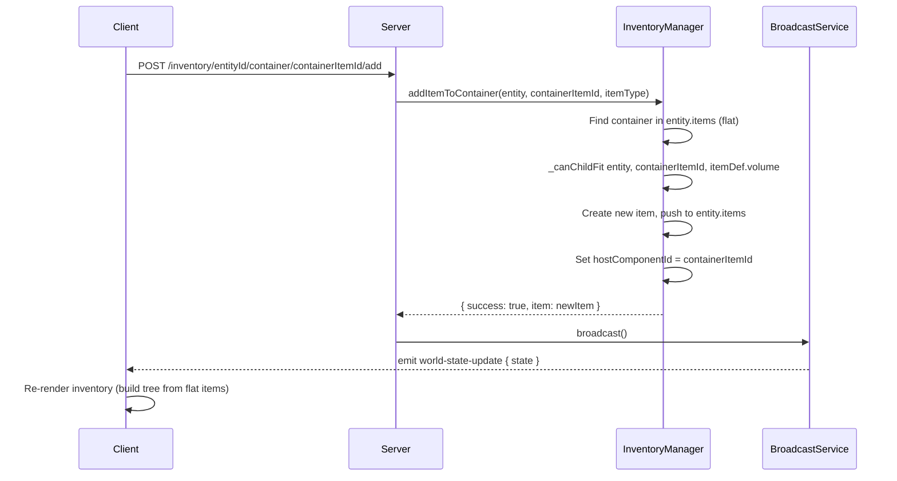
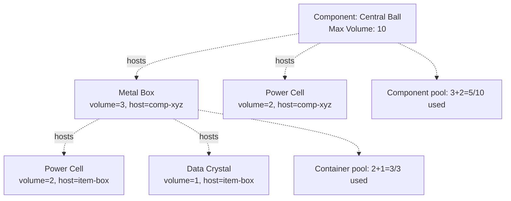

# Nested Inventory Feature — Architecture Design Document

## 1. Executive Summary

This document specifies the design for implementing **nested inventory**: the ability for items to hold other items within them. The design is **generic and flat** — it reuses the existing `entity.items` flat array and the polymorphic `hostComponentId` field:

```
entity.items[] (flat array)
  └─ item-A: hostComponentId = "comp-xyz"     (top-level, hosted by component)
  └─ item-B: hostComponentId = "comp-xyz"     (top-level, hosted by component)
  └─ item-C: hostComponentId = "item-A"        (nested, hosted by container item-A)
  └─ item-D: hostComponentId = "item-C"        (deeply nested, hosted by container item-C)
```

The `hostComponentId` field is **polymorphic**:
- For top-level items: points to a component ID (`comp-uuid`)
- For nested items: points to a parent container item ID (`item-uuid`)

**No `containedItems` arrays. No recursive data structures.** Children are found by querying: `items.filter(i => i.hostComponentId === parentId)`.

### Key Design Decisions

- **Flat storage**: All items live in the same flat `entity.items[]` array. No nested arrays.
- **Polymorphic host**: `hostComponentId` references either a component or an item — same field, same logic.
- **Generic volume validation**: A single `_getChildrenVolume(parentId)` + `_canChildFit(parentId, childVolume)` method validates both component-level and container-level constraints.
- **Client-side tree building**: The client builds the tree for rendering by grouping items by their `hostComponentId`.
- **Backward compatible**: Existing items with `hostComponentId` pointing to components behave exactly as before.

---

## 2. Data Model Changes

### 2.1 Item Definition (`data/inventoryItems.json`)

**No changes required to the schema.** The existing `volume` field serves both purposes:

```json
{
  "metalBox": {
    "name": "Metal Box",
    "description": "A sturdy container for storing small items.",
    "volume": 10,
    "traits": {
      "Physical": { "mass": 2, "durability": 100 }
    }
  },
  "powerCell": {
    "name": "Power Cell",
    "description": "Compact power source for droid systems.",
    "volume": 2,
    "traits": {
      "Physical": { "mass": 1, "durability": 50 }
    }
  }
}
```

The `metalBox` has `volume: 10` — it takes 10 units of component space AND can hold items totaling up to 10 volume. The `powerCell` has `volume: 2` — it takes 2 units of component space AND can hold items totaling up to 2 volume.

### 2.2 Item Instance (Server-Side `entity.items[]`)

**No `containedItems` array.** All items live in the flat `entity.items[]` array. The `hostComponentId` field indicates the parent:

**Before (flat, all hosted by components):**
```javascript
entity.items = [
  {
    id: "item-a1b2c3",
    type: "testItem",
    name: "Test Item",
    volume: 2,
    traits: { Physical: { mass: 0.5, durability: 10 } },
    hostComponentId: "comp-xyz"
  },
  {
    id: "item-d4e5f6",
    type: "powerCell",
    name: "Power Cell",
    volume: 2,
    traits: { Physical: { mass: 1, durability: 50 } },
    hostComponentId: "comp-xyz"
  }
]
```

**After (flat, some items hosted by containers):**
```javascript
entity.items = [
  {
    id: "item-box",
    type: "metalBox",
    name: "Metal Box",
    volume: 10,
    traits: { Physical: { mass: 2, durability: 100 } },
    hostComponentId: "comp-xyz"        // Top-level: hosted by component
  },
  {
    id: "item-power1",
    type: "powerCell",
    name: "Power Cell",
    volume: 2,
    traits: { Physical: { mass: 1, durability: 50 } },
    hostComponentId: "item-box"         // Nested: hosted by container item
  },
  {
    id: "item-crystal",
    type: "dataCrystal",
    name: "Data Crystal",
    volume: 1,
    traits: { Physical: { mass: 0.5, durability: 30 } },
    hostComponentId: "item-box"         // Nested: hosted by same container
  },
  {
    id: "item-tool",
    type: "testItem",
    name: "Test Item",
    volume: 2,
    traits: { Physical: { mass: 0.5, durability: 10 } },
    hostComponentId: "comp-xyz"         // Top-level: hosted by component (unrelated to box)
  }
]
```

**Recursive nesting example:**
```javascript
entity.items = [
  {
    id: "item-crate",
    type: "metalBox",
    volume: 30,
    hostComponentId: "comp-xyz"        // Top-level
  },
  {
    id: "item-box",
    type: "metalBox",
    volume: 10,
    hostComponentId: "item-crate"       // Nested in crate
  },
  {
    id: "item-crystal",
    type: "dataCrystal",
    volume: 1,
    hostComponentId: "item-box"         // Nested in box (depth 2)
  }
]
```

**Key instance properties:**
| Field | Type | Description |
|-------|------|-------------|
| `hostComponentId` | string | **Polymorphic**: For top-level items, points to a component ID (`comp-uuid`). For nested items, points to the parent container item ID (`item-uuid`). |
| No new fields | — | **No `containedItems` array needed.** Children are discovered by querying `items.filter(i => i.hostComponentId === parentId)`. |

---

## 3. Server-Side Changes

### 3.1 File: `src/utils/InventoryManager.js`

#### 3.1.1 Generic Volume Validation Methods

These are the core reusable methods. Both component-level and container-level validation use the same logic.

```javascript
/**
 * Get all direct children of a host (component or container item).
 * Works for both component items and container children.
 * @param {Object} entity - The entity object
 * @param {string} parentId - Component ID or container item ID
 * @returns {Array} Array of child item instances
 * @private
 */
_getChildren(entity, parentId) {
    const items = entity.items || [];
    return items.filter(item => item.hostComponentId === parentId);
}

/**
 * Calculate total volume of all direct children of a host.
 * Works for both component items and container children.
 * @param {Object} entity - The entity object
 * @param {string} parentId - Component ID or container item ID
 * @returns {number} Total volume
 * @private
 */
_getHostUsedVolume(entity, parentId) {
    return this._getChildren(entity, parentId)
        .reduce((sum, item) => sum + (item.volume || 0), 0);
}

/**
 * Check if a child item fits in a host (component or container).
 * @param {Object} entity - The entity object
 * @param {string} parentId - Component ID or container item ID
 * @param {number} childVolume - The volume of the item to add
 * @returns {boolean}
 * @private
 */
_canChildFit(entity, parentId, childVolume) {
    const host = this._getHostDefinition(entity, parentId);
    if (!host || host.maxVolume <= 0) return false;
    const used = this._getHostUsedVolume(entity, parentId);
    return (used + childVolume) <= host.maxVolume;
}

/**
 * Get the max volume for a host (component or container item).
 * @param {Object} entity - The entity object
 * @param {string} parentId - Component ID or container item ID
 * @returns {{ maxVolume: number, isComponent: boolean, host: Object }}
 * @private
 */
_getHostDefinition(entity, parentId) {
    // Check if parentId is a component ID
    if (parentId.startsWith('comp-')) {
        const maxVolume = this._getComponentMaxVolumeFromEntity(entity, parentId);
        return { maxVolume, isComponent: true, host: null };
    }

    // Check if parentId is an item ID (container)
    const parentItem = entity.items?.find(i => i.id === parentId);
    if (parentItem) {
        return { maxVolume: parentItem.volume, isComponent: false, host: parentItem };
    }

    return { maxVolume: 0, isComponent: false, host: null };
}
```

#### 3.1.2 `_findItem(entity, itemId)` → `Object | null`

Simple lookup in the flat array.

```javascript
/**
 * Find an item by ID in the entity's flat items array.
 * @param {Object} entity - The entity object
 * @param {string} itemId - The item ID to find
 * @returns {Object|null} The item instance, or null
 * @private
 */
_findItem(entity, itemId) {
    return (entity.items || []).find(item => item.id === itemId) || null;
}
```

#### 3.1.3 `addItemToContainer(entity, containerItemId, itemType)` → `{ success, message?, item? }`

Creates a new item and sets its `hostComponentId` to the container item ID.

**Logic:**
1. Find container item in `entity.items`
2. Validate it exists
3. Get item definition for `itemType`
4. **Generic validation**: `this._canChildFit(entity, containerItemId, itemDef.volume)`
5. Create new item instance with `generateItemId()`, set `hostComponentId = containerItemId`
6. Push to `entity.items`
7. Add to `this._inventory[entityId][newItemId]`
8. Broadcast state change

```javascript
addItemToContainer(entity, containerItemId, itemType) {
    const entityId = entity.id;
    this._ensureEntityInventory(entityId);

    // Find the container item in entity.items
    const containerItem = this._findItem(entity, containerItemId);
    if (!containerItem) {
        return { success: false, message: `Container item "${containerItemId}" not found.` };
    }

    const itemDef = this._itemDefinitions[itemType];
    if (!itemDef) {
        return { success: false, message: `Unknown item type: ${itemType}` };
    }

    // GENERIC VALIDATION: Use same logic as component volume check
    if (!this._canChildFit(entity, containerItemId, itemDef.volume)) {
        const used = this._getHostUsedVolume(entity, containerItemId);
        return {
            success: false,
            message: `Container capacity exceeded. Used: ${used}/${containerItem.volume}, Item needs: ${itemDef.volume}`
        };
    }

    const newItem = {
        id: generateItemId(),
        type: itemType,
        name: itemDef.name,
        volume: itemDef.volume,
        traits: itemDef.traits ? structuredClone(itemDef.traits) : {},
        hostComponentId: containerItemId
    };

    entity.items.push(newItem);
    this._inventory[entityId][newItem.id] = newItem;

    return { success: true, item: structuredClone(newItem) };
}
```

#### 3.1.4 `removeItemFromContainer(entity, containerItemId, itemId)` → `{ success, message? }`

Removes an item from a container. Also removes all its descendants (recursive cleanup).

**Logic:**
1. Find container item in `entity.items`
2. Find target item in `entity.items` (anywhere in the tree)
3. Remove the item and all its descendants from `entity.items`
4. Clean up `this._inventory`
5. Broadcast

```javascript
removeItemFromContainer(entity, containerItemId, itemId) {
    const entityId = entity.id;

    const containerItem = this._findItem(entity, containerItemId);
    if (!containerItem) {
        return { success: false, message: `Container item "${containerItemId}" not found.` };
    }

    const targetItem = this._findItem(entity, itemId);
    if (!targetItem) {
        return { success: false, message: `Item "${itemId}" not found.` };
    }

    // Validate: item must be a direct or indirect child of the container
    if (!this._isDescendantOf(entity, itemId, containerItemId)) {
        return { success: false, message: `Item "${itemId}" is not a child of container "${containerItemId}".` };
    }

    // Remove item and all descendants
    this._removeItemAndDescendants(entity, itemId);

    return { success: true };
}

/**
 * Check if itemId is a direct or indirect child of parentId.
 * @param {Object} entity - The entity object
 * @param {string} itemId - The item ID to check
 * @param {string} parentId - The ancestor item/component ID
 * @returns {boolean}
 * @private
 */
_isDescendantOf(entity, itemId, parentId) {
    let current = this._findItem(entity, itemId);
    while (current) {
        if (current.hostComponentId === parentId) return true;
        current = this._findItem(entity, current.hostComponentId);
    }
    return false;
}

/**
 * Remove an item and all its descendants from entity.items.
 * @param {Object} entity - The entity object
 * @param {string} itemId - The item ID to remove (and all descendants)
 * @private
 */
_removeItemAndDescendants(entity, itemId) {
    const entityId = entity.id;
    const children = this._getChildren(entity, itemId);

    // Recursively remove descendants first
    for (const child of children) {
        this._removeItemAndDescendants(entity, child.id);
    }

    // Remove self
    const index = entity.items.findIndex(item => item.id === itemId);
    if (index !== -1) {
        entity.items.splice(index, 1);
    }
    if (this._inventory[entityId] && this._inventory[entityId][itemId]) {
        delete this._inventory[entityId][itemId];
    }
}
```

#### 3.1.5 `moveItemIntoContainer(entity, containerItemId, itemId)` → `{ success, message? }`

Moves an existing item from the component level (or another container) into a container.

**Logic:**
1. Find container item in `entity.items`
2. Find source item in `entity.items` (anywhere)
3. **Generic validation**: `this._canChildFit(entity, containerItemId, sourceItem.volume)`
4. Set `sourceItem.hostComponentId = containerItemId`
5. Broadcast

```javascript
moveItemIntoContainer(entity, containerItemId, itemId) {
    const entityId = entity.id;

    const containerItem = this._findItem(entity, containerItemId);
    if (!containerItem) {
        return { success: false, message: `Container item "${containerItemId}" not found.` };
    }

    const sourceItem = this._findItem(entity, itemId);
    if (!sourceItem) {
        return { success: false, message: `Item "${itemId}" not found.` };
    }

    // Prevent moving a container into itself or its own descendants
    if (this._isDescendantOf(entity, containerItemId, itemId)) {
        return { success: false, message: "Cannot move a container into its own descendants." };
    }

    // GENERIC VALIDATION: Use same logic as component volume check
    if (!this._canChildFit(entity, containerItemId, sourceItem.volume)) {
        const used = this._getHostUsedVolume(entity, containerItemId);
        return {
            success: false,
            message: `Container capacity exceeded. Used: ${used}/${containerItem.volume}, Item needs: ${sourceItem.volume}`
        };
    }

    // Move: just change the host reference
    sourceItem.hostComponentId = containerItemId;

    return { success: true };
}
```

#### 3.1.6 `moveItemOutOfContainer(entity, containerItemId, itemId, targetComponentId)` → `{ success, message? }`

Moves an item from a container back to the component level.

**Logic:**
1. Find container item in `entity.items`
2. Find target item in `entity.items`
3. Set `hostComponentId = targetComponentId`
4. Broadcast

```javascript
moveItemOutOfContainer(entity, containerItemId, itemId, targetComponentId) {
    const entityId = entity.id;

    const containerItem = this._findItem(entity, containerItemId);
    if (!containerItem) {
        return { success: false, message: `Container item "${containerItemId}" not found.` };
    }

    const targetItem = this._findItem(entity, itemId);
    if (!targetItem) {
        return { success: false, message: `Item "${itemId}" not found.` };
    }

    // Validate: item must be a child of the container
    if (targetItem.hostComponentId !== containerItemId) {
        return { success: false, message: `Item "${itemId}" is not a direct child of container "${containerItemId}".` };
    }

    targetItem.hostComponentId = targetComponentId;

    return { success: true };
}
```

#### 3.1.7 `getContainerItems(entity, containerItemId)` → `Array`

Returns all direct children of a container (or component).

```javascript
getContainerItems(entity, containerItemId) {
    return structuredClone(this._getChildren(entity, containerItemId));
}
```

#### 3.1.8 `getEntityItems(entity)` — Tree Building

The existing method groups items by `hostComponentId`. For the nested model, we need to build a tree for the client.

**Updated approach:** Return a flat list grouped by top-level host (component), with children resolved on the client.

```javascript
// Option 1: Return flat grouped structure (client builds tree)
getEntityItems(entity) {
    const entityId = entity.id;
    const items = entity.items || [];

    // Group by top-level host (component only, not other items)
    const grouped = {};
    for (const item of items) {
        const parentId = item.hostComponentId;
        // If hosted by another item, put it under the root-level host
        const parentItem = this._findItem(entity, parentId);
        const effectiveHost = parentItem ? parentItem.hostComponentId : parentId;

        if (!grouped[effectiveHost]) {
            grouped[effectiveHost] = [];
        }
        grouped[effectiveHost].push(structuredClone(item));
    }

    return structuredClone(grouped);
}
```

**Option 2 (recommended):** Return the flat items array with a `_parentId` field for client tree building:

```javascript
getEntityItems(entity) {
    const items = entity.items || [];
    // Return flat array with hostComponentId preserved for client tree building
    return structuredClone(items);
}
```

I recommend **Option 2** — return the flat array. The client already receives items grouped by component via the existing API. We can add a new endpoint that returns the flat tree structure.

#### 3.1.9 Update `removeItem(entity, itemId)` — Cascade Cleanup

Updated to also remove descendants:

```javascript
// Updated removeItem method
removeItem(entity, itemId) {
    const entityId = entity.id;

    if (!entity.items || !Array.isArray(entity.items)) {
        return { success: false, message: 'Entity has no items.' };
    }

    const targetItem = this._findItem(entity, itemId);
    if (!targetItem) {
        Logger.warn(`[InventoryManager] Item "${itemId}" not found in entity ${entityId}.`);
        return { success: false, message: `Item not found: ${itemId}` };
    }

    // Remove item and all descendants
    this._removeItemAndDescendants(entity, itemId);

    Logger.info(`[InventoryManager] Removed item ${itemId} and its descendants from entity ${entityId}.`);
    return { success: true };
}
```

---

## 4. Client-Side Changes

### 4.1 File: `public/js/InventoryManager.js`

#### 4.1.1 New State Properties

Add to the constructor (around line 48):

```javascript
/** @private {Object<string, boolean>} */
this._containerExpanded = {};  // { [containerItemId]: true/false }
```

#### 4.1.2 Tree Building Helper

Add a method to build the item tree from the flat array:

```javascript
/**
 * Build a tree structure from the flat items array.
 * Groups items by their top-level host (component), then nests children recursively.
 * @param {Object} flatItems - Flat items array from server (grouped by component)
 * @returns {Object} Tree structure: { [compId]: [topLevelItems] } where each item has children
 * @private
 */
_buildItemTree(flatItems) {
    // flatItems is currently: { [compId]: [items] }
    // We need to add children to each item that is a container

    const tree = {};
    for (const [hostId, items] of Object.entries(flatItems)) {
        tree[hostId] = this._attachChildren(items, flatItems);
    }
    return tree;
}

/**
 * Recursively attach children to items.
 * @param {Array} parentItems - Items whose children we need to find
 * @param {Object} flatItems - Full flat items map
 * @returns {Array} Items with `children` property added
 * @private
 */
_attachChildren(parentItems, flatItems) {
    // Collect all items from all components (flat)
    const allItems = [];
    for (const items of Object.values(flatItems)) {
        allItems.push(...items);
    }

    return parentItems.map(item => {
        // Find direct children: items whose hostComponentId === this item's id
        const children = allItems.filter(i => i.hostComponentId === item.id);
        if (children.length > 0) {
            item.children = this._attachChildren(children, flatItems);
        } else {
            item.children = [];
        }
        return item;
    });
}
```

#### 4.1.3 Update `_renderInventory()` — Build Tree

Modify `_renderInventory()` to build the tree and pass it to rendering:

```javascript
_renderInventory() {
    // ... existing logic to get compIds, volumeComponents, etc. ...

    // NEW: Build tree from current items
    const tree = this._buildItemTree(this._currentItems);

    let html = '';
    for (const comp of volumeComponents) {
        const compItems = tree[comp.id] || [];
        const volumeInfo = this._calculateVolumeInfo(comp.id, comp.volume, compItems);
        html += this._renderComponentSlot(comp, volumeInfo, compItems);
    }

    this._content.innerHTML = html;
    this._attachDragAndDropListeners();
}
```

#### 4.1.4 Update `_renderComponentSlot()` — Pass Tree Items

Modify to accept tree items (with children):

```javascript
_renderComponentSlot(comp, volumeInfo, items) {
    const percentageStr = volumeInfo.percentage.toFixed(0);
    const volumeText = `${volumeInfo.used}/${volumeInfo.max}`;
    const itemsHtml = this._renderTreeItems(comp.id, items);  // Changed from _renderItems
    const hasItems = items.length > 0;
    const itemsContainerClass = `inventory-items-container${hasItems ? ' has-items' : ''}`;

    return `
        <div class="inventory-component-slot" data-comp-id="${comp.id}" data-comp-volume="${comp.volume}">
            <div class="inventory-component-header">
                <span class="inventory-component-name">
                    <span class="inventory-component-type-badge">${this._formatTypeName(comp.type)}</span>
                </span>
                <div class="inventory-component-meta">
                    <div class="inventory-volume-bar" title="${percentageStr}% volume used">
                        <div class="inventory-volume-bar-fill ${volumeInfo.barClass}" style="width: ${Math.min(volumeInfo.percentage, 100)}%;"></div>
                    </div>
                    <span class="inventory-volume-text">${volumeText} (${percentageStr}%)</span>
                </div>
            </div>
            <div class="${itemsContainerClass}" data-comp-id="${comp.id}">
                ${itemsHtml}
            </div>
        </div>`;
}
```

#### 4.1.5 New Method: `_renderTreeItems(componentId, items)`

Renders items with children (containers expand to show nested items).

```javascript
/**
 * Renders items from the tree structure (items may have children).
 * @param {string} componentId - The component ID (drop target for top-level).
 * @param {Array} items - Tree items (with optional children).
 * @returns {string} HTML string.
 * @private
 */
_renderTreeItems(componentId, items) {
    if (items.length === 0) {
        return '<div class="inventory-items-empty"><span class="inventory-drag-hint">Drag items here</span></div>';
    }

    let html = '';
    for (const item of items) {
        const itemDef = this._itemRegistry ? this._itemRegistry[item.type] : null;
        const itemVolume = item.volume || (itemDef ? itemDef.volume : 0);
        const hasChildren = item.children && item.children.length > 0;
        const hasHoldingCost = this._holdingCostRegistry && this._holdingCostRegistry[item.type];
        const isEquipped = this._isEquippedByItemId(item.id);

        // Build equip/unequip button (existing logic)
        let equipButtonHtml = '';
        if (hasHoldingCost) {
            const btnText = isEquipped ? '🔓 Unequip' : '⚔️ Equip';
            const btnClass = isEquipped ? 'equip-btn unequip' : 'equip-btn equip';
            equipButtonHtml = `<button class="${btnClass}" data-item-id="${item.id}" data-item-type="${item.type}" data-is-equipped="${isEquipped ? 'true' : 'false'}">${btnText}</button>`;
        }

        // Drop button
        const dropButtonHtml = `<button class="equip-btn drop" data-item-id="${item.id}" data-item-type="${item.type}" title="Click to select a component and drop this item">📦 Drop</button>`;

        // Container header with children (if hasChildren)
        let containerHtml = '';
        if (hasChildren) {
            const capacity = itemVolume;
            const childrenVolume = item.children.reduce((sum, c) => sum + (c.volume || 0), 0);
            const isExpanded = this._containerExpanded[item.id] !== false;
            const chevron = isExpanded ? '▼' : '▶';
            const usedPercent = capacity > 0 ? Math.round((childrenVolume / capacity) * 100) : 0;

            containerHtml = `
                <div class="inventory-container-slot" data-item-id="${item.id}" data-container-capacity="${capacity}">
                    <div class="inventory-container-header" data-toggle-container="${item.id}">
                        <button class="inventory-container-toggle" data-toggle-container="${item.id}" title="Expand/collapse">${chevron}</button>
                        <span class="inventory-item-name">${item.name || item.type}</span>
                        <span class="inventory-item-volume">${itemVolume}v</span>
                        <span class="inventory-container-capacity-text">${childrenVolume}/${capacity} (${usedPercent}%)</span>
                    </div>
                    <div class="inventory-container-items" style="display: ${isExpanded ? 'block' : 'none'};" data-container-items="${item.id}">
                        <div class="inventory-container-capacity-bar">
                            <div class="inventory-container-capacity-bar-fill ${usedPercent >= 100 ? 'full' : usedPercent >= 75 ? 'high' : usedPercent >= 40 ? 'medium' : 'low'}" style="width: ${Math.min(usedPercent, 100)}%;"></div>
                        </div>
                        ${this._renderTreeItems(item.id, item.children)}
                    </div>
                </div>`;
        }

        html += `
            ${containerHtml}
            <div class="inventory-item-card"${hasChildren ? ' style="border-left: 3px solid var(--neon-cyan);"' : ''}
                 draggable="true"
                 data-item-id="${item.id}"
                 data-item-type="${item.type}"
                 data-item-volume="${itemVolume}"
                 data-is-container="${hasChildren}">
                <span class="drag-handle">${hasChildren ? '📦' : '⠿'}</span>
                <span class="inventory-item-name">${item.name || item.type}</span>
                <span class="inventory-item-volume">${itemVolume}v</span>
                <button class="equip-btn stats-toggle" data-item-id="${item.id}" data-item-type="${item.type}" title="Click to view item stats">📊 Stats</button>
                ${equipButtonHtml}
                ${dropButtonHtml}
            </div>`;
    }
    return html;
}
```

#### 4.1.6 New Method: `_toggleContainer(containerItemId)`

Toggles the expanded state of a container.

```javascript
/**
 * Toggles the expanded/collapsed state of a container.
 * @param {string} containerItemId - The container item ID.
 * @private
 */
_toggleContainer(containerItemId) {
    this._containerExpanded[containerItemId] = !this._containerExpanded[containerItemId];
    const containerItemsEl = this._content?.querySelector(`[data-container-items="${containerItemId}"]`);
    const toggleBtn = this._content?.querySelector(`[data-toggle-container="${containerItemId}"]`);

    if (containerItemsEl) {
        const isExpanded = this._containerExpanded[containerItemId];
        containerItemsEl.style.display = isExpanded ? 'block' : 'none';
    }
    if (toggleBtn) {
        const isExpanded = this._containerExpanded[containerItemId];
        toggleBtn.textContent = isExpanded ? '▼ ' : '▶ ';
    }
}
```

#### 4.1.7 Update `_attachDragAndDropListeners()` — Container Drop Targets

Add listeners for container drop zones and expand/collapse toggles.

```javascript
_attachDragAndDropListeners() {
    // ... existing item card drag listeners (unchanged) ...

    // ... existing container drop zone listeners (unchanged) ...

    // NEW: Attach container header toggle listeners
    const toggleButtons = this._content.querySelectorAll('[data-toggle-container]');
    toggleButtons.forEach(btn => {
        btn.addEventListener('click', (e) => {
            e.stopPropagation();
            const containerItemId = btn.dataset.toggleContainer;
            this._toggleContainer(containerItemId);
        });
    });

    // NEW: Attach dragover/drop to container slots
    const containerSlots = this._content.querySelectorAll('.inventory-container-slot');
    containerSlots.forEach(slot => {
        slot.addEventListener('dragover', (e) => {
            e.preventDefault();
            e.stopPropagation();
            if (this._draggingItemId) {
                const containerItemId = slot.dataset.itemId;
                const canFit = this._checkItemFitInContainer(containerItemId, this._draggingItemId);
                slot.classList.toggle('drop-target-hover', canFit);
                slot.classList.toggle('drop-target-invalid', !canFit);
                if (canFit) {
                    this._containerExpanded[containerItemId] = true;
                    this._toggleContainerVisual(containerItemId, true);
                }
            }
        });
        slot.addEventListener('dragleave', (e) => {
            e.stopPropagation();
            slot.classList.remove('drop-target-hover', 'drop-target-invalid');
        });
        slot.addEventListener('drop', (e) => {
            e.preventDefault();
            e.stopPropagation();
            slot.classList.remove('drop-target-hover', 'drop-target-invalid');
            const containerItemId = slot.dataset.itemId;
            const itemId = e.dataTransfer.getData('text/plain');
            if (itemId && this._currentEntityId) {
                this._onContainerDrop(e, containerItemId, itemId);
            }
        });
    });
}
```

#### 4.1.8 New Method: `_checkItemFitInContainer(containerItemId, draggedItemId)` → `boolean`

Checks if a dragged item can fit inside a container.

```javascript
/**
 * Checks if a dragged item can fit in a container.
 * @param {string} containerItemId - The container item ID.
 * @param {string} draggedItemId - The dragged item ID.
 * @returns {boolean}
 * @private
 */
_checkItemFitInContainer(containerItemId, draggedItemId) {
    // Get the dragged item volume from the card
    const draggedCard = this._content?.querySelector(`[data-item-id="${draggedItemId}"]`);
    if (!draggedCard) return false;
    const draggedVolume = parseInt(draggedCard.dataset.itemVolume) || 0;

    // Get the container item volume from the slot
    const containerSlot = this._content?.querySelector(`[data-item-id="${containerItemId}"]`);
    if (!containerSlot) return false;
    const containerVolume = parseInt(containerSlot.dataset.containerCapacity) || 0;

    // Get current children volume for this container
    // Query all item cards whose data-parent-container-id matches (for top-level)
    // or find via _currentItems tree
    const currentChildren = this._getChildrenFromTree(containerItemId);
    const usedVolume = currentChildren.reduce((sum, i) => sum + (i.volume || 0), 0);

    return (usedVolume + draggedVolume) <= containerVolume;
}

/**
 * Get direct children of a container from the current items tree.
 * @param {string} parentId - Container item ID or component ID
 * @returns {Array}
 * @private
 */
_getChildrenFromTree(parentId) {
    // For component ID: get from _currentItems[parentId]
    if (parentId.startsWith('comp-')) {
        return this._currentItems[parentId] || [];
    }
    // For item ID: find the item in the tree and get its children
    const allItems = [];
    for (const items of Object.values(this._currentItems)) {
        allItems.push(...items);
    }
    const findWithChildren = (items) => {
        for (const item of items) {
            if (item.id === parentId) return item.children || [];
            if (item.children) {
                const found = findWithChildren(item.children);
                if (found) return found;
            }
        }
        return null;
    };
    const result = findWithChildren(allItems);
    return result || [];
}
```

#### 4.1.9 New Method: `_onContainerDrop(e, containerItemId, itemId)`

Handles dropping an item onto a container. Moves the item into the container.

```javascript
/**
 * Handles dropping an item onto a container item.
 * @param {DragEvent} e - The drag event.
 * @param {string} containerItemId - The container item ID.
 * @param {string} itemId - The item ID being dropped.
 * @private
 */
async _onContainerDrop(e, containerItemId, itemId) {
    if (!this._currentEntityId) return;
    if (itemId === containerItemId) return;

    try {
        const response = await fetch(`/inventory/${this._currentEntityId}/container/${containerItemId}/move-in/${itemId}`, {
            method: 'POST',
            headers: { 'Content-Type': 'application/json' }
        });

        const result = await response.json();

        if (!response.ok || !result.success) {
            this._showToast(result.message || 'Failed to move item into container', 'error');
            return;
        }

        this._showToast('Item moved into container', 'success');

        // Expand the container
        this._containerExpanded[containerItemId] = true;
        this._toggleContainerVisual(containerItemId, true);

        // Reload and re-render
        await this._loadEntityItems(this._currentEntityId);
        this._renderInventory();

    } catch (error) {
        console.error('[InventoryManager] Error moving item into container:', error);
        this._showToast('Failed to move item into container', 'error');
    }
}

/**
 * Updates the visual state of a container toggle without full re-render.
 * @param {string} containerItemId - The container item ID.
 * @param {boolean} isExpanded - Whether the container should be expanded.
 * @private
 */
_toggleContainerVisual(containerItemId, isExpanded) {
    const containerItemsEl = this._content?.querySelector(`[data-container-items="${containerItemId}"]`);
    if (containerItemsEl) {
        containerItemsEl.style.display = isExpanded ? 'block' : 'none';
    }
}
```

---

## 5. API Endpoint Specifications

| Method | Endpoint | Body | Description |
|--------|----------|------|-------------|
| `POST` | `/inventory/:entityId/container/:containerItemId/add` | `{ itemType: string }` | Creates a new item and sets its `hostComponentId` to the container |
| `DELETE` | `/inventory/:entityId/container/:containerItemId/remove/:itemId` | — | Removes an item from a container (cascades to descendants) |
| `POST` | `/inventory/:entityId/container/:containerItemId/move-in/:itemId` | — | Moves an existing item into a container (changes `hostComponentId`) |
| `POST` | `/inventory/:entityId/container/:containerItemId/move-out/:itemId` | `{ targetComponentId: string }` | Moves an item from a container back to component level |
| `GET` | `/inventory/:entityId/container/:containerItemId/items` | — | Gets direct children of a container |

**Route Registration Order:** These routes must be registered **before** the dropped items routes (line ~618 in `inventoryRoutes.js`) and **after** the existing parameterized routes.

**Response Formats:**

`POST /add` — Success:
```json
{ "success": true, "item": { "id": "item-uuid", "type": "powerCell", "hostComponentId": "item-box" } }
```
`POST /add` — Failure:
```json
{ "error": "Failed to add item to container", "message": "Container capacity exceeded. Used: 8/10, Item needs: 5" }
```

`DELETE /remove/:itemId` — Success:
```json
{ "success": true }
```

`POST /move-in/:itemId` — Success:
```json
{ "success": true }
```

`POST /move-out/:itemId` — Success:
```json
{ "success": true }
```

`GET /items` — Success:
```json
{ "items": [ { "id": "item-uuid", "type": "powerCell", "volume": 2, "hostComponentId": "item-box" }, ... ] }
```

---

## 6. CSS Changes

### 6.1 File: `public/css/inventory.css`

Add the following styles at the end of the file.

```css
/* =========================================================================
   Nested Inventory — Container Styles
   ========================================================================= */

/* --- Container Slot Wrapper --- */
.inventory-container-slot {
    border: 1px solid var(--neon-cyan);
    border-radius: 6px;
    margin-bottom: 6px;
    overflow: hidden;
    background: rgba(0, 255, 255, 0.02);
    transition: border-color 0.2s ease, box-shadow 0.2s ease;
}

.inventory-container-slot.drop-target-hover {
    border-color: var(--neon-green);
    box-shadow: 0 0 8px rgba(0, 255, 128, 0.3);
}

.inventory-container-slot.drop-target-invalid {
    border-color: var(--neon-red);
    box-shadow: 0 0 8px rgba(255, 0, 80, 0.3);
}

/* --- Container Header (Expand/Collapse) --- */
.inventory-container-header {
    display: flex;
    align-items: center;
    gap: 6px;
    padding: 6px 8px;
    background: rgba(0, 255, 255, 0.06);
    cursor: pointer;
    user-select: none;
    transition: background 0.15s ease;
}

.inventory-container-header:hover {
    background: rgba(0, 255, 255, 0.12);
}

/* --- Container Toggle Button (Chevron) --- */
.inventory-container-toggle {
    background: transparent;
    border: none;
    color: var(--neon-cyan);
    font-size: 0.7em;
    cursor: pointer;
    padding: 2px 4px;
    min-width: 20px;
    text-align: left;
    transition: transform 0.15s ease;
    user-select: none;
}

.inventory-container-toggle:hover {
    color: var(--text-main);
}

/* --- Container Items Area (Nested) --- */
.inventory-container-items {
    padding: 4px 4px 4px 12px;
    background: rgba(0, 0, 0, 0.15);
    border-top: 1px solid rgba(0, 255, 255, 0.15);
}

/* --- Container Capacity Bar --- */
.inventory-container-capacity-bar {
    width: 100%;
    height: 6px;
    background: var(--bg-dark);
    border-radius: 3px;
    overflow: hidden;
    margin-bottom: 4px;
}

.inventory-container-capacity-bar-fill {
    height: 100%;
    border-radius: 3px;
    transition: width 0.3s ease, background-color 0.3s ease;
}

.inventory-container-capacity-bar-fill.low {
    background: var(--neon-green);
}

.inventory-container-capacity-bar-fill.medium {
    background: #ffaa00;
}

.inventory-container-capacity-bar-fill.high {
    background: var(--neon-orange);
}

.inventory-container-capacity-bar-fill.full {
    background: var(--neon-red);
}

/* --- Container Capacity Text --- */
.inventory-container-capacity-text {
    font-size: 0.75em;
    color: var(--text-dim);
    white-space: nowrap;
    margin-left: auto;
    padding-left: 8px;
}

/* --- Nested Item Depth Indentation --- */
.inventory-nested-depth-1 {
    margin-left: 16px !important;
    border-left: 2px solid rgba(0, 255, 255, 0.2);
    padding-left: 8px !important;
}

.inventory-nested-depth-2 {
    margin-left: 32px !important;
    border-left: 2px solid rgba(0, 255, 255, 0.3);
    padding-left: 8px !important;
}

.inventory-nested-depth-3 {
    margin-left: 48px !important;
    border-left: 2px solid rgba(0, 255, 255, 0.4);
    padding-left: 8px !important;
}

.inventory-nested-depth-4 {
    margin-left: 64px !important;
    border-left: 2px solid rgba(0, 255, 255, 0.5);
    padding-left: 8px !important;
}

.inventory-nested-depth-5,
.inventory-nested-depth-6,
.inventory-nested-depth-7,
.inventory-nested-depth-8 {
    margin-left: 80px !important;
    border-left: 2px solid rgba(0, 255, 255, 0.5);
    padding-left: 8px !important;
}

/* --- Empty nested area hint --- */
.inventory-nested-empty {
    font-size: 0.75em;
    font-style: italic;
    color: var(--text-dim);
    opacity: 0.6;
}
```

---

## 7. Data Flow Diagrams

### 7.1 Volume Validation — Generic Reuse

```mermaid
graph TD
    A[Component Volume Check] --> B[_canChildFit entity, parentId, childVolume]
    C[Container Volume Check] --> B
    B --> D[_getHostDefinition entity, parentId]
    D --> E{Is component?}
    E -->|Yes| F[lookup component.maxVolume from components.json]
    E -->|No| G[use parentItem.volume as maxVolume]
    F --> H[_getHostUsedVolume entity, parentId]
    G --> H
    H --> I[sum child.volume for each child]
    I --> J[return used + childVolume <= maxVolume]

    style A fill:#1a1a2e,stroke:#00ff80
    style C fill:#1a1a2e,stroke:#00ffff
    style B fill:#1a1a2e,stroke:#ffaa00
    style D fill:#1a1a2e,stroke:#ffaa00
    style J fill:#1a1a2e,stroke:#ffaa00
```



### 7.2 Flat Storage Model

```mermaid
graph TD
    A[entity.items flat array] --> B[item-A: host=comp-xyz]
    A --> C[item-B: host=comp-xyz]
    A --> D[item-C: host=item-A]
    A --> E[item-D: host=item-C]

    B -.->|filter hostComponentId| F[Children of item-A: item-C]
    C -.->|filter hostComponentId| G[Children of item-B: none]
    D -.->|filter hostComponentId| H[Children of item-C: item-D]

    style A fill:#1a1a2e,stroke:#00ff80
    style B fill:#1a1a2e,stroke:#00ffff
    style C fill:#1a1a2e,stroke:#ffffff
    style D fill:#1a1a2e,stroke:#00ffff
    style E fill:#1a1a2e,stroke:#ffffff
```



### 7.3 State Flow: Adding an Item to a Container



### 7.4 Volume Hierarchy



### 7.5 Drag and Drop Flow

```mermaid
flowchart TD
    A[User drags item card] --> B{Drop target?}
    B -->|Component slot| C[Existing move flow<br/>POST /move/:itemId]
    B -->|Container slot| D[Auto-expand container]
    D --> E{Capacity available?}
    E -->|Yes| F[POST /container/.../move-in/:itemId]
    E -->|No| G[Show error toast]
    F --> H[Server: _canChildFit container.volume, children, itemVolume]
    H --> I{Valid?}
    I -->|Yes| J[Set hostComponentId = containerId + broadcast]
    I -->|No| G
    J --> K[Client re-renders with nested items]
    G --> K

    style C fill:#1a1a2e,stroke:#00ff80
    style F fill:#1a1a2e,stroke:#00ffff
    style G fill:#1a1a2e,stroke:#ff0050
```



---

## 8. Edge Case Handling

### 8.1 Moving a Container That Contains Items

- **Behavior:** The container and all its descendants move together implicitly. Since items reference their parent by `hostComponentId`, moving a container means changing its own `hostComponentId`. Its children's `hostComponentId` values remain unchanged (they still point to the container).
- **Volume:** Only the container's own volume counts against the target component capacity. Nested items' volumes are irrelevant for the move.

### 8.2 Removing a Container Item (Cascade)

- **Behavior:** When a container is removed, all its descendants are also removed.
- **Implementation:** `_removeItemAndDescendants()` recursively finds all items where `hostComponentId` traces back to the removed item, then removes them all.
- **Cleanup:** All affected entries are removed from `this._inventory`.

### 8.3 Volume Overflow

- **Behavior:** Adding an item that would exceed container capacity is rejected with a clear error message.
- **Implementation:** `_canChildFit` check before push. Error message: `"Container capacity exceeded. Used: X/Y, Item needs: Z"`.

### 8.4 Circular References

- **Guaranteed impossible by design:** Items reference their parent via `hostComponentId`. To create a cycle, item A would need to host item B, and item B would need to host item A. But moving item B under item A requires item B's `hostComponentId` to become item A's ID. If item A was already under item B, this would break the existing chain. The server validates this: `_isDescendantOf` prevents moving a container into its own descendants.

### 8.5 Deep Nesting (3+ levels)

- **UI handling:** CSS provides depth classes up to `depth-8`. Items deeper than level 5 get a fixed indentation of 80px.
- **No hard server limit:** `_isDescendantOf` and `_removeItemAndDescendants` are recursive with no depth cap. JavaScript call stack limits are theoretical.

### 8.6 Dropping an Item Into Its Own Container

- **Behavior:** Prevented. The `_onContainerDrop` handler checks `if (itemId === containerItemId) return;`. Additionally, the server validates `_isDescendantOf(entity, containerItemId, itemId)` to prevent moving a container into its own descendants.

### 8.7 Equipped Items in Containers

- **Behavior:** Items can be inside containers while equipped. The equip/unequip buttons appear in nested rendering.
- **Implementation:** The `_renderTreeItems` method includes the same equip button logic as `_renderItems`. The holding cost system operates on item types, not their location.

### 8.8 Dragging Items Out of Containers

- **Behavior:** Dragging a nested item to a component slot moves it out of the container.
- **Implementation:** When a nested item is dropped on a component container, the system detects the source is a container (via `data-is-container` or parent context). It calls `POST /container/.../move-out/:itemId` with `targetComponentId`.

### 8.9 Broadcast Consistency

- **Behavior:** Any change to `hostComponentId` triggers a full state broadcast via `this._broadcastService.broadcast()`.
- **Implementation:** All container API methods call `broadcast()` on success, same pattern as existing `addItem`, `removeItem`, `moveItem`.

---

## 9. Implementation Order / Phases

### Phase 1: Server Generic Methods

1. Add `_getChildren()`, `_getHostUsedVolume()`, `_canChildFit()`, `_getHostDefinition()` generic methods to `InventoryManager`.
2. Add `_findItem()` and `_isDescendantOf()` helpers.
3. Add `_removeItemAndDescendants()` for cascade cleanup.

### Phase 2: Server Container Methods

4. Add `addItemToContainer()`, `removeItemFromContainer()`, `moveItemIntoContainer()`, `moveItemOutOfContainer()`, `getContainerItems()`.
5. Update `removeItem()` to use `_removeItemAndDescendants()`.
6. Update `getEntityItems()` to support flat tree structure.

### Phase 3: WorldStateController API Wrappers

7. Add `addItemToContainer()`, `removeItemFromContainer()`, `moveItemIntoContainer()`, `moveItemOutOfContainer()`, `getContainerItems()` wrappers.

### Phase 4: API Routes

8. Add 5 new route handlers in `inventoryRoutes.js`.
9. Verify route order.

### Phase 5: Client-Side Tree Building

10. Add `_containerExpanded` state property.
11. Add `_buildItemTree()` and `_attachChildren()` methods.
12. Update `_renderInventory()` to build and use the tree.
13. Add `_renderTreeItems()` recursive rendering method.

### Phase 6: Client-Side Drag and Drop

14. Update `_attachDragAndDropListeners()` for container drop targets.
15. Add `_checkItemFitInContainer()` method.
16. Add `_onContainerDrop()` handler.

### Phase 7: CSS Styling

17. Add all container CSS classes to `inventory.css`.
18. Verify visual hierarchy at all depth levels.

### Phase 8: Testing

19. Test adding items to containers via API.
20. Test removing items from containers (cascade verification).
21. Test moving items in/out of containers.
22. Test recursive nesting (container inside container).
23. Test volume validation (overflow rejection).
24. Test drag-and-drop onto containers.
25. Test expand/collapse UI.
26. Test equipped items inside containers.

---

## 10. Files to Modify

| # | File | Changes | Lines (approx.) |
|---|------|---------|-----------------|
| 1 | `data/inventoryItems.json` | Add `metalBox` and `toolCrate` container item definitions (no schema change) | ~15 new lines |
| 2 | `src/utils/InventoryManager.js` | Add 7 generic methods + 5 container methods + update `removeItem()` | ~200 new lines, ~20 modified |
| 3 | `src/controllers/WorldStateController.js` | Add 5 API wrapper methods in INVENTORY section | ~80 new lines |
| 4 | `src/routes/inventoryRoutes.js` | Add 5 new route handlers | ~130 new lines |
| 5 | `public/js/InventoryManager.js` | Add state property, add tree building methods, add `_renderTreeItems()`, `_toggleContainer()`, `_checkItemFitInContainer()`, `_onContainerDrop()`, update `_attachDragAndDropListeners()` | ~220 new lines, ~30 modified |
| 6 | `public/css/inventory.css` | Add container styles section | ~100 new lines |

### Total Estimated Changes
- **New lines of code:** ~760
- **Modified lines:** ~50
- **Total files touched:** 6

---

## Appendix A: Generic Volume Validation — Code Reuse

The core insight of this design is that **component volume validation** and **container volume validation** are the same operation:

```javascript
// Component-level (existing, adapted to use generic method)
if (!this._canChildFit(entity, componentId, itemDef.volume)) {
    return { success: false, message: 'Component volume exceeded' };
}

// Container-level (new, uses SAME generic method)
if (!this._canChildFit(entity, containerItemId, itemDef.volume)) {
    return { success: false, message: 'Container capacity exceeded' };
}
```

The only difference is the source of the max volume, resolved by `_getHostDefinition()`:
- **Component:** from `data/components.json` → `traits.Physical.volume`
- **Container:** from the item's own `volume` field in `data/inventoryItems.json`

---

## Appendix B: Item Instance Schema Reference

```javascript
{
  id: "item-uuid",
  type: "itemType",
  name: "string",
  volume: "number — Own size on host AND capacity for contained items",
  traits: { Physical: { ... } },
  hostComponentId: "comp-uuid" | "item-uuid"  // Polymorphic: component or parent item
}
```

**No `containedItems` array.** Children are discovered by querying: `items.filter(i => i.hostComponentId === parentId)`.

---

## Appendix C: Broadcast State Example

When a container's children change, the broadcast includes the full entity state:

```json
{
  "entities": {
    "ent-uuid": {
      "id": "ent-uuid",
      "components": [{ "id": "comp-uuid", "type": "centralBall" }],
      "items": [
        {
          "id": "item-box",
          "type": "metalBox",
          "name": "Metal Box",
          "volume": 3,
          "traits": { "Physical": { "mass": 2, "durability": 100 } },
          "hostComponentId": "comp-uuid"
        },
        {
          "id": "item-crystal",
          "type": "dataCrystal",
          "name": "Data Crystal",
          "volume": 1,
          "traits": { "Physical": { "mass": 0.5, "durability": 30 } },
          "hostComponentId": "item-box"
        }
      ]
    }
  },
  "components": {
    "instances": {
      "comp-uuid": { "id": "comp-uuid", "type": "centralBall", "Physical": { "volume": 10 } }
    }
  }
}
```
