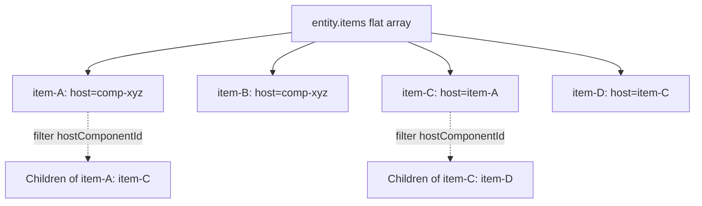
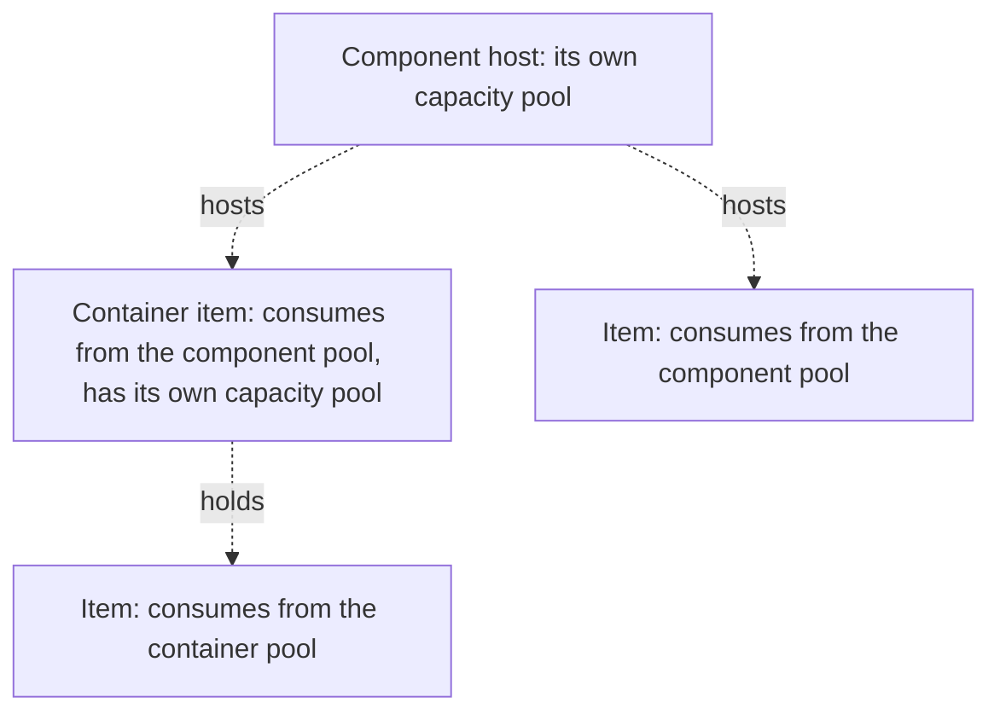

# Nested Inventory Feature — Architecture Design Document

## 1. Executive Summary

This document specifies the design for implementing **nested inventory**: the ability for items to hold other items within them. The design is **generic and flat** — it reuses the existing flat `entity.items` array and the polymorphic `hostComponentId` field, so an item hosted by a component and an item nested inside a container are the same shape of record.

### Key Design Decisions

- **Flat storage**: All items live in the same flat `entity.items` array. No nested arrays.
- **Polymorphic host**: `hostComponentId` references either a component or an item — same field, same logic. Children are discovered by querying the flat array for items whose host is the parent, so no `containedItems` array or recursive data structure is needed.
- **Generic volume validation**: A single validation path serves both component-level and container-level constraints.
- **Client-side tree building**: The client builds the display tree from the flat array by grouping items by their host.
- **Backward compatible**: Existing items whose host is a component behave exactly as before.

---

## 2. Data Model

### 2.1 Item definition

**No schema change.** The existing `volume` field serves both purposes: an item's `volume` is both how much of its host's capacity it consumes and, when the item is a container, how much it can hold. Reusing one field keeps item definitions uniform and avoids a parallel "capacity" concept.

### 2.2 Item instance

**No `containedItems` array.** All items live in the flat `entity.items` array; the `hostComponentId` field indicates the parent (a component for top-level items, a parent item for nested items). Children are discovered by querying the flat array by host — no recursive structure, which keeps the state trivially serializable and broadcastable.

---

## 3. Server-Side Design

The server reuses a **single generic volume-validation path** for both component and container hosts. It resolves a host's max volume (a component's volume from the component data, or a container item's own `volume`), sums the volume of the host's direct children, and rejects an add that would exceed the max. The only difference between a component and a container host is **where the max volume comes from** — which is the core reuse insight of the design.

Container operations (add, remove, move-in, move-out, list) all build on that one validation path plus a flat-array lookup. Removal **cascades to all descendants**, so a removed container can never leave orphaned children behind. Moving a container into its own descendant is **rejected**, which guarantees the host graph stays a forest (no cycles).

---

## 4. Client-Side Design

The client receives the flat item array (host references preserved) and builds a display tree by grouping items by their top-level host and attaching children recursively. Rendering is a single recursive routine that treats a container's children as nested cards, with an expand/collapse toggle per container. A container's capacity bar is driven by the sum of its children's volume against the container's own volume. Drag-and-drop treats a container as a drop target: on drop it moves the item into the container, auto-expands it, and re-renders.

---

## 5. API Surface

The feature adds a small set of container endpoints (add, remove, move-in, move-out, list) under the existing inventory routes. **Route registration order matters:** the parameterized container routes must be matched before the dropped-item routes so they are not shadowed.

---

## 6. CSS

A container-styles section is added to the existing inventory CSS, with **depth-based indentation** so nested items stay visually legible at any depth (indentation is capped at a fixed depth for very deep chains).

---

## 7. Design Rationale

### 7.1 Flat storage model

The core structure: a flat array where each item's `hostComponentId` points either to a component (top-level) or to another item (nested). The children of any host are found by filtering the flat array — no nested arrays.

### 7.2 Dual volume (hierarchy)

An item's single `volume` plays two roles: how much of its host's capacity it consumes, and (if it is a container) how much it can hold. A component has its own capacity pool, and each container has its own capacity pool nested inside it.

---

## 8. Edge Cases

- **8.1 Moving a container that contains items**: The container and all its descendants move together — moving a container only changes its own host reference; its children's host references are unchanged. Only the container's own volume counts against the target's capacity; nested volumes are irrelevant to the move.
- **8.2 Removing a container (cascade)**: When a container is removed, all its descendants are removed too, so no orphaned children remain.
- **8.3 Volume overflow**: Adding an item that would exceed a host's capacity is rejected with a clear error.
- **8.4 Circular references**: Impossible by design — the server validates that a container is not moved into its own descendants, so the host graph stays a forest.
- **8.5 Deep nesting**: No hard server depth limit (the recursion has no cap); the UI caps visual indentation at a fixed depth so very deep chains stay legible.
- **8.6 Dropping an item into its own container**: Prevented both client-side (the drop handler) and server-side (the descendant check).
- **8.7 Equipped items in containers**: Items can be equipped while inside a container; the holding-cost system operates on item types, not location.
- **8.8 Dragging items out of containers**: Dragging a nested item to a component slot moves it out of the container.
- **8.9 Broadcast consistency**: Any host-reference change triggers a full-state broadcast, same as existing item operations.

---

## 9. Implementation Phases

1. Server: generic volume-validation, lookup, and cascade helpers
2. Server: container operations (add / remove / move-in / move-out / list)
3. Facade API wrappers
4. API routes (mind registration order, §5)
5. Client: tree building + rendering
6. Client: drag-and-drop onto containers
7. CSS (depth-based indentation)
8. Testing (all the §8 edge cases)

The order is server-first because the client depends on the server's flat-array contract and the new endpoints; CSS and testing come last because they only need the final behavior to be stable.

---

*End of design document.*
