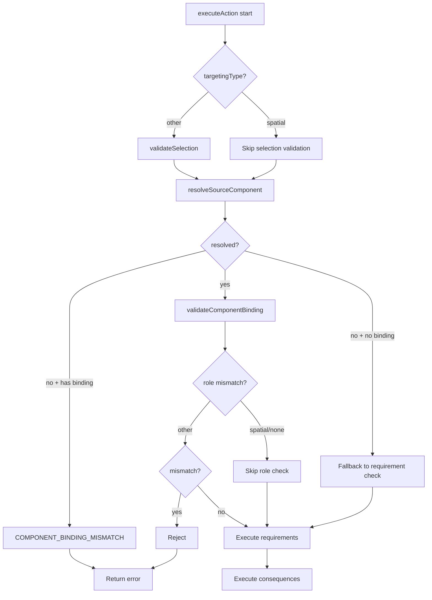

# 🎮 Action System

## 1. Overview

The Action System provides a centralized, extensible mechanism for executing game actions on entities. It handles requirement validation, action execution, and consequence management through a modular registry-based architecture with a dispatcher pattern.

**Key Controllers:**
- `ActionController`: Main coordinator for all actions
- `WorldStateController`: Root injector providing access to all sub-controllers

### 1.1. Action Capability Cache

> **SRP Refactor**: The capability cache logic has been extracted from `ActionController` into a dedicated [`ComponentCapabilityController`](./component_capability_controller.md). The `ActionController` now delegates all capability cache queries to it.

The `ComponentCapabilityController` maintains a **capability cache** that maps each action to an **array of all component capability entries** that qualify for that action. Every component that meets an action's requirements gets its own entry, sorted by score (best first).

**Cache Structure:**
```javascript
_capabilityCache: {
  "pierce": [
    { entityId: "e1", componentId: "knife-comp", componentType: "knife", score: 95, ... },
    { entityId: "e1", componentId: "hand-comp", componentType: "droidHand", score: 30, ... }
  ],
  "move": [
    { entityId: "e1", componentId: "wheel-comp", componentType: "droidRollingBall", score: 100, ... }
  ]
}
```

**Key Methods** (on `ComponentCapabilityController`):
- `scanAllCapabilities(state)` — Full bottom-up scan of all entities/components
- `reEvaluateActionForComponent(state, actionName, componentId)` — Update single entry in array
- `reEvaluateEntityCapabilities(state, entityId)` — Re-scan all components for an entity
- `removeEntityFromCache(entityId)` — Remove all entries for an entity
- `getActionsForEntity(state, entityId)` — Get actions for a specific entity
- `getActionCapabilities(state)` — Get all capabilities
- `getCachedCapabilities()` — Return cached data
- `getBestComponentForAction(actionName)` — Get best entry (highest score) for an action
- `getAllCapabilitiesForAction(actionName)` — Get all entries for an action
- `getCapabilitiesForEntity(entityId)` — Get all entries for an entity
- `on(actionName, callback)` / `off(actionName, callback)` — Event subscription

**See also:** [Action Capability Cache Sub-Wiki](action_capability_cache.md) | [ComponentCapabilityController Sub-Wiki](component_capability_controller.md)

---

## 2. Architecture

### 2.1. Capability Cache Architecture

```
ComponentStatChange → ComponentController → ComponentCapabilityController.onStatChange()
    → _getActionsForTraitStat() → reEvaluateActionForComponent()
    → find entry in array → update/remove → re-sort → _notifySubscribers()

EntitySpawn → stateEntityController.spawnEntity()
    → ComponentCapabilityController.reEvaluateEntityCapabilities()
    → remove all entries for entity → re-scan all components → re-sort → notify

EntityDespawn → stateEntityController.despawnEntity()
    → ComponentCapabilityController.removeEntityFromCache()
    → remove all entries for entity from all actions
```

The capability cache (managed by `ComponentCapabilityController`) uses a **reverse index** (`_traitStatActionIndex`) to efficiently determine which actions depend on a specific trait.stat combination, enabling targeted re-evaluation instead of full rescans.

### 2.2. Dependency Injection Chain

```
Server → WorldStateController
    ├── ComponentCapabilityController (actionRegistry)
    └── ActionController (ConsequenceHandlers, actionRegistry, ComponentCapabilityController)
```

The `ActionController` is fully decoupled from data loading and handler instantiation. It receives the following via constructor injection from the `WorldStateController`:
- `WorldStateController`: Reference to the root controller for accessing sub-controllers.
- `ConsequenceHandlers`: The system responsible for executing action effects.
- `actionRegistry`: The parsed JSON configuration of available actions.
- `ComponentCapabilityController`: The capability cache manager (delegated for all cache queries).
- `SynergyController`: Multi-component synergy bonus computation (optional).
- `ActionSelectController`: Component selection/locking controller (optional).

**Logging:** The system utilizes a centralized `Logger` utility (`src/utils/Logger.js`) for all system events, ensuring standardized severity levels (`INFO`, `WARN`, `ERROR`, `CRITICAL`).

### 2.3. Action Registry Structure

Each action is defined with three main components:

```javascript
{
    "actionName": {
        requirements: [
            {
                trait: "TraitName",
                stat: "statName",
                minValue: 5
            }
        ],
        consequences: [
            {
                type: "consequenceType",
                params: { /* parameters */ }
            }
        ],
        failureConsequences: [
            {
                type: "consequenceType",
                params: { /* parameters */ }
            }
        ]
    }
}
```

---

## 3. Action Requirements

### 3.1. Requirement Structure

Requirements define what an entity must have to perform an action. An action can have multiple requirements, which must all be satisfied.

| Property | Type | Description |
|----------|------|-------------|
| `trait` | string | The trait category (e.g., "Movement") |
| `stat` | string | The specific stat within the trait (e.g., "move") |
| `minValue` | number | The minimum value required (exclusive >) |

### 3.2. Requirement Checking

The `ActionController` checks each entity's components for the required traits and stats. Requirements can be satisfied by **multiple components** — each requirement is independently assigned to the best available component.

**Component Tracking:** When requirements are met, the system identifies and tracks which specific components satisfied each requirement using a `fulfillingComponents` map (e.g., `{"Physical.durability": "component_id"}`). This map is passed to consequence handlers via a `context` object.

To ensure the "most capable" component is prioritized (e.g., avoiding the case where a general-purpose body component takes a penalty for an action performed by a specialized limb), the system uses a **Priority Scoring Mechanism**:
1. **Scoring**: Every component is scored based on how many of the action's total requirements it satisfies.
2. **Prioritization**: Components are sorted by score in descending order.
3. **Assignment**: Requirements are assigned to the highest-scoring compatible component.

This ensures that consequences targeting a trait/stat (like durability loss) are applied to the actual component that drove the action's success, rather than simply the first component found possessing that trait.

**Example:** Move action requires `Movement.move > 5`. Droid dash requires both `Movement.move > 5` AND `Physical.durability > 30`.

---

## 4. Consequences

### 4.1. Success Consequences

When requirements are met, the action executes its success consequences. Consequences are defined as an array of objects with two properties:

| Property | Type | Description |
|----------|------|-------------|
| `type` | string | The consequence type (e.g., "deltaSpatial", "log") |
| `params` | object | Parameters for the consequence, supports placeholder substitution |

**Consequence Types:**
- `deltaSpatial` - Adds delta values to current position (relative movement)
- `log` - Logs a message to console
- `updateStat` - Updates a component stat for all components with the trait
- `updateComponentStatDelta` - Updates a specific stat for a component.
    - If `targetComponentId` is provided, it updates that component.
    - If no target is provided (self-targeting), the system first checks if a specific component fulfilled a requirement for the trait/stat being modified. If so, that component is targeted. Otherwise, it falls back to finding the first component on the entity that possesses the required trait/stat.
    - **Deep Trait-Level Merge**: When updating a stat, the `ComponentStatsController.setStats()` method merges within the trait category, preserving all other stats in the same trait (e.g., updating `Physical.durability` does not erase `Physical.mass`, `Physical.strength`, etc.). See `wiki/subMDs/traits.md` Section 5 for details.
- `triggerEvent` - Triggers a server event
- `damageComponent` - Deals damage to a specific target component

**Attacker vs. Target Component Resolution:**
For actions that involve both an attacker and a target (e.g., punch/attack actions), the system uses two distinct component IDs:

| Parameter | Purpose |
|-----------|---------|
| `attackerComponentId` | The component performing the action. Its stats are used for **requirement value resolution** (e.g., determining damage based on `Physical.strength`). |
| `targetComponentId` | The component being affected. Its stats are used for **consequence application** (e.g., reducing durability). |

**Priority order for requirement value resolution in `executeAction()`:**
1. `attackerComponentId` (if provided) - Used for actions like punch where the attacker's stats determine the outcome
2. `targetComponentId` (if provided) - Legacy behavior, used for single-component actions
3. Entity-wide check - Falls back to entity-wide requirement checking

**Example - Punch Action:**
```javascript
// Client sends:
{
    actionName: "droid punch",
    entityId: "attacker-entity-uuid",
    params: {
        attackerComponentId: "droidHand-uuid",   // Determines damage (= 25 strength)
        targetComponentId: "enemy-centralBall"    // Receives damage
    }
}

// The consequence "-:Physical.strength" resolves to -25 (from attacker),
// not -10 (from target's global defaults).
```

**Multi-Attacker Punch (Multiple Source Components):**
When multiple components with `role: 'source'` are provided via `params.componentIds`, the `_executeMultiAttackerConsequences()` method processes each attacker separately:

1. Client sends `params.componentIds = [{componentId, role: 'source'}, ...]` with `params.targetComponentId`
2. `attackerComponentIds` is built by filtering `componentIds` for `role === 'source'` **only** (target components are excluded)
3. Each attacker's `Physical.strength` is used to calculate individual damage
4. Damage is applied to `targetComponentId` for each attacker independently
5. Synergy multiplier is applied to each attacker's damage

🐛 For fix details, see [BUG-001](../../bugfixWiki/critical/BUG-001-multi-attacker-punch-target-role.md) and [BUG-002](../../bugfixWiki/critical/BUG-002-malformed-consequence-error.md).

**Placeholder Substitution:**
- `:trait.stat` - Replaced with the actual value of the specified trait and stat (e.g., `:Movement.move`).
- **Arithmetic**: Supports signs and multipliers (e.g., `"-:Movement.move*2"`).
- **Embedded Support**: Placeholders can be embedded within strings (e.g., `"Power is :Physical.strength"`) and will be automatically resolved. The system first attempts an exact match for numeric return, then falls back to template string replacement for embedded placeholders.

**Example:** Move using deltaSpatial for relative movement:
```javascript
consequences: [
    {
        type: "deltaSpatial",
        params: { speed: ":Movement.move" }  // Moves relative to current position
    }
]
```

### 4.2. Failure Consequences (failureConsequences)

When requirements fail, the failure consequences are executed using the same dispatcher pattern:

```javascript
failureConsequences: [
    {
        type: "log",
        level: "warn",
        message: "Action failed - requirement not met"
    }
]
```

**Common Failure Consequence Types:**
- `log` - Log the failure with specified level (info, warn, error)
- `triggerEvent` - Notify clients of failure

---

## 5. Controller Methods

### 5.1. ActionController — Action Execution Methods

The `ActionController` is responsible for **executing game actions**: validating requirements, resolving components, and running consequences.

#### 5.1.1. ActionController.executeAction()

Executes an action on an entity with component selection validation and binding enforcement.

**Component Binding Resolution Priority:**
1. `attackerComponentId` from params → punch actions
2. `targetComponentId` from params → spatial/self_target actions with explicit selection
3. `targetingType: 'spatial'` → auto-find Movement component
4. `targetingType: 'none'` or `'self_target'` → auto-find Physical self-target component
5. Fallback → entity-wide requirement check

**Self-Targeting Actions (selfHeal):**
Actions with `targetingType: 'self_target'` execute instantly on the client when a component is selected. The client sends `targetComponentId` in params, and the server resolves it via Priority 2 (explicit targetComponentId).

```javascript
/**
 * @param {string} actionName - The name of the action to execute.
 * @param {string} entityId - The ID of the entity to perform the action.
 * @param {Object} [params] - Additional action parameters.
 * @param {string} [params.attackerComponentId] - The component performing the action.
 * @param {string} [params.targetComponentId] - The component being targeted.
 * @param {string} [params.selectedBindingRole] - The role of the selected component.
 * @returns {Object} Result of the action execution.
 */
```

**Execution Flow:**



**Component Selection Validation:**
- **Spatial actions** (`move`, `dash`): Skip pre-locking validation because they auto-resolve components via `_resolveSourceComponent()`
- **Non-spatial actions**: Validate component selection via `ActionSelectController.validateSelection()`

**Component Lock Tracking & Release:**
All actions track their component locks in `componentsToRelease` array, which is released in the `finally` block via `ActionSelectController.releaseSelections()`.

- **Non-spatial actions**: Components are tracked during validation (line 286-289)
- **Spatial actions**: Components are explicitly tracked after `_resolveSourceComponent()` (lines 301-317):
  - Multi-component spatial: Each component from `componentList` is added
  - Single-component spatial: The resolved `resolvedSourceComponentId` is added
- **Self-targeting actions** (`selfHeal`): Components from `targetComponentId` are tracked during validation

🐛 For fix details, see [BUG-003](../../bugfixWiki/critical/BUG-003-spatial-action-lock-leak.md) and [BUG-004](../../bugfixWiki/high/BUG-004-role-mismatch-skip.md).

**Component Binding Enforcement:**
- If `componentBinding` is defined but no component resolves → return `COMPONENT_BINDING_MISMATCH`
- If `componentBinding` is NOT defined → fall through to requirement checking (triggers failure consequences)

**Role Mismatch Skip:**
Role validation is skipped for `spatial` and `none` targetingType actions because:
- **Spatial actions**: Client sends `'spatial'` role, but server resolves to `'source'`
- **None actions**: Client sends `'source'` role, but server resolves to `'self_target'`
- In both cases, client/server role resolution differs, so requirement checking is used instead.

**Returns (Success):**
```javascript
{
    success: true,
    action: "move",
    entityId: "uuid-123",
    executedConsequences: 1,
    results: [
        {
            success: true,
            type: "deltaSpatial",
            message: "Entity moved",
            data: { deltaUpdate: { x: 0, y: -20 }, newSpatial: { x: 0, y: -20 } }
        }
    ]
}
```

**Returns (Failure):**
```javascript
{
    "success": false,
    "error": "Requirement failed: No component possesses the required Movement.move (>= 5)",
    "executedFailureConsequences": 1,
    "results": [
        {
            "success": true,
            "type": "log",
            "message": "Logged: Action 'move' failed - requirement not met",
            "level": "warn"
        }
    ]
}
```

#### 5.1.2. ActionController._executeConsequences()

Executes success consequences by reading from the action registry and dispatching to the injected `ConsequenceHandlers`.

**Target ID Resolution by Consequence Type:**
Different consequence types operate on different scopes. The `_executeConsequences` method resolves the correct `targetId` based on the consequence type:

| Consequence Type | Target ID Used |
|------------------|----------------|
| `updateSpatial`, `deltaSpatial` | `entityId` — spatial operations always target the entity |
| `updateComponentStatDelta`, `damageComponent`, `updateStat`, `log`, `triggerEvent` | `targetComponentId` (from `params`) or `entityId` as fallback |

This ensures that spatial actions (like `move`, `dash`) correctly operate on the entity even when `targetComponentId` is present in the action params (e.g., when the user selected a specific component for multi-component entities).

```javascript
/**
 * @param {string} actionName - The name of the action.
 * @param {string} entityId - The ID of the entity.
 * @param {Object} requirementValues - Map of trait.stat values for substitution.
 * @param {Object} params - Additional action parameters.
 * @returns {Object} Result of consequence execution.
 */
```

#### 5.1.3. ActionController._executeFailureConsequences()

Executes failure consequences using the same dispatcher pattern.

```javascript
/**
 * @param {string} actionName - The action name.
 * @param {string} entityId - The entity ID.
 * @returns {Object} Result of failure consequence execution.
 */
```

#### 5.1.4. ActionController.getActionCapabilities()

Calculates which entities are capable of executing which actions based on the current world state.
Delegates to `ComponentCapabilityController` for cache data.

```javascript
/**
 * @param {Object} state - The current world state.
 * @returns {Object} Map of actions and their capability status.
 * Each action entry has: { ...actionData, canExecute: [all entries], cannotExecute: [...] }
 */
```

#### 5.1.5. ActionController.getActionsForEntity()

Retrieves only the actions that are relevant to a specific entity. Filters the cache by entityId to show only this entity's component capabilities.

```javascript
/**
 * @param {Object} state - The current world state.
 * @param {string} entityId - The ID of the entity to filter for.
 * @returns {Object} Map of actions and their capability status for the entity.
 * Each action has: { ...actionData, canExecute: [entries], cannotExecute: [...] }
 */
```

#### 5.1.6. ConsequenceHandlers.handlers

Instead of an internal dispatcher, the `ActionController` uses a strategy map provided by the `ConsequenceHandlers` class. This allows handlers to be updated or replaced without modifying the `ActionController` logic.

---

### 5.2. ComponentCapabilityController — Capability Cache Methods

The `ComponentCapabilityController` is responsible for **managing the capability cache** that maps each action to an array of all qualifying component capability entries. The `ActionController` delegates all capability cache queries to this controller.

#### 5.2.1. ComponentCapabilityController.scanAllCapabilities(state)

Performs a full bottom-up scan of all entities and their components against all registered actions.
Updates the capability cache with ALL qualifying component entries (not just the best one).

```javascript
/**
 * @param {Object} state - The current world state (contains entities).
 * @returns {Object<string, Array<ComponentCapabilityEntry>>} The updated capability cache.
 */
```

#### 5.2.2. ComponentCapabilityController.reEvaluateActionForComponent(state, actionName, componentId)

Re-evaluates a specific action for a specific component. Finds the entry in the action's array and updates or removes it. Called when a component stat changes.

```javascript
/**
 * @param {Object} state - The current world state.
 * @param {string} actionName - The action to re-evaluate.
 * @param {string} componentId - The component whose stats changed.
 * @returns {ComponentCapabilityEntry|null} The updated capability entry, or null.
 */
```

#### 5.2.3. ComponentCapabilityController.reEvaluateAllActionsForComponent(state, componentId)

Re-evaluates all actions that depend on a specific component's traits.
Uses the reverse index for efficient lookup.

```javascript
/**
 * @param {Object} state - The current world state.
 * @param {string} componentId - The component whose stats changed.
 * @returns {Array<ComponentCapabilityEntry>} List of updated capability entries.
 */
```

#### 5.2.4. ComponentCapabilityController.reEvaluateEntityCapabilities(state, entityId)

Re-evaluates ALL actions for a specific entity. Removes all entries for this entity from all actions, then re-scans all components against all actions. Called when an entity's component set changes (e.g., picks up/drops an item, spawns).

```javascript
/**
 * @param {Object} state - The current world state.
 * @param {string} entityId - The entity to re-evaluate.
 * @returns {Array<ComponentCapabilityEntry>} List of updated capability entries.
 */
```

#### 5.2.5. ComponentCapabilityController.removeEntityFromCache(entityId)

Removes all capability entries for an entity from all action arrays. Called when an entity is despawned.

```javascript
/**
 * @param {string} entityId - The entity ID to remove.
 */
```

#### 5.2.6. ComponentCapabilityController.getCachedCapabilities()

Returns the cached capability entries for all actions without recomputation.

```javascript
/**
 * @returns {Object<string, Array<ComponentCapabilityEntry>>} The capability cache.
 */
```

#### 5.2.7. ComponentCapabilityController.getBestComponentForAction(actionName)

Returns the best entry for a specific action (highest score, first in array).

```javascript
/**
 * @param {string} actionName - The action name.
 * @returns {ComponentCapabilityEntry|null} The best capability entry, or null.
 */
```

#### 5.2.8. ComponentCapabilityController.getAllCapabilitiesForAction(actionName)

Returns all capability entries for a specific action (sorted by score).

```javascript
/**
 * @param {string} actionName - The action name.
 * @returns {Array<ComponentCapabilityEntry>} Array of capability entries.
 */
```

#### 5.2.9. ComponentCapabilityController.getCapabilitiesForEntity(entityId)

Returns capability entries for a specific entity across all actions. Filters the cache by entityId.

```javascript
/**
 * @param {string} entityId - The entity ID.
 * @returns {Array<ComponentCapabilityEntry>} Array of capability entries for this entity.
 */
```

#### 5.2.10. ComponentCapabilityController.onStatChange(componentId, traitId, statName, newValue, oldValue)

Called when a component stat changes. Re-evaluates all dependent actions.
Registered as a stat change listener on ComponentController.

```javascript
/**
 * @param {string} componentId - The component instance ID that changed.
 * @param {string} traitId - The trait category that changed.
 * @param {string} statName - The stat name that changed.
 * @param {any} newValue - The new stat value.
 * @param {any} oldValue - The previous stat value.
 */
```

#### 5.2.11. ComponentCapabilityController.on(actionName, callback) / off(actionName, callback)

Subscribe/unsubscribe to capability change events for a specific action.

```javascript
/**
 * @param {string} actionName - The action name to subscribe to.
 * @param {Function} callback - Called with (actionName, capabilityEntry).
 */
```

---

### 5.3. stateEntityController — Spatial Update Method

#### 5.3.1. stateEntityController.updateEntitySpatial()

Updates an entity's spatial coordinates.

```javascript
/**
 * @param {string} entityId - The ID of the entity.
 * @param {Object} spatialUpdate - Object with x and/or y values to update.
 * @returns {boolean} True if update was successful.
 */
```

**Usage:**
```javascript
worldStateController.stateEntityController.updateEntitySpatial(
    entityId,
    { y: newYValue }
);
```

---

## 6. Built-in Consequence Handlers

### 6.1. deltaSpatial

Adds delta values to current spatial position for relative movement.

**Parameters:**
| Property | Type | Description |
|----------|------|-------------|
| `speed` | number | Optional. Speed/distance to move towards target |
| `x` | number | Optional. Delta x to add to current position |
| `y` | number | Optional. Delta y to add to current position |

**Example:**
```javascript
{ type: "deltaSpatial", params: { speed: ":Movement.move" } }  // Move by trait value
```

**Note:** This handler is used for actions like `move` where the movement should be relative to the current position, not an absolute coordinate. When `targetX` and `targetY` are provided in `actionParams`, the handler calculates the direction and moves the entity towards the target by `speed` distance.

### 6.2. log

Logs a message to console with optional level.

**Parameters:**
| Property | Type | Description |
|----------|------|-------------|
| `message` | string | The message to log |
| `level` | string | Optional. Log level: "info", "warn", "error". Default: "info" |

**Example:**
```javascript
{ type: "log", level: "warn", message: "Action failed" }
```

### 6.3. updateStat

Updates a specific stat for an entity's component.

**Parameters**
| Property | Type | Description |
|----------|------|-------------|
| `trait` | string | The trait category (e.g., "Physical") |
| `stat` | string | The stat name to update |
| `value` | number | The new value |

**Example:**
```javascript
{ type: "updateStat", trait: "Physical", stat: "durability", value: 50 }
```

### 6.4. damageComponent

Deals damage to a specific component of a target entity.

**Parameters**
| Property | Type | Description |
|----------|------|-------------|
| `trait` | string | The trait to modify (e.g., "Physical") |
| `stat` | string | The stat to reduce (e.g., "durability") |
| `value` | number | The delta value (usually negative) |

**Note:** This handler requires `targetComponentId` to be passed in the `actionParams` from the client.

**Example:**
```javascript
{ type: "damageComponent", params: { trait: "Physical", stat: "durability", value: -25 } }
```

### 6.5. updateComponentStatDelta

Updates a specific stat for the component that triggered the action (the "calling component"). This is used for costs associated with specific equipment (e.g., durability loss on legs during a dash).

**Component Resolution Priority:**
1. **Explicit `targetComponentId`** from `actionParams` — Used for targeted actions like damage (e.g., punching an enemy's component)
2. **Fulfilling component** from `context.fulfillingComponents` — The component that satisfied the specific `trait.stat` requirement (e.g., the component with `Physical.durability` for self-heal)
3. **Fallback to entity-wide update** — If no component can be resolved, the handler falls back to `_handleUpdateStat` for entity-wide updates

**⚠️ Important:** Unlike previous behavior, this handler no longer falls back to "first component with the trait." If you need entity-wide stat updates, use the `updateStat` consequence type instead.

**Parameters:**
| Property | Type | Description |
|----------|------|-------------|
| `trait` | string | The trait category (e.g., "Physical") |
| `stat` | string | The stat name to modify |
| `value` | number | The delta value to add (use negative for reduction) |

**Deep Trait-Level Merge**: The underlying `ComponentStatsController.setStats()` method performs a deep trait-level merge, ensuring that updating one stat does not erase other stats in the same trait category. For example, updating `Physical.durability` via dash will not erase `Physical.mass`, `Physical.strength`, etc. See `wiki/subMDs/traits.md` Section 5 for details.

**Example:**
```javascript
{ type: "updateComponentStatDelta", params: { trait: "Physical", stat: "durability", value: -5 } }
```

### 6.6. triggerEvent

Triggers a server event for client notifications.

**Parameters:**
| Property | Type | Description |
|----------|------|-------------|
| `eventType` | string | The event type name |
| `data` | object | Optional. Additional data to send |

**Example:**
```javascript
{ type: "triggerEvent", eventType: "action_complete", data: { action: "move" } }
```

### 6.7. grabItem

Grabs an item entity and adds it as a component to the main entity. The item's traits become available for action requirement checking.

**Parameters:**
| Property | Type | Description |
|----------|------|-------------|
| `debuff.trait` | string | The trait category for the strength debuff (e.g., "Physical") |
| `debuff.stat` | string | The stat to reduce (e.g., "strength") |
| `debuff.value` | number | The delta value (negative, e.g., -5) |

**Context Parameters:**
- `context.actionParams.entityId` — Main entity receiving the item
- `context.actionParams.targetEntityId` — Item entity being grabbed
- `context.actionParams.attackerComponentId` — Hand component that grabs the item

**Example:**
```javascript
{
  type: "grabItem",
  params: {
    debuff: { trait: "Physical", stat: "strength", value: -5 }
  }
}
```

📖 See [Equipment System Wiki](./equipment_system.md) for full details.

### 6.8. releaseItem

Releases a grabbed item: removes the item component from the entity and restores the hand's strength.

**Parameters:**
| Property | Type | Description |
|----------|------|-------------|
| (none required) | — | — |

**Context Parameters:**
- `context.actionParams.entityId` — Main entity that was holding the item

**Example:**
```javascript
{
  type: "releaseItem",
  params: {}
}
```

📖 See [Equipment System Wiki](./equipment_system.md) for full details.

### 6.9. grabToBackpack

Grabs an item entity and stores it in the entity's backpack. The item's traits become available for action requirement checking. The backpack's `Physical.volume` determines total storage capacity.

**Parameters:**
| Property | Type | Description |
|----------|------|-------------|
| (none required) | — | — |

**Context Parameters:**
- `context.actionParams.entityId` — Main entity receiving the item
- `context.actionParams.targetEntityId` — Item entity being grabbed
- `context.actionParams.targetComponentId` — Backpack component ID

**Example:**
```javascript
{
  type: "grabToBackpack",
  params: {}
}
```

📖 See [Equipment System Wiki](./equipment_system.md) for full details.

### 6.10. dropAll

Drops all grabbed items (hand grabs + backpack items) into the world. Items are respawned at the entity's position.

**Parameters:**
| Property | Type | Description |
|----------|------|-------------|
| (none required) | — | — |

**Context Parameters:**
- `context.actionParams.entityId` — Main entity that was holding the items

**Example:**
```javascript
{
  type: "dropAll",
  params: {}
}
```

📖 See [Equipment System Wiki](./equipment_system.md) for full details.

---

## 7. Adding New Actions

### 7.1. Register a New Action

Add to `data/actions.json`:

```json
"attack": {
    "requirements": [
        {
            "trait": "Physical",
            "stat": "strength",
            "minValue": 10
        }
    ],
    "consequences": [
        {
            "type": "log",
            "level": "info",
            "message": "Entity attacked with strength :Physical.strength"
        }
    ],
    "failureConsequences": [
        {
            "type": "log",
            "level": "warn",
            "message": "Attack failed - strength too low"
        }
    ]
}
```

### 7.2. Adding New Consequence Types

To add a new consequence type:

1. Add a new handler method in `ConsequenceHandlers` class
2. Add the handler to the `handlers` getter in `ConsequenceHandlers`

```javascript
get handlers() {
    return {
        // ... existing handlers
        newType: (targetId, params, context) => this._handleNewType(targetId, params, context)
    };
}
```

---

## 8. Best Practices

### 8.1. Dependency Injection

Always inject `WorldStateController` into `ActionController`. Never create new controller instances inside `ActionController`.

### 8.2. Single Source of Truth

Use injected controllers to access and modify state. Do not cache state in the action controller.

### 8.3. Data-Driven Design

Keep actions in the registry pattern. Each action should be self-contained with clear requirements and consequences.

### 8.4. Extensibility

Use the dispatcher pattern for new consequence types. Keep handlers focused on single responsibilities.

### 8.5. Error Handling

Always validate inputs and return descriptive error messages when actions fail.

### 8.6. Placeholder Naming

Use the `:trait.stat` syntax (e.g., `:Movement.move`) to reference specific requirement values. Combine with arithmetic for calculations:
- `":trait.stat"` - Positive value
- `" -:trait.stat"` - Negative value
- `":trait.stat*2"` - Multiplied value

Placeholders can be used as the **entire value** (returns a number) or **embedded within strings** (performs template string replacement).

---

## 9. Entity Lifecycle and Cache Updates

### 9.1. Entity Spawn

When a new entity spawns, its capabilities are automatically evaluated:

```javascript
// In stateEntityController.spawnEntity():
const entityId = generateUID();
// ... create entity ...
if (this.actionController) {
    const state = this.actionController.worldStateController.getAll();
    this.actionController.reEvaluateEntityCapabilities(state, entityId);
}
```

### 9.2. Entity Despawn

When an entity is removed, its capabilities are cleaned up:

```javascript
// In stateEntityController.despawnEntity():
if (this.actionController) {
    this.actionController.removeEntityFromCache(entityId);
}
delete this.entities[entityId];
```

### 9.3. Component Addition/Removal

When an entity picks up or drops an item (component set changes):

```javascript
// Via API: POST /refresh-entity-capabilities
// Body: { "entityId": "entity-uuid" }
const state = worldStateController.getAll();
const updatedEntries = worldStateController.actionController.reEvaluateEntityCapabilities(state, entityId);
```

---

## 10. HTTP API

### 10.1. POST /execute-action

Executes an action on an entity.

**Request:**
```json
{
    "actionName": "move",
    "entityId": "uuid-entity-123",
    "params": { "targetX": 50, "targetY": -30 }
}
```

**Success Response:**
```json
{
    "result": {
        "success": true,
        "action": "move",
        "entityId": "uuid-entity-123",
        "executedConsequences": 1,
        "results": [
            {
                "success": true,
                "type": "deltaSpatial",
                "message": "Entity moved",
                "data": { "deltaUpdate": { "x": 10, "y": -20 }, "newSpatial": { "x": 10, "y": -20 } }
            }
        ]
    }
}
```

**Failure Response (Requirements not met):**
```json
{
    "result": {
        "success": false,
        "error": "Requirement failed: No component possesses the required Movement.move (>= 5)",
        "executedFailureConsequences": 1,
        "results": [
            {
                "success": true,
                "type": "log",
                "message": "Logged: Action 'move' failed - requirement not met",
                "level": "warn"
            }
        ]
    }
}
```

### 10.2. POST /refresh-entity-capabilities

Re-evaluates all action capabilities for a specific entity.

**Request:**
```json
{ "entityId": "entity-uuid-1" }
```

**Response:**
```json
{
    "entityId": "entity-uuid-1",
    "updatedEntries": [
        { "componentId": "knife-comp", "score": 95, ... },
        { "componentId": "hand-comp", "score": 30, ... }
    ]
}
```

---

## 11. Placeholder Substitution Logic

### 11.1. Implementation
The `_resolvePlaceholders` method uses a regular expression to identify and resolve `:trait.stat` markers within strings. This ensures that the resulting value is a **number**, preventing string concatenation bugs during spatial calculations.

**Current Logic:**
```javascript
const match = params.match(/^(-)?(:[a-zA-Z0-9_]+\.[a-zA-Z0-9_]+)(?:\*(-?\d+))?$/);
if (match) {
    const sign = match[1] === '-' ? -1 : 1;
    const placeholder = match[2].substring(1);
    const multiplier = match[3] ? parseInt(match[3], 10) : 1;
    const value = requirementValues[placeholder];
    if (value !== undefined) {
        return sign * value * multiplier;
    }
}
```

### 11.2. Supported Patterns
The system supports signs and multipliers, allowing for flexible action definitions:

| Pattern | Description | Example (Movement.move=20) | Result |
|---------|-------------|---------------------------|--------|
| `:trait.stat` | Base value | `":Movement.move"` | `20` |
| `-:trait.stat` | Negative value | `"-:Movement.move"` | `-20` |
| `:trait.stat*2` | Multiplied value | `":Movement.move*2"` | `40` |
| `-:trait.stat*2` | Negative multiplied | `"-:Movement.move*2"` | `-40` |

### 11.3. Integration
These resolved values are passed directly to consequence handlers (like `deltaSpatial`), ensuring correct mathematical operations on the entity's state.

---

## 12. Current Implementation Status

| Action | Requirements | Success Consequences | Failure Consequences |
|--------|-------------|---------------------|---------------------|
| move | ✅ Implemented | ✅ Implemented | ✅ Implemented |
| dash | ✅ Implemented | ✅ Implemented | ✅ Implemented |
| selfHeal | ✅ Implemented | ✅ Implemented | ✅ Implemented |
| droid punch | ✅ Implemented | ✅ Implemented | ✅ Implemented |
| **grab** | ✅ Implemented | ✅ Implemented | ✅ Implemented |
| **release** | ✅ Implemented | ✅ Implemented | ✅ Implemented |
| **grabToBackpack** | ✅ Implemented | ✅ Implemented | ✅ Implemented |
| **dropAll** | ✅ Implemented | ✅ Implemented | ✅ Implemented |
| **cut** | ✅ Implemented | ✅ Implemented | ✅ Implemented |

**New Consequence Handlers:**
| Handler | Purpose | Status |
|---------|---------|--------|
| `grabItem` | Add item as component to entity (hand grab) | ✅ Implemented |
| `releaseItem` | Remove item from entity, restore strength | ✅ Implemented |
| `grabToBackpack` | Add item to backpack (volume-checked) | ✅ Implemented |
| `dropAll` | Release ALL items (hand + backpack) | ✅ Implemented |

**New Actions:**
| Action | Requirements | Consequences |
|--------|-------------|--------------|
| `cut` | `Physical.sharpness ≥ 20` on source component | `damageComponent` (target), `updateComponentStatDelta` (knife dulls), `log` |

**New Controllers:**
| Controller | Purpose | Status |
|------------|---------|--------|
| `EquipmentController` | Manage grab/release, track held items | ✅ Implemented |

**New StateEntityController Methods:**
| Method | Purpose | Status |
|--------|---------|--------|
| `addComponentToEntity()` | Add item component to entity | ✅ Implemented |
| `removeComponentFromEntity()` | Remove item component from entity | ✅ Implemented |

📖 See [Equipment System Wiki](./equipment_system.md) for full details.

---

### 📢 Notice for Future Agents

**Language Requirement:** All source code in this project must be written in **JavaScript**.

**Controller Pattern:** The `ActionController` follows the Dependency Injection pattern and should never instantiate its own controllers.

**Consequence Dispatcher:** All consequences are handled through the `ConsequenceHandlers` class. To add a new consequence type:
1. Add a handler method `_handle<Type>()` in `ConsequenceHandlers`
2. Register it in the `handlers` getter
3. Document it in this wiki

**Capability Cache:** The cache maps each action to an **array of all qualifying component entries** (not just the best one). See [Action Capability Cache Sub-Wiki](action_capability_cache.md) for details.
