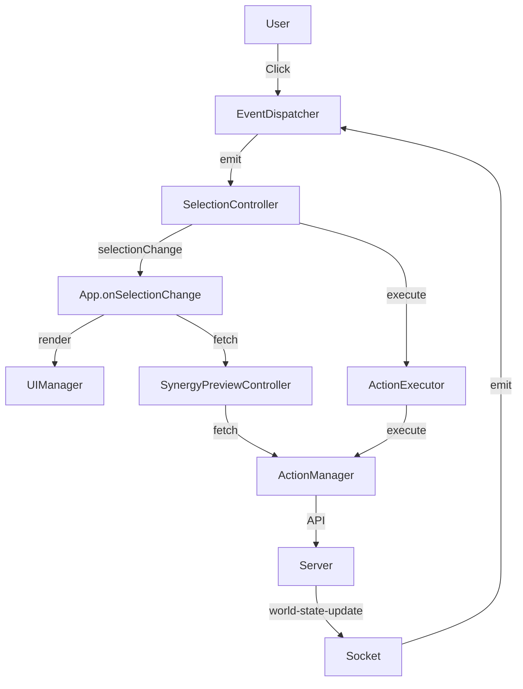

# Client-Side Architecture

This document describes the client-side module architecture after the `App.js` refactoring.

## Overview

The original `public/js/App.js` (778 lines) was a monolithic orchestrator violating the **Single Responsibility Principle (SRP)**. It managed:
- Component selection state
- Synergy preview + range calculation
- Action execution handlers
- Socket + DOM event listeners
- App lifecycle

After refactoring, the client-side architecture follows the **Dependency Injection (DI)** pattern with 4 extracted single-responsibility modules:

```
public/js/
├── App.js                          → Core orchestrator (~230 lines, down from 778)
├── SelectionController.js          → Component selection state management (~220 lines)
├── SynergyPreviewController.js     → Synergy preview + range calculation (~237 lines)
├── ActionExecutor.js               → All action execution handlers (~346 lines)
└── EventDispatcher.js              → Socket + DOM event listener management (~220 lines)
```

## Module Responsibilities

### 1. `SelectionController.js`
**Responsibility:** Component selection state, cross-action selections, action list rendering coordination.

**State Variables:**
- `activeActionName` (string|null) - The action currently being selected into
- `selectedComponentIds` (Set<string>) - Component IDs selected for the active action
- `crossActionSelections` (Map<string, Set<string>>) - Maps actionName → Set of component IDs

**Public API:**
| Method | Returns | Description |
|--------|---------|-------------|
| `getActiveActionName()` | `string|null` | Returns current active action name |
| `getSelectedComponentIds()` | `Set<string>` | Returns the Set of selected component IDs |
| `getSelectedComponentIdsArray()` | `string[]` | Returns selected IDs as an array |
| `toggleComponent(actionName, entityId, componentId, componentIdentifier)` | `Promise<void>` | Toggle component selection |
| `removeGrayedComponent(lockedActionName, componentId)` | `void` | Remove from cross-action selection |
| `clearAllSelections()` | `void` | Clear all selection state |
| `buildCrossMap()` | `Map<string, Set<string>>` | Build cross-action selections map for UI |
| `getSelectionState()` | `SelectionState` | Returns full state for serialization |
| `setSelectionState(state)` | `void` | Restores state from serialization |

**Events/Callbacks:**
- Calls `app.onSelectionChange()` after any selection change (triggers UI re-render + synergy preview)

### 2. `SynergyPreviewController.js`
**Responsibility:** Synergy preview fetching, caching, and range calculation with synergy multiplier.

**State Variables:**
- `currentSynergyResult` (Object|null) - Cached synergy preview result

**Public API:**
| Method | Returns | Description |
|--------|---------|-------------|
| `fetchPreview(actionName, entityId, componentIds)` | `Promise<Object|null>` | Fetch live preview from server |
| `calculateRange(actionName, droid, state, synergyMultiplier)` | `number|null` | Calculate effective action range |
| `getCachedSynergyResult()` | `Object|null` | Returns current cached synergy result |
| `setSynergyResult(result)` | `void` | Stores synergy result to cache |
| `clearCache()` | `void` | Clears cached preview data |

**Display Modes:**
- **1 component:** Shows action data (range, consequences, requirements)
- **2+ components:** Shows synergy with modified values (before → after + bonus%)

### 3. `ActionExecutor.js`
**Responsibility:** All action execution handlers with distinct logic patterns.

**Public API:**
| Method | Parameters | Description |
|--------|-----------|-------------|
| `executeSelfTarget(actionName, entityId, componentId, componentIdentifier)` | `string, string, string, string` | Instant self-target action |
| `executeMultiComponentSpatial(actionName, entityId, componentIds, extraParams)` | `string, string, string[], Object` | Batch select + execute |
| `executeGrab(pending, targetX, targetY)` | `Object, number, number` | Distance check + grab closest entity |
| `executeGrabToBackpack(pending, targetX, targetY)` | `Object, number, number` | Distance check + backpack grab |
| `executePunch(pending, targetX, targetY, selectedComponentIds)` | `Object, number, number, Set<string>` | Distance check + multi-attacker punch |
| `executeMoveDroid(entityId, targetRoomId)` | `string, string` | HTTP POST to move entity |

### 4. `EventDispatcher.js`
**Responsibility:** Socket.io and DOM event listener management. Delegates all business logic to injected handler callbacks.

**Public API:**
| Method | Parameters | Description |
|--------|-----------|-------------|
| `setupSocketListeners()` | — | Sets up 'incarnate', 'world-state-update', 'error' |
| `setupMapClickListener(mapElement, getPendingAction, extraHandlers)` | `SVGElement, Function, Object` | SVG map click with coordinate transformation |
| `setupReleaseHandler(detailOverlayElement, releaseCallback)` | `HTMLElement|null, Function` | Custom event listener for item release |
| `destroy()` | — | Removes all listeners (cleanup) |

### 5. `App.js` (Minimal Orchestrator)
**Responsibility:** Lifecycle management, module wiring, data flow coordination.

**Constructor Wiring Order:**
1. Instantiate core modules: `worldState`, `ui`, `errorController`, `actions`
2. Instantiate `SelectionController`
3. Instantiate `SynergyPreviewController`
4. Instantiate `ActionExecutor` with refresh callback
5. Create socket.io connection (`io()`)
6. Instantiate `EventDispatcher` with handler callbacks
7. Wire selection → synergy → executor callbacks
8. Store `this` reference for cross-module callbacks

**Public API (backward-compatible delegates):**
| Method | Returns | Description |
|--------|---------|-------------|
| `init()` | `Promise<void>` | Boot sequence |
| `refreshWorldAndActions()` | `Promise<void>` | Full state refresh |
| `getActiveDroid()` | `Object|null` | Delegate to worldState |
| `getState()` | `Object` | Delegate to worldState |
| `getMyEntityId()` | `string|null` | Delegate to worldState |

## Data Flow After Refactoring



## Dependency Injection Compliance

All extracted modules follow the **Dependency Injection (DI)** pattern defined in `wiki/subMDs/controller_patterns.md`:

| Module | Dependencies (Injected) |
|--------|------------------------|
| `SelectionController` | `worldState`, `ui`, `actions`, `synergyController`, `app` |
| `SynergyPreviewController` | `actions`, `config` |
| `ActionExecutor` | `worldState`, `actions`, `ui`, `errorController`, `refreshCallback` |
| `EventDispatcher` | `socket`, `config`, `handlers` |

**No module instantiates its dependencies internally.** All dependencies are passed via the constructor.

## Logger Standard

All modules use the centralized `Logger` utility (`src/utils/Logger.js`) for structured logging:
```javascript
import { Logger } from '../utils/Logger.js';
Logger.info('[ModuleName] Message', { context: 'data' });
Logger.warn('[ModuleName] Message', { context: 'data' });
Logger.error('[ModuleName] Message', { context: 'data' });
```

## Related Documentation

- [Client Action Execution](client_action_execution.md)
- [Client UI](client_ui.md)
- [Server-Client Architecture](server_client_architecture.md)
- [Controller Patterns](controller_patterns.md)

## Recent Changes

| Date | Change | Related Files |
|------|--------|---------------|
| 2026-05-02 | **Refactor:** Split `App.js` into 4 single-responsibility modules | `App.js`, `SelectionController.js`, `SynergyPreviewController.js`, `ActionExecutor.js`, `EventDispatcher.js` |