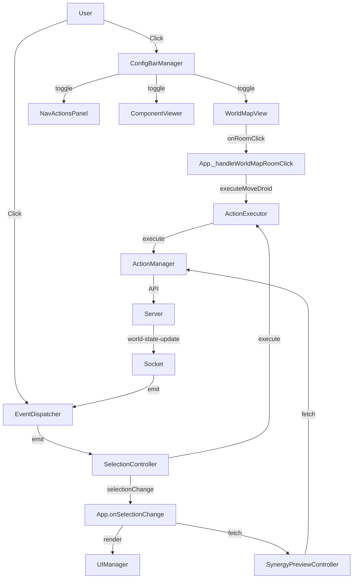

# Client-Side Architecture

This document describes the client-side module architecture after the `App.js` refactoring.

## Overview

The original `public/js/App.js` (778 lines) was a monolithic orchestrator violating the **Single Responsibility Principle (SRP)**. It managed:
- Component selection state
- Synergy preview + range calculation
- Action execution handlers
- Socket + DOM event listeners
- App lifecycle

After refactoring, the client-side architecture follows the **Dependency Injection (DI)** pattern with 4 extracted single-responsibility modules, plus 3 additional modules for spatial visualization:

```
public/js/
├── App.js                          → Core orchestrator (~230 lines, down from 778)
├── SelectionController.js          → Component selection state management (~220 lines)
├── SynergyPreviewController.js     → Synergy preview + range calculation (~237 lines)
├── ActionExecutor.js               → All action execution handlers (~346 lines)
├── EventDispatcher.js              → Socket + DOM event listener management (~220 lines)
├── WorldStateManager.js            → World state synchronization (~70 lines)
├── WorldMapView.js                 → Full world map overlay with pan/zoom (~370 lines)
├── RoomConnectionRenderer.js       → In-map connection arrow rendering (~165 lines)
├── ConfigBarManager.js             → Config bar and overlay coordination (~293 lines)
└── NavActionsPanel.js              → Actions overlay panel (~300 lines)
```

## Module Responsibilities

### 1. `SelectionController.js`
**Responsibility:** Component selection state, cross-action selections, action list rendering coordination.

**State Variables:**
- `activeActionName` (string|null) - The action currently being selected into
- `selectedComponentIds` (Set<string>) - Component IDs selected for the active action
- `crossActionSelections` (Map<string, Set<string>>) - Maps actionName → Set of component IDs

**Public API:**
| Method | Returns | Description |
|--------|---------|-------------|
| `getActiveActionName()` | `string|null` | Returns current active action name |
| `getSelectedComponentIds()` | `Set<string>` | Returns the Set of selected component IDs |
| `getSelectedComponentIdsArray()` | `string[]` | Returns selected IDs as an array |
| `toggleComponent(actionName, entityId, componentId, componentIdentifier)` | `Promise<void>` | Toggle component selection |
| `removeGrayedComponent(lockedActionName, componentId)` | `void` | Remove from cross-action selection |
| `clearAllSelections()` | `void` | Clear all selection state |
| `buildCrossMap()` | `Map<string, Set<string>>` | Build cross-action selections map for UI |
| `getSelectionState()` | `SelectionState` | Returns full state for serialization |
| `setSelectionState(state)` | `void` | Restores state from serialization |

**Events/Callbacks:**
- Calls `app.onSelectionChange()` after any selection change (triggers UI re-render + synergy preview)

### 2. `SynergyPreviewController.js`
**Responsibility:** Synergy preview fetching, caching, and range calculation with synergy multiplier.

**State Variables:**
- `currentSynergyResult` (Object|null) - Cached synergy preview result

**Public API:**
| Method | Returns | Description |
|--------|---------|-------------|
| `fetchPreview(actionName, entityId, componentIds)` | `Promise<Object|null>` | Fetch live preview from server |
| `calculateRange(actionName, droid, state, synergyMultiplier)` | `number|null` | Calculate effective action range |
| `getCachedSynergyResult()` | `Object|null` | Returns current cached synergy result |
| `setSynergyResult(result)` | `void` | Stores synergy result to cache |
| `clearCache()` | `void` | Clears cached preview data |

**Display Modes:**
- **1 component:** Shows action data (range, consequences, requirements)
- **2+ components:** Shows synergy with modified values (before → after + bonus%)

### 3. `ActionExecutor.js`
**Responsibility:** All action execution handlers with distinct logic patterns.

**Public API:**
| Method | Parameters | Description |
|--------|-----------|-------------|
| `executeSelfTarget(actionName, entityId, componentId, componentIdentifier)` | `string, string, string, string` | Instant self-target action |
| `executeMultiComponentSpatial(actionName, entityId, componentIds, extraParams)` | `string, string, string[], Object` | Batch select + execute |
| `executeGrab(pending, targetX, targetY)` | `Object, number, number` | Distance check + grab closest entity |
| `executeGrabToBackpack(pending, targetX, targetY)` | `Object, number, number` | Distance check + backpack grab |
| `executePunch(pending, targetX, targetY, selectedComponentIds)` | `Object, number, number, Set<string>` | Distance check + multi-attacker punch |
| `executeMoveDroid(entityId, targetRoomId)` | `string, string` | HTTP POST to move entity |

### 4. `EventDispatcher.js`
**Responsibility:** Socket.io and DOM event listener management. Delegates all business logic to injected handler callbacks.

**Public API:**
| Method | Parameters | Description |
|--------|-----------|-------------|
| `setupSocketListeners()` | — | Sets up 'incarnate', 'world-state-update', 'error' |
| `setupMapClickListener(mapElement, getPendingAction, extraHandlers)` | `SVGElement, Function, Object` | SVG map click with coordinate transformation |
| `setupReleaseHandler(detailOverlayElement, releaseCallback)` | `HTMLElement|null, Function` | Custom event listener for item release |
| `destroy()` | — | Removes all listeners (cleanup) |

### 4.5. `WorldStateManager.js`
**Responsibility:** Manages world state synchronization with the server. Handles state updates, entity tracking, and room data.

**Public API:**
| Method | Returns | Description |
|--------|---------|-------------|
| `fetchState()` | `Promise<Object|null>` | Fetches full world state from `GET /world-state`. Stores in `this.state`. |
| `setMyEntityId(entityId)` | `void` | Sets the client's entity ID |
| `getMyEntityId()` | `string|null` | Returns the client's entity ID |
| `getActiveDroid()` | `Object|null` | Returns the active droid entity (Priority 1: myEntityId, Priority 2: default blueprint droid) |
| `getState()` | `Object|null` | Returns the full world state |

### 4.6. `WorldMapView.js`
**Responsibility:** Full-screen overlay with interactive SVG world map showing all rooms and connections. Supports pan/zoom.

**Constructor DI:** `constructor(deps)` where `deps.onRoomClick` is a callback function triggered when a room node is clicked.

**Public API:**
| Method | Returns | Description |
|--------|---------|-------------|
| `init()` | `void` | Initialize DOM references (`#world-map-overlay`) |
| `fetchAndRender()` | `Promise<boolean>` | Fetches data from `GET /world-map`. Returns true on success. |
| `setCurrentRoomId(roomId)` | `void` | Sets the current room ID for highlighting |
| `show()` | `Promise<void>` | Fetches data and renders the overlay |
| `hide()` | `void` | Hides the overlay |
| `toggle()` | `void` | Toggles overlay visibility |

**Private Methods:** `_renderMap()`, `_drawConnection()`, `_drawRoomNode()`, `_getEdgePoint()`, `_setupPanZoom()`

### 4.7. `RoomConnectionRenderer.js`
**Responsibility:** Renders SVG arrows on the spatial map showing room connections.

**Public API:**
| Method | Parameters | Returns | Description |
|--------|-----------|---------|-------------|
| `renderRoomConnections(room, rooms, roomLayer)` | `Object room`, `Object rooms`, `SVGElement roomLayer` | `void` | Renders connection lines, arrowheads, and labels for all connections of the given room |

**Private Methods:** `_drawConnection()`, `_drawArrowhead()`, `_getEdgePoint()`

### 4.8. `ConfigBarManager.js`
**Responsibility:** Manages the top config bar buttons, overlay coordination, and panel toggling.

**Constructor DI:**
| Parameter | Type | Description |
|-----------|------|-------------|
| `options.uiManager` | `UIManager` | The UIManager instance |
| `options.componentViewer` | `ComponentViewer` | The ComponentViewer instance |
| `options.statBarsManager` | `StatBarsManager` | The StatBarsManager instance |
| `options.navActionsPanel` | `NavActionsPanel` | The NavActionsPanel instance |
| `options.worldMapView` | `WorldMapView` | The WorldMapView instance (optional, fallback) |
| `options.worldStateManager` | `WorldStateManager` | The WorldStateManager instance |
| `options.onMoveEntity` | `Function` | Callback for entity movement |
| `options.onExecuteAction` | `Function` | Callback for action execution |
| `options.onGetSelectionState` | `Function` | Callback for selection state |
| `options.onGrayedComponentCallback` | `Function` | Callback for grayed component clicks |
| `options.onToggleWorldMap` | `Function` | Callback for world map toggle |

**Public API:**
| Method | Returns | Description |
|--------|---------|-------------|
| `init()` | `void` | Initializes DOM references and sets up event listeners |
| `closeComponentViewer()` | `void` | Closes the component viewer overlay |
| `closeNavActions()` | `void` | Closes the nav/actions overlay |
| `closeWorldMap()` | `void` | Closes the world map overlay |
| `closeAllOverlays()` | `void` | Closes all overlays (component viewer, nav actions, world map) |
| `togglePanel(panel, ...args)` | `void` | Toggles one panel while closing the other |

**Private Methods:**
| Method | Description |
|--------|-------------|
| `_setupListeners()` | Sets up click listeners for all config bar buttons |
| `_onComponentViewerClick()` | Toggles component viewer overlay |
| `_onNavActionsClick()` | Toggles nav/actions panel with action fetch and update flow |
| `_onWorldMapClick()` | Toggles world map overlay via callback |
| `_onAddStatClick()` | Opens add stat dialog |
| `_onColorSchemeClick()` | Placeholder for color scheme panel |
| `_fetchActionsForPanel()` | Fetches available actions for nav panel |

### 4.9. `NavActionsPanel.js`
**Responsibility:** Manages the ⚔️ actions overlay panel with multi-component selection and cross-action locking.

**Note:** Navigation section was removed from this panel. Navigation arrows now appear on the spatial map via `RoomConnectionRenderer`. Panel title changed from "👍 Navigation & Actions" to "⚔️ Actions".

### 5. `App.js` (Minimal Orchestrator)
**Responsibility:** Lifecycle management, module wiring, data flow coordination.

**Constructor Wiring Order:**
1. Instantiate core modules: `worldState`, `ui`, `errorController`, `actions`
2. Instantiate `SelectionController` with dependencies
3. Instantiate `SynergyPreviewController`
4. Instantiate extracted modules: `statBars`, `componentViewer`, `navActions`, `worldMap` (with `onRoomClick` callback)
5. Instantiate `ActionExecutor` with refresh callback
6. Instantiate `ConfigBarManager` wiring all modules together
7. Create socket.io connection (`io()`)
8. Instantiate `EventDispatcher` with handler callbacks
9. Wire selection → synergy → executor callbacks
10. Store `this` reference for cross-module callbacks

**World Map Initialization:**
```javascript
this.worldMap = new WorldMapView({
    onRoomClick: (roomId) => this._handleWorldMapRoomClick(roomId)
});
this.worldMap.init(); // Called during init()
```

**Config Bar Manager Wiring:**
```javascript
this.configBar = new ConfigBarManager({
    uiManager: this.ui,
    componentViewer: this.componentViewer,
    statBarsManager: this.statBars,
    navActionsPanel: this.navActions,
    worldMapView: this.worldMap,
    worldStateManager: this.worldState,
    onToggleWorldMap: () => this.worldMap.toggle(),
    // ... other callbacks
});
```

**Public API (backward-compatible delegates):**
| Method | Returns | Description |
|--------|---------|-------------|
| `init()` | `Promise<void>` | Boot sequence — initializes all modules |
| `refreshWorldAndActions()` | `Promise<void>` | Full state refresh |
| `getActiveDroid()` | `Object|null` | Delegate to worldState |
| `getState()` | `Object` | Delegate to worldState |
| `getMyEntityId()` | `string|null` | Delegate to worldState |

**Private Methods:**
| Method | Returns | Description |
|--------|---------|-------------|
| `_handleWorldMapRoomClick(roomId)` | `void` | Handles clicking a room node on the world map overlay. Gets active droid and calls `executor.executeMoveDroid(droid.id, roomId)` |
| `_updateNavActionsPanelIfOpen()` | `void` | Re-renders NavActionsPanel content if currently open |
| `_updateSynergyPreview(entityId)` | `Promise<void>` | Fetches and renders live synergy preview |

## Data Flow After Refactoring



## Dependency Injection Compliance

All extracted modules follow the **Dependency Injection (DI)** pattern defined in `wiki/subMDs/controller_patterns.md`:

| Module | Dependencies (Injected) |
|--------|------------------------|
| `SelectionController` | `worldState`, `ui`, `actions`, `synergyController`, `app` |
| `SynergyPreviewController` | `actions`, `config` |
| `ActionExecutor` | `worldState`, `actions`, `ui`, `errorController`, `refreshCallback` |
| `EventDispatcher` | `socket`, `config`, `handlers` |
| `WorldStateManager` | `config` |
| `WorldMapView` | `config`, `deps.onRoomClick` |
| `RoomConnectionRenderer` | — (static utility) |
| `ConfigBarManager` | `uiManager`, `componentViewer`, `statBarsManager`, `navActionsPanel`, `worldMapView`, `worldStateManager`, callbacks |
| `NavActionsPanel` | `uiManager` |
| `ClientApp` | — (instantiates all) |

**No module instantiates its dependencies internally.** All dependencies are passed via the constructor.

## Logger Standard

All modules use the centralized `Logger` utility (`src/utils/Logger.js`) for structured logging:
```javascript
import { Logger } from '../utils/Logger.js';
Logger.info('[ModuleName] Message', { context: 'data' });
Logger.warn('[ModuleName] Message', { context: 'data' });
Logger.error('[ModuleName] Message', { context: 'data' });
```

## Related Documentation

- [Client Action Execution](client_action_execution.md)
- [Client UI](client_ui.md)
- [Server-Client Architecture](server_client_architecture.md)
- [Controller Patterns](controller_patterns.md)

## Recent Changes

| Date | Change | Related Files |
|------|--------|---------------|
| 2026-05-13 | **Feature:** Added world map system — `WorldMapView.js` overlay, `RoomConnectionRenderer.js` arrows, `WorldStateManager.js` state sync | `WorldMapView.js`, `RoomConnectionRenderer.js`, `WorldStateManager.js`, `App.js`, `ConfigBarManager.js` |
| 2026-05-02 | **Refactor:** Split `App.js` into 4 single-responsibility modules | `App.js`, `SelectionController.js`, `SynergyPreviewController.js`, `ActionExecutor.js`, `EventDispatcher.js` |
