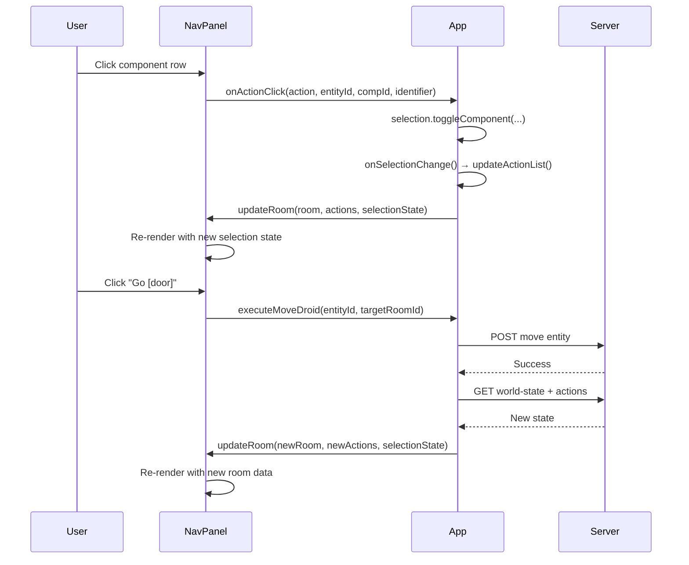

# 🖥️ Client User Interface (UI)

## 1. Overview
The Client UI provides a visual representation of the SlopSimulacrum world state, allowing users to track the droid's position and inspect its internal technical state. It is a single-page application (SPA) built with HTML5, CSS3, and vanilla JavaScript.

### 1.1. File Structure
To ensure maintainability and separation of concerns, the frontend utilizes a modular architecture:
- `public/index.html`: Defines the structural layout and DOM elements.
- `public/css/`: Contains all visual styling split into focused CSS modules:
    - `base.css`: Global typography, CSS variables, and body styles.
    - `layout.css`: Page layout structure (config bar, map section, stat bars section).
    - `map.css`: SVG map rendering styles.
    - `components.css`: Component HUD, config bar buttons, stat bars, overlays, dialogs.
    - `navigation.css`: Navigation button styles.
    - `actions.css`: Action list rendering.
    - `synergy.css`: Synergy preview styling.
    - `utilities.css`: Utility classes.
    - `feedback.css`: Error popups and feedback.
- `public/js/`: Contains the modular logic split into specialized managers:
    - `App.js`: The main orchestrator (`ClientApp`) that coordinates all managers.
    - `Config.js`: Centralized configuration and constants.
    - `WorldStateManager.js`: Manages state synchronization and the "Single Source of Truth".
    - `UIManager.js`: Handles all DOM/SVG rendering and user interface interactions.
    - `ActionManager.js`: Manages action execution and the movement target-selection flow.
    - `ClientErrorController.js`: Handles the resolution and formatting of system errors.
    - `StatBarsManager.js`: Manages configurable stat bar visualization.
    - `ComponentViewer.js`: Manages the 🗿️ component viewer overlay panel.
    - `NavActionsPanel.js`: Manages the 👍 navigation & actions floating panel.
    - `ConfigBarManager.js`: Manages the top config bar and panel coordination.

## 2. Layout Architecture

### 2.1. Three-Section Vertical Layout
The UI uses a three-section vertical layout:

```
┌──────────────────────────────────────────────────────────┐
│  🤖 SlopSimulacrum Terminal                              │
├──────────────────────────────────────────────────────────┤
│  TOP: ⚙️ Config Bar (height: 50px, sticky)              │
│  [🗿️ Components] [👍 Nav/Actions] [➕ Add Stat] [🎨 Colors]│
├──────────────────────────────────────────────────────────┤
│  MIDDLE: 🛰️ Spatial Map (flex-grow: 1, fills remaining)  │
│  [SVG Map fills available space]                         │
├──────────────────────────────────────────────────────────┤
│  BOTTOM: 📊 Stat Bars Panel (height: 150px, scrollable)  │
│  ┌────────────────────────────────────────────────────┐  │
│  │ Physical.mass      [████████░░] 80%  [✏️][🗑️]       │  │
│  │ Physical.durability[██████████] 100% [✏️][🗑️]       │  │
│  └────────────────────────────────────────────────────┘  │
└──────────────────────────────────────────────────────────┘
```

**Section Details:**
| Section | Element | Height | Description |
|---------|---------|--------|-------------|
| Top | `#config-bar` | 50px | Sticky header with config buttons |
| Middle | `#map-section` | flex-grow 1 | SVG map with rooms, entities, components |
| Bottom | `#stat-bars-section` | 150px | Configurable stat bars with percentage display |

### 2.2. Floating Overlay Panels
Two overlay panels are accessible from the config bar:

| Panel | Trigger | Description |
|-------|---------|-------------|
| 🗿️ Component Viewer | `#btn-component-viewer` | Clickable grid of all droid components with stats as clickable badges |
| 👍 Nav/Actions | `#btn-nav-actions` | Navigation buttons + action registry (moved from old right panel) |

Both panels are absolutely positioned floating divs (`position: absolute; top: 60px; right: 20px; z-index: 100`).

### 2.3. Add Stat Dialog
A centered modal dialog (`#add-stat-dialog`) for configuring new stat bars:
- Trait dropdown (populated from world state)
- Stat dropdown (dependent on selected trait)
- Maximum value input (optional, auto-calculated if empty)
- Display label input (optional)
- Color picker (default: trait color, user-definable)

## 3. Visual Components

### 3.1. The World Map (SVG)
The map is rendered using a Scalable Vector Graphics (SVG) element.
- **Rooms (Nodes)**: Each room is represented as a rectangular node with boundaries.
- **Connections**: Lines connecting room nodes represent doors or paths.
- **Droid Marker**: A distinct, glowing point that moves between room nodes.
- **Range Indicators**: When a targeted action is selected, a dashed circle is rendered:
    - **Red**: Used for attack actions.
    - **White**: Used for movement actions (`move`, `dash`).

### 3.2. Configurable Stat Bars
Stat bars display the percentage of a component's stat value relative to a user-defined maximum.

**Data Structure:**
```javascript
{
    id: 'unique-uuid',
    trait: 'Physical',       // Trait name (e.g., Physical, Mind, Spatial, Movement)
    stat: 'mass',            // Stat key within the trait
    max: 50,                 // User-defined max (null = auto-calculated)
    color: '#ff00ff',        // Bar color (hex)
    label: 'Mass'            // Display label
}
```

**Visual Properties:**
| Property | Style |
|----------|-------|
| Bar Track | Background `#222`, border `1px solid #444`, border-radius `2px` |
| Bar Fill | Height 100%, transition `width 0.3s ease-out` |
| Label | Min-width `120px`, font-weight bold |
| Value | Min-width `50px`, text-align right |
| Controls | Edit (✏️) and Delete (🗑️) buttons |

**Trait Default Colors:**
| Trait | Default Color |
|-------|---------------|
| Physical | `#22c55e` (green) |
| Mind | `#3b82f6` (blue) |
| Spatial | `#6b7280` (gray) |
| Movement | `#f59e0b` (amber) |
| Custom | User-defined via color picker |

**Percentage Calculation:**
```
totalValue = Σ(component.trait.stat) for all droid components
effectiveMax = bar.max || totalValue  // Auto if not set
percentage = (totalValue / effectiveMax) * 100  // Capped at 100%
```

### 3.3. Component Viewer (🗿️)
The component viewer displays all components of the active droid as a grid of cards:
- Each card shows the component type and identifier.
- Stats are displayed as clickable badges (`component-stat-clickable`).
- Clicking a stat badge opens the add stat dialog pre-filled with that trait/stat.

### 3.4. Droid Detail Panel
A toggleable overlay (`#detail-overlay`) that appears when a droid marker is clicked. It displays:
- **Basic Info**: Entity ID, Blueprint, and Current Location.
- **Component Tree**: A detailed list of all installed components.
- **Stat Breakdown**: Real-time values for traits and properties.
- **Tactical Targeting HUD**: For component-targeted attacks.

### 3.5. Navigation Console
Navigation buttons are now rendered inside the 👍 floating panel (`#nav-actions-overlay`).
Buttons are dynamically generated based on the `connections` object of the current room.

### 3.6. NavActionsPanel Multi-Component Selection
The NavActionsPanel supports multi-component selection with visual highlighting and cross-action locking.

**Interaction Model:**
| User Action | Result |
|-------------|--------|
| Click component row in an action | Toggles selection for that action (adds/removes from `selectedComponentIds`) |
| Click grayed component (🔒) | Clears the conflict — deselects from the other action |
| Click action name header | No action (informational only) |
| Navigate to new room | Panel content auto-updates without closing |

**Visual States:**
| State | CSS Class | Visual |
|-------|-----------|--------|
| Selected component | `.nav-component-row.nav-selected` | Green background (`var(--neon-green)`), black text, white border, glow |
| Locked component | `.nav-component-row.nav-locked` | 35% opacity, red tint background, cursor `not-allowed` |
| Active action | `.nav-action-item.nav-active` | Yellow left border, yellow action name, subtle yellow background |
| Default component row | `.nav-component-row` | Transparent, hover: green tint + right shift |

**Cross-Action Locking:**
Components selected in one action appear grayed-out (🔒) in all other actions. Clicking a grayed component removes it from the conflicting action's selection. This is coordinated through `SelectionController.buildCrossMap()` which maps each component ID to the action it's selected in.

**Panel Update Flow:**


**CSS Files:**
- `.nav-action-item` — panel action container
- `.nav-action-name` — action name header (hoverable)
- `.nav-component-row` — interactive component row
- `.nav-component-row.nav-selected` — green highlight for selected
- `.nav-component-row.nav-locked` — grayed out with red tint for locked
- `.nav-lock-icon` — lock icon (🔒)
- `.nav-comp-type` / `.nav-comp-identifier` — component labels
- `.nav-capable-count` — capability count badge
- `.nav-action-item.nav-active` — active action yellow highlight

**Related Files:** `public/js/NavActionsPanel.js`, `public/js/SelectionController.js`, `public/css/actions.css`

## 4. Technical Logic

### 4.1. State Synchronization
The client implements a hybrid synchronization model:

1. **Identity Establishment**: WebSocket `incarnate` event → `WorldStateManager.setMyEntityId()`.
2. **Real-Time Trigger**: `world-state-update` event → `StatBarsManager.updateAll(state)` refreshes bar percentages.
3. **State Retrieval**:
    - `GET /world-state` → `WorldStateManager.fetchState()`
    - `GET /actions` → `ActionManager.fetchActions()`
4. **UI Update**:
    - `UIManager.updateWorldView()` renders the room and active droid.
    - `UIManager.updateEntityAndComponentViews()` updates entity and component layers.
    - `UIManager.renderActionList()` updates the action list.

### 4.2. Map Layout Engine (Spatial Coordinates)
Entity and component positions are calculated relative to room origins:
- **Entity Position**: `screenX = room.x + entity.spatial.x`
- **Entity Position**: `screenY = room.y + entity.spatial.y`
- **Component Position**: `screenX = entity.screenX + component.spatial.x`
- **Component Position**: `screenY = entity.screenY + component.spatial.y`

### 4.3. Interaction Flow

**Movement (Target-Based):**
1. User selects a movement action → Range is calculated and a white range indicator is rendered.
2. User clicks a location on the World Map → `POST /execute-action` → Server updates state → `world-state-update` broadcast.

**Inspection:**
Clicking any Entity Marker → `UIManager.showEntityDetails()` → Renders detailed component and stat data.

**Attack (Component-Targeted):**
1. User selects an attack action → Red range indicator is rendered.
2. User clicks an entity within range → `UIManager.showComponentSelection()` → User selects a component.
3. `ActionManager.executePunch()` → Server updates target → `world-state-update` broadcast.

### 4.4. Stat Bar Management

**Adding a Stat Bar:**
1. Click "➕ Add Stat" button in config bar.
2. Select a trait from the dropdown (populated from world state).
3. Select a stat (dependent on selected trait).
4. Optionally set a maximum value (auto-calculated if left empty).
5. Optionally set a display label.
6. Choose a color (defaults to trait color).
7. Click "Add Bar".

**Editing a Stat Bar:**
1. Click the ✏️ (edit) button on a stat bar.
2. Enter a new maximum value in the prompt.
3. The bar is immediately re-rendered with the new maximum.

**Removing a Stat Bar:**
1. Click the 🗑️ (delete) button on a stat bar.
2. The bar is immediately removed from the DOM and internal state.

**Auto-Refresh:**
Stat bars automatically update their fill width on every `world-state-update` socket event.

### 4.5. Error Handling
The client utilizes a `ClientErrorController` to convert error codes into human-readable strings.

## 5. Styling Guide (Cyber-Terminal Aesthetic)
- **Color Palette**:
    - Background: `#0a0a0a` (Deep Black)
    - Primary Accent: `#00ff00` (Matrix Green)
    - Text: `#fff` (White) and `#aaa` (Grey)
    - Highlights: Glowing neon effects using `box-shadow` and `filter: drop-shadow`.
    - Error: `#ff4444` (Red)
- **Typography**: Monospaced fonts ('Courier New') to simulate a retro-futuristic terminal.
- **CSS Variables**: All colors and layout values are defined as CSS custom properties in `:root`.