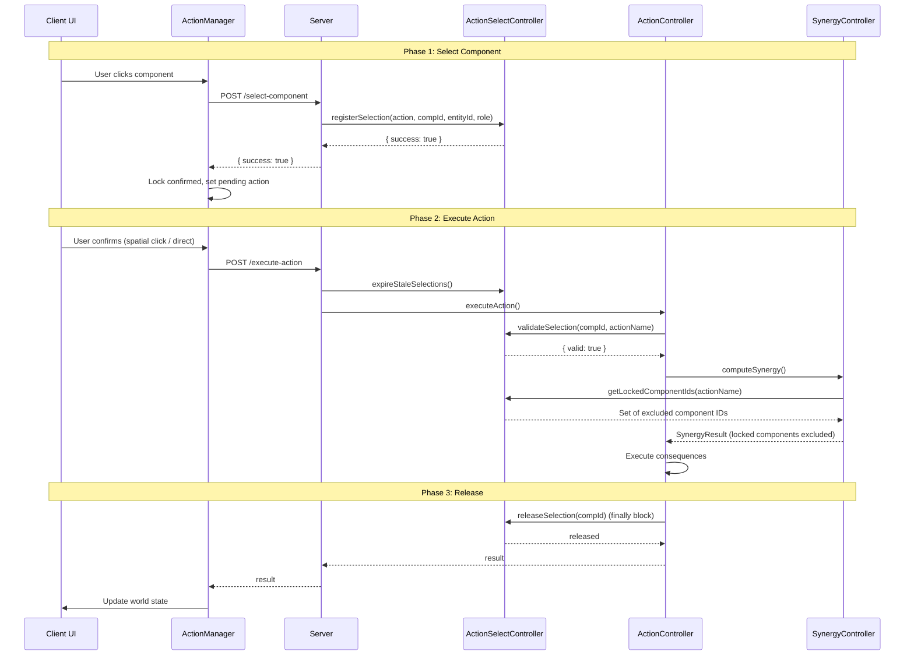
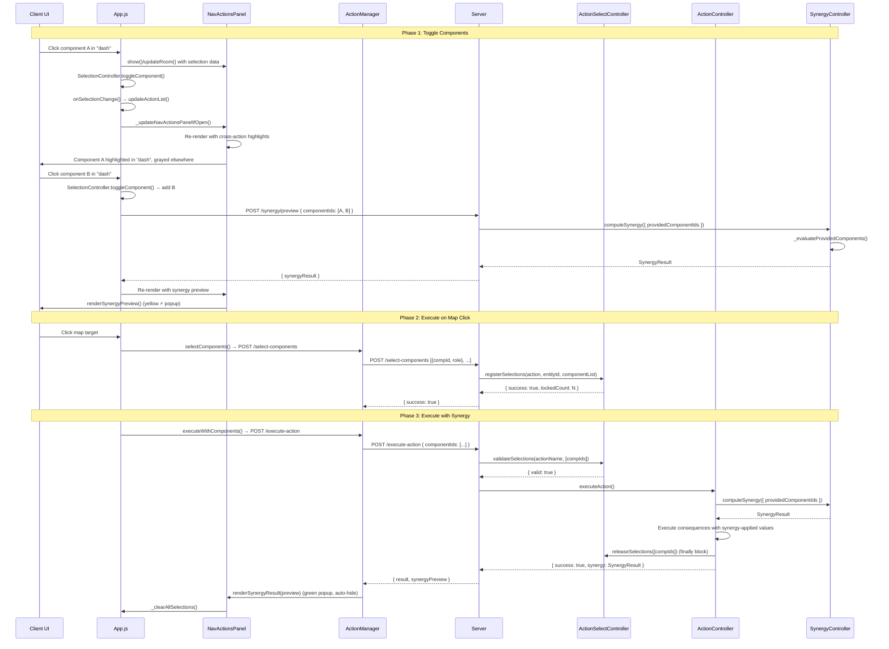

# Component Selection System

## 1. Overview

The Component Selection System enforces the **"one component, one action" rule**: if a component is selected for action A, it cannot be used for action B simultaneously.

**Example**: If you use your right leg (`droidRollingBall: right`) to jump (`move` action), you cannot use that same right leg to attack (`droid punch`) at the same time. The component is "locked" to the jump action until the action completes or the selection expires.

This prevents unrealistic behavior where a single body part performs multiple independent actions concurrently.

---

## 2. Architecture

### Dependency Injection Chain

```
WorldStateController (Root Injector)
    ├── ActionSelectController (created first)
    │       ↑
    │       ├── injected into → SynergyController
    │       └── injected into → ActionController
    │
    ├── SynergyController (uses ActionSelectController for locked-component exclusion)
    └── ActionController (uses ActionSelectController for validation + release)
```

### Placement in DI Sequence

In `WorldStateController` constructor:

1. `ComponentCapabilityController` — capability cache
2. **`ActionSelectController`** — selection/locking
3. `SynergyController` — injected with `ActionSelectController`
4. `ActionController` — injected with `ActionSelectController`

---

## 3. Selection Lifecycle

### Single-Component Flow



### Multi-Component Flow (Click-to-Toggle)



---

## 4. Server API Endpoints

### POST /select-component

Lock a **single** component to a specific action.

**Request:**
```json
{
  "actionName": "move",
  "entityId": "uuid-of-entity",
  "componentId": "uuid-of-component",
  "role": "spatial"
}
```

**Response (success):**
```json
{ "success": true }
```

**Response (failure):**
```json
{ "success": false, "error": "Component is already locked to action 'droid punch'" }
```

### POST /select-components

Lock **multiple** components to a specific action (batch selection).

**Request:**
```json
{
  "actionName": "droid punch",
  "entityId": "uuid-of-entity",
  "components": [
    { "componentId": "uuid-left-hand", "role": "source" },
    { "componentId": "uuid-right-hand", "role": "source" }
  ]
}
```

**Response (success):**
```json
{ "success": true, "lockedCount": 2 }
```

**Response (failure):**
```json
{
  "success": false,
  "errors": [
    "Component \"uuid-left-hand\" is already locked to action 'move' (entity: xyz).",
    "Component \"uuid-right-hand\" is already locked to action 'dash' (entity: xyz)."
  ]
}
```

### POST /release-selection

Release (unlock) a **single** component selection.

**Request:**
```json
{ "componentId": "uuid-of-component" }
```

**Response:**
```json
{ "success": true, "released": true }
```

### GET /selections/:entityId

Get all current component selections for an entity.

**Response:**
```json
[
  {
    "componentId": "uuid",
    "actionName": "move",
    "role": "spatial",
    "lockedAt": 1714000000000
  }
]
```

### POST /synergy/preview

Preview synergy computation without executing the action.

**Request:**
```json
{
  "actionName": "dash",
  "entityId": "uuid-of-entity",
  "componentIds": [
    { "componentId": "uuid-left-wheel", "role": "source" },
    { "componentId": "uuid-right-wheel", "role": "source" }
  ]
}
```

**Response:**
```json
{
  "synergyResult": {
    "synergyMultiplier": 1.5,
    "contributingComponents": [...],
    "summary": "2 droidRollingBall components: 1.5x",
    "capped": false
  }
}
```

---

## 5. Client Flow

### SelectionController Coordination

The `SelectionController` (`public/js/SelectionController.js`) is the central client-side selection state manager:

```
User clicks component → SelectionController.toggleComponent()
  → Moves current selection to crossActionSelections if switching actions
  → Clears stale entries for the new action from crossActionSelections
  → Toggles component in selectedComponentIds (active action)
  → Calls app.onSelectionChange() → UI re-render + synergy preview
```

**Key methods:**
| Method | Description |
|--------|-------------|
| `toggleComponent(actionName, entityId, componentId, componentIdentifier)` | Toggle component in selection for an action |
| `removeGrayedComponent(lockedActionName, componentId)` | Remove component from another action's selection |
| `getActiveActionName()` | Get currently active action name |
| `getSelectedComponentIds()` | Get Set of selected component IDs |
| `buildCrossMap()` | Build cross-action selections map for UI rendering |
| `clearAllSelections()` | Clear all selections (active + cross-action) |

### NavActionsPanel Grayed Component Click Handler

The `NavActionsPanel` (`public/js/NavActionsPanel.js`) handles grayed (locked) component clicks:

```javascript
_attachActionListeners() {
    const componentToActionMap = new Map();
    if (this._crossActionSelections) {
        for (const [actionName, compSet] of this._crossActionSelections) {
            for (const compId of compSet) {
                componentToActionMap.set(compId, actionName);
            }
        }
    }

    this._content.querySelectorAll('.nav-component-row').forEach((row) => {
        row.onclick = () => {
            const componentId = row.dataset.compId;
            const grayedByAction = componentToActionMap.get(componentId);

            // If grayed (locked to another action), handle conflict resolution
            if (grayedByAction && this._onGrayedComponentClick) {
                this._onGrayedComponentClick(grayedByAction, componentId);
                return;
            }

            // Normal toggle for non-grayed capable components
            if (canExecute) {
                this._onActionClick(actionName, entityId, componentId, componentIdentifier);
            }
        };
    });
}
```

**Callback flow:**
```
User clicks grayed component in NavActionsPanel
  → _attachActionListeners detects grayed state via componentToActionMap
  → calls _onGrayedComponentClick(lockedActionName, componentId)
  → SelectionController.removeGrayedComponent(lockedActionName, componentId)
  → Removes from crossActionSelections
  → app.onSelectionChange() → NavActionsPanel re-render
  → Component is now available in its original action
```

### ActionManager Coordination

The `ActionManager` (`public/js/ActionManager.js`) coordinates the client-side selection flow:

#### Single-Component Mode
1. **User clicks component** in action list → `_handleComponentToggle()`
2. **ActionManager._handleTargetingSelection()** sets pending action
3. **User confirms** (clicks map for spatial, clicks target for component)
4. **Action executes** via `POST /execute-action`

#### Multi-Component Mode (Click-to-Toggle)
1. **User clicks component rows** in the action list for the same action
2. **`SelectionController.toggleComponent()`** manages selection state:
   - `activeActionName` — currently active action
   - `selectedComponentIds` — Set of selected component IDs
   - `crossActionSelections` — Map of actionName → Set (for cross-action graying)
3. **Cross-action graying**: Components in `selectedComponentIds` appear grayed out (`.nav-locked` in NavActionsPanel) in other actions. Clicking a grayed component clears it (`SelectionController.removeGrayedComponent()`).
4. **Stale entry cleanup**: When switching actions, `crossActionSelections.delete(actionName)` removes stale entries for the new active action.
5. **Pending action setup**: For spatial/component actions, `_handleTargetingSelection()` is called so map clicks trigger execution.
6. **Live synergy preview**: When 2+ components selected → `POST /synergy/preview` → `renderSynergyPreview()` (yellow, persistent)
7. **Map click execution**: `_executeMultiComponentSpatial()` → batch lock → execute → `renderSynergyResult()` (green, auto-hide)

### Self-Targeting Mode (Instant Execution)
Actions with `targetingType: 'self_target'` (e.g., `selfHeal`) execute **instantly** when a component is selected:
1. **User clicks component row** in the action list
2. **`SelectionController.toggleComponent()`** detects `targetingType === 'self_target'`
3. **`executeSelfTarget()`** sends `POST /execute-action` with `targetComponentId`
4. **Server resolves** the component via `targetComponentId` (Priority 2 in `_resolveSourceComponent`)
5. **Consequence applies** to the selected component (e.g., durability restoration)
6. **UI refreshes** via `world-state-update` event

### UI Display Elements

| Element | CSS Class | Description |
|---------|-----------|-------------|
| Selected component | `.nav-selected` | Green highlight, bold text, white border |
| Cross-action gray | `.nav-locked` | 35% opacity, 🔒 lock icon with tooltip |
| Active action header | `.nav-active` | Yellow left border highlight |
| Lock icon | `.nav-lock-icon` | 🔒 with tooltip showing action name |
| Live synergy preview | `.synergy-preview-display` | Yellow border, persistent while selected |
| Final synergy result | `.synergy-result-display` | Green border, auto-hides after 8s |

---

## 6. Synergy Integration

### Auto-Gather Mode (Legacy)

When `SynergyController.computeSynergy()` is called **without** `providedComponentIds`, it uses the existing auto-gather logic:

```javascript
const lockedComponentIds = this._getLockedComponentIds(actionName);
```

This delegates to `ActionSelectController.getLockedComponentIds(actionName)`, which returns all locked component IDs **except** those locked to the current action. These IDs are excluded from all `_gather*` methods.

### Provided-Components Mode (New)

When `SynergyController.computeSynergy()` is called **with** `providedComponentIds`, it uses the new `_evaluateProvidedComponents()` method:

```javascript
computeSynergy(actionName, entityId, {
    providedComponentIds: [
        { componentId: "uuid1", role: "source" },
        { componentId: "uuid2", role: "source" }
    ]
});
```

The flow:
1. `_evaluateProvidedComponents()` iterates through `config.componentGroups`
2. `_filterProvidedComponentsForGroup()` filters the provided list for each group
3. Synergy multiplier is calculated based on matching members
4. Caps are applied
5. Result is returned to `ActionController`
6. Server includes `synergyPreview` in response
7. Frontend displays synergy feedback

**Effect**: The client explicitly controls which components contribute to synergy, matching the user's selection.

---

## 7. Auto-Expiry

### TTL Mechanism

- **Default TTL**: `DEFAULT_SELECTION_TTL_MS = 30000` (30 seconds)
- Selections older than the TTL are considered stale
- `expireStaleSelections()` is called **before every `POST /execute-action`** in `server.js`

### Why Auto-Expiry?

Prevents permanent locks when:
- Client disconnects without releasing
- Browser tab is closed mid-selection
- Network errors prevent action completion

---

## 8. Binding Roles

| Role | Constant | Description | Example |
|------|----------|-------------|---------|
| `source` | `BINDING_ROLES.SOURCE` | Component providing power/stats | `droidHand` for punch |
| `target` | `BINDING_ROLES.TARGET` | Component being affected | Enemy's `droidArm` taking damage |
| `spatial` | `BINDING_ROLES.SPATIAL` | Component driving movement | `droidRollingBall` for move/dash |
| `self_target` | `BINDING_ROLES.SELF_TARGET` | Component self-affecting | `centralBall` for selfHeal |

---

## 9. Error Handling

### Stale Selection Recovery (Client-Side)

When `_executeMultiComponentSpatial()` fails (e.g., `selectComponents` throws), the client **immediately clears** all stale selection state to prevent UI/server state mismatch:

```javascript
// App.js — _executeMultiComponentSpatial() catch block
catch (error) {
    this.selection.clearAllSelections();
    this.actions.clearPendingAction();
    this.updateActionList();
}
```

This ensures:
- UI does not show components as selected when the server has no locks for them
- Subsequent attempts start from a clean state
- `crossActionSelections` Map is cleared to prevent stale cross-action graying

### Lock Refresh Scenario (Client-Side)

When `selectComponents()` receives a server error indicating components are already locked to the **same action**, it treats it as a refresh scenario and returns success:

```javascript
// ActionManager.js — selectComponents() error handling
const isRefreshScenario = conflictDetails.length > 0 && 
    conflictDetails.every(c => c.lockedAction === actionName);

if (isRefreshScenario) {
    return { success: true, lockedCount: components.length, refreshed: true };
}
```

This prevents unnecessary failures when:
- The user re-selects the same components for the same action
- Server locks persist from a previous attempt that didn't complete cleanly
- Rapid re-clicks trigger duplicate `selectComponents()` calls

### Selection Validation Failure

If `validateSelection()` or `validateSelections()` returns `{ valid: false }`:
- Action execution is **rejected**
- Error message returned to client
- Components **remain locked** (not released, since no execution occurred)
- Client displays error via `ClientErrorController`

### Component Already Locked

If `registerSelection()` or `registerSelections()` is called for a component locked to a different action:
- Returns `{ success: false, error: "..." }` or `{ success: false, errors: [...] }`
- Client displays error via `ClientErrorController`
- Original lock is **preserved**

### Release After Execution

Release happens in the `finally` block of `executeAction()`, ensuring:
- Lock is released on **success**
- Lock is released on **failure**
- Lock is released on **runtime error**

For batch selections, `releaseSelections()` handles all component IDs at once.

---

## 10. Stale Selection Recovery

### Problem A: Client-Side Stale Selections

If a `selectComponents()` call fails (e.g., network error, server rejection), the client-side `selectedComponentIds` Set would retain the component IDs even though the server has no locks. This caused:
- UI showing components as selected (green highlight) when the server had no locks
- Immediate failure on next attempt because server still had old locks from a previous session
- Cross-action graying showing stale selections

### Solution A: Client-Side Error Cleanup (`App.js` — `_executeMultiComponentSpatial`)
On any failure, all client-side selection state is cleared:
- `selection.clearAllSelections()`
- `actions.clearPendingAction()`
- `updateActionList()`

### Problem B: Refresh Scenario (Same-Action Re-lock)

When the user re-selects the same components for the same action (e.g., rapid re-click), the server reports components are already locked to the same action. This was previously treated as an error.

### Solution B: Refresh Handling (`ActionManager.js` — `selectComponents`)
When the server reports components are locked to the **same action**, treat it as a refresh (not an error):
- Parse conflict error messages to extract component IDs and locked action names
- If all conflicts point to the same action → return `{ success: true, refreshed: true }`
- If any conflict points to a **different** action → throw error as normal

This aligns with the server-side behavior in `ActionSelectController.registerSelections()` (line 443), which already allows same-action locks to be refreshed.

### Problem C: Spatial Action Lock Leak (`ActionController.executeAction`)

Spatial actions (`targetingType: 'spatial'`, e.g., `move`, `dash`) skip the component selection validation block because they auto-resolve components via `_resolveSourceComponent()`. This meant their component locks were **never added to `componentsToRelease`**, causing locks to persist indefinitely after spatial actions.

**Symptom**: After doing `move` or `dash` with both `droidRollingBall` components, those components remained locked to "move"/"dash". Subsequent `selfHeal` (which requires clicking a component) would fail because `validateSelection()` found the stale lock.

### Solution C: Spatial Component Tracking (`ActionController.executeAction`)
Added explicit tracking of spatial action components for release:
- Multi-component spatial: iterates `componentList` and adds each component ID to `componentsToRelease`
- Single-component spatial: adds `resolvedSourceComponentId` to `componentsToRelease`
- The `finally` block now correctly releases all spatial action locks

This ensures the `finally` block releases locks after every action, including spatial ones.

---

## 11. Files Involved

| File | Role |
|------|------|
| `src/controllers/actionSelectController.js` | Core selection/locking logic + batch methods |
| `src/controllers/actionController.js` | Validates + releases on execution |
| `src/controllers/synergyController.js` | Excludes locked components + evaluates provided components |
| `src/controllers/WorldStateController.js` | DI: creates + injects ActionSelectController |
| `src/server.js` | REST endpoints for selection + synergy preview |
| `public/js/SelectionController.js` | Client-side selection state management + cross-action coordination |
| `public/js/NavActionsPanel.js` | Nav panel rendering + grayed component click handler |
| `public/js/ConfigBarManager.js` | Wires selection callbacks to NavActionsPanel |
| `public/js/App.js` | Orchestrates selection + synergy + UI updates |
| `public/js/ActionManager.js` | Client-side selection coordination + synergy preview |
| `public/js/UIManager.js` | Legacy panel rendering (action list removed) |
| `public/css/actions.css` | Selection/graying/synergy visual styles (nav-selected, nav-locked, etc.) |
| `public/css/navigation.css` | Nav panel layout styles |

---

## 12. Multi-Component Selection API Reference

### ActionSelectController Methods

| Method | Parameters | Returns | Description |
|--------|-----------|---------|-------------|
| `registerSelection(actionName, componentId, entityId, role)` | `string`, `string`, `string`, `string` | `{ success, error }` | Lock single component |
| `registerSelections(actionName, entityId, componentList)` | `string`, `string`, `Array` | `{ success, lockedCount, errors }` | Lock multiple components (atomic) |
| `validateSelection(componentId, actionName)` | `string`, `string` | `{ valid, error }` | Validate single component |
| `validateSelections(actionName, componentIds)` | `string`, `Array` | `{ valid, error, invalidComponents }` | Validate multiple components |
| `releaseSelection(componentId)` | `string` | `boolean` | Release single component |
| `releaseSelections(componentIds)` | `Array` | `{ released, releasedCount }` | Release multiple components |
| `getSelectionsForAction(actionName)` | `string` | `Array` | Get all locked components for action |

### Server Endpoints

| Endpoint | Method | Request Body | Response |
|----------|--------|-------------|----------|
| `/select-component` | POST | `{ actionName, entityId, componentId, role }` | `{ success, error }` |
| `/select-components` | POST | `{ actionName, entityId, components: [{componentId, role}] }` | `{ success, lockedCount, errors }` |
| `/release-selection` | POST | `{ componentId }` | `{ success, released }` |
| `/selections/:entityId` | GET | — | `[{ componentId, actionName, role, lockedAt }]` |
| `/synergy/preview` | POST | `{ actionName, entityId, componentIds }` | `{ synergyResult }` |