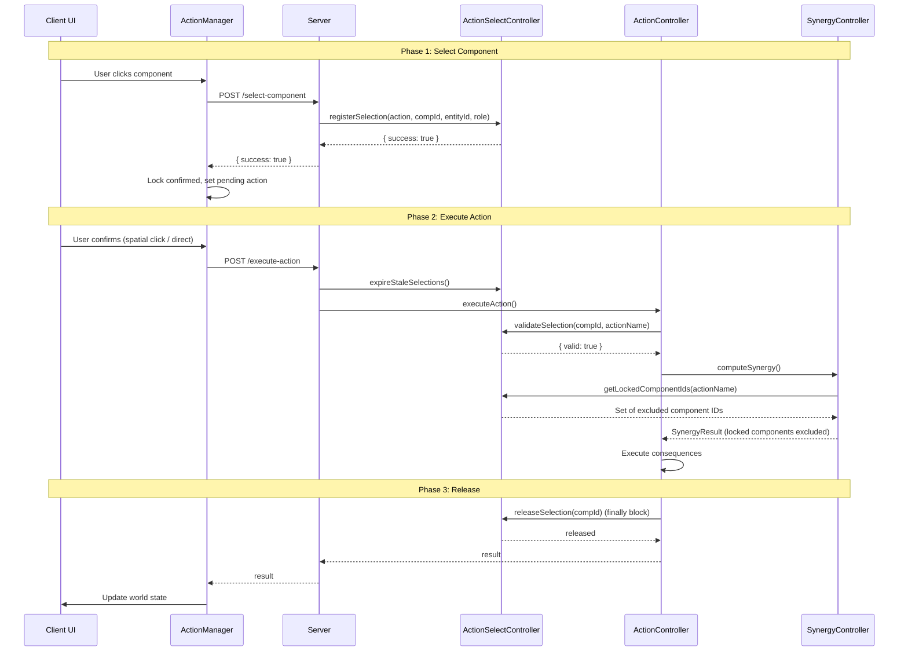
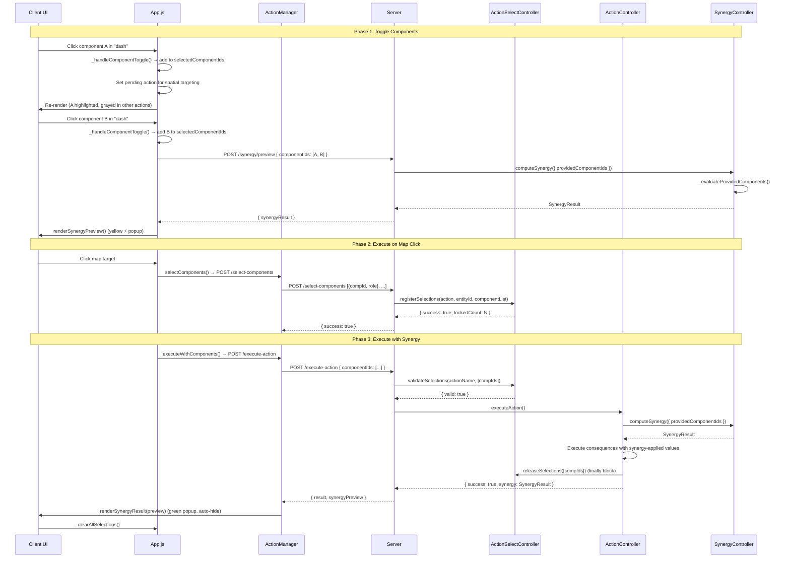

# Component Selection System

## 1. Overview

The Component Selection System enforces the **"one component, one action" rule**: if a component is selected for action A, it cannot be used for action B simultaneously.

**Example**: If you use your right leg (`droidRollingBall: right`) to jump (`move` action), you cannot use that same right leg to attack (`droid punch`) at the same time. The component is "locked" to the jump action until the action completes or the selection expires.

This prevents unrealistic behavior where a single body part performs multiple independent actions concurrently.

---

## 2. Architecture

### Dependency Injection Chain

```
WorldStateController (Root Injector)
    ├── ActionSelectController (created first)
    │       ↑
    │       ├── injected into → SynergyController
    │       └── injected into → ActionController
    │
    ├── SynergyController (uses ActionSelectController for locked-component exclusion)
    └── ActionController (uses ActionSelectController for validation + release)
```

### Placement in DI Sequence

In `WorldStateController` constructor:

1. `ComponentCapabilityController` — capability cache
2. **`ActionSelectController`** — selection/locking
3. `SynergyController` — injected with `ActionSelectController`
4. `ActionController` — injected with `ActionSelectController`

---

## 3. Selection Lifecycle

### Single-Component Flow



### Multi-Component Flow (Click-to-Toggle)



---

## 4. Server API Endpoints

### POST /select-component

Lock a **single** component to a specific action.

**Request:**
```json
{
  "actionName": "move",
  "entityId": "uuid-of-entity",
  "componentId": "uuid-of-component",
  "role": "spatial"
}
```

**Response (success):**
```json
{ "success": true }
```

**Response (failure):**
```json
{ "success": false, "error": "Component is already locked to action 'droid punch'" }
```

### POST /select-components

Lock **multiple** components to a specific action (batch selection).

**Request:**
```json
{
  "actionName": "droid punch",
  "entityId": "uuid-of-entity",
  "components": [
    { "componentId": "uuid-left-hand", "role": "source" },
    { "componentId": "uuid-right-hand", "role": "source" }
  ]
}
```

**Response (success):**
```json
{ "success": true, "lockedCount": 2 }
```

**Response (failure):**
```json
{
  "success": false,
  "errors": [
    "Component \"uuid-left-hand\" is already locked to action 'move' (entity: xyz).",
    "Component \"uuid-right-hand\" is already locked to action 'dash' (entity: xyz)."
  ]
}
```

### POST /release-selection

Release (unlock) a **single** component selection.

**Request:**
```json
{ "componentId": "uuid-of-component" }
```

**Response:**
```json
{ "success": true, "released": true }
```

### GET /selections/:entityId

Get all current component selections for an entity.

**Response:**
```json
[
  {
    "componentId": "uuid",
    "actionName": "move",
    "role": "spatial",
    "lockedAt": 1714000000000
  }
]
```

### POST /synergy/preview

Preview synergy computation without executing the action.

**Request:**
```json
{
  "actionName": "dash",
  "entityId": "uuid-of-entity",
  "componentIds": [
    { "componentId": "uuid-left-wheel", "role": "source" },
    { "componentId": "uuid-right-wheel", "role": "source" }
  ]
}
```

**Response:**
```json
{
  "synergyResult": {
    "synergyMultiplier": 1.5,
    "contributingComponents": [...],
    "summary": "2 droidRollingBall components: 1.5x",
    "capped": false
  }
}
```

---

## 5. Client Flow

### ActionManager Coordination

The `ActionManager` (`public/js/ActionManager.js`) coordinates the client-side selection flow:

#### Single-Component Mode
1. **User clicks component** in action list → `_handleComponentToggle()`
2. **ActionManager._handleTargetingSelection()** sets pending action
3. **User confirms** (clicks map for spatial, clicks target for component)
4. **Action executes** via `POST /execute-action`

#### Multi-Component Mode (Click-to-Toggle)
1. **User clicks component rows** in the action list for the same action
2. **`App.js._handleComponentToggle()`** manages selection state:
   - `activeActionName` — currently active action
   - `selectedComponentIds` — Set of selected component IDs
   - `crossActionSelections` — Map of actionName → Set (for cross-action graying)
3. **Cross-action graying**: Components in `selectedComponentIds` appear grayed out (`.component-locked`) in other actions. Clicking a grayed component clears it (`_handleGrayedComponentClick()`).
4. **Pending action setup**: For spatial/component actions, `_handleTargetingSelection()` is called so map clicks trigger execution.
5. **Live synergy preview**: When 2+ components selected → `POST /synergy/preview` → `renderSynergyPreview()` (yellow, persistent)
6. **Map click execution**: `_executeMultiComponentSpatial()` → batch lock → execute → `renderSynergyResult()` (green, auto-hide)

### Self-Targeting Mode (Instant Execution)
Actions with `targetingType: 'self_target'` (e.g., `selfHeal`) execute **instantly** when a component is selected:
1. **User clicks component row** in the action list
2. **`App.js._handleComponentToggle()`** detects `targetingType === 'self_target'`
3. **`_executeSelfTargetAction()`** sends `POST /execute-action` with `targetComponentId`
4. **Server resolves** the component via `targetComponentId` (Priority 2 in `_resolveSourceComponent`)
5. **Consequence applies** to the selected component (e.g., durability restoration)
6. **UI refreshes** via `world-state-update` event

### UI Display Elements

| Element | CSS Class | Description |
|---------|-----------|-------------|
| Selected component | `.action-selected` | Green highlight, bold text |
| Cross-action gray | `.component-locked` | 35% opacity, clickable to clear |
| Active action header | `.action-active` | Yellow border/header |
| Lock icon | `.lock-icon` | 🔒 with tooltip showing action name |
| Live synergy preview | `.synergy-preview-display` | Yellow border, persistent while selected |
| Final synergy result | `.synergy-result-display` | Green border, auto-hides after 8s |

---

## 6. Synergy Integration

### Auto-Gather Mode (Legacy)

When `SynergyController.computeSynergy()` is called **without** `providedComponentIds`, it uses the existing auto-gather logic:

```javascript
const lockedComponentIds = this._getLockedComponentIds(actionName);
```

This delegates to `ActionSelectController.getLockedComponentIds(actionName)`, which returns all locked component IDs **except** those locked to the current action. These IDs are excluded from all `_gather*` methods.

### Provided-Components Mode (New)

When `SynergyController.computeSynergy()` is called **with** `providedComponentIds`, it uses the new `_evaluateProvidedComponents()` method:

```javascript
computeSynergy(actionName, entityId, {
    providedComponentIds: [
        { componentId: "uuid1", role: "source" },
        { componentId: "uuid2", role: "source" }
    ]
});
```

The flow:
1. `_evaluateProvidedComponents()` iterates through `config.componentGroups`
2. `_filterProvidedComponentsForGroup()` filters the provided list for each group
3. Synergy multiplier is calculated based on matching members
4. Caps are applied
5. Result is returned to `ActionController`
6. Server includes `synergyPreview` in response
7. Frontend displays synergy feedback

**Effect**: The client explicitly controls which components contribute to synergy, matching the user's selection.

---

## 7. Auto-Expiry

### TTL Mechanism

- **Default TTL**: `DEFAULT_SELECTION_TTL_MS = 30000` (30 seconds)
- Selections older than the TTL are considered stale
- `expireStaleSelections()` is called **before every `POST /execute-action`** in `server.js`

### Why Auto-Expiry?

Prevents permanent locks when:
- Client disconnects without releasing
- Browser tab is closed mid-selection
- Network errors prevent action completion

---

## 8. Binding Roles

| Role | Constant | Description | Example |
|------|----------|-------------|---------|
| `source` | `BINDING_ROLES.SOURCE` | Component providing power/stats | `droidHand` for punch |
| `target` | `BINDING_ROLES.TARGET` | Component being affected | Enemy's `droidArm` taking damage |
| `spatial` | `BINDING_ROLES.SPATIAL` | Component driving movement | `droidRollingBall` for move/dash |
| `self_target` | `BINDING_ROLES.SELF_TARGET` | Component self-affecting | `centralBall` for selfHeal |

---

## 9. Error Handling

### Selection Validation Failure

If `validateSelection()` or `validateSelections()` returns `{ valid: false }`:
- Action execution is **rejected**
- Error message returned to client
- Components **remain locked** (not released, since no execution occurred)
- Client displays error via `ClientErrorController`

### Component Already Locked

If `registerSelection()` or `registerSelections()` is called for a component locked to a different action:
- Returns `{ success: false, error: "..." }` or `{ success: false, errors: [...] }`
- Client displays error via `ClientErrorController`
- Original lock is **preserved**

### Release After Execution

Release happens in the `finally` block of `executeAction()`, ensuring:
- Lock is released on **success**
- Lock is released on **failure**
- Lock is released on **runtime error**

For batch selections, `releaseSelections()` handles all component IDs at once.

---

## 10. Files Involved

| File | Role |
|------|------|
| `src/controllers/actionSelectController.js` | Core selection/locking logic + batch methods |
| `src/controllers/actionController.js` | Validates + releases on execution |
| `src/controllers/synergyController.js` | Excludes locked components + evaluates provided components |
| `src/controllers/WorldStateController.js` | DI: creates + injects ActionSelectController |
| `src/server.js` | REST endpoints for selection + synergy preview |
| `public/js/ActionManager.js` | Client-side selection coordination + synergy preview |
| `public/js/App.js` | Click-to-toggle state management + cross-action graying |
| `public/js/UIManager.js` | Renders selection highlights, grayed states, synergy displays |
| `public/styles.css` | Selection/graying/synergy visual styles |

---

## 11. Multi-Component Selection API Reference

### ActionSelectController Methods

| Method | Parameters | Returns | Description |
|--------|-----------|---------|-------------|
| `registerSelection(actionName, componentId, entityId, role)` | `string`, `string`, `string`, `string` | `{ success, error }` | Lock single component |
| `registerSelections(actionName, entityId, componentList)` | `string`, `string`, `Array` | `{ success, lockedCount, errors }` | Lock multiple components (atomic) |
| `validateSelection(componentId, actionName)` | `string`, `string` | `{ valid, error }` | Validate single component |
| `validateSelections(actionName, componentIds)` | `string`, `Array` | `{ valid, error, invalidComponents }` | Validate multiple components |
| `releaseSelection(componentId)` | `string` | `boolean` | Release single component |
| `releaseSelections(componentIds)` | `Array` | `{ released, releasedCount }` | Release multiple components |
| `getSelectionsForAction(actionName)` | `string` | `Array` | Get all locked components for action |

### Server Endpoints

| Endpoint | Method | Request Body | Response |
|----------|--------|-------------|----------|
| `/select-component` | POST | `{ actionName, entityId, componentId, role }` | `{ success, error }` |
| `/select-components` | POST | `{ actionName, entityId, components: [{componentId, role}] }` | `{ success, lockedCount, errors }` |
| `/release-selection` | POST | `{ componentId }` | `{ success, released }` |
| `/selections/:entityId` | GET | — | `[{ componentId, actionName, role, lockedAt }]` |
| `/synergy/preview` | POST | `{ actionName, entityId, componentIds }` | `{ synergyResult }` |