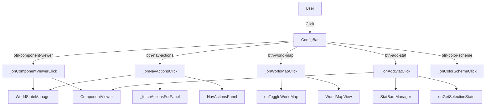

# ⚙️ Config Bar Manager

## 1. Overview
The `ConfigBarManager` manages the top configuration bar with buttons for toggling overlay panels (Component Viewer, Actions, World Map), the Add Stat dialog, and the Color Scheme panel. It coordinates between all overlay modules and handles panel closing/toggling logic.

**File:** `public/js/ConfigBarManager.js`

**Extends:** `EventDispatcher`

## 2. Architecture

### 2.1. Role
- **Config Bar Control:** Manages click listeners for all config bar buttons (`#btn-component-viewer`, `#btn-nav-actions`, `#btn-world-map`, `#btn-add-stat`, `#btn-color-scheme`)
- **Overlay Coordination:** Provides methods to close individual overlays or all overlays at once
- **Panel Toggle Logic:** Implements `togglePanel()` to toggle one panel while closing the other
- **Callback Delegation:** Delegates business logic to injected callbacks (action execution, movement, selection state)

### 2.2. Dependency Injection
`ConfigBarManager` receives all dependencies via constructor options:

```javascript
constructor(options) {
    this._uiManager = options.uiManager;
    this._componentViewer = options.componentViewer;
    this._statBarsManager = options.statBarsManager;
    this._navActionsPanel = options.navActionsPanel;
    this._worldMapView = options.worldMapView || null;
    this._worldStateManager = options.worldStateManager;
    this._onMoveEntity = options.onMoveEntity || null;
    this._onExecuteAction = options.onExecuteAction || null;
    this._onGetSelectionState = options.onGetSelectionState || null;
    this._onGrayedComponentCallback = options.onGrayedComponentCallback || null;
    this._onToggleWorldMap = options.onToggleWorldMap || null;
    this._configBar = null;
}
```

**Constructor Parameters:**
| Parameter | Type | Required | Description |
|-----------|------|----------|-------------|
| `options.uiManager` | `UIManager` | Yes | The UIManager instance for DOM access |
| `options.componentViewer` | `ComponentViewer` | Yes | The ComponentViewer instance |
| `options.statBarsManager` | `StatBarsManager` | Yes | The StatBarsManager instance |
| `options.navActionsPanel` | `NavActionsPanel` | Yes | The NavActionsPanel instance |
| `options.worldMapView` | `WorldMapView` | No | The WorldMapView instance (fallback if no callback) |
| `options.worldStateManager` | `WorldStateManager` | Yes | The WorldStateManager instance |
| `options.onMoveEntity` | `Function` | No | Callback for entity movement `(entityId, targetRoomId)` |
| `options.onExecuteAction` | `Function` | No | Callback for action execution |
| `options.onGetSelectionState` | `Function` | No | Callback for selection state `{activeActionName, selectedComponentIds, crossActionSelections}` |
| `options.onGrayedComponentCallback` | `Function` | No | Callback for grayed component clicks |
| `options.onToggleWorldMap` | `Function` | No | Callback for world map toggle |

## 3. Public Methods

| Method | Parameters | Returns | Description |
|--------|-----------|---------|-------------|
| `init()` | — | `void` | Initializes DOM references (`#config-bar`) and sets up event listeners |
| `closeComponentViewer()` | — | `void` | Closes the component viewer overlay |
| `closeNavActions()` | — | `void` | Closes the nav/actions overlay |
| `closeWorldMap()` | — | `void` | Closes the world map overlay |
| `closeAllOverlays()` | — | `void` | Closes all overlays (component viewer, nav actions, world map) |
| `togglePanel(panel, ...args)` | `string panel`, `...any args` | `void` | Toggles one panel while closing the other. `panel` is `'component'` or `'nav'` |

## 4. Private Methods

### 4.1. `_setupListeners()`
Sets up click listeners for all config bar buttons.

```javascript
_setupListeners() {
    const btnComponentViewer = document.getElementById('btn-component-viewer');
    const btnNavActions = document.getElementById('btn-nav-actions');
    const btnWorldMap = document.getElementById('btn-world-map');
    const btnAddStat = document.getElementById('btn-add-stat');
    const btnColorScheme = document.getElementById('btn-color-scheme');

    if (btnComponentViewer) btnComponentViewer.onclick = () => this._onComponentViewerClick();
    if (btnNavActions) btnNavActions.onclick = () => this._onNavActionsClick();
    if (btnWorldMap) btnWorldMap.onclick = () => this._onWorldMapClick();
    if (btnAddStat) btnAddStat.onclick = () => this._onAddStatClick();
    if (btnColorScheme) btnColorScheme.onclick = () => this._onColorSchemeClick();
}
```

### 4.2. `_onComponentViewerClick()`
Handles the 🗿️ Component Viewer button click. Toggles the component viewer overlay, showing current droid components.

```javascript
_onComponentViewerClick() {
    const droid = this._worldStateManager.getActiveDroid();
    const state = this._worldStateManager.getState();
    if (this._componentViewer) {
        this._componentViewer.toggle(droid, state);
    }
}
```

### 4.3. `_onNavActionsClick()`
Handles the ⚔️ Actions button click. Toggles the actions overlay with fetch + update flow.

**Flow:**
1. Get active droid and state from `WorldStateManager`
2. Check if panel is already open (`_overlay.style.display === 'block'`)
3. Fetch actions from server via `_fetchActionsForPanel()`
4. If panel is open → call `updateRoom()` to refresh content
5. If panel is closed → call `show()` to display fresh content
6. On fetch failure → show with empty actions object

**Selection State:** Reads from `onGetSelectionState` callback to pass selection state to the panel.

### 4.4. `_onWorldMapClick()`
Handles the 🌐 World Map button click. Toggles the world map overlay.

```javascript
_onWorldMapClick() {
    if (this._onToggleWorldMap) {
        this._onToggleWorldMap();
    } else if (this._worldMapView) {
        this._worldMapView.toggle();
    }
}
```

**Priority:** Uses the injected `onToggleWorldMap` callback first (from App.js), falls back to direct `_worldMapView.toggle()`.

### 4.5. `_onAddStatClick()`
Handles the ➕ Add Stat button click. Opens the add stat dialog, pre-filtered to the currently selected component.

**Component Context Resolution:**
1. Try `ComponentViewer.getActiveComponentId()` if overlay is open
2. Fallback: Get from `onGetSelectionState` if exactly one component selected
3. Call `StatBarsManager.openAddDialog({ componentId })`

### 4.6. `_onColorSchemeClick()`
Placeholder for future color scheme customization. Logs `[ConfigBarManager] 🎨 Color scheme panel (placeholder)`.

### 4.7. `_fetchActionsForPanel()`
Fetches available actions for the nav/actions panel.

```javascript
async _fetchActionsForPanel() {
    try {
        const entityId = this._worldStateManager.getMyEntityId();
        if (!entityId) return {};
        const response = await fetch(`/actions?entityId=${entityId}`);
        if (!response.ok) return {};
        const data = await response.json();
        return data.actions || {};
    } catch {
        return {};
    }
}
```

## 5. Integration with App.js

### 5.1. Constructor Wiring (in ClientApp)
```javascript
this.configBar = new ConfigBarManager({
    uiManager: this.ui,
    componentViewer: this.componentViewer,
    statBarsManager: this.statBars,
    navActionsPanel: this.navActions,
    worldMapView: this.worldMap,
    worldStateManager: this.worldState,
    onMoveEntity: (entityId, targetRoomId) => this.executor.executeMoveDroid(entityId, targetRoomId),
    onExecuteAction: (actionName, entityId, componentId, componentIdentifier) => {
        // Toggle component selection + execute action
    },
    onGetSelectionState: () => ({
        activeActionName: this.selection.getActiveActionName(),
        selectedComponentIds: this.selection.getSelectedComponentIds(),
        crossActionSelections: this.selection.crossActionSelections
    }),
    onGrayedComponentCallback: (lockedActionName, componentId) => {
        this.selection.removeGrayedComponent(lockedActionName, componentId);
    },
    onToggleWorldMap: () => this.worldMap.toggle(),
});
```

### 5.2. Initialization
```javascript
// In ClientApp.init():
this.configBar.init();
```

## 6. Config Bar Buttons

| Button ID | Icon | Title | Handler |
|-----------|------|-------|---------|
| `#btn-component-viewer` | 🗿️ | Component Viewer | `_onComponentViewerClick()` → toggles ComponentViewer |
| `#btn-nav-actions` | ⚔️ | Actions | `_onNavActionsClick()` → toggles NavActionsPanel |
| `#btn-world-map` | 🌐 | World Map | `_onWorldMapClick()` → toggles WorldMapView |
| `#btn-add-stat` | ➕ | Add Stat | `_onAddStatClick()` → opens StatBarsManager dialog |
| `#btn-color-scheme` | 🎨 | Color Scheme | `_onColorSchemeClick()` → placeholder |

**Note:** The nav-actions button icon changed from 👍 to ⚔️ and title from "Navigation & Actions" to "Actions" as navigation arrows moved to the spatial map.

## 7. Overlay Close Methods

| Method | Called By | Description |
|--------|-----------|-------------|
| `closeComponentViewer()` | `togglePanel('component')` | Closes component viewer |
| `closeNavActions()` | `togglePanel('nav')` | Closes nav/actions panel |
| `closeWorldMap()` | `closeAllOverlays()` | Closes world map overlay |
| `closeAllOverlays()` | User convenience | Closes all three overlays |

## 8. Data Flow Diagram



## 9. Recent Changes

| Date | Change |
|------|--------|
| 2026-05-13 | **Feature:** Added world map toggle support (`_onWorldMapClick`, `closeWorldMap`, `closeAllOverlays`). Button icon changed from 👍 to ⚔️ for nav-actions. |

## 10. Design Notes

- **Callback Delegation:** Business logic (action execution, movement) is delegated to injected callbacks. ConfigBarManager only handles UI coordination.
- **Fallback Pattern:** World map toggle uses `onToggleWorldMap` callback first, falls back to direct `WorldMapView` access.
- **Null Safety:** All DOM element references are checked for existence before adding event listeners.
- **Event Inheritance:** Extends `EventDispatcher` for potential future event-based communication.