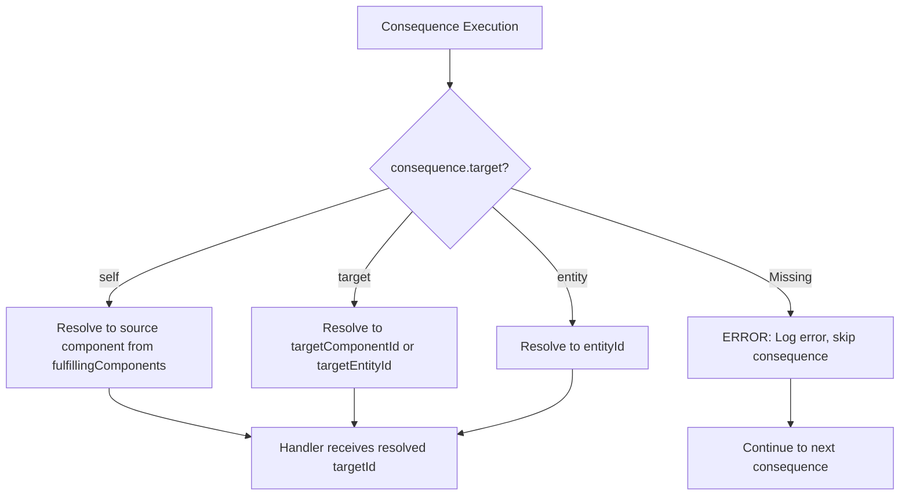

# Consequence Handler Architecture

## Overview

The consequence handler system was refactored from a single monolithic class (`ConsequenceHandlers.js`) into **6 single-focused modules** following the **Single Responsibility Principle (SRP)**. The original class contained 11 handler methods spanning 4 distinct responsibility categories (397 lines). The new architecture distributes these across dedicated modules while maintaining backward compatibility via a lightweight dispatcher.

**Target Resolution:** Each consequence in `data/actions.json` MUST include a `target` field (`"self"`, `"target"`, or `"entity"`) that defines who is affected by the consequence. The `ConsequenceDispatcher` resolves this to a concrete `targetId` before dispatching to handlers.

## Module Structure

```
src/controllers/
├── consequenceHandlers.js              ← Lightweight dispatcher (~50 lines)
├── SpatialConsequenceHandler.js        ← Spatial coordinate updates (~90 lines)
├── StatConsequenceHandler.js           ← Stat value updates (~100 lines)
├── DamageConsequenceHandler.js         ← Damage application (~90 lines)
├── LogConsequenceHandler.js            ← Logging (~35 lines)
├── EventConsequenceHandler.js          ← Event triggering (~30 lines)
└── EquipmentConsequenceHandler.js      ← Equipment operations (~360 lines)
```

## Module Responsibilities

| Module | Handlers | Responsibility |
|--------|----------|----------------|
| `SpatialConsequenceHandler` | `updateSpatial`, `deltaSpatial` | Entity spatial state changes (absolute and relative positioning) |
| `StatConsequenceHandler` | `updateStat`, `updateComponentStatDelta` | Stat modifications on components and entities |
| `DamageConsequenceHandler` | `damageComponent` | Damage application to specific target components |
| `LogConsequenceHandler` | `log` | Structured log messages at specified severity levels |
| `EventConsequenceHandler` | `triggerEvent` | Event triggering for logging/notification |
| `EquipmentConsequenceHandler` | `grabItem`, `releaseItem`, `grabToBackpack`, `dropAll` | Equipment grab, release, and drop operations |

## Target Resolution System

### The `target` Field

Every consequence in `data/actions.json` MUST include a `target` field. This field defines **who is affected** by the consequence:

| Target | Meaning | Resolves To |
|--------|---------|-------------|
| `"self"` | The source component fulfilling the requirement | Source component ID from `fulfillingComponents` map |
| `"target"` | The explicitly targeted entity/component | `params.targetComponentId` or `params.targetEntityId` |
| `"entity"` | The entire entity performing the action | `entityId` |

### Target Resolution Flow



### Handler Target Type Interpretation

Each handler interprets the `targetId` based on its `consequenceTarget` context:

| Handler | `'self'` Behavior | `'target'` Behavior | `'entity'` Behavior |
|---------|-------------------|---------------------|---------------------|
| `damageComponent` | Damage source component | Damage target component | Damage ALL entity components |
| `updateComponentStatDelta` | Update source component | Update target component | Update ALL entity components |
| `deltaSpatial` | Move source entity | Move target entity | Move entity |
| `log` | Log with source context | Log with target context | Log with entity context |
| `grabItem` | N/A (uses hand component) | Grab target entity | N/A |
| `releaseItem` | Release from source | Release target item | N/A |
| `dropAll` | Drop entity items | N/A | Drop entity items |

## Dispatcher Pattern

`ConsequenceHandlers.js` acts as a **lightweight dispatcher** that:
1. Instantiates all focused handlers via Dependency Injection
2. Exposes a `handlers` getter that maps consequence types to handler functions
3. Maintains the normalized signature: `(targetId, params, context)`

```javascript
// Backward-compatible access pattern:
this.actionController.consequenceHandlers.handlers[consequence.type](targetId, params, context)
```

## Handler Interface Contract

All handlers follow a normalized signature and return format:

```javascript
/**
 * @param {string} targetId - The resolved target ID (component or entity ID based on target type).
 * @param {Object} params - Handler-specific parameters.
 * @param {Object} context - Context containing actionParams (with consequenceTarget), fulfillingComponents, synergyResult.
 * @returns {Object} { success: boolean, message: string, data: any }
 */
```

**Context Object:**
```javascript
{
    requirementValues: { 'Physical.strength': 25 },
    actionParams: {
        entityId: "entity-uuid",
        targetComponentId: "enemy-component-uuid",  // optional
        targetEntityId: "item-entity-uuid",         // optional
        consequenceTarget: "self" | "target" | "entity"  // the target type
    },
    fulfillingComponents: { 'Physical.durability': "source-component-uuid" },
    synergyResult: { ... }  // optional
}
```

## Dependencies

| Module | Dependencies |
|--------|-------------|
| `SpatialConsequenceHandler` | `worldStateController`, `MIN_MOVEMENT_DISTANCE` |
| `StatConsequenceHandler` | `worldStateController` |
| `DamageConsequenceHandler` | `worldStateController` |
| `LogConsequenceHandler` | `Logger` (standalone utility) |
| `EventConsequenceHandler` | `Logger` (standalone utility) |
| `EquipmentConsequenceHandler` | `worldStateController`, `MIN_STRENGTH_DELTA` |

## Integration Points

- **ActionController**: Accesses handlers via `this.consequenceHandlers.handlers`
- **ConsequenceDispatcher**: Validates `target` field, resolves `targetId`, passes `consequenceTarget` in context
- **WorldStateController**: Instantiates `ConsequenceHandlers` which auto-initializes all sub-handlers

## Benefits of Refactoring

1. **SRP Compliance**: Each module has exactly one reason to change
2. **Testability**: Individual handlers can be tested in isolation
3. **Maintainability**: Changes to equipment logic don't risk spatial logic
4. **Discoverability**: Developers can find relevant code by module name
5. **Backward Compatibility**: Existing `handlers` map access pattern unchanged
6. **Explicit Targeting**: Each consequence explicitly declares who it affects

## Related Documentation

- [Controller Patterns](controller_patterns.md) — Dependency Injection standard
- [Action System](action_system.md) — Action execution flow
- [Code Quality](../code_quality_and_best_practices.md) — SRP and clean code standards

## Recent Changes

| Date | Change |
|------|--------|
| 2026-05-05 | **Refactored:** Split `consequenceHandlers.js` into 6 focused modules |
| 2026-05-08 | **Added:** Mandatory `target` field on all consequences (`self`, `target`, `entity`) |
| 2026-05-08 | **Added:** `ConsequenceDispatcher._resolveTargetForConsequence()` for target resolution |
| 2026-05-08 | **Removed:** `componentBinding` from action definitions |