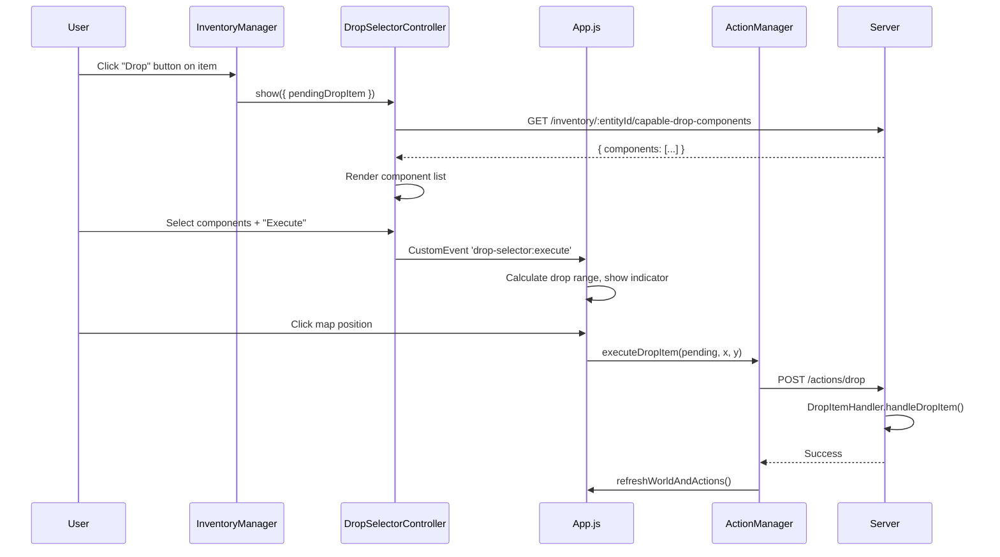
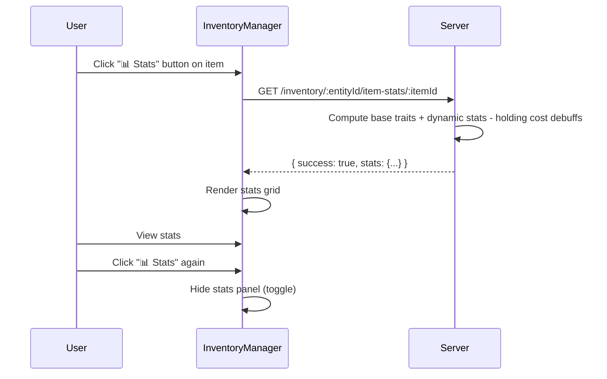

# Inventory System

## Purpose and Design Rationale

The inventory system provides a volume-based storage mechanism where droid entities can carry items across their components. Each component with a `Physical.volume` property acts as a container whose capacity limits how much total item volume can be stored within it.

This design was chosen because:

- **Volume as a shared metric**: The `Physical.volume` property already exists on component definitions in `data/components.json`, making it a natural capacity metric without introducing new properties.
- **Component as container**: Components are the natural grouping unit — items are stored on specific components, creating a 1:N relationship.
- **Server-authoritative validation**: All volume operations are validated server-side to prevent state corruption from client manipulation.

## Why Volume-Based Storage

Volume-based storage was chosen over count-based or slot-based alternatives because:

- It provides a continuous capacity model where items of varying sizes can be packed into components proportionally.
- It aligns with the existing `Physical.volume` trait, avoiding schema changes to component definitions.
- It creates meaningful gameplay decisions: small components can hold many small items, while large components can carry fewer large items.

## Component-to-Item Relationship

The relationship is **1:N**: one component can hold many items, each with their own volume. Items store a `hostComponentId` reference to indicate which component contains them. **All items must be attached to a component — there is no general or unassigned inventory.**

When adding an item, `componentId` is required at every level (API, controller, and manager). If omitted, the operation fails with a clear error message.

When an entity has no items, the `items` array is absent or empty.

Items are identified by:
- `type`: The item type identifier (e.g., `powerCell`, `dataCrystal`, `testItem`)
- `id`: A unique instance ID (e.g., `item-1`, `item-2`)
- `hostComponentId`: The component ID where the item is stored

## Server-Client Data Flow

The inventory system follows a server-authoritative pattern:

1. **Registry (read)**: The client fetches item type definitions from the registry endpoint. This is static data loaded at startup.
2. **Entity items (read)**: The client fetches an entity's current items grouped by component.
3. **Add/Move/Remove (write)**: All mutations go through server API endpoints. The server validates volume constraints before allowing operations.
4. **Broadcast**: After successful mutations, the broadcast service emits updated world state to all connected clients.

This ensures that volume constraints cannot be bypassed by client-side manipulation.

## Drag-and-Drop Design Decisions

Native HTML5 Drag and Drop API is used rather than a third-party library because:

- The inventory UI is simple enough that native events suffice.
- No additional dependencies are required.
- The event model maps naturally to the drop-target pattern.

The drag-and-drop flow:
1. User drags an item card over a component's item container.
2. Client-side validation checks if the target component has room.
3. Visual feedback highlights the drop zone (green = can fit, red = cannot fit).
4. On drop, the server is asked to move the item.
5. If successful, the UI re-renders with the new item positions.

## Volume Validation Rationale

Volume validation is enforced at two levels:

1. **Client-side**: Provides immediate visual feedback during drag-and-drop without requiring server round-trips for every hover event.
2. **Server-side**: The authoritative check that determines whether the operation is actually performed.

If the client-side validation passes but the server-side validation fails (e.g., due to concurrent state changes), the server rejects the operation with a clear error message.

## Data Model

### Item Type Definitions (`data/inventoryItems.json`)

Each item type defines:
- `name`: Human-readable display name
- `description`: Item description (informational)
- `volume`: Integer volume capacity
- `traits`: Optional trait data (Physical.mass, Physical.durability)

#### Test Item

A `testItem` is included in the item registry for inventory system verification:

| Property | Value |
|----------|-------|
| `volume` | 2 |
| `mass` | 0.5 |
| `durability` | 10 |

This item is automatically added to the client entity's `centralBall` component on spawn, providing a visible test case for the inventory system's add, move, and remove operations.

### Entity Items Array

Each entity has an `items` array containing item instances:
- `id`: Unique instance identifier
- `type`: Reference to item type definition
- `name`: Display name (resolved from type)
- `volume`: Item volume (resolved from type)
- `traits`: Item traits (resolved from type)
- `hostComponentId`: Component ID where item is stored

## Architectural Placement

The inventory system follows the established patterns:

- **InventoryManager (server utility)**: Stateless computation module, not a full controller. Uses DataLoader.loadJsonSafe for data loading and Logger for logging. Defensive copying on all returns. Host component ID is mandatory.
- **WorldStateController extension**: Inventory methods follow the public API wrapper pattern — they delegate to InventoryManager and trigger broadcasts on success. Component ID is required.
- **InventoryRoutes**: Express router following the same pattern as existing route modules. Registered through the central routes index. Validates componentId in the add endpoint.
- **InventoryManager (client)**: Module following the same constructor pattern as ComponentViewer and other client modules. Uses HTML5 native Drag and Drop API.

## Drop Selector Feature

The drop selector provides a UI for dropping items from inventory onto the map. It follows this flow:

1. User clicks the "Drop" button (📦) on an inventory item card
2. A floating panel opens listing all components on the entity capable of dropping items (those with Physical, Movement, or Manipulation traits)
3. User selects one or more components and clicks "Execute Drop"
4. The panel closes, a range indicator appears on the map centered on the droid
5. User clicks a map position to drop the item there
6. The server receives the drop request and processes it via the `dropItem` consequence handler

### Server API — Capable Drop Components

The endpoint `GET /inventory/:entityId/capable-drop-components` returns all components on an entity that can perform drop actions. A component is considered "capable" if it has:

- **Physical** trait (can interact with objects)
- **Movement** trait (can carry items)
- **Manipulation** trait (fine motor control)

### Client Components

| Component | Purpose |
|-----------|---------|
| `DropSelectorController.js` | Floating window controller for component selection |
| `InventoryManager.js` | Drop button on each item card, wires to DropSelectorController |
| `App.js` | Listens for `drop-selector:execute` custom event, calculates range, stores pending drop state |
| `ActionManager.js` | `executeDropItem()` sends the actual drop request to server |

### Data Flow

## Item Stats Feature

The item stats feature allows users to view all computed stats for any inventory item by clicking a "📊 Stats" toggle button on each item card. This reveals a collapsible panel showing derived stats from multiple sources.

### Why Item Stats Are Computed Server-Side

Item stats combine data from three independent sources:
- **Base traits** from `data/inventoryItems.json` (static item definition)
- **Dynamic stats** from `EquippedItemStatsController` (mutable per-instance stats like sharpness drain, current durability)
- **Holding cost debuffs** from `HoldingCostController` (stat reductions when equipped)

Computing this on the server ensures:
- Clients cannot forge stat values to gain advantages
- The combined view always reflects the true runtime state
- Stat changes from equip/unequip are immediately reflected

### Server API — Item Stats Endpoint

The endpoint `GET /inventory/:entityId/item-stats/:itemId` returns the full computed stats for a specific item instance, organized into structured sections:

| Field | Description |
|-------|-------------|
| `_itemId` | Unique instance ID |
| `_type` | Item type identifier |
| `_name` | Display name |
| `_isEquipped` | Whether currently equipped |
| `_volume` | Item volume |
| `_baseStats` | Object of base trait values from item definition |
| `_dynamicStats` | Object of dynamic stats (only when equipped) |
| `_holdingCostRequirements` | Array of holding cost requirements (only when equipped) |
| `+ flat stat fields` | Base + dynamic merged for easy display |

**Important:** Holding cost debuffs are applied to the **component's** stats, NOT the item's. They are shown as informational requirements, not subtracted from item stats.

### Client-Side Flow

### Stats Panel UI

The stats panel appears below the item card with:
- A cyan left border indicating the panel belongs to the item above
- A stats grid with stat names (cyan) and values (monospace)
- An "⚔️ Equipped" badge if the item is currently equipped
- Loading/error states for async operations

### What Stats Are Shown Per Item Type

For a **knife** item:
- `durability: 30` (base trait)
- `sharpness: 50` (base trait)

If **equipped**, additionally shows:
- `sharpness: -949` (dynamic sharpness of 50 + drain of -999)
- `durability: 30` (current dynamic durability)

For a **powerCell** item:
- `mass: 1` (base trait)
- `durability: 50` (base trait)

### Stats Data Model

The `WorldStateController.getItemStats()` method orchestrates the computation:

1. Retrieves the item instance via `InventoryManager.getItem()`
2. Flattens all numeric trait values into a base stats map
3. Checks if equipped via `HoldingCostController.isItemEquipped()`
4. If equipped, retrieves dynamic stats from `EquippedItemStatsController.getStats()`
5. If equipped, retrieves holding cost debuffs
6. Combines: dynamic stats override base stats, then holding cost debuffs are subtracted
7. Returns a flat object with metadata fields prefixed by `_`

## Related Documentation

- [Holding Cost System](holding_cost.md) — Equipped item debuffs that affect item stats
- [EquippedItemStatsController](../controllers/equipped_item_stats_controller.md) — Per-instance mutable stat tracking
- [Client Architecture](../frontend/client_architecture.md) — InventoryManager client module
