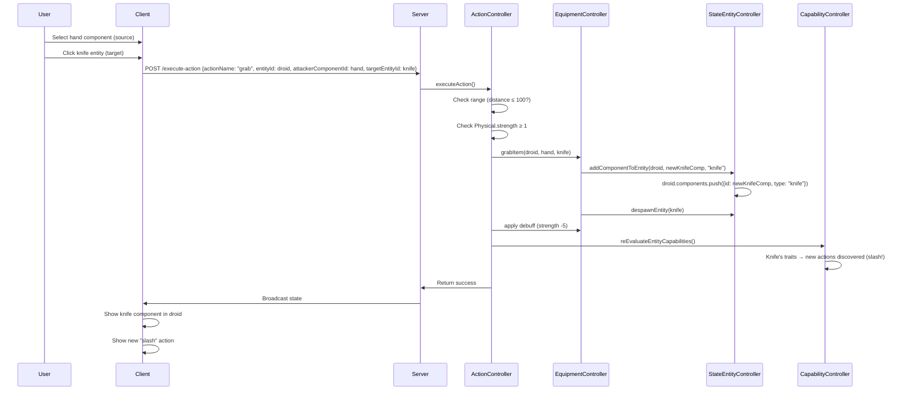

# 🎒 Equipment/Grab System

## 1. Overview

The Equipment/Grab system allows entities to grab item entities (like knives) and add them as components, unlocking new action capabilities based on the item's traits.

**Key Controllers:**
- `EquipmentController`: Manages grabbing items and adding them as components to entities
- `WorldStateController`: Root injector providing access to all sub-controllers

---

## 2. Architecture

```
Client → Server → ActionController.executeAction("grab")
    → ActionController._checkGrabRange() (validate proximity)
    → ConsequenceHandlers._handleGrabItem()
    → EquipmentController.grabItem()
    → ComponentController.initializeComponent() + StateEntityController.addComponentToEntity()
    → ComponentCapabilityController.reEvaluateEntityCapabilities() (new actions available)

Client → Server → ActionController.executeAction("release")
    → ConsequenceHandlers._handleReleaseItem()
    → EquipmentController.releaseItem()
    → StateEntityController.removeComponentFromEntity()
    → ComponentCapabilityController.reEvaluateEntityCapabilities() (item traits no longer available)
```

---

## 3. How It Works

### 3.1. Grab Flow

When a player grabs an item (e.g., knife):

1. **Range Check**: The item must be within the action's `range` property (default: 100 units)
2. **Requirements**: The hand component must meet the action's requirements (e.g., `Physical.strength >= 1`)
3. **Component Addition**: The item's traits become a new component on the entity
4. **Debuff**: The hand suffers a strength debuff from carrying weight
5. **Capability Re-scan**: New actions are discovered based on the item's traits

### 3.2. Release Flow (self_target)

The **release** action is now `targetingType: 'self_target'`, meaning it executes **instantly** when a grabbed item component row is clicked in the action list — no map targeting needed.

1. **Component Removal**: The item component is removed from the entity
2. **Item Respawn**: A new world entity is spawned at the releasing entity's position (+5, +5 offset)
3. **Strength Restoration**: The hand's original strength is restored
4. **Capability Re-scan**: Item traits are no longer available for actions

---

## 4. EquipmentController

### 4.1. Constructor Injection Pattern

```javascript
class EquipmentController {
    constructor(worldStateController) {
        this.worldStateController = worldStateController;
        this._grabRegistry = new Map(); // componentId → GrabEntry
    }
}
```

### 4.2. Key Methods

| Method | Parameters | Returns | Description |
|--------|-----------|---------|-------------|
| `grabItem(entityId, handComponentId, itemEntity)` | `string`, `string`, `Object` | `{ success, componentId? }` | Add item as component to entity |
| `releaseItem(componentId)` | `string` | `{ success, grabInfo?, error? }` | Remove item from entity |
| `getGrabInfo(componentId)` | `string` | `GrabEntry|null` | Get grab tracking info |
| `getGrabInfoByEntity(entityId)` | `string` | `Array<GrabEntry>` | Get all grabs for entity |
| `isHoldingItem(componentId)` | `string` | `boolean` | Check if holding an item |
| `getActiveGrabCount()` | — | `number` | Number of active grabs |
| `releaseEntityGrabs(entityId)` | `string` | `number` | Release all grabs for entity |

### 4.3. Internal State

```javascript
_grabRegistry: Map<componentId, GrabEntry>
// componentId = item component ID on entity
// GrabEntry = { handComponentId, entityId, originalStrength, itemBlueprint, grabbedAt }
```

---

## 5. Action Definitions

### 5.1. Grab Action

```json
"grab": {
  "targetingType": "component",
  "range": 100,
  "componentBinding": {
    "roles": ["source", "target"],
    "sourceRole": "source",
    "targetRole": "target",
    "description": "Grab binds to a Physical component as source (hand) and an item entity as target. The item becomes a component of the entity. The hand suffers a strength debuff from carrying weight."
  },
  "requirements": [
    {
      "trait": "Physical",
      "stat": "strength",
      "minValue": 1
    }
  ],
  "consequences": [
    {
      "type": "grabItem",
      "params": {
        "debuff": { "trait": "Physical", "stat": "strength", "value": -5 }
      }
    },
    {
      "type": "log",
      "level": "info",
      "message": "Entity grabbed item — new capabilities unlocked!"
    }
  ],
  "failureConsequences": [
    {
      "type": "log",
      "level": "warn",
      "message": "Grab failed — item out of range or strength too low"
    }
  ]
}
```

### 5.2. Release Action (self_target)

The release action changed from `targetingType: "component"` to `targetingType: "self_target"`, making it execute instantly on component click (same behavior as selfHeal).

```json
"release": {
  "targetingType": "self_target",
  "componentBinding": {
    "roles": ["self_target"],
    "selfTargetRole": "self_target",
    "description": "Release is a self-targeting action that executes instantly when a grabbed item component is clicked. The item is dropped back into the world and strength is restored."
  },
  "requirements": [],
  "consequences": [
    {
      "type": "releaseItem",
      "params": {}
    },
    {
      "type": "log",
      "level": "info",
      "message": "Entity dropped the held item."
    }
  ],
  "failureConsequences": [
    {
      "type": "log",
      "level": "warn",
      "message": "Release failed — no item equipped"
    }
  ]
}
```

---

## 6. Consequence Handlers

### 6.1. grabItem

```javascript
_handleGrabItem(targetId, params, context) {
    // targetId = hand component ID
    // context.actionParams.entityId = main entity
    // context.actionParams.targetEntityId = item entity being grabbed
    // context.actionParams.attackerComponentId = hand component ID
    
    // 1. Grab item: add as component
    // 2. Apply debuff to hand
    // 3. Re-scan capabilities
}
```

### 6.2. releaseItem

```javascript
_handleReleaseItem(targetId, params, context) {
    // targetId = grabbed item component ID (or hand component ID)
    // Searches grab registry by matching targetId against handComponentId OR componentId
    
    // 1. Find grab info (flexible: matches either hand or item component ID)
    // 2. Release item: remove from entity
    // 3. Respawn item as world entity at releasing entity's position
    // 4. Restore hand strength
    // 5. Re-scan capabilities
}
```

---

## 7. StateEntityController Extensions

### 7.1. addComponentToEntity

```javascript
addComponentToEntity(entityId, componentId, componentType) {
    // Add { id: componentId, type: componentType } to entity.components
    // Returns true on success, false if entity not found
}
```

### 7.2. removeComponentFromEntity

```javascript
removeComponentFromEntity(entityId, componentId) {
    // Remove component with matching ID from entity.components
    // Returns true on success, false if entity/component not found
}
```

### 7.3. spawnEntity (Item Respawn)

When an item is released, it spawns back into the world:

```javascript
spawnEntity(itemBlueprint, roomId) {
    // Create new entity from item blueprint (e.g., "knife")
    // Spawn into same room as releasing entity
    // Returns new entityId
}

updateEntitySpatial(entityId, spatialUpdate) {
    // Set spatial coordinates (used for item respawn offset)
}
```

---

## 8. Range Checking

The `ActionController._checkGrabRange()` method verifies that the target item is within the action's specified range:

```javascript
_checkGrabRange(sourceEntityId, targetEntityId, maxRange) {
    // Calculate Euclidean distance between entities
    // Return { success: true } if within range
    // Return { success: false, error } if too far
}
```

---

## 9. Example: Grabbing a Knife

### Before Grab:
```
Entity: droid-123
Components: [centralBall, droidHead, droidArm(left), droidHand(left), droidRollingBall(left), droidRollingBall(right)]
Actions available: move, dash, selfHeal, droid punch

Item: knife-456
Position: { x: -50, y: 30 }
```

### After Grab (knife within range, hand strength ≥ 1):
```
Entity: droid-123
Components: [centralBall, droidHead, droidArm(left), droidHand(left), droidRollingBall(left), droidRollingBall(right), knife-new-uuid]
Hand strength: 25 → 20 (debuff)
Actions available: move, dash, selfHeal, droid punch, slash (from knife's sharpness!)

Item: knife-456 (despawned — merged into droid-123)
```

### After Release:
```
Entity: droid-123
Components: [centralBall, droidHead, droidArm(left), droidHand(left), droidRollingBall(left), droidRollingBall(right)]
Hand strength: 20 → 25 (restored)
Actions available: move, dash, selfHeal, droid punch

Item: knife-new-uuid (respawned in world at {x: droid.x+5, y: droid.y+5} in same room)
```

---

## 10. Mermaid: Grab Action Flow



---

## 11. Current Implementation Status

| Action | Requirements | Success Consequences | Failure Consequences |
|--------|-------------|---------------------|---------------------|
| move | ✅ Implemented | ✅ Implemented | ✅ Implemented |
| dash | ✅ Implemented | ✅ Implemented | ✅ Implemented |
| selfHeal | ✅ Implemented | ✅ Implemented | ✅ Implemented |
| droid punch | ✅ Implemented | ✅ Implemented | ✅ Implemented |
| **grab** | ✅ Implemented | ✅ Implemented | ✅ Implemented |
| **release** | ✅ Implemented (self_target, executes instantly on component click) | ✅ Implemented | ✅ Implemented |
| **cut** | ✅ Implemented (requires Physical.sharpness ≥ 20) | ✅ Implemented | ✅ Implemented |

---

### 📢 Notice for Future Agents

**Language Requirement:** All source code in this project must be written in **JavaScript**.

**Controller Pattern:** The `EquipmentController` follows the Dependency Injection pattern and should never instantiate its own controllers.

**Consequence Dispatcher:** All consequences are handled through the `ConsequenceHandlers` class. To add a new consequence type:
1. Add a handler method `_handle<Type>()` in `ConsequenceHandlers`
2. Register it in the `handlers` getter
3. Document it in this wiki

**Equipment Registry:** The `_grabRegistry` Map is keyed by item component ID (not hand component ID). Use `getGrabInfoByEntity()` to search by hand component ID.