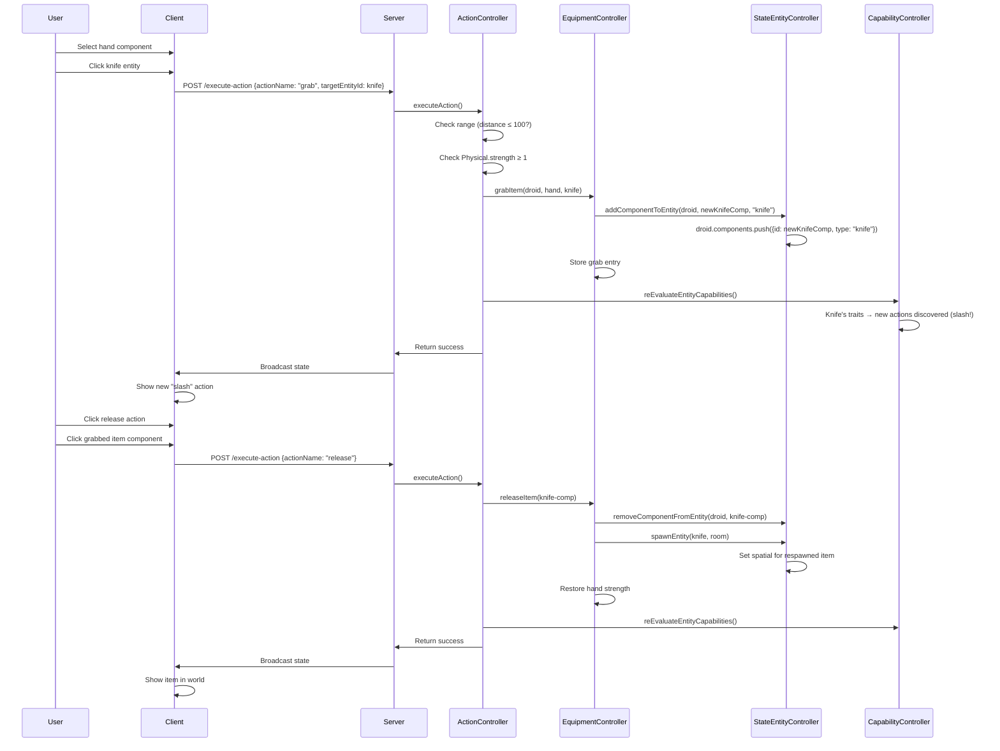

# 🎒 Equipment/Grab System & Inventory

## 1. Overview

The Equipment/Grab system allows entities to grab item entities (like knives) and add them as components, unlocking new action capabilities based on the item's traits.

**Key Controllers:**
- `EquipmentController`: Manages grabbing items and dropping items
- `WorldStateController`: Root injector providing access to all sub-controllers

---

## 2. Architecture

```
Client → Server → ActionController.executeAction("grab")
    → ActionController._checkGrabRange() (validate proximity)
    → ConsequenceHandlers._handleGrabItem()
    → EquipmentController.grabItem()
    → ComponentController.initializeComponent() + StateEntityController.addComponentToEntity()

Client → Server → ActionController.executeAction("release")
    → ConsequenceHandlers._handleReleaseItem()
    → EquipmentController.releaseItem()
    → StateEntityController.removeComponentFromEntity()
```

---

## 3. How It Works

### 3.1. Hand Grab Flow
When a player grabs an item (e.g., knife) with their hand:

1. **Range Check**: The item must be within the action's `range` property (default: 100 units)
2. **Requirements**: The hand component must meet the action's requirements (e.g., `Physical.strength >= 1`)
3. **Component Addition**: The item's traits become a new component on the entity
4. **Debuff**: The hand suffers a strength debuff from carrying weight
5. **Capability Re-scan**: New actions are discovered based on the item's traits

### 3.2. Release Flow (self_target)
The **release** action is `targetingType: 'self_target'`, meaning it executes **instantly** when a grabbed item component row is clicked in the action list — no map targeting needed.

1. **Component Removal**: The item component is removed from the entity
2. **Item Respawn**: A new world entity is spawned at the releasing entity's position (+5, +5 offset)
3. **Strength Restoration**: The hand's original strength is restored
4. **Capability Re-scan**: Item traits are no longer available for actions

---

## 4. EquipmentController

### 4.1. Constructor Injection Pattern

```javascript
class EquipmentController {
    constructor(worldStateController) {
        this.worldStateController = worldStateController;
        this._grabRegistry = new Map(); // componentId → GrabEntry
        this._backpackRegistry = new Map(); // entityId → Array<BackpackEntry>
    }
}
```

### 4.2. Key Methods

| Method | Parameters | Returns | Description |
|--------|-----------|---------|-------------|
| `grabItem(entityId, handComponentId, itemEntity)` | `string`, `string`, `Object` | `{ success, componentId? }` | Add item as component to entity (hand grab) |
| `releaseItem(componentId)` | `string` | `{ success, grabInfo?, error?, spawnedEntityId? }` | Remove hand-grabbed item from entity and respawn in world |
| `releaseBackpackItem(componentId)` | `string` | `{ success, entry?, error?, spawnedEntityId? }` | Remove backpack-stored item from entity and respawn in world |
| `getGrabInfo(componentId)` | `string` | `GrabEntry|null` | Get grab tracking info |
| `getGrabInfoByEntity(entityId)` | `string` | `Array<GrabEntry>` | Get all hand grabs for entity |
| `getBackpackItems(entityId)` | `string` | `Array<BackpackEntry>` | Get all backpack items for entity |
| `getBackpackVolume(entityId, backpackComponentId)` | `string`, `string` | `{ total, used, remaining }` | Get backpack volume info |
| `isHoldingItem(componentId)` | `string` | `boolean` | Check if holding an item |
| `getActiveGrabCount()` | — | `number` | Number of active grabs |
| `releaseEntityGrabs(entityId)` | `string` | `number` | Release all hand grabs for entity |

### 4.3. Internal State

```javascript
// Hand grab registry
_grabRegistry: Map<componentId, GrabEntry>
// componentId = item component ID on entity
// GrabEntry = { handComponentId, entityId, originalStrength, itemBlueprint, grabbedAt }

// Backpack registry
_backpackRegistry: Map<entityId, Array<BackpackEntry>>
// BackpackEntry = { backpackComponentId, componentId, entityId, itemBlueprint, itemVolume, grabbedAt }
// componentId = the item component ID stored in the backpack (added for release tracking)
```

---

## 5. Action Definitions

### 5.1. Grab Action (Hand)

```json
"grab": {
  "targetingType": "component",
  "range": 100,
  "requirements": [
    { "trait": "Physical", "stat": "strength", "minValue": 1 }
  ],
  "consequences": [
    {
      "type": "grabItem",
      "params": { "debuff": { "trait": "Physical", "stat": "strength", "value": -5 } }
    },
    { "type": "log", "level": "info", "message": "Entity grabbed item — new capabilities unlocked!" }
  ],
  "failureConsequences": [
    { "type": "log", "level": "warn", "message": "Grab failed — item out of range or strength too low" }
  ]
}
```

### 5.2. Release Action (self_target)

The release action is `targetingType: 'self_target'`, executing instantly on component click.

```json
"release": {
  "targetingType": "self_target",
  "requirements": [],
  "consequences": [
    { "type": "releaseItem", "params": {} },
    { "type": "log", "level": "info", "message": "Entity dropped the held item." }
  ],
  "failureConsequences": [
    { "type": "log", "level": "warn", "message": "Release failed — no item equipped" }
  ]
}
```

---

## 6. Consequence Handlers

### 6.1. grabItem

```javascript
_handleGrabItem(targetId, params, context) {
    // targetId = hand component ID (source of the grab)
    // context.actionParams.entityId = main entity
    // context.actionParams.targetEntityId = item entity being grabbed
    // context.actionParams.attackerComponentId = hand component ID
    
    // 1. Grab item: add as component
    // 2. Apply debuff to hand
    // 3. Re-scan capabilities
}
```

### 6.2. releaseItem

```javascript
_handleReleaseItem(targetId, params, context) {
    // targetId = hand component ID, item component ID, or backpack component ID
    
    // Step 1: Check grab registry (hand grabs)
    //   Match targetId against handComponentId OR item componentId
    // Step 2: If not found, check backpack registry
    //   Match targetId against backpackEntry.componentId OR backpackComponentId
    // Step 3: Determine release method:
    //   - Hand grab → releaseItem(componentId)
    //   - Backpack item → releaseBackpackItem(componentId)
    // Step 4: Restore hand strength (only for hand grabs, not backpack)
    // Step 5: Re-scan capabilities
}
```

---

## 7. Droid Backpack Component

The **droidBackpack** component is automatically spawned as part of the `smallBallDroid` blueprint.

### 7.1. Component Definition

```json
"droidBackpack": { 
  "traits": { 
    "Physical": { "durability": 70, "mass": 15, "volume": 5 },
    "Spatial": { "x": 0, "y": -10 }
  } 
}
```

### 7.2. Traits

| Trait | Property | Value | Purpose |
|-------|----------|-------|---------|
| **Physical** | `durability` | 70 | Medium-high durability |
| **Physical** | `mass` | 15 | Moderate mass (heavier due to contents) |
| **Physical** | `volume` | 5 | Storage capacity (5 total, 1 per default item) |
| **Spatial** | `x` | 0 | Centered horizontally |
| **Spatial** | `y` | -10 | Positioned slightly above body center |

### 7.3. Blueprint Entry

```json
"smallBallDroid": ["centralBall", "droidBackpack", "droidHead", ["droidArm", "left"], ["droidArm", "right"], ["droidRollingBall", "left"], ["droidRollingBall", "right"]]
```

---

## 8. StateEntityController Extensions

### 8.1. addComponentToEntity

```javascript
addComponentToEntity(entityId, componentId, componentType) {
    // Add { id: componentId, type: componentType } to entity.components
    // Returns true on success, false if entity not found
}
```

### 8.2. removeComponentFromEntity

```javascript
removeComponentFromEntity(entityId, componentId) {
    // Remove component with matching ID from entity.components
    // Returns true on success, false if entity/component not found
}
```

---

## 9. Example: Grabbing a Knife

### Before Grab:
```
Entity: droid-123
Components: [centralBall, droidBackpack, droidHead, droidArm(left), droidHand(left), droidRollingBall(left), droidRollingBall(right)]
Actions available: move, dash, selfHeal, droid punch

Item: knife-456
Position: { x: -50, y: 30 }
```

### After Grab (hand grab, knife within range, hand strength ≥ 1):
```
Entity: droid-123
Components: [centralBall, droidBackpack, droidHead, droidArm(left), droidHand(left), droidRollingBall(left), droidRollingBall(right), knife-new-uuid]
Hand strength: 25 → 20 (debuff)
Actions available: move, dash, selfHeal, droid punch, slash (from knife's sharpness!)
```

---

## 10. Mermaid: Complete Flow



---

## 11. Current Implementation Status

| Action | Requirements | Success Consequences | Failure Consequences |
|--------|-------------|---------------------|---------------------|
| move | ✅ Implemented | ✅ Implemented | ✅ Implemented |
| dash | ✅ Implemented | ✅ Implemented | ✅ Implemented |
| selfHeal | ✅ Implemented | ✅ Implemented | ✅ Implemented |
| droid punch | ✅ Implemented | ✅ Implemented | ✅ Implemented |
| **grab** | ✅ Implemented | ✅ Implemented | ✅ Implemented |
| **release** | ✅ Implemented (self_target) | ✅ Implemented | ✅ Implemented |
| **cut** | ✅ Implemented (requires Physical.sharpness ≥ 20) | ✅ Implemented | ✅ Implemented |

---

### 📢 Notice for Future Agents

**Language Requirement:** All source code in this project must be written in **JavaScript**.

**Controller Pattern:** The `EquipmentController` follows the Dependency Injection pattern and should never instantiate its own controllers.

**Consequence Dispatcher:** All consequences are handled through the `ConsequenceHandlers` class. To add a new consequence type:
1. Add a handler method `_handle<Type>()` in `ConsequenceHandlers`
2. Register it in the `handlers` getter
3. Document it in this wiki

**Equipment Registry:** 
- `_grabRegistry` Map is keyed by item component ID (not hand component ID). Use `getGrabInfoByEntity()` to search by hand component ID.
- `_backpackRegistry` Map is keyed by entity ID. Use `getBackpackItems(entityId)` to get all backpack items.
- Backpack entries now include `componentId` (the item component ID) for proper release tracking.

**Release Flow:**
- `releaseItem(componentId)` only handles hand-grabbed items (from `_grabRegistry`)
- `releaseBackpackItem(componentId)` handles backpack-stored items (from `_backpackRegistry`)
- `_handleReleaseItem` checks both registries — first `_grabRegistry`, then `_backpackRegistry`
- Backpack releases do NOT restore hand strength (no debuff applied for backpack grabs)