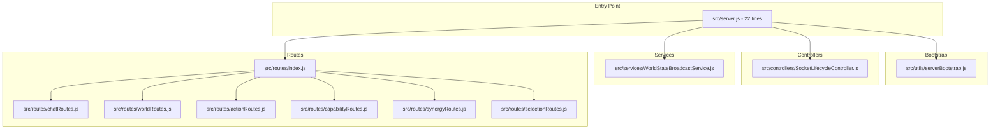

# Server Splitting Architecture

This wiki documents the modular server architecture where `src/server.js` was split into multiple single-responsibility modules.

## Overview

The original `src/server.js` (455 lines) was refactored following the **Single Responsibility Principle** and **Dependency Injection patterns** defined in `wiki/subMDs/controller_patterns.md`.

## Architecture Diagram



## File Structure

| File | Lines | Responsibility |
|------|-------|----------------|
| `src/server.js` | ~22 | Minimal entry point, controller initialization |
| `src/utils/serverBootstrap.js` | ~25 | Express app, HTTP server, Socket.IO setup |
| `src/controllers/SocketLifecycleController.js` | ~95 | Socket connection, incarnation, disconnect, error handling |
| `src/services/WorldStateBroadcastService.js` | ~35 | Broadcasting world state to clients |
| `src/routes/index.js` | ~20 | Router composition, route registration |
| `src/routes/chatRoutes.js` | ~30 | POST /chat |
| `src/routes/worldRoutes.js` | ~75 | GET /world-state, GET /rooms, POST /move-entity |
| `src/routes/actionRoutes.js` | ~85 | GET /actions, POST /execute-action |
| `src/routes/capabilityRoutes.js` | ~105 | GET/POST /action-capabilities/*, POST /refresh-entity-capabilities |
| `src/routes/synergyRoutes.js` | ~110 | GET/POST /synergy/* |
| `src/routes/selectionRoutes.js` | ~120 | GET/POST /select-component*, POST /release-selection, GET /selections/* |

## Route Dependencies

| Route File | Dependencies |
|------------|-------------|
| `chatRoutes.js` | `llmController` |
| `worldRoutes.js` | `worldStateController`, `broadcastService` |
| `actionRoutes.js` | `worldStateController`, `broadcastService` |
| `capabilityRoutes.js` | `worldStateController` |
| `synergyRoutes.js` | `worldStateController` |
| `selectionRoutes.js` | `worldStateController` |

## Route Registration Pattern

Each route file exports a `register(router, deps)` function:

```javascript
export function register(router, { worldStateController, broadcastService }) {
    router.get('/path', (req, res) => { ... });
    router.post('/path', (req, res) => { ... });
}
```

The index file composes all routes:

```javascript
export function registerRoutes(app, llmController, worldStateController, broadcastService) {
    const router = express.Router();
    registerChatRoutes(router, { llmController });
    registerWorldRoutes(router, { worldStateController, broadcastService });
    // ... etc
    app.use('/', router);
}
```

## Quality Standards Compliance

- **SRP**: Each module has exactly one reason to change
- **DI Pattern**: All dependencies injected via constructor (controllers) or function parameters (routes)
- **Logger**: All modules use centralized `Logger` utility (`src/utils/Logger.js`)
- **Public API**: All routes use `WorldStateController` public methods only
- **Error Handling**: Consistent try/catch + Logger.error pattern across all endpoints
- **Input Validation**: All POST endpoints validate required fields before processing

## References

- [Controller Patterns](controller_patterns.md)
- [Server-Client Architecture](server_client_architecture.md)
- [Code Quality and Best Practices](../code_quality_and_best_practices.md)