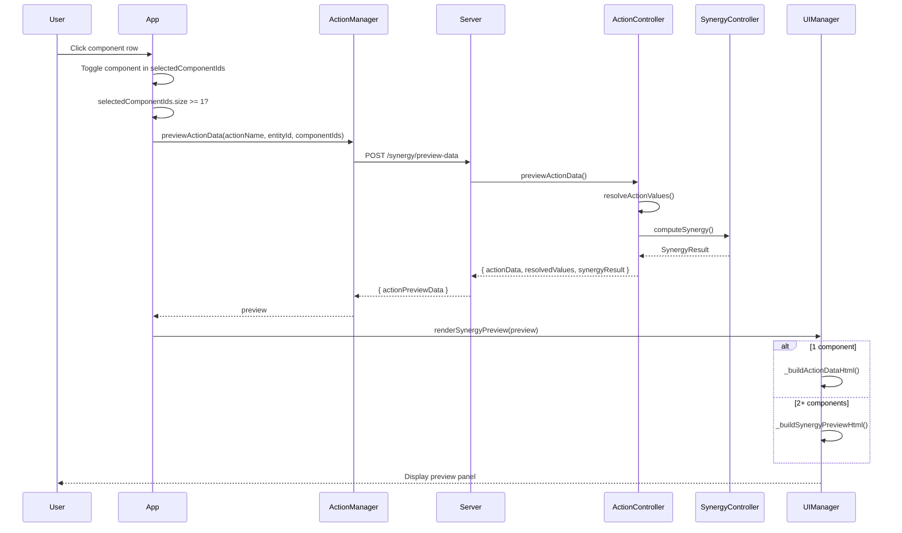

# Enhanced Synergy Preview System

## Overview

The synergy preview system displays action information and synergy effects in real-time as the user selects components. It uses a **two-mode display** based on the number of components selected.

## Display Modes

### Mode 1: Single Component (Action Data Preview)

When **1 component** is selected, the preview shows the action's raw data:

```
┌─────────────────────────────────┐
│ 📋 Action: droid punch          │
│ Range: 100                      │
│                                 │
│ Consequences:                   │
│ 🔴 damageComponent: → -25       │
│ ℹ️ log: Droid performed a...    │
│                                 │
│ Requirements:                   │
│ ⚙ Physical.strength: ≥ 1        │
└─────────────────────────────────┘
```

**Displayed fields:**
- `range` (if defined in action)
- `consequences` with resolved values (e.g., `:Physical.strength` → `-25`)
- `requirements` with minimum values

### Mode 2: Multi-Component (Synergy Preview)

When **2+ components** are selected, the preview shows synergy effects:

```
┌─────────────────────────────────┐
│ ⚡ Synergy: 1.300x (+30%)        │
│                                 │
│ Modified Values:                │
│ 💥 damageComponent: 15 → 20     │
│    (+30%)                       │
│                                 │
│ Contributing Components:        │
│ • droidHand (a1b2c3d4)          │
│ • droidHand (e5f6g7h8)          │
│                                 │
│ Summary: 2 components, synergy  │
└─────────────────────────────────┘
```

**Displayed fields:**
- Synergy multiplier with bonus percentage
- Each consequence with **before → after** values
- Contributing components list
- Cap warning (if applicable)
- Human-readable summary

---

## API Endpoints

### POST /synergy/preview-data

Enhanced synergy preview endpoint that returns action data, resolved values, and synergy.

**Request:**
```json
{
  "actionName": "dash",
  "entityId": "abc123",
  "componentIds": [
    { "componentId": "comp1", "role": "source" },
    { "componentId": "comp2", "role": "source" }
  ]
}
```

**Response:**
```json
{
  "actionPreviewData": {
    "actionData": {
      "targetingType": "spatial",
      "range": 100,
      "requirements": [...],
      "consequences": [...]
    },
    "resolvedValues": {
      "deltaSpatial": { "speed": 20 },
      "updateComponentStatDelta": { "trait": "Physical", "stat": "durability", "value": -5 }
    },
    "synergyResult": {
      "actionName": "dash",
      "baseValue": 1.0,
      "synergyMultiplier": 1.5,
      "finalValue": 1.5,
      "capped": false,
      "capKey": null,
      "contributingComponents": [
        {
          "componentId": "comp1",
          "entityId": "entity1",
          "componentType": "droidRollingBall",
          "contribution": 0.75,
          "role": "source"
        },
        {
          "componentId": "comp2",
          "entityId": "entity1",
          "componentType": "droidRollingBall",
          "contribution": 0.75,
          "role": "source"
        }
      ],
      "summary": "Synergy: 1.50x, 2 components"
    }
  }
}
```

### POST /synergy/preview (Legacy)

Original synergy-only preview endpoint. Still functional for backward compatibility.

**Response:** `{ "synergyResult": { ... } }`

---

## Data Flow



---

## Backend Implementation

### ActionController Methods

#### `resolveActionValues(actionName, componentId, entityId)`

Resolves placeholder values (e.g., `:Physical.strength`) in action consequences for a given component.

**Returns:** `{ [consequenceType]: { trait, stat, value } }`

#### `previewActionData(actionName, entityId, context)`

Returns complete preview data including action definition, resolved values, and synergy.

**Parameters:**
- `actionName`: The action name
- `entityId`: The entity ID
- `context`: Optional `{ providedComponentIds: [...] }`

**Returns:** `{ actionData, resolvedValues, synergyResult }`

### WorldStateController Method

#### `previewActionData(actionName, entityId, context)`

Public API wrapper for `ActionController.previewActionData()`.

---

## Frontend Implementation

### ActionManager Method

#### `previewActionData(actionName, entityId, componentIds)`

Sends `POST /synergy/preview-data` to the server.

**Parameters:**
- `actionName`: The action name
- `entityId`: The entity ID
- `componentIds`: Array of `{ componentId, role }`

**Returns:** Promise resolving to preview data or null

### UIManager Methods

#### `renderSynergyPreview(preview)`

Main entry point. Routes to mode-specific builders based on component count.

#### `_buildActionDataHtml(actionData, resolvedValues)`

Builds HTML for single-component action data preview.

#### `_buildSynergyPreviewHtml(actionData, resolvedValues, synergyResult)`

Builds HTML for multi-component synergy preview with modified values.

#### `_applySynergyToValue(baseValue, multiplier)`

Applies synergy multiplier to a numeric value. For negative values (damage), synergy increases magnitude.

### App.js Methods

#### `_updateSynergyPreview(entityId)`

Called after component toggle. Fetches preview for 1+ selected components.

---

## CSS Classes

The preview system uses these CSS classes (defined in `public/styles.css`):

| Class | Purpose |
|-------|---------|
| `.synergy-preview-display` | Container for preview panel |
| `.synergy-header` | Header section with multiplier |
| `.synergy-multiplier` | Synergy multiplier text |
| `.action-data-preview` | Container for action data mode |
| `.action-data-row` | Individual data row |
| `.action-data-label` | Label (e.g., "Range:") |
| `.action-data-value` | Value (e.g., "100") |
| `.synergy-values-section` | Container for modified values |
| `.synergy-value-row` | Individual value change row |
| `.synergy-value-base` | Original value |
| `.synergy-value-arrow` | Arrow symbol (→) |
| `.synergy-value-final` | Synergy-applied value |
| `.synergy-value-bonus` | Bonus percentage |
| `.bonus-positive` | Green bonus text |
| `.bonus-negative` | Red penalty text |
| `.synergy-component` | Individual contributing component |
| `.synergy-cap-warning` | Cap warning message |
| `.synergy-summary` | Human-readable summary |

---

## Design Decisions

1. **Single endpoint for both modes**: The `/synergy/preview-data` endpoint returns all data for both modes. The frontend decides what to display based on component count.

2. **Resolved values are pre-computed**: The backend resolves placeholders (e.g., `:Physical.strength` → `25`) so the frontend doesn't need to know about placeholder syntax.

3. **Synergy multiplier applied client-side**: The preview shows `baseValue * synergyMultiplier` computed in the frontend for instant feedback without additional server round-trips.

4. **Bonus percentage**: Calculated as `(multiplier - 1) * 100` and displayed as `+X%`.

---

**Last Updated:** 2026-04-26
**Related Documentation:**
- [`wiki/subMDs/synergy_system.md`](../subMDs/synergy_system.md)
- [`wiki/subMDs/client_action_execution.md`](../subMDs/client_action_execution.md)
- [`wiki/CORE.md`](../CORE.md)