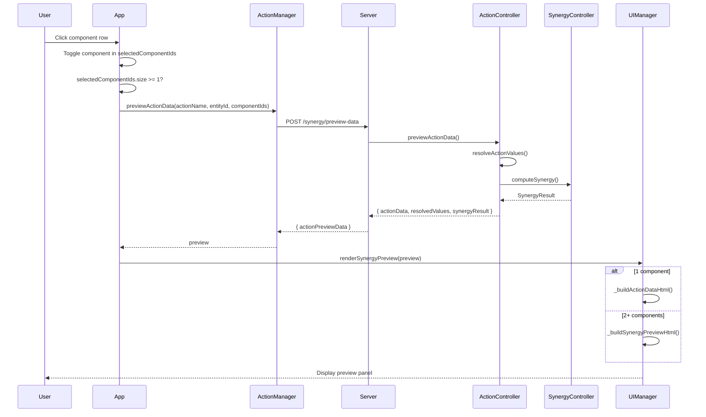

# Enhanced Synergy Preview System

## Overview

The synergy preview system displays action information and synergy effects in real-time as the user selects components. It uses a **two-mode display** based on the number of components selected.

## Display Modes

### Mode 1: Single Component (Action Data Preview)

When **1 component** is selected, the preview shows the action's raw data:

```
┌─────────────────────────────────┐
│ 📋 Action: droid punch          │
│ Range: 100                      │
│                                 │
│ Consequences:                   │
│ 🔴 damageComponent: → -25       │
│ ℹ️ log: Droid performed a...    │
│                                 │
│ Requirements:                   │
│ ⚙ Physical.strength: ≥ 1        │
└─────────────────────────────────┘
```

**Displayed fields:**
- `range` (if defined in action)
- `consequences` with resolved values (e.g., `:Physical.strength` → `-25`)
- `requirements` with minimum values

### Mode 2: Multi-Component (Synergy Preview)

When **2+ components** are selected, the preview shows synergy effects:

```
┌─────────────────────────────────┐
│ ⚡ Synergy: 1.300x (+30%)        │
│                                 │
│ Modified Values:                │
│ 💥 damageComponent: 15 → 20     │
│    (+30%)                       │
│                                 │
│ Contributing Components:        │
│ • droidHand (a1b2c3d4)          │
│ • droidHand (e5f6g7h8)          │
│                                 │
│ Summary: 2 components, synergy  │
└─────────────────────────────────┘
```

**Displayed fields:**
- Synergy multiplier with bonus percentage
- Each consequence with **before → after** values
- Contributing components list
- Cap warning (if applicable)
- Human-readable summary

---

## API Endpoints

### POST /synergy/preview-data

Enhanced synergy preview endpoint that returns action data, resolved values, and synergy.

**Request:**
```json
{
  "actionName": "dash",
  "entityId": "abc123",
  "componentIds": [
    { "componentId": "comp1", "role": "source" },
    { "componentId": "comp2", "role": "source" }
  ]
}
```

**Response:**
```json
{
  "actionPreviewData": {
    "actionData": {
      "_name": "dash",
      "targetingType": "spatial",
      "range": 100,
      "requirements": [...],
      "consequences": [...]
    },
    "resolvedValues": {
      "deltaSpatial": { "speed": 20 },
      "updateComponentStatDelta": { "trait": "Physical", "stat": "durability", "value": -5 }
    },
    "synergyResult": {
      "actionName": "dash",
      "baseValue": 1.0,
      "synergyMultiplier": 1.5,
      "finalValue": 1.5,
      "capped": false,
      "capKey": null,
      "contributingComponents": [
        {
          "componentId": "comp1",
          "entityId": "entity1",
          "componentType": "droidRollingBall",
          "contribution": 0.75,
          "role": "source"
        },
        {
          "componentId": "comp2",
          "entityId": "entity1",
          "componentType": "droidRollingBall",
          "contribution": 0.75,
          "role": "source"
        }
      ],
      "summary": "Synergy: 1.50x, 2 components"
    }
  }
}
```

### POST /synergy/preview (Legacy)

Original synergy-only preview endpoint. Still functional for backward compatibility.

**Response:** `{ "synergyResult": { ... } }`

---

## Data Flow


```mermaid
sequenceDiagram
    participant User
    participant App
    participant ActionManager
    participant Server
    participant ActionController
    participant SynergyController

    User->>App: Click component row
    App->>App: Toggle component in selectedComponentIds
    App->>App: selectedComponentIds.size >= 1?
    App->>ActionManager: previewActionData(actionName, entityId, componentIds)
    ActionManager->>Server: POST /synergy/preview-data
    Server->>ActionController: previewActionData()
    ActionController->>ActionController: resolveActionValues()
    ActionController->>SynergyController: computeSynergy()
    SynergyController-->>ActionController: SynergyResult
    ActionController-->>Server: { actionData, resolvedValues, synergyResult }
    Server-->>ActionManager: { actionPreviewData }
    ActionManager-->>App: preview
    App->>UIManager: renderSynergyPreview(preview)
    
    alt 1 component
        UIManager->>UIManager: _buildActionDataHtml()
    else 2+ components
        UIManager->>UIManager: _buildSynergyPreviewHtml()
    end
    UIManager-->>User: Display preview panel
```

---

## Backend Implementation

### ActionController Methods

#### `resolveActionValues(actionName, componentId, entityId)`

Resolves placeholder values (e.g., `:Physical.strength`) in action consequences for a given component.

**Returns:** `{ [consequenceType]: { trait, stat, value } }`

#### `previewActionData(actionName, entityId, context)`

Returns complete preview data including action definition, resolved values, and synergy.

**Parameters:**
- `actionName`: The action name
- `entityId`: The entity ID
- `context`: Optional `{ providedComponentIds: [...] }`

**Returns:** `{ actionData, resolvedValues, synergyResult }`

### WorldStateController Method

#### `previewActionData(actionName, entityId, context)`

Public API wrapper for `ActionController.previewActionData()`.

---

## Frontend Implementation

### ActionManager Method

#### `previewActionData(actionName, entityId, componentIds)`

Sends `POST /synergy/preview-data` to the server.

**Parameters:**
- `actionName`: The action name
- `entityId`: The entity ID
- `componentIds`: Array of `{ componentId, role }`

**Returns:** Promise resolving to preview data or null

### UIManager Methods

#### `renderSynergyPreview(preview)`

Main entry point. Routes to mode-specific builders based on component count.

#### `_buildActionDataHtml(actionData, resolvedValues)`

Builds HTML for single-component action data preview.

#### `_buildSynergyPreviewHtml(actionData, resolvedValues, synergyResult)`

Builds HTML for multi-component synergy preview with modified values.

#### `_applySynergyToValue(baseValue, multiplier)`

Applies synergy multiplier to a numeric value. For negative values (damage), synergy increases magnitude.

### App.js Methods

#### `_updateSynergyPreview(entityId)`

Called after component toggle. Fetches preview for 1+ selected components.

---

## CSS Classes

The preview system uses these CSS classes (defined in `public/styles.css`):

| Class | Purpose |
|-------|---------|
| `.synergy-preview-display` | Container for preview panel |
| `.synergy-header` | Header section with multiplier |
| `.synergy-multiplier` | Synergy multiplier text |
| `.action-data-preview` | Container for action data mode |
| `.action-data-row` | Individual data row |
| `.action-data-label` | Label (e.g., "Range:") |
| `.action-data-value` | Value (e.g., "100") |
| `.synergy-values-section` | Container for modified values |
| `.synergy-value-row` | Individual value change row |
| `.synergy-value-base` | Original value |
| `.synergy-value-arrow` | Arrow symbol (→) |
| `.synergy-value-final` | Synergy-applied value |
| `.synergy-value-bonus` | Bonus percentage |
| `.bonus-positive` | Green bonus text |
| `.bonus-negative` | Red penalty text |
| `.synergy-component` | Individual contributing component |
| `.synergy-cap-warning` | Cap warning message |
| `.synergy-summary` | Human-readable summary |

---

## Design Decisions

1. **Single endpoint for both modes**: The `/synergy/preview-data` endpoint returns all data for both modes. The frontend decides what to display based on component count.

2. **Resolved values are pre-computed**: The backend resolves placeholders (e.g., `:Physical.strength` → `25`) so the frontend doesn't need to know about placeholder syntax.

3. **Synergy multiplier applied client-side**: The preview shows `baseValue * synergyMultiplier` computed in the frontend for instant feedback without additional server round-trips.

4. **Bonus percentage**: Calculated as `(multiplier - 1) * 100` and displayed as `+X%`.

5. **Component deduplication**: Each component appears at most once in `contributingComponents`, even if it matches multiple synergy groups. Deduplication is performed in `SynergyController._evaluateProvidedComponents()` and `SynergyController._evaluateComponentGroups()` by filtering on `componentId`.

6. **Synergy-aware range indicator**: The frontend `_calculateActionRange()` applies the synergy multiplier to movement stats. When 2+ components are selected with synergy, the range indicator reflects the boosted effective move distance: `effectiveMove = maxMoveStat * synergyMultiplier`.

## Internal Component Impact on Synergy Preview

### Overview
The synergy preview system reflects the **current state** of component stats at the exact moment a preview request is processed. Since internal components (e.g., `durabilityRepairSphere`) modify host component stats on a recurring basis, the values shown in synergy previews may differ slightly between requests if an internal component tick occurred in between.

### Key Principles

| Aspect | Detail |
|--------|--------|
| **Direct Participation** | Internal components are NOT included in synergy preview calculations |
| **Indirect Impact** | Repair system modifies host component `Physical.durability` every 5 seconds, which can affect component scores in synergy calculations |
| **Internal Component Traits** | `durabilityRepairSphere.traits.Physical.durability = 50` and `traits.Physical.mass = 5` are NOT merged into host component stats and NOT included in synergy scoring |
| **Scoring Source** | Only the host component's current effective stats (from `getComponentStats(componentId)`) are used for synergy scoring |

### Configuration

Internal component definitions are in `data/internalComponents.json`:

```json
{
  "durabilityRepairSphere": {
    "volume": 2,
    "repairInterval": 5,
    "repairAmount": 1,
    "traits": {
      "Physical": { "mass": 5, "durability": 50 }
    },
    "excludedComponentTypes": ["humanoidDroidFinger"],
    "autoInstallOnSpawn": true
  }
}
```

**Fields affecting synergy indirectly:** `repairAmount` (how much durability increases), `repairInterval` (timing of repairs)
**Fields excluded from synergy:** `traits.Physical.mass`, `traits.Physical.durability` (internal component's own traits are NOT merged into host)

### Repair System Interaction

The `durabilityRepairSphere` internal component runs every **5 seconds** and increases the `Physical.durability` stat of its host component. This means:

1. **Preview values are a snapshot in time**: Each synergy preview request captures the component stats at the moment of calculation. If a repair tick occurred between two preview requests, durability values may differ.
2. **Internal components are NOT included in synergy preview calculations**: The synergy preview shows the host component's effective stats, which may have been boosted by recent repair ticks.
3. **Indirect impact**: Higher durability values from repair can affect component scores in synergy calculations, but the internal component itself is not a synergy participant.

### Timing Considerations

| Scenario | Effect |
|----------|--------|
| Entity with 5+ repair spheres | +5 durability every 5 seconds — preview values increase over time |
| Entity with 0 repair spheres | No repair effect — preview values remain stable |
| Entity under heavy damage | Repair may lag behind damage — preview values may decrease |
| Entity with durability > 100 | No practical benefit from further repairs — preview values capped |

### Example

For a `dash` action preview on an entity with `durabilityRepairSphere`:

```
Request at T=0s:    Physical.durability = 80 → synergy preview shows base values
Request at T=5s:    Physical.durability = 85 → synergy preview shows +5 durability
Request at T=10s:   Physical.durability = 90 → synergy preview shows +10 durability
```

**Note**: The `speed` property for `deltaSpatial` consequences is **not** affected by durability repairs — only actions that depend on `Physical.durability` thresholds (e.g., `dash` requires `Physical.durability > 30`) may show capability changes.

## deltaSpatial Consequence Handling

The `deltaSpatial` consequence uses a `speed` property instead of `value`:

| Consequence Type | Property | Example |
|-----------------|----------|---------|
| `deltaSpatial` | `speed` | `{ "speed": 20 }` |
| `updateComponentStatDelta` | `value` | `{ "value": -5 }` |
| `damageComponent` | `value` | `{ "value": -25 }` |

The frontend `UIManager._buildActionDataHtml()` and `UIManager._buildSynergyPreviewHtml()` methods handle both property formats:
- For `deltaSpatial`: checks `baseResolved.speed`
- For other consequences: checks `baseResolved.value`

## Known Fixes

### Fix: deltaSpatial Speed Property Rendering (2026-04-29)

**Problem:** `deltaSpatial` uses `speed` property (e.g., `{ "speed": 20 }`) instead of `value`, but the frontend checked `baseResolved.value` which was undefined.

**Solution:** Modified `UIManager._buildActionDataHtml()` and `UIManager._buildSynergyPreviewHtml()` to handle `deltaSpatial`'s `speed` property.

### Fix: Synergy-Aware Range Indicator (2026-04-29)

**Problem:** The range indicator did not reflect the synergy multiplier when 2+ components were selected. The move/dash range was calculated from raw `Movement.move` stat only.

**Solution:** Added `currentSynergyResult` property to `ClientApp` and updated `_calculateActionRange()` to accept a `synergyMultiplier` parameter. The range is now: `effectiveMove = maxMoveStat * synergyMultiplier`, and for dash: `effectiveMove * DASH_RANGE_MULTIPLIER`.

---

**Last Updated:** 2026-04-29
**Related Documentation:**
- [`wiki/subMDs/synergy_system.md`](../subMDs/synergy_system.md)
- [`wiki/subMDs/client_action_execution.md`](../subMDs/client_action_execution.md)
- [`wiki/CORE.md`](../CORE.md)
