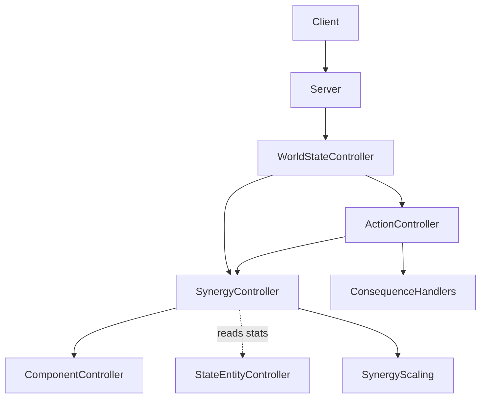
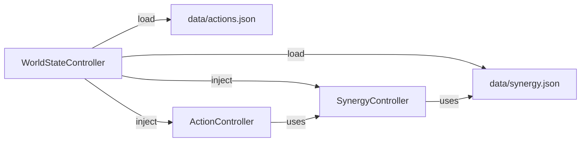
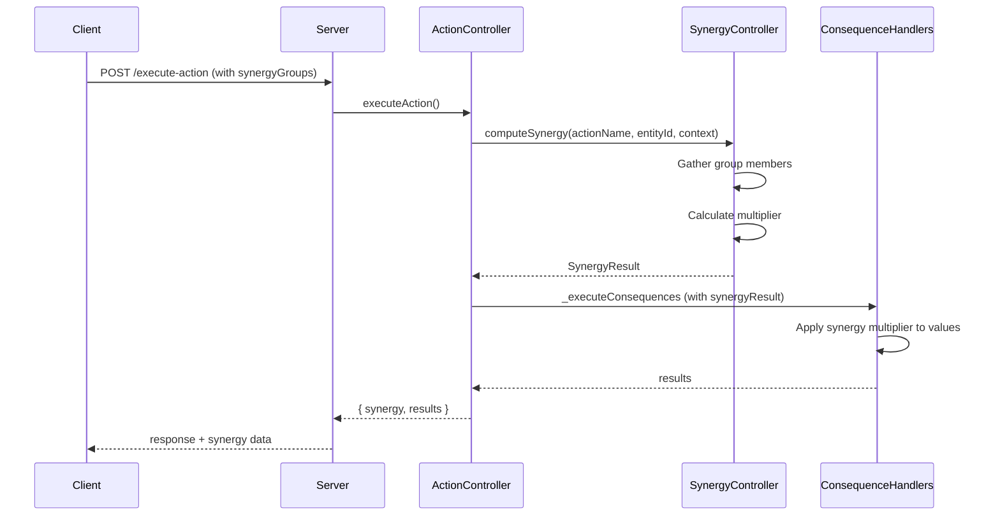

# Synergy System

## Overview

The Synergy System computes combined effect multipliers when multiple components or entities collaborate on a single action. It plugs into the existing action execution pipeline, modifying the final outcome ("X") based on component compositions and multi-entity collaborations.

## What is "X"?

"X" is the **effective output value** of an action consequence — e.g., the actual damage dealt, the actual movement speed, or the actual healing amount. The synergy system modifies these values before consequences are applied.

## Architecture



### Data Loading Flow



**Key Change**: Synergy configurations are **decoupled** from action definitions and loaded from a standalone `data/synergy.json` file. This follows the Single Responsibility Principle — actions define *what they do*, synergy defines *how components/entities collaborate*.

## Components

### 1. SynergyController (`src/controllers/synergyController.js`)

The main controller that computes synergy multipliers for actions.

**Constructor Signature:**
```javascript
constructor(worldStateController, actionRegistry, synergyRegistry)
```

- `worldStateController`: Root state controller (injected)
- `actionRegistry`: Full action registry from `data/actions.json`
- `synergyRegistry`: Synergy registry from `data/synergy.json` (optional — auto-loaded if not provided)

**Key Responsibilities:**
- Compute single-entity component group synergy
- Compute multi-entity collaboration synergy
- Apply caps to computed multipliers
- Build human-readable summaries

**Public API:**

| Method | Parameters | Returns | Description |
|--------|-----------|---------|-------------|
| `computeSynergy()` | `actionName, entityId, context` | `SynergyResult` | Main entry — computes synergy for an action |
| `computeMultiEntitySynergy()` | `actionName, groupDef, config` | `{multiplier, components}` | Multi-entity collaboration |
| `applySynergyToResult()` | `synergyResult, baseValue` | `number` | Caps and applies multiplier |
| `getSynergySummary()` | `synergyResult` | `string` | Human-readable summary |
| `getSynergyConfig()` | `actionName` | `SynergyConfig` | Get synergy config for an action |
| `getActionsWithSynergy()` | — | `string[]` | All actions with synergy enabled |
| `clearCache()` | — | — | Clear the synergy cache |

### 2. SynergyScaling (`src/utils/SynergyScaling.js`)

Provides three scaling curve functions:

| Curve | Formula | Use Case |
|-------|---------|----------|
| `linear` | `base + bonus * (count - 1)` | Simple additive bonus |
| `diminishingReturns` | `base + bonus * (1 - e^(-2*(count-1)))` | Saturation curves (e.g., shooting) |
| `increasingReturns` | `base + bonus * (count-1)^1.5` | Accelerating curves (e.g., combos) |

## Data Model

### Standalone Synergy Definition (`data/synergy.json`)

Synergy configs are now in a separate file from actions:

```json
{
  "actionName": {
    "enabled": true,
    "multiEntity": false,
    "scaling": "linear",
    "caps": {
      "effectKey": { "max": 1.25, "req": "trait.stat" }
    },
    "componentGroups": [
      {
        "groupType": "sameComponentType",
        "minCount": 2,
        "scaling": "diminishingReturns",
        "baseMultiplier": 1.0,
        "perUnitBonus": 0.05
      }
    ]
  }
}
```

### Action Definition (`data/actions.json`) — No Synergy

Actions no longer contain synergy blocks:

```json
{
  "actionName": {
    "targetingType": "spatial",
    "requirements": [...],
    "consequences": [...],
    "failureConsequences": [...]
  }
}
```

### SynergyResult Object

```javascript
{
  actionName: string,           // The action this synergy applies to
  baseValue: number,            // Original consequence value
  synergyMultiplier: number,    // Computed multiplier (> 1.0 = bonus)
  finalValue: number,           // After caps
  capped: boolean,              // Whether the value was capped
  capKey: string | null,        // Which cap was applied
  contributingComponents: [     // List of contributors
    { componentId, entityId, componentType, contribution }
  ],
  summary: string               // "Synergy: 1.35x, 2 entities, 3 components"
}
```

## Group Types

| Type | Description | Example |
|------|-------------|---------|
| `sameComponentType` | Same component type on entity | 2x droidRollingBall |
| `movementComponents` | All components with Movement trait | droidRollingBall + any move component |
| `anyPhysical` | All components with Physical trait | droidHand + droidArm |
| `anyComponent` | All components on entity | Everything |

## Scaling Examples

### Shooting with a Weapon (Diminishing Returns)

```json
{
  "enabled": true,
  "caps": {
    "precision": { "max": 1.25, "req": "Physical.stability" },
    "damage": { "max": 1.1, "req": "Physical.stability" },
    "range": { "max": 1.1, "req": "Physical.stability" },
    "reloadSpeed": { "max": 4.0, "req": "Mind.fineMotorSkills" }
  },
  "componentGroups": [{
    "groupType": "sameComponentType",
    "minCount": 2,
    "scaling": "diminishingReturns",
    "baseMultiplier": 1.0,
    "perUnitBonus": 0.05
  }]
}
```

### Opening a Door (Infinite Speed, Multi-Entity)

```json
{
  "enabled": true,
  "multiEntity": true,
  "scaling": "linear",
  "caps": { "speed": { "max": null } },
  "componentGroups": [{
    "groupType": "anyPhysical",
    "minCount": 1,
    "baseMultiplier": 1.0,
    "perUnitBonus": 0.5
  }]
}
```

### Picking Up a Box (Linear Strength Scale)

```json
{
  "enabled": true,
  "multiEntity": true,
  "scaling": "linear",
  "componentGroups": [{
    "groupType": "sameComponentType",
    "minCount": 1,
    "baseMultiplier": 1.0,
    "perUnitBonus": 1.0,
    "synergyStat": "Physical.strength"
  }]
}
```

### Picking Up a Rock (Multi-Member Cap)

```json
{
  "enabled": true,
  "multiEntity": true,
  "scaling": "diminishingReturns",
  "caps": { "liftCapacity": { "max": 500 } },
  "componentGroups": [{
    "groupType": "sameComponentType",
    "minCount": 1,
    "baseMultiplier": 1.0,
    "perUnitBonus": 0.8
  }]
}
```

### Running (Diminishing Returns)

```json
{
  "enabled": true,
  "scaling": "diminishingReturns",
  "componentGroups": [{
    "groupType": "movementComponents",
    "minCount": 1,
    "baseMultiplier": 1.0,
    "perUnitBonus": 0.3
  }]
}
```

## Multi-Entity Collaboration

### How It Works

Multiple entities can collaborate on a single action. The client sends synergy groups with primary and supporting entities:

```json
{
  "actionName": "dash",
  "entityId": "entity-1",
  "params": {
    "synergyGroups": [
      {
        "primaryEntityId": "entity-1",
        "primaryComponentId": "droidRollingBall-1",
        "supportingEntityIds": ["entity-2"],
        "supportingComponentIds": ["droidRollingBall-2"],
        "perUnitBonus": 0.5
      }
    ]
  }
}
```

### Flow



## Integration Points

### ActionController Integration

```javascript
// In ActionController.executeAction():
const synergyResult = this.synergyController.computeSynergy(
  actionName, entityId, { synergyGroups: params?.synergyGroups }
);

// In _executeConsequences():
// Apply synergy multiplier to numeric consequence values
if (synergyResult && synergyResult.synergyMultiplier > 1.0) {
  resolvedParams.value = synergyController.applySynergyToResult(
    synergyResult, baseValue
  );
}
```

### Server Endpoints

| Endpoint | Method | Description |
|----------|--------|-------------|
| `/synergy/actions` | GET | All actions with synergy enabled |
| `/synergy/config/:actionName` | GET | Synergy config for an action |
| `/synergy/preview` | POST | Preview synergy without executing |

## WorldStateController Integration

The WorldStateController instantiates SynergyController as part of the DI chain:

```javascript
// Step 5: Load synergy.json separately
const synergyRegistry = DataLoader.loadJsonSafe('data/synergy.json') || {};

// Step 5: Instantiate SynergyController with separate synergy registry
const synergyController = new SynergyController(this, actionRegistry, synergyRegistry);
this.synergyController = synergyController;

// Step 6: Inject into ActionController
const actionController = new ActionController(
  this, consequenceHandlers, actionRegistry,
  componentCapabilityController, synergyController
);
```

## Coding Standards

- **SRP**: SynergyController only computes multipliers, never executes consequences
- **Loose Coupling**: Reads via public APIs (ComponentController, StateEntityController)
- **No Magic Numbers**: All thresholds defined in SynergyScaling.js
- **Structured Logging**: Uses Logger utility with severity levels
- **Type Safety**: JSDoc annotations for all public methods
- **Data Decoupling**: Synergy configs are in `data/synergy.json`, not embedded in `data/actions.json`

## Related Documentation

- [Controller Patterns](controller_patterns.md) — Dependency Injection standards
- [Action System](action_system.md) — Action execution pipeline
- [Code Quality](../code_quality_and_best_practices.md) — Engineering standards