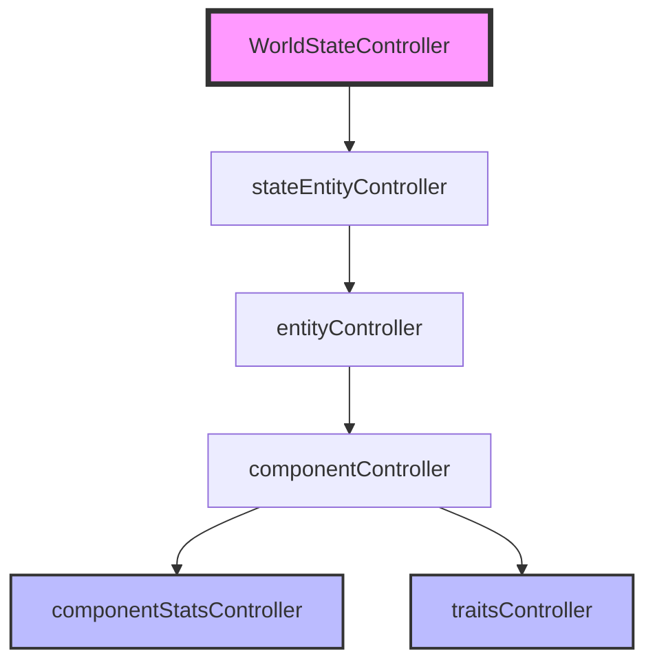

# 🗺️ System Architecture Map

## 1. Controller Hierarchy (The Injection Chain)
The system follows a strict top-down dependency injection pattern to ensure a Single Source of Truth.



**Injection Order (Root Injector):**
`ComponentStatsController` → `TraitsController` → `ComponentController` → `EntityController` → `stateEntityController` → `WorldStateController`

**Client-Side Architecture (Modular JS):**
`Config.js` → `WorldStateManager` → `UIManager` → `ClientErrorController` → `ActionManager` → `ClientApp` (Orchestrator)

---

## 2. Responsibility Matrix

| Controller | Role | Key Responsibility | Primary Data Managed |
| :--- | :--- | :--- | :--- |
| **WorldStateController** | Root Coordinator | Root Injection, Global State Aggregation, Stat Change Wiring, Public API Wrappers | `subControllers` map |
| **RoomsController** | Room Manager | Room definitions, coordinates, and connections | `rooms` (with x, y, width, height) |
| **stateEntityController** | Instance Manager | Lifecycle (Spawn/Move/Despawn) of active entities | `entities` (active instances with spatial) |
| **entityController** | Blueprint Registry | Defining entity "DNA" and composition | `blueprints` (entity types) |
| **componentController** | Logic Coordinator | Translating blueprints into stats via trait merging + Stat Change Notifications | `componentRegistry` (blueprint traits) |
| **componentStatsController** | Data Store | Persisting raw stats with deep trait-level merge | `componentStats` (instance IDs → values) |
| **traitsController** | Data Store/Molds | Maintaining global attribute defaults | `globalTraits` (molds including Spatial) |
| **ActionController** | Action Coordinator | Action execution, capability caching, stat change re-evaluation, event notifications | `_capabilityCache`, `_traitStatActionIndex`, `_actionSubscribers` |

---

## 2.1. Spatial Data Schema

### Rooms
Rooms now include spatial information for rendering:
```json
{
  "x": 200,
  "y": 250,
  "width": 300,
  "height": 200
}
```

### Entities
Entities store position relative to their room:
```json
{
  "spatial": {
    "x": 0,
    "y": 0
  }
}
```

### Components
Components have Spatial trait with position offsets:
```json
{
  "traits": {
    "Spatial": {
      "x": 20,
      "y": 10
    }
  }
}
```

---

## 3. Operational Flows

### 3.1. Entity Spawning Flow
When `WorldStateController` spawns an entity:
1. `stateEntityController.spawnEntity(blueprintName, roomId)`
2. → `entityController.createEntityFromBlueprint(blueprintName)`
3. → `entityController.expandBlueprint(blueprintName)` (Recursive expansion)
4. → For each component: `componentController.initializeComponent(type, instanceId)`
5. → `traitsController.mergeTraits(blueprintTraits)` (Merge: Blueprint Overrides ∪ Global Defaults)
6. → `componentStatsController.setStats(instanceId, finalStats)`
7. → `stateEntityController` stores the final entity object with its component IDs and location.

### 3.2. Stat Update Flow
When a component stat changes:
1. Request → `componentController.updateComponentStat(instanceId, traitId, statName, value)` or `updateComponentStatDelta(instanceId, traitId, statName, delta)`
2. → `componentStatsController.getStats(instanceId)`
3. → Modify value in the local object.
4. → `componentStatsController.setStats(instanceId, { [traitId]: { [statName]: newValue } })`
5. **Deep Trait-Level Merge**: `setStats()` merges within each trait category, preserving other stats in the same trait (e.g., updating `Physical.durability` does not erase `Physical.mass` or `Physical.strength`). See `wiki/subMDs/traits.md` Section 5 for details.
6. → `_notifyStatChangeListeners(instanceId, traitId, statName, newValue, oldValue)`
7. → `ActionController.onStatChange()` → `reEvaluateActionForComponent()` (if action depends on changed trait.stat)
8. → `_notifySubscribers(actionName, entryOrRemovalMarker)` — notifies event subscribers with the updated entry or a `RemovalMarker` if removed

### 3.3. Action Capability Cache Flow

The `ActionController` maintains a cache of best components for each action:

1. **Initial Scan**: Performed during `WorldStateController` initialization after entities are spawned
2. **Lazy Scan**: `getActionsForEntity()` and `getActionCapabilities()` trigger scan if cache is empty or entity missing
3. **Partial Re-evaluation**: Stat changes trigger targeted re-evaluation of only affected actions
4. **Event Emission**: Subscribers notified when capabilities change via `on(actionName, callback)`

**Cache Structure:**
```
_capabilityCache: { [actionName]: [ComponentCapabilityEntry, ...] }  // Array of all qualifying entries per action
_traitStatActionIndex: Map< "trait.stat", Set<actionName> >  // Reverse index for efficient re-evaluation
```
Each action maps to an **array** of all component capability entries that qualify, sorted by score (best first). See `wiki/subMDs/action_capability_cache.md` for details.

### 3.4. Attack Action Execution Flow (Attacker vs. Target)

For attack actions (e.g., `droid punch`), the system distinguishes between the **attacker component** and the **target component**:

**Step-by-Step Flow:**
1. **Client Request**: `POST /execute-action` with `attackerComponentId` and `targetComponentId`
2. **Requirement Resolution**: `ActionController.executeAction()` uses `attackerComponentId` to resolve `requirementValues`
   - `:Physical.strength` resolves from attacker's stats (e.g., `25` from `droidHand`)
3. **Placeholder Substitution**: `"-:Physical.strength"` → `-25`
4. **Consequence Application**: `ConsequenceHandlers.damageComponent()` applies damage to `targetComponentId`
5. **State Broadcast**: `WorldStateController` emits `world-state-update` with reduced durability

**Priority Order in `executeAction()`:**
```
attackerComponentId (highest) → targetComponentId (legacy) → entity-wide check (fallback)
```

**Example - droid punch:**
```
Client sends:
{
    actionName: "droid punch",
    entityId: "attacker-entity",
    params: {
        attackerComponentId: "droidHand-uuid",   // strength = 25
        targetComponentId: "enemy-centralBall"    // durability = 100
    }
}

Result:
- Damage resolved from attacker: Physical.strength = 25
- Damage applied to target: durability 100 → 75
```

### 3.5. updateComponentStatDelta Component Resolution

For actions like `selfHeal` that modify stats without an explicit target:

**Priority Order:**
1. `context.actionParams.targetComponentId` — Explicit target (for damage actions)
2. `context.fulfillingComponents[trait.stat]` — Component that satisfied the requirement
3. **Fallback**: Falls back to `_handleUpdateStat` for entity-wide updates

**⚠️ Note:** The old "first component with the trait" fallback has been removed to prevent unpredictable behavior.

### 3.6. WorldStateController Public API Flow

The server (`src/server.js`) uses public API wrappers instead of direct sub-controller access:

```
Server Request → WorldStateController.spawnEntity() / despawnEntity() / moveEntity() / getRoomUidByLogicalId()
    → Delegates to: stateEntityController / roomsController
```

**Available Public Methods:**

| Method | Parameters | Returns |
|--------|-----------|---------|
| `spawnEntity(blueprintName, roomId)` | `string`, `string` | `string` (entityId) |
| `despawnEntity(entityId)` | `string` | `boolean` |
| `moveEntity(entityId, targetRoomId)` | `string`, `string` | `boolean` |
| `getRoomUidByLogicalId(logicalId)` | `string` | `string|null` |

---

## 4. ⚠️ Critical Constraints for Agents
- **No `new` Keywords**: Do not instantiate controllers inside other controllers. Only `WorldStateController` may use `new` for controller setup.
- **One-Way Flow**: State modifications should generally flow from top to bottom.
- **Single Source of Truth**: Always use the injected controllers to access data; never cache state in a way that could desynchronize with the `componentStatsController`.
- **Capability Cache**: The `ActionController` capability cache is automatically maintained. Do not manually clear it; rely on `scanAllCapabilities()` or stat change notifications.
- **Server API Access**: The server (`src/server.js`) must use `WorldStateController` public API methods (`spawnEntity`, `despawnEntity`, `moveEntity`, `getRoomUidByLogicalId`) instead of directly accessing sub-controllers. See `subMDs/controller_patterns.md` Section 5.1.
- **Logging Standard**: All controllers must use the centralized `Logger` utility (`src/utils/Logger.js`) for structured logging with severity levels (`INFO`, `WARN`, `ERROR`, `CRITICAL`). The `LLMController` now uses `Logger` instead of `console.*` calls.

### Server Endpoints (New)
| Endpoint | Description |
|----------|-------------|
| `GET /action-capabilities` | Returns full cached action capabilities |
| `GET /action-capabilities/:actionName` | Returns best component for a specific action |
| `GET /action-capabilities/entity/:entityId` | Returns capabilities for a specific entity |
| `POST /refresh-entity-capabilities` | Re-evaluates all capabilities for an entity |

### 📢 Notice for Future Agents
**Language Requirement:** All source code in this project must be written in **JavaScript**.
