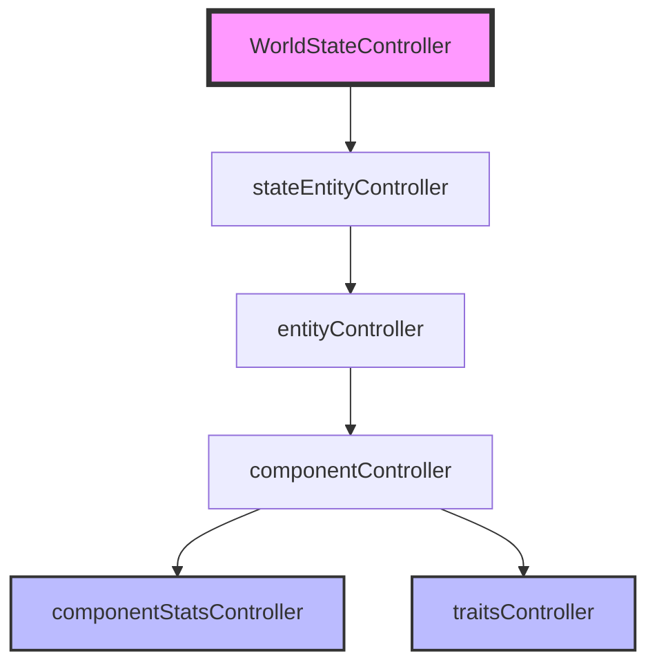

# 🗺️ System Architecture Map

## 1. Controller Hierarchy (The Injection Chain)
The system follows a strict top-down dependency injection pattern to ensure a Single Source of Truth.

**Injection Order (Root Injector):**
`ComponentStatsController` $\rightarrow$ `TraitsController` $\rightarrow$ `ComponentController` $\rightarrow$ `EntityController` $\rightarrow$ `stateEntityController` $\rightarrow$ `WorldStateController`

---

## 2. Responsibility Matrix

| Controller | Role | Key Responsibility | Primary Data Managed |
| :--- | :--- | :--- | :--- |
| **WorldStateController** | Root Coordinator | Root Injection & Global State Aggregation | `subControllers` map |
| **stateEntityController** | Instance Manager | Lifecycle (Spawn/Move/Despawn) of active entities | `entities` (active instances) |
| **entityController** | Blueprint Registry | Defining entity "DNA" and composition | `blueprints` (entity types) |
| **componentController** | Logic Coordinator | Translating blueprints into stats via trait merging | `componentRegistry` (blueprint traits) |
| **componentStatsController** | Data Store | Persisting raw stats for every component instance | `componentStats` (instance IDs $\rightarrow$ values) |
| **traitsController** | Data Store/Molds | Maintaining global attribute defaults | `globalTraits` (molds) |

---

## 3. Operational Flows

### 3.1. Entity Spawning Flow
When `WorldStateController` spawns an entity:
1. `stateEntityController.spawnEntity(blueprintName, roomId)`
2. $\rightarrow$ `entityController.createEntityFromBlueprint(blueprintName)`
3. $\rightarrow$ `entityController.expandBlueprint(blueprintName)` (Recursive expansion)
4. $\rightarrow$ For each component: `componentController.initializeComponent(type, instanceId)`
5. $\rightarrow$ `traitsController.mergeTraits(blueprintTraits)` (Merge: Blueprint Overrides $\cup$ Global Defaults)
6. $\rightarrow$ `componentStatsController.setStats(instanceId, finalStats)`
7. $\rightarrow$ `stateEntityController` stores the final entity object with its component IDs and location.

### 3.2. Stat Update Flow
When a component stat changes:
1. Request $\rightarrow$ `componentController.updateComponentStat(instanceId, traitId, statName, value)`
2. $\rightarrow$ `componentStatsController.getStats(instanceId)`
3. $\rightarrow$ Modify value in the local object.
4. $\rightarrow$ `componentStatsController.setStats(instanceId, updatedStats)`

---

## 4. ⚠️ Critical Constraints for Agents
- **No `new` Keywords**: Do not instantiate controllers inside other controllers. Only `WorldStateController` may use `new` for controller setup.
- **One-Way Flow**: State modifications should generally flow from top to bottom.
- **Single Source of Truth**: Always use the injected controllers to access data; never cache state in a way that could desynchronize with the `componentStatsController`.

### 📢 Notice for Future Agents
**Language Requirement:** All source code in this project must be written in **JavaScript**.
