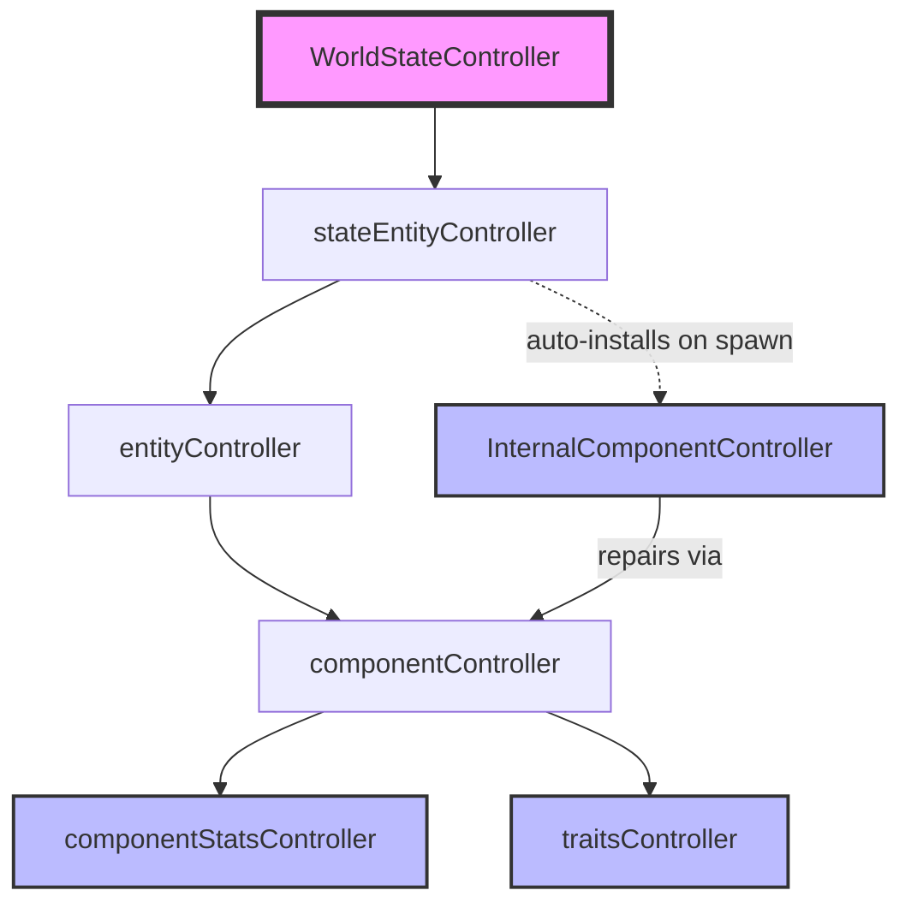

# 🗺️ System Architecture Map

## 1. Controller Hierarchy (The Injection Chain)
The system follows a strict top-down dependency injection pattern to ensure a Single Source of Truth.


```mermaid
graph TD
    WSC[WorldStateController] --> SEC[stateEntityController]
    SEC --> EC[entityController]
    EC --> CC[componentController]
    CC --> CSC[componentStatsController]
    CC --> TC[traitsController]
    
    %% Internal Components (State Controller — self-instantiating)
    ICE[InternalComponentController]
    SEC -.->|auto-installs on spawn| ICE
    ICE -->|repairs via| CC
    
    style WSC fill:#f9f,stroke:#333,stroke-width:4px
    style CSC fill:#bbf,stroke:#333,stroke-width:2px
    style TC fill:#bbf,stroke:#333,stroke-width:2px
    style ICE fill:#bbf,stroke:#333,stroke-width:2px
```

### Directory Structure (After BUG-052 Reorganization)

```
src/controllers/
├── WorldStateController.js          # Root injector (stays at top level)
├── index.js                         # Barrel export
├── core/                            # Core state management (Rooms, stateEntity, entity, Component, ComponentStats, InternalComponent)
├── traits/                          # Traits subsystem (TraitsController)
├── actions/                         # Action execution system (ActionController, actionSelect, ComponentResolver, RequirementResolver, RangeValidator)
├── capabilities/                    # Capability caching (ComponentCapabilityController)
├── synergy/                         # Synergy system (SynergyController + 4 extracted modules)
├── consequences/                    # Consequence system (ConsequenceHandlers + 6 handlers + Dispatcher)
└── networking/                      # Network layer (LLMController, SocketLifecycleController)
```

**Injection Order (Root Injector — Bottom-Up):**
`ComponentStatsController` → `TraitsController` → `ComponentController` (injected with both) → `EntityController` (injected with ComponentController + blueprintRegistry from `data/blueprints.json`) → `stateEntityController` → `InternalComponentController` (self-instantiating State Controller) → `WorldStateController`

**Note:** `ComponentStatsController` and `TraitsController` are both bottom-level data stores instantiated first. `ComponentController` receives both as injected dependencies. The order in the diagram shows the logical dependency chain, not the instantiation sequence.

**Client-Side Architecture (Modular JS):**
```
Config.js → WorldStateManager → UIManager → RoomConnectionRenderer → WorldMapView → ClientErrorController → ActionExecutor → ClientApp (Orchestrator)
                                                  ↓                              ↓
                                          ConfigBarManager ←→ NavActionsPanel → ComponentViewer
```

---

## 2. Responsibility Matrix

| Controller | Role | Key Responsibility | Primary Data Managed |
| :--- | :--- | :--- | :--- |
| **WorldStateController** | Root Coordinator | Root Injection, Global State Aggregation, Stat Change Wiring, Public API Wrappers | `subControllers` map |
| **RoomsController** | Spatial Data Store | Data-driven initialization via DataLoader, validation, UID generation, logical ID → UID mapping | `rooms` (with x, y, width, height), `idMap` (logicalId → UID) |
| **stateEntityController** | Instance Manager | Lifecycle (Spawn/Move/Despawn) of active entities | `entities` (active instances with spatial) |
| **entityController** | Blueprint Registry | Loading entity blueprints from `data/blueprints.json` via DataLoader | `blueprints` (entity types from JSON data file) |
| **componentController** | Logic Coordinator | Translating blueprints into stats via trait merging + Stat Change Notifications | `componentRegistry` (blueprint traits) |
| **componentStatsController** | Data Store | Persisting raw stats with deep trait-level merge | `componentStats` (instance IDs → values) |
| **traitsController** | Data Store/Molds | Maintaining global attribute defaults | `globalTraits` (molds including Spatial) |
| **ActionController** | Action Coordinator | Action execution, consequence handling, requirement validation | `actionRegistry` (action definitions), `componentsToRelease` (lock tracking) |
| **ComponentCapabilityController** | Capability Cache Manager | Capability scanning, scoring, caching, stat change re-evaluation, event notifications | `_capabilityCache`, `_traitStatActionIndex`, `_actionSubscribers` |
| **InternalComponentController** | Internal Component State | Volume-based auto-installation, lifecycle management, 5-second repair system | `internalComponents`, `registry`, `_repairInterval` |

### Utility Layer (Extracted Business Logic)

| Utility | Role | Key Responsibility | Source Controller |
| :--- | :--- | :--- | :--- |
| **PlaceholderResolver** | Placeholder Resolution | Resolves action consequence placeholders (`:Trait.stat`) to numeric values | ActionController |
| **RequirementChecker** | Requirement Validation | Entity-level and component-level action requirement checking | ActionController |
| **RangeChecker** | Proximity Validation | Euclidean distance calculation for grab/range actions | ActionController |
| **Logger** | Structured Logging | Centralized logging with severity levels (`INFO`, `WARN`, `ERROR`, `CRITICAL`) | All controllers |
| **DataLoader** | JSON Configuration | Loading and parsing JSON data files from `data/` directory | All controllers |
| **Constants** | Application Constants | Magic numbers extracted to named constants (`MAX_FILE_LINES`, `SYNERGY_BONUS_THRESHOLD`, etc.) | All files |
| **WorldGraphBuilder** | World Graph Construction | Constructs navigable graph structure from room data with resolved connection names | WorldStateController |

### Client-Side Utilities (Extracted Business Logic)

| Utility | Role | Key Responsibility | Source Module |
|---------|---------|---------|---------|
| **ConfigBarManager** | Config Bar Management | Manages top config bar buttons, overlay coordination, and panel toggling | ClientApp |
| **NavActionsPanel** | Actions Overlay | Manages actions panel with multi-component selection and cross-action locking | ClientApp |
| **SelectionController** | Selection State | Component selection state, cross-action selections, action list coordination | ClientApp |
| **SynergyPreviewController** | Synergy Preview | Synergy preview fetching, caching, and range calculation | ClientApp |
| **ActionExecutor** | Action Execution | All action execution handlers with distinct logic patterns | ClientApp |
| **EventDispatcher** | Event Management | Socket.io and DOM event listener management | ClientApp |
| **WorldStateManager** | State Sync | World state synchronization with server | ClientApp |
| **WorldMapView** | World Map Overlay | Full-screen overlay with interactive SVG world map showing all rooms and connections | ClientApp |
| **RoomConnectionRenderer** | Connection Arrows | Renders SVG arrows on the spatial map showing room connections | UIManager |
| **ClientErrorController** | Error Handling | Client-side error resolution and formatting | ClientApp |
| **StatBarsManager** | Stat Bars | Configurable stat bar visualization | ClientApp |
| **ComponentViewer** | Component Viewer | Component detail overlay panel with 🔮 internal component panel | ClientApp |

---

## 2.1. Internal Components Data Model

### Storage Structure
```
internalComponents = {
    [entityId]: {
        [hostComponentId]: [
            {
                id: "internal-component-uid",
                type: "durabilityRepairSphere",
                hostComponentId: "host-component-uid",
                hostComponentType: "centralBall",
                hostComponentIdentifier: "default",
                installedAt: timestamp
            }
        ]
    }
}
```

### Volume System
- Each component has a `Physical.volume` property representing internal capacity (required for the volume-based system)
- Each internal component type has a `volume` property representing space occupied (from `data/internalComponents.json`)
- **Auto-install rule**: Internal components install only if `hostComponent.Physical.volume >= internalComponent.volume` AND host type is NOT in `excludedComponentTypes`
- **Note**: Volume checking is enforced during `autoInstallOnEntitySpawn()`. The manual `addInternalComponent()` method does not perform volume validation.
- **VolumeProvider pattern**: `autoInstallOnEntitySpawn()` accepts an optional `componentVolumeProvider` function `(componentType) => number` for volume lookup, with a fallback default of `10`

---

## 2.2. Spatial Data Schema

### Rooms
Rooms include spatial information for rendering. Coordinates define the room's position in the world coordinate space:
```json
{
  "x": 0,
  "y": 0,
  "width": 300,
  "height": 200
}
```

**Coordinate System:** Room coordinates (`x`, `y`) are absolute data coordinates. On the spatial map, the current room is centered at the viewport center (`AppConfig.VIEW.CENTER_X`, `AppConfig.VIEW.CENTER_Y`), ignoring `room.x`/`room.y`. Target rooms in connection rendering use relative coordinates: `(targetRoom.x - room.x)`. Edge-to-edge line drawing with `>=` tie-breaking ensures arrows connect at room boundaries, not centers. See `wiki/subMDs/world_map.md` for details on connection arrow rendering.

### Entities
Entities store position relative to their room:
```json
{
  "spatial": {
    "x": 0,
    "y": 0
  }
}
```

### Components
Components have Spatial trait with position offsets:
```json
{
  "traits": {
    "Spatial": {
      "x": 20,
      "y": 10
    }
  }
}
```

---

## 3. Operational Flows

### 3.1. Entity Spawning Flow
When `WorldStateController` spawns an entity:
1. `stateEntityController.spawnEntity(blueprintName, roomId)`
2. → `entityController.createEntityFromBlueprint(blueprintName)`
3. → `entityController.expandBlueprint(blueprintName)` (Recursive expansion with cycle detection)
4. → For each component: `componentController.initializeComponent(type, instanceId)`
5. → `traitsController.mergeTraits(blueprintTraits)` (Merge: Blueprint Overrides ∪ Global Defaults)
6. → `componentStatsController.setStats(instanceId, finalStats)`
7. → `stateEntityController` stores the final entity object with its component IDs and location.

**Note:** Blueprints are loaded from `data/blueprints.json` at `EntityController` construction via `DataLoader.loadJsonSafe()`, following the data-driven design principle.

### 3.2. Stat Update Flow
When a component stat changes:
1. Request → `componentController.updateComponentStat(instanceId, traitId, statName, value)` or `updateComponentStatDelta(instanceId, traitId, statName, delta)`
2. → `componentStatsController.getStats(instanceId)`
3. → Modify value in the local object.
4. → `componentStatsController.setStats(instanceId, { [traitId]: { [statName]: newValue } })`
5. **Deep Trait-Level Merge**: `setStats()` merges within each trait category, preserving other stats in the same trait (e.g., updating `Physical.durability` does not erase `Physical.mass` or `Physical.strength`). See `wiki/subMDs/traits.md` Section 5 for details.
6. → `_notifyStatChangeListeners(instanceId, traitId, statName, newValue, oldValue)`
7. → `ComponentCapabilityController.onStatChange()` → `reEvaluateActionForComponent()` (if action depends on changed trait.stat)
8. → `_notifySubscribers(actionName, entryOrRemovalMarker)` — notifies event subscribers with the updated entry or a `RemovalMarker` if removed

### 3.3. Action Capability Cache Flow

The `ComponentCapabilityController` maintains a cache of best components for each action:

1. **Initial Scan**: Performed during `WorldStateController` initialization after entities are spawned
2. **Lazy Scan**: `getActionsForEntity()` and `getActionCapabilities()` trigger scan if cache is empty or entity missing
3. **Partial Re-evaluation**: Stat changes trigger targeted re-evaluation of only affected actions
4. **Event Emission**: Subscribers notified when capabilities change via `on(actionName, callback)`

**Cache Structure:**
```
_capabilityCache: { [actionName]: [ComponentCapabilityEntry, ...] }  // Array of all qualifying entries per action
_traitStatActionIndex: Map< "trait.stat", Set<actionName> >  // Reverse index for efficient re-evaluation
```
Each action maps to an **array** of all component capability entries that qualify, sorted by score (best first). See `wiki/subMDs/action_capability_cache.md` for details.

### 3.4. Attack Action Execution Flow (Attacker vs. Target)

For attack actions (e.g., `droid punch`), the system distinguishes between the **attacker component** and the **target component**:

**Step-by-Step Flow:**
1. **Client Request**: `POST /execute-action` with `attackerComponentId` and `targetComponentId`
2. **Requirement Resolution**: `ActionController.executeAction()` uses `attackerComponentId` to resolve `requirementValues`
   - `:Physical.strength` resolves from attacker's stats (e.g., `25` from `droidHand`)
3. **Placeholder Substitution**: `"-:Physical.strength"` → `-25`
4. **Consequence Application**: `ConsequenceHandlers.damageComponent()` applies damage to `targetComponentId`
5. **State Broadcast**: `WorldStateController` emits `world-state-update` with reduced durability

**Priority Order in `executeAction()`:**
```
attackerComponentId (highest) → targetComponentId (legacy) → entity-wide check (fallback)
```

**Example - droid punch:**
```
Client sends:
{
    actionName: "droid punch",
    entityId: "attacker-entity",
    params: {
        attackerComponentId: "droidHand-uuid",   // strength = 25
        targetComponentId: "enemy-centralBall"    // durability = 100
    }
}

Result:
- Damage resolved from attacker: Physical.strength = 25
- Damage applied to target: durability 100 → 75
```

### 3.5. updateComponentStatDelta Component Resolution

For actions like `selfHeal` that modify stats without an explicit target:

**Priority Order:**
1. `context.actionParams.targetComponentId` — Explicit target (for damage actions)
2. `context.fulfillingComponents[trait.stat]` — Component that satisfied the requirement
3. **Fallback**: Falls back to `_handleUpdateStat` for entity-wide updates

**⚠️ Note:** The old "first component with the trait" fallback has been removed to prevent unpredictable behavior.

### 3.6. Spatial Action Component Resolution (e.g., move, dash)

For spatial actions on entities with multiple components of the same type (e.g., left and right `droidRollingBall`), the system uses `targetComponentId` for requirement resolution while ensuring spatial consequences always target the entity:

**Client-Side Flow:**
1. User selects a component in the UI → `componentId` stored in `pendingMovementAction`
2. `ActionManager.moveToTarget()` sends `{ targetX, targetY, targetComponentId, componentIdentifier }`
3. Server receives the request at `POST /execute-action`

**Server-Side Target ID Resolution in `_executeConsequences()`:**
| Consequence Type | Target ID Used |
|------------------|----------------|
| `updateSpatial`, `deltaSpatial` | `entityId` — spatial operations always target the entity |
| `updateComponentStatDelta`, `damageComponent` | `targetComponentId` (from `params`) or `entityId` as fallback |

This separation ensures that:
- The entity moves correctly (deltaSpatial uses entity ID, not component ID)
- Component consequences apply to the selected component (e.g., right wheel durability loss from dash)

**⚠️ Critical:** If `targetComponentId` is sent but spatial consequences incorrectly use it as the target ID, the movement will fail because `getEntity()` will receive a component ID instead of an entity ID.

### 3.7. WorldStateController Public API Flow

The server (`src/server.js`) uses public API wrappers instead of direct sub-controller access:

```
Server Request → WorldStateController.spawnEntity() / despawnEntity() / moveEntity() / getRoomUidByLogicalId()
    → Delegates to: stateEntityController / roomsController
```

**Available Public Methods:**

| Method | Parameters | Returns |
|--------|-----------|---------|
| `spawnEntity(blueprintName, roomId)` | `string`, `string` | `string` (entityId) |
| `despawnEntity(entityId)` | `string` | `boolean` |
| `moveEntity(entityId, targetRoomId)` | `string`, `string` | `boolean` |
| `getRoomUidByLogicalId(logicalId)` | `string` | `string|null` |
| `getEntity(entityId)` | `string` | `Object\|null` | Gets entity by ID |
| `getComponent(componentId)` | `string` | `Object\|null` | Gets component by ID |
| `getComponentStats(componentId)` | `string` | `Object\|null` | Gets component stats by ID |
| `addInternalComponent(entityId, hostComponentId, internalComponentType)` | `string`, `string`, `string` | `Object\|null` | Adds an internal component to a host |
| `getInternalComponents(entityId, hostComponentId)` | `string`, `string` | `Array` | Gets internal components for a host (defensive deep copy) |
| `getInternalComponentsForEntity(entityId)` | `string` | `Object` | Gets all internal components for an entity (defensive deep copy) |
| `removeInternalComponent(entityId, hostComponentId, internalComponentInstanceId)` | `string`, `string`, `string` | `boolean` | Removes a specific internal component |
| `hasInternalComponent(entityId, hostComponentId, internalComponentType)` | `string`, `string`, `string` | `boolean` | Checks if host has a specific internal component type |
| `cleanupInternalComponents(entityId)` | `string` | `boolean` | Cleans up all internal components for an entity |
| `startInternalComponentRepairSystem()` | — | `void` | Starts the 5-second repair interval |
| `stopInternalComponentRepairSystem()` | — | `void` | Stops the repair interval |

### 3.8. ActionController Extracted Utility Flow

ActionController delegates business logic to utility modules for SRP compliance:

```
ActionController.executeAction()
    ├── _checkRequirements() → RequirementChecker.checkRequirements()
    ├── _checkRequirementsForComponent() → RequirementChecker.checkRequirementsForComponent()
    ├── _componentSatisfiesActionRequirements() → RequirementChecker.componentSatisfiesRequirements()
    ├── _resolvePlaceholders() → PlaceholderResolver.resolvePlaceholders()
    ├── _checkGrabRange() → RangeChecker.checkGrabRange()
    └── SYNERGY_BONUS_THRESHOLD → Constants.SYNERGY_BONUS_THRESHOLD
```

### 3.9. Internal Component Repair System Flow

The `InternalComponentController` runs a 5-second repair interval via `setInterval` to heal damaged components:

```
setInterval(5000) → _processRepairTick()
    ├── Iterate over all entities
    ├── For each entity's internal components:
    │   ├── Get host component via hostComponentId
    │   ├── Call this.worldStateController.componentController.updateComponentStatDelta() on host
    │   └── Increase Physical.durability by repairAmount (1 for durabilityRepairSphere)
    └── Stat change triggers broadcast via existing listener system
    └── _syncToEntityStore() — syncs internal components back to entity store for world-state broadcasts
```

**Lifecycle:**
- **Auto-install**: On entity spawn via `stateEntityController` → `InternalComponentController.autoInstallOnEntitySpawn()`
- **Volume check**: Only installs if `hostComponent.volume >= internalComponent.volume`
- **Exclusions**: Components in `excludedComponentTypes` (e.g., `humanoidDroidFinger`) skip installation
- **Cleanup**: On entity despawn, `InternalComponentController.cleanupEntity(entityId)` removes all internal components

---

## 4. ⚠️ Critical Constraints for Agents
- **No `new` Keywords**: Do not instantiate controllers inside other controllers. Only `WorldStateController` may use `new` for controller setup.
- **One-Way Flow**: State modifications should generally flow from top to bottom.
- **Single Source of Truth**: Always use the injected controllers to access data; never cache state in a way that could desynchronize with the `componentStatsController`.
- **Capability Cache**: The `ComponentCapabilityController` capability cache is automatically maintained. Do not manually clear it; rely on `scanAllCapabilities()` or stat change notifications.
- **Server API Access**: The server (`src/server.js`) must use `WorldStateController` public API methods (`spawnEntity`, `despawnEntity`, `moveEntity`, `getRoomUidByLogicalId`) instead of directly accessing sub-controllers. See `subMDs/controller_patterns.md` Section 5.1.
- **Logging Standard**: All controllers must use the centralized `Logger` utility (`src/utils/Logger.js`) for structured logging with severity levels (`INFO`, `WARN`, `ERROR`, `CRITICAL`). The `LLMController` now uses `Logger` instead of `console.*` calls.

### Server Endpoints (New)
| Endpoint | Description |
|----------|-------------|
| `GET /action-capabilities` | Returns full cached action capabilities |
| `GET /action-capabilities/:actionName` | Returns best component for a specific action |
| `GET /action-capabilities/entity/:entityId` | Returns capabilities for a specific entity |
| `POST /refresh-entity-capabilities` | Re-evaluates all capabilities for an entity |
| `GET /world-map` | Returns the world graph with resolved room names for all connections |
| `GET /api/internal-components/registry` | Returns internal component type definitions with descriptions |
| `GET /api/internal-components/:entityId` | Returns all internal components for an entity |
| `GET /api/internal-components/:entityId/:hostComponentId` | Returns internal components for a specific host component |
| `POST /api/internal-components/:entityId/:hostComponentId/add` | Adds an internal component to a host |
| `DELETE /api/internal-components/:entityId/:hostComponentId/:internalComponentId` | Removes an internal component |

### 📢 Notice for Future Agents
**Language Requirement:** All source code in this project must be written in **JavaScript**.