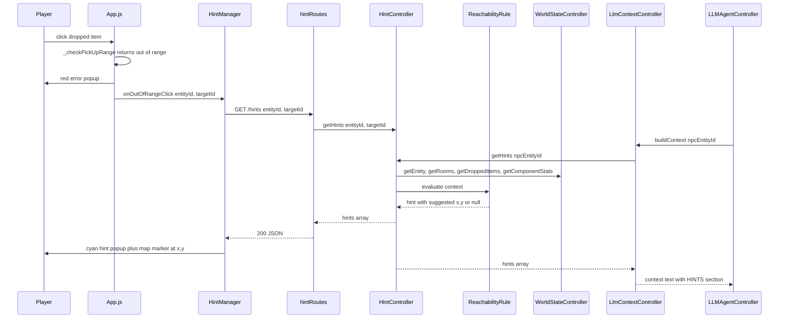

# Hint System

## 1. Overview

The hint system gives actionable suggestions about what to do next. Hints are computed by the **server** from live world state and have exactly **two consumers**: the **player** (on demand over REST, displayed in the UI) and the **LLM NPC agent** (injected into its per-round world context so the model is guided toward viable actions). v1 implements exactly **one hint — the reachability-move hint** — but the system is built as an extensible rule registry so future suggestion types can be added without touching the route, the client, the LLM context layer, or the facade.

The first hint answers the most common dead-end in the game: an entity wants to interact with an item that is **out of reach**, gets an error with no guidance, and has to figure out on their own where to move. The hint converts that failure into a concrete next action:

> "To move to entity Knife, go to 45 and -30 \u2014 you can't reach it, but you get closer!"

## 2. Purpose and Scope

### Why a hint system exists

- **Turns failures into guidance**: today an out-of-range interaction produces only a red error popup ([ClientErrorController](public/js/ClientErrorController.js) + [UIManager.showErrorPopup()](public/js/UIManager.js:711)). The error says *what* is wrong, not *what to do about it*. A hint closes that loop.
- **Onboarding aid for spatial reasoning**: range is derived from entity stats (see [Door Range System](door_range_system.md) and [Movement System](movement_system.md)), which is not obvious to new players. A hint teaches the range/movement relationship by showing a reachable intermediate position.
- **Guidance for the LLM agent**: the NPC agent ([LLMAgentController](src/controllers/networking/LLMAgentController.js)) acts on a text rendering of the world and currently has no notion of *where* to go — a model that wants to grab a distant item just fails the range check and burns its retry budget. Feeding the agent the same deterministic hints tells it exactly which move to take and where, without the model doing its own (unreliable) spatial math.
- **Extensibility by design**: the hint system implies future suggestions (requirement hints, attack-range hints, navigation hints). The registry pattern makes each future hint an isolated rule module.

### Scope of v1 (explicit)

- **One rule implemented**: `reachability-move` — "target entity/item is out of the player's reach → suggest a (x, y) that gets the player closer."
- **Target candidates in v1: dropped items AND entities (NPCs, droids) in the player's room.** Dropped items have a concrete out-of-range rejection path ([App._handleDroppedItemClick()](public/js/App.js:1010) → `OUT_OF_RANGE` error). In-room entities are first-class candidates alongside dropped items — v1 uses the **same reach formula** for both candidate types (the existing drop reach `R` computed via `dropItem` range expression + fallback; attack-range differentiation is a future extension). Cross-room targets are out of scope (doors have their own [door range system](door_range_system.md) with green/red hover feedback).
- **Not in v1**: pathfinding, requirement-not-met hints, a manual "hint" button, LLM-*generated* hints (the LLM consumes hints; it does not produce them), broadcast/push delivery. The route is stateless and queryable at any time, so all of these can be added later without a contract change.
- **i18n**: v1 uses English exclusively for hint messages; Portuguese or other locales are planned as a future extension.

## 3. Design Decisions (Why)

### Why deterministic computation, with the LLM as consumer (not producer)

- **A hint is arithmetic, not language.** The suggested (x, y) is a pure function of numeric world state: entity position, target position, room bounds, movement stat, range expression. An LLM is unreliable at exact coordinate math, and a wrong coordinate is worse than no hint — so the coordinates are computed deterministically even in the LLM-facing path.
- **Availability and latency.** The project's own LLM layer ([LLMAgentController](src/controllers/networking/LLMAgentController.js)) shows the cost of LLM dependence: per-call timeouts, one retry, and graceful "round missed" degradation when the backend is down (see [BUG-007](../bugfixWiki/high/BUG-007-graceful-degradation.md)). Hints must work with **no** LLM backend configured, exactly like the rest of the world-state flow.
- **Flow separation.** Per [Project Rules §4](../../project_rules.md), LLM interaction and world-state management are distinct middleware flows. Hints read world state and belong to the world-state flow; the LLM flow *consumes* them at context-build time.
- **One engine, two consumers.** The player-facing route and the LLM context section both call the same `HintController.getHints()` — the agent is guided by the same suggestions the player would see, so "what the game considers a good next move" has a single definition. The LLM never computes a hint and never sees a coordinate the deterministic engine did not approve.

### Why the LLM agent is fed the hints (and where)

- **The agent's only perception is the context text.** [LLMAgentController.runRound()](src/controllers/networking/LLMAgentController.js:117) builds its round context via [LlmContextController.buildContext()](src/controllers/networking/LlmContextController.js:61) and the model acts only on what that text contains. A hint that reaches the player but not the context is invisible to the agent.
- **The context already has a stable section format.** [LlmContextController](src/controllers/networking/LlmContextController.js) renders stable `=== SECTION ===` headers ("YOUR STATE", "NEARBY ENTITIES", "YOUR ACTIONS", "RECENT EVENTS", "ROOM CHAT"), printing `(none)` for empty sections so weak local models always see the same structure. Hints plug in as one more such section — minimal disruption, maximal consistency with the existing prompt engineering.
- **Hints fix the agent's biggest failure mode: spatial aimlessness.** Without a hint the model sees an item listed under "NEARBY ENTITIES" and attempts a ranged action, fails the server range gate, and wastes its single retry. With a hint it sees an explicit, pre-validated move target and can queue a `move` action at exact coordinates, then retry the ranged action next round.
- **The hints section is cheap and bounded.** At most a few short lines per round, inside the existing 4000-char context budget, so guidance does not starve the other sections.

### Why server-side evaluation, client-side trigger

- **Single source of truth.** Positions, room geometry, component stats, and dropped items are authoritative on the server. Client state can be stale between WebSocket broadcasts; a hint computed on stale client data could suggest an impossible position.
- **The client keeps its fast pre-check.** The existing pattern (see [Door Range System §2](door_range_system.md)) is: the client validates range instantly for UX, the server authorizes. The hint inverts the same idea: the client *detects* the frustration (it already did, to show the red popup) and the server *computes* the suggestion. One round trip is acceptable here because the hint is a reaction to a rejected action, not a hover-time interaction.

### Why trigger on the out-of-range click (not turn end, not polling)

- **Relevance.** A hint is a reaction to a concrete blocked intent. The only moment in the current UI where "range not satisfiable" is actually true for the player is the dropped-item click rejection. Hinting on turn end or via polling would produce noise (empty hints most of the time) or stale hints (state changed since the request).
- **Non-intrusiveness.** The hint appears *after* the red error popup, as a follow-up. The player asked for something, was told no, and is told how to get yes.

### Why the reach formula mirrors the client's `_resolvePickupRange` chain

The hint must agree with the gate that produced the error, or it will be absent exactly when the player is frustrated. The client resolves the `dropItem` action's range expression with the player's max `Physical.strength` and falls back to `DROP_BASE_RANGE + strength × DROP_RANGE_MULTIPLIER` when no placeholder is resolvable ([App._resolvePickupRange()](public/js/App.js:1158), [App._resolveDropRange()](public/js/App.js:1279)). The server rule uses the **same chain** via the shared [resolveRange()](shared/RangeResolver.js:75) — the project's single source of truth for range expressions — so both sides classify reach identically.

> Note: the server's [PickUpItemHandler](src/controllers/consequences/PickUpItemHandler.js) hardcodes `maxRange = 100` (a pre-existing inconsistency, cf. [BUG-083](../bugfixWiki/high/BUG-083-dropped-item-distance-check-coord-mismatch.md)). The hint deliberately follows the **client** chain because the client is what fires the hint; fixing the handler's hardcoded range is a separate bug and out of scope here.

### Why continuous room-centered coordinates with clamping

- The spatial model is **continuous**, room-relative, origin at room center (see [stateEntityController](src/controllers/core/stateEntityController.js:25) and [RoomsController](src/controllers/core/RoomsController.js:228)). There is no grid, so "one step toward it" is a vector of length up to the player's movement stat, not a cell hop.
- **One step = the player's movement stat.** The `move` action's delta consequence travels up to `:Movement.move` toward the target ([SpatialConsequenceHandler._handleDeltaSpatial()](src/controllers/consequences/SpatialConsequenceHandler.js:59)). Suggesting a point exactly one full move-step toward the target guarantees the player can act on the suggestion in a single move action.
- **Clamping to `±width/2 × ±height/2`** guarantees the suggested position is valid inside the room, using the same room-centered bounds the door-position math already uses ([RoomsController._calculateEdgePosition()](src/controllers/core/RoomsController.js:322)). A guard verifies the clamped position still strictly reduces the distance to the target; otherwise no hint (a false "get closer" is worse than silence).

## 4. Architecture

Read-only, pull-based, and stateless per request: each consumer asks the hint controller, which asks the facade for world data, evaluates rules in priority order, and returns whatever the rules produced. No world state is mutated, no new broadcast payload is added (so no state-desync surface, cf. [BUG-008](../bugfixWiki/high/BUG-008-state-desync.md)). Two consumers call the same `getHints()`:



Controller placement follows [Controller Patterns](../controllers/controller_patterns.md): `HintController` is a **logic controller** (computation, no owned game data) constructed in the composition root and wired to the facade through `setWorldStateController()` after the facade is built — the same late-facade-injection pattern as [RangeValidator](src/controllers/actions/RangeValidator.js:32). The rule classes are stateless and are instantiated by the hint controller directly (utility-class rule, Controller Patterns §8).

## 5. Implementation Contract

> Per [Project Rules §8](../../project_rules.md) the wiki normally documents *why*, not *how* — the how lives in JSDoc. This section is an exception by design: it is a **contract** that pins exact paths, names, shapes, and templates so the Code-mode implementation requires zero further decisions. Each choice's rationale is in §3; code bodies are intentionally absent.

### 5.1 File change list

**Create:**

| File | Purpose |
|------|---------|
| `src/controllers/hints/HintController.js` | Logic controller: rule registry + `getHints()` |
| `src/controllers/hints/rules/ReachabilityRule.js` | The one v1 rule (out-of-reach move hint) |
| `src/routes/hintRoutes.js` | `GET /hints` REST surface |
| `public/js/HintManager.js` | Client module: fetch + display hints |
| `test/unit/HintController.test.js` | Unit tests for the rule (see §7) |
| `wiki/subMDs/systems/hint_system.md` | This document |

**Modify:**

| File | Change |
|------|--------|
| `src/composition/WorldComposition.js` | Construct `HintController` (with `actionRegistry`), inject facade via setter after facade build, expose in `subControllers` map as `hints` |
| `src/controllers/networking/LlmContextController.js` | Render a `=== HINTS ===` section in `buildContext()` from `facade.hintController.getHints(entityId)` (see §5.7) |
| `src/controllers/WorldStateController.js` | Constructor stores `this.hintController = deps.hintController ?? null;` (property only — no new public method, so the contract snapshot in [worldStateController.contract.test.js](../../test/contract/worldStateController.contract.test.js) is unaffected) |
| `src/routes/index.js` | Import + `registerHintRoutes(router, { worldStateController })` |
| `public/js/Config.js` | `AppConfig.ENDPOINTS.HINTS = '/hints'` |
| `public/js/UIManager.js` | Add `showHintPopup()`, `renderHintMarker()`, `clearHintMarker()` |
| `public/js/App.js` | Instantiate `HintManager`; call it in the out-of-range branch of `_handleDroppedItemClick()` |
| `public/css/feedback.css` | Add `.hint-popup` and `.hint-marker` styles |
| `wiki/subMDs/index.md` | Add Systems row + update quick stats |
| `wiki/subMDs/architecture/system_map.md` | Add HintController to hierarchy + responsibility matrix (Project Rules §7) |

### 5.2 Server — `HintController` (`src/controllers/hints/HintController.js`)

- **Constructor**: `constructor({ actionRegistry })` — receives the same already-loaded `data/actions.json` registry object the composition root passes to `ActionController` (read-only; no second load, no `DataLoader` call needed since the registry is injected — this is not raw state storage, so the Data Loading Standard §5 applies to the composition root, which already loads it).
- **Setter**: `setWorldStateController(worldStateController)` — facade injected post-construction (Controller Patterns §3/§5).
- **Public method**: `getHints(entityId, { targetId } = {})` → returns `{ entityId, hints: Array }`.
- **Behavior** (all data access through facade public API only):
  1. `player = worldStateController.getEntity(entityId)` — if falsy, return `{ entityId, hints: [] }` (the route maps a missing entity to 404 itself via its own `getEntity` check).
  2. Build one `context` object: `player`, `room` (`getRooms()[player.location]`), `playerStats` (map of `"trait.stat"` → number across `player.components` via `getComponentStats(comp.id)` — the same gathering as [RangeValidator._resolveRequirementValues()](src/controllers/actions/RangeValidator.js:96)), `droppedItems` (`getDroppedItems()` filtered to `roomId === player.location`), `entities` (`getAll()` from facade, excluding the player entity itself), `targetId`, `actionRegistry`.
  3. Run rules in ascending `priority`; each rule's `evaluate(context)` returns `null` or a hint; collect non-null results.
  4. Return a defensive copy (Project Rules §2).
- **Registry**: `this._rules = [ new ReachabilityRule() ]` — the only v1 entry. Future rules are added to this array.
- **Consumers**: the REST route (§5.4) and [LlmContextController](src/controllers/networking/LlmContextController.js) (§5.7) both call `getHints()`; the controller itself does not know which consumer is calling.

### 5.3 Rule contract and `ReachabilityRule` (`src/controllers/hints/rules/ReachabilityRule.js`)

Every rule implements:

| Member | Contract |
|--------|----------|
| `get id()` | Stable string key, e.g. `'reachability-move'` |
| `get priority()` | Integer; lower evaluates first |
| `canApply(context)` | Cheap boolean gate |
| `evaluate(context)` | `null` (no hint) or a hint object (shape below) |

**`ReachabilityRule`** — `id: 'reachability-move'`, `priority: 10`:

1. **Candidates**: two categories — (a) dropped items in the player's room; (b) entities in the player's room that are **not** the player entity itself. If `context.targetId` is given, only that specific candidate (item or entity) is evaluated. The rule iterates both candidate sets and produces one hint per out-of-reach candidate (up to 3 hints total for the LLM context).
2. **Reach (R)**: computed using the **same formula** for both candidate types (items and entities) — v1 uses the `dropItem` action's range expression. Let `range = actionRegistry['dropItem']?.range`; if `range` is a string, `R = resolveRange(range, playerStats, fallback)` via [shared/RangeResolver.js](shared/RangeResolver.js), rejecting `!isFinite(R) || R <= 0` as a fallback; if `range` is a number (or null/undefined), `R = fallback`. `fallback = DROP_BASE_RANGE + maxStrength × DROP_RANGE_MULTIPLIER` from [Constants.js](src/utils/Constants.js:75), where `maxStrength` = max `Physical.strength` across the player's components (0 if none). Attack-range differentiation for entities is a future extension.
3. **Movement (M)**: max `Movement.move` across the player's components (0 if none) — same pattern as [Door Range System §3](door_range_system.md). If `M <= 0`, the rule yields no hint (the player cannot move, so a move suggestion would be false).
4. **Out of reach check**: `d = hypot(tx - px, ty - py)`; hint only if `d > R`.
5. **Suggested position**:
   - `step = min(M, d)`; `sx = px + ((tx - px) / d) × step`; `sy = py + ((ty - py) / d) × step`
   - Clamp: `sx = clamp(sx, -room.width/2, room.width/2)`, `sy = clamp(sy, -room.height/2, room.height/2)`
   - **Sanity guard**: if the clamped point does not strictly reduce distance to the target (new distance ≥ `d`) or does not move the player at all, skip this candidate.
   - Round `sx`, `sy` to 1 decimal for output.
6. **Hint object** (per candidate; candidates sorted ascending by `d`, so the nearest is first):

| Field | Type | Meaning |
|-------|------|---------|
| `id` | string | `'reachability-move'` |
| `priority` | number | `10` |
| `targetType` | string | `'droppedItem'` or `'entity'` |
| `targetId` | string | The candidate's id (item id or entity id) |
| `targetName` | string | The candidate's `name` |
| `suggestedPosition` | `{ x: number, y: number }` | Rounded to 1 decimal, room-relative |
| `distance` | number | Player→target distance, 1 decimal |
| `range` | number | Resolved reach `R`, 1 decimal |
| `message` | string | Template below, filled |

**Message template** (English, verbatim, fixed for v1):

```text
To move to entity {targetName}, go to {x} and {y} \u2014 you can't reach it, but you get closer!
```

`{x}`/`{y}` are the rounded suggested coordinates (rendered without decimals when whole, e.g. `45`, `-30`). The template text is identical for both candidate types; the `targetType` field distinguishes them programmatically.

### 5.4 Route — `src/routes/hintRoutes.js`

- Shape: `register(router, { worldStateController })` (standard route pattern, [Project Rules / BUG-069](../bugfixWiki/high/BUG-069-server-missing-worldStateController-locals.md)).
- **`GET /hints`** query params:
  - `entityId` — **required**, typed `ent-<uuid>`; missing → `400 { error }`; malformed (via `IdResolver.isEntityId`) → `400 { error }`.
  - `targetId` — optional string (e.g. a dropped item id); no format validation (dropped item ids are not typed).
- **Status contract** (mirrors [llmRoutes.js](src/routes/llmRoutes.js) and the turnRoutes "rule failure = 200" convention):
  - `404 { error: 'ENTITY_NOT_FOUND' }` when `worldStateController.getEntity(entityId)` is falsy.
  - `200 { entityId, hints: [...] }` — **empty `hints` array is the normal "no valid hint" outcome**, never an error.
  - `500 { error: 'Internal Server Error', details }` for unexpected throws.
- Access: `worldStateController.hintController.getHints(entityId, { targetId })`.
- No rate limiter (in-memory reads only, same as `/llm/context`), mounted behind the shared auth gate via [src/routes/index.js](src/routes/index.js).

### 5.5 Composition and facade wiring

- **`src/composition/WorldComposition.js`**: construct `const hintController = new HintController({ actionRegistry })` in the logic-controller layer (after `ActionController`, before facade construction); in the post-construction facade-injection step call `hintController.setWorldStateController(worldStateController)`; add `hints: hintController` to the returned `subControllers` map.
- **`src/controllers/WorldStateController.js`**: accept `hintController` in `deps`, store `this.hintController = deps.hintController ?? null;` (no new facade method — routes reach it as `worldStateController.hintController`, exactly like `worldStateController.turnSystemController` in [turnRoutes.js](src/routes/turnRoutes.js:29) and `worldStateController.llmContextController` in [llmRoutes.js](src/routes/llmRoutes.js:69)).

### 5.6 Client

**`public/js/HintManager.js`** (new module, constructor `{ uiManager }`, uses `ClientLogger`):

| Method | Behavior |
|--------|----------|
| `async fetchHints(entityId, targetId)` | `GET AppConfig.ENDPOINTS.HINTS` with query params; returns the `hints` array; on network/HTTP failure logs a warn and returns `[]` — hints are non-critical and must **never** throw or block UI |
| `onOutOfRangeClick(entityId, targetId)` | Fire-and-forget: fetch, and if the first hint exists call `uiManager.showHintPopup(hint.message)` and `uiManager.renderHintMarker(hint.suggestedPosition.x, hint.suggestedPosition.y)` |

**`public/js/UIManager.js`** (new methods beside the existing feedback methods):

| Method | Behavior |
|--------|----------|
| `showHintPopup(message, duration = 5000)` | Same create-animate-remove mechanism as `showErrorPopup()`, class `hint-popup` |
| `renderHintMarker(x, y, duration = 5000)` | Transient SVG circle on the spatial map at view-space `AppConfig.VIEW.CENTER_X + x` / `CENTER_Y + y` (same transform as `renderDroppedItemsOnSpatialMap()`), class `hint-marker`; replaces any existing hint marker; auto-removed after `duration` |
| `clearHintMarker()` | Removes the current hint marker immediately |

**`public/css/feedback.css`**:
- `.hint-popup` — same fixed corner geometry as `.error-popup` but offset above it (`bottom: 80px`) so both can be visible at once; cyan/teal background (e.g. `#00c8d7`) with the same slide-in/fade-out animation keyframes.
- `.hint-marker` — SVG circle style with a short pulse animation (e.g. 2 pulses), cyan stroke, no fill or low-opacity fill.

**`public/js/App.js`**:
- In `init()` (after `uiManager` exists): `this.hintManager = new HintManager({ uiManager: this.ui });`
- In `_handleDroppedItemClick()` (line ~1010), inside the existing `if (!rangeCheckResult.inRange)` branch, **after** the `errorController.handleError(...)` call: look up `const entityId = this.worldState.getMyEntityId();` and call `this.hintManager.onOutOfRangeClick(entityId, droppedItemId);` (fire-and-forget, never awaited, never throws).

No `index.html` change: the hint popup and marker are created dynamically, exactly like the error popup.

### 5.7 LLM agent feed — `=== HINTS ===` section in `LlmContextController`

The agent is guided by the hints section inside the per-round context, built in [LlmContextController.buildContext()](src/controllers/networking/LlmContextController.js:61):

- **Source**: `facade.hintController.getHints(entityId)` with no `targetId` (the agent sees every currently-applicable hint, not just one target). All calls are read-only and go through the facade public API (the "public API only" rule).
- **Section header**: `=== HINTS ===` — stable, all-caps, matching the existing prompt-engineering convention (`=== YOUR STATE ===`, etc.). Placed in the render order **after `=== YOUR ACTIONS (executable now) ===` and before `=== RECENT EVENTS ===`**, so the model reads what it can do, then what it is suggested to do.
- **Line format**: one line per hint (at most **3** hints, to protect the 4000-char budget), rendered as `- ` + the hint's `message` field verbatim (e.g. `- To move to entity Knife, go to 45 and -30 \u2014 you can't reach it, but you get closer!`).
- **Empty section**: header + `(none)`, identical to every other empty section — the agent must always see the same structure.
- **Data mirror**: `hints` (the raw hint array, capped at the same 3 entries) is added to the returned `data` object next to `actions`, so `GET /llm/context` consumers see the structured mirror of exactly what was rendered.
- **Budget**: the section renders inside the existing `stats.chars` / `budgetChars` accounting and the existing truncation cascade (events → entities → chat) — no new budget mechanism.
- **Degradation**: if `facade.hintController` is absent (older composition, tests) or `getHints()` throws, the section renders `(none)` and the round proceeds — a missing hint layer must never kill an agent round, matching the existing "broken context layer must not kill the round" contract in [LLMAgentController.runRound()](src/controllers/networking/LLMAgentController.js:144).
- **System prompt**: no change to [LLMAgentController._buildSystemPrompt()](src/controllers/networking/LLMAgentController.js:466) — the existing instruction "Only use actions listed under 'executable now' in the context" still holds, and the hints section naturally points at those actions.

## 6. Error Handling and Edge Cases

| Condition | Behavior |
|-----------|----------|
| Missing or malformed `entityId` query param | `400` with descriptive `error` |
| Unknown entity | `404 { error: 'ENTITY_NOT_FOUND' }` |
| Player has no `location` / room missing from `getRooms()` | Rule cannot evaluate → `200, hints: []` |
| No dropped items in the player's room, or none out of reach | `200, hints: []` |
| Player has no `Movement.move` (M = 0) | No hint — a move suggestion would be false |
| Player already at the target distance ≤ R | No hint (reachable) |
| Clamping removes all progress (clamped point not strictly closer) | Candidate skipped → possibly `hints: []` |
| `targetId` given but not a dropped item in the player's room | Treated as no match → `hints: []` |
| Multiple out-of-range items | One hint per item, sorted nearest-first; client displays the first |
| Client fetch fails / non-200 / empty array | No hint shown; `ClientLogger.warn`; the red error popup is unaffected |
| Stale client state (server says in-range after a move) | `hints: []` — hint is a snapshot of server truth at request time |
| `hintController` absent on the facade (LLM path) | `=== HINTS ===` renders `(none)`; agent round unaffected |
| `getHints()` throws (LLM path) | Caught; section renders `(none)`; agent round unaffected |
| More than 3 applicable hints (LLM path) | Only the 3 highest-priority/nearest are rendered and mirrored |
| `entities` array empty in context (test mock missing it) | Rule yields no entity hints; item hints still evaluate if items exist |
| Player entity included in `entities` array | Player entity is explicitly filtered out by the rule; never becomes a candidate |

## 7. Testing Plan

Follow the `test/` conventions: vitest, unit tests in `test/unit/`, mocked facade following the `createMockWorldStateController()` pattern in [test/unit/RangeValidator.test.js](test/unit/RangeValidator.test.js:15) (typed `ent-...` ids, `getEntity`, `getComponentStats`; plus `getRooms`, `getDroppedItems`, `stateEntityController.getAll()` in the mock).

**`test/unit/HintController.test.js`** (mandatory — rule logic, 26 tests across 4 test suites):

### ReachabilityRule — Spec §7 Test Matrix (10 tests)
1. **In-range target (item)** → `hints: []`.
2. **Out-of-range target (item)** → one hint; suggested position lies strictly between player and target; `|suggested − player| ≤ M`; strictly closer than the player was.
3. **One full step**: distance > M → step length equals exactly M (movement stat).
4. **Clamping**: player near a room wall, target beyond the wall → clamped position on wall edge, still strictly closer.
5. **No movement stat** (M = 0) → `hints: []`.
6a. **targetId filter** → hint only for the requested item; unknown `targetId` → `hints: []` (two sub-tests).
7. **Multiple items** → nearest-first ordering.
8. **Message contract** → exact template match including item name and rounded coordinates.
9. **Unknown entity** (mock returns null) → empty hints.
10. **Reach fallback** → numeric/placeholder-less range expression yields `DROP_BASE_RANGE + maxStrength × DROP_RANGE_MULTIPLIER`.

### HintController — Rule Registration (5 tests)
- Starts with no rules and returns empty hints.
- Rejects a rule lacking `evaluate()` method.
- Accepts a rule with `evaluate()` method.
- Sorts rules by priority (lower = higher priority).
- Catches rule evaluation errors and continues.

### ReachabilityRule — canApply (4 tests)
- Applies when player, room, and dropped items exist.
- Applies when only entities exist (no dropped items).
- Does not apply when no dropped items and no entities.
- Does not apply when no room.

### ReachabilityRule — Entity Candidates (6 tests)
11. **(a) Out-of-range entity in same room** → hint with `targetType: 'entity'`, entity name in PT template.
12. **(b) In-range entity** → no hint (`hints: []` if only entities exist and all are reachable).
13. **(c) Entity in another room** → no hint.
14. **(d) Player's own entity** → never a hint target.
15. **(e) Mixed items + entities** → combined nearest-first ordering; `targetType` correct per hint.
16. **(f) targetId matching an entity** → hint works for that entity.

**`test/unit/LlmContextRenderer.test.js`** (18 tests, includes LLM context HINTS section):
- **Hints section presence & order** → `=== HINTS ===` header appears after `=== YOUR ACTIONS (executable now) ===` and before `=== RECENT EVENTS ===`.
- **Hint line format** → context contains `- ` + exact `message` from hint.
- **Empty hints** → header present with `(none)`.
- **Absent hintController / throwing getHints** → section renders `(none)`, `buildContext` does not throw.

**Regression guards (no new file, must stay green):**
- [test/contract/worldStateController.contract.test.js](test/contract/worldStateController.contract.test.js) — unchanged; confirms no facade public-method drift.
- [test/unit/LLMAgentController.test.js](test/unit/LLMAgentController.test.js) and [test/contract/LLMAgent.integration.contract.test.js](test/contract/LLMAgent.integration.contract.test.js) — unchanged; the agent consumes the context text, whose shape is unchanged (one extra section).
- `npm test` overall after the change.

**Manual verification (player):** start the server, click a dropped item out of pickup range on the spatial map → expect the red error popup **and** the cyan hint popup with the exact message, plus a pulsing marker at the suggested (x, y); executing a `move` action to that point and re-clicking should then succeed.

**Manual verification (LLM agent):** with a configured LLM backend, drop an item out of range of an NPC in the same room → `GET /llm/context?entityId=<npc>` shows a populated `=== HINTS ===` section; the agent's round should queue a `move` toward the hinted coordinates instead of failing the ranged action twice.

## 8. Documentation Maintenance (Project Rules §7)

- `wiki/subMDs/index.md` — add a Systems row: `Hint System` → `systems/hint_system.md`; update quick-stats counts.
- `wiki/subMDs/architecture/system_map.md` — add `HintController → WorldStateController (reachability hints)` to the controller hierarchy and a responsibility-matrix row: **HintController | Hint Suggestion | Rule registry producing on-demand, deterministic hints for the player and the LLM agent**.

## 9. Future Extensions (out of scope for v1)

- **Manual "hint" button** in the config bar: the route is already stateless — add an `AppConfig.ENDPOINTS` entry, a config-bar button, and wire it through `HintManager` with no server change.
- **Requirement-not-met hints** (e.g. missing strength for pickup): a new rule reading `actionRegistry` requirements; same response contract — automatically visible to both the player route and the agent's context section.
- **LLM-generated freeform hints**: a future rule could ask the LLM to phrase a deterministic suggestion in character; the registry isolates text from geometry, so the deterministic engine stays the source of truth.
