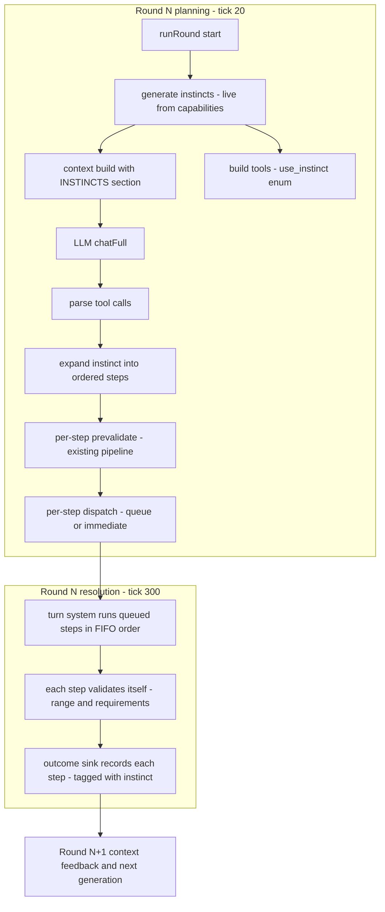

# Instincts — Runtime-Generated Behavior Primitives for the LLM Agent

> **Status:** Approved-for-implementation specification (architect deliverable — design only, no code in this doc)
> **Scope:** LLM agent path only ([`LLMAgentController.js`](../../src/controllers/networking/LLMAgentController.js) + [`LlmContextController.js`](../../src/controllers/networking/LlmContextController.js) + [`LlmAgentFeedbackController.js`](../../src/controllers/networking/LlmAgentFeedbackController.js) integration). The deterministic brain ([`NpcAIController.js`](../../src/controllers/ai/NpcAIController.js)) is **not** touched.
> **Audience:** Implementers. Every section lists the exact files, the exact data shapes, and testable assertions.
> **Conventions this spec follows:** [`project_rules.md`](../project_rules.md) (PascalCase for new classes, data-driven registries, structured errors, `Logger` only, public-API-only facade access), [`controller_patterns.md`](../controllers/controller_patterns.md) (logic-controller DI, state-owner vs logic-controller split), [`system_map.md`](../architecture/system_map.md) (hierarchy placement), [`llm_turns_npc_spec.md`](../llm_turns_npc_spec.md) §6 (agent architecture, tool strategy, limits), [`llm_agent_action_feedback_plan.md`](../llm_agent_action_feedback_plan.md) (feedback capture/injection), and the "why over how" wiki principle (BUG-072) — this doc explains design intent; method internals live in JSDoc.

---

## 1. Why the LLM gets generated behavior primitives

### 1.1 The problem the flat action list creates

The LLM agent today receives a **flat vocabulary of atomic actions** (`execute_action` with an `actionName` enum from [`data/actions.json`](../../data/actions.json)) and must plan multi-step behavior itself: to fight, a weak local model (4.5 s budget, 512 `max_tokens`, one retry — llm_turns_npc_spec §6.5) must emit two correctly-parameterized tool calls in the right order — `move {targetX, targetY}` then `droid punch {targetComponentId, componentId}` — recovering every parameter from the raw context. Each extra tool call is another chance for a malformed argument, a wrong id, or a wasted retry. The existing `chase_attack` behavior in [`NpcAIController.js`](../../src/controllers/ai/NpcAIController.js) proves the *behavior* is valuable; the LLM path just cannot express it compactly.

### 1.2 What an instinct is

An **instinct** is a high-level behavior whose **name and action list are generated by code at runtime** from the action registry and the entity's live capabilities — never hardcoded fixed strings (not in `data/`, not in the prompt). Reference example: the instinct `chase_attack` expands to `move` then `attack`. The LLM calls the instinct; the server does the actions:

- **Stable high-level vocabulary.** The name is a function of *which behavior roles the entity can perform*, not of volatile stat values (see §3.4). The model learns a small, stable verb set (`chase`, `chase_attack`, …) instead of re-deriving multi-step plans each round.
- **Less per-action micromanagement.** One tool call (`use_instinct` + optional target entity id) replaces two parameter-heavy calls; the server resolves all parameters (target, direction, source/target components) deterministically.
- **Single source of truth = the action registry.** Instinct content is *derived* from `data/actions.json` + the capability cache (BUG-018 generic-actions principle, llm_turns_npc_spec §6.2: one generic tool whose enum is generated from data, never hardcoded). Add or remove an action in the registry, and the instinct vocabulary evolves automatically — no prompt edits, no data-file instinct lists.
- **Server stays authoritative.** Consistent with Feature C's "the model proposes, the world disposes": the model chooses *what* (instinct + optional target); the server owns *how* (parameter resolution, ordering, validation, dispatch through the existing pipeline).

### 1.3 Why a hybrid tool and not more data

The alternative — describing multi-step behavior in `data/actions.json` — would mix runtime-capability logic (which of two movement actions this body can do *right now*) into static data, and would still force the LLM to emit multiple tool calls. A **new LLM tool `use_instinct`** keeps the 3-tool-maximum discipline (llm_turns_npc_spec §6.2: small local models are reliable with few tools), reuses the entire existing validation/dispatch pipeline, and costs the model one extra enum to learn.

---

## 2. Architecture

### 2.1 New module and its placement

**New file: `src/controllers/ai/InstinctController.js`** — a **stateless logic controller** (no owned state, no `getAll()`) that (a) *generates* the instinct list for an entity from the action registry + live capabilities, and (b) *expands* a named instinct into an ordered, fully-parameterized action sequence.

Placement rationale (per [`controller_patterns.md`](../controllers/controller_patterns.md) §4 and [`system_map.md`](../architecture/system_map.md)):

| Question | Answer | Why |
|---|---|---|
| Controller or util? | **Logic controller** | Generation/expansion must read the **live facade** (capability gate, entity positions, action registry). A stateless `src/utils/` module would have to be handed facade data on every call, leaking capability/registry internals to each caller. Logic controllers are "pure functions of injected state" that read world state via the facade — exactly this shape. |
| Which directory? | **`controllers/ai/`** | It is NPC *behavior* logic — the LLM-side twin of the deterministic brain's behavior registry, which lives in `ai/` ([`NpcAIController.js`](../../src/controllers/ai/NpcAIController.js)). It is **not** LLM transport (`networking/`): it never talks to a model. Keeping it in `ai/` leaves it reusable by the deterministic brain later (explicit non-goal today). |
| State owner or not? | **Not** | Instincts are regenerated per round from live state; there is nothing to persist or broadcast. Consequently: **no persistence schema change, no broadcast entry** (same exclusion rule as `RoomChatController`/`LlmAgentFeedbackController`). |
| Who constructs it? | **Composition root** ([`WorldComposition.js`](../../src/composition/WorldComposition.js)) | Per controller_patterns, logic controllers are built in the composition root (Layer 3, next to `LlmContextController`/`HintController`, which take `{ actionRegistry }`); the facade is injected afterwards via `setWorldStateController()`. It is stored on the facade as a reference (like `llmContextController`, `hintController`, `llmAgentFeedbackController`) but **not** added to the broadcast `subControllers` map. |

Wiring (matches existing precedents exactly):

- **Composition root:** construct `new InstinctController({ actionRegistry })`; pass as facade dep; call `setWorldStateController(worldStateController)` in the post-construction injection step; add to the returned `subControllers` inspection map (tests only — no broadcast).
- **Facade** ([`WorldStateController.js`](../../src/controllers/WorldStateController.js)): store `this.instinctController = deps.instinctController ?? null` (no new public wrapper needed — both the renderer and the agent read the reference through the facade, matching how `llmContextController`/`llmAgentFeedbackController` are read).
- **Server** ([`server.js`](../../src/server.js)): add `instinctController: worldStateController.instinctController` to the existing `LLMAgentController` constructor call (alongside `llmContextController`, `roomChatController`, `turnSystemController`).
- **No** changes to `LLMController`, routes, or the client.

### 2.2 Public surface

```
class InstinctController {
    constructor({ actionRegistry })            // data/actions.json (already loaded by the composition root)
    setWorldStateController(facade)            // lazy reference; buildContext-style guard when used before injection

    // (a) GENERATION — live per call, never throws (returns [] on any facade error)
    generateForEntity(entityId): Array<Instinct>

    // (b) EXPANSION — live re-resolution at dispatch time
    expand(entityId, instinctName, { targetEntityId = null } = {}):
        { ok: true,  instinctName, targetEntityId, steps: [{ actionName, params }] }
      | { ok: false, instinctName, code, error }   // codes: UNKNOWN_INSTINCT | TARGET_NOT_FOUND |
                                                   //   TARGET_NOT_IN_YOUR_ROOM | CANNOT_TARGET_SELF |
                                                   //   NO_TARGET_IN_YOUR_ROOM | NO_EXECUTABLE_STEPS
}

// Instinct shape (what the LLM sees; also passed into buildContext and the tool enum)
{ name: string,            // e.g. "chase_attack" — composed per §3
  description: string,     // one generated line, e.g. "Move toward the target (move), then attack the target (droid punch)"
  roles: [ { role, word, action } ] }   // resolved roles in template order; `action` is the chosen registry action
```

### 2.3 (a) Instinct generation

**Templates are code-defined** (module-level constant in `InstinctController.js`), because the *shape* of a behavior is a design decision, not world data (data files must stay free of instinct strings — confirmed user requirement). Only one template ships:

| Template key | Roles in order | Candidates per role (registry names, code list) |
|---|---|---|
| `chase_attack` | `movement`, then `attack` | movement: `move`, `dash` — attack: `droid punch`, `cut`, `shootT1` |

The generator is **template-driven**: it iterates the template array (deterministic order) and, per role, resolves exactly one action:

1. **Capability filter.** A candidate survives only if it exists in the registry *and* the entity can execute it right now. Gate = `facade.getActionsForEntity(entityId)[name].canExecute.length > 0`, read from **one** `getActionsForEntity` snapshot per generation (see cost note below). This is the same gate the agent's `_prevalidateAction` uses, so an instinct can never promise an action the pipeline would reject.
2. **Ranking.** Survivors are ranked by the **best `canExecute[].score`** across their capability entries (descending). That score is the component-compatibility score `ComponentCapabilityController` already computes using the shared [`ActionScoring.js`](../../src/utils/ActionScoring.js) constants — the instinct generator **consumes** that ranking; it adds no new scoring code (reusing the capability engine keeps one scoring authority). **Tie-break: registry order** (ascending index in `Object.keys(actionRegistry)`), so with equal scores `move` beats `dash` and `droid punch` beats `cut`/`shootT1` — which is exactly the reference behavior (`chase_attack` performs `move` then `attack`).
3. **Name composition.** From the *resolved* roles, in template order: `name = role words joined by "_"`, where each role's word comes from the **role→word map defined in code** (`movement → "chase"`, `attack → "attack"`). A role that resolved **no** action is omitted from the name (the name never promises what the body cannot do). If **no** role resolves, the template produces **no instinct**.
4. **Description line.** Generated, one line: the per-role phrase templates (code) with the chosen action name substituted, joined with `, then ` — e.g. role phrases `movement → "move toward the target ({action})"`, `attack → "attack the target ({action})"` ⇒ `chase_attack: Move toward the target (move), then attack the target (droid punch)`.
5. **Collision pass.** §3.3 below (unique within the NPC's set, and never equal to a literal action name).

**Cost / caching.** Generation is deliberately **recomputed live, once per round**: one `getActionsForEntity` snapshot (one world clone — the renderer already pays this same cost per round in `_sectionActions`) plus a handful of `canExecute` reads. The agent generates once in `runRound` and *passes the result* both to `buildContext` (options) and to `_buildTools` — no second generation, no cross-round cache (a cache would risk serving stale capabilities; the capability engine already caches the expensive part).

### 2.4 (b) Instinct expansion

`expand()` runs **at dispatch time** (same tick as the LLM response, during the planning window) so the sequence reflects live state, not the prompt-time snapshot. Output is an ordered `[{ actionName, params }]` list **compatible with the existing `_prevalidateAction` / `_dispatchAction`** — the expanded steps feed those two existing methods verbatim; no second executor exists.

**Target resolution** (the instinct's only LLM-supplied input):

| LLM supplied | Resolution |
|---|---|
| `targetEntityId` given | Must pass `IdResolver.isEntityId`, exist (`facade.getEntity`), not be the NPC itself, share the NPC's room (`location` equality), and have finite `spatial` — otherwise the matching error code above. |
| absent | **Nearest eligible entity in the same room** — candidates = other entities with finite `spatial`; nearest by Euclidean distance; **tie-break: ascending `entityId`** (deterministic; mirrors `NpcAIController._chaseAttackBehavior`). No candidate → `NO_TARGET_IN_YOUR_ROOM`. |

**Step parameters** (per resolved role, in template order):

| Role | Action chosen at generation time | `params` |
|---|---|---|
| `movement` | `move` or `dash` (ranked) | `{ targetX, targetY }` = target's current finite spatial position. The action's own `deltaSpatial speed` semantics (`:Movement.move`) make each execution one step — passing the full target point means "advance toward", identical to the deterministic brain's chase move. |
| `attack` | `droid punch` / `cut` / `shootT1` (ranked) | `{ targetEntityId, targetComponentId, componentId }` — `targetComponentId` = deterministic target-component pick (first component with finite durability ≥ 1; if that one is broken, first usable one; none usable → the attack step is dropped, §5); `componentId` = the NPC source component from the **best-scoring `canExecute` entry** of that action (the hand/arm that carries strength/sharpness — the same component the capability engine would pick). |

Every step's `params` also carries the reserved internal key **`_instinct: <instinctName>`** (see §2.6 for why).

**Per-step validation + abort rule.** Each expanded step is re-validated through the *existing* `_prevalidateAction` (registry check, typed-id check via `IdResolver`, capability gate) before dispatch. If step *i* fails pre-validation, steps *i+1…n* are **aborted** (recorded as failed with `aborted: <step i action> failed pre-validation` — they are dependent on the chain) and never dispatched. If **all** steps drop out, `expand()` returns `ok:false, code:NO_EXECUTABLE_STEPS`.

**Max-sequence guard.** Named constant `MAX_INSTINCT_STEPS = 5`: expansion truncates any template that ever grows beyond it (today's template yields 2). This bounds one `use_instinct` call independent of the turn system's per-round queue cap (3) and the NPC's `maxWorldActionsPerRound` (default 2), which additionally apply at dispatch time (§4).

### 2.5 (c) `LLMAgentController` integration

Changes are additive; the existing `execute_action` / `speak_in_room` contracts are untouched (§7).

1. **Constructor:** new dep `instinctController = null` (may be absent in minimal test compositions — every call below is guard-tolerant, `runRound` must never throw out of the tick hook).
2. **`runRound`:** after the entity guard, `const instincts = this._safeGenerateInstincts(npcEntityId)` (try/catch → `[]` + `Logger.warn`). The result is passed to `buildContext(entityId, { …, instincts })` (preferred source for the renderer, §2.6) and to `_buildTools(entityId, instincts)`.
3. **`_buildTools`:** registers a **third tool** only when the generated list is non-empty:

   ```
   use_instinct
     description: "Perform a whole behavior at once: the server executes the instinct's
                   action sequence for you. See the YOUR INSTINCTS section of the context."
     parameters:
       instinct        (string, enum = the generated names this round, required)
       targetEntityId  (string, ent-…, optional — "the entity the instinct acts on;
                        default: nearest entity in your room")
   ```

   The enum is **rebuilt every round from that round's generation** — the model can only name what the NPC can actually do. Empty list → no `use_instinct` tool at all (the context section shows `(none)`).
4. **`_parseToolCalls`:** new branch for `use_instinct` → parsed entry `{ tool: 'use_instinct', args: { instinct, targetEntityId? }, id }` collected in a new `parsed.instincts` array (alongside the existing `speaks` / `actions` / `prose`).
5. **Dispatch — new `_dispatchInstinct(npcEntityId, entry, round, result)`:**
   1. `expanded = instinctController.expand(npcEntityId, args.instinct, { targetEntityId: args.targetEntityId })`.
   2. `!ok` → record one `result.actions` entry `{ actionName: "use_instinct(" + name + ")", success: false, detail: error, instinct: name }`; this counts as a *pre-validation failure* for the one-retry rule (the error text becomes the tool-role feedback).
   3. `ok` → for each step in order: existing `_prevalidateAction(npcEntityId, { actionName, …params })`, then existing `_dispatchAction` (queue via turn system during planning / immediate fallback otherwise). Each step produces a `result.actions` entry `{ actionName, queued, success, detail, instinct }` — the `instinct` tag is what later makes the feedback line reference the instinct (§2.6). A step that fails pre-validation, or whose `queueAction` is rejected (`QUEUE_FULL` / `PLANNING_CLOSED` / window closed), **aborts the remaining steps** (recorded as aborted, §2.4) and dispatch stops for this call.
6. **Same-round tool feedback** (`_buildFeedbackMessages`): new `use_instinct` branch → payload `{ success, detail? }` aggregated over the call's steps: all steps queued/succeeded → `{ success: true }`; else `{ success: false, error: "<first failing step's detail>" }`. The aggregated form (one tool-role result per tool call) keeps the retry-loop contract exactly as today.
7. **System prompt:** add one line to the world-rules block: *"You may call use_instinct to perform a whole behavior (e.g. chase and attack) in one call; it is preferred over chaining execute_action calls for the same intent."*

### 2.6 (d) `LlmContextController` + `LlmAgentFeedbackController` integration

**Context — new section** in `buildContext`:

- Header: **`=== YOUR INSTINCTS ===`**, placed **after** `=== YOUR ACTIONS (executable now) ===` and **before** `=== HINTS ===` — the model reads the raw actions, then the pre-made sequences built from them.
- One line per generated instinct: `- <name>: <description>` (the generated description from §2.3). Empty → header + `(none)` (stable-structure rule, like every other section).
- Source: `options.instincts` when the caller provided them (the agent path — no double generation), else `facade.instinctController?.generateForEntity(entityId) ?? []` (the `GET /llm/context` debug-endpoint path); absent controller → `(none)`, never throws.
- Budget: `BUDGET` gains `maxInstincts: 5` (display cap) and a new truncation-ladder step — **after** the existing chat-halving step, `stats.truncated.instincts` set when it fires: the section is reduced to its first 3 entries. Typical cost is ~2 lines (< 200 chars), so in practice it rarely triggers, but the section participates in the 4000-char cap like all sections. `data.instincts` is added to the structured mirror (debug endpoint unchanged otherwise).

**Feedback — instincts are visible to the model across rounds.** The existing per-agent outcome store ([`LlmAgentFeedbackController.js`](../../src/controllers/networking/LlmAgentFeedbackController.js), llm_agent_action_feedback_plan §3.1) gains one **optional sanitized field** on the outcome entry: `instinct: string | null`.

- **Immediate outcomes (Capture Point B, agent-side):** `_recordImmediateOutcomes` sets `instinct` from the step's tag when the step came from an instinct.
- **Resolution outcomes (Capture Point A, turn-system sink):** the sink's outcome construction in [`TurnSystemController.js`](../../src/controllers/core/TurnSystemController.js) `_emitActionOutcome` copies the reserved `_instinct` key out of the queued entry's `params` into the outcome (`instinct: entry.params?._instinct ?? null`). The turn system **interprets nothing** — it only forwards one opaque params key through the feedback seam it already owns; its "timing and ordering only" contract is preserved.
- **Rendered line** (`=== YOUR LAST ACTIONS & RESULTS ===`): when `outcome.instinct` is set, the existing line gains a tag: `[r12] droid punch (comp-…) → FAILED: out of range  (instinct: chase_attack)`. Unchanged for plain `execute_action` outcomes.
- Why this shape: the queued move/attack are **separate queue entries**, so resolution records them as separate outcomes; the tag is what tells the model *why* they happened together ("my `chase_attack` closed with the punch out of range") — the information that breaks action loops (llm_agent_action_feedback_plan root symptom). No persistence change: the store is ephemeral by design (that plan, §3.4).

### 2.7 One-round flow



---

## 3. Name-generation contract

Precise, implementation-binding rules (all in code; nothing in data files):

1. **Composition.** For a template, let `R` be the roles that resolved at least one candidate action, in template order. `name = join(words(R), "_")` where `word(role) = ROLE_WORDS[role]` and `ROLE_WORDS` is a code-level map (`movement → "chase"`, `attack → "attack"`).
2. **Fallback word.** If a role key has **no entry** in `ROLE_WORDS`, its word is the role key itself, sanitized to snake_case (lowercase; runs of non-alphanumerics collapsed to `_`; leading/trailing `_` stripped). Templates may therefore be extended without touching the naming code.
3. **Omission, not placeholder.** A role with no executable candidate contributes **nothing** to the name (no `"chase_none"`, no `"(unavailable)"`). The name is always a truthful summary of what the instinct will do — a model that calls `chase_attack` is guaranteed an attack step will be attempted.
4. **No instinct, not an empty one.** A template whose roles all fail resolution produces **no entry** in the generated list (and therefore no enum value, no context line).
5. **Collision avoidance (one rule, two namespaces).** Generated names must be unique **within the NPC's instinct set** and **must not equal a literal action name** in the registry (keeps the `use_instinct` and `execute_action` vocabularies unambiguous for weak models). Detection is done in template order after composition: a name already claimed by an earlier template, or equal to a registry action name, is renamed by appending `_2`, then `_3`, … until free (deterministic — first claimant wins).
6. **Stability guarantee (the point of the design).** The name depends only on *which roles resolve*, never on *which specific action wins the ranking* or on numeric stat values. Consequences: a knife losing sharpness (but staying ≥ threshold) changes nothing; the knife breaking swaps `cut` for another attack **without renaming**; a merchant whose strength is below the punch threshold never shows an `…_attack` name. The model's learned vocabulary churns only when a whole capability class appears or disappears.

---

## 4. Execution semantics

- **One call, full sequence, same round.** A `use_instinct` call expands to the **complete** ordered sequence (e.g. `move` then `attack`) at dispatch time. During the planning window each step is queued as its **own** `queueAction` entry with `source: 'npc'`; the turn system executes a given actor's entries **in FIFO order** at resolution (llm_turns_npc_spec §5.5), so the move lands before the attack in the same resolution pass. In turn-less worlds/tests each step executes immediately, in order.
- **Budget interaction.** The steps consume the NPC's `maxWorldActionsPerRound` (default 2) and the turn system's per-round queue cap (3). A 2-step instinct exactly fills the default action budget; if a later dispatch is rejected (`QUEUE_FULL` / `PLANNING_CLOSED` / window closed), the remaining steps of **that** instinct are aborted (recorded, §2.4) — the agent never silently drops a middle step.
- **Move fails (blocked) at resolution.** Queued steps validate *independently* at resolution — the turn system is semantically ignorant of chains (it owns timing/ordering only). So if the move fails (e.g. its requirement stat was consumed by an earlier action of the same actor), the queued attack **still runs and fails its own range check** (target out of range) → discarded with the standard failure log, round continues. Both failures reach the LLM as separate tagged feedback entries, which is exactly the signal it needs to adapt next round (dash instead of move, or attack directly when in range). **No cascading cancellation at resolution; aborts happen only at dispatch time (§2.4).**
- **Attack out of range (no move / move blocked).** Same path: range check at resolution discards the attack, outcome recorded, no error thrown out of the resolution loop.
- **Target drift.** Parameters are frozen at expansion (planning) time, but the range validator resolves the target's *live* position at resolution — a target that flees mid-window can legitimately take the attack out of range. Documented, accepted; the LLM re-decides next round with fresh context.
- **Max-sequence guard.** `MAX_INSTINCT_STEPS = 5` (named constant) bounds any single instinct's expansion; combined with the two round-level caps above, one `use_instinct` call can never produce more than `min(5, queue cap, action budget)` executed steps.

---

## 5. Edge cases

| Case | Decision | Rationale |
|---|---|---|
| **NPC lacks any attack action** (no strength for punch, no knife, no T1) | **Generate a move-only instinct** (`chase`), not "no instinct". | The name stays honest (§3.3) and the LLM still gets a meaningful one-call behavior instead of raw `move` parameter-guessing. Not-generating would leave the exact micromanagement problem we are solving, for the most common weak NPC. (Concrete: the shipped merchant `Bolt` — strength 12 < punch's 15 — gets `chase`, move-only; see Appendix A.) |
| **No entity in the room / no target in range** | Generation is unaffected (instincts exist regardless of room occupancy — the model may plan ahead); **expansion fails** with `NO_TARGET_IN_YOUR_ROOM` → tool feedback error, model may retry with an explicit target or talk. | Expansion is the moment target validity matters; failing loud (not silently no-op) keeps the model informed. |
| **`dash` chosen vs `move`** | Both rank in the movement role; the winner is the higher capability score, ties → registry order (`move`). `dash` only wins when the capability engine genuinely scores it better (its stricter requirements — durability ≥ 30 — already gate it). | Score-driven, data-aware; no hardcoded speed preference. The instinct *name* is unaffected either way (§3.6). |
| **Provided target invalid** (wrong id format / vanished / other room / self / non-finite spatial) | `expand` fails with the matching code (§2.4); no fallback to "nearest" for an *explicitly* supplied target (a silent fallback would hide the model's mistake). | Explicit intents fail explicitly; only the *absent* target defaults to nearest. |
| **Target's components all broken** (no usable `targetComponentId`) | Attack step dropped; the movement step still ships (move-only this round); feedback shows the attack as `aborted: no usable target component`. | Mirrors the deterministic brain's "attack ignored rather than wasted" rule (NpcAIController C11b). |
| **Capabilities change between generation and dispatch** (same tick: practically impossible; across the round for queued expansion: n/a — expansion is dispatch-time) | Every step is re-validated at dispatch (§2.4); a now-unexecutable step drops and aborts its dependents. | Defense in depth; the capability gate is the single authority in both places. |
| **Multiple future templates** (e.g. a `flee` template with a single `movement` role; a `strip` template with `attack` then `movement`) | The generator is template-driven: add an entry to the code-level template array (roles, candidates, word, phrase) and generation/collision/description/expansion all derive automatically. Only `chase_attack` ships now. | Extensibility without new concepts; the collision rule (§3.5) keeps any number of templates name-unique. |
| **Instinct controller absent** (minimal test compositions) | Agent: `_safeGenerateInstincts` → `[]`; no `use_instinct` tool; renderer: section `(none)`. Nothing throws. | Matches the existing guard-tolerant posture for optional layers (feedback store, hints). |
| **Model calls an instinct name that no longer generates** (name churned between prompt render and LLM response — same tick, but possible under a mid-round capability rescan) | `expand` → `UNKNOWN_INSTINCT` → error feedback; the model learns the current list from the next context. | The enum is a hint, not a guarantee; the server re-checks live state, as it does for every action. |
| **`_instinct` key in `params`** | Reserved internal key: the action pipeline never reads unknown param keys (consequences reference `:param` placeholders explicitly); the turn system stores/forwards it opaquely; only the feedback sink lifts it into the outcome. It appears in `state.turns.queues` and persistence snapshots as inert data. | Keeps the turn system and the pipeline semantically ignorant while giving cross-round feedback its correlation handle. |

---

## 6. Test plan

Vitest, following the existing mock-facade patterns of [`LLMAgentController.test.js`](../../test/unit/LLMAgentController.test.js) (scripted `chatFull`, hand-built world/turns stubs), [`LlmContextRenderer.test.js`](../../test/unit/LlmContextRenderer.test.js) (mock facade, section assertions) and [`NpcAIController.test.js`](../../test/unit/NpcAIController.test.js) (entity fixtures, capability gates).

### New: `test/unit/InstinctController.test.js`

Generation (mock facade: `getActionsForEntity` returning per-action `canExecute` with scores; `getEntity`/`getEntities` fixtures):

- G1: only `move` executable ⇒ exactly one instinct, name `chase` (no `attack` part), step action `move`, description mentions `move`.
- G2: `move` and `dash` executable with **equal** scores ⇒ movement action is `move` (registry-order tie-break); name still `chase`.
- G3: `droid punch` (score 95) beats `cut` (score 80); `shootT1` not executable ⇒ name `chase_attack`, attack action `droid punch`.
- G4: zero executable candidates in all roles ⇒ `[]` (no instinct).
- G5: **determinism** — same facade state twice ⇒ deep-equal results (names, actions, description, order).
- G6: **collisions** — a second test template with the same role keys ⇒ suffix `_2`; a role-word combination that matches a literal registry action name ⇒ suffixed, never equal to the action name.
- G7: role key missing from the word map ⇒ name uses the sanitized role key.
- G8: facade method throws ⇒ `generateForEntity` returns `[]`, does not throw.
- G9: **bounded facade usage** — `getActionsForEntity` called at most once per generation (counter spy); no per-candidate clone.

Expansion:

- E1: explicit same-room in-range target ⇒ `ok:true`, two steps in order — `move {targetX, targetY}` equal to the target's spatial, then attack `{targetEntityId, targetComponentId, componentId}` — every `params` carrying `_instinct`.
- E2: no target ⇒ nearest same-room entity chosen (distance; tie → ascending id; other-room entities ignored) — mirrors NpcAIController test cases 3/5/7/8.
- E3: error codes — other room ⇒ `TARGET_NOT_IN_YOUR_ROOM`; unknown id ⇒ `TARGET_NOT_FOUND`; self ⇒ `CANNOT_TARGET_SELF`; empty room ⇒ `NO_TARGET_IN_YOUR_ROOM`; non-finite target spatial ⇒ excluded from nearest-scan / explicit target rejected.
- E4: gate flips false between generation and expansion for step 1 ⇒ step dropped, dependent attack aborted ⇒ `NO_EXECUTABLE_STEPS`; flips for step 2 only ⇒ `ok:true` with a single move step.
- E5: target with all broken components ⇒ attack step dropped, move step ships.
- E6: unknown instinct name ⇒ `UNKNOWN_INSTINCT`.
- E7: test template with 6 roles ⇒ steps truncated to `MAX_INSTINCT_STEPS` (5).

### Extended: `test/unit/LLMAgentController.test.js`

(Existing tests stay green unchanged — the agent tolerates an absent instinct controller. `makeAgent` gains an optional `instinctController` stub.)

- T1: scripted `use_instinct {instinct:'chase_attack', targetEntityId}` ⇒ **two** `queueAction` calls in order (`move` then `droid punch`), `source:'npc'`, resolved params asserted; `result.actions` length 2, each tagged with the instinct; `result.error` null.
- T2: `use_instinct` without target ⇒ params use the nearest entity's position.
- T3: unknown instinct name ⇒ one failed action entry (`unknown instinct "…"`) + **exactly one retry** carrying the tool-role error payload; nothing queued.
- T4: mid-sequence capability flip ⇒ first step queued, second failed/aborted, round completes, no throw.
- T5: **tool schema** — `chatFull` options contain `use_instinct` with `enum` equal to the generated names when non-empty; **absent** when the list is empty (assert only `execute_action` + `speak_in_room` — regression guard for the unchanged contracts).
- T6: turn mock rejects the second `queueAction` (`QUEUE_FULL`) ⇒ second step recorded failed, third (if any) aborted, round completes.
- T7: `buildContext` stub receives `options.instincts` equal to the generated list (single-generation contract).

### Extended: `test/unit/LlmContextRenderer.test.js`

- R1: section order — `=== YOUR INSTINCTS ===` appears between `YOUR ACTIONS` and `HINTS` (the existing six-headers test is updated to seven).
- R2: line format `- chase: move toward the target (move)` from `options.instincts`.
- R3: empty list ⇒ header + `(none)`; absent controller (no options) ⇒ `(none)`, no throw.
- R4: options omitted but facade exposes an instinct controller stub ⇒ section rendered (debug-endpoint path).
- R5: **budget** — padded context over 4000 chars with > 5 instincts ⇒ section reduced to 3, `stats.truncated.instincts === true`, total `stats.chars ≤ 4000`.
- R6: `data.instincts` mirror present in the structured output.

### Extended: `test/unit/LlmAgentFeedbackController.test.js`

- F1: `record` with `instinct:'chase_attack'` ⇒ `getRecent` returns it; F2: without ⇒ `instinct === null`; F3: non-string `instinct` ⇒ sanitized to `null` (consistent with existing sanitization tests); F4: defensive copy includes the field.

### Updated contract / integration

- `test/contract/worldStateController.contract.test.js` — public-surface snapshot gains `instinctController` (method-count comment updated).
- **New (recommended):** `test/contract/instinct.contract.test.js` — real `buildWorldState(null)` world + scripted LLM through the real agent: (a) spawn `merchantDroid` → generation yields exactly `chase` (move-only — the Appendix A case, asserted against real data); (b) a test NPC with strength ≥ 15 ⇒ `chase_attack` with `move` + `droid punch`; (c) scripted `use_instinct` ⇒ two queued entries in order, and the outcome sink's recorded outcomes carry the `instinct` tag after `onTick()` to resolution; (d) **persistence**: `serialize()`/`restore()` round-trip passes **without** any new schema section (assert the snapshot has no instinct key) — proves the stateless-by-design claim.

---

## 7. Non-goals

- **No `NpcAIController` behavior change** — the deterministic brain keeps its own hardcoded `chase_attack` registration; the instinct design is *reusable* by it later, but out of scope.
- **No new data files** — and no instinct strings or action-name lists in any existing data file. Templates, the role→word map, and role phrases live in code.
- **No client/UI changes** — instincts are server-internal; queued steps surface in `state.turns` like any action.
- **No changes to the `execute_action` / `speak_in_room` contracts**, to `LLMController`, to routes, or to the action pipeline.
- **No persistence schema change** — instincts are regenerated per round; there is no instinct state to persist (and the feedback store's `instinct` field is ephemeral by design).
- **No multi-target or branching instincts** — a template is a linear chain of single-target steps.

---

## 8. Files summary

| Action | Path | Change |
|---|---|---|
| **Create** | `src/controllers/ai/InstinctController.js` | generator + expander; code-level template, `ROLE_WORDS`, role phrases, `MAX_INSTINCT_STEPS` |
| Modify | [`WorldComposition.js`](../../src/composition/WorldComposition.js) | build `InstinctController({ actionRegistry })` (Layer 3), facade dep, post-construction `setWorldStateController`, returned-map entry |
| Modify | [`WorldStateController.js`](../../src/controllers/WorldStateController.js) | store `this.instinctController = deps.instinctController ?? null` |
| Modify | [`server.js`](../../src/server.js) | pass `instinctController` into the existing `LLMAgentController` constructor call |
| Modify | [`LLMAgentController.js`](../../src/controllers/networking/LLMAgentController.js) | dep + `_safeGenerateInstincts`; `runRound` generates once and threads to context/tools; `use_instinct` tool (enum per round); `_parseToolCalls` branch; `_dispatchInstinct` (reuses `_prevalidateAction`/`_dispatchAction`); `_buildFeedbackMessages` branch; system-prompt line; feedback tags |
| Modify | [`LlmContextController.js`](../../src/controllers/networking/LlmContextController.js) | `=== YOUR INSTINCTS ===` section (after YOUR ACTIONS), `options.instincts` preferred / facade fallback, `BUDGET.maxInstincts`, truncation ladder step + `stats.truncated.instincts`, `data.instincts`; feedback line gains `(instinct: …)` tag |
| Modify | [`LlmAgentFeedbackController.js`](../../src/controllers/networking/LlmAgentFeedbackController.js) | optional sanitized `instinct` field on the outcome entry |
| Modify | [`TurnSystemController.js`](../../src/controllers/core/TurnSystemController.js) | `_emitActionOutcome` copies `_instinct` from queued `params` into the outcome (one line; semantically inert) |
| Modify | `test/unit/LLMAgentController.test.js`, `test/unit/LlmContextRenderer.test.js`, `test/unit/LlmAgentFeedbackController.test.js`, `test/contract/worldStateController.contract.test.js` | extensions per §6 |
| Create | `test/unit/InstinctController.test.js`, `test/contract/instinct.contract.test.js` | per §6 |

---

## Appendix A — Concrete effect on the current world

- **Bolt the Merchant** (`merchantDroid`, the only LLM NPC): strength 12 < 15 (no punch), no knife (no cut), no T1 (no `shootT1`); movement: both `move` and `dash` executable (rolling balls 10, core durability 80 ≥ 30), equal scores ⇒ registry-order tie-break ⇒ `move`. Generated instinct: **`chase`** — "move toward the target (move)". One tool call, zero micromanagement, and the name honestly says it never attacks.
- **Any NPC with strength ≥ 15** (e.g. the player droid's stat profile, if ever LLM-driven): **`chase_attack`** — `move` then `droid punch`, exactly the reference example; with an equipped sharp knife the attack role can rank `cut` instead — same name, same call, different body.
- **Player droid / deterministic NPCs:** unaffected (non-goal).

*End of specification.*
