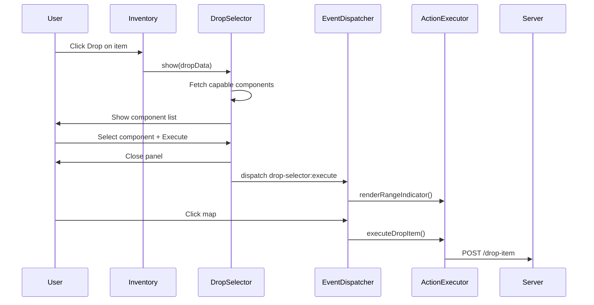
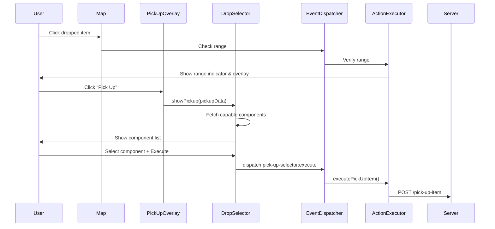

# Item Drop & Pickup System

## Overview

The item drop/pickup system provides a symmetrical user experience for dropping and picking up items. Both flows use the same `DropSelectorController` overlay. The drop flow uses a map-click pattern for placement, while the pickup flow uses an immediate execution pattern after range verification and component selection.

## Design Decisions

### Why Mirror the Drop Flow for Pickup?

The pickup flow was redesigned to mirror the drop flow exactly:

1. **Consistency**: Users expect the same visual language for both operations
2. **Reduced cognitive load**: One pattern for both actions
3. **Code reuse**: The `DropSelectorController` handles both flows, reducing duplication

### Why Not Use ComponentViewer for Pickup?

The original pickup flow used `ComponentViewer` (a floating window showing component details), which was inconsistent with the drop flow. The new flow uses the drop selector overlay, providing:

- A single, unified component selection experience
- Visual feedback via range indicator on the map (for drop) or immediate execution (for pickup)
- Consistent button labels and panel structure

### Why Room-Based Item Positioning

Dropped items are now associated with the room in which they were dropped. Items stored in the dropped items collection include a room identifier that is used for two purposes:

- **Client-side filtering**: Dropped items are only rendered on the spatial map when the viewing entity is in the matching room. This prevents items from appearing across all rooms regardless of where they were physically dropped.
- **Server-side validation**: The pickup handler verifies that the entity attempting to pick up an item is in the same room as the item. If the rooms do not match, the pickup is rejected with a clear error.

This design ensures that the visual representation (items on the map) and the logical world state (items existing in specific rooms) are aligned. Items dropped in one room are invisible and inaccessible from other rooms.

## Flow Comparison

### Drop Flow

### Pickup Flow (Updated)

## Key Components

### DropSelectorController (`public/js/DropSelectorController.js`)

Handles both drop and pickup component selection:

- **Drop Mode** (`show()`): Opens for dropping items from inventory
- **Pickup Mode** (`showPickup()`): Opens for picking up dropped items from the map

Both modes share:
- The same overlay DOM element (`#drop-selector-overlay`)
- The same component list rendering
- The same selection toggling logic
- The same execute/cancel handlers (dispatching different events)

### Server Endpoints

| Endpoint | Method | Purpose |
|----------|--------|---------|
| `/inventory/:entityId/capable-drop-components` | GET | Components capable of dropping |
| `/inventory/:entityId/capable-pickup-components` | GET | Components capable of picking up |
| `/pick-up-item` | POST | Execute pickup action |

Both capable component endpoints return the same data structure — any component with Physical, Movement, or Manipulation traits is considered capable.

## UI Elements

The drop selector overlay (`#drop-selector-overlay`) is shared between both flows:

- **Title**: Dynamically updated to show "Drop: {itemType}" or "Pick Up: {itemName}"
- **Component list**: Same structure for both flows
- **Execute button**: Label unchanged (just "Execute")
- **Range indicator**: Drop uses red (`#ff4444`), pickup uses green (`#44ff44`) for visual distinction

### Why Hover-Based Range Feedback?

Before this feature, users had no visual indication of whether a dropped item was within pickup range until they attempted to pick it up and received feedback. The hover-based range indicator provides immediate visual feedback before any commitment (click), reducing failed pickup attempts and making the pickup range conceptually tangible.

### Why the Callback Pattern for Hover Events

The hover callback pattern keeps UIManager focused on DOM event handling while App handles the range calculation logic. This follows the Single Responsibility Principle — UIManager manages the DOM layer and delegates meaning to App through callbacks, rather than embedding range knowledge directly into the UI module.

### Why Green/Red Color Scheme?

The green (`#44ff44`) and red (`#ff4444`) colors for the hover indicator align with existing range indicator conventions: the drop action uses red for its range circle, and the pickup action uses green. The hover indicator adopts the same palette so users immediately associate green with "within pickup range" and red with "out of range," maintaining visual consistency across the drop/pickup experience.

## Event System

| Event | Dispatched By | Handled By |
|-------|--------------|------------|
| `drop-selector:execute` | DropSelectorController | App.js `_onDropSelectorExecute()` |
| `pick-up-selector:execute` | DropSelectorController | App.js `_onPickUpSelectorExecute()` |

## Related Files

- `public/js/DropSelectorController.js` — Component selection overlay controller
- `public/js/PickUpOverlayController.js` — Initial item info display
- `public/js/ActionExecutor.js` — Execution handlers
- `public/js/App.js` — Main orchestrator
- `public/js/EventDispatcher.js` — Map click handling
- `src/routes/inventoryRoutes.js` — Server endpoints
