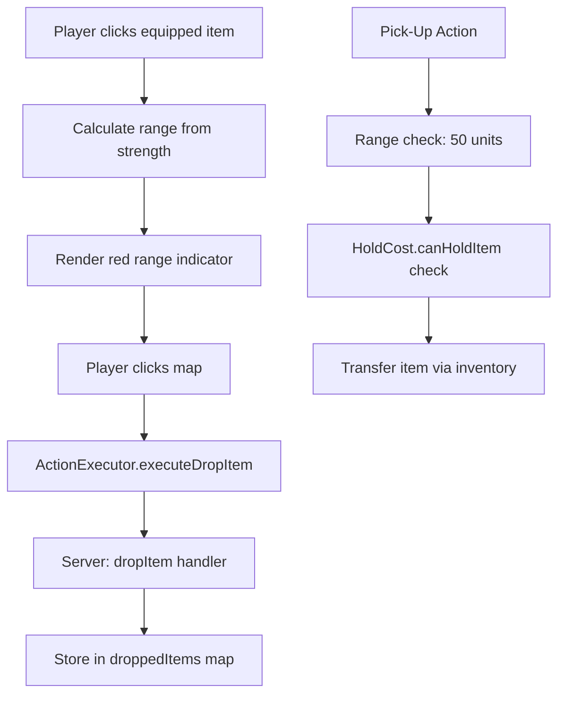

# Item Drop & Pick-Up System

## Overview

The item drop and pick-up system extends the existing inventory architecture with two new spatial interaction modes:

1. **Drop Item** — Players can drop equipped items at spatial coordinates, with range determined by `Physical.strength`
2. **Pick-Up Item** — Entities can pick up items from other entities/components, validated against holding cost requirements

## Design Decisions

### Why strength-based drop range?

Strength is the most intuitive stat for physical reach and throwing distance. The formula `DROP_BASE_RANGE + (strength × DROP_RANGE_MULTIPLIER)` provides a linear scaling that feels natural — stronger entities can throw items farther.

### Why holding cost validation on pick-up?

Holding costs represent the physical/mental burden of carrying an item. If a component cannot meet the holding cost requirements, it cannot wield that item effectively. This check on pick-up (not just equip) ensures items can only enter components that can actually use them.

### Why separate consequence handlers?

Following SRP, each consequence type has its own handler module:
- `DropItemHandler.js` — Handles dropping items at world coordinates
- `PickUpItemHandler.js` — Handles picking up items with validation

## Architecture

## Data Flow

1. **Drop**: Client sends `{itemId, itemType, targetX, targetY}` → Server validates equipped item → Unequips + removes from inventory → Stores at coordinates
2. **Pick**: Client sends `{sourceEntityId, sourceItemId, sourceComponentId, targetEntityId, targetComponentId}` → Server validates holding cost → Removes from source → Adds to target

## See Also

- [Inventory System](../data/inventory_system.md)
- [Holding Cost System](../controllers/internal_component_controller.md)