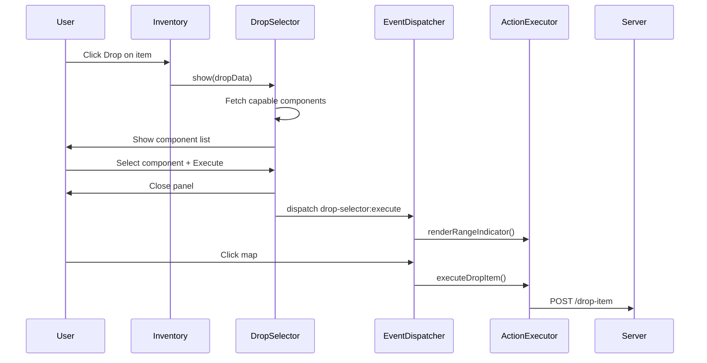
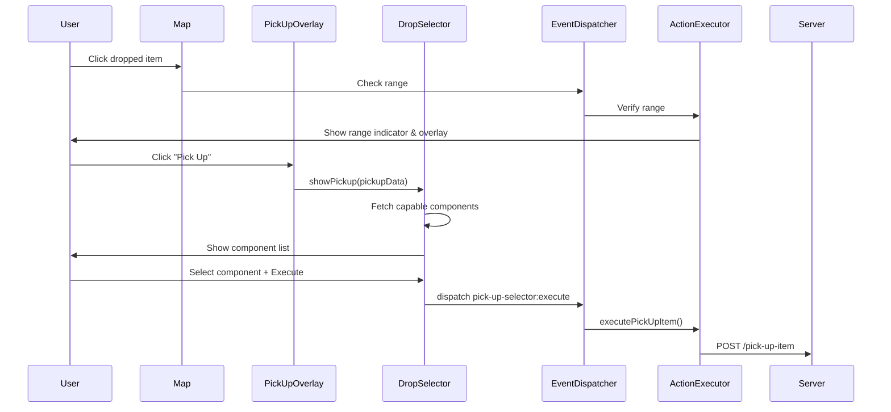

# Item Drop & Pickup System

## Overview

The item drop/pickup system provides a symmetrical user experience for dropping and picking up items. Both flows use the same `DropSelectorController` overlay. The drop flow uses a map-click pattern for placement, while the pickup flow uses an immediate execution pattern after range verification and component selection.

## Design Decisions

### Why Mirror the Drop Flow for Pickup?

The pickup flow was redesigned to mirror the drop flow exactly:

1. **Consistency**: Users expect the same visual language for both operations
2. **Reduced cognitive load**: One pattern for both actions
3. **Code reuse**: The `DropSelectorController` handles both flows, reducing duplication

### Why Not Use ComponentViewer for Pickup?

The original pickup flow used `ComponentViewer` (a floating window showing component details), which was inconsistent with the drop flow. The new flow uses the drop selector overlay, providing:

- A single, unified component selection experience
- Visual feedback via range indicator on the map (for drop) or immediate execution (for pickup)
- Consistent button labels and panel structure

## Flow Comparison

### Drop Flow

### Pickup Flow (Updated)

## Key Components

### DropSelectorController (`public/js/DropSelectorController.js`)

Handles both drop and pickup component selection:

- **Drop Mode** (`show()`): Opens for dropping items from inventory
- **Pickup Mode** (`showPickup()`): Opens for picking up dropped items from the map

Both modes share:
- The same overlay DOM element (`#drop-selector-overlay`)
- The same component list rendering
- The same selection toggling logic
- The same execute/cancel handlers (dispatching different events)

### Server Endpoints

| Endpoint | Method | Purpose |
|----------|--------|---------|
| `/inventory/:entityId/capable-drop-components` | GET | Components capable of dropping |
| `/inventory/:entityId/capable-pickup-components` | GET | Components capable of picking up |
| `/pick-up-item` | POST | Execute pickup action |

Both capable component endpoints return the same data structure — any component with Physical, Movement, or Manipulation traits is considered capable.

## UI Elements

The drop selector overlay (`#drop-selector-overlay`) is shared between both flows:

- **Title**: Dynamically updated to show "Drop: {itemType}" or "Pick Up: {itemName}"
- **Component list**: Same structure for both flows
- **Execute button**: Label unchanged (just "Execute")
- **Range indicator**: Drop uses red (`#ff4444`), pickup uses green (`#44ff44`) for visual distinction

## Event System

| Event | Dispatched By | Handled By |
|-------|--------------|------------|
| `drop-selector:execute` | DropSelectorController | App.js `_onDropSelectorExecute()` |
| `pick-up-selector:execute` | DropSelectorController | App.js `_onPickUpSelectorExecute()` |

## Related Files

- `public/js/DropSelectorController.js` — Component selection overlay controller
- `public/js/PickUpOverlayController.js` — Initial item info display
- `public/js/ActionExecutor.js` — Execution handlers
- `public/js/App.js` — Main orchestrator
- `public/js/EventDispatcher.js` — Map click handling
- `src/routes/inventoryRoutes.js` — Server endpoints