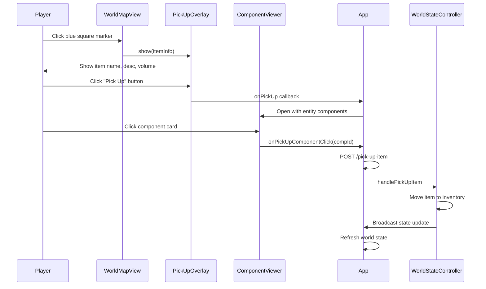

# Dropped Items on World Map — Pick-Up System

## Why This System Exists

> **Last Updated:** 2026-05-27 — Fixed coordinate system bug (BUG-082) and SVG rendering bug.

---

## Bug Fixes Applied

| Date | Bug ID | Fix |
|------|--------|-----|
| 2026-05-27 | BUG-082 | Fixed dropped items rendering off-screen due to coordinate system mismatch between game canvas (center-relative) and world map SVG (room-space). |
| 2026-05-27 | BUG-003 | Fixed SVG rendering crash caused by `svg` variable scope in `_renderDroppedItems()`. |

Players need a visual way to locate dropped items on the world map and perform pick-up actions using available components. Previously, dropped items were stored server-side but had no client-side representation or pick-up mechanism.

## Design Decisions

### Why blue squares?
- Blue (`#4488ff`) provides high contrast against the dark map background and neon-green room markers
- Squares are distinct from circular entity markers and rectangular room nodes
- Size (16x16px) is large enough to see but doesn't overwhelm room markers

### Why a separate pick-up flow instead of reusing drop flow?
- Drop flow goes: inventory → map click → execute drop
- Pick-up flow goes: map blue square → item info → component selection → execute pick-up
- Different data sources (dropped items array vs. entity inventory)
- Different selection requirements (pick-up needs component with free volume)

### Why component viewer for pick-up selection?
- Reuses existing component rendering infrastructure
- Shows component stats so players can make informed decisions
- Follows the "use existing patterns" principle

## Coordinate Systems

The world map uses **room-space coordinates** (absolute, positive values matching room definitions in `data/rooms.json`). This is different from the main game canvas which uses **center-relative coordinates** (offset from `CENTER_X/CENTER_Y`).

Key distinction:
- **World Map SVG** → Raw SVG viewBox coordinates = room-space (e.g., rooms at `x=0..1220`)
- **Game Canvas** → Center-relative coordinates (e.g., `x = svgX - CENTER_X`)

The drop item click handler uses raw SVG coordinates to match the room-space system expected by `WorldMapView._renderDroppedItems()`.

## Data Flow

## Files

| File | Purpose |
|------|---------|
| `src/controllers/consequences/PickUpItemHandler.js` | Server-side handler for pick-up consequence |
| `src/routes/worldRoutes.js` | `/world-map-with-items` and `/pick-up-item` endpoints |
| `public/js/WorldMapView.js` | Renders blue square markers on world map |
| `public/js/PickUpOverlayController.js` | Floating panel showing item info + pick-up button |
| `public/js/App.js` | Wires up the event flow between all components |
| `public/css/map.css` | Blue square marker styles |
| `public/css/floating-windows.css` | Pick-up overlay panel styles |