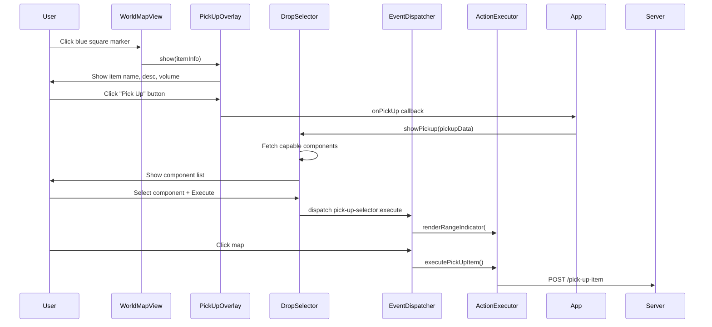

# Dropped Items on World Map — Pick-Up System

## Why This System Exists

> **Last Updated:** 2026-05-31 — Refactored pick-up flow to use DropSelectorController (mirrors drop flow).

---

## Bug Fixes Applied

| Date | Bug ID | Fix |
|------|--------|-----|
| 2026-05-27 | BUG-082 | Fixed dropped items rendering off-screen due to coordinate system mismatch between game canvas (center-relative) and world map SVG (room-space). |
| 2026-05-27 | BUG-003 | Fixed SVG rendering crash caused by `svg` variable scope in `_renderDroppedItems()`. |

Players need a visual way to locate dropped items on the world map and perform pick-up actions using available components. Previously, dropped items were stored server-side but had no client-side representation or pick-up mechanism.

## Design Decisions

### Why blue squares?
- Blue (`#4488ff`) provides high contrast against the dark map background and neon-green room markers
- Squares are distinct from circular entity markers and rectangular room nodes
- Size (16x16px) is large enough to see but doesn't overwhelm room markers

### Why mirror the drop flow for pick-up?
The pick-up flow was redesigned to reuse the `DropSelectorController` (same overlay, same component selection, same range indicator) for consistency:

1. **User experience**: Same visual language for both drop and pick-up
2. **Code reuse**: Single component selection overlay instead of duplicating in ComponentViewer
3. **Reduced cognitive load**: Users expect the same interaction pattern

### Why a separate overlay (PickUpOverlayController)?
- The initial item info display is short-lived — user clicks "Pick Up" to continue
- Separating info display from component selection keeps each module focused
- PickUpOverlayController acts as a one-time bridge between map interaction and DropSelectorController

### Why Hover Preview for Range?

Hover preview complements the click-based pickup flow through progressive disclosure: hovering reveals the range circle without triggering any action, while clicking commits to the pickup flow. This separation of concerns between exploration (hover) and commitment (click) allows users to visually assess range before interacting, reducing confusion about why a pickup might fail.

### Why Distinct Visual Styling for Hover Indicators?

The hover indicator uses different visual styling (lower opacity, thinner stroke, different dash pattern) from active action indicators to clearly distinguish between exploratory feedback and committed actions. Without this distinction, users might confuse the hover preview with an active drop/pickup range indicator, leading to uncertainty about whether an action is currently in progress.

## Coordinate Systems

The world map uses **room-space coordinates** (absolute, positive values matching room definitions in `data/rooms.json`). This is different from the main game canvas which uses **center-relative coordinates** (offset from `CENTER_X/CENTER_Y`).

Key distinction:
- **World Map SVG** → Raw SVG viewBox coordinates = room-space (e.g., rooms at `x=0..1220`)
- **Game Canvas** → Center-relative coordinates (e.g., `x = svgX - CENTER_X`)

The drop item click handler uses raw SVG coordinates to match the room-space system expected by `WorldMapView._renderDroppedItems()`.

## Data Flow

## Pickup Mode vs Drop Mode Comparison

| Aspect | Drop Mode | Pickup Mode |
|--------|-----------|-------------|
| Trigger | Inventory item "Drop" button | Map blue square "Pick Up" button |
| Panel Title | "Drop: {itemType}" | "Pick Up: {itemName}" |
| Component Endpoint | `/capable-drop-components` | `/capable-pickup-components` |
| Range Indicator | Red (`#ff4444`) | Green (`#44ff44`) |
| Event Dispatched | `drop-selector:execute` | `pick-up-selector:execute` |
| Execution Method | `executeDropItem()` | `executePickUpItem()` |

## Files

| File | Purpose |
|------|---------|
| `src/controllers/consequences/PickUpItemHandler.js` | Server-side handler for pick-up consequence |
| `src/routes/inventoryRoutes.js` | `/capable-pickup-components` and `/pick-up-item` endpoints |
| `public/js/WorldMapView.js` | Renders blue square markers on world map |
| `public/js/PickUpOverlayController.js` | Floating panel showing item info + pick-up button |
| `public/js/DropSelectorController.js` | Shared component selection overlay (handles both drop and pickup) |
| `public/js/ActionExecutor.js` | `executePickUpItem()` handler |
| `public/js/App.js` | Wires up the event flow between all components |
| `public/js/EventDispatcher.js` | Map click handling for pick-up selector pending state |
| `public/css/map.css` | Blue square marker styles |
| `public/css/floating-windows.css` | Pick-up overlay panel styles |