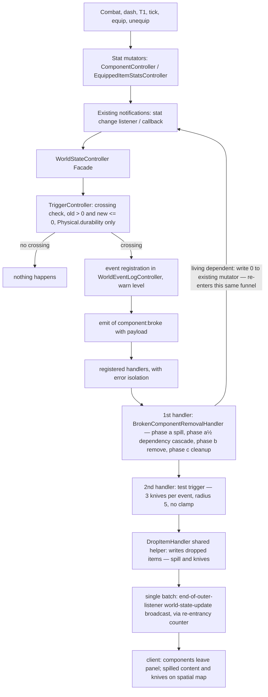

# Trigger System Design — `component:broke`

**Status:** design proposal (not implemented) — **revision 3**. The 5 decision questions are **resolved by the user** (§10): center = position of the entity that broke (Q1), trigger always active (Q2), removal + spill on break (Q3), **internal components OUT OF SCOPE — discarded (Q4, confirmed in revision 3)** and **no room clamp — neither for the knife drop nor the spill (Q5, confirmed in revision 3)**. New requirement in this revision: **cascade break by dependency** (§3.6) — if a broken component has other components **dependent** on it, they also break, **recursively**.

> **Note (post-implementation):** the `humanDoll` (NPC), `humanLeg`/`humanFoot`/`humanToes` (blueprints/components) seeds were **removed by user decision** ("this npc should never exist"). The dependency cascade is now validated by the existing droid components (`smallBallDroid`, test **Test 16**).
**Scope:** new trigger system focused on the "entity component broke" event (durability crosses zero), with **removal of the broken component from the world — spilling all items and containers that were inside it** (user decision, reviewed) + **cascade break by dependency** (revision 3, §3.6) + test trigger (3 knives in radius 5, **per event**).

---

## 1. Problem

Currently "break" is not a world event: when `Physical.durability` crosses zero, nothing is notified beyond capability re-evaluation and broadcast. Each consumer improvises:

- NPC AI treats `durability < 1` as unusable (`BROKEN_DURABILITY_THRESHOLD = 1`) and re-selects target (`src/controllers/ai/NpcAIController.js:29`, `:439`).
- The LLM context reports the current/max ratio (`src/controllers/networking/LlmContextController.js:488`).
- There is no clamp anywhere: durability can become deeply negative (state documented in `test/unit/NpcAIController.durabilityDesync.test.js`).

The world needs (a) a single deterministic break event, and (b) a mechanism to react to it — the first consumer is **removal of the broken component, with spill of its content to the floor** (user requirement, §3.5); the test trigger (drop of 3 knives) is the second.

## 2. Map of break paths — why a single collection point is enough

All durability writes in the project funnel into **exactly two mutators**, both with existing notification:

| # | Path (how the break happens) | Code origin | Store written | Existing notification |
|---|----------------------------------|------------------|---------------|------------------------|
| P1 | Combat, single target/`self` (`droid punch`, `cut` actions) | `damageComponent` consequence → `src/controllers/consequences/DamageConsequenceHandler.js:72` | component stats | stat change listener |
| P2 | Combat, target `entity` (damages **all** target components) | `src/controllers/consequences/DamageConsequenceHandler.js:96` (`_damageEntityComponents`) | component stats | stat change listener |
| P3 | Generic stat consequence (`dash` −5 durability; `selfHeal` +10) | `src/controllers/consequences/StatConsequenceHandler.js:96`, `:122` (absolute), `:142` (entity loop) | component stats | stat change listener |
| P4 | T1 weapon shot (damage = consumed projectile volume) | `src/controllers/consequences/ConsumeItemHandler.js:123` → delegates to same handler as P1 | component **or** equipped item | listener / callback |
| P5 | Passive tick effects from internal components (currently only repair: +1 durab./5 ticks; schema admits negative `amount` → future wear) | `src/controllers/core/InternalComponentController.js:436` (`_applyTickEffect`), job registered at `:46` | **host** stats | stat change listener |
| P6 | Holding cost on equip (e.g., knife: −2 durability on host) | `src/controllers/core/HoldingCostController.js:265` | host stats | stat change listener |
| P7 | Restoration on unequip (delta inversion; usually healing, but can be negative if stat increased during equip → rare break) | `src/controllers/core/HoldingCostController.js:347` | host stats | stat change listener |
| P8 | Damage to equipped item (attack targeting `eqId`) | `src/controllers/consequences/DamageConsequenceHandler.js:54` (`equippedItemStats.updateStatDelta`) | equipped item stats | stat change callback |

The two central mutators:

- `ComponentController.updateComponentStat` / `updateComponentStatDelta` → `_notifyStatChangeListeners` (`src/controllers/core/componentController.js:53`, `:99`, `:121`).
- `EquippedItemStatsController.updateStat` / `updateStatDelta` → `_notifyStatChange` (`src/controllers/core/EquippedItemStatsController.js:263`).

Both flows **already converge in the facade constructor** (`src/controllers/WorldStateController.js:128` and `:151`), which currently uses them for capability re-evaluation and broadcast.

**Central decision (single source of truth):** do not emit at each handler, nor create new threads. The trigger system is a **consumer** of the existing notifications — exactly the role the capability controller already occupies. Any current or future writer (combat, tick, equip, T1, new action) triggers the event automatically, without touching the writer.

**Internal components:** runtime instances do not have per-instance mutable stats (the instance is just id/type/host/installAt — [`src/controllers/core/InternalComponentController.js`](src/controllers/core/InternalComponentController.js:192)); only host stats are affected by tick effects. Thus, "internal component breaks" **does not exist today**: **user decision confirmed in revision 3 — internal components are OUT OF SCOPE definitively** (Q4, §10): they do not break and **do not participate in the dependency cascade** (§3.6); a `dependsOn` edge pointing to an internal component is ignored without crash (§6).

## 3. Trigger System Design

### 3.1 Event and trigger semantics

- **Event name:** `component:broke`.
- **Condition (crossing):** stat is `Physical.durability`, with `oldValue > 0` and `newValue <= 0`.
  - `>0 → <=0`: triggers **exactly once per break** — repeated damage to an already broken component (old ≤ 0) does not re-trigger.
  - `<=0 → positive` (repair via `durabilityRepairSpheres`, restoration on unequip): does **not** trigger (only downward crossing).
  - Consistent with the threshold already used by the AI (broken = durability < 1).
- **Without altering store semantics:** the design does not clamp durability to 0 (keeping the negative value is the project's documented state); the crossing is computed from the notification's old/new values. With removal (§3.5), the negative value does not persist in the store: the stats instance is eliminated at the moment of break.

### 3.2 Where the logic lives — `TriggerController`

New **logic controller** (DI, no auto-instantiation — pattern from `wiki/subMDs/controllers/controller_patterns.md` §4), in the new directory `src/controllers/triggers/`:

- `on(event, handler)` / `off(event, handler)` — registration keyed by event name. **Why mirror `ConsequenceHandlers`** (`src/controllers/consequences/consequenceHandlers.js`): the project already has a "type → handler" dispatcher for consequences; triggers are the analog of "engine event → handler". Difference: consequences are declared in data (`data/actions.json`); break events are generated by the engine, so trigger registration lives in code, not JSON.
- `handleComponentStatChange(componentId, traitId, statName, newValue, oldValue)` — called by the **existing** component listener in the facade. On crossing: resolves the owning entity (scanning the facade's entity list — no component→entity reverse lookup exists; see §5), assembles the payload and emits.
- `handleEquippedItemStatChange(eqId, traitId, statName, newValue, oldValue)` — called by the **existing** equipped item callback (the facade already resolves the owning entity of eqId in `src/controllers/WorldStateController.js:151-166`).
- `emit(event, payload)` — executes handlers in registration order, with error isolation per handler (try/catch, mirroring the per-consequence isolation of `src/controllers/consequences/ConsequenceDispatcher.js:378`): a broken handler cannot take down the action pipeline nor the tick.
- **Event logging:** the core registers each crossing in the `WorldEventLogController` (action `component:broke`, level `warn`, timestamped with the current tick) — satisfies the requirement that the trigger generates an event in the log. The log feeds the LLM context and, per spec §4.7, does not go to broadcast.
- **Injection:** built at the composition root (`src/composition/WorldComposition.js`), with facade injected post-construction (`setWorldStateController()`) and broadcaster (`setBroadcaster()`) — same pattern as `InternalComponentController` and `TurnSystemController` (`src/controllers/core/TurnSystemController.js:113`).

### 3.3 Payload of `component:broke`

| Field | Content |
|-------|----------|
| `event` | `component:broke` |
| `entityId` | entity owning the broken component (in case of equipped item: the entity equipping it) |
| `roomId` | `location` of the broken entity |
| `position` | entity's `spatial` — same coordinate space as dropped items (the pipeline compares them directly: `src/controllers/consequences/SpatialConsequenceHandler.js:70` and `src/controllers/consequences/PickUpItemHandler.js:90`) |
| `componentId` / `componentType` / `componentIdentifier` | the broken component (in equipped case: the host) |
| `kind` | `'component'` or `'equipped-item'` — items are not components in this project (the client treats them separately, `public/js/SelectionController.js:331`) |
| `eqId` / `itemType` | present when `kind = 'equipped-item'` |
| `prevValue` / `value` | durability before and after crossing |
| `tick` | current world tick |

### 3.4 Flow (event → trigger → handler)



### 3.5 Built-in handler: broken component removal (user decision — question 3, reviewed)

The user decided: **the component is removed from the world when durability reaches zero**. Break ceases to be an informational state: what is broken leaves the game. **Review (new requirement):** all **items and containers that were INSIDE the destroyed component/instance are SPILLED to the floor** — the content stops being "lost" and becomes playable in the world (recoverable via pickup). Removal is the **first** handler registered in `component:broke` (before the test trigger): the knife drop does not depend on the component still being present, since the payload's position is captured before any handler executes, and registration order is deterministic.

#### 3.5.1 Spill — content drain (phase `a`, always first)

The project's inventory is **flat per entity** (`entity.items` — `src/utils/InventoryManager.js:11`): each item carries `hostComponentId` = id of the component storing it **or** id of the parent container item. Thus, "inside the destroyed component" = items whose `hostComponentId` points to the destroyed host:

| `kind` in payload | Drained content |
|-------------------|------------------|
| `component` | items with `hostComponentId === payload.componentId` (inventory of destroyed component) |
| `equipped-item` | items with `hostComponentId === payload.itemId` (inventory of destroyed container instance) |

Enumeration via `InventoryManager.getContainerItems` (public, `src/utils/InventoryManager.js:697-699`) — same semantics as `getEntityItems` (`:251-266`). For **each** drained item (N items ⇒ N drops):

1. **Grandchildren snapshot:** `_collectNestedItems(entity, itemId)` (`:492-511`) — deep copy of internal hierarchy;
2. **Own position:** uniform sampling on disk (§4.2) — radius 5, center `payload.position` (= `entity.spatial`), no clamp; each spill item draws its own position;
3. **Writing:** block extracted from `DropItemHandler` (`src/controllers/consequences/DropItemHandler.js:96-119`) → `droppedItems[id] = { itemType, itemId, x, y, roomId: payload.roomId, ownerId: payload.entityId, name, description, volume, nestedItems: <snapshot> }`;
4. **Inventory removal:** `InventoryManager.removeItem` (`:162`) directly on the live entity — never the facade's `removeItemFromEntity` API, which would auto-broadcast (§3.5.3).

**Containers are dropped AS containers** — the internal hierarchy travels inside the dropped item (`nestedItems`), **without flattening**: exactly the semantics of manual drop (`DropItemHandler.js:82-87`) and pickup that reconstructs the tree via `addItemToContainer` (`src/controllers/consequences/PickUpItemHandler.js:136-158`). The drain is **1 level deep**: only the direct content of the destroyed host becomes a dropped item; sub-containers travel inside the respective parent's `nestedItems` (edge case §6).

**Inventory vs. equipment rule (ambiguity resolved):**
- (i) item with `hostComponentId` = destroyed host → **spill** (if equipped on *another* host, unequip first — same semantics as manual drop, `DropItemHandler.js:62-67`);
- (ii) item equipped **on** the destroyed host but *stored* in another component → **not** drained content: unequipped + removed in phase (b) (previous decision, kept).

#### 3.5.2 Exact cascade order: `(a) → (a½) → (b) → (c)`

| Phase | `kind = 'component'` | `kind = 'equipped-item'` |
|------|----------------------|--------------------------|
| **(a) drain/spill** | Component content spill (§3.5.1) | Container instance content spill (§3.5.1) |
| **(a½) dependency cascade** (revision 3, §3.6) | Force break of **dependents** of the broken component (direct and transitive, via instance `dependsOn`): pre-order with visited-set; each living dependent emits its **own** `component:broke` (identical payload, §3.3) → executes its **own** complete chain (a)→(a½)→(b)→(c) + its own 3 knives, all within the re-entrancy counter (§3.5.3) | **n/a** — equipped item is not a node in the component tree (has no dependents); cascade only applies to `kind = 'component'` |
| **(b) unequip/remove** | (1) remove from `components[]` array via new `stateEntityController.removeComponent` (filter replacement — §6); (2) unequip (and remove, no-op if already spilled in (a)) the equipped item on the host — holding cost restoration reaches the host's **still-living** stats, which only die in (c); host already ≤ 0 ⇒ no new crossing | Unequip (holding cost restoration on host — `src/controllers/core/HoldingCostController.js:347`; the only one that can be **negative** → P7, §6) and remove the item instance from inventory |
| **(c) cleanup** | (3) `removeStats(instanceId)` — new method (`src/controllers/core/componentStatsController.js:19`, `:46`, `:55`); (4) remove internal components from host (`src/controllers/core/InternalComponentController.js:262`) + re-sync entity copy (pattern `src/controllers/core/stateEntityController.js:94`); (5) `removeEntityFromCache` + `reEvaluateEntityCapabilities` (`src/controllers/core/stateEntityController.js:101-103`, `:150-153`); (6) `releaseSelection` of component (`src/controllers/actions/actionSelectController.js:330`) | (3') `_cleanupTracking` (`src/controllers/core/HoldingCostController.js:554-561`); (5') re-evaluate capabilities (pattern `:362-363`); (6') release selection of `eqId` |

**Why this order:**
- **(a) first:** content is only addressable while the host exists — items' `hostComponentId` point to the id being destroyed; removing the host first (b) would orphan the items (they would cease to be enumerable by `getContainerItems`).
- **(a½) next (revision 3):** the host's content has already been spilled ((a) rule) and dependents are still **fully alive** (in the array, with stats and content) when each is forced to break — each dependent's own (a)–(b)–(c) chain executes correctly. Host removal (b) is **not** a precondition for dependent removal: each is self-contained (the only write a dependent's (b) phase can produce — the P7 unequip restoration — falls on the **dependent's own** stats, which die in its (c), not the host's). Full justification and visitation order: §3.6.4.
- **(b) second:** unequip holding cost restoration needs the destination's stats instance still alive (the host, in `component` case — only removed in (c)); in `equipped-item` case, the destination is the host (a healthy component, possibly) — and that's where P7 lives.
- **(c) last:** capability re-evaluation (the step deciding what client/AI see) must observe the **final** state — components, stats, inventory and equipment already removed; running earlier would leave capabilities stale.

#### 3.5.3 Atomicity — same transaction, single batch of broadcasts (verified in code)

The spill is part of the **same** `removeBrokenComponent(payload)` call as removal (same transaction, same write batch) — there is no second turn:

1. **Pure helper:** the block extracted from `DropItemHandler` (`:96-119`) only writes to the `droppedItems` map via `setDroppedItems` (`src/controllers/WorldStateController.js:1667-1673` — pure operation, no internal broadcast);
2. **Removal without auto-broadcast:** draining uses `InventoryManager.removeItem` on the live entity (the facade holds `inventoryManager` at `src/controllers/WorldStateController.js:108`; `getEntity` returns a live reference, `src/controllers/core/stateEntityController.js:171-173`) — and **not** the facade's `removeItemFromEntity`, which would end in its own broadcast (`:1367-1369`);
3. **Unequip without broadcast:** `HoldingCostController.unequipItem` does not broadcast (verified — zero broadcast calls in the controller);
4. **Only broadcast source within the cascade** = the holding cost restoration write (P7) re-entering the facade's stat change listener. The end-of-listener broadcast is **suppressed by a re-entrancy counter** in the facade: incremented at start of `removeBrokenComponent`, decremented in `finally`; the two listeners (`src/controllers/WorldStateController.js:128`, `:151`) only trigger `broadcast()` when the counter == 0. Result: **exactly one** `world-state-update` per break chain (from the outermost listener, already with final state) — covers chained P7 **and (revision 3) the entire dependency cascade (§3.6.4): each dependent forcing re-enters this same counter, so no intermediate broadcast from the dependent chain leaks**. The trigger does **not** auto-broadcast in the normal path; the broadcaster injected via `setBroadcaster` remains as defensive fallback (e.g., facade without broadcaster in tests).

**Executor context — system drop (requirement 3 verification):** the spill drop **does not need a socket or executor**. The `context` parameter of `handleDropItem` is JSDoc-only (never referenced in body — verified); the extracted block only consumes the facade (`getItemRegistry` `:1307-1308`, `getDroppedItems` `:1635-1641`, `setDroppedItems`), the entity (for `location` → `roomId`) and item data. The trigger provides `ownerId = payload.entityId` and `roomId = payload.roomId` directly from the payload; the "executor" is the world system (no socket).

**Isolation and idempotency:** (a)+(b) form the primary path that should always complete; an item whose write fails is logged and **skipped** (does not abort the break); (c) steps have their own isolation with logging — any residue is fixed by capability re-evaluation on the next stat change. Removal is **idempotent**: a second emission for the same component/item is no-op with debug log (necessary for P2 loop case — §6).

**What removal does not do:** spilled content is **not** destroyed — it remains playable on the floor (pickup). Positive side effects: closes the "ghost component" gap in the break path (the stats instance ceases to exist at break time) and NPC AI becomes more robust (the broken component simply ceases to exist, instead of relying on the `durability < 1` filter). Whether the entity itself is removed when it loses its last component is a separate decision — see §3.5.4.

**Client visibility:** a single `world-state-update` (the chain-end batch, §3.5.3) already shows the world without the component, with spilled content and knives on the map — the client re-renders from state (ComponentViewer + `renderDroppedItemsOnSpatialMap`, `public/js/UIManager.js:224`), without client code changes.

#### 3.5.4 Entity elimination — the last breaking component despawns its entity

**Decision (the root fix for the "attacker stuck on a corpse" bug):** when a component's removal leaves its owning entity with **no components left**, the entity is **despawned** — genuinely removed from the world state, not left as a component-less inert husk. This **inverts** the prior §3.5.3 stance ("not despawned — out of scope"); the inversion is deliberate and is the change that actually closes the user-reported failure.

**Why despawn instead of leaving a husk:** a component-less entity is a *ghost*, and a ghost has three failure modes, each of which the prior "inert husk" stance merely coped with downstream: (1) **world desync** — the live state and the per-tick snapshot disagree about whether the entity exists, forcing both the deterministic brain and the LLM context to carry a viability filter to avoid targeting it; (2) **turn-barrier deadlock** — the turn system counts roster entities, and a husk that can never plan again must be special-cased as "vacuously complete" or it stalls the barrier; (3) **NPCs target corpses** — a droid that chased its prey there now has its closest-candidate race win against a body with zero usable components, so it idles (in range) or chases forever (out of range) — the exact reported bug (the attacking droid gets stuck on an entity it has already killed). Despawning removes the ghost at the source, which is strictly stronger than the two downstream viability filters (NPC AI and LLM context) that remain as defense-in-depth for any residual window.

**When it runs:** once per **root** cascade, over **every entity the cascade affected**, evaluated *after* the cascade's removals have settled (re-entrancy count back to zero) so it sees the final component state. The normal cascade stays within one entity (a composition tree); when a cascade crosses an entity boundary a warning is logged, since that is the exceptional case.

**Isolation rule:** elimination is best-effort and **cannot poison the cascade**. It runs in its own try/catch and logs on failure; a failed elimination degrades to the prior husk behavior (the entity stays, component-less) rather than aborting the break chain. By that point the break/spill/drop work is already done, so the worst case is the old behavior — never a broken or un-removed component.

**Accepted consequence — 39 knives, not 42:** the root component's own removal completes *after* the cascade that despawns the entity, so the root's knife drop finds a despawned owner and is **skipped** (no position anchor to drop into — the same guard the despawn path uses, §6). A full droid tree (14 components) therefore yields **39 knives, not 42** — the root's 3 knives are lost with the body. This is an **intentional trade-off, not an accident**: the body is really gone, so its knives go with it. The 39 count is pinned in `test/contract/triggerComponentBroke.contract.test.js` (tests 9/16/20).

### 3.6 Cascade break by dependency (revision 3 — new requirement)

**Requirement (user):** "If a broken component has other components **DEPENDENT** on it, they must also break" — **recursively**. User example: if a person's **LEG** is torn off, the **FOOT** and **TOES** (which depend on the leg) are also torn off.

#### 3.6.1 Investigation — what exists today and what's missing

| Source | What exists | What's missing |
|-------|-------------|-------------|
| [`data/blueprints.json`](data/blueprints.json) | The **only** data location encoding relations between components: a **composition tree** — key = parent component type, value = children list (string or `[type, identifier]`): `smallBallDroid → centralBall → { droidHead, droidArm×2 → droidHand×2 → humanoidDroidFinger×6, droidRollingBall×2 }`; same for `merchantDroid → merchantCore → …` | Direction is parent→child (composition) and **at type level** — not a "dependency" field and does not say which *instance* depends on which |
| [`data/components.json`](data/components.json) | Type definitions with only `traits` (e.g., `droidArm` dur. 50 → `droidHand` dur. 40 → `humanoidDroidFinger` dur. 30, `:15-34`) | No `dependsOn`, no parent field, no relation between types |
| [`data/npcs.json`](data/npcs.json) | 1 NPC: `smallBallDroid` ("Rogue Droid", `:2`) — and **no** NPC with human components | **"Person" does not exist in data**: the `leg`/`foot`/`toes` components from user's example **do not exist** — the closest analog present is the chain `droidArm → droidHand → humanoidDroidFinger` (3 levels, same structural form as leg→foot→toes) |
| [`src/utils/WorldGraphBuilder.js`](src/utils/WorldGraphBuilder.js:13) | A **rooms** graph (rooms + doors) for the world map — name suggests "world graph", but `build()` (`:45`) only resolves connections between rooms | Not a component graph: **no** component→component edge exists anywhere in code |
| [`src/controllers/core/entityController.js`](src/controllers/core/entityController.js:29) | `expandBlueprint` expands the tree recursively into a **flat** list `[type, identifier]` in **pre-order** (parent is always pushed before children, `:46` vs `:54/:71`; per-branch visited-set already prevents infinite recursion, `:30`); `createEntityFromBlueprint` (`:83`) creates instances `{ type, identifier, id }` (`:90-94`) | **Parent→child link is lost at runtime**: the instance does not carry reference to parent instance — the only trace is the string suffix of children's `identifier` in array form (`${child}_${parent}`, `:55`), fragile and non-semantic (and children in string form don't even receive suffix — `:71`) |
| [`src/controllers/core/InternalComponentController.js`](src/controllers/core/InternalComponentController.js:192) | **Separate** axis of "internal": instances **inside** the host component (`{ id, type, hostComponentId, hostComponentType, installedAt }`) **without** per-instance stats | Not dependency: internal does not break (no stats) and does not enter blueprint tree — **out of scope confirmed by user (revision 3, §10)** |

**Exhaustive verification:** search for `dependsOn`/`dependent` in `data/`, `src/` and `public/` finds no dependency field between components (occurrences of the term in the repo are the English word "independent" in comments/docs). **Conclusion:** today the *only* source of relations between components is the composition tree of [`data/blueprints.json`](data/blueprints.json), which is flattened at spawn **without preserving instance link**. Missing: (1) preserved instance link at expansion, (2) cascade semantics consuming it (§3.6.3–3.6.4), (3) user's example data — leg/foot/toes + person (§3.6.2).

#### 3.6.2 Data model — instance-level `dependsOn`, derived from existing tree

**Decision (minimal schema):** runtime component instance (`entity.components[]`) gains the field **`dependsOn: [parentInstanceId]`** — array of **instance** ids (not type) of direct parents; tree root = `[]`. **No new data file and no new field in [`data/components.json`](data/components.json)** — the graph is derived from the tree that **already exists** in [`data/blueprints.json`](data/blueprints.json) at expansion time:

- **Why not type level** (field in `components.json` or new `dependencies.json`): a type-level link does not distinguish repeated instances — the doll has **two** legs, and the left foot depends on the left leg, **not** the right; `dependsOn` by type would break **both** feet when any leg departs. Duplicating the tree in a second file would create a **second source of truth** for what `blueprints.json` already declares (violates decision 1 of §8 — single source of truth).
- **Where it's written:** [`src/controllers/core/entityController.js`](src/controllers/core/entityController.js) — the expansion already traverses the tree in pre-order (parent before children), so `expandBlueprint` propagates the **parent's index** in the flat list and `createEntityFromBlueprint` resolves it to `dependsOn: [instanceId]` after generating ids (`generateCompId`, [`src/utils/idGenerator.js`](src/utils/idGenerator.js)). Link by **index** (not by type+identifier) is robust to identifier collisions between branches — real case: children in string form **do not** receive suffix (`expandBlueprint:71`, existing quirk), so the doll's two `humanFoot` instances would have identical `default` identifier; index-based link does not depend on this.
- **Resulting graph:** per entity, a **forest of trees** (one per top-level blueprint entry) — sub-case of DAG. Cycles are structurally impossible in current data source (the per-branch visited-set of `expandBlueprint:30` already prevents infinite expansion at spawn), but runtime cascade is **defensive** against non-tree future data (§3.6.4, §6).
- **Example — `smallBallDroid` after change** (abbreviated instance ids): `centralBall` = root (`dependsOn: []`); `droidHead → [centralBall]`; `droidArm(left) → [centralBall]`; `droidHand(left) → [droidArm(left)]`; `humanoidDroidFinger(left_left) → [droidHand(left)]`. Field is **additive**: travels in existing world state broadcast (`getAll()`, `src/controllers/WorldStateController.js:658`); client ignores unknown fields — **no client code change** (keeps decision 6 of §8).

**User example seed (leg → foot → toes) — components do not exist; creation at implementation phase:**

| JSON touched at implementation phase | Change |
|--------------------------------------|---------|
| [`data/components.json`](data/components.json) | 3 new types, same form as existing: `humanLeg` (`Physical.durability` 60, `volume` 10), `humanFoot` (dur. 40, `volume` 6), `humanToes` (dur. 20, `volume` 3) — **decreasing** durability in chain, same pattern as `droidArm` 50 → `droidHand` 40 → `humanoidDroidFinger` 30; `Spatial` offsets in style of existing droids |
| [`data/blueprints.json`](data/blueprints.json) | `humanLeg: ["humanFoot"]`, `humanFoot: ["humanToes"]` (string form — exact analog of existing `droidArm: ["droidHand"]`); `humanDoll: [["humanLeg","left"],["humanLeg","right"]]` (top-level entity blueprint — the doll has 2 legs, proving **sibling isolation** of instance link) |
| [`data/npcs.json`](data/npcs.json) | New NPC `humanDoll` (`displayName: "Human Doll"`, `room: "start_room"`, `personality`, `ai.behavior: "passive"`) — the person exists at world bootstrap (same path as `smallBallDroid`, [`src/controllers/WorldStateController.js`](src/controllers/WorldStateController.js:273)) |
| [`src/controllers/ai/NpcAIController.js`](src/controllers/ai/NpcAIController.js:59) | Register behavior `passive` (no-op strategy `{ acted: false, skipped: 'PASSIVE' }`, alongside pre-registered `chase_attack` at `:59`) — the doll should not act; unregistered behavior generates warn each planning tick (`:106-108`) |

Stat values are adjustable at implementation; test only requires the 3-level chain with `Physical.durability` **different** per level (crossing observable per component) — test breaks the leg with a delta that **only the leg** crosses, so foot and toes break **only** via cascade (with durability > 0 at the time, §6).

#### 3.6.3 Cascade semantics — same event, same chain; N breaks ⇒ N events ⇒ 3N knives

When component **X** breaks (crossing `>0 → ≤0`, §3.1), all components of the **same entity** whose `dependsOn` contains X **transitively** (the **dependents** — direct: `foot → leg`; transitive: `toes → foot → leg`) are **forced to break**:

- **Forcing mechanism (no new thread):** cascade writes `durability = 0` of each dependent via the **existing mutator** `ComponentController.updateComponentStat(id, 'Physical', 'durability', 0)` ([`src/controllers/core/componentController.js`](src/controllers/core/componentController.js:99)) — the **same funnel** from §2: notification → facade → TriggerController → crossing (`old > 0 → 0`) → **emit of dependent's own `component:broke`, with the SAME payload from §3.3** (its own `prevValue`/`value`; entity's `position`/`roomId`). It's a **yank**: no proportional stat reduction is applied — the dependent leaves the world as-is (its other stats are irrelevant: the instance dies in phase (c)).
- **Each dependent goes through THE SAME removal cascade:** its own spill (a), its own cascade (a½, recursively), its own (b)–(c) — because it is just another `component:broke` event in the same funnel, served by the same handlers.
- **Test trigger fires for EACH event** — the rule "N breaks → N events → 3N knives" (1st line of §6) applies **recursively**: leg + foot + toes = **3 breaks = 3 events = 9 knives**, all in radius 5 of the broken entity's position, in its room, all within the **single batch** at chain end (§3.5.3).
- **Trigger remains generic:** `TriggerController` does not know about dependencies — it reacts to each crossing it sees. Graph knowledge lives **exclusively** in the removal path (§3.6.4).

#### 3.6.4 Where it executes — within removal path, phase (a½), pre-order with visited-set

**Decision: within existing removal cascade — concretely, within the facade orchestrator `removeBrokenComponent` (to which `BrokenComponentRemovalHandler` already delegates), as phase **(a½)** between (a) and (b). Not a new handler.** Justification:

1. **It's the only one that knows the graph and lifecycle:** the orchestrator already holds all facade sub-controllers (entity, stats, inventory, holding cost, internals, selection) **and** the re-entrancy counter. A new handler would need exactly this access, plus a registration order before removal handler, with no gain — removal handler remains a **thin delegator** (SRP, mirroring consequence handlers).
2. **Keeps trigger generic** (as above): knife trigger continues as a pure consumer of "3 knives per event", without knowing the graph — revision requirement is entirely absorbed by the removal path.
3. **Position (a½):** after (a) — host content has been spilled while it still existed (addressability rule, §3.5.2) — and before (b) — dependents are **fully alive** (in `components[]`, with stats and content) when each is forced, so each one's own (a)–(b)–(c) chain executes correctly. (Detailed in §3.5.2.)
4. **Re-entrancy already covered:** each forcing re-enters the facade listener **inside** orchestrator's `try/finally` — existing counter (§3.5.3) suppresses all intermediate broadcasts of the entire chain → **one** `world-state-update` at end, with final state. No new mechanism.

**Visitation order — pre-order (depth-first); direct dependents in `components[]` array order (= expansion pre-order, i.e., declared order in blueprint):**

```
cascade(origin):
  visited = { origin }
  queue = [ origin ]
  while (cur = queue.shift()):
    for child of reverseIndex[cur] or []:
      if visited.has(child): continue          // diamond: each id enters queue 1x per cascade
      visited.add(child)
      queue.push(child)
    if cur == origin: continue                 // origin already broke (event that opened cascade)
    comp = entity.components.find(c => c.id == cur)
    if !comp: continue                         // liveness on pop: already removed in this chain (diamond/P2)
    dur = stats[comp.id]?.Physical?.durability
    if dur == undefined: continue              // no durability stat → not breakable (log)
    if dur <= 0: remove directly (a)(b)(c) WITHOUT event and WITHOUT knives (warn log)   // defensive (§6)
    else: force — updateComponentStat(comp.id, 'Physical', 'durability', 0)
         // → dependent event → its COMPLETE chain, nested and recursive
```

- **Why pre-order not BFS by level:** phase (a½) is part of *every* removal chain, so breaking a level-1 dependent **inevitably** cascades level-2 before finishing other level-1 — forcing "all level-1 first" would require a pre-computed global plan shared between nested calls (extra state crossing event boundary). Pre-order is what the funnel's natural recursion produces, is **deterministic**, and matches the user example narrative: **leg → foot → toes**, each level completing (spill → remove → clean → 3 knives) before returning to parent branch. In linear chain (leg/foot/toes case and each droid branch: arm→hand→finger), pre-order and BFS coincide.
- **Concrete consequences (leg example, doll):** order of **events**: leg, foot, toes. Order of **spills**: leg → foot → toes (top-down; parent content is addressable first, (a) rule). Order of **removals**: toes, foot, leg (deepest first, by nesting). Doll's **right** branch (leg/foot/toes right) remains intact.
- **Cycle A↔B (malformed data) — no infinite loop, by 3 layered defenses**, each covering what the previous does not: (1) **cascade-level visited-set** — prevents re-processing same id *within* same cascade (self-dependency A→A dies here: visited seed is the origin itself); (2) **liveness on pop** — prevents re-processing id already removed by earlier branch (diamond C←A,B; concurrent removal from P2 loop); (3) **crossing guard** (existing, §3.1) — last line: a second write to an id with `old ≤ 0` or without stats **never** emits. Tracing the cycle: A breaks → cascade from A forces B (B event) → cascade from B finds A (∉ B's visited, and A still in array) → but `durability(A) ≤ 0` → write 0 with `old ≤ 0` → **no crossing → no event** → chain ends. Each component forced at most 1× ⇒ O(# components of entity).
- **Diamond (C depends on A and B; A and B depend on X):** break X → events **X, A, C, B** (C breaks during A's branch; B's cascade finds C already removed → liveness skip) — C processed **exactly 1×**: 4 events, 12 knives, 1 broadcast. Deterministic: dependent order = `components[]` array order.
- **Unlimited depth — explicit decision, no depth ceiling:** leg→foot→toes, complete droid tree (centralBall→arm→hand→finger = 4 levels) — all processed. Termination is guaranteed **only** by visited-set + liveness + guard (O(N) per cascade, N = entity components — small and finite, already covered by P2 multi-component case). A **depth ceiling would be rejected**: it would silently violate "recursively" requirement (toe, at level 3, would survive) to save a cost that is already O(N). Extra upstream defense: `expandBlueprint:30` per-branch visited-set prevents a *data source* with cycle from producing infinite instances at spawn.
- **Reverse index:** new **pure** helper (stateless — pattern from [`wiki/subMDs/controllers/controller_patterns.md`](wiki/subMDs/controllers/controller_patterns.md)) in new file [`src/utils/ComponentDependents.js`](src/utils/ComponentDependents.js): input `components[]` (with `dependsOn`) → output `Map<parentId, childId[]>` with array order preserved. Pure ⇒ unit-testable without facade; orchestrator calls it per cascade (O(N), negligible compared to triggering removal).

## 4. Test trigger — 3 knives, radius 5, random positions

### 4.1 Item to use

`knife` **already exists** in `data/inventoryItems.json:50` (volume 1, durability 30, sharpness 50) and already has holding cost (`data/holdingCost.json:2`). **No need to create new item id.**

### 4.2 Random positions

No "random point in radius" helper exists: `shared/RangeResolver.js` only resolves action range expressions (not geometry), and `public/utils/geometry.js` is client-side room edge math. **Decision:** new pure utility (stateless, per §8 of `wiki/subMDs/controllers/controller_patterns.md`) with uniform disk sampling (uniform angle in 0..2π, radius via square root of uniform — avoids center bias, unlike simple rejection sampling). Pure ⇒ testable with injected seed. Same utility serves the **spill from §3.5.1** (radius 5, center `payload.position` — each drained item draws its own position): one sampler, two consumers, zero duplication.

### 4.3 Center and boundaries

- **Center:** broken entity's position (`payload.position`). The entity is the only anchor that always exists and already lives in the same space as dropped items (both pipeline sides compare them directly) — **confirmed with user (question 1)**. Component removal (§3.5) does not move the entity, so center remains valid for knife drop (2nd handler).
- **No room clamp:** `DropItemHandler` already writes points without clamp (action `dropItem` range is 100, larger than any room — `src/controllers/consequences/DropItemHandler.js:107-108`); radius 5 is 20× smaller, and `roomId` remains the broken entity's room (same semantics as `src/controllers/consequences/DropItemHandler.js:109`). No clamping avoids coupling trigger to room geometry and exact `spatial` space (ambiguous documentation about room-relative in `src/controllers/core/stateEntityController.js:125`). The **spill** reuses exactly this contract: same center (`payload.position` = `entity.spatial`), same radius 5, no clamp, entity's `roomId` (§3.5.1).

### 4.4 Who executes the drop — reuse of `DropItemHandler`

`handleDropItem` requires item to be in dropping entity's inventory — trigger knives (and spill items) are **written**, not moved. **Decision:** extract "write item to dropped items map" block (`src/controllers/consequences/DropItemHandler.js:96-119`) into an exported helper inside `DropItemHandler.js`, with `nestedItems` parameter (default `[]`), used by three consumers: `handleDropItem` (passes result of its own `_collectNestedItems` (`:82-87`) — unchanged behavior), test trigger (default `[]` — knives have no content) and **spill** from §3.5.1 (passes deep snapshot of each drained item). For each of 3 knives: new instance id via `generateItemId()` (`src/utils/idGenerator.js`), `itemType: 'knife'`, `roomId` = broken entity's room, `ownerId` = broken entity. Helper **does not require socket or executor** (parameter `context` of `handleDropItem` is JSDoc-only — never referenced in body; detailed in §3.5.3).

### 4.5 Logging, broadcast and what client sees

- Core registers `component:broke` (warn); handler registers drop (action `dropItem`, level `info`) and uses central `Logger`.
- In normal path, trigger does **not auto-broadcast**: writing 3 knives (and spill) enters the **single batch** of end-of-listener broadcast (§3.5.3) — `droppedItems` is part of `getAll()` (`src/controllers/WorldStateController.js:658`). Broadcaster injected via `setBroadcaster` (pattern from `TurnSystemController`) remains as **defensive fallback** (e.g., facade without broadcaster in tests). Client receives via `world-state-update` (`src/services/WorldStateBroadcastService.js:26`) and renders with `renderDroppedItemsOnSpatialMap` (`public/js/UIManager.js:224`). **No client code change** for visible result.

### 4.6 Test trigger registration

Handler in own module `src/controllers/triggers/KnifeDropTriggerHandler.js` (SRP, like consequence handlers), registered against `component:broke` **after** built-in removal handler (§3.5) — registration order is execution order, and drop does not depend on component still being removed. **Activation (user decision — question 2): always active in world, registered at composition root.**

## 5. Changes table

| File | Change | Reason |
|---------|---------|--------|
| `src/controllers/triggers/TriggerController.js` (new) | Core: on/off registration, the two handlers consuming existing notifications, crossing check, emit with per-handler isolation, event log registration | Single consumer of two existing chokepoints → single source of truth without touching any damage/wear writer |
| `src/controllers/triggers/BrokenComponentRemovalHandler.js` (new) | Built-in handler, registered **1st** in `component:broke`: delegates to facade orchestrator `removeBrokenComponent(payload)` — cascade **(a) drain/spill → (a½) dependency cascade (§3.6) → (b) unequip/remove → (c) cleanup** (§3.5). **Revision 3: this file does not change** — phase (a½) lives in facade orchestrator (§3.6.4) | User requirement (reviewed): durability zero ⇒ component leaves world **and its content is spilled to floor**; own module by SRP, mirroring consequence handlers — dependency cascade does not become a new handler (trigger remains generic, §3.6.4) |
| `src/controllers/triggers/KnifeDropTriggerHandler.js` (new) | Test trigger: 3 knives, random points in radius 5 (same spill sampler, §4.2), via DropItemHandler helper, log (broadcast = single cascade batch, §3.5.3); registered **2nd** (after removal) | User requirement 2; own module by SRP |
| `src/utils/` (new, e.g. `RandomPoint.js`) | Pure utility: uniform random point in disk of radius r — **shared** by trigger (3 points) and spill (1 point per drained item) | No equivalent helper exists (RangeResolver is for expressions; geometry.js is client room edge math) |
| `src/controllers/WorldStateController.js` | (1) delegate to two existing listeners (`:128`, `:151`) to call TriggerController, before broadcast; (2) thin pass-through `getEntities()` (today only `getEntity` exists, `:916`; `stateEntityController.getAll()` exists at `:198`); (3) new orchestrator `removeBrokenComponent(payload)` — cascade (a)→**(a½)**→(b)→(c) from §3.5/§3.6 over facade's already-held sub-controllers, with **re-entrancy counter** (increment at entry, decrement in `finally`): two listeners only trigger end broadcast when counter == 0 → **single `world-state-update` per break chain** (incl. P7 **and entire dependency cascade** — revision 3), no partial state broadcast. (Revision 3) phase (a½) = `reverseIndex` via pure helper + visited-set + pre-order + forcing via `updateComponentStat(id,'Physical','durability',0)` on existing mutator (§3.6.4) | No new threads — trigger sees same signals as capability controller; facade remains only graph root and only write route (rule §2), giving atomicity to multi-controller cascade and single batch per chain — dependency cascade re-enters SAME counter, no new mechanism |
| `src/controllers/core/componentStatsController.js` | New `removeStats(instanceId)` (today only `setStats`/`getStats`/`getAll` — `:19`, `:46`, `:55`) | Component removal requires eliminating stats instance; without this method removal would leave orphan entry in store ("ghost component" would continue existing in data) |
| `src/controllers/core/stateEntityController.js` | New `removeComponent(entityId, componentId)` — **replaces** `components[]` array via filter (never in-place mutation) | Damage loop with `entity` target (P2) may be iterating array at removal time; replacement makes concurrent iteration safe (edge cases §6) |
| `src/composition/WorldComposition.js` | Build TriggerController, inject facade + broadcaster post-construction, register removal handler first then test trigger | Composition root is only supported construction path (project rules §2); registration order determines execution order |
| `src/controllers/consequences/DropItemHandler.js` | Extract dropped item write block into exported helper **with `nestedItems` parameter (default `[]`)**, without socket/executor; `handleDropItem` now uses it without behavior change | Trigger **and spill** reuse same drop semantics (id format, roomId, nested items) without duplicating logic |
| `test/` (new, e.g. `test/contract/triggerComponentBroke.contract.test.js`) | Cases from section 7 — including spill cases (tests 12–15) **and dependency cascade cases (tests 16–21, revision 3)**. **Test 16 rewritten** (post-`humanDoll` removal): uses `smallBallDroid` tree (centralBall → 14 nodes → 14 events/39 knives — the root's drop is skipped after the entity is despawned, §3.5.4). | vitest pattern + `buildWorldState()` without tick running, identical to `test/unit/NpcAIController.durabilityDesync.test.js` |
| `data/components.json` (removed — 3 entries, user decision) | `humanLeg`, `humanFoot`, `humanToes` **removed**. | User example seed removed by user decision ("this npc should never exist"). Cascade validated by existing droid. |
| `data/blueprints.json` (removed — 3 entries, user decision) | `humanLeg`, `humanFoot`, `humanDoll` **removed**. | Same reason; dependency tree now tested via `smallBallDroid`. |
| `data/npcs.json` (removed — 1 entry, user decision) | `humanDoll` **removed**. | Same reason. |
| `src/controllers/ai/NpcAIController.js` (removed, user decision) | `passive` behavior **removed**. | Should never have existed; without humanDoll, no usage. |
| `src/controllers/core/entityController.js` (changed, revision 3) | `expandBlueprint`: propagate **parent's index** in flat list (pre-order); `createEntityFromBlueprint`: instance `{ type, identifier, id, dependsOn: [parentInstanceId] }` (root = `[]`) | Writes instance link that today's flattening **loses** (§3.6.1) — only code change producing graph; no new data file (§3.6.2) |
| `src/utils/ComponentDependents.js` (new, revision 3) | Pure/stateless helper: `components[]` (with `dependsOn`) → reverse index `Map<parentId, childId[]>` (array order preserved) | Cascade needs inverse direction (parent→children); pure ⇒ unit-testable without facade (pattern from `wiki/subMDs/controllers/controller_patterns.md`) |
| `wiki/map.md` + architecture maps in `wiki/subMDs/` | Add TriggerController, removal handler **and dependency cascade** (§3.6) to maps; update components/entities section with instance `dependsOn` field | Project rule §7: maps must be kept updated |

## 6. Edge cases

| Case | Decided behavior | Why |
|------|------------------------|-----|
| 3+ components break in same action (P2, target `entity`) | One `component:broke` **per component**, with removal of each; test trigger drops 3 knives **per event** → 3N knives total | Requirement defines trigger per component break; global ceiling per tick would be optional extension, out of scope |
| Repeated damage to already broken component (old ≤ 0 → new < 0) | Does not re-trigger (crossing requires old > 0) | Break is boundary event, not state event |
| Repair crossing 0 → positive (repair sphere per tick, unequip restoration) | Does not trigger (only downward crossing) | Prevents event spam in damage/repair cycles |
| Entity already despawned at break time (disconnect → `despawnEntity`, `src/controllers/core/stateEntityController.js:148`) | Trigger does not find owning entity → logs warn and **skips removal, spill and drop** (no anchor — §3.5.1 has nowhere to spill) | `despawnEntity` **does not** clean component stats — "ghost" components may receive tick writes after despawn (known gap, candidate for bug fix note); guard keeps trigger safe |
| Equipped item breaks (P8) | Event with `kind = 'equipped-item'`; item is **unequipped and instance removed** from inventory, and **container content is spilled to floor (spill, §3.5.1)** — 1 level, containers preserved in `nestedItems`, no flatten | User decision (question 3, reviewed): break ⇒ world exit + **playable content on floor**; unequip restores holding cost on host (only negative delta → P7) |
| Equipped item on a component host that breaks | Unequipped and removed in host cascade's phase (b) (§3.5.2) — items *stored* in host are spilled in phase (a); if item breaks later in same loop, removal is no-op with guard | Prevents dangling reference to component that ceased to exist |
| Action loop with `entity` target (P2) still iterating at removal time | `components[]` array is **replaced** (filter), never mutated in-place: loop continues over old reference, writes reach store by `componentId` and later break of component already out of list is no-op without exception | Prevents component skip and partial mutation during iteration |
| Entity whose last component breaks | Entity is **despawned** (eliminated, §3.5.4) — genuinely removed from the world state, not left as a component-less husk; the NPC-AI and LLM-context viability filters remain as defense-in-depth for any residual ghost window | Root fix for the "attacker stuck on a corpse" bug — a husk desyncs the world, deadlocks the turn barrier, and lets NPCs target corpses |
| Unequip restoration of broken item breaks host (P7 within cascade) | Second `component:broke` of host in same chain: host suffers **same complete cascade** (spill + removal) within current call (idempotency + per-handler isolation); intermediate listener broadcasts are **suppressed by re-entrancy counter** (single batch at end, §3.5.3) | Unequip restoration is the only delta that can be negative (`src/controllers/core/HoldingCostController.js:347`) |
| Floor space / item limit | `droppedItems` map has no limit (existing `dropItem` behavior); trigger **and spill** do not add limit and document accumulation risk (each break adds 3 knives + N spilled items) | Adding limit would change existing behavior — separate decision |
| Re-entrancy (drop breaks other components and re-triggers) | Structurally impossible for **spill**: writing dropped item + removing from flat inventory does not write any stat, does not execute action and does not call mutator → no notification → no re-dispatch | Drop only touches `droppedItems` map (the *possible* re-entrancy is holding cost restoration in phase (b) — line above) |
| Point outside broken entity's room | Allowed (no clamp, §4.3); `roomId` remains entity's | Consistent with `dropItem` (no clamp, range 100 > room size) |
| Persistence between restarts | Knives **and spilled items** persist (`droppedItems` is part of snapshot — `test/contract/persistence.contract.test.js`); removed component **does not** reappear (instance no longer exists) | Documented; no change |
| Internal component breaks | Does not break (no per-instance stats) — out of scope (question 4) | See section 2 |
| Spill of N items with entity already despawned (stat notification without position) | Spill **discarded** (warn log): no position anchor (notification does not carry `spatial`) and `entity.items` already removed by `despawnEntity`; creating dropped items with ghost `roomId`/`ownerId` would make them unplayable | No anchor means nowhere to spill; documented loss, consistent with despawn line above |
| Container within container (container on destroyed host) | **1 level** drain: each direct item becomes its own dropped item; sub-containers travel in parent's `nestedItems` (deep copy, `_collectNestedItems` — `src/utils/InventoryManager.js:492-511`) — **no flatten** | Same semantics as manual drop; pickup reconstructs tree (`src/controllers/consequences/PickUpItemHandler.js:136-158`) — hierarchy preserved and recoverable |
| Spill re-entering breaks (spilling breaks something) | Impossible: spill only writes to `droppedItems` map and removes from flat inventory — no stat write → no notification → no new `component:broke` | Only possible re-entrant break is holding cost restoration in phase (b) (P7, line above) |
| Broadcast cost of N-item spill | Entire cascade (N spill + removal + P7 chain) produces **exactly 1** `world-state-update` (re-entrancy counter, §3.5.3) — never 1 broadcast per item | No re-render storm on client and no partial state leaking (`world-state-update` is complete state) |
| **(revision 3) Dependent already removed/despawned at pop time** — removed by earlier branch of same cascade, by concurrent P2 loop, or entity despawned (existing line above) | **Safe skip**: liveness on pop (id outside `components[]` or without stats instance) → debug log, cascade continues with rest; if *entity* despawned, cascade does not even start (existing trigger guard) | Cascade-visited covers same branch; liveness covers between branches; no crash (test 19) |
| **(revision 3) Dependent with durability > 0 at cascade time** | **Forced break anyway** — write 0 (yank, §3.6.3): own event + complete chain (spill/unequip/cleanup) + 3 knives; **no proportional stat reduction** — dependent leaves world as-is (other stats irrelevant: instance dies in (c)) | User requirement: dependency = **yank**, not additional wear; forcing uses existing mutator (same funnel, §3.6.3) |
| **(revision 3) Dependent with durability ≤ 0 at cascade time** (pre-existing desync documented — durability can become deeply negative) | **Direct removal via (a)(b)(c) WITHOUT crossing event and WITHOUT knives** — warn log; maintains invariant "broken ⇒ out of world" without fabricating event (§3.1 guard does not trigger with `old ≤ 0`) | Defensive path: with inline removal, a component ≤ 0 should not persist; if it exists (project's pre-fix documented state), it is fixed in cascade, not re-emitted (test 21a) |
| **(revision 3) Self-dependency** (`A.dependsOn` contains A's id) | Ignored: cascade visited-set seed is the origin itself → self-edge never re-processes (cycle sub-case: dies at defense 1) | No loop, no extra event (covers length-1 cycle) |
| **(revision 3) Internal component dependency** (`dependsOn` edge pointing to internal id, or id that does not resolve to world component) | **Out of scope → ignored, no crash**: internal never breaks (no per-instance stats, §2) and does not enter blueprint tree; liveness on pop fails → skip + info log | User decision confirmed in revision 3 (§10): internals do not participate in cascade |
| **(revision 3) Deep interleaving, unlimited depth** (leg→foot→toes; complete droid tree: centralBall→arm→hand→finger = 4 levels) | Depth **without ceiling** — termination guaranteed **only** by visited-set + liveness + guard (O(N) per cascade, N = entity components); **depth ceiling rejected** (would silently violate "recursively") | Full justification in §3.6.4; test 20 (complete droid tree, 14 events) |
| **(revision 3) Cycle A↔B** (malformed graph) | Each breaks at most 1× — 2nd encounter dies at 3 layered defenses (visited / liveness / crossing guard, §3.6.4): **no infinite loop**; 2 events, 6 knives, 1 broadcast | Test 17 guarantees termination with hand-built cycle fixture |
| **(revision 3) Diamond** (C depends on A and B; A and B depend on X) | C broken **exactly 1×** (first time, during A's branch); 2nd edge (via B) skipped by liveness; deterministic order = array order | Test 18; no re-spill nor re-drop of C's knives |
| **(revision 3) Sibling isolation** (doll with 2 legs) | Breaking **left** leg cascades only foot+toes of **left branch**; right branch intact — link is by **instance** (`dependsOn: [parent id]`), not by type | Property motivating rejection of type model (§3.6.2); tested in 16 |
| **(revision 3) Existing droids: `centralBall` breaks** | Cascade on existing tree → 13 dependents break (14 events, 39 knives — the root's drop is skipped after despawn, §3.5.4; 1 broadcast) — **intentional behavior change** (general rule derived from tree already declared in `blueprints.json`) | Documented consequence of derived model — risk §9; test 20 |
| **(revision 3) P2 loop (`entity` target) + nested cascade** | Cascade removes components from array via filter replacement (existing P2 line covers safe iteration); write to already-removed id returns `false` (no stats) → no event; liveness/visited guarantee 1 processing per id | Extension of P2 line; no new crash interaction |

## 7. Test plan (vitest, synchronous, without tick running)

Follow pattern from `test/unit/NpcAIController.durabilityDesync.test.js`: `buildWorldState(tick)` with `UniversalTickSystem` **not started**; damage applied with exact call pipeline makes (`updateComponentStatDelta(compId, 'Physical', 'durability', delta)`).

1. **Crossing:** old=10, delta −15 → exactly 1 `component:broke` event; event log receives `warn` entry with timestamped tick.
2. **Repeated damage:** additional deltas with old ≤ 0 → zero new events.
3. **Repair:** 0 → +1 (positive delta) → zero events.
4. **Test trigger:** crossing generates exactly 3 new knives on map, all with distance ≤ 5 from entity position, `roomId` = entity room, valid and unique ids.
5. **Multiple components:** target `entity` damage breaks 3 components → 3 events, 3 removals, 9 knives; no component skip by concurrent loop.
6. **Despawn:** break after entity despawn → event registered; removal, spill and knife drop all skipped (zero new entries in `droppedItems`), without exception.
7. **Component removal:** after crossing — component out of entity's `components[]` array; stats instance non-existent in store (`ComponentStatsController.getAll()`); host internal components removed; entity capabilities re-evaluated; component selection released.
8. **Equipped item removal:** `updateStatDelta` on `eqId` crossing → event with `kind = 'equipped-item'`; holding cost restored on host; item instance out of inventory; **container content spilled to floor** (1 level; sub-containers preserved in `nestedItems`, no flatten).
9. **Entity with single component that breaks:** entity is eliminated (despawned, §3.5.4) — `getEntity` returns null after removal; capabilities/AI pipeline without crash.
10. **Idempotency:** second crossing write on same component (P2 loop over old reference) → no exception, no double removal, rest of pipeline intact.
11. **Isolation:** handler that throws error does not affect pipeline, removal nor other handlers.
12. **Component spill (N items):** component with N items (incl. 1 container with 2 grandchildren) breaks → exactly N new dropped items (each with own position in radius ≤ 5 of `payload.position`, `roomId`/`ownerId` from payload); container becomes dropped item with complete `nestedItems` (2 grandchildren); N items (and grandchildren) disappear from `entity.items`.
13. **Equipped item spill that is container (P8):** spilled content (1 level, `nestedItems` preserved) + holding cost restored on host + instance out of inventory; **single** `world-state-update` in chain (broadcaster spy).
14. **Spill after despawn:** break after `despawnEntity` → event registered; removal, spill and knife drop all skipped; `droppedItems` with no new entries; without exception (complement of test 6).
15. **Single batch with chained P7 (broadcaster spy):** item breaks → unequip restores and breaks host → **exactly 1** `broadcast()` call for entire chain; broadcast state already contains: both components out, spill of both contents, 6 knives; no broadcast with partial state.
16. **User example cascade (leg→foot→toes, revision 3):** spawn `humanDoll`; delta that **only left leg** crosses → **3 events** `component:broke` in order leg→foot→toes (each with its own §3.3 payload); the 3 out of `components[]`, stats instances absent, selection released, host internals cleaned; **right branch** (leg/foot/toes) intact — sibling isolation of instance link; **9 knives** (3 per event, unique ids, distance ≤ 5 from doll position, `roomId`/`ownerId` from doll); **exactly 1** `broadcast()` (spy) with 9 knives + 3 removals in payload.
17. **Cycle A↔B (hand-built cyclic `dependsOn` fixture, revision 3):** break A → **2 events** (A, B), both removed, **no infinite loop** (test ends in finite time), 6 knives, 1 broadcast; no 3rd event (3 layered defenses, §3.6.4).
18. **Diamond (C←A, B; A, B←X, revision 3):** break X → 4 events in order **X, A, C, B**; C removed **1×**; 12 knives; 1 broadcast; no re-spill of C.
19. **Missing/despawned dependent (revision 3):** (a) dependent manually removed from `components[]` before break → no event for it, no crash, parent chain completes (liveness on pop); (b) entity despawned before break → cascade does not even start (complements tests 6/14).
20. **Unlimited depth — complete droid tree (revision 3):** break `centralBall` of `smallBallDroid` → **14 events** (centralBall + 13 dependents: head, 2 arms, 2 hands, 6 fingers, 2 balls), **39 knives** (13×3 — the root's drop is skipped after the entity is despawned, §3.5.4), 1 broadcast, deterministic order (array pre-order) — proof of **no-depth-ceiling**.
21. **Defensive dependent states (revision 3):** (a) dependent with durability ≤ 0 (pre-existing desync) → direct removal without event and without knives, warn log; (b) dependent without `Physical.durability` stat → safe skip, no crash, log.

## 8. Decisions already made (summary)

1. **Single source of truth:** event is born from consuming existing stat notifications (ComponentController + EquippedItemStatsController), delegated by facade to new TriggerController — without emitting in damage handlers, without new thread, without store clamping.
2. **Boundary semantics:** fires only on crossing `>0 → <=0` of `Physical.durability` (once per break; repair does not re-trigger).
3. **Code handler registration** (on/off by event name), mirroring existing consequence dispatcher; registration order is execution order (removal 1st, test trigger 2nd).
4. **Removal with spill (user decision — question 3, reviewed):** break permanently removes component — or equipped item — from world, via built-in handler orchestrated by facade (`removeBrokenComponent`), in order **(a) drain/spill content → (b) unequip/remove instance → (c) clean internals/stats/capabilities/selection**; **when the entity's last component breaks, the entity is despawned (eliminated, §3.5.4)**; **content of destroyed component/container is spilled to floor (1 level, hierarchy preserved in `nestedItems`) — no longer "lost"**; equipped item on removed host (but stored in another component) is unequipped + removed in phase (b).
5. **Full drop pipeline reuse:** same helper extracted from `DropItemHandler` (with `nestedItems`) and same disk sampler (radius 5, no clamp) serve trigger's 3 knives **and** content spill; system drop does not require socket/executor; break chain produces **single** `world-state-update` (re-entrancy counter on facade); trigger always active, registered at composition root (user decision — question 2).
6. **Client without changes**: visible result (component removed from panel + knives on map) arrives via existing state broadcast.
7. **Dependency model (revision 3):** instance link `dependsOn: [parentInstanceId]` written at blueprint expansion (`EntityController`) — derived from existing tree in `blueprints.json` (single source of truth; **no** new data file, **no** type field in `components.json` — type level does not distinguish repeated instances, e.g.: two legs); only new data = user example seed (leg/foot/toes + doll + `passive` behavior).
8. **Cascade (revision 3):** executes **within** removal path — phase **(a½)** of facade orchestrator `removeBrokenComponent` (between (a) and (b)); **no** new handler (`BrokenComponentRemovalHandler` remains thin delegator; trigger remains generic and does not know graph); each dependent is forced by **write 0 to existing mutator** → same funnel → its own `component:broke` (identical payload) → its own complete chain + 3 knives; **N breaks ⇒ N events ⇒ 3N knives** (leg+foot+toes = 9); **pre-order (depth-first)** order in array order, with cascade-level visited-set + liveness on pop + crossing guard (3 layered defenses against cycle/diamond/self-edge); **no depth ceiling** (termination = visited-set, O(N)); existing re-entrancy counter covers entire chain → **1 broadcast**.

## 9. Risks / observations

- **Ghost components (despawn):** despawn does not clean component stats (pre-existing gap). In break path the gap becomes invisible (stats instance is eliminated at break time, §3.5); despawn *without* break case remains candidate for separate bug fix.
- **Accumulation of dropped items:** no ceiling, each break accumulates 3 knives **plus N spilled items** (all persisted in snapshot). Acceptable for test trigger; monitor.
- **`spatial` coordinate space:** `moveEntity` doc talks about "room-relative", but entire pipeline (movement, range, pickup) treats `spatial` and `droppedItem.x/y` as single space. Design depends on this interpretation — consistent with current behavior, but documentation should be corrected alongside implementation.
- **Partial removal cascade:** each secondary step of `removeBrokenComponent` has its own isolation; if one fails, primary path has already completed and capability re-evaluation on next stat change fixes residue. **Only** broadcast (chain end, §3.5.3) may reflect this residue for one cycle, but **no intermediate cascade broadcast leaks** (suppressed by re-entrancy counter). All steps log.
- **Chained break (P7 within cascade):** unequip of broken item restores holding cost on host — the only restoration that can be negative (`src/controllers/core/HoldingCostController.js:347`) — and may break host in same chain. Handled by idempotency + per-handler isolation + **intermediate broadcast suppression**: each break in chain generates its own event, its own spill and its own 3 knives, all within **same batch** — client sees 1 `world-state-update` with final state, and capability re-evaluation of last break is authoritative.
- **Behavior change of existing droids (revision 3):** cascade derived from existing tree applies to **all spawns immediately** — e.g., `centralBall` broken ⇒ entire droid is **despawned** (14 events/39 knives in 1 tick, §3.5.4) instead of losing pieces and lingering as a husk. It is the **intentional consequence** of general rule over what `blueprints.json` already declares, but it is a gameplay change the world owner should be aware of (and test 20 documents it as expected behavior, not bug).
- **`dependsOn` on wire (revision 3):** world state broadcast now carries field on component instances (additive; client ignores unknown fields — no client code change, decision 6). Exposes internal link on client: harmless (display/debug data) and logged only for awareness.
- **Tick cost with deep cascade (revision 3):** worst case (complete droid tree) = 14 events + 39 knife writes (the root's 3 skipped after despawn, §3.5.4) + N spills in single listener, all within single broadcast batch — P2 multi-component cost already exists; cascade generalizes it. Reverse index is O(N) per cascade — negligible.

## 10. User decision questions

**Resolved by user:**

1. ✅ **Radius 5 center** — **decision: broken entity's position** (`entity.spatial`).
2. ✅ **Test trigger activation** — **decision: always active in world**, registered at composition root.
3. ✅ **"Broken" and usability** — **decision (new requirement): remove component when durability reaches zero** — implemented as built-in removal handler with atomic cascade on facade (§3.5), registered before test trigger. Trigger is not "only informational".

**Resolved in revision 3 (user confirmation):**

4. ✅ **Internal components** — **decision: OUT OF SCOPE (discarded)** — no per-instance stats (never break, §2) and **do not participate in dependency cascade**; any `dependsOn` edge pointing to internal is ignored without crash (§3.6.4, §6).
5. ✅ **Room clamp** — **decision: NONE** — neither for trigger knives nor spill (§3.5.1/§4.3), consistent with `dropItem` (no clamp, range 100 > any room).

**Remaining pending items: none** — the 5 questions are resolved; spec is **closed for implementation** (changes table §5, test plan §7).
