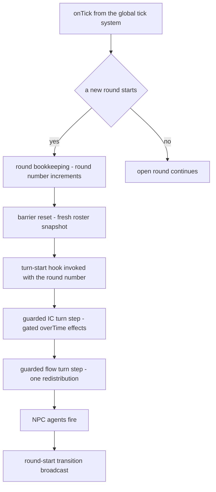

# Turn-Driven IC Effects & Per-Turn Energy Flow — Design Spec

Status: **Implemented, then partially superseded by a data change.** The code phase landed (per-turn `overTime` effects + one redistribution per turn on the round-start hook). Since then the energy mechanic was **removed from the shipped data**: no `energyFlow` rule in `data/world_rules.json`, and `coalGenerator` is inert (empty `overTime`). Decision #3 (1 coal every 5 turns) and the energy test pins (§6.1–§6.2) are therefore historical; the current contract is `test/contract/coalGenerator.contract.test.js` (inert organ) + `test/contract/energyFlow.contract.test.js` (off-by-data, with one-line re-activation) + the wiki amendments in `wiki/subMDs/`. The design decisions and their rationale below remain the reference for the flow's code path, which is intact and re-activatable by data.

Supersedes, where they conflict:
- the per-tick IC job decisions in [`wiki/m1_droid_spec.md`](wiki/m1_droid_spec.md) (§1.6 row 7, §5.1–§5.3 cadence) — see §8 of this spec for the doc amendments,
- the per-tick job decisions in [`wiki/energy_flow_spec.md`](wiki/energy_flow_spec.md) (job id/interval/order, “one flow tick” phrasing, `beginEnergyFlowTick`/`endEnergyFlowTick` naming, §10.1(d) same-tick ordering) — mark those rows **superseded by this spec** when amended,
- the historical plan [`wiki/turn_driven_ic_strength_plan.md`](wiki/turn_driven_ic_strength_plan.md) (its `turnDriven`/`turnEffects` channel was never implemented in the data or code; it is superseded by the unified `overTime`-on-the-turn-channel model below).

## 1. Purpose

Two cadence migrations that share one wiring point — the turn system’s round-start hook:

- **(A) IC `overTime` effects** move from a per-tick `TickJob` (`'internal-components'`, interval 1, order 0) to **turn boundaries**: each effect fires at round start when the global round number satisfies the effect’s cadence.
- **(B) Energy flow** moves from a per-tick `TickJob` (`'energy-flow'`, interval 1, order 2) to **one redistribution per turn**, executed in the same round-start step, strictly **after** the IC step (charge-then-flow).

Design only: no source, data, or test edits in this document. The mechanics preserve every existing effect/flow rule (handlers, clamps, epsilon, degradation, broadcast discipline); only the **driving cadence** changes.

## 2. Locked decisions (agreed with the user — do not change)

| # | Decision |
|---|----------|
| 1 | IC `overTime` effects fire on **turn boundaries (round start)**, not ticks. |
| 2 | Data field renamed **`intervalTicks` → `intervalTurns`** in [`data/internalComponents.json`](data/internalComponents.json:1) (+ validator + every reader). |
| 3 | Coal Generator cadence: interval count kept, unit = turns — **1 coal every 5 turns**. |
| 4 | Energy flow: **one redistribution per turn**; the per-tick `energy-flow` `TickJob` is retired. |
| 5 | Charge-then-flow ordering preserved: within the same round-start step, IC effects (incl. generator charge) run **before** flow redistribution. |

## 3. Verified current state (ground truth)

**Turn semantics** — [`src/controllers/core/TurnSystemController.js`](src/controllers/core/TurnSystemController.js):
- Single global round counter; the round number is *stored state*, incremented in [`_beginRoundBookkeeping()`](src/controllers/core/TurnSystemController.js:610) (round 0 starts lazily on the first `onTick()`).
- The turn-start hook is a **single** `Function | null` set via [`setTurnStartHook(fn)`](src/controllers/core/TurnSystemController.js:200), invoked inside [`_roundStart()`](src/controllers/core/TurnSystemController.js:581) **after** `_resetBarrierForNewRound()` and **before** `_fireNpcAgents(round)` (line 598), wrapped in try/catch (lines 587–593; a hook failure logs a warn and the round continues). The current signature is zero-arg — the round number is *not* passed, even though the call site already has it (line 582).
- The hook fires **once per round, globally**, and sees **all installed ICs across all entities** (world-wide scan, not roster-scoped): mid-round spawnings are OUT_OF_ROUND for barrier planning, but their organs are visible to the hook on subsequent rounds.

**House test-driving pattern** — [`test/contract/turnDrivenIC.contract.test.js:49-66`](test/contract/turnDrivenIC.contract.test.js:49), [`test/contract/TurnSystem.contract.test.js:49-70`](test/contract/TurnSystem.contract.test.js:49): build the world with a non-started `UniversalTickSystem`; `stepTo` = set `tick.currentTick` to a marker, then `turns.onTick()` (first call lazily starts round 0; after a `closeRound`, the next call starts the next round); `closeRound` = `turns.signalPlanComplete(id, 'player')` for every `state.barrier.pendingEntityIds` until phase is `resolution`. Each round start fires the hook exactly once. Round numbers advance 0, 1, 2, …; the tick marker is bookkeeping only.

**IC today** — [`src/controllers/core/InternalComponentController.js`](src/controllers/core/InternalComponentController.js):
- `initialize()` (lines 58–75) registers the only TickJob `'internal-components'` (interval 1, order 0) → [`_processTick()`](src/controllers/core/InternalComponentController.js:742). The constructor (lines 28–52) already performs ALL registry loading + validation; `initialize()` does nothing but job registration.
- `_processTick()` iterates the **canonical IC store** (entity → host component → instances), skips broken instances and broken hosts (`_hostIsBroken()`, line 1051), gates each effect on `currentTick > 0 && currentTick % effect.intervalTicks === 0` (line 758), wraps each effect in try/catch (Logger.error, continue), dispatches to exactly three handlers — [`_applyRestoreExistence()`](src/controllers/core/InternalComponentController.js:822), [`_applyConsumeFuelGenerateStat()`](src/controllers/core/InternalComponentController.js:874), [`_applyEmitChannelDamage()`](src/controllers/core/InternalComponentController.js:951) — then, iff anything changed, `_syncToEntityStore()` + one info log (lines 773–777). **`overTime` is the job’s only payload — the job can be retired wholesale.**
- [`processTurnEffects()`](src/controllers/core/InternalComponentController.js:1084) is an **empty no-op** retained so the composition-root hook stays a safe call.
- Validator [`_validateRegistry()`](src/controllers/core/InternalComponentController.js:85) fail-fails (`TypeError`) on unknown effect types and on missing/non-positive `intervalTicks` (lines 113–114); per-effect-type field checks follow (lines 116–134+).

**Data** — [`data/internalComponents.json`](data/internalComponents.json:1): three organs declare `overTime` — `repairSphere` (`restoreExistence`, `intervalTicks: 5`, `existenceGainPerInterval: 0.02`), `corrosiveGland` (`emitChannelDamage`, `intervalTicks: 10`), `coalGenerator` (`consumeFuelGenerateStat`, `intervalTicks: 5`, 1 coal → +10 `Physical.energy`, capacity 100). `strengthCore` (and the other FUNCTION organs) have `overTime: []`.

**Flow today** — [`src/controllers/core/EnergyFlowController.js`](src/controllers/core/EnergyFlowController.js): `initialize()` resolves the `energyFlow` world rule (fail-soft), fail-soft-validates per-recipe `energyCapacity`, then registers TickJob `'energy-flow'` (interval 1, order 2; constants at lines 69–82). [`processFlowTick()`](src/controllers/core/EnergyFlowController.js:205) is null-tolerant on the facade, no-ops when the rule is inactive, then: `beginEnergyFlowTick()` → per-entity simultaneous read/compute/write (tick-start values only; zero-total skip; per-component capacity clamp with lost overflow; `FLOW_NOOP_EPSILON` write guard; `skipDamageEvent` on every write) → **finally** `endEnergyFlowTick(anyWrite)` (always balanced). The facade’s [`beginEnergyFlowTick()`](src/controllers/WorldStateController.js:1339) / [`endEnergyFlowTick(shouldBroadcast)`](src/controllers/WorldStateController.js:1354) are pure scope-counter primitives (counter field line 174; broadcast-gate conjunct line 272) — **job-independent, reusable as-is**.

**Wiring today** — [`src/composition/WorldComposition.js`](src/composition/WorldComposition.js): facade-constructor init order is IC (line 289) → turn (295) → flow (303); the hook is wired at line 375 as a zero-arg lambda calling only `processTurnEffects()`; the flow facade is injected at line 380.

**Persistence** — [`src/controllers/WorldStateController.js`](src/controllers/WorldStateController.js): schema **v3** ([`PERSISTENCE_SCHEMA_VERSION`](src/controllers/WorldStateController.js:965)); the IC store is serialized wholesale via `structuredClone` in [`serialize()`](src/controllers/WorldStateController.js:1014) (line 1044) and restored in `restore()` (line 1116), which **strictly rejects any version ≠ 3**. No per-instance round bookkeeping exists; `installedAt` is a `Date.now()` timestamp (useless for round arithmetic). `serialize()` reads `serializedAtTick` through the IC controller’s stored tick-system reference (line 1017).

**Client surface** — verified by grep: **zero** `intervalTicks`/`overTime` references in `public/` and `shared/`. The only IC description generator, [`src/utils/InternalComponentUtils.js`](src/utils/InternalComponentUtils.js:13) (used by the broadcast service for the client-facing `description` field), reads legacy `turnDriven`/`turnEffects`/`tickEffects` fields that **do not exist in shipped data** — it always returns the passive string and never renders the cadence field.

## 4. Decisions and rationale

| # | Decision | Rationale |
|---|----------|-----------|
| 1 | **Hook contract:** `setTurnStartHook(fn)` keeps its shape (a single callback), but the hook is now **called with the round number**: `_roundStart()` passes the round returned by bookkeeping into the hook. The composition-root lambda is the single place that chains IC-then-flow. | The IC step needs the round for its gate; the flow step uses it for log consistency only. A one-argument pass-through at the single call site (line 589) is strictly smaller than the alternatives: no new public round getter on the turn controller, no shared bookkeeping object, no second hook. The single-callback shape is preserved, so the hook surface stays minimal and the try/catch guard at lines 587–593 is untouched. |
| 2 | **Firing bookkeeping: GLOBAL round gate (option a).** An `overTime` effect fires at round start when the round number is **greater than zero AND an exact positive multiple of the effect’s `intervalTurns`**. No per-instance counters, no persistence change. | (a) keeps schema **v3 saves valid** — option (b) (per-instance `lastFiredRound`) forces a v4 bump that invalidates every existing save (strict rejection at restore) for a parity refinement the game does not need. The trade is documented and accepted: an IC installed mid-game aligns to the **next global multiple** — its first fire is the first round, strictly after its install round, that is a positive multiple of its `intervalTurns`. For the normal case (organs auto-installed at world spawn, i.e. before round 0’s hook) the **first burn is exactly at round `intervalTurns`** — coal at round 5, matching locked #3. No effect fires on round 0 (the `round > 0` conjunct), so the lazy round-0 start is effect-free by construction. |
| 3 | **IC turn step:** `processTurnEffects(round)` becomes the real per-round channel: same canonical-store iteration, same broken-instance/broken-host skips, same three handlers **unchanged**, same per-effect try/catch, same store-sync-iff-changed + info log. The `'internal-components'` `TickJob`, its interval constant, `_processTick()`, and the now-purposeless `initialize()` are **retired** (the constructor already loads/validates the registry — it remains the single load/validate point). The constructor’s tick-system reference is **kept**: the facade’s snapshot envelope reads it for `serializedAtTick`. | `overTime` is the job’s only payload (verified), so the job is dead weight once the hook drives the effects. Removing `initialize()` rather than gutting it is the honest choice: with the job gone it has no remaining work, and the facade’s call site (line 289) is deleted with it. Keeping the tick-system field avoids a ripple into `serialize()` for a field whose one remaining reader is exactly that snapshot line. |
| 4 | **Flow step:** retire the `'energy-flow'` `TickJob` and its id/interval/order constants; `processFlowTick` becomes **`processFlowTurn(round)`** — one redistribution per turn, same simultaneous math, same epsilon/capacity/skip-damage/no-op rules. The facade scope pair is **renamed** `beginEnergyFlowTick`/`endEnergyFlowTick` → **`beginEnergyFlowTurn()` / `endEnergyFlowTurn(shouldBroadcast)`**; the private scope-counter field keeps its name (it counts scope depth — cadence-neutral). The flow controller’s constructor **drops the tick-system parameter** (job registration was its only consumer); the composition construction call and the unit-test stub are updated to match. `initialize()` keeps its remaining job: rule resolution + fail-soft recipe validation + init log. | Rename-for-honesty: after this change the step runs once per turn, and a `…FlowTick` name would be a lie at every call site; the blast radius is small and fully enumerable (one controller call site, the facade pair, the unit stub, two snapshot strings, comments), and the house explicitly updates the public-surface snapshot *on purpose* when a public method is renamed. The counter field’s name describes depth, not cadence, so it stays. Dropping the dead constructor parameter is standard DI hygiene; the tick job is the flow’s only tick-system touchpoint. |
| 5 | **Per-step isolation — three layers.** (L1) Inside the IC step: the existing per-effect try/catch is carried over — one bad instance/effect logs and the rest of the round’s IC effects still run. (L2) The composition-root hook lambda wraps **each subsystem step in its own guarded block**: an IC-step failure logs a warn naming the IC step and **does not block the flow step**; a flow-step failure logs a warn and **does not block NPC agents**. (L3) The existing `_roundStart()` hook try/catch (lines 587–593) is **unchanged** — the final guard so the round machine and `_fireNpcAgents` (line 598) can never break, even from a lambda-level fault. | L1 alone is insufficient: any throw *outside* the per-effect guard (iteration, store access) would propagate to L3 and silently skip the flow step for that round — exactly the failure the lock list calls critical. L2 makes the two subsystems independent of each other with named diagnostics; L3 is belt-and-suspenders and costs nothing (it exists today). The flow step’s own begin→work→finally scope close is retained, so even a mid-write throw closes the broadcast scope correctly before the exception reaches L2. |
| 6 | **Data + validation:** rename `intervalTicks` → `intervalTurns` in all three `overTime` entries of [`data/internalComponents.json`](data/internalComponents.json:1) (values unchanged: 5 / 10 / 5 — locked #3 and the no-rebalance scope), and update the file’s `_comment` (which currently says “unified tick system”). `_validateRegistry` fail-fails with `TypeError` on a missing or non-positive-integer `intervalTurns` (same position as today’s check, message updated). **Grep gate: zero `intervalTicks` references may remain in `src/`, `public/`, `shared/`, `test/`, `data/`, `wiki/`.** | The unit is now rounds; the field name must say so everywhere (locked #2). Fail-fast validation keeps corrupted cadence data from booting a silently-idle world. The grep gate makes the rename mechanically verifiable and prevents comment/lore drift (two test files and two wiki docs currently carry the old name in comments). |
| 7 | **No client work.** No `public/` or `shared/` file touches the cadence field (verified by grep), so the rename has **zero** client surface. The broadcast description generator’s legacy field reads are out of scope and untouched. | Design question 6 asked to investigate and cover any client surface that renders the `overTime` config. The investigation answer is *none exists*: the client receives IC instances (no cadence field) and a generated description string that never includes cadence. Nothing to migrate; the spec records the evidence so the code phase does not re-investigate. |
| 8 | **Persistence unchanged: schema stays v3** (the only accepted version). No per-instance field is added. | Direct consequence of decision 2 (global gate ⇒ no stored per-instance round state). `restore()`’s strict rejection means a v4 bump would invalidate all v3 saves; avoiding the bump is the whole point of option (a). The `persistence.contract` suite — which pins v3 and the v1/v2/999 rejections — passes **unchanged** and is the regression guard for this decision. |
| 9 | **Test migration:** the round-driven plan in §6 (file-by-file, pin-by-pin). | Every suite that drove a retired job by job-id must be re-driven through the house round pattern; every math pin that does not depend on cadence is preserved bit-exact, so the migration is provably behavior-preserving except for the intended cadence change. |
| 10 | **Docs:** the code-phase amendment list in §7 (list, don’t write). | The wiki is the agent-facing contract; leaving per-tick lore in place would contradict the new code on the next reading. The list is closed and exhaustive against the grep gate. |

## 5. Mechanics

### 5.1 Round-start sequence (new)

The hook is still called exactly once per round, at the same position (after barrier reset, before agents), under the same unchanged guard. What changes is the hook’s *body*: it chains the two per-turn subsystem steps in locked order — **IC first, flow second** (locked #5: the flow’s turn-start reads see the just-charged values).

### 5.2 The IC turn step

`processTurnEffects(round)` — public, on the IC controller — is now the single channel for all `overTime` effects:

- **Input contract:** the round number passed by the hook. Defensively, a non-numeric or non-positive round argument fires no effects and never throws (this keeps the zero-arg wiring-safety pin true in tests).
- **Iteration and skips:** identical to today’s tick step — walk the canonical IC store (entity → host component → instances); skip instances whose registry type has no `overTime` effects; skip broken instances and broken hosts. The scan is world-wide (every installed IC, regardless of round-roster membership), matching today’s tick job.
- **Gate (decision 2):** an effect fires iff `round > 0` and the round is an exact positive multiple of the effect’s `intervalTurns`.
- **Handlers:** the three existing handlers are reused **unchanged** — `restoreExistence` (fixed gain per fire, facade clamps at 1, whole-host skip), `emitChannelDamage` (range-bounded channel damage on the nearest targets), `consumeFuelGenerateStat` (priority order: full-battery skip → graceful fuel runout with once-only exhaustion log → burn whole fuel units and charge the host stat, clamped at capacity).
- **Effect isolation (L1):** each effect application stays inside its own try/catch — a failing effect logs an error and the remaining effects in the round still run.
- **Sync:** iff any effect changed world state, sync the IC store back to the entity store and emit one info log (same as today).
- **Retired:** the `'internal-components'` TickJob registration, the interval constant, `_processTick()`, the `TickJob` import (if unused elsewhere in the file), and `initialize()` (plus the facade’s call to it at line 289).

### 5.3 Firing cadence — exact rules

- **Gate expression (prose):** fire when the round is **positive** and `round % intervalTurns === 0`.
- **Round-0 rule:** nothing fires on round 0. Round 0 is the lazy first start; making it effect-free guarantees no double-fire interaction with the “positive multiple” rule.
- **First-burn guarantee (normal case):** an organ installed at world spawn (before round 0’s hook) first fires at **round `intervalTurns`** — coal generator: first burn at round 5, i.e. 1 coal every 5 turns from round 5 onward (locked #3).
- **Mid-game install (accepted trade, option a):** an organ installed during round R first fires at the first round strictly greater than R that is a positive multiple of its `intervalTurns` — e.g. a gland installed during round 3 with `intervalTurns: 10` first corrodes at round 10. No per-instance parity, no stored state.
- **Cadence is per-effect:** each effect in an organ’s `overTime` list keeps its own `intervalTurns` (5 for repair, 10 for corrosion, 5 for coal).

### 5.4 The flow turn step

`processFlowTurn(round)` — on the flow controller — performs **one** full redistribution per turn:

- Same preconditions and no-ops: null-tolerant facade; when the `energyFlow` rule is inactive/missing/malformed the step returns immediately (no enumeration, no writes, no scope activity, no per-turn log — one boot-time line per the degradation table).
- Same step shape: open the flow broadcast scope → per entity, read turn-start energies (absent/non-numeric reads as 0), skip the entity when the total is 0, compute the simultaneous equal-split next values (each component sends its share of its turn-start value, divided equally among the others; clamped to `[0, capacity]`, overflow lost), write only meaningful deltas with the damage event suppressed → **finally** close the scope with `endEnergyFlowTurn(anyWrite)`.
- Same broadcast discipline: the scope suppresses per-write broadcasts while open; exactly one full-state broadcast per turn, and only if something moved.
- The `round` argument is used for log consistency (the step reports which round it served); it does not gate the step — the flow runs **every** turn, including round 0.

### 5.5 Per-step isolation contract (decision 5)

| Layer | Owner | Behavior on failure |
|-------|-------|---------------------|
| L1 — per-effect guard | IC controller, inside the IC turn step (carried over from today’s tick step) | The failing effect logs an error; remaining effects in the round still run. |
| L2 — per-subsystem guarded block | Composition-root hook lambda ([`WorldComposition.js:375`](src/composition/WorldComposition.js:375) site, rewritten) | IC step throws → warn naming the IC step; **the flow step still runs**. Flow step throws → warn naming the flow step; **NPC agents still fire**. The flow step’s own finally-close still balances the broadcast scope before the exception reaches L2. |
| L3 — hook guard | Turn system, [`_roundStart()`](src/controllers/core/TurnSystemController.js:581) lines 587–593, **unchanged** | Any lambda-level fault logs a warn; the round machine, agent firing (line 598), and the round-start transition all proceed. |

Failure-behavior matrix:

| Fault | IC step | Flow step | NPC agents | Round machine |
|-------|---------|-----------|------------|---------------|
| One effect throws (L1) | remaining effects run | runs | fire | unaffected |
| IC step faults wholesale (L2) | logged, aborts | **runs** | fire | unaffected |
| Flow step faults (L2) | already ran | logged, aborts (scope still closed) | **fire** | unaffected |
| Lambda-level fault (L3) | — | — | fire | unaffected |

### 5.6 Data, validation, client surface

- [`data/internalComponents.json`](data/internalComponents.json:1): `intervalTicks` → `intervalTurns` in all three `overTime` entries; values unchanged (5 / 10 / 5); the top-level `_comment` reworded from “unified tick system” to the per-turn round-start channel.
- [`_validateRegistry()`](src/controllers/core/InternalComponentController.js:85): the cadence check fail-fails with `TypeError` when `intervalTurns` is absent or not a positive number (message updated); all other per-type field checks unchanged.
- Client surface: **none** (decision 7, with grep evidence in §3). `shared/` is untouched (no cross-layer contract reference exists).

### 5.7 Persistence

No snapshot change (decision 8). The IC store shape is unchanged; v3 remains the only accepted schema; `serializedAtTick` still flows through the IC controller’s tick-system reference (constructor field retained — decision 3).

## 6. Test migration plan (decision-complete)

**Shared driving helper** (all round-driven suites): the house pattern from [`test/contract/turnDrivenIC.contract.test.js:49-66`](test/contract/turnDrivenIC.contract.test.js:49) — `stepTo(world, tick, turns, marker)` sets `tick.currentTick = marker` and calls `turns.onTick()` (first call starts round 0; after a `closeRound`, the next call starts the next round); `closeRound(turns)` signals every `state.barrier.pendingEntityIds` as `'player'` until phase is `resolution`. K successive round starts = K `stepTo` calls with `closeRound` between them, consuming rounds 0, 1, …, K−1. The marker value is arbitrary bookkeeping — **the round number, not the tick value, drives every gate**.

**Shared coal rule** (flow suite): flow-only scenarios that assert conservation, non-increasing total, or strictly shrinking spread **first drain the M1’s coal loadout** (reuse the coal suite’s drain helper) so the generator cannot inject energy into the math. Scenarios that drive fewer than 5 successive round starts need no coal manipulation (the first burn round is 5, and round 0’s gate is closed). Scenario (d) keeps the generator live — that is its point.

### 6.1 [`test/contract/coalGenerator.contract.test.js`](test/contract/coalGenerator.contract.test.js) — job-driven → round-driven

Replace the job-id helper with the shared round helpers; drop the job-id constant; rewrite the module header (“every 5 rounds”, round-driven). New pins (values unchanged):

- **No burn at spawn / round 0:** after the first `stepTo` (round 0 start): coal 10, energy 0.
- **No burn off-cadence:** rounds 1–4 leave coal 10, energy 0.
- **First burn at round 5:** coal 9, energy 10 (the locked first-burn guarantee).
- **Cadence:** round 10 → coal 8, energy 20 (optionally round 15 → coal 7, energy 30).
- **Full battery:** energy set to 100 before round 5 → round 5 burns nothing (coal 10).
- **Clamp:** energy set to 95 → round 5: coal 9, energy 100 (+5, not +10); round 10: unchanged (full-battery skip).
- **Graceful runout:** drain coal → round 5: no charge, the exhaustion warn logged exactly once; rounds 10/15: no additional warns.
- **Despawn marker sweep:** drain coal; round 5 (one warn); despawn → the dry-transition marker is gone for the removed entity; respawn (fresh 10-coal kit); drain the new entity; round 10 → second warn, energy 0.

### 6.2 [`test/contract/energyFlow.contract.test.js`](test/contract/energyFlow.contract.test.js) — job-driven → round-driven

Replace the job-lookup/drive helpers with the shared round helpers; module header rewritten (“drives the round-start hook”, not “the registered job”). The exact equal-split math, capacities, tolerances, and degradation file-swap idiom are **preserved bit-exact**. Scenario mapping:

- **(a) Exact equal split:** seed skewed (body 100, others 0); **one flow turn** (round 0 start): body lands at `100 − share·100`, each of the 22 others at `(share·100)/22` — same FP ops, same exact pins. (Round 0’s IC gate is closed, so the 100 on the body cannot trigger a burn even with coal aboard.)
- **(b) Capacity + non-increasing total:** **drain coal** (coal rule); seed skewed; 50 successive round starts; per round: every value within capacity and ≥ 0, total ≤ previous total.
- **(c) Convergence:** **drain coal**; seed skewed; 30 successive round starts; total conserved within FP tolerance; spread strictly shrinks each turn; every final value within tolerance of `100/23`. (Math unchanged — same share math, N rounds instead of N ticks.)
- **(d) Charge-then-flow (locked #5), one round start:** fresh M1 (10 coal, body 0). Pin the pre-state at round 0 (no burn). Drive successive starts through rounds 1–4 (no burn — gate). At the **round-5 start**: the IC step burns 1 coal (coal 9, body 10) and, in the *same* round start, the flow step reads the charged value: body lands at `10 − share·10`, each of the 22 others at `(share·10)/22`. Assert the burn **and** the redistribution from the single round-5 start.
- **(e) Persistence round-trip:** seed skewed; two flow turns; `serialize()` → schema version still 3 (`PERSISTENCE_SCHEMA_VERSION` unchanged — proof of decision 8); `restore()` → every `Physical.energy` bit-identical.
- **(f) Graceful degradation** (three file-swap scenarios): unchanged except “3 driven ticks” → 3 successive round starts (rounds 0–2: no burn round reached); zero stat writes; the world otherwise fully alive; single boot warn on the malformed-rule case.
- **(h) Zero-energy skip:** freshly spawned M1; one flow turn (round 0) → zero stat writes.
- **(i) Steady-state silence:** all 23 components set to exactly 100; one flow turn → zero writes (epsilon fixed point).
- **(j) Drains are not damage:** force the onDamage Bernoulli draw to success; seed (body 0, others 100); **5 successive round starts = rounds 0–4** (the first burn round, 5, is never reached — no coal manipulation needed); the body absorbed energy; **zero** dropped items.
- **(k) Broadcast contract:** write-producing turn (skew seed, one flow turn) → exactly N stat writes, exactly **one** broadcast (per-write gate suppressed the rest; scope closed with the true flag); no-write turn (uniform 100) → zero broadcasts. Comments reference the renamed scope pair.

### 6.3 [`test/unit/energyFlowController.test.js`](test/unit/energyFlowController.test.js) — unit the turn step directly

- The stub tick system (job recorder) is **retired**: `initialize()` registers nothing, and the “job stays registered even when the rule is off” assertion is deleted (its replacement: with the rule off, the turn step touches the facade not at all — no enumeration, no writes, no scope — which the existing assertions already pin once the drive mechanism changes).
- The constructor stub drops the tick-system argument (decision 4); the drive helper becomes a direct `processFlowTurn(round)` call.
- The stub facade’s scope pair is renamed to `beginEnergyFlowTurn`/`endEnergyFlowTurn`.
- Every math pin is preserved unchanged: N=1 no-op; heterogeneous-capacity clamp with exact discarded amount; `energyCapacity: 0`; skip-damage flag on every write; epsilon no-op at unit scale; disabled-at-boot no-touch; zero-energy skip; recipe-validation gating on rule activity; broadcast-scope positive path (scope closed with the true flag).

### 6.4 [`test/contract/turnDrivenIC.contract.test.js`](test/contract/turnDrivenIC.contract.test.js) — updated to the NEW behavior

Reframe: the unified `overTime` channel **is** the turn channel (the old `turnDriven`/`turnEffects` drift in comments goes). Pins:

- **Kept unchanged:** strengthCore grants `Physical.strength` 50 on install (SET, non-additive — never 100 across rounds), host existence not drained (its `overTime` is `[]` — still a no-op on the turn channel); the empty-`overTime` no-op pin; the `hostComponentType`/`hostSlot` auto-install filtering pin.
- **Wiring safety (updated):** `processTurnEffects` with a round argument — and, defensively, with no argument — never throws with zero installed instances; a full round with no ICs still runs cleanly.
- **NEW — repairSphere cadence:** install a `repairSphere` on a `droidHand` via the public install API (the suite’s existing corrosiveGland idiom); damage the hand’s existence below 1 (e.g. SET to 0.8); drive round starts: rounds 0–4 leave existence unchanged (gate), the round-5 start raises existence to the damaged value plus exactly one interval gain (one 0.02 step on the 0–1 scale; the facade’s clamp at 1 is not engaged at this value), the round-10 start adds the second step.
- **NEW — corrosiveGland cadence:** install a `corrosiveGland` on a hand; a victim droid shares the room. After the round-5 start the victim’s first component is **unchanged** (5 is not a multiple of 10); at the round-10 start the victim takes corrosion damage matching the channel-loss formula from the shared helper (the exact volume math stays pinned in the onDamage suite — here only the cadence and the decrease are pinned).

### 6.5 [`test/contract/worldRulesOnDamage.contract.test.js`](test/contract/worldRulesOnDamage.contract.test.js) — scenarios 6 and 6b migrate

The only suite outside the IC/flow files that drives the retired job (verified by grep). Scenarios 6 and 6b replace `driveIC(tick, 10)` with round driving to the **round-10 start** (rounds 0–9: no corrosion — the gate); at the round-10 start exactly one corrosion tick: the victim’s first component existence decreases by exactly the channel-loss amount, and exactly one onDamage token appears with the formula-exact volume and in-range position. 6b (room-bound range): the other-room victim takes no damage and sheds nothing at the round-10 start. The job-id constant, the drive helper, the “intervalTicks (10)” comment, and the header’s “IC-tick source” wording (“IC-turn source”) are updated.

### 6.6 [`test/contract/worldStateController.contract.test.js`](test/contract/worldStateController.contract.test.js) — public-surface snapshot

The two scope-pair entries are renamed to the new method names (both land in the same alphabetical positions, so the list shape is unchanged); the “per tick” comments become “per turn”. This is the *on-purpose* snapshot update for decision 4.

### 6.7 Files with NO change (explicit)

| File | Why it stays untouched |
|------|------------------------|
| [`test/contract/persistence.contract.test.js`](test/contract/persistence.contract.test.js) | Pins v3 as the only accepted schema and the v1/v2/999 rejections — the regression guard for decision 8. Passes unchanged. |
| [`test/contract/TurnSystem.contract.test.js`](test/contract/TurnSystem.contract.test.js), [`test/contract/turnBarrier.contract.test.js`](test/contract/turnBarrier.contract.test.js) | The hook *guard* and call position are unchanged (L3). In those worlds the new hook body is a no-op: the IC step sees only strengthCore (`overTime: []`), and the flow step finds no entity holding any energy stat (per-entity zero-total skip) — so the round machine is unperturbed. These suites are the guard-unchanged regression guard. |
| [`test/unit/m1SharedContract.test.js`](test/unit/m1SharedContract.test.js) | Reads only `overTime[0]`’s `type`/`fuelItem`/`targetStat` from the data file — the rename touches none of those fields. |
| [`test/contract/m1Droid.contract.test.js`](test/contract/m1Droid.contract.test.js) | Never drives the turn machine (no `onTick`/round references — verified); its spawn-time energy-0 pin is unaffected. |
| All other suites | No job-id references (grep-verified: only the three migrated suites use the retired job ids). |

## 7. Documentation updates (code phase — list, don’t write)

| Doc | Nature of the change |
|-----|----------------------|
| [`wiki/energy_flow_spec.md`](wiki/energy_flow_spec.md) | Amend the per-tick job decisions to the per-turn step: job id/interval/order rows, “one flow tick” phrasing, `beginEnergyFlowTick`/`endEnergyFlowTick` names, §10.1(d) same-tick charge-then-flow, the file-change table. Mark each superseded decision **explicitly** (superseded-by-this-spec note). |
| [`wiki/subMDs/systems/energy_flow.md`](wiki/subMDs/systems/energy_flow.md) | Per-turn flow: one redistribution per round start, after the IC step; “one broadcast per tick” → “per turn”. |
| [`wiki/subMDs/controllers/internal_component_controller.md`](wiki/subMDs/controllers/internal_component_controller.md) | Align the described turn channel with the new code: the unified `overTime` channel fires at round start through the turn-start hook under the global round gate; the tick job is retired. **Fix the remaining mismatch:** the doc still describes the removed `turnDriven` flag / `turnEffects` channel (no such fields exist in the data or code) — replace with the real model; the turnDrivenIC contract now pins turn-driven `overTime` behavior. |
| [`wiki/subMDs/data/internal_components.md`](wiki/subMDs/data/internal_components.md) | The `intervalTurns` field (unit: rounds) replacing `intervalTicks`; tick-based wording → turn-based. |
| [`wiki/map.md`](wiki/map.md) | Graph: retire the `WSC →|holds; initializes tick job| EFC` edge (the flow registers no job) and the IC tick-job edge; the turn-start hook edges go to **both** the IC controller (existing `TSC →|turn-start hook| ICE` edge) and the flow controller (same callback chains both); the `turn-system` tick job stays. The `world_rules.json` data-table row’s “per-tick share” wording → per-turn. |
| [`wiki/subMDs/architecture/system_map.md`](wiki/subMDs/architecture/system_map.md) | Per-tick → per-round operational flows: the flow line (“tick job, order 2”) becomes the round-start hook step after the IC step; the “Energy Flow (per tick, after internal-components and the turn system)” section becomes per-round. |
| [`wiki/m1_droid_spec.md`](wiki/m1_droid_spec.md) | Pacing: **1 coal every 5 turns** — §5.1 cadence row, §1.6 row 7 (the “IC unified tick system” row), the §5.2 flowchart (“tick mod intervalTicks is 0” → the round gate), and the decision-table row “every 5 ticks”. Mark the “no IC tick-architecture change” statements **superseded** — this spec is exactly the architecture change they constrained. |
| [`wiki/world_rules_onDamage_design.md`](wiki/world_rules_onDamage_design.md) | The “IC-tick source” scenario text (required by the grep gate): `intervalTicks 10` → `intervalTurns 10`, driven to the round-10 start, “IC-tick source” → “IC-turn source”. |
| [`wiki/CORE.md`](wiki/CORE.md) | Index wording only — verified: specs are *not* indexed in CORE.md (standalone docs), so no new index entry. The internal-components data-doc line’s “tick-based effects” → turn-based; the energy-flow system line’s “one broadcast per tick” → “per turn”. |
| [`wiki/turn_driven_ic_strength_plan.md`](wiki/turn_driven_ic_strength_plan.md) | Add a superseded header pointing to this spec (historical plan; prevents future readers trusting its `turnDriven`/`turnEffects` design). |

## 8. Out of scope

- Rebalancing coal loadout or interval values — shipped numbers kept (10 coal, intervals 5/10/5, +10 per burn, capacity 100).
- New effect types.
- Client UI work beyond the field-rename coverage — coverage is **zero**, verified (decision 7).
- Save-migration tooling — avoided by design (decision 2 ⇒ no schema bump).
- Anything in `shared/` — grep proves no cross-layer contract reference (decision 7).
- The legacy [`InternalComponentUtils`](src/utils/InternalComponentUtils.js) description reader — it reads fields absent from shipped data and contains no `intervalTicks` reference; left untouched.

## 9. Source file change table (code phase)

| File | Change |
|------|--------|
| [`src/controllers/core/InternalComponentController.js`](src/controllers/core/InternalComponentController.js) | Retire the job (registration, interval constant, `TickJob` import if unused) and `_processTick()`; retire `initialize()`; `processTurnEffects(round)` becomes the real channel (defensive round arg, same iteration/skips, round gate, handler reuse, per-effect guard, sync-iff-changed); validator renamed to `intervalTurns` (fail-fast); file-header and method JSDoc updated to the turn channel. Constructor and its tick-system field unchanged (snapshot envelope reads the field). |
| [`src/controllers/core/EnergyFlowController.js`](src/controllers/core/EnergyFlowController.js) | Retire the job (registration + id/interval/order constants); drop the tick-system constructor parameter; `processFlowTick` → `processFlowTurn(round)`; scope-pair call sites renamed; file-header/JSDoc updated to the per-turn cadence. |
| [`src/controllers/WorldStateController.js`](src/controllers/WorldStateController.js) | Delete the IC `initialize()` call (line 289); keep the flow `initialize()` call (line 303, now job-free) and its comment reworded; rename the scope pair to `beginEnergyFlowTurn`/`endEnergyFlowTurn` (counter field name unchanged); comments updated (constructor-order comment, gate-conjunct comment, counter comment). |
| [`src/composition/WorldComposition.js`](src/composition/WorldComposition.js) | Hook lambda (line 375) rewritten: receive the round, run the guarded IC step then the guarded flow step (L2 blocks); flow construction call drops the tick-system argument. |
| [`src/controllers/core/TurnSystemController.js`](src/controllers/core/TurnSystemController.js) | The hook call site passes the round (line 589); `setTurnStartHook` JSDoc updated (the hook receives the round number). The guard, call position, and everything else unchanged. |
| [`data/internalComponents.json`](data/internalComponents.json:1) | `intervalTicks` → `intervalTurns` (three entries, values unchanged); `_comment` reworded. |

## 10. Verification gates (post-code-phase, all must hold)

- `intervalTicks` → **zero** hits in `src/`, `public/`, `shared/`, `test/`, `data/`, `wiki/`.
- The retired job ids `'internal-components'` and `'energy-flow'` → zero hits in `src/` and `test/`.
- `processFlowTick`, `beginEnergyFlowTick`, `endEnergyFlowTick` → zero hits in `src/` and `test/` (renamed per decision 4).
- `public/` and `shared/` → zero file changes.
- Full test suite green — the migrated contracts pin the new cadence (first burn round 5, corrosion round 10, one redistribution per round start, charge-then-flow in a single round start) and the untouched suites (persistence v3, turn machine, barrier) pin what did not change.
