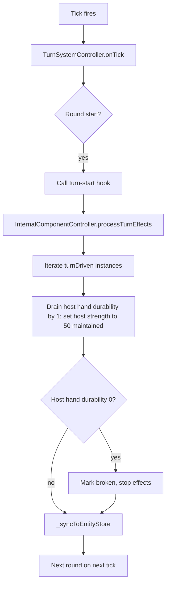

# Turn-Driven Internal Component: Strength Core Plan

## Overview

This plan introduces a new internal component type, **`strengthCore`**, that the droid's left hand carries. It is **turn-driven** (not tick-driven): on each turn it (1) drains 1 of its own durability, and (2) maintains a non-additive (overwritten) `+50` to the droid's `Physical.strength`. The system must fire on turn events, not ticks.

The existing `InternalComponentController` is purely **tick-driven**: it registers a single unified `TickJob` (`IC_BASE_TICK_INTERVAL = 5`) and applies `tickEffects` on a logical-second modulo. This plan adds a parallel **turn-driven** effect channel so the two cadences coexist without conflating semantics.

---

## 1. Data Schema Additions

### 1.1 `data/internalComponents.json` — new entry

A new top-level key `strengthCore`. It must **not** use `tickInterval`/`tickEffects` (those are the tick channel). Instead it uses a new `turnEffects` array and a `turnDriven: true` flag to opt into the turn-driven path.

```json
"strengthCore": {
  "volume": 1,
  "turnDriven": true,
  "turnEffects": [
    {
      "targetTrait": "Physical",
      "targetStat": "durability",
      "effect": "add",
      "amount": -1,
      "target": "host"
    },
    {
      "targetTrait": "Physical",
      "targetStat": "strength",
      "effect": "set",
      "amount": 50,
      "target": "host"
    }
  ],
  "traits": {
    "Physical": { "mass": 2, "durability": 20 }
  },
  "excludedComponentTypes": [],
  "autoInstallOnSpawn": true,
  "targetBlueprintTypes": ["smallBallDroid"],
  "hostComponentType": "droidHand",
  "hostSlot": "left"
}
```

Field rationale:

| Field | Purpose |
|-------|---------|
| `turnDriven` | Opt-in flag distinguishing the turn channel from the tick channel. When `true`, the controller must not treat this type as a tick effect. |
| `turnEffects` | Array of `{ targetTrait, targetStat, effect, amount, target }`. `effect` reuses the existing `add`/`set`/`multiply` vocabulary. `target` distinguishes `self` (the internal component's own durability pool) from `host` (the host component's stat). The `strengthCore` type uses `target: "host"` for BOTH effects: the per-turn durability drain hits the HOST HAND's `Physical.durability` (the droid's left hand), and the strength `set` hits the host's `Physical.strength`. |
| `target: "host"` (durability) | The `durability` drain applies to the host hand's `Physical.durability`, not the IC's own pool. When the host hand's durability reaches 0 (driven by the per-turn drain), the instance breaks and stops applying effects — the component is destroyed with its host limb. |
| `target: "host"` (strength) | The `strength` effect applies to the host component's `Physical.strength`. |
| `effect: "set"` | Non-additive / maintained. Each turn it **overwrites** `strength` to 50 (not +50 stacked). This is the "maintained" semantic. |
| `hostComponentType: "droidHand"` | Constrains auto-install to the hand component (the droid's left hand). |
| `hostSlot: "left"` | Constrains auto-install to the component whose PARENT arm's `identifier` is `left`. The droid blueprint is `["droidArm", "left"] → droidHand`: the hand's own identifier is remapped to `default_left` by the blueprint expander, but its parent arm carries `identifier === "left"`. The auto-install filter resolves the host's parent via `dependsOn[0]` and matches that arm's identifier, so the data file names the limb (the arm slot), not the remapped hand identifier. |
| `autoInstallOnSpawn: false` | Consistent with the existing default; explicit opt-in required at runtime. |
| `targetBlueprintTypes: ["smallBallDroid"]` | Only the droid blueprint auto-receives this. |
| `traits.Physical.durability: 20` | The internal component's own durability pool. Kept as a STATIC trait (display/completeness); NOT drained by this type — the per-turn drain targets the host hand. |


### 1.2 `data/components.json` — no change required

The `droidHand` already defines `Physical.strength: 25`. No new component type is needed; the `strengthCore` attaches to the existing `droidHand` type.

### 1.3 `data/blueprints.json` — no change required

The droid blueprint already produces a `droidHand` under the left arm (`["droidArm", "left"] → droidHand`). The `hostSlot: "left"` filter targets that instance by its `identifier`.

---

## 2. Controller Changes — `src/controllers/core/InternalComponentController.js`

The controller must learn to drive a **turn** channel alongside the existing **tick** channel.

### 2.1 New public method: `processTurnEffects()`

A new public method, invoked **once per turn** by the turn system (see Section 4 for the hook). It iterates all installed internal component instances, and for each whose type is `turnDriven`, applies its `turnEffects`:

- For `target: "self"`: mutate the instance's own `instanceStats.Physical.durability` by the effect. If durability hits 0, mark the instance broken (`instance.broken = true`) and skip further effects for that instance. (The `strengthCore` type does NOT use a `self` drain — it drains the host hand instead.)
- For `target: "host"`: apply the effect to the host component's stat via `worldStateController.componentController` — using `updateComponentStatDelta` for `add`/`multiply` and `updateComponentStat` (absolute set) for `set` (the maintained/non-additive semantic). A `host`-targeted durability drain that drives the host hand's durability to 0 also breaks the instance (the component is destroyed with its host limb), and further effects are skipped for that instance.
- After applying, call `_syncToEntityStore()` so the client sees updated internal component data.

### 2.2 Instance shape change

The instance object created in `autoInstallOnEntitySpawn` and `addInternalComponent` gains:

- `instanceStats`: a deep copy of `compDef.traits` (e.g., `{ Physical: { mass: 2, durability: 20 } }`). This is the internal component's own stat pool, drained by `target: "self"` effects. For the `strengthCore` type (which drains the HOST hand, not its own pool), this pool is kept as a static trait for display/completeness.
- `broken`: `boolean`, default `false`. Set to `true` when the instance's self-durability pool reaches 0 (via a `self` drain or `adjustInstanceStat`), OR when a `host`-targeted durability drain drives the host hand's durability to 0.

### 2.3 `_validateRegistry` — extend for `turnEffects`

The existing validation loop checks `tickInterval` and `tickEffects`. Add a parallel block:

- If `definition.turnDriven` is `true`, require `turnEffects` to be a non-empty array.
- Validate each `turnEffects` entry has `targetTrait`, `targetStat`, `effect` (one of `add`/`set`/`multiply`), `amount` (number), and `target` (one of `self`/`host`).
- If `definition.turnDriven` is `true`, do **not** require `tickInterval`/`tickEffects` (they are the tick channel).
- If a type has **neither** `turnEffects` nor `tickEffects`, warn (it is a passive no-op).

### 2.4 `_processTick` — exclude turn-driven types

The existing `_processTick` loop must **skip** types with `turnDriven: true` so they are not double-applied on the tick channel. A one-line guard: `if (compDef.turnDriven) continue;` at the top of the per-instance loop.

---

## 3. Turn Hook Integration Point — `src/controllers/core/TurnSystemController.js`

The turn system is the single authority for "a turn has happened." The internal component's turn effects must fire **exactly once per round**, aligned with the round boundary.

### 3.1 Hook location: round start

The effect should fire at **round start** (`_roundStart()`), so the strength is in place when that round's actions resolve, and the durability drain reflects the turn just begun. This keeps the turn system as the sole timing authority (per the architecture: "the turn system owns timing and ordering only, never validation or consequences" — applying a stat is a consequence, but the *timing* of when the IC effect runs is owned by the turn system; the IC controller owns the *what*).

### 3.2 Injection pattern (dependency inversion)

`TurnSystemController` must **not** import `InternalComponentController` directly (that would invert the dependency direction and risk circular imports, and the turn system is deliberately kept free of feature-specific controllers — see the `setNpcAgent` dependency-inversion precedent). Instead:

- Add a new post-construction setter on `TurnSystemController`: `setTurnEndHook(fn)` (or `setTurnStartHook(fn)`).
- In `WorldStateController` (the composition root), after both controllers are constructed, wire: `turnSystemController.setTurnStartHook(() => internalComponentController.processTurnEffects())`.
- Inside `_roundStart()`, after `_beginRoundBookkeeping()` and `_resetBarrierForNewRound()` (and before `_fireNpcAgents`, so the strength is active for agent planning), call the hook if present. Guard with `try/catch` so a hook failure never breaks the round machine (graceful degradation).

> **Why a setter rather than direct reference:** Mirrors the existing `setNpcAgent` / `setWorldStateController` / `setBroadcaster` injection pattern in `TurnSystemController`, preserving the controller's deliberate decoupling from feature-specific systems and keeping the dependency graph one-directional (`WorldStateController` → both).

### 3.3 Ordering guarantee

`_roundStart` runs on a tick (Duty 1 or Duty 2 of `onTick`). The internal component turn hook runs synchronously inside `_roundStart`, so the strength/durability state is updated **before** `_fireNpcAgents` (agent planning) and before resolution. This guarantees the droid acts with the +50 strength during the round it just entered.

---

## 4. Files to Create / Modify

| File | Action | Change |
|------|--------|--------|
| `data/internalComponents.json` | **Modify** | Add `strengthCore` entry with `turnDriven`, `turnEffects`, `hostComponentType`, `hostSlot`, own `traits`. |
| `src/controllers/core/InternalComponentController.js` | **Modify** | (a) Add `processTurnEffects()` public method; (b) extend instance shape with `instanceStats` + `broken`; (c) extend `_validateRegistry` for `turnEffects`; (d) guard `_processTick` to skip `turnDriven` types; (e) init `instanceStats` from `compDef.traits` in `autoInstallOnEntitySpawn` and `addInternalComponent`. |
| `src/controllers/core/TurnSystemController.js` | **Modify** | Add `setTurnStartHook(fn)` setter; invoke the hook in `_roundStart()` (guarded, best-effort). |
| `src/controllers/WorldStateController.js` | **Modify** | In the composition root, after both controllers initialize, wire `turnSystemController.setTurnStartHook(() => internalComponentController.processTurnEffects())`. |
| `src/utils/InternalComponentUtils.js` | **Modify** | `generateDescription` must handle `turnDriven`/`turnEffects` types (current code only reads `tickEffects`). Add a branch describing turn-driven effects. |
| `wiki/subMDs/controllers/internal_component_controller.md` | **Modify** | Document the turn-driven channel, the `turnEffects` schema, the turn-start hook integration, and the `instanceStats`/`broken` instance shape. |
| `wiki/subMDs/data/internal_components.md` | **Modify** | Document the `strengthCore` type, the `turnDriven` flag, and the `target: self` vs `target: host` effect vocabulary. |
| `wiki/map.md` | **Modify** | Add the `TurnSystemController → InternalComponentController` edge (turn-start hook) to the dependency graph. |
| `test/` (new) | **Create** | Unit test(s) for `processTurnEffects`: (1) host hand durability drains 1/turn; (2) host strength is set (not added) to 50; (3) a second turn does not stack strength (stays 50, not 100); (4) `turnDriven` types are skipped by `_processTick`; (5) broken instance (host hand durability 0) stops applying effects. |

---

## 5. Design Decisions & Open Questions

1. **Durability source for breaking.** The `strengthCore` type drains the HOST HAND's `Physical.durability` (via a `target: "host"` `add -1` effect), NOT its own pool. When the host hand's durability reaches 0 (driven by the per-turn drain), the instance is marked `broken` and stops applying effects — the component is destroyed with its host limb. The IC's own `instanceStats` pool (the type's `traits`, e.g. `Physical.durability: 20`) is retained as a static trait for display/completeness but is NOT drained by this type. A broken `strengthCore` (a) stops applying effects but remains installed — the existing `BrokenComponentRemovalHandler` handles component breakage (when the host hand's durability hits 0 via the stat-change trigger), not internal-component-instance breakage directly. Recommendation: (a) mark broken + stop effects on the IC side, and let the host hand's own breakage cascade (via the stat-change trigger) clean up the limb — keeps this change scoped.

2. **`set` vs `add` for the strength effect.** The requirement is "maintained/overwritten, not additive." Using `effect: "set"` with `amount: 50` overwrites strength to 50 each turn. **Caveat:** this overwrites the *host's* strength, not the droid's *total* strength. The droid's strength is the sum across components (the `droidHand` contributes its `Physical.strength`). So "setting" the hand's strength to 50 means the hand contributes 50 (instead of its base 25), a net +25 to the droid's total from the hand. **Clarification needed:** does "+50 strength" mean (a) the hand's strength stat is set to 50, or (b) the droid's total strength is increased by a maintained +50 bonus? If (b), the effect must target the entity (summed strength), which the current IC host-component model does not directly support (ICs attach to components, not entities). The plan as written assumes (a) — the hand's `Physical.strength` is set to 50 each turn. Confirm the intended semantic.

3. **Round-start vs post-resolution timing.** This plan fires the hook at round start so the strength is active during the round. If the product intent is "the effect applies *after* a turn completes" (i.e., drain happens at the end of the round the component was active in), the hook should instead be invoked at the end of `_resolveRound()`. Both are one-line wiring changes; confirm which.

4. **No regression to tick-driven ICs.** The `turnDriven` guard in `_processTick` and the new validation block are additive; `durabilityRepairSphere` and `transcendentSpeedCore` (both tick-driven, `turnDriven` unset) are unaffected. Existing tests must still pass.

5. **`hostSlot: "left"` filter.** The auto-install pipeline currently filters by `type`; the `hostSlot` filter is a small additive extension. The `autoInstallOnEntitySpawn` loop iterates `components` (each has `type`, `identifier`, `id`, and `dependsOn` — the parent instance ids set by the blueprint expander). A component is eligible only if `component.type === hostComponentType` **and** (if `hostSlot` is set) the host's PARENT arm's identifier equals `hostSlot` (resolved via `dependsOn[0]`). Matching the parent arm — not the host's own identifier — is what lets the data file name the limb: a nested component's own identifier is remapped with a `default_` prefix (the left hand carries `default_left`), so matching it directly would never resolve. The filter keeps the existing fail-fast ordering (cheap property lookups before volume checks).

---

## 6. Mermaid: Turn-Driven IC Effect Flow



---

## 7. Compliance Checklist

- [x] Data-driven: new IC type is pure JSON in `data/internalComponents.json`; no per-type code.
- [x] State controller with `DataLoader.loadJsonSafe`: `InternalComponentController` already loads via `DataLoader`; no change to loading path.
- [x] Defensive copying: `processTurnEffects` reads host stats via public `getComponentStats` (defensive copy) and mutates via public `updateComponentStat`/`updateComponentStatDelta`/`updateComponentStatRelative` (the relative op applies `multiply` atomically, so the read-then-write cannot race with a concurrent stat change).
- [x] Public API only: the turn system calls `internalComponentController.processTurnEffects()` (public method), never internal state. The hook is injected via a setter (dependency inversion), matching the `setNpcAgent` precedent.
- [x] Centralized logging: all logs via `Logger`, no `console.*`.
- [x] Validation: `_validateRegistry` extended with a `_validateTurnEffects`-style check for the new schema; structurally invalid entries (missing fields, unknown effect/target, non-numeric amount) throw `TypeError` at load so corrupted data never enters the state, while optional/soft conditions remain warnings.
- [x] Turn-driven, not tick-driven: effects fire on the turn-start hook, not the tick job; tick job explicitly skips `turnDriven` types.
- [x] Map maintenance: `wiki/map.md` gains the new edge.
