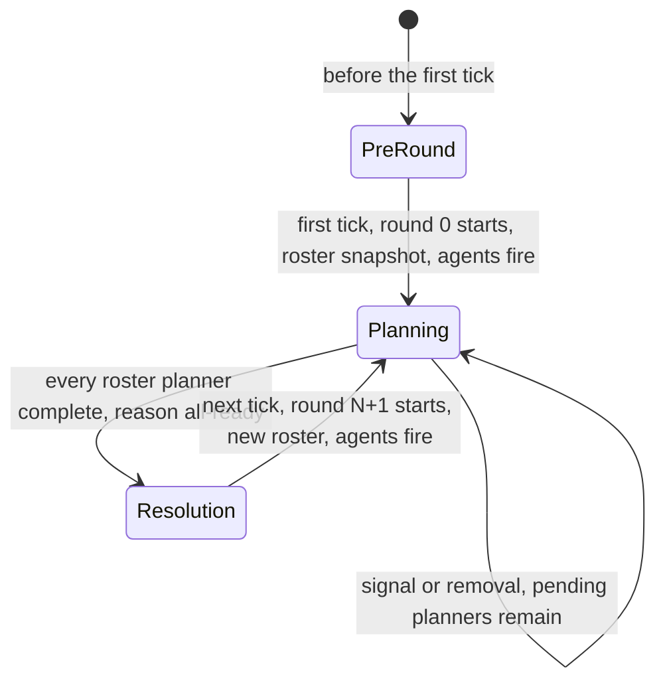

# Two-Phase Barrier Turn System — Implementation Design (Spec v2: Event-Driven Rounds)

**Status:** implementation spec v2 (design only — no code changes in this document; a downstream Code task implements from it). Supersedes the v1 deadline-based design (the previous revision of this same file).
**Parent task:** the system WAITS until ALL entities have planned their actions, and only then executes them — and it waits **as long as it takes**: planning is unlimited, there is no deadline of any kind, and the loop repeats.
**Supersedes in part:** [llm_turns_npc_spec.md](wiki/llm_turns_npc_spec.md) §1.1 / §5.1 / §5.4 / §5.6 / §5.7 / §5.8 / §5.9 — this document replaces every deadline-based statement in those sections (update plan in §12).

**Binding user decisions (v2 — do not revisit):**

1. **Ready button per player.** The round executes ONLY when ALL human players AND all NPCs are ready. NPCs auto-signal through the existing settlement hook — that mechanism is kept.
2. **Wait forever.** No deadline of any kind. An AFK or disconnected player delays the round indefinitely — that is the design, not a failure mode.
3. **⚡ Immediate mode stays** as an optional escape hatch; the `/move-entity` and `/pick-up-item` bypass rulings are unchanged.

**Summary in one line:** planning has no end time — a round closes the moment every roster planner has signaled plan-complete (a removal counts as vacuously complete), resolves in the same call, and the next round starts on the next tick; the turn system no longer owns any tick geometry.

---

## 1. Core semantics (non-negotiable)

### 1.1 The rule

Resolution of round R may start ONLY when every planner of round R's roster is complete, where a roster entity is **complete** when it has signaled plan-complete for round R, or when it no longer exists (vacuous). There is no second trigger.

Why nothing replaces the removed deadline: the deadline existed to bound a planner that never signals. With the settlement hook, every NPC settles on **every** outcome (resolve or reject — §1.4 i), so the only planner that can never signal is a human who never clicks ready; and the product decision for that case is to wait, not to execute over their head. The two v1 paths that merely logged instead of signaling (a synchronous agent throw, an empty agent slot — see §7) are redefined in v2 as immediate/vacuous settlements precisely because a deadline no longer catches them. The tick liveness sweep (§3) keeps the one remaining non-human hang — a roster whose entities were all removed — from lasting forever.

### 1.2 Round lifecycle (event-driven, no tick geometry)

A round is a **rendezvous, not a time span**. Nothing derives a round from the tick clock; the round number is stored state, incremented when a round starts.

- **Round 0 starts lazily on the first tick** — the first [onTick()](src/controllers/core/TurnSystemController.js:223) after the tick system has started, while no round has started yet. Why not at construction/`initialize()`: the roster is a snapshot of the live entities (§1.3), and every boot path — production and all test harnesses — builds the world and its entities before the first tick, with harnesses additionally spawning their test droid *after* construction. A construction-time snapshot would miss that droid and demote it to a non-gating late joiner; the first-tick snapshot is the earliest moment at which the intended roster is guaranteed to exist in every boot path.
- **The next round starts on the tick AFTER the tick on which the previous resolution completed.** Why not synchronously at the end of resolution: the `resolution` phase stays observable for at least one tick, so a queue or ready call in flight during the close still gets a response describing the round that just closed, and `PLANNING_CLOSED` (§6) has a real, testable window; clients also receive the close transition and the post-resolution full state before the next planning transition, which keeps the HUD lifecycle clean. The one-tick (≈33 ms at 30 tps) delay is imperceptible.
- **A round start** performs, in order: snapshot the roster (§1.3), reset the barrier (§1.5), recompute the initiative actor order, flip the stored phase to `planning`, fire the agents (§4), and emit the `turn-round-update` transition (clients re-arm their ready button).

### 1.3 Planner roster (unchanged from v1)

- The roster is a **snapshot of every entity present at round start** (the same entity read the actor-order computation already performs).
- Why a snapshot instead of a live set: the turn system does not subscribe to spawn/despawn events and must not (it reads entities through the facade only). A snapshot keeps the waiting set stable, serializable, and cheap to persist. The two dynamic cases are handled at evaluation time, without any subscription: **removal during planning** → vacuously complete; **spawn during planning** → not in the roster, never gates the round (§1.4 v).
- **Every** roster entity is a planner. The two planner classes are split by the persisted NPC marker (`isNPC === true`, set at spawn by the world composition — the exact predicate v1's agent firing already uses): roster entities marked as NPCs are agent-planned (§1.4 i–ii); the rest are ready-button planners (§1.4 iii).

### 1.4 Who signals, per planner class

| # | Planner class | Who signals | When | Outcome coverage |
|---|---|---|---|---|
| i | Agent-driven NPC (deterministic brain or LLM agent) | The turn system itself, via the settlement hook | The agent fires at ROUND START; the signal lands when its promise settles — resolve OR reject | Every outcome counts: acted, idle, discard, guard-skip, or throw. A **synchronous `agentFn` throw is treated as an immediate "did nothing" settlement** (warn log + the signal) — mandatory in v2, because with no deadline a thrown agent would otherwise hang the round forever (v1 only warned) |
| ii | Roster NPC while the agent slot is empty (no `setNpcAgent` call yet) | The turn system itself, automatically at round start | Round start, synchronously | Each such NPC is auto-signaled as a **vacuous plan** (one info log each) so a boot/test world without a wired agent can never hang a round. Production always wires the agent in [server.js](src/server.js:72), so the rule is inert there; the harnesses that don't wire it are exactly the ones that need it (v1 only logged in this case, which would hang in v2) |
| iii | Human player (roster entity without the NPC marker) | The player's client, explicitly | Ready/lock-in click → `POST /turns/ready/:entityId` → [signalPlanComplete()](src/controllers/core/TurnSystemController.js:431) with source `'player'` | **Default before signaling: NOT complete** — the round waits for this player indefinitely (binding decision 2). An empty plan is a valid plan: a player may ready with zero queued actions |
| iv | Entity removed during planning | Nobody — vacuously complete | The all-ready evaluation (§3) sees a roster entity whose facade lookup returns nothing; each removal is logged once per round at warn level | Removal never blocks the round |
| v | Entity spawned mid-planning-round | Nobody — excluded from the roster | The roster is a round-start snapshot | The new entity can still queue actions until close, and the existing late-joiner reconciliation at resolution still executes them; it never extends the wait. Rationale unchanged from v1: making a late arrival signal would require a spawn subscription the turn system deliberately does not have, and adds delay with no plan quality |

### 1.5 Barrier state shape (unchanged from v1)

| Field | Type | Meaning |
|---|---|---|
| `_phase` | `'planning' \| 'resolution' \| null` | **Stored** phase. `null` before the first round start (public consumers see `'planning'` via the mapping in §2.1). |
| `_barrierRoster` | set of entity IDs | Entities present at round start. |
| `_barrierSignaled` | set of entity IDs | Roster entities that signaled plan-complete this round. This set is also the record of which NPC agents have fired-and-settled — v1's separate "agent fired" flag is dropped (§4). |
| `_barrierClosed` | `boolean` | Planning has closed. |
| `_barrierClosedAtTick` | `number \| null` | Global tick at which planning closed (plain timestamp, no geometry role). |
| `_barrierCloseReason` | `'all-ready' \| 'deadline' \| null` | In v2 only `'all-ready'` is ever produced; `'deadline'` remains accepted on restore for v1-era saves (§8), display-only. |

All fields reset at round start; all are persisted (§8).

### 1.6 Signal design (state, method, idempotency)

- **Single public method:** [signalPlanComplete()](src/controllers/core/TurnSystemController.js:431) on the turn controller (contract in §2.4), unchanged from v1. There is exactly one barrier owner (Single Source of Truth): the turn system.
- **Why the turn system signals for NPCs (not the planners):** unchanged from v1 — the agent hook is fired fire-and-forget by the turn system (now at round start, §4), the turn system already owns the promise it fires, and attaching a settlement handler there means neither [NpcAIController](src/controllers/ai/NpcAIController.js) nor [LLMAgentController](src/controllers/networking/LLMAgentController.js) changes at all, and the signal fires on **every** outcome by construction.
- **Round-keyed guard:** the settlement handler captures the round number at fire time. If the promise settles after that round has already been resolved (v2's cross-round case: the round closed early on all-ready while an LLM call is still in flight), the signal is ignored with a log — it must not pollute a later round's barrier.
- **Idempotency:** unchanged — signaling an already-signaled entity is a safe no-op returning success with an `alreadySignaled` flag; it changes no state and can never trigger a second close (the `_resolvedRound` guard).
- **Close evaluation:** after any signal (synchronously, inside the request handler) and on every tick while planning (§3), the roster is evaluated with the O(1) facade entity lookup (never a full state clone). All complete → close planning (reason `all-ready`) → resolve in the same call — the "wait, then execute" latency is milliseconds after the last signal.
- **Empty roster / all removed:** vacuously complete → the round closes on the next tick as a no-op resolution; an empty or fully depopulated world can never hang.

---

## 2. State machine & public contract

### 2.1 Phase-model decision (unchanged from v1)

The public phase vocabulary stays exactly `{ planning, resolution }`; the phase is **stored** state (it can no longer be derived from a tick clock — the clock no longer says anything about rounds); the barrier rides as an **additive** sub-state. The v1 rationale stands unchanged: every existing consumer ([`shouldQueueForRound()`](public/js/TurnController.js:86) on the client, the NPC dispatchers on the server) gates on `phase === 'planning'`, so a third public value would silently discard NPC plans, and `planning` already means "queues are accepted". Before the first round start, the stored phase is `null` and public reads map it to `planning`; queue/signal calls before the first round are rejected (`TURNS_DISABLED` gate order unchanged — the round simply hasn't started yet).

### 2.2 Live state machine

Resolution always completes synchronously within the call that closed planning (same as v1). A `turn-round-update` transition event is emitted on every round start and on every close.

### 2.3 Payload shapes — what v2 removes

`getRoundState()` / `getAll()` (i.e. `state.turns` in every full state) carries **exactly** these keys: `actorOrder`, `barrier`, `currentTick`, `phase`, `queues`, `roundNumber`. `planningDeadlineTick` is **removed** — it was derived from the removed round geometry, and there is no deadline left to display. `roundNumber` becomes stored state instead of tick-derived. `currentTick` stays: it is the reference point of `barrier.closedAtTick` and costs nothing.

The `turn-round-update` socket payload carries the same fields minus `queues`: `roundNumber`, `phase`, `currentTick`, `actorOrder`, `barrier` (`planningDeadlineTick` removed; queues continue to ride the full state only, unchanged).

**The planning-phase full-state broadcast is KEPT but re-gated:** while the stored phase is `planning`, a full-state broadcast is emitted at most once per tick, and ONLY when the barrier view (closed flag, ready count, pending-ID set) changed since the last broadcast. Why keep any broadcast at all: ready signals are point-to-point REST responses — a client that clicked nothing itself learns that "one fewer planner is pending" only through a full-state broadcast, and with no periodic channel the multi-client status line (§2.4) would go stale. Why dirty-gated: with unlimited planning a quiet phase can last minutes, and v1's unconditional 10-tick broadcast would become three full states per second, forever, for zero change; the dirty gate costs nothing in an idle phase and makes any signal visible to every client within one tick (≈33 ms). The broadcast-interval config key is dropped (dirty evaluation already bounds it to one broadcast per tick).

### 2.4 Public API contracts (server)

Error-code convention (project rule): rule-level failure = HTTP 200 with `{ success: false, code, error }`; malformed ID = 400; no tick system = 503 / `TURNS_DISABLED`.

**[TurnSystemController](src/controllers/core/TurnSystemController.js)**

| Method | v2 change | Returns | Error codes |
|---|---|---|---|
| [signalPlanComplete](src/controllers/core/TurnSystemController.js:431) | **unchanged** | unchanged | unchanged: `TURNS_DISABLED` · `ENTITY_NOT_FOUND` · `OUT_OF_ROUND` |
| [getRoundState](src/controllers/core/TurnSystemController.js:252) | field removed | §2.3 key set (`planningDeadlineTick` gone) | — |
| [queueAction](src/controllers/core/TurnSystemController.js:317) | unchanged (the gate reads the stored phase, as in v1) | unchanged | `PLANNING_CLOSED` now has a real window: from the close tick until the next round starts on the next tick (§6). All other codes unchanged (`ENTITY_NOT_FOUND`, `ACTION_NOT_FOUND`, `TURNS_DISABLED`, `QUEUE_FULL`) |
| [serialize](src/controllers/core/TurnSystemController.js:465) | **unchanged** (`planningDeadlineTick` was never persisted) | unchanged (v3, §8) | — |
| [restore](src/controllers/core/TurnSystemController.js:492) | semantics changed | void | — | the force-close-past-deadline block is removed; a mid-planning restore re-fires agents for un-signaled roster NPCs (§4); the actor-order recompute guard's condition becomes "queued > 0 AND the snapshot's round matches the stored `lastRound` AND the stored phase is `planning`" (replacing the v1 local-tick < planning-ticks test) |

[turnRoutes](src/routes/turnRoutes.js:29) — all four routes are unchanged, including the ready route (`POST /turns/ready/:entityId` → `signalPlanComplete(entityId, 'player')`, with the same 400/503/200-rule-code conventions).

**[WorldStateController](src/controllers/WorldStateController.js:225)** — **no new public method, no wiring change.** The ready route reaches the turn controller through the existing public composition, and the persistence version constant does not change (§8).

**[NpcAIController](src/controllers/ai/NpcAIController.js) / [LLMAgentController](src/controllers/networking/LLMAgentController.js)** — **no signature changes, no behavior changes.** They keep queuing while `phase === 'planning'` and discarding after close; the close can simply happen much later now, and the round they planned for is exactly the round the hook fired them for.

**Client — [TurnController](public/js/TurnController.js)**

| Member | v2 change | Notes |
|---|---|---|
| Progress bar markup + fill ([_buildHtml](public/js/TurnController.js:130)) and the 360-tick progress math in [_render](public/js/TurnController.js:284) | **removed** | It visualized the countdown; there is no countdown |
| Barrier status line ([_renderBarrier](public/js/TurnController.js:208)) | changed | While planning: ready count plus the **names of the pending planners** (resolved from `state.entities`). When closed: the close info (reason as plain text + `closedAtTick`). The deadline branch is removed; because the reason renders as text, a legacy `'deadline'` value from a v1-era save still displays sensibly |
| Ready/lock-in button | unchanged | Same states (Lock in / Locked in / Planning); the locked-in tooltip drops "(or the deadline hits)" → "waiting for the other planners" |
| [shouldQueueForRound](public/js/TurnController.js:86) | unchanged | Still `mode === 'turn'` and `phase === 'planning'` |
| `onTransition` JSDoc | doc-only | the payload loses `planningDeadlineTick` |

**Client — [turns.css](public/css/turns.css:54)** — remove the `.turn-hud-progress` and `.turn-hud-progress-fill` rules; everything else (ready button, mode toggle, queue list) is unchanged.

**Client — [App.js](public/js/App.js:57) / [Config.js](public/js/Config.js:59) / [ActionManager](public/js/ActionManager.js)** — **no changes**: the `onReady` wiring, the `TURNS_READY` endpoint, the socket handler, and the v1 queue fences all stand.

---

## 3. The tick job's remaining role (decision)

**Decision: keep exactly one TickJob** (the same 1-tick-period registration in [initialize()](src/controllers/core/TurnSystemController.js:194) as today) with **exactly three duties** and no round geometry:

1. **Start round 0** when no round has started yet (the lazy first tick, §1.2).
2. **Start the next round** when the stored phase is `resolution` and the current round is resolved (§1.2).
3. **While planning:** evaluate the roster (the liveness sweep for vacuous completion + the all-ready close check, §1.6) and emit the barrier-dirty broadcast (§2.3).

Why keep it at all: without a per-tick hook, nothing would start round 0 or the next round in an idle world (no other event exists), and a roster whose entities were all removed would never close — the turn system deliberately does not subscribe to despawn, so only a periodic liveness sweep can detect that (v1's deadline was the only other catch, and it is gone). Why it must not do more: every other v1 duty (deriving the round from the tick via [_deriveRound](src/controllers/core/TurnSystemController.js:1164), the deadline check in [_evaluateBarrierClose](src/controllers/core/TurnSystemController.js:966), the local-tick-20 agent fire in [_npcAgentPhase](src/controllers/core/TurnSystemController.js:586), the unconditional periodic broadcast in [_maybeBroadcastPlanningTick](src/controllers/core/TurnSystemController.js:939)) existed to implement the tick geometry the user rejected; keeping any of them would reintroduce the geometry.

---

## 4. NPC planning timing (decision)

- **The agent fires at ROUND START** — inside the round-start routine, immediately after the roster snapshot — replacing the local-tick-20 trigger. Rationale: the agent is the slowest planner (an LLM call takes seconds), so starting its plan at the moment the round opens maximizes the chance the plan is ready while the human is still clicking; waiting 20 ticks (≈670 ms) buys nothing now that planning is unlimited. Round 0's agents therefore fire on the first tick, and a harness that steps its first tick and then asserts sees the agents already in flight.
- **Fire-and-forget + settlement hook unchanged** ([_signalAgentSettled](src/controllers/core/TurnSystemController.js:1085)): settle (resolve OR reject) → `signalPlanComplete(npcId, 'npc-agent')`; errors are logged, never thrown; the round-key guard (§1.6) drops late cross-round settlements. The NPC predicate is the same `isNPC === true` filter over the same entity read v1 already performs — no new import or dependency.
- **Synchronous throw → immediate "did nothing" settlement** (warn log + signal). This is a correctness requirement, not a preference: with no deadline, a thrown agent would otherwise leave its planner un-signaled forever.
- **Empty agent slot:** roster NPCs auto-signal at round start, synchronously, as vacuous plans (§1.4 ii) — same correctness requirement.
- **Restore re-fire:** a mid-planning restore loses any in-flight agent promise with the process, and an un-signaled roster NPC would otherwise wait forever (there is no deadline to catch it). So restore re-fires the agent for **every roster NPC that still exists and is not in the restored signaled set** — the signaled set is the record of who has fired-and-settled, which is why v1's separate "agent fired this round" flag is dropped. A restore with stored phase `resolution` re-fires nothing (the window is closed; a late queue call is discarded exactly as today).
- **Never-settling agent promise → observability only (no watchdog deadline).** With the deadline gone, a fire-and-forget agent promise that never settles is the sole remaining hang vector, and the only sanctioned reaction to it is a log line: once per round per entity, when an un-signaled roster NPC has stayed unsettled past a named observability threshold, an error names the entity, the round, and the ticks unsettled. It deliberately never signals, closes, or time-bounds the round — any of those would be a deadline in disguise, and the binding decision is that no deadline of any kind exists. In production the log is pure observability: the LLM agent settles every call through its per-call timeout budget, so without it a hung promise would hang a round silently and forever.

---

## 5. Bypass-path decision (unchanged from v1)

Out-of-band paths that reach the action pipeline without the queue gate:

| Path | Location | Ruling | Rationale |
|---|---|---|---|
| ⚡ Immediate targeting mode | [TurnController](public/js/TurnController.js:86) client toggle | **Keep** | Binding decision 3: an explicit, user-visible escape hatch (the player chooses legacy immediate execution) |
| `POST /move-entity` | [worldRoutes](src/routes/worldRoutes.js:170) | **Keep** | Spatial movement (door traversal) is an out-of-turn position adjustment, not a planned combat action; queueing it would break the movement flow and world-map UX |
| `POST /pick-up-item` | [worldRoutes](src/routes/worldRoutes.js:132) | **Keep** | The pick-up overlay expects an immediate result to dismiss itself; queueing would break the pickup UX with no turn-system benefit |
| Drop-item raw fetch | [`executeDropItem()`](public/js/ActionManager.js:283) | **Fence (as in v1)** | In Turn mode a drop must enqueue like every other action; the fence stays |
| Multi-component / synergy raw fetch | [`executeWithComponents()`](public/js/ActionManager.js:452) | **Fence (as in v1)** | Same defect, same fence |

Fencing means both raw fetches send the queue flag exactly when the shared gate says so — the same predicate the main request path already uses. In ⚡ Immediate mode the flag stays absent and these paths behave exactly as today. The queued response is already handled by the shared response shape.

---

## 6. Execution phase (invariant)

Resolution itself is **unchanged** — v2 only changes *when* resolution may start:

- **Initiative order:** actors with ≥1 queued entry ordered by initiative (descending), ties by ascending entity ID; same deterministic computation, same late-joiner reconciliation (queue owners missing from the cached order are appended with on-the-fly initiative and re-sorted).
- **Synchronous full-pipeline replay:** each queued entry replays FIFO through the real action pipeline via the facade — the turn system still owns timing and ordering only, never validation or consequences.
- **Late validation:** entries whose range closed, requirement unmet, or target vanished by resolution time are discarded with a log/event line; one bad entry never aborts the round; the double try/catch guard remains.
- **Per-entry log lines and event-log capture:** unchanged (success and failure lines, feedback-store capture for NPC agents).
- **Queue clearing and post-resolution broadcast:** unchanged.
- **`PLANNING_CLOSED` window:** the close (all-ready only, via one shared routine: store close info → flip stored phase → transition broadcast → resolution, in that order, in the same call) rejects `queueAction` with `PLANNING_CLOSED` **from the close tick until the next round starts on the next tick** — a real, observable window (v1's window could also end at the deadline tick; v2's ends at the round rollover). From the next tick, planning is open again as a new round. Late NPC responses settling after close hit the existing "window closed → discard" path in both dispatchers.
- **`QUEUE_FULL`:** unchanged (per-entity cap of 3 per round, [TURN_MAX_QUEUED_PER_ROUND](src/utils/Constants.js:122)).
- **The `_resolvedRound` guard:** unchanged — resolution runs at most once per round regardless of how the close was triggered.
- **Late-spawned entities that queued before the close still act:** they are not in the barrier roster, but the resolution reconciliation already appends any queue owner missing from the cached order.

**Invariants that carry over from v1 untouched (no re-derivation needed downstream):** the barrier/roster/settlement mechanics of §1.3–§1.6; `signalPlanComplete` + the ready route; queue semantics + `QUEUE_FULL`; defensive copies at every public boundary; the centralized Logger; DI / public-API-only access (this change adds no new dependency — the NPC marker read uses the existing facade entity read, and the restore re-fire reuses the injected `agentFn`).

---

## 7. What v2 removes (explicit list)

| What | Where | Why it goes away |
|---|---|---|
| Deadline close path (local tick ≥ planning ticks → close with reason `deadline`) | [_evaluateBarrierClose](src/controllers/core/TurnSystemController.js:966) | Binding decision 2: no deadline of any kind |
| `planningDeadlineTick` in `getRoundState()` / `state.turns` | [getRoundState](src/controllers/core/TurnSystemController.js:252) | Derived from the removed geometry; nothing left to display |
| `planningDeadlineTick` in the `turn-round-update` payload | [_broadcastTurnUpdate](src/controllers/core/TurnSystemController.js:1125), [WorldStateBroadcastService](src/services/WorldStateBroadcastService.js) JSDoc, client JSDoc | Same |
| [TURN_ROUND_TICKS](src/utils/Constants.js:100), [TURN_PLANNING_TICKS](src/utils/Constants.js:110), [TURN_NPC_AGENT_TICK](src/utils/Constants.js:116) | [Constants.js](src/utils/Constants.js:100) | The round geometry they define no longer exists (grep-verified: referenced only by the turn controller, the constants file, and this spec) |
| Controller config keys `roundTicks` / `planningTicks` / `npcAgentTick` / `planningBroadcastInterval` | [DEFAULT_CONFIG](src/controllers/core/TurnSystemController.js:71) | Same; the last one per the dirty gating of §2.3 |
| Tick → round derivation | [_deriveRound](src/controllers/core/TurnSystemController.js:1164) | Rounds are stored state (§1.2) |
| Local-tick-20 agent fire | [_npcAgentPhase](src/controllers/core/TurnSystemController.js:586) | Agents fire at round start (§4) |
| Restore force-close-past-deadline block | [restore](src/controllers/core/TurnSystemController.js:492) | There is no deadline to land past |
| The "agent fired this round" flag | controller internals | The signaled set is the record; restore re-fires per §4 |
| Unconditional 10-tick planning broadcast | [_maybeBroadcastPlanningTick](src/controllers/core/TurnSystemController.js:939) | Replaced by the barrier-dirty broadcast (§2.3) |
| Client progress bar (markup, CSS, 360-tick math) | [TurnController](public/js/TurnController.js:130), [turns.css](public/css/turns.css:54) | It visualized the countdown; there is no countdown |
| "⏰ Deadline" status branch + deadline tooltip wording | [_renderBarrier](public/js/TurnController.js:208) | Same |
| "Deterministic round cadence / round geometry" banner comment | [Constants.js](src/utils/Constants.js:84) | Stale — rewritten to state that rounds are event-driven and the only remaining constant is the per-entity queue cap |

**Explicitly kept:** [TURN_MAX_QUEUED_PER_ROUND](src/utils/Constants.js:122) (queue cap, orthogonal to timing); [MAX_TICKS_PER_SECOND](src/utils/Constants.js:133) (the world clock, not a turn constant); the barrier shape and its persistence; the ready route; the settlement hook; ⚡ Immediate mode and the §5 bypass rulings; [DEFAULT_TURNS_SNAPSHOT](src/controllers/core/TurnSystemController.js:87) (shape unchanged, §8).

---

## 8. Persistence (decision: schema STAYS v3)

v1 already bumped the schema for the barrier section; v2 changes **no persisted shape**: `planningDeadlineTick` was never persisted, the barrier fields are unchanged, and [DEFAULT_TURNS_SNAPSHOT](src/controllers/core/TurnSystemController.js:87) keeps its exact shape (`roundNumber` 0, `phase` `planning`, empty queues, `resolvedRound` -1, `lastRound` -1, empty barrier). [WorldStateController](src/controllers/WorldStateController.js:738) and the serialize/restore wiring are untouched.

**Restore semantics (v2):**

- **Mid-planning restore** (stored phase `planning`, snapshot's round matches the stored `lastRound`): rebuild the roster/signaled sets from the snapshot; the barrier **resumes** — the remaining signals still close the round; **re-fire the agent for every roster NPC that exists and is not in the signaled set** (§4); the actor-order recompute guard keeps working under its v2 condition (§2.4).
- **Restore at/after close** (stored phase `resolution`, or `resolvedRound` equals the current round): resolution never re-runs (existing guard); the queue is empty as today; the barrier is restored as closed for display.
- **Malformed/absent barrier section** inside an otherwise valid v3 snapshot: warn + defaults (empty roster, not closed) — unchanged graceful degradation.
- **`closeReason` on restore:** the validator accepts `all-ready` and the legacy `deadline` — a v1-era v3 save may carry `deadline`; it is display-only in v2 and is never produced.

---

## 9. Constants (decision)

| Name | Decision | Rationale |
|---|---|---|
| [TURN_ROUND_TICKS](src/utils/Constants.js:100) | **removed** | Rounds are no longer tick spans |
| [TURN_PLANNING_TICKS](src/utils/Constants.js:110) | **removed** | No planning-window length, no deadline |
| [TURN_NPC_AGENT_TICK](src/utils/Constants.js:116) | **removed** | The agent fires at round start, not on a fixed tick |
| [TURN_MAX_QUEUED_PER_ROUND](src/utils/Constants.js:122) | **kept** | The queue cap is orthogonal to timing |
| [MAX_TICKS_PER_SECOND](src/utils/Constants.js:133) | **kept** | World clock — not a turn constant |

The turn-system section banner comment is rewritten accordingly (comment-only change). No new constants are introduced.

---

## 10. Per-file change list

### Server

| File | Change (one line) |
|---|---|
| [TurnSystemController.js](src/controllers/core/TurnSystemController.js) | Main rework: lazy round 0 on the first tick; next round on the tick after resolution; agents fire at round start (empty-slot auto-signal + sync-throw settlement); remove the deadline path, tick → round derivation, agent tick, and restore force-close block; restore re-fire + stored-phase actor-order guard; drop `planningDeadlineTick` from `getRoundState()` and the transition payload; planning broadcast dirty-gated; tick job reduced to the three duties of §3 |
| [Constants.js](src/utils/Constants.js:100) | Remove the three turn-geometry constants + rewrite the section banner; keep [TURN_MAX_QUEUED_PER_ROUND](src/utils/Constants.js:122) |
| [WorldStateBroadcastService.js](src/services/WorldStateBroadcastService.js) | JSDoc only: drop `planningDeadlineTick` from the documented `turn-round-update` payload |
| [turnRoutes.js](src/routes/turnRoutes.js:29) | No change (ready route stands) |
| [WorldStateController.js](src/controllers/WorldStateController.js:225) | No change (schema stays v3; serialize/restore wiring unchanged) |
| [server.js](src/server.js:72) | No change (agent-hook contract and wiring unchanged) |
| [WorldComposition.js](src/composition/WorldComposition.js:214) | No change (no new dependency to wire) |
| [NpcAIController.js](src/controllers/ai/NpcAIController.js) / [LLMAgentController.js](src/controllers/networking/LLMAgentController.js) | No change |
| `data/*` | No change |

### Client

| File | Change (one line) |
|---|---|
| [TurnController.js](public/js/TurnController.js:130) | Remove the progress bar (markup + math); barrier status line becomes ready count + pending planner names + close info (deadline branch removed, locked-in tooltip reworded); `onTransition` JSDoc drops `planningDeadlineTick` |
| [turns.css](public/css/turns.css:54) | Remove the `.turn-hud-progress` and `.turn-hud-progress-fill` rules |
| [App.js](public/js/App.js:57) | No change (ready wiring + socket handler stand) |
| [Config.js](public/js/Config.js:59) | No change (`TURNS_READY` already exists) |
| [ActionManager.js](public/js/ActionManager.js) | No change (v1 queue fences stand) |

### Must NOT be touched (beyond the above)

| File | Why |
|---|---|
| [NpcAIController.js](src/controllers/ai/NpcAIController.js) / [LLMAgentController.js](src/controllers/networking/LLMAgentController.js) | The settlement hook + window-close discard already cover v2; the firing-point change is entirely inside the turn system |
| [server.js](src/server.js:72) | The `agentFn → Promise` contract is unchanged |
| [UniversalTickSystem](src/utils/UniversalTickSystem.js) | The tick system is the generic world clock; the change is which job runs on it, not how it ticks |
| [stateEntityController.js](src/controllers/core/stateEntityController.js) | `getEntity()` already provides the O(1) liveness lookup the sweep uses |
| [actionRoutes.js](src/routes/actionRoutes.js) / [worldRoutes.js](src/routes/worldRoutes.js) | The queue gate and the §5 bypass rulings leave these as-is |
| `data/*` | No data-model change |

---

## 11. Test rework plan

**New driving pattern (replaces tick-geometry driving):** start a round with a first `onTick()`; drive NPC plans either by the empty-agent-slot auto-signal (synchronous — the suites don't wire an agent by default, so the data-driven NPC auto-signals at round start and no microtask flush is needed) or by a stub agent via `setNpcAgent` with a controllable promise plus the existing `flush()` helper for the settlement-timing tests; close a round with `signalPlanComplete(entityId, 'player')`; advance a round with an `onTick()`. The `stepTo()` helper is kept as-is (set the tick, call `onTick()`) — it merely stops steering round geometry.

### [TurnSystem.contract.test.js](test/contract/TurnSystem.contract.test.js) (9 tests)

| Test | v2 status | What it asserts now |
|---|---|---|
| T1 first-tick state | **rewritten** | After the first `onTick()`: round 0 planning; roster = test droid + data NPC; the data NPC is already signaled (empty-slot auto-signal is synchronous); `state.turns` keys are exactly the v2 set — `planningDeadlineTick` absent |
| T2 QUEUE_FULL | **kept** | The cap is orthogonal to timing (round 0 starts on the first `onTick()`, as today) |
| T3 resolution | **rewritten** | Close via the droid's signal (NPC already auto-signaled) → close + resolution in the same call; keep the selfHeal +10 / turn-log / queue-cleared assertions; add `closeReason` `all-ready` |
| T4 out-of-range punch discarded | **rewritten** | Signal-driven close instead of step-to-deadline; resolution assertions unchanged |
| T5 PLANNING_CLOSED | **rewritten + extended** | After close → `PLANNING_CLOSED`; one more `onTick()` → round 1 planning → the same `queueAction` succeeds again (the window re-opens with the next round) |
| T6 transition payloads | **rewritten** | Two transitions (close, next-round start); payload keys are exactly `roundNumber`, `phase`, `currentTick`, `actorOrder`, `barrier` |
| T7 `state.turns` shape | **rewritten** | Exact key list minus `planningDeadlineTick` |
| T8 serialize/restore round-trip | **rewritten** | Mid-planning (after round start, pending queue) → serialize → restore on a fresh instance → queue + barrier intact; a post-restore signal closes and resolves |
| T9 TURNS_DISABLED | **kept** | Gate order unchanged |

### [turnBarrier.contract.test.js](test/contract/turnBarrier.contract.test.js) (18 tests)

| Test | v2 status | What it asserts now |
|---|---|---|
| T1 early all-ready close (solo) | **kept + extended** | Mandated (a): after the close, one more `onTick()` → round 1: planning, fresh roster snapshot, barrier reset, ready button re-armed |
| T2 deadline close | **rewritten into two tests** | Mandated (b): default world, droid never signals — step many ticks (0–500) → phase stays `planning`, no resolution, barrier still lists the droid as pending; mandated (c): the droid then signals → close + resolution in the same call |
| T3 idempotent signaling | **kept** | One close, one resolution |
| T4 OUT_OF_ROUND | **kept** | A mid-round spawn never gates and cannot signal |
| T5 removal vacuous | **kept** | Part of mandated (i) |
| T6 NPC settlement success | **rewritten** | Mandated (d): the agent fires at round start (first `onTick()` — no step-to-20); stub resolves on `flush()`; NPC signaled; close on the player's signal; the agent is called exactly once, for round 0 |
| T7 NPC settlement rejection | **rewritten** | Same driving with a rejecting stub — still signaled; the round never hangs on an agent failure |
| T8 ready route handler-level 200/400 | **kept** | — |
| T9 TURNS_DISABLED signal | **kept** | Mandated (g) |
| T10 persistence round-trip with barrier | **kept** | Mandated (h): mid-planning partial signals + queue round-trips; a post-restore signal closes; a post-resolution restore never re-resolves. Note: a restored un-signaled roster NPC re-fires the stub agent (assert the stub call count where the roster has one) |
| T11 PLANNING_CLOSED after close | **kept + extended** | Mandated (f): the rejection window lasts until the next tick; on the next `onTick()` planning re-opens and the queue is accepted |
| T12 mid-planning spawn policy | **kept** | Part of mandated (i): a late joiner never gates; a pre-close queue still acts via the reconciliation |
| T13 restore past-deadline force-close | **deleted** | No deadline exists; mid-planning restore is covered by T10 |
| T14 late cross-round settlement | **rewritten** | Round 0's agent promise is pending; the droid is removed (vacuous) → the round closes all-ready; the next `onTick()` starts round 1; the round-0 promise settles now → the round-key guard drops it (no signal in round 1's barrier) |
| T15 restore barrier `{}` | **kept** | Warn + defaults |
| T16 restore barrier absent | **kept** | Warn + defaults |
| T17 fully-removed roster → vacuous close | **kept** | Part of mandated (i); validates the tick liveness sweep (§3) |
| T18 ready route 503 | **kept** | — |

Mandated (e) — the `QUEUE_FULL` cap — is TurnSystem T2 (kept). Every mandated item (a)–(i) maps to a test above.

### [persistence.contract.test.js](test/contract/persistence.contract.test.js) (6 tests)

**All kept, unchanged** — the schema stays v3 and no persisted shape changed.

### [worldStateController.contract.test.js](test/contract/worldStateController.contract.test.js)

One-line change: the exact `state.turns` key assertion drops `planningDeadlineTick` → the keys are `actorOrder`, `barrier`, `currentTick`, `phase`, `queues`, `roundNumber`. Public-method snapshots unchanged (v2 adds no public method).

---

## 12. Wiki & map update plan

"why"-level updates only per [project_rules](wiki/project_rules.md:100) §8 — no code, no endpoint tables.

| File | What changes (why) |
|---|---|
| [map.md](wiki/map.md:105) | The TurnSystemController annotation: the barrier gates resolution on every roster planner being ready (the deadline clause is removed); rounds are event-driven — roster snapshot at start, next round on the next tick after resolution |
| [llm_turns_npc_spec.md](wiki/llm_turns_npc_spec.md:116) | §1.1 records the v2 binding semantics (unlimited planning, per-player ready gate, no deadline, ⚡ Immediate stays); §5.1 a round is no longer a fixed tick span — the agent fires at round start, the deadline backstop is gone, and the phase is stored because close is event-driven, not tick-derived; §5.4 a "closed window" means barrier-closed until the next round (drop the "can precede the deadline tick" sentence); §5.6 the countdown HUD is gone — the dedicated transition event is still needed for the same-tick phase flip, and the planning-phase full-state broadcast is now barrier-change-gated; §5.7 the agent is invoked at round start, not partway through planning; §5.8 the schema stays v3 and a mid-planning restore re-fires un-signaled NPC agents (a lost in-flight promise would otherwise wait forever); §5.9 the HUD shows no countdown — ready count, who is still planning, and close info |
| [system_map.md](wiki/subMDs/architecture/system_map.md:47) | Responsibility matrix line: the turn system owns the all-ready close decision (no deadline) and no longer owns tick cadence |
| [action_system.md](wiki/subMDs/architecture/action_system.md:98) | §8: the planning window closes only on all-ready; the closed-window rejection lasts until the next round starts on the next tick |
| [communication.md](wiki/subMDs/networking/communication.md:28) | §4: the deadline sentence is replaced — a player who never signals delays the round indefinitely (by design); the ready endpoint and barrier section are unchanged; the planning-phase broadcast is now change-gated |
| [world_state.md](wiki/subMDs/data/world_state.md:35) | §7: the turns section loses the planning-deadline field; the phase is stored because close is event-driven; the schema stays v3 |
| [client_architecture.md](wiki/subMDs/frontend/client_architecture.md:25) | Turn Controller line: no countdown — the HUD shows round/phase, the barrier status (who is still planning), and close info |
| [npc_ai_controller.md](wiki/subMDs/controllers/npc_ai_controller.md:25) | Dispatch contract: "window closed" means barrier-closed (all ready), not a deadline tick; Public API: the agent hook is invoked at round start, not on a fixed tick |
| [client_action_execution.md](wiki/subMDs/frontend/client_action_execution.md:49) | No change (the fence rulings are unchanged) |
| [movement_system.md](wiki/subMDs/systems/movement_system.md) / [item_drop_pickup.md](wiki/subMDs/systems/item_drop_pickup.md) | No change (the out-of-turn paths are unchanged) |

---

## 13. Risks & open questions (v2)

1. **Waiting forever is a feature, not a risk** — an AFK/disconnected player delays the round indefinitely (binding decision 2). The HUD makes the wait visible (who is still planning). No auto-ready and no deadline, by mandate.
2. **Restore loses in-flight agent plans** — the re-fire (§4) re-plans the un-signaled NPCs; if a crash lands between an agent's queue and its settlement (an LLM mid-loop), the re-fire can duplicate a partially-queued plan — bounded by the per-entity queue cap (3); accepted.
3. **No authentication on the ready route** (inherited from v1) — any client can signal for any `entityId`, matching the existing trust model (queue cancellation is the same). Flagged for a future auth pass, not solved here.
4. **Ready is not revocable and does not freeze the queue** (inherited) — a player may still enqueue after signaling until close; the barrier state already carries everything needed for a future lock extension.
5. **Multi-client status-line freshness** depends on the dirty-gated broadcast — a signal becomes visible to the other clients within one tick (≈33 ms); never worse than v1, and an idle phase costs nothing.
6. **Stale doc comment** — the "60 ticks/s" wording on the removed `TURN_ROUND_TICKS` disappears with the constant; no separate fix needed.
