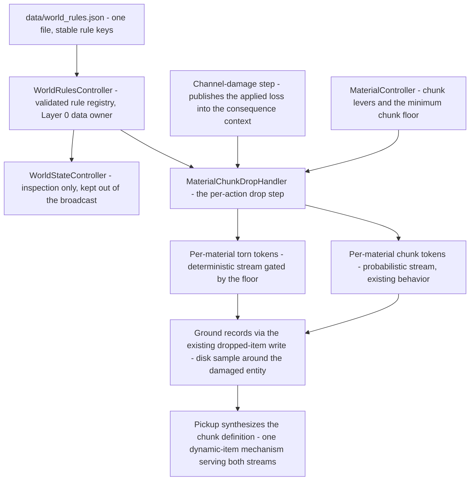

# 🌍 World Rules — a data-driven rule layer for world mechanics — Spec

> **Status:** agreed design for the new world-rules layer: one new data file, [`data/world_rules.json`](data/world_rules.json), and its first (and only shipped) rule, implemented as functional game behavior: **damage-time torn-material drops**. All **values** are data-driven and live in the file; this document carries the **why** of the design.
>
> **The layer is an optional overlay.** A missing or empty `data/world_rules.json` means *all rules off*, and the world behaves **bit-identically to today** — the existing per-material chunk-drop system, unchanged. That guarantee is the spine of the whole design (WR-5) and is the hard requirement this spec exists to satisfy.
>
> Prior art: the material damage/chunk-drop layer this rule builds on — [material_damage_and_drop_spec.md](material_damage_and_drop_spec.md) and [subMDs/data/material_damage_and_drop.md](subMDs/data/material_damage_and_drop.md). Mandatory house rules: [project_rules.md](project_rules.md) §2/§5/§6/§8, [controller_patterns.md](subMDs/controllers/controller_patterns.md).

---

## 1. Why a world-rules layer now

The project has accumulated one-off data files, each owning the levers of a single mechanic: [`data/materialDropRates.json`](data/materialDropRates.json), [`data/materialDamageTypes.json`](data/materialDamageTypes.json), [`data/holdingCost.json`](data/holdingCost.json). Each answered a specific feature. The owner now wants a different kind of file: a place for **world-level rules** — statements about how the world *as a whole* behaves, crossing system boundaries, tunable by editing data without touching code.

The first rule is material-themed, but the layer's contract is deliberately broader than that:

- **A rule is a stable string key with a small config.** A rule is lighter than a mechanic: a few levers, no per-entity state, a simple on/off. That shape fits one file with one validator, where a mechanic with a genuinely complex data structure (per-material tables, recipes) earns its own file and controller.
- **One file, one controller, many keys.** Sharing one file and one loader means one uniform degradation contract for the whole layer, and adding a rule is a data edit, not a new module. A future rule that grows a complex structure of its own can earn its own file then — the layer is a starting point, not a cage.
- **Rules are laws, not loot tables.** The shipped rule (WR-2) is *deterministic*: the world does the same thing every time the condition holds. That is what separates "a rule of the world" from "a balance table" and is the quality the file name promises.

Nothing in this layer is client-facing: no new socket events, no new stat vocabulary, no new item types, no changes to [`data/actions.json`](data/actions.json).

---

## 2. Model



Two drops, one physics: the chunk stream (existing, probabilistic, per-material levers) and the torn stream (new, deterministic, one global lever) both consume the *same* published applied loss published by the existing damage step, both mint tokens through the *same* dynamic chunk-item mechanism, and both land in the world with the *same* placement semantics.

---

## 3. Design decisions

### WR-1 — A rule is a stable string key in a single file, and unknown/malformed keys degrade safely

The file's top level is an object carrying an optional `_comment` (the file's human note; the validator skips `_`-prefixed keys, the same convention the material files use) and a **`rules` section: a map of stable string key → rule-config object**. The key is the contract: the code side knows which keys it can act on; the data side declares which rules are on and with which levers.

Two degradation rules follow, and both exist for the same reason:

- **Unknown key → ignored, with a warning.** The file must be *forward-compatible*: a newer server can ship a key the file already contains, an older file must never break a newer rule, and an experimental key typed by hand must never crash the world. A key the server does not recognize is simply not a rule this server version can enforce.
- **Malformed rule config (missing required field, non-numeric or out-of-range value, wrong type) → that rule off, with a warning; every other rule unaffected.**

**Why "off, never crash" — and why this layer diverges from the material files' boot-fail rule.** The material combat files ([`materialDamageTypes.json`](data/materialDamageTypes.json), [`materialDropRates.json`](data/materialDropRates.json)) fail boot when *structurally* malformed, because they sit at the core of combat: a silently half-applied split would corrupt damage outcomes, and for those files "off" is not a complete state (a missing damage file changes how damage routes). A world rule degrades by **disappearing, not half-firing**: its safe direction *is* a complete, consistent world state — the world as it ran before the layer existed. There is therefore no corrupted state to protect against, and throwing would turn a balance file into a crash vector for no benefit. The divergence is deliberate and documented here so the next reader does not "unify" the two contracts by mistake.

### WR-2 — The shipped rule, `damageTornMaterial`: X% of a hit's lost matter drops as torn material

**Trigger — a component of an entity taking damage through the existing damage pipeline.** Precisely: the channel-damage step (the single choke point the chunk spec established for `droid punch`, `cut`, `shootT1`) publishes its *applied loss* into the consequence context, and the per-action drop step — already declared in data and already running on those actions — is where the torn step executes. The torn step consumes **the same published number** the chunk step consumes; it never re-derives damage (one-way flow; the chunk spec's D5 rationale applies unchanged). It therefore fires on exactly the actions that declare the drop step, and a future action that declares that step inherits the rule for free — no per-action data is added for this rule.

**What "X% of the damage" means.** "Damage" is the **applied, clamped existence loss** — the matter that actually left the target — not the raw attack value: the same basis the chunk volume uses (an overkill punch tears off what the component had, not the theoretical number). For a hit with applied loss `L` against a recipe volume `V`, the matter that left the component is `L × V`; the torn share is `percent/100` of that. It is attributed to **each material of the damaged component's own composition by recipe fraction** — the identical weighting rule the chunk drop already uses to attribute lost matter to materials (one rule for "what a composition does"). The torn volume contract, in one line, mirroring the chunk spec's: `tornVolume_i = (percent/100) × appliedLoss × fraction_i × recipeVolume`, gated per WR-2 below. All inputs are data or world state; no constants in code.

**What it produces — torn-material items that REUSE the existing dynamic chunk-item mechanism, exactly.** The chunk spec made the item's *type self-describing* (`chunk_<material>`, material recoverable from the type string), its *definition synthesized at pickup* (no `inventoryItems.json` entry, no registry lookup), and its *ground record self-describing* (name, volume, position render with zero client changes). The torn token reuses all of it: same type family, same pickup synthesis sites, same ground-write path, same batched write. It does **not** get a parallel type, name, or pickup path — inventing one would duplicate exactly the mechanism the dynamic-item design exists to avoid (a second type family means a second synthesis site, a second pickup guard, a second client fallback). **Accepted consequence (flagged in §9):** a torn token is visually indistinguishable from a chunk token; origin is not part of the item contract, and making it so would cost a parallel mechanism the task forbids.

**Where drops land.** The same location semantics the chunk drop already uses: a disk sample around the **damaged entity's** position, in the damaged entity's room, owned by that entity, batched into the same single ground-write as the chunk tokens of the same hit.

**Deterministic, not probabilistic.** Unlike the chunk stream (a per-material probability roll), the torn stream always fires on any positive applied loss — subject only to the gate below. Same hit, same world, same tokens. That determinism is the semantic difference between "a law of the world" and "a loot table," and it is what makes the rule testable by formula rather than by roll bounds.

**Gate, not floor.** A torn token for a material is produced only when its torn volume **meets or exceeds the existing `minChunkVolume` floor** — the material balance layer's "minimum meaningful pickable token," read through `MaterialController`'s existing public reader, which returns 0 when the drop-rates file is absent (so a lone world-rules file is self-sufficient: any positive torn volume passes). A *floor* instead of a *gate* was rejected: on a micro-loss hit it would drop **more** matter than the declared X% of the damage (violating the rule's own wording), and a flood of sub-visible specks would result from micro-damage. The gate keeps the invariant *torn ≤ X% of the lost matter* absolute.

**Default `percent`: 10.** The chunk system already recovers up to 30–50% of each material's lost matter per hit (probability-gated). A deterministic 10% overlay is deliberately modest and sub-dominant: with the shipped balance, a punched iron component returns roughly 40% of its lost matter in total (30% chunk + 10% torn) — well under the matter-creation line — while giving designers one world-scale lever for the "the world is salvageable" feel. It is a proposal in the data file, tunable without code.

### WR-3 — Relationship to the per-material chunk-drop system: a separate additive stream

Three candidates were considered:

| Candidate | Verdict | Why |
|---|---|---|
| Global overlay/multiplier on the chunk volume or probability | **Rejected** | Makes the world layer a *second owner* of the chunk file's levers (two files moving the same number), changes the meaning of the chunk balance, and blurs two different semantics — deterministic vs probabilistic — under one scalar. |
| Replacement of the chunk system (chunks become a special case of the world rule) | **Rejected** | Destroys the per-material independence and the existing file's degradation contract, forces a full re-tune of shipped balance, and *cannot* satisfy the hard requirement that a missing `world_rules.json` reproduces legacy behavior — the legacy behavior **includes** the chunk system. |
| **Separate additive drop** | **Chosen** | Orthogonal levers in two files, each degrading independently, sharing physics (same published loss, same item mechanism, same placement, same floor). A missing/empty world-rules file means the torn stream simply does not exist — zero torn drops, chunk system untouched — which **is** the legacy behavior, exactly. |

**Documented tension (flagged in the completion summary):** both streams mint the *same* item type and both feed the same "recoverable matter" pool, so a designer who sets a high chunk fraction *and* a high torn percentage can push combined recovery past 100% of the lost matter — net matter creation. Per the project's balance philosophy (data files own balance; code does not police sums — the same reason the damage-split file normalizes drift with a warn instead of rejecting), this is a **designer guideline, not a code check**: the recommended invariant is `chunkFraction_i + percent/100 ≤ 1` per material, and the shipped defaults satisfy it with wide margin (0.3 + 0.1 = 0.4 for iron).

### WR-4 — Loading: a new `WorldRulesController`, constructed at the composition root

A new state/data-owner controller — proposed path `src/controllers/worldRules/WorldRulesController.js` (its own domain folder, like `materials/`, `crafting/`, `knowledge/`) — constructed by [`WorldComposition`](src/composition/WorldComposition.js), the project's single construction point:

- **Not an extension of [`MaterialController`](src/controllers/materials/MaterialController.js).** That controller's contract is *material knowledge keyed by material name*. The world-rules file is keyed by **rule key**, and the shipped lever is **global** — not per-material at all. A future non-material rule (spatial, temporal, combat-feel) would not belong in a material controller; putting it there would split the layer's domain across two owners, the exact SRP violation the material spec's D2 avoided when both files *were* material-keyed.
- **Not the facade.** Per the FASE-5 split, [`WorldStateController`](src/controllers/WorldStateController.js) is a pure injector: it never loads or validates data. Data loading stays where every other registry is loaded — the composition root, via `DataLoader.loadJsonSafe('data/world_rules.json', {})` (one load, N readers; the controller performs no I/O of its own).
- **House rules followed:** `DataLoader.loadJsonSafe()` with an explicit fallback (project_rules §5); a controller-specific `_validateWorldRules()` that runs before initialization proceeds and keeps corrupt data out of internal state (§6); a `Logger.info()` initialization line reporting how many rules are active vs off (§5.2). The controller's public readers return **defensive deep copies** (controller_patterns §7).

### WR-5 — The degradation contract (the layer's spine)

| Situation | Behavior |
|---|---|
| File missing or unreadable | All rules off; single `Logger.warn` at boot; world bit-identical to today. |
| File present but empty (no `rules` section, or empty) | All rules off; `Logger.warn`. |
| File present but top level is not a plain object, or `rules` is not a plain object | All rules off; `Logger.warn`; **no throw** (WR-1's rationale — "off" is a complete state, so nothing is lost by degrading). |
| Unknown rule key | Ignored; `Logger.warn`; other rules unaffected (forward compatibility). |
| Malformed rule config — missing `percent`, non-numeric / NaN / out-of-range `percent`, non-boolean `enabled` | That rule off; `Logger.warn`; other rules unaffected. |
| `percent` = 0, or `enabled` = false | Rule off **by design** (a valid value, not a defect — no warning). |

Every row ends in the same place: *the world still works, exactly as if the layer did not exist.* That is the hard requirement, stated as a table so the next reader cannot argue about edge cases.

### WR-6 — Consumption: the existing drop-step handler is the sole reader of the rule at damage time

[`MaterialChunkDropHandler`](src/controllers/consequences/MaterialChunkDropHandler.js) is the one place in the pipeline that already has everything the torn step needs: the published loss in its context, the target's resolution (component → recipe → owning entity's position and room), the material controller (for the floor), and the ground-write machinery. It gains the `WorldRulesController` as a named dependency in its controllers bag — forwarded by [`ConsequenceHandlers`](src/controllers/consequences/consequenceHandlers.js), whose constructor gains one named dependency, the identical one-line pattern already used for `materialController`. After its per-material chunk loop, the handler asks the controller's **public API** for the active torn percentage; null or 0 makes the torn step a no-op. No direct internal-state access, no instantiation outside the composition root, no facade bypass — every touchpoint is dependency injection or a public reader.

**Why not a new handler module plus a new consequence type** (the extension pattern the chunk feature itself used): the torn step's trigger set is *structurally identical* to the chunk step's — same published loss, same declared drop step. A torn drop can never fire independently of the chunk step, so a second dispatch slot would add a mechanism that can only mirror, never diverge, plus per-action entries in `data/actions.json` that change nothing. The handler's single responsibility — *published loss → torn-material tokens* — is preserved: it remains the **executor** and merely consults two data owners for two policy levers (material controller for the chunk levers, world-rules controller for the world lever) — a pattern the damage handler already demonstrates with the material controller. The two policies stay separate, clearly distinct steps, each owned by its own file. A *future* world rule with its own trigger (its own published event) earns its own handler and consequence type then; the layer's file and controller do not constrain that.

### WR-7 — Facade placement: inspection-only, out of the broadcast

The composition root injects the built controller into (a) the facade as a named, null-tolerant dependency — stored private, **deliberately excluded from the broadcast `subControllers` map** because it has no `getAll()` and a static config must not ride every world-state update (the exact precedent of `craftingController` and `knowledgeController`) — and (b) `ConsequenceHandlers`, the consumer path. The facade exposes one null-tolerant getter that degrades to a total empty rule set on a wiring miss (the "payload getters degrade to an empty shape" rule in controller_patterns §5), giving tests and any future route one sanctioned access point. The world-rules controller itself never needs the facade — it is a leaf data owner.

### WR-8 — State and persistence: the rules never enter the world state

The controller holds only a static, validated config — plain objects of numbers and booleans. That is boot-time **configuration, not world state**, and it is excluded from serialization for the same reason the crafting and knowledge registries are: it is reconstructed from the file on every boot, so there is nothing to save, and embedding a copy in a save would create a second source of truth (a save paired with a since-edited file would desync). The torn tokens the rule produces *are* ordinary ground records and inventory items, and they already serialize under the existing item contract — the same round-trip guarantee the chunk spec relies on. So the world state remains fully serializable at any moment: a snapshot carries the items; the rules re-read from the file on restore.

---

## 4. Data contract (field-level)

[`data/world_rules.json`](data/world_rules.json) — **purpose:** the single declarative home for world-level rules: each rule is a stable string key with a small config; the file is an optional overlay whose absence or emptiness means "rules off" and a byte-identical legacy world. Top level: an object.

- **`_comment`** — optional human note (the file's header). Any `_`-prefixed key is metadata, skipped by the validator (house convention from the material files).
- **`rules`** — object; a map of stable rule key → rule-config object. Absent or empty → no rules active. Unknown keys are ignored with a warning (WR-1).

**`damageTornMaterial`** — the shipped rule (WR-2):

- **`percent`** — *required*; number, 0–100. The percentage of a damage hit's applied loss — the matter that actually left the damaged component — that drops into the world as torn material of that component's own materials. `0` is a valid value meaning the rule is effectively off.
- **`enabled`** — *optional*; boolean, default `true`. An explicit on/off switch that turns the rule off without deleting its key — the lever for world variants ("harsh world" on, "clean world" off) that live in data, not code.
- Any other field inside the rule config is ignored (forward compatibility for future versions of the rule).

Illustrative initial file (one small example, following the chunk spec's field-level contract precedent — all values are proposals, tunable in data):

```json
{
  "_comment": "World rules — a data-driven rule layer for world mechanics. Each rule is a stable key with a small config. Unknown keys are ignored, a malformed rule is disabled with a warning, and a missing or empty file means all rules off (legacy behavior).",
  "rules": {
    "damageTornMaterial": {
      "percent": 10
    }
  }
}
```

---

## 5. Integration points (file-level)

| File / area | Change |
|---|---|
| [`data/world_rules.json`](data/world_rules.json) | **New** file (contract in §4); ships with the rule on at 10%. |
| [`src/composition/WorldComposition.js`](src/composition/WorldComposition.js) | Load the file with `DataLoader.loadJsonSafe` next to the other registries; construct `WorldRulesController` with the loaded registry; pass the built controller to the facade constructor and to the `ConsequenceHandlers` constructor. |
| `src/controllers/worldRules/WorldRulesController.js` | **New** data-owner controller (Layer 0; no facade dependency, no `setWorldStateController`, no `getAll`): the WR-1/WR-5 validator, the `Logger.info` init line, and public readers (`getRule`, `isRuleActive`, `getDamageTornMaterialPercent`) returning defensive copies / null-tolerant values. |
| [`src/controllers/WorldStateController.js`](src/controllers/WorldStateController.js) | One named dependency (null-tolerant; stored private; **out of the broadcast `subControllers` map**) + one null-tolerant getter degrading to an empty rule set — the crafting/knowledge precedent. |
| [`src/controllers/consequences/consequenceHandlers.js`](src/controllers/consequences/consequenceHandlers.js) | One named dependency (`worldRulesController`); forwarded to the chunk-drop handler's controllers bag. **No handler-map change** — no new consequence type (WR-6). |
| [`src/controllers/consequences/MaterialChunkDropHandler.js`](src/controllers/consequences/MaterialChunkDropHandler.js) | New dependency in its constructors bag; after the per-material chunk loop, the torn-material step: read the active percentage (no-op when absent), compute per-material torn volumes from the same recipe fractions and the same published loss, gate each on the floor via the material controller's existing public reader, and write the passing tokens in the same batched ground write. The chunk step itself is untouched. |
| [`data/actions.json`](data/actions.json) | **No change** — the trigger set is exactly whatever already declares the drop step. |
| Client | **No change** — a torn token is a self-describing ground record of an existing item type. |

---

## 6. Edge cases (consolidated)

- **Multi-material target** (e.g. a `droidHand`, iron 0.7 + wood 0.3): at most one torn token per material whose volume passes the floor; lost matter attributed by recipe fraction — the same attribution the chunk stream uses.
- **Micro-loss hit:** a torn volume below `minChunkVolume` drops nothing for that material (gate, WR-2); the chunk stream's floored chip is unaffected — the two streams are independent.
- **Material with no drop-rates entry:** its chunk behavior is unchanged (no chunk); its torn token is still computed, because the torn stream borrows only the *global* floor (0 when the drop-rates file is absent) — it has no per-material dependency on the drop-rates table. This asymmetry is deliberate: the world rule must not be disabled by the absence of a different feature's balance data.
- **Broken target (lethal hit):** the break/spill cascade runs inside the damage step, before the drop step; the drop step finds no target → zero chunks **and** zero torn (the chunk spec's D10 applies to both streams; the spill flow owns total loss, so no double representation of matter).
- **Multi-attacker punch:** each fist's damage publishes its own loss in its own isolated context; each fist produces its own torn tokens (per material, gated) — never an aggregate (the chunk spec's D11 applies to both streams).
- **Missing / empty / malformed file:** legacy behavior, exactly (WR-5).
- **Save/load:** torn items round-trip under the existing item contract; the rules themselves re-read from the file on boot (WR-8).
- **Deleting the file at runtime is not a scenario** (files load at boot), but deleting it *before* boot degrades to legacy behavior with a warn — never a crash.

---

## 7. Test plan

Follows the chunk feature's split: **contract tests prove the pipeline, unit tests prove the math and the degradation matrix** (the chunk spec's D12).

### Contract — `test/contract/worldRulesTornMaterial.contract.test.js`

Same shape as [`materialChunkDrop.contract.test.js`](test/contract/materialChunkDrop.contract.test.js): `buildWorldState` with the tick system not started, spawn, act through the real pipeline, assert side effects; expected values derived from the *same* data files the server reads (materials, components, `materialDropRates.json`, `world_rules.json`) so assertions are formula-exact.

1. **Rule ON, deterministic drop:** punch a single-material iron target non-lethally → exactly **two** `chunk_iron` ground records in the target's room (the chunk at its D7 volume, the torn at `(10/100) × appliedLoss × 1.0 × V`); the torn record carries the placement/room/ownership/self-describing fields of the existing chunk contract.
2. **Multi-material target:** punch a two-material target → the torn token set matches the formula *and* the gate per material (the test computes the expected set from the data files); the chunk stream is exactly as it was before the layer existed (independence proof).
3. **Missing file → legacy:** move `data/world_rules.json` aside, build the world, assert zero torn records and chunk-drop behavior bit-identical to the pre-feature contract test; restore the file in teardown (the hard requirement, end-to-end).
4. **Empty file → legacy:** same assertions with a present-but-empty file (`{}` / empty `rules`).
5. **Gate edge:** a punch whose applied loss makes the torn volume fall below `minChunkVolume` → no torn records; the chunk stream's floored chip still appears (existing behavior unchanged).
6. **Broken target:** lethal punch → `component:broke`, component removed, **no** chunk records and **no** torn records (D10 for both streams).
7. **Multi-attacker:** a two-fist punch → torn tokens per fist, each from that fist's own published loss; never one combined token (D11 for the torn stream).
8. **Determinism:** the identical hit scenario in two freshly built worlds → identical torn volumes (no hidden randomness in the torn path — the semantic difference from the chunk stream, WR-2).
9. **Persistence:** a torn ground record round-trips intact through `serialize()` → `restore()` (same mechanism as the chunk test's persistence case).

### Unit — `test/unit/WorldRulesController.test.js`

Validator-matrix coverage in the style of [`materialDropRates.test.js`](test/unit/materialDropRates.test.js):

- Missing / null registry → all rules off, **no throw**; empty object / empty `rules` → off, no throw.
- Top-level wrong container type (array / string / number) or non-object `rules` → off, **no throw** (the documented divergence from the material files' boot-fail — asserted explicitly).
- Unknown rule key → skipped, known rules intact.
- `percent` non-numeric / NaN / negative / > 100 / missing → that rule off; other rules intact; `enabled` non-boolean → rule off.
- `percent: 0` and `enabled: false` → off *by design* (no warning); default `enabled` is `true`.
- Public readers: `getRule` returns a defensive deep copy (mutating the copy never touches the registry); null-tolerant behavior for an unwired controller; the `Logger.info` init line fires.

### Unit — `MaterialChunkDropHandler` (extended)

Torn-step behavior with stubbed controllers: gate boundary (torn volume equal to the floor passes, below fails); per-material distribution; **null world-rules controller → torn step is a no-op** (the null-tolerance that keeps hand-built test worlds working); single batched ground write carrying both streams; vanished target → zero of both.

---

## 8. Post-implementation documentation (wiki upkeep list)

| File | What the update must say (why-level) |
|---|---|
| [`wiki/map.md`](map.md) | Data-files table: add the `data/world_rules.json` row — a world-rules layer of stable key → config; the shipped torn-material rule; missing/empty = rules off (legacy world). Dependency graph: add the `WorldRulesController` node with its two edges — held by the facade (inspection only) and consulted by the chunk-drop handler — plus the composition-root load note. |
| [`wiki/CORE.md`](CORE.md) | Sub-documentation list (Data Models): add the link to the new subMD page below. |
| **New** `wiki/subMDs/data/world_rules.md` | The why of the layer: what a world rule is (stable key, small config, a law not a loot table); the degradation contract and the *deliberate divergence* from the material files' boot-fail rule (off is a complete state, so the layer never crashes); the torn rule's semantics (applied-loss basis, per-material attribution, determinism, gate vs floor, the 10 default); the additive relationship to the chunk system and the combined-recovery guideline; and why the controller is a new data owner rather than a `MaterialController` extension or facade logic. |
| [`wiki/subMDs/data/material_damage_and_drop.md`](subMDs/data/material_damage_and_drop.md) | Interplay note: the drop step now carries a second, deterministic stream that shares the chunk item mechanism, the placement, and the `minChunkVolume` floor; the handler consults two data owners for two policy levers; the combined-recovery guideline (chunkFraction + X ≤ 1 per material). |
| [`wiki/subMDs/controllers/consequence_handler_architecture.md`](subMDs/controllers/consequence_handler_architecture.md) | Handler table: `MaterialChunkDropHandler` gains the world-rules dependency and the torn step; note that no new consequence type was added and why (mirror-only trigger, WR-6). |
| [`wiki/subMDs/controllers/world_state_manager.md`](subMDs/controllers/world_state_manager.md) | The facade's new named dependency: inspection-only, out of the broadcast aggregation, null-tolerant getter degrading to an empty rule set — the crafting/knowledge precedent applied once more. |
| [`wiki/subMDs/architecture/system_map.md`](subMDs/architecture/system_map.md) | Mirror the map.md graph/table changes in the deep map (project_rules §7: both maps must stay current). |

---

## 9. Open questions / flagged tensions for the owner

1. **Item-type fungibility.** Torn tokens and chunk tokens are the same type and visually indistinguishable on the ground — the direct, required consequence of reusing (not inventing) the dynamic chunk-item mechanism. If origin must be visible, that requires a new type family and a parallel pickup path — a second dynamic-item mechanism. Confirm fungibility is acceptable.
2. **Combined-recovery guideline.** `chunkFraction_i + percent/100 ≤ 1` per material keeps the world from creating matter out of damage. This is a designer guideline in data, not an enforced check — consistent with how the split file handles tuning drift. The shipped defaults satisfy it with margin (0.4 for iron).
3. **Gate vs floor on the torn step.** The gate (drop nothing below `minChunkVolume`) was chosen over the chunk system's floor so the rule never drops more matter than the declared X% of the damage. Confirm.
4. **Default `percent` = 10** — a proposed balance, tunable in the file without code.
